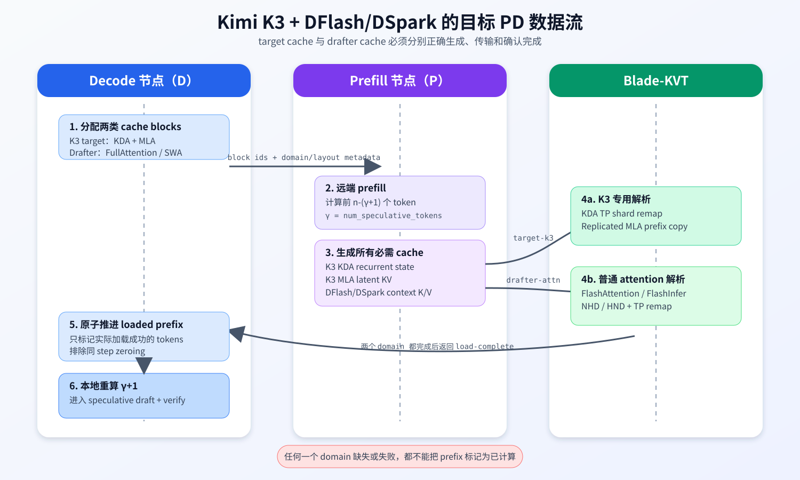
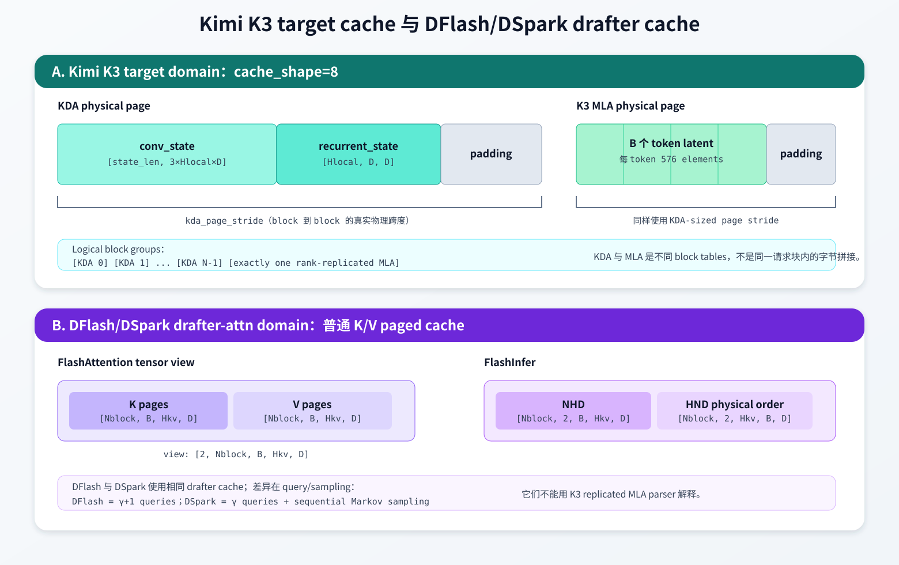
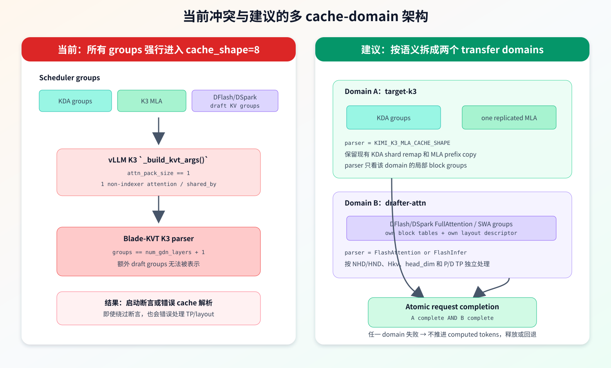
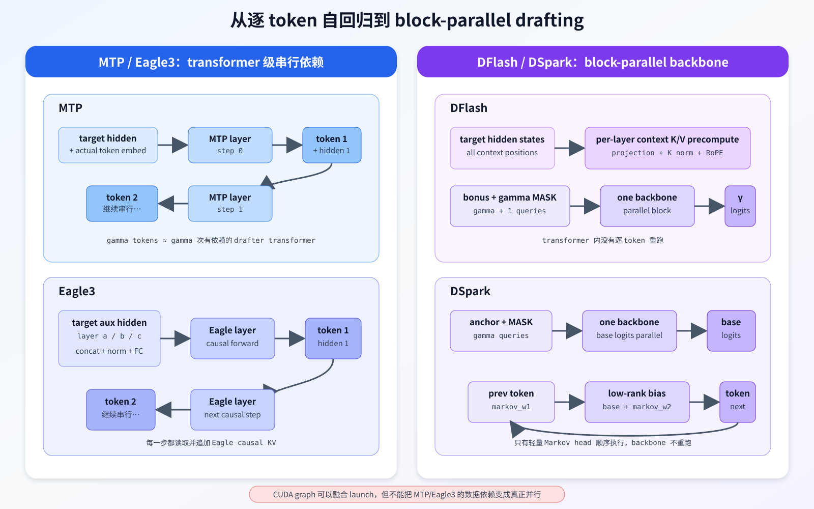
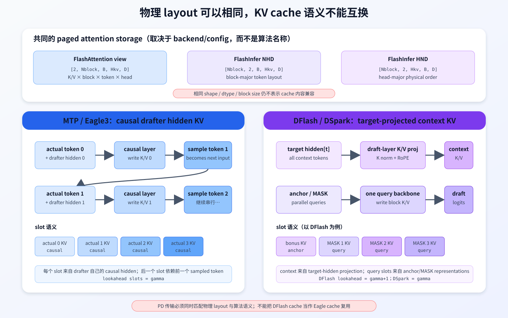

# Kimi K3、DSpark 与 PD 分离

> 状态：设计分析与修改计划
> 日期：2026-07-28
> 结论适用范围：本文所列代码版本，不代表后续分支已经自动具备相同能力。

## 1. 结论摘要

基于以下代码版本的静态审查：

- vLLM `origin/kimi-k3-dev`：`06dac4495eac41e88c3a1be7a74c822afdacba17`
- vLLM `origin/dev/kimi-k3-dev-dspark`：`2fe6085f3d7b7b6676332ebf4af001bdef50dc32`
- vLLM `origin/kimi-k3-dev-draft-support`：`51c73250a7d403f167491991d3eacf06aa62d6f5`
- vLLM `origin/hmz/dspark_v3`：`3883053c0ff59fba6b0ad0c0f31ec48cbc834e5b`
- blade-kvt `main`：`752697132e8b0409ad134724fec2882c9ca57380`

其中 `kimi-k3-dev` 是本文采用的 Kimi K3 权威基线。旧的
`alex/kimi-k3-mla-zeroing-20260722` 已经是它的祖先，不再作为最新结论的
判断基准。两个相关后继分支的关系为：

```text
origin/kimi-k3-dev @ 06dac4495e
├── origin/dev/kimi-k3-dev-dspark @ 2fe6085f3d
│   └── 合入 DFlash/DSpark 运行时与 PD producer context-KV 修复
└── origin/kimi-k3-dev-draft-support @ 51c73250a7
    └── Kimi K3 Eagle3、异构 Eagle KV pages 等独立实验性支持
```

当前能力可以概括为：

| 组合 | 当前状态 | 说明 |
| --- | --- | --- |
| Kimi K3 + 本地推理 | 支持 | KDA + MLA hybrid cache 已接入 vLLM |
| Kimi K3 + PD 分离 | 代码路径支持 | `kimi-k3-dev` 与 blade-kvt main 已实现专用 `cache_shape=8`；上线仍应做目标环境 E2E |
| DFlash/DSpark + 普通 target + PD | 已有 producer 适配 | P 节点跳过 draft token 生成时仍会保留 drafter context KV |
| Kimi K3 + Eagle3 | 独立后继分支已有支持 | `kimi-k3-dev-draft-support` 增加 KDA target state 与异构 Eagle KV pages；不等于 KVT PD 已支持 |
| Kimi K3 + DFlash/DSpark | 运行时代码已共存，组合能力待验证 | `dev/kimi-k3-dev-dspark` 基于 K3 最新基线；仍依赖兼容的 drafter checkpoint，且没有 K3 组合测试 |
| Kimi K3 + DFlash/DSpark + PD | **当前不支持开箱即用** | producer context KV 已修复，但 K3 KVT block-group/layout contract 仍无法表示额外 drafter KV groups |

这里的“不支持”不是因为仍缺一个 branch merge，也不只是缺少测试，而是组合分支
仍存在确定的传输协议契约冲突：

1. 基础 `kimi-k3-dev` 的确会在 `skip_decode_drafting` 时过早返回；组合分支
   `dev/kimi-k3-dev-dspark` 已经把 context KV precompute 移到 return 之前。
2. 该组合提交只修改 spec decode/config/runner，没有修改 KVT cache 注册、group
   分类或 Blade-KVT parser。
3. K3 的 Blade-KVT `cache_shape=8` 仍只接受“若干 KDA groups + 一个 replicated
   MLA group”。
4. DFlash/DSpark 会增加自己的 FullAttention/SlidingWindow KV groups；vLLM
   K3 KVT 注册逻辑与 Blade-KVT K3 parser 仍对 attention/group 数量作严格断言。

因此准确结论是：

```text
K3 + DFlash/DSpark runtime integration：已有分支
K3 + DFlash/DSpark producer context KV：已有修复
K3 + DFlash/DSpark + Blade-KVT PD transfer domains：尚未实现
```



## 2. 术语和边界

### 2.1 P、D 与 PD 分离

- **P 节点（Prefill producer）**：执行 prompt 的主要 prefill，产生可复用 cache。
- **D 节点（Decode consumer）**：接收 cache，完成少量本地重算后进入 decode。
- **KVT**：本文特指 vLLM `HybridConnector` 中的 Blade-KVT backend。
- **target cache**：Kimi K3 主模型的 KDA recurrent state 和 MLA latent KV。
- **drafter cache**：DFlash/DSpark draft model 自己的 attention K/V。

target cache 与 drafter cache 服务于不同模型计算，不能因为它们都由同一个 scheduler 管理，就把它们视为相同 layout。

### 2.2 `gamma`

本文使用：

```text
gamma = num_speculative_tokens
```

对于开启 speculative decoding 的 hybrid target，现有 PD 逻辑让 P 节点只计算：

```text
remote_prefill_tokens = prompt_len - (gamma + 1)
```

D 节点加载远端 cache 后，再本地重算最后 `gamma + 1` 个 token。这样做的目的包括：

- 恢复 hybrid recurrent state 到 D 节点将要使用的位置；
- 为 speculative verification 准备连续的 lookahead 空间；
- 避免直接传输仍会被本地重算覆盖的尾部状态；
- 保持 scheduler、block table 和实际 cache 内容的 token 计数一致。

### 2.3 logical block group、physical tensor 与 physical page

这三个概念必须分开：

- **logical block group**：scheduler 为一种 cache spec 维护的 block table。
- **physical tensor**：worker 实际注册给 attention backend/KVT 的 GPU storage。
- **physical page**：一个 block id 在 storage 中对应的定长字节跨度。

vLLM 可以让多个 layer view 共享同一块 physical tensor，但它们仍可能属于不同 logical block group，并持有不同 block table。Blade-KVT 的 parser 接收的是各 logical group 的 block-id 列表，然后把它们映射到已注册 storage 的物理偏移。

## 3. Kimi K3 的 target cache

Kimi K3 是 KDA + MLA hybrid 模型。两类 cache 的语义完全不同。

### 3.1 KDA cache

每个 KDA layer 的 runtime cache 是两个 tensor：

```text
conv_state:
  [num_blocks, state_len, 3 * local_heads * head_dim]

recurrent_state:
  [num_blocks, local_heads, head_dim, head_dim]
```

其中：

```text
state_len = short_conv_kernel_size - 1 + gamma
local_heads = num_heads / tensor_parallel_size
```

当前 PAI-vLLM 的 KDA conv state 使用 SD layout：

```text
[state_len, Q/K/V channels]
```

而不是 DS layout：

```text
[Q/K/V channels, state_len]
```

Blade-KVT 通过 `kda_conv_dim_first=false` 区分这一点。

一个 KDA physical page 的有效字节可表示为：

```text
[conv state][recurrent state][padding]
```

padding 的存在是为了让不同 cache spec 使用统一 page stride。KVT 通过 `kda_page_stride` 获取 block 之间真正的物理间隔，不能简单用有效 state 大小推导下一个 block 地址。

#### TP remap

当 P/D tensor parallel size 不同时：

- `P TP > D TP`：多个 P rank 的 Q/K/V channel shard 和 recurrent head shard合并到一个 D rank。
- `P TP < D TP`：一个 P rank 的 channel/head shard拆分到多个 D rank。
- `P TP == D TP`：同 rank 的整页一对一复制。

KDA state 代表 prefix 末端的递归状态，不是普通的逐 token KV。因此当前 Blade-KVT 在 `reach_last_token` 后发送 KDA page，而不是把它当成 MLA 一样按 token block 连续流式发送。

### 3.2 MLA cache

K3 fused MLA 的逻辑 tensor shape 是：

```text
[num_blocks, block_size, kv_lora_rank + qk_rope_head_dim]
```

当前 K3 kernel 固定：

```text
kv_lora_rank = 512
qk_rope_head_dim = 64
latent head_size = 576
```

KVT 使用：

```text
hybrid_attn_token_size = 576 * element_size
```

确定每个 token 需要复制的真实 MLA payload。

K3 MLA 是 rank-replicated cache。TP remap 时，Blade-KVT 不应像普通 MHA 那样拼接 KV heads：

- P/D 等 TP：rank 一对一发送。
- P TP 大于 D TP：每个 D rank 只需要一个代表性 P rank 的 MLA 副本。
- P TP 小于 D TP：P 侧 MLA 副本 fan-out 到相应 D ranks。

MLA view 使用 KDA-sized physical page 时，只有页首的真实 MLA prefix 有效：

```text
[token 0 latent][token 1 latent]...[token B-1 latent][padding]
```

Blade-KVT 不复制尾部 padding。

### 3.3 K3 的 KVT `cache_shape=8`

K3 分支强制：

```text
BLLM_KVTRANS_CACHE_SHAPE=8
attn_pack_size=1
```

Blade-KVT 将其解释成：

```text
task block groups:
  0 .. num_gdn_layers-1 : KDA groups
  num_gdn_layers        : exactly one replicated MLA group
```

`parse_block_kimi_k3.cpp` 当前有如下契约：

```cpp
group_idx = num_gdn_layers;
src_groups.size() == group_idx + 1;
dst_groups.size() == group_idx + 1;
src.attn_pack_size == 1;
dst.attn_pack_size == 1;
```

因此 `cache_shape=8` 不是任意 hybrid cache 的通用编码，而是 K3 target cache 的专用协议。

最新 `kimi-k3-dev` 还包含两项容易被旧分支分析遗漏的修复：

- `908a34890d`：Kimi K3 无论初始选择哪种 MLA backend，都先按 128 token
  对齐 hybrid MLA kernel block，避免 backend selection 后 TP4 KDA page 无法整除。
- `d816d19be3`：KVT 的 `token_bytes` 按真实 MLA latent token
  `((kv_lora_rank + qk_rope_head_dim) * element_size)` 计算，再断言
  `token_bytes * manager_block_size == kda_page_stride`；不能再用 kernel
  block 数从 storage 大小反推 manager-block token bytes。

也就是说，K3 MLA 的逻辑 payload、kernel block、manager block 与 KDA-sized
physical page 是四个不同层次。PD parser 必须通过显式的
`hybrid_attn_token_size`、`attn_kernel_blk_ntpb` 和 `kda_page_stride` 做映射。



## 4. DFlash 与 DSpark 的 drafter cache

### 4.1 共同 backbone

当前 Qwen3 DSpark 实现复用 DFlash backbone：

- `DSparkProposer` 继承 `DFlashProposer`。
- `Qwen3DSparkModel` 继承 `DFlashQwen3Model`。
- 两者使用相同的 draft attention layers 和相同的 paged KV cache。

因此 DFlash 与 DSpark 的 cache layout 相同；差别主要在 query 数量和采样过程。

#### 4.1.1 DSpark 的 KV cache 是否属于 GQA layout

对本文审查的 Qwen3 DSpark 实现和公开的
[`deepseek-ai/dspark_qwen3_4b_block7` 配置](https://huggingface.co/deepseek-ai/dspark_qwen3_4b_block7/blob/main/config.json)，
可以回答：**是的，DSpark
drafter 的 attention 采用 GQA，而且它保存的是普通的、显式分离的 K/V cache，
不是 K3 target 前面那些 MLA 层的 latent cache。**

该 checkpoint 的关键配置是：

```text
num_attention_heads = 32
num_key_value_heads = 8
head_dim = 128
```

因此：

```text
每组共享同一份 K/V 的 Query heads 数
  = num_attention_heads / num_key_value_heads
  = 32 / 8
  = 4
```

也就是每 4 个 Query heads 共用 1 个 K head 和 1 个 V head。这正是 4:1 GQA。
对一个 token，drafter 每层需要缓存：

```text
K: [8, 128]
V: [8, 128]
```

而不是缓存 32 份 K 和 32 份 V。执行 attention 时，逻辑上可以理解成把每个 KV
head 提供给对应的 4 个 Query heads：

```text
Q heads  0, 1, 2, 3  ──共享──> K/V head 0
Q heads  4, 5, 6, 7  ──共享──> K/V head 1
...
Q heads 28,29,30,31  ──共享──> K/V head 7
```

这里必须区分两个容易混在一起的概念：

| 概念 | 它回答的问题 | 当前 Qwen3 DSpark |
| --- | --- | --- |
| attention 语义 | Query heads 与 KV heads 如何对应 | 32 个 Q heads、8 个 KV heads，所以是 GQA |
| cache 物理 layout | K/V、block、token、KV head、head dimension 在显存中按什么顺序排列 | 普通 paged K/V cache，可为 FlashAttention/FlashInfer 的 NHD 或 HND |

普通 paged K/V layout 本身并不只属于 GQA。同样的五个逻辑维度也能表示：

- MHA：`num_kv_heads == num_attention_heads`，每个 Query head 有自己的 K/V head；
- MQA：`num_kv_heads == 1`，所有 Query heads 共用一份 K/V；
- GQA：`1 < num_kv_heads < num_attention_heads`，若干 Query heads 共用一份 K/V。

所以最准确的说法不是“看到 `[B, Hkv, D]` 就一定是 GQA”，而是：

> DSpark 使用 MHA/MQA/GQA 这一族的普通显式 K/V paged-cache 格式；本文这个
> Qwen3 DSpark checkpoint 的参数满足 GQA，而且是 4:1 GQA。

它与 K3 target MLA cache 的根本区别如下：

| DSpark drafter GQA cache | K3 target MLA cache |
| --- | --- |
| 每层分别保存 K 和 V | 每个 token 保存压缩 latent 与 RoPE 相关部分 |
| 带有显式 `num_kv_heads` 和 `head_dim` 维度 | 形如 `[block, token, kv_lora_rank + qk_rope_head_dim]` |
| 当前例子每 token、每层保存 `2 × 8 × 128` 个元素 | 当前 K3 例子每 token 保存 576 个有效元素 |
| attention backend 按 NHD/HND 解释 K/V pages | K3 MLA kernel 按专用 latent 格式解释 |
| 不能交给 K3 replicated MLA parser | 不能交给普通 GQA/MHA KV parser |

还要注意，“K3 target 使用 MLA”并不意味着挂在它旁边的 drafter 也必须使用 MLA。
DSpark 是一个独立的 draft model：它读取 target 提供的 hidden states，再用自己的
K/V projection 生成自己的 GQA cache。target cache 与 drafter cache 同时存在，
服务于不同的 attention 计算。

### 4.2 context KV 的产生

DFlash/DSpark 不是直接复用 target 的 K/V。它们执行以下过程：

1. target model forward 产出指定层的 hidden states；
2. drafter 对这些 hidden states 做每层 K/V projection；
3. 对 K 做 RMSNorm 和 RoPE；
4. 按 drafter 自己的 block table/slot mapping 写入 draft KV cache；
5. draft query pass 读取 context KV，并把 query token 的 K/V 写入同一套 paged cache。

因此 PD 场景必须满足下面二选一：

- P 节点产生并传输 drafter context KV；
- D 节点对完整 prefix 重新计算 drafter context KV。

当前设计显然选择第一种，否则 D 节点仍需对整个 prompt 做 drafter prefill，会削弱 PD 分离收益。

### 4.3 DFlash 与 DSpark 的 query 差异

设 `gamma = num_speculative_tokens`：

- DFlash：每个请求运行 `gamma + 1` 个 drafter query。
- DSpark：每个请求运行 `gamma` 个 query，再使用 Markov head 按顺序采样。

这不会改变每层 KV 的基本物理 shape，但会影响：

- lookahead slot 数量；
- 当前 step 写入的 slot mapping；
- CUDA graph capture token 数；
- KDA `state_len` 中为 speculative token 预留的空间；
- P/D 尾部重算长度。

### 4.4 attention backend 对物理 layout 的影响

DFlash/DSpark draft layer 使用普通 FullAttention 或 SlidingWindowAttention cache spec。

FlashAttention 暴露的 tensor view：

```text
[2, num_blocks, block_size, num_kv_heads, head_dim]
```

其中维度 0 为 K/V。底层 storage 可根据 `VLLM_KV_CACHE_LAYOUT` 使用 NHD 或 HND stride。

FlashInfer NHD view：

```text
[num_blocks, 2, block_size, num_kv_heads, head_dim]
```

FlashInfer HND 的物理顺序：

```text
[num_blocks, 2, num_kv_heads, block_size, head_dim]
```

所以“传输 drafter KV”不能只知道它是 DFlash/DSpark，还必须知道：

- attention backend；
- NHD/HND；
- block size；
- local KV heads；
- head dim；
- dtype；
- P/D TP 映射；
- FullAttention 与 SlidingWindow 的 logical group 边界。

## 5. 当前 PD 数据流

目标数据流应是：

```text
1. D scheduler 为 target cache 和 drafter cache 分配 blocks
2. D 将目标 block ids 和 worker/layout 信息发送给 P
3. P 只计算 prompt 前 n-(gamma+1) 个 token
4. P 生成 K3 KDA/MLA cache
5. P 从 target hidden states 生成 DFlash/DSpark context KV
6. KVT 将 target cache 与 drafter cache 传到 D
7. D 等待所有必需 cache domains 完成
8. D 将成功加载的 token 标记为 computed
9. D 本地重算最后 gamma+1 个 token
10. D 进入 speculative decode/verify
```

P 节点在 prompt batch 上不需要生成 draft token，但必须执行步骤 5。

`hmz/dspark_v3` 中的原始提交：

```text
9cc80052c6 Preserve DFlash context KV when skipping drafting
```

已经把 `skip_decode_drafting` 的返回点移动到：

```python
self.model.precompute_and_store_context_kv(...)
```

之后。这是 DFlash/DSpark 与 PD 组合的必要条件。

基础 `kimi-k3-dev` 中，`skip_decode_drafting` 仍在 context KV precompute
之前返回；但后继组合分支 `dev/kimi-k3-dev-dspark` 的
`2fe6085f3d` 已 cherry-pick 该修复，并明确注明 KVT producer 在 prompt batch
上只跳过 query drafting，不能跳过 context KV 写入。

因此 producer 侧步骤 5 在组合分支已具备代码路径。当前未完成的是步骤 6：
KVT 仍没有把 K3 target cache 与 drafter attention cache 作为两个 layout
domain 正确注册和传输。

## 6. 为什么 K3 + DFlash/DSpark + PD 当前冲突

### 6.1 运行时能力已合并，传输能力没有合并

`origin/dev/kimi-k3-dev-dspark` 是 `origin/kimi-k3-dev` 的直接后继，
增加一个聚合提交 `2fe6085f3d`。它包含：

- DFlash drafter max-length accounting；
- P 节点跳过 drafting 时保留 context KV；
- DFlash kernel context-position lookup guard；
- dummy/profile path 的 `skip_decode_drafting`；
- async rejection-count GPU-side 处理；
- DP dummy 的实际 sequence length；
- DFlash 的 `gamma + 1` query-token 预算。

但该提交只改动：

```text
vllm/config/speculative.py
vllm/v1/engine/core.py
vllm/v1/spec_decode/{dflash,eagle,utils}.py
vllm/v1/worker/gpu_model_runner.py
```

它没有改动：

```text
vllm/v1/hybrid_connector/kvtbackend.py
vLLM KVT cache-domain/group serialization
blade-kvt cache_shape=8 parser
```

所以问题已经从“两个分支没有合并”收敛为“runtime 已合并，但 transfer
domain/layout 尚未集成”。

### 6.2 K3 parser 不接受额外 drafter groups

加入 drafter 后，scheduler 看到的 cache groups 类似：

```text
[KDA group 0]
[KDA group 1]
...
[K3 MLA group]
[draft FullAttention group 0]
[draft FullAttention/SWA group 1]
...
```

而 Blade-KVT K3 parser 只接受：

```text
[KDA groups...][one K3 MLA group]
```

额外 group 会触发 `src_groups.size() == num_gdn_layers + 1` 断言。

### 6.3 vLLM 注册阶段也可能先失败

K3 `_build_kvt_args()` 强制 `attn_pack_size == 1`，并要求每个 `KVCacheTensor.shared_by` 中只有一个 non-indexer attention entry。

`dev/kimi-k3-dev-dspark` 尚未包含 `kimi-k3-dev-draft-support` 的
heterogeneous-page grouping。vLLM 统一 page size 并构造 shared physical tensor
时，K3 MLA layer 和少量 drafter attention layers 可能被放进同一个
`shared_by`。这会使 non-indexer attention 数量大于 1，在进入 Blade-KVT
之前就失败。

即使 cache grouping 恰好把它们分开，Blade-KVT 的 block-group 数量断言仍会失败。

### 6.4 基础分支缺 drafter context KV，组合分支已修复

基础 `kimi-k3-dev` 的逻辑：

```text
skip_decode_drafting
  -> return
  -> 没有 precompute_and_store_context_kv
```

结果是 P 节点没有可供传输的 drafter prefix cache。组合分支
`dev/kimi-k3-dev-dspark` 已将逻辑改为：

```text
precompute_and_store_context_kv
  -> if skip_decode_drafting: return
```

这消除了 producer 侧的确定性缺失，但还没有提供 drafter cache 的 KVT
layout descriptor、block-group 过滤与完成语义。不能因为 cache 已经写入 GPU，
就推断它已经被正确传到 D 节点。

### 6.5 load 与 zeroing 必须覆盖新增 group

D 节点为远端 cache 分配的新 blocks 可能同时进入：

```text
SchedulerOutput.new_block_ids_to_zero
```

外部 load 和 zero kernel 如果作用于同一 block，会存在覆盖竞态。组合实现必须保证：

- 所有计划从 KVT 加载的 target 和 drafter blocks，都从同一个 scheduler output 的 zero list 中排除；
- 只排除 load target blocks，不排除 store blocks；
- block id 如果是 per-group namespace，过滤必须携带 group/domain 信息；
- load 失败时不能把未成功加载的 tokens 标记为 computed。

### 6.6 缺少组合测试

在 `dev/kimi-k3-dev-dspark` 与 blade-kvt main 中均未找到 Kimi K3 与
DFlash/DSpark 组合 PD 的 cache parity/E2E 测试或显式支持声明。组合提交本身
也没有新增 KVT 测试。

作为对照，`kimi-k3-dev-draft-support` 确实新增了 Kimi K3 Eagle3 model/config
支持，并为 target/draft page size 不同的场景增加
`test_heterogeneous_full_attention_mamba_kv_cache`。但该分支没有修改 hybrid
connector 或 Blade-KVT，因此它证明的是“本地 speculative cache 可以异构
分配”，不能作为“K3 Eagle3 或 DFlash/DSpark 已支持 PD 传输”的证据。



## 7. 修改计划

### 7.1 总体原则

建议把传输拆成两个逻辑 cache domain：

```text
target-k3 domain:
  KDA groups + one replicated MLA group
  parser = KIMI_K3_MLA_CACHE_SHAPE

drafter-attn domain:
  DFlash/DSpark FullAttention/SWA groups
  parser = standard FlashAttention/FlashInfer parser
```

两个 domain 可以：

1. 复用同一条底层 transport/session，但具有独立 layout descriptor 和完成信号；或
2. 使用两个 KVT client/server 实例，并在 vLLM connector 层聚合完成状态。

不建议简单取消 `num_gdn_layers + 1` 断言后，把 drafter groups 当成 K3 MLA 继续解析。K3 MLA 是 replicated latent cache，而 drafter cache 是普通 K/V cache，TP remap、token size 和布局都不同。

### 7.2 Phase 0：建立可合并基线

目标：基于已经存在的 K3 + DSpark/DFlash 组合分支建立可复现基线，不重复做
已经完成的 cherry-pick。

工作项：

1. 以 `origin/dev/kimi-k3-dev-dspark@2fe6085f3d` 为 runtime baseline，
   核对它的父提交必须是目标 `kimi-k3-dev@06dac4495e` 或更新的 K3 基线。
2. 验证聚合提交已经包含：
   - P 节点跳过 drafting 时仍写 context KV；
   - dummy/profile path 对 `skip_decode_drafting` 的处理；
   - rejection count 的 GPU-side 处理；
   - DFlash max length、DP dummy sequence length 和 CUDA graph 修复。
3. 保留并回归 `kimi-k3-dev` 的最新 KVT 修复：
   - Kimi K3 MLA 128-token 对齐；
   - MLA token bytes 与 KDA page stride 校验；
   - Mamba block-id 取得逻辑；
   - KV block zeroer ID buffer race 修复。
4. 从 `kimi-k3-dev-draft-support` 评估、按最小依赖移植“异构
   FullAttention + Mamba page allocation”，不要直接合并整条 Eagle3 分支。
5. 明确支持的 drafter checkpoint：
   - DFlash checkpoint architecture；
   - DSpark 当前 `Qwen3DSparkModel` 限制是否继续保留；
   - checkpoint hidden size、vocab、embedding/lm_head 是否能与 K3 target 对齐。

交付条件：

- K3 不开 PD 时能分别启动 DFlash 和 DSpark。
- 普通 target 的既有 DFlash/DSpark + PD 测试不回退。
- K3 不开 speculative decoding 时既有 PD 行为不回退。

### 7.3 Phase 1：引入 cache-domain 描述

目标：不要再用一个全局 `cache_shape` 隐式描述所有 cache groups。

建议在 vLLM hybrid connector 内新增类似结构：

```python
@dataclass
class CacheTransferDomain:
    name: str
    group_ids: list[int]
    layer_names: list[str]
    layout_kind: Literal["kimi_k3_target", "flash", "flashinfer"]
    cache_shape: int
    block_size: int
    token_bytes: list[int]
    physical_tensors: dict[str, torch.Tensor]
```

修改位置：

- `vllm/v1/hybrid_connector/__init__.py`
  - group 分类不能只返回 `gdn/attn`；
  - 需要区分 target K3 MLA 与 drafter attention；
  - 使用 model tag、layer-name set 或显式 cache owner，避免依赖脆弱的字符串匹配。
- `vllm/v1/hybrid_connector/kvtbackend.py`
  - `_build_kvt_args()` 拆成按 domain 构建；
  - K3 特有参数只传给 target-k3 domain；
  - drafter domain 使用自身 backend/layout/head metadata。
- `vllm/v1/hybrid_connector/engine_proxy.py`
  - worker info、block ids 和完成状态携带 domain id。

关键不变量：

- 每个 logical cache group 恰好属于一个 transfer domain。
- 一个 domain 的 parser 只能接收该 domain 声明的 group ids。
- domain 之间不能通过列表位置隐式推断类型。

### 7.4 Phase 2：隔离物理注册与 block table

目标：避免 K3 MLA 与 drafter attention 在 `KVCacheTensor.shared_by` 中被误认为一个 attention pack。

需要评估并实现以下方案之一：

#### 方案 A：在 KV cache config 阶段隔离 storage pool

- target K3 groups 使用 KDA-sized physical pages；
- drafter groups 使用普通 attention pages；
- scheduler 维护独立 block pools/block tables；
- KVT 注册天然按 domain 分开。

可从 `kimi-k3-dev-draft-support@0521f2813a` 的 page-size bucket、
`_get_heterogeneous_kv_cache_config()` 和相应单元测试开始，而不是从零重写
allocator；但需要补充 owner/domain 分类，不能只按 page size 猜测传输语义。

优点：

- layout 清晰；
- parser 简单；
- 不会把 K3 padding 施加到所有 drafter pages。

代价：

- 需要扩展当前“统一 page size/共享 physical tensor”的分组与分配逻辑；
- scheduler 的多 pool 支持和 prefix cache 行为需要系统验证。

#### 方案 B：允许共享 storage，但注册 domain-specific views

- 保留统一 page stride；
- 为 target 与 drafter 建立互不混淆的 flat view；
- 每个 domain 携带自己的 logical group id 到 physical offset 映射；
- 同一 storage 可被多个 KVT domain 注册，但禁止发送重叠的有效区域。

优点：

- 对 scheduler block allocation 改动较小。

风险：

- 同一物理 storage 多次注册；
- block-id namespace 和 storage offset 更难证明正确；
- zeroing、abort 和复用时更容易出现跨 domain 竞态。

建议优先验证方案 A；若当前 scheduler 架构成本过高，再采用方案 B。

### 7.5 Phase 3：扩展 Blade-KVT 多 domain 传输

目标：让 K3 target parser 与普通 attention parser 在同一请求中协作，而不是互相替代。

blade-kvt 修改点：

- Python API：
  - `blade_kvt/kv_transfer_impl.py`
  - client/server constructor 接受 domain descriptors，或允许创建命名子实例。
- pybind/API：
  - `kvtransfer/kvtransfer_pybind.cpp`
  - 序列化 domain id、layout kind、group range 和完成信号。
- worker metadata：
  - `kvtransfer/include/common.h`
  - `kvtransfer/src/common.cpp`
  - 不再假设一个 worker 只有一个 `cache_shape`。
- parser dispatch：
  - `kvtransfer/src/tx_stub.cpp`
  - 按 domain 选择 `parse_kimi_k3_*`、FlashAttention 或 FlashInfer parser。
- K3 parser：
  - `kvtransfer/src/parse_block_kimi_k3.cpp`
  - 保持其内部 `KDA + one MLA` 契约；
  - 断言应针对 target-k3 domain 的局部 groups，而不是整个请求的全部 groups。

完成语义：

```text
request load complete =
  target-k3 domain complete
  AND drafter-attn domain complete
```

任何必需 domain 失败，都不能把整个 prefix 标记为已加载。

### 7.6 Phase 4：补齐 producer/consumer 生命周期

#### P 节点

修改 `vllm/v1/spec_decode/dflash.py`：

```text
prompt batch + KVT producer:
  build context slot mapping
  precompute_and_store_context_kv
  skip query drafting
  expose drafter domain as ready
```

需要保证：

- context slot mapping 来自 drafter cache group，而不是 K3 MLA group；
- padding request/CUDA graph dummy request 不写真实 cache；
- partial prefix hit 时只写缺失区间；
- multimodal hidden-state selection 与 target layer ids 一致；
- async scheduler 不会在 context KV 尚未 ready 时触发 send。

#### D 节点

需要保证：

- target 与 drafter domain 都完成后才推进 `num_computed_tokens`；
- 本地重算 `gamma + 1` 时使用正确的 target/drafter block tables；
- load 失败、超时和 P abort 时，两类 blocks 都能释放；
- fallback local prefill 会覆盖两类 cache，不保留半完成的远端状态。

### 7.7 Phase 5：zeroing、复用与一致性

目标：外部 load 不能被同 step 的 zero kernel 覆盖。

修改方向：

1. 每个 backend/domain metadata 暴露 load target block ids。
2. `HybridScheduler.build_connector_meta()` 构建 metadata 后，立即从实际发送给 worker 的 `SchedulerOutput.new_block_ids_to_zero` 中过滤。
3. 对多 group namespace 使用：

```text
(cache_group_id, block_id)
```

而不是裸 `block_id`。
4. 保留现有 `sched_discard_zero_block_ids()`，它保护 pending-list 阶段；同时增加 same-output filtering，保护 block ids 已经被 `take_new_block_ids()` drain 的窗口。
5. 只过滤 load blocks，不能过滤 P 侧 store blocks。
6. 只有实际成功加载的 token 才能被 `mark_loaded/_step_loaded` 计入 computed。

还需要覆盖：

- block reuse；
- request abort；
- prefix-cache hit；
- partial block；
- null block；
- CUDA graph padding block；
- P/D 异步完成顺序。

### 7.8 Phase 6：配置检查、可观测性与回退

启动时应明确拒绝不支持的组合：

- K3 + KVT 但 Blade-KVT 缺少 K3 ABI；
- DSpark checkpoint architecture 不支持；
- P/D draft backend layout 不兼容；
- P/D block size 不可映射；
- TP remap 比例不合法；
- K3 target domain 或 drafter domain 缺失；
- multimodal placeholder 被 `n-(gamma+1)` 边界切开。

建议新增日志：

```text
domain name
group ids
layer names
layout kind
registered storage address/size
page stride
token bytes
P/D TP mapping
scheduled/load/ready token count
zero-excluded block ids count
```

建议增加 feature flag：

```text
VLLM_KIMI_K3_DRAFTER_PD=0/1
```

在完成全部测试前默认关闭。关闭时：

- 明确报错，或
- 自动回退到 D 节点本地 prefill；

不能静默进入只加载 target、不加载 drafter 的半支持状态。

## 8. 测试计划

### 8.1 单元测试

vLLM：

- cache group 能稳定分为 target-k3 与 drafter-attn domains；
- domain-specific block ids 不串组；
- `skip_decode_drafting` 仍写 context KV；
- partial prefix hit 只填充缺失 draft slots；
- load blocks 从 same-output zero list 排除；
- load failure 不推进 computed tokens；
- abort 释放所有 domain 的 blocks。

Blade-KVT：

- K3 target domain 仍满足 `KDA + one MLA`；
- drafter FlashAttention NHD/HND block parsing；
- drafter FlashInfer NHD/HND block parsing；
- equal TP、P TP > D TP、P TP < D TP；
- incomplete last block；
- manager block size 与 kernel block size不同；
- 两个 domain 的完成信号乱序到达。

### 8.2 cache correctness 测试

对同一 prompt 比较：

1. 单机本地 prefill 后的 target/drafter cache；
2. P 计算、KVT 传输、D 尾部重算后的 target/drafter cache。

比较范围：

- KDA conv state；
- KDA recurrent state；
- K3 MLA 有效 prefix；
- 每层 drafter K；
- 每层 drafter V；
- 最后 partial block 的有效 slots；
- padding 区域不作为模型正确性比较对象，但要验证不会被读取。

建议保留物理页 dump 工具，同时增加 logical slot dump，避免只比较 flat storage 时被 padding 干扰。

### 8.3 端到端矩阵

至少覆盖：

| 维度 | 取值 |
| --- | --- |
| method | DFlash、DSpark |
| target cache dtype | BF16、K3 支持的 FP8 模式 |
| draft cache dtype | BF16、FP8（若 checkpoint/backend 支持） |
| P/D TP | 相等、P>D、P<D |
| draft backend | FlashAttention、FlashInfer |
| cache layout | NHD、HND |
| gamma | 1、4、checkpoint 最大值 |
| prompt | 短 prompt、跨 block、最后一块不满、长上下文 |
| scheduler | sync、async/substep |
| prefix cache | miss、full hit、partial hit |
| modality | text、K3 image prompt |
| failure | P abort、load timeout、一个 domain 失败 |

正确性判据：

- 与不做 PD 的同配置输出 token 一致；
- verification logits 在容差内一致；
- acceptance length 分布无异常下降；
- 无 NaN、无 stale KV、无非法 block access；
- 不出现同 block 的 load/zero 覆盖；
- request 完成/取消后无 block leak。

### 8.4 性能与资源验收

需要测量：

- P prefill latency；
- target 与 drafter 各自传输字节数；
- 两 domain 传输是否可并行；
- D wait time；
- D 本地 `gamma + 1` 重算耗时；
- TTFT、TPOT；
- GPU cache memory；
- 注册同一 storage 多次时的额外开销；
- P/D TP remap 的 copy kernel 时间。

组合能力只有在“正确传输 drafter KV”后仍显著优于 D 节点完整 drafter prefill，才有上线价值。

## 9. 分阶段提交建议

建议把实现拆成可独立审查和回滚的提交：

1. `[SpecDecode] Preserve DFlash context KV on KVT producers`
2. `[Core] Classify target and drafter KV cache domains`
3. `[KVT] Build domain-specific cache registration metadata`
4. `[Blade-KVT] Support multi-layout domains per PD request`
5. `[PD] Aggregate K3 target and drafter load completion`
6. `[BugFix] Exclude all hybrid load blocks from same-step zeroing`
7. `[Test] Add Kimi K3 DFlash/DSpark PD cache parity coverage`
8. `[Docs] Document Kimi K3 drafter PD layout and constraints`

每个提交都应保持：

- K3 无 speculative decoding 的 PD 可用；
- 非 K3 的 DFlash/DSpark PD 可用；
- feature flag 关闭时不改变现网行为。

## 10. 最终验收标准

只有同时满足以下条件，才能声明支持 Kimi K3 + DFlash/DSpark + PD：

1. P 节点实际生成了 target 与 drafter prefix cache。
2. KVT 使用正确的独立 layout 传输了两类 cache。
3. D 节点在两类 cache 都完成后才推进 computed token。
4. D 本地正确重算最后 `gamma + 1` 个 token。
5. P/D TP 相等和不相等场景均通过 cache parity 测试。
6. FullAttention/SWA、FlashAttention/FlashInfer 的 group 和 layout 均未混淆。
7. load blocks 不会被 zero kernel 覆盖。
8. abort、timeout、fallback 和 prefix-cache reuse 不泄漏 blocks。
9. 端到端输出与本地 prefill 基线一致。
10. 存在持续运行的组合回归测试，而不是只靠一次手工验证。

在这些条件完成前，配置层应明确拒绝该组合或回退到 D 节点本地 prefill。

## 11. DFlash/DSpark 与 MTP/Eagle3 的实现和 KV cache 对比

### 11.1 核心区别

四种方法都属于“先由 drafter 提议、再由 target model 验证”的 speculative decoding，但 drafter 内部的 token 依赖完全不同：

```text
MTP / Eagle3:
  使用小型 transformer 逐 token 自回归

DFlash:
  先构造完整 context KV，再用一次 block-parallel transformer forward
  同时计算整个 draft block

DSpark:
  DFlash-style block-parallel transformer
  + 一个低秩 Markov head 顺序注入 token 依赖
```

因此 DFlash/DSpark 最重要的变化不是换了一种 KV tensor shape，而是把：

```text
γ 次有 transformer 依赖的串行 drafting
```

改成：

```text
一次 context-KV precompute
+ 一次并行 query-block transformer
+ 可选的轻量顺序采样
```



### 11.2 总体对比

| 维度 | MTP | Eagle3 | DFlash | DSpark |
| --- | --- | --- | --- | --- |
| Heavy drafter forward | 逐 token | 逐 token | 整个 block 一次 | 整个 block 一次 |
| draft token 间依赖 | 完整 MTP transformer | 完整 Eagle transformer | 通常没有直接自回归依赖 | 低秩 Markov head 串行依赖 |
| target 信息 | 通常最终 hidden；也可能是模型特有 multi-stream hidden | 多个 target 中间层 hidden 融合 | 一个或多个 target hidden，用来构造 context KV | 同 DFlash |
| drafter 输入 token | 实际 token embedding | 实际 token embedding | bonus token + MASK queries | anchor token + MASK queries |
| prefix drafter KV 是否依赖 block 外 next token | 是，当前 `EagleProposer` 路径使用 shifted token | 是 | 否，context KV 只依赖 target hidden | 否，同 DFlash |
| drafter query slots | `gamma` | `gamma` | `gamma + 1` | `gamma` |
| attention 语义 | causal | causal | 默认可 non-causal，也支持 causal 配置 | 同 DFlash |
| checkpoint 来源 | 通常是 target checkpoint 自带 MTP modules | 单独训练的 Eagle3 head/model | DFlash block-draft checkpoint | DSpark checkpoint + Markov weights |
| draft indexer | 部分模型支持 | 部分模型支持 | 当前路径置空 | 继承 DFlash |
| Pipeline Parallel | 依 MTP 模型实现 | drafter 放在最后 PP rank | 当前显式不支持 PP | 继承 DFlash 限制 |

这里的 `gamma` 表示 `num_speculative_tokens`。

### 11.3 MTP：原生 next-token prediction module

MTP 通常由 target checkpoint 自带，是模型训练阶段就存在的 next-token prediction module。

一个典型 MTP step 可以抽象为：

```text
当前实际 token embedding
          +
target/draft hidden state
          ↓
concat + norm + FC
          ↓
一个 MTP transformer layer
          ↓
next hidden + next-token logits
```

例如 Qwen3-Next MTP 会执行：

```python
inputs_embeds = pre_fc_norm_embedding(inputs_embeds)
hidden_states = pre_fc_norm_hidden(hidden_states)
hidden_states = torch.cat([inputs_embeds, hidden_states], dim=-1)
hidden_states = self.fc(hidden_states)
hidden_states = self.layers[current_step_idx](...)
```

如果 checkpoint 提供多个 MTP layers：

```text
current_step_idx = spec_step_idx % num_mtp_layers
```

不同 speculative step 可以使用不同 layer；只有一个 MTP layer 时则循环复用。

在 vLLM V1 中，MTP 复用 `EagleProposer` 的主循环。生成 `gamma` 个 draft tokens 时，逻辑上仍然存在：

```text
第一次 draft forward
+ gamma-1 次逐 token draft forward
```

fused multi-step CUDA graph 可以减少 kernel launch 和 CPU 调度开销，但不会消除 token 间的数据依赖。

### 11.4 Eagle3：融合 target 多层 hidden 的自回归小模型

Eagle3 的主要特点是读取 target model 多个中间层的 hidden states：

```text
target layer a hidden ─┐
target layer b hidden ─┼─ concat / norm / FC → Eagle hidden
target layer c hidden ─┘
```

代码通过：

```text
eagle_aux_hidden_state_layer_ids
```

指定目标层。典型 Eagle3 model 会将多个 target hidden 拼接后投影到 drafter hidden size：

```python
fc_input_size = target_hidden_size * num_aux_hidden_states
hidden_states = self.fc(hidden_states)
```

随后把：

```text
实际 token embedding + Eagle hidden
```

输入轻量 causal Eagle transformer。

后续每个 draft step 使用：

- 前一个实际 sampled draft token；
- 前一个 Eagle step 返回的 hidden state；
- 已经写入的 Eagle causal KV cache。

因此第 `i+1` 个 draft token 经过完整 Eagle transformer 依赖第 `i` 个 token。

针对 Kimi K3，`kimi-k3-dev-draft-support` 进一步做了两类专门适配：

1. Kimi K3/Kimi Linear model 暴露 Eagle3 所需的 aux hidden states，并在
   KDA forward 中保留正确的 target state；
2. KV cache allocator 允许 target attention、draft Eagle attention 与
   Mamba/KDA 使用不同 page size，按 page size bucket 分配异构 physical slots。

第二点是 DFlash/DSpark 集成可复用的重要先例，但仍只解决本地 allocation。
该分支没有扩展 KVT 的 K3 `cache_shape=8`，所以不能把“Eagle3 本地可运行”外推为
“Eagle3 已可与 K3 同时开启 PD”。

### 11.5 DFlash：context KV 预计算 + query block 并行

DFlash 不对整个 prefix 运行普通 drafter causal backbone。它先将 target hidden states 转换为每个 DFlash attention layer 的 context K/V。

流程是：

```text
target hidden states
        ↓
每个 DFlash layer 的 K/V projection
        ↓
K RMSNorm + RoPE
        ↓
按 drafter block table 写入 context KV cache
```

当前实现把多个 layer 的 projection 合并计算，产生：

```text
all_k:
  [draft_layers, context_tokens, local_kv_heads, head_dim]

all_v:
  [draft_layers, context_tokens, local_kv_heads, head_dim]
```

完成 context cache 后，每个请求构造：

```text
[bonus token, MASK1, MASK2, ..., MASK-gamma]
```

即：

```text
num_query_per_req = gamma + 1
```

这些 query 在一次 DFlash transformer forward 中并行执行。DFlash 不从 bonus query 采样，而是从后面的 `gamma` 个 MASK query 输出中取得 draft logits。

当前配置默认允许 DFlash 使用 non-causal query-block attention；checkpoint 也可以显式配置 causal 模式。无论是哪一种，都没有 Eagle3/MTP 那种“每生成一个 token 就重新运行一次 transformer”的执行链。

### 11.6 DSpark：将串行依赖下沉到 Markov head

DSpark 继承 DFlash backbone 和 cache 生成方式：

```text
DSparkProposer(DFlashProposer)
Qwen3DSparkModel(DFlashQwen3Model)
```

它每个请求只运行：

```text
num_query_per_req = gamma
```

query block 类似：

```text
[anchor token, MASK1, ..., MASK-(gamma-1)]
```

backbone 一次性输出全部 base logits。然后 DSpark 顺序执行：

```python
prev = next_token_ids
for step in range(gamma):
    markov_embed = markov_w1(prev)
    logits = base_logits[step] + markov_w2(markov_embed)
    token = argmax(logits)
    prev = token
```

所以 DSpark 的依赖结构是：

```text
Transformer backbone：并行
Markov sampling head：串行
```

与 Eagle3/MTP 相比，串行部分不再重新运行 attention、MLP 和 drafter KV 读写，只运行一个低秩 token transition head。

### 11.7 target hidden states 的使用方式

Eagle3、DFlash 和 DSpark 都可能请求 target 的多个中间层 hidden states，但用途不同。

#### Eagle3

```text
multi-layer target hidden
        ↓ fusion
作为 Eagle transformer 的 hidden input
        ↓
每个自回归 step 继续传播 Eagle hidden
```

#### DFlash/DSpark

```text
multi-layer target hidden
        ↓ fusion
作为 context K/V projection 的输入
        ↓
构造每个 draft layer 的整段 context cache
```

query-block backbone 的 token 输入主要是 bonus/anchor 与 MASK embeddings；它通过 attention 读取由 target hidden 投影得到的 context KV。

#### MTP

MTP 通常使用 target 最后一层 hidden，也可能使用模型特有的 multi-stream residual。例如当前分支对 MTP HC multi-stream 有独立路径：

```text
[tokens, hc_count * hidden_size]
```

这与 Eagle3 的通用 aux-hidden 拼接机制是分开的。

### 11.8 KV cache 的物理 layout

如果使用相同 attention backend、block size、dtype、KV heads 和 head dim，那么四种方法的 draft attention cache 可以拥有相同物理 tensor layout。

FlashAttention view：

```text
[2, num_blocks, block_size, local_kv_heads, head_dim]
```

FlashInfer NHD：

```text
[num_blocks, 2, block_size, local_kv_heads, head_dim]
```

FlashInfer HND physical order：

```text
[num_blocks, 2, local_kv_heads, block_size, head_dim]
```

draft cache 总字节数近似：

```text
num_draft_layers
× num_blocks
× block_size
× 2
× local_kv_heads
× head_dim
× dtype_size
```

所以不能仅根据 “MTP/Eagle3/DFlash/DSpark” 这个算法名称推导显存大小。真正决定大小的是：

- draft layer 数；
- 每层 KV heads/head dim；
- cache dtype；
- block size；
- attention backend；
- NHD/HND；
- FullAttention/SWA；
- 是否存在额外 indexer cache。

`kimi-k3-dev-draft-support` 的 heterogeneous-page 修改也验证了一个关键事实：
K3 target MLA、Mamba/KDA 与 Eagle drafter 的 page size 不必相同。它把相同
page size 的 layers 放入同一 bucket，再为每个异构 physical-page slot 分配
独立 tensor。对 DFlash/DSpark 来说，这比强制把 draft page padding 到 KDA
page stride 更合理；但 KVT 还需要同样的 domain/page-size 描述才能正确传输。

### 11.9 KV cache 的内容语义

物理 shape 相同不代表 cache 内容可以互换。

#### MTP/Eagle3：drafter causal hidden KV

MTP/Eagle3 的每个 cache slot 来自正常 causal drafter forward：

```text
实际 token embedding
+ 上一个 drafter hidden
        ↓
drafter transformer layer
        ↓
当前 token 的 K/V
```

它具有以下特点：

- 按实际 token 顺序逐步产生；
- 每个 draft step 追加一个或少量实际 token slots；
- 后续 K/V 依赖前面已采样的 draft tokens；
- cache 表示 drafter 自己的 causal hidden-state 历史。

对于 tree speculative decoding，如果接受的 tree nodes 不连续，vLLM 还需要通过 `copy_kv_cache_slots()` 把接受节点的 KV 压缩到连续位置。

#### DFlash/DSpark：target-projected context KV

DFlash/DSpark 的 context slot 来自：

```text
KV_projection(target_hidden_at_position_t)
```

而不是：

```text
KV_projection(drafter_causal_hidden_at_position_t)
```

query slots 则来自 bonus/anchor/MASK query representations。它们是本次并行 query block 的 attention K/V，不等同于 Eagle3/MTP 中由实际 sampled token 自回归产生的历史 KV。

target model 完成 verify 后，后续 DFlash/DSpark propose 会利用新的 target hidden states 再次填充相应 context positions，使被接受部分转化为新的 target-projected context KV。



### 11.10 Prefix cache、最后一个 block 与 next-token hash

这一节讨论的是 prefix-cache lookup 中的以下逻辑：

```python
if use_eagle and computed_blocks[0]:
    for computed in computed_blocks:
        computed.pop()
```

它位于 `vllm/v1/core/single_type_kv_cache_manager.py` 的
`FullAttentionManager.find_longest_cache_hit()`。理解它时必须先区分物理 KV
tensor 与 scheduler 的逻辑 block。

#### 11.10.1 一个 logical block 覆盖 target 和 drafter layers

如果只观察 target attention layer 的物理 tensor，那么由 token
`[a, b, c, d, e]` 生成的 target K/V 的确完全不依赖下一个 token。这一点对
causal target model 始终成立。

但 scheduler 中的 `KVCacheBlock`/`block_id` 是一个逻辑分配单位，而不是某一层
的一小段 tensor。同一个 block ID 会索引同一 KV cache group 中各 attention
layer 的物理 block。启用 speculative drafter 后，这些 layers 还包括 drafter
attention layers：

```text
logical block_id = 42

target layer 0, block 42  -> target KV slots
target layer 1, block 42  -> target KV slots
...
draft layer 0, block 42   -> drafter KV slots
draft layer 1, block 42   -> drafter KV slots
```

`GPUModelRunner.get_kv_cache_spec()` 会枚举已经注册的
`AttentionLayerBase`，而 `EagleProposer.load_model()`、
`DFlashProposer.load_model()` 会把新增的 draft attention layers 注册进这套配置。
prefix-cache lookup 对 logical block 作出一次命中判断，等价于承诺这个 block
对应的所有相关 layer cache 都可复用，而不是只承诺 target cache 正确。

#### 11.10.2 EAGLE/MTP 为什么使用 shifted token

设 target token sequence 为：

```text
a b c d e
```

target forward 得到：

```text
h_a h_b h_c h_d h_e
```

并从 `h_e` 的 logits 中采样出下一个 token `f`。EAGLE 的目标不是再次预测
已经产生的 `f`，而是利用：

```text
(h_e, f) -> 预测 f 对应的下一时刻 feature -> draft 出 g
```

仅使用 `h_e` 不能确定下一 feature，因为同一个分布可能采样出不同 token，
不同采样分支会产生不同的下一 feature。已经采样出的 `f` 用来消除这项 feature
uncertainty；它不是对未来 label 的泄漏。

因此 `EagleProposer.propose()` 将 token 相对 target hidden state 提前一个时间步：

```python
self.input_ids[: num_tokens - 1] = target_token_ids[1:]
self.input_ids[last_token_indices] = next_token_ids
```

对于单请求，最终对齐关系是：

```text
target hidden:  h_a h_b h_c h_d h_e
EAGLE token:      b   c   d   e   f

input pair:     (h_a,b) (h_b,c) (h_c,d) (h_d,e) (h_e,f)
```

第一行 shift 后最后一个 buffer slot 只是临时旧值；第二行会立即用该请求实际的
`next_token_ids` 覆盖它。因此最终输入是 `[b, c, d, e, f]`，不是
`[b, c, d, e, e]`。

#### 11.10.3 为什么 EAGLE prefix block 依赖 block 外 token

假设 `block_size = 5`。target layer 的 block 内容是：

```text
target block:
  KV(a), KV(b), KV(c), KV(d), KV(e)
```

它不依赖 `f`。但同一个 logical block 下的 EAGLE draft layer 内容来自：

```text
draft block:
  KV(h_a,b)
  KV(h_b,c)
  KV(h_c,d)
  KV(h_d,e)
  KV(h_e,f)  <- 最后一个 slot 依赖 block 外的 f
```

考虑两个请求：

```text
旧请求: a b c d e f_1 ...
新请求: a b c d e f_2 ...
```

普通 block hash 只覆盖 `[a, b, c, d, e]`，所以两者会得到相同 hash。
target block 仍然正确，但旧 EAGLE block 的最后一个 slot 是
`KV(h_e, f_1)`，新请求需要的是 `KV(h_e, f_2)`。复用它会让后续 drafter
attention 读取不属于当前请求分支的旧 K/V。

理论上可以只重算最后一个 draft slot，同时继续复用 target block 和前四个
draft slots。但当前 prefix cache 和 `num_computed_tokens` 是 block 对齐的，不能
表示“命中一个 block 的 4/5”；同时普通 prefix cache 不保存完整 target hidden
state `h_e`，也不能一般性地从 target K/V 反推出 `h_e`。因此当前实现选择 pop
整个最后 block，让 target forward 重新产生 hidden states，再用当前真实 next
token 重建 drafter K/V。

#### 11.10.4 为什么只 pop 最后一个命中 block

vLLM 的 block hash 是链式的：

```text
H0 = Hash(NONE, block0_tokens)
H1 = Hash(H0,   block1_tokens)
H2 = Hash(H1,   block2_tokens)
```

如果 `block1` 也命中，那么 `block1` 的第一个 token 已经验证了 `block0` 所需的
next token。因此除最后一个命中 block 外，前面每个 block 的跨边界依赖都由其
后继命中 block 间接确认。只有最后一个命中 block 没有后继命中结果来证明边界
外 token 相同，所以只需 pop 一个 block。

#### 11.10.5 把 next token 纳入 hash 为什么可以取消 pop

对 EAGLE block 使用：

```text
H0' = Hash(NONE, [a, b, c, d, e, f])
```

而不是：

```text
H0 = Hash(NONE, [a, b, c, d, e])
```

就可以让 cache key 覆盖生成该 draft KV block 所需的全部输入。当 `f_1 != f_2`
时 hash 不同，错误的 block 不会命中；hash 命中则同时证明 target token 与
EAGLE shifted next token 一致，因此无需再保守地 pop。

当前实现位于 `vllm/v1/core/kv_cache_utils.py` 的
`get_request_block_hasher()`：

```python
if use_eagle_token and end_token_idx + 1 <= num_tokens:
    end_token_idx += 1
```

这会让相邻 hash block 在边界 token 上重叠一个 token。当前只在 PD
disaggregation 的 P/producer 节点启用，因为 prefill 时完整 prompt 已知；普通
decode 中，一个 block 刚填满时，下一个生成 token 可能尚未产生，无法立刻生成
稳定的 next-token-aware hash。

还需要区分另一个与 EAGLE 无关的最后-token保护：
`KVCacheManager.get_computed_blocks()` 将 `max_cache_hit_length` 设置为
`request.num_tokens - 1`，目的是即使整个 prompt 命中，也至少重新计算最后一个
token 来得到 logits。它适用于普通模型；next-token hash 解决的是 EAGLE draft
KV 的跨 block 依赖，不能替代这个 logits 保护。

#### 11.10.6 DFlash/DSpark 为什么没有相同的数据依赖

DFlash/DSpark 同样拥有 drafter KV cache，但 prefix context KV 的生成方式不同：

```python
self.model.precompute_and_store_context_kv(
    context_hidden_states,
    context_positions,
    context_slot_mapping,
)
```

其内容可以抽象为：

```text
draft context slot i = KV_projection(target_hidden_i)
```

所以 `[a, b, c, d, e]` 对应：

```text
KV(Project(h_a))
KV(Project(h_b))
KV(Project(h_c))
KV(Project(h_d))
KV(Project(h_e))
```

这些 target hidden states 只依赖 causal prefix，不依赖 block 外的 `f`。
DFlash 使用 `f` 作为 prefix 后方新分配的 bonus/anchor query，后面再接 MASK
queries；这些是 speculative lookahead slots，不是已经命中的 prefix context
block。DSpark 继承相同 context-KV 路径，并在 Markov head 中令
`prev = next_token_ids` 来影响当前 draft logits；这个依赖同样不进入 prefix
context KV。

因此，就当前 Qwen3 DFlash/DSpark 实现的数据依赖而言，它们满足：

```text
需要 target hidden states:                  yes
prefix drafter KV 依赖 block 外 next token: no
```

而 EAGLE/MTP 满足：

```text
需要 target hidden states:                  yes
prefix drafter KV 依赖 block 外 next token: yes
```

#### 11.10.7 当前 flag 混用了两种语义

当前 `SpeculativeConfig.use_eagle()` 返回：

```python
return self.method in ("eagle", "eagle3", "mtp", "dflash", "dspark")
```

注释说明它也被“需要 target hidden states”的 runner 路径使用。但 scheduler 又用
同一个 flag 派生 `use_eagle_pop`，EngineCore 也用它决定 P 节点是否把 next token
加入 block hash。这混合了两种不同语义：

```text
needs_target_hidden_states
prefix_draft_kv_depends_on_next_token
```

结果是当前非 P 节点的 DFlash/DSpark 也会 pop 最后一个命中 block，P 节点也会
使用 next-token-aware hash。基于当前 context-KV 依赖图，这是保守但可能不必要
的行为：不会引入错误，但可能减少一个 block 的 prefix hit，或让 cache key 对
无关的 next token 过度敏感。

更清晰的配置应将两者拆开：

| method | `needs_target_hidden_states` | `prefix_draft_kv_depends_on_next_token` |
| --- | --- | --- |
| EAGLE/Eagle3/MTP | true | true |
| DFlash/DSpark | true | false |

在正式取消 DFlash/DSpark pop 或 next-token hash 之前，还必须用测试证明：

1. 每个 logical block 被标记为 cacheable 前，所有 DFlash/DSpark context KV
   slots 都已经写入；
2. local prefix-cache full/partial hit 都能直接复用 drafter context KV；
3. P/D producer 即使 `skip_decode_drafting=True`，仍先执行 context-KV
   precompute，并完整传输 drafter groups；
4. accepted/rejected speculative tokens 的 query slots 会被正确覆盖、压缩或释放，
   不会被误标为稳定 prefix context KV；
5. FullAttention、SWA、hybrid group 和异构 block size 下行为一致。

当前 proposer 已把 `precompute_and_store_context_kv()` 放在
`skip_decode_drafting` 的 early return 之前，这支持取消保守 pop 的方向；但仓库
中尚未找到 DFlash/DSpark 专用的 prefix-cache full-hit/partial-hit 回归测试，不能
只根据依赖图直接修改生产逻辑。

### 11.11 lookahead slots 和 block allocation

当前 scheduler 对四类方法的预留不同：

```text
MTP:
  num_lookahead_tokens = gamma

Eagle3:
  num_lookahead_tokens = gamma

DFlash:
  num_lookahead_tokens = gamma + 1

DSpark:
  num_lookahead_tokens = gamma
```

DFlash 多出的一个 slot 用于 bonus/anchor query。它本身不是 DFlash 输出的 draft token，但必须参加 query-block attention 并拥有对应 slot。

DSpark 从 anchor query 的输出开始采样，因此 `gamma` 个 query slots 就可以产生 `gamma` 个 draft outputs。

MTP/Eagle3 虽然也是 `gamma` 个 lookahead slots，但它们是按自回归 step 顺序写入，而不是一次建立整个 anchor/MASK query block。

### 11.12 cache group 和 metadata 的差异

MTP/Eagle3 当前支持：

```python
self.attn_layer_names
self.indexer_layer_names
```

部分 Qwen3-Next/DeepSeek 类模型的 MTP/Eagle drafter 可以额外拥有 QSA/sparse indexer group，并使用独立：

- block table；
- block size；
- attention metadata builder；
- slot mapping。

DFlash 当前在加载模型后显式：

```python
self.indexer_layer_names = []
```

主要管理 DFlash/DSpark attention layers。根据 checkpoint，DFlash layers 可以是 FullAttention、SWA 或二者混合，但不会自动沿用 MTP/Eagle 的 draft indexer 路径。

### 11.13 PD 分离中的差异

MTP/Eagle3 在 P 节点运行普通 draft prefill forward 时，会自然执行 attention layer 并写入 drafter causal KV。

DFlash/DSpark 的 P 节点 prompt path 可以跳过 draft token 生成，但不能跳过 context KV precompute：

```python
self.model.precompute_and_store_context_kv(
    context_hidden_states,
    context_positions,
    context_slot_mapping,
)

if skip_decode_drafting:
    return None
```

这就是 `hmz/dspark_v3` 中以下原始提交的作用：

```text
9cc80052c6 Preserve DFlash context KV when skipping drafting
```

该修复已经通过聚合提交 `2fe6085f3d` 进入
`dev/kimi-k3-dev-dspark`。所以最新分析不再把 producer context KV 缺失列为
组合分支的 blocker；剩余 blocker 是它没有进入 KVT registration/parser/
completion domain。

如果返回发生在 `precompute_and_store_context_kv()` 之前：

- P 只有 target cache；
- drafter context cache 没有生成；
- D 即使加载 target KV，也无法直接开始 DFlash/DSpark decode；
- 如果错误地把对应 token 标记为 computed，drafter 会读取未初始化、旧数据或 zeroed KV。

所以在 PD 中必须分别证明：

```text
target cache ready
AND drafter context cache ready
```

### 11.14 对 Kimi K3 集成的直接影响

Kimi K3 的 `cache_shape=8` 只定义：

```text
[KDA groups...][one replicated K3 MLA group]
```

它不知道 drafter cache 的算法语义。

即使 DFlash/DSpark、MTP 或 Eagle3 的物理 KV tensor 都表现为普通五维 K/V cache，它们也必须作为独立 drafter groups 传输，原因包括：

1. 它们不属于 K3 target MLA；
2. K3 MLA 是 rank-replicated latent cache；
3. drafter cache 通常是 TP-sharded K/V heads；
4. DFlash/DSpark context KV 来自 target-hidden projection；
5. MTP/Eagle3 cache 来自 causal drafter hidden；
6. 各方法的 lookahead slots 和 query 生命周期不同。

因此正确设计应当区分：

```text
K3 target domain:
  KDA + K3 MLA

drafter domain:
  MTP / Eagle3 / DFlash / DSpark attention cache
```

不能因为物理 shape 看起来相同，就把 drafter groups 追加到 K3 MLA group 后交给同一个 K3 parser 解释。

结合三个最新分支，可以把可复用工作与仍缺失工作明确划开：

| 来源 | 已提供 | 对 K3 + DFlash/DSpark + PD 仍缺什么 |
| --- | --- | --- |
| `kimi-k3-dev` | K3 KDA/MLA、128 对齐、真实 MLA token bytes、`cache_shape=8`、zeroing 修复 | drafter domain |
| `dev/kimi-k3-dev-dspark` | DFlash/DSpark runtime、producer context KV、dummy/async/length 修复 | KVT group 分类、注册、parser、完成语义 |
| `kimi-k3-dev-draft-support` | K3 Eagle3 与 heterogeneous target/draft pages | Blade-KVT 多 layout domain 与 PD E2E |
| blade-kvt `main` | K3 KDA remap + replicated MLA prefix copy | 同一请求中的额外普通 drafter KV parser/domain |
