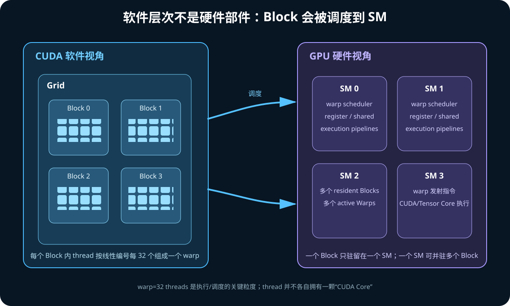

# 00. 零基础导读：先建立 GPU、CUDA、Core 与架构的正确地图

## 1. 一句话理解 GPU

GPU 是一个为**大规模数据并行和高吞吐**设计的处理器。

CPU 倾向于：

```text
少量强大的 CPU core
  → 大缓存
  → 复杂分支预测与乱序执行
  → 追求单线程延迟
```

GPU 倾向于：

```text
大量相对简单的执行单元
  → 很多并发 thread/warp
  → 用快速切换可执行 warp 隐藏延迟
  → 追求单位时间总吞吐
```

这不是说 CPU 不能并行，也不是说 GPU 的每个执行单元都“很弱”。区别是晶体管和
功耗预算如何分配。

## 2. CUDA 是什么

CUDA 同时指：

1. NVIDIA 的并行计算平台；
2. 一套编程模型；
3. CUDA Runtime/Driver API；
4. 编译工具链，如 `nvcc`、PTX、`ptxas`；
5. 数学与 AI 库，如 cuBLAS、cuDNN、NCCL；
6. 调试与性能工具，如 compute-sanitizer、Nsight Systems、Nsight Compute。

CUDA 不是 GPU 型号，也不是一种单独的硬件。

```text
你写的 CUDA C++ / CuTe DSL / PyTorch
        ↓
CUDA runtime、编译器、库
        ↓
PTX / CUBIN / driver launch
        ↓
NVIDIA GPU 硬件
```

## 3. Host、Device 与 Kernel

- **host**：通常指 CPU 及其程序；
- **device**：通常指 CUDA GPU；
- **kernel**：由 host 发起、在 device 上由大量 CUDA thread 并行执行的函数。

最小 CUDA kernel：

```cpp
__global__ void add(const float* a,
                    const float* b,
                    float* c,
                    int n) {
  int i = blockIdx.x * blockDim.x + threadIdx.x;
  if (i < n) {
    c[i] = a[i] + b[i];
  }
}
```

启动：

```cpp
int threads = 256;
int blocks = (n + threads - 1) / threads;
add<<<blocks, threads>>>(a, b, c, n);
```

这不是启动 `blocks × threads` 个 OS thread。CUDA thread 是 GPU 编程模型中的
轻量线程，由 GPU 以 warp 为执行批次进行调度。

## 4. 软件层次与硬件层次



软件侧：

```text
Kernel Launch
└─ Grid
   ├─ Thread Block / CTA
   │  ├─ Thread 0
   │  ├─ Thread 1
   │  └─ ...
   └─ 更多 Block
```

硬件侧：

```text
GPU
├─ SM 0
├─ SM 1
└─ ...

一个 Block 在运行期间驻留于一个 SM
一个 SM 可以同时驻留多个 Block
一个 Block 中的 thread 按每 32 个组成 warp
warp scheduler 选择 ready warp 发射指令
```

对应关系不是固定的：

- `blockIdx.x == 0` 不等于永远在 `SM 0`；
- 两次 kernel launch 的 block 调度位置可能不同；
- 程序不应依赖某个 block 被分配到某个固定 SM；
- 除 cluster 等明确机制外，不应假设不同 block 能直接同步。

## 5. 什么是 SM

SM = Streaming Multiprocessor，流式多处理器。

SM 是 CUDA 计算的主要硬件资源与调度单元。一个 SM 内通常包括：

```text
warp scheduler / dispatch
register file
load/store units
shared memory / L1
FP32/INT 等普通执行流水线
Tensor Core
SFU（特殊函数单元）
异步 copy / barrier 相关能力
```

当文档写：

```text
H100 有 132 个 SM
GB200 实机报告 152 个 SM
```

它表示一个 GPU 上可以有许多 SM 并行驻留 block，并不等于只能同时运行
132/152 个 CUDA thread。

## 6. CUDA Core 是什么

“CUDA Core”是 NVIDIA 常用的产品与架构描述词，通常对应 SM 中执行标量
FP32/INT 等指令的算术 lane/流水线资源。

不要把一个 CUDA Core 类比成一个完整 CPU Core：

| CPU Core | CUDA Core（粗略） |
|---|---|
| 有复杂前端、分支预测、乱序执行、缓存层次 | 通常只是 SM 内某类算术执行资源 |
| 能独立运行一个重量级 OS thread | 由 SM 的 warp scheduler 向执行流水线发指令 |
| 单个 core 是较完整的处理器 | 不能脱离 SM 的寄存器、调度器、LSU 单独工作 |

CUDA thread 也不永久绑定一个 CUDA Core。warp 的指令由 scheduler 发射到合适的
流水线，具体执行资源由架构和指令类型决定。

## 7. Tensor Core 是什么

Tensor Core 是为矩阵乘加设计的专用计算单元。

普通标量 FMA：

```text
d = a × b + c
```

Tensor Core 的 MMA：

```text
D = A × B + C
```

这里 A、B、C、D 是小矩阵 tile。一次 MMA 指令由一个 warp、warpgroup 或其他
架构定义的线程集合协作发起/描述，而不是每个 thread 独立得到一整块 Tensor Core。

Tensor Core 特别适合：

- GEMM；
- convolution 降低后的矩阵乘；
- Transformer 中的 QKV/MLP 投影；
- attention 中的矩阵乘；
- 支持的数据类型上的科学计算。

Tensor Core 不负责所有 GPU 运算：

- 地址计算、循环、分支仍需要普通流水线；
- softmax、归一化、索引、reduction 可能使用 CUDA Core/SFU；
- Tensor Core 需要搬运和布局正确的数据才能达到峰值。

## 8. Global Memory 是不是 GPU DRAM

通常可以近似理解：

```text
GPU attached DRAM（A100/H100/B200 常为 HBM）
  ≈ CUDA global memory 的主要物理后端
```

但“global memory”是 CUDA 地址空间和编程模型术语；HBM 是物理内存技术。

访问链路可简化为：

```text
SM register
  ↕
shared memory / L1
  ↕
L2
  ↕
HBM memory controller
  ↕
HBM stack
```

GPU 还有 constant、texture、local 等地址空间。尤其要记住：

> CUDA local memory 名字里有 local，但物理上通常位于 device memory，
> 常见来源是寄存器 spill 或无法放入寄存器的局部数组。

## 9. 架构、芯片、产品、系统名称

四个层次经常混用：

| 层次 | 例子 | 含义 |
|---|---|---|
| 架构 generation | Ampere、Hopper、Blackwell | 一代设计与指令/能力集合 |
| GPU chip | GA100、GH100、GB100 | 某个具体芯片设计 |
| 产品 SKU | A100、H100、H20、B200 | 启用不同单元、频率、HBM、功耗的产品 |
| 系统/模块 | HGX H100、GB200 Superchip、NVL72 | GPU、CPU、NVSwitch、网络与散热组成的系统 |

所以不能说：

```text
“所有 Hopper 都有 H100 SXM 的 132 SM 和 80 GB HBM3”
```

`ecs` 的 H20 与 H100 同属 GH100/Hopper，但产品规格不同。

## 10. Compute Capability

Compute capability（计算能力）形如：

```text
sm_80 / CC 8.0：A100 一类 Ampere 数据中心 GPU
sm_90 / CC 9.0：GH100/Hopper
sm_100 / CC 10.0：本文 target_p_j 的 GB200/Blackwell
```

它决定：

- 支持哪些 PTX/SASS 功能；
- 编译目标 `-arch=sm_XX`；
- shared memory、register、线程/cluster 等能力上限；
- 是否支持 TMA、WGMMA、tcgen05/TMEM 等架构特性。

同一大版本内部也可能有不同家族与限制，不能只比较一个整数大小。

## 11. 从 PyTorch 到硬件经历了什么

以：

```python
y = torch.matmul(a, b)
```

为例，可能经历：

```text
PyTorch dispatcher
  → ATen / cuBLAS / cuBLASLt / 自定义 kernel
  → 选择 dtype、shape、layout 对应的算法
  → CUDA kernel launch
  → GPU SM 执行
     ├─ 普通流水线做地址/控制/epilogue
     ├─ copy engine/TMA 搬数据
     └─ Tensor Core 做 MMA
```

是否使用 Tensor Core，取决于 dtype、shape、对齐、布局、library algorithm、
compute capability 和精度设置，而不是代码中出现“矩阵”两个字就必然使用。

## 12. 建议学习顺序

第一阶段先能回答：

1. 一个 block 有 256 thread，等于几个 warp？
2. block 与 SM 是什么关系？
3. kernel launch 返回时 GPU 是否一定完成？
4. global/shared/register 的作用和生命周期是什么？
5. CUDA Core 与 Tensor Core 的职责有什么不同？

第二阶段再学习：

1. coalescing 和 bank conflict；
2. GEMM tiling 与 arithmetic intensity；
3. occupancy、latency hiding；
4. async copy 和 pipeline；
5. Ampere/Hopper/Blackwell 指令差异。

第三阶段进入 CuTe：

1. Layout 是坐标到 offset 的函数；
2. Tensor = engine/pointer + Layout；
3. partition 是线程与数据的映射；
4. Copy/MMA Atom 对应硬件基本操作；
5. TiledCopy/TiledMMA 把 atom 扩展到线程层次。

## 13. 官方入口

- [CUDA Programming Guide](https://docs.nvidia.com/cuda/cuda-programming-guide/index.html)
- [CUDA C++ Programming Guide：Programming Model](https://docs.nvidia.com/cuda/cuda-c-programming-guide/contents.html)
- [CUTLASS CuTe 快速入门](https://docs.nvidia.com/cutlass/latest/media/docs/cpp/cute/00_quickstart.html)
- [CuTe DSL Overview](https://docs.nvidia.com/cutlass/latest/media/docs/pythonDSL/overview.html)
