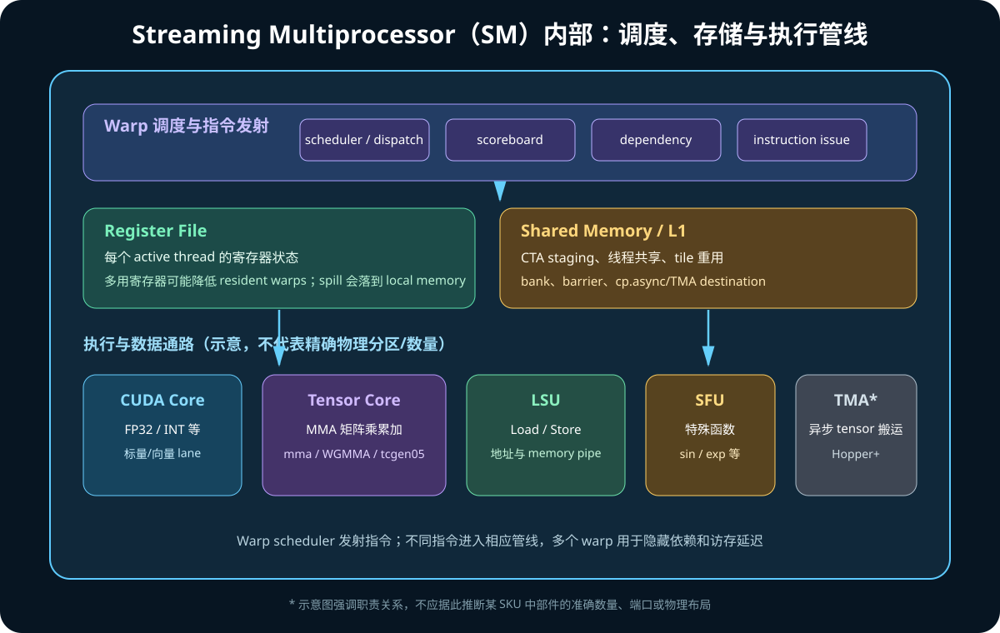

# 02. SM、CUDA Core、Tensor Core、LSU 与 SFU：GPU 到底靠什么执行

## 1. 先看一个 SM 的概念图



为了理解 kernel 性能，可以把 SM 分为六类资源：

```text
调度与依赖
  → warp scheduler、dispatch、scoreboard

状态存储
  → register file

普通计算
  → FP32/INT、FP64 等执行流水线（常被概括为 CUDA Core）

矩阵计算
  → Tensor Core

访存与特殊函数
  → LSU、SFU

片上数据与同步
  → shared memory/L1、barrier、async copy/TMA 接口
```

实际芯片比图复杂，并且不同架构会改变分区、数量和吞吐。概念图用于建立职责，
不能当作晶体管级 floorplan。

## 2. Warp Scheduler

SM 可驻留许多 warp。每个周期，scheduler 从 ready warp 中选择可发射者。

warp 不能发射的常见原因：

- 等待 global/shared memory；
- 等待前序指令写回 register；
- barrier 尚未满足；
- 对应 execution pipeline 忙；
- branch/reconvergence；
- 异步 copy/MMA group 尚未完成。

Scoreboard 维护依赖状态。Nsight Compute 中的 warp stall reason 就是在回答：

```text
为什么 scheduler 这一刻没有发出更多有用指令？
```

## 3. Register File

CUDA thread 的局部标量通常放在 register：

```cpp
float acc = 0.0f;
int idx = ...;
```

register：

- 位于 SM；
- 延迟和带宽很高；
- 按 thread 分配逻辑状态；
- 总容量有限；
- 每 thread 用得越多，能同时驻留的 thread/warp 可能越少。

寄存器不足时，编译器可能 spill 到 local memory。Local memory 常落在 device
memory/L2 路径上，代价可能很高。

查看编译结果：

```bash
nvcc -Xptxas=-v kernel.cu
```

会报告 registers、spill stores/loads、shared memory 等。

## 4. CUDA Core：不要按 CPU Core 理解

CUDA Core 通常指普通算术执行 lane。一个 warp 的标量指令会被分若干周期/分区
送入这些执行资源。

它适合：

- FP32/INT 标量/向量化后的 lane 运算；
- 地址和索引计算；
- activation、elementwise；
- reduction 的部分步骤；
- Tensor Core kernel 的控制、epilogue 与非 MMA 运算。

“GPU 有 X 个 CUDA Core”是峰值能力的一个维度，但实际性能还取决于：

```text
SM 数 × 频率 × 每周期吞吐
× 指令组合
× 活跃 warp
× 数据供应
× pipeline 利用率
```

仅用 CUDA Core 数比较 A100/H100/GB200 的 AI 性能通常没有意义，因为大部分大
模型 GEMM 的主要算力来自 Tensor Core。

## 5. LSU：Load/Store Unit

LSU 负责执行内存访问相关指令：

- global load/store；
- shared load/store；
- local memory；
- atomic；
- 地址转换、请求合并等路径的一部分。

访存性能不仅由 LSU 数量决定，还受：

- warp 地址是否 coalesced；
- cache 命中；
- shared bank conflict；
- HBM/L2 带宽；
- outstanding request 数；
- memory-level parallelism。

## 6. SFU：Special Function Unit

SFU 处理某些特殊数学操作，例如具体架构支持的近似/快速：

- reciprocal；
- reciprocal square root；
- sin/cos；
- exponent/log 的组成路径。

高层 `exp`、`tanh`、softmax 不一定全部由单一 SFU 指令完成；编译器、精度选项、
数学库和架构会决定指令序列。

## 7. Tensor Core

Tensor Core 面向 MMA：

```text
D = A × B + C
```

关键点：

1. 计算的是 tile，不是单个标量；
2. 输入与 accumulator 类型可能不同；
3. 多个 thread 协作提供 operand fragment/descriptor；
4. layout、对齐和指令 shape 受到架构约束；
5. MMA 通常异步或带 group completion 语义；
6. Tensor Core 峰值只有在数据持续供应时才有意义。

### 7.1 从 thread 到 collective

不同层次：

```text
WMMA API
  → warp collective

PTX mma.sync
  → warp-level MMA

Hopper wgmma.mma_async
  → warpgroup（4 warps = 128 threads）级异步 MMA

Blackwell tcgen05.mma
  → 第五代 Tensor Core 指令
  → 可单 thread issue，支持 CTA/CTA-pair 协作与 TMEM accumulator
```

“只有一个 thread issue”不等于只有一个 thread 做了全部计算。它描述指令发起
协议，底层 Tensor Core 仍是宽矩阵计算硬件，数据与同步由 collective 约定管理。

## 8. CUDA Core 与 Tensor Core 如何协作

以 GEMM kernel 为例：

```text
普通流水线/CUDA Core
  ├─ 计算 tile 坐标
  ├─ 边界判断
  ├─ 地址与 descriptor
  ├─ pipeline 状态
  └─ epilogue：bias/activation/store

LSU / copy engine / TMA
  └─ GMEM ↔ SMEM 搬数据

Tensor Core
  └─ 大量 MMA
```

因此 Tensor Core kernel 不是“只有 Tensor Core 在工作”。好的 kernel 要让：

```text
搬运、同步、MMA、epilogue
```

形成重叠流水。

## 9. Tensor Core 是否自动启用

高级库可能自动选择 Tensor Core algorithm，例如 cuBLASLt/PyTorch。条件包括：

- GPU 支持；
- dtype 支持；
- shape 与 leading dimension；
- alignment；
- math mode/precision policy；
- 库实现与 workspace；
- deterministic 等约束。

验证方法：

1. 用 Nsight Compute 查看 tensor pipe 指标；
2. 反汇编寻找对应 SASS；
3. 查看 PTX 中 `mma`、`wgmma`、`tcgen05`；
4. 对比禁用/改变精度后的性能；
5. 不要只根据 API 名称推断。

## 10. 指令层次：CUDA C++、PTX、SASS

```text
CUDA C++ / CuTe DSL
  ↓ 编译与 lowering
PTX：虚拟 ISA
  ↓ ptxas / driver JIT
SASS：具体 GPU 机器指令
```

PTX 不是最终硬件指令。相同 PTX 在不同 GPU/工具链上可生成不同 SASS。

常用工具：

```bash
nvcc -ptx kernel.cu
cuobjdump --dump-sass a.out
nvdisasm kernel.cubin
```

## 11. 架构快速对照

| 架构 | 数据中心代表 | Tensor Core 主线 | 搬运主线 |
|---|---|---|---|
| Ampere | A100 | 第三代，`mma.sync`，TF32/BF16/FP64 TC | `cp.async` GMEM→SMEM |
| Hopper | H100/H20 | 第四代，FP8，`wgmma.mma_async` | TMA + mbarrier |
| Blackwell | B100/B200/GB200 | 第五代，FP4/FP6/FP8，`tcgen05`，TMEM | TMA + TMEM/新 pipeline |

不同产品启用的 SM、频率、HBM 与 Tensor Core 吞吐不同。

## 12. 官方资料

- [NVIDIA Ampere Architecture In-Depth](https://developer.nvidia.com/blog/nvidia-ampere-architecture-in-depth/)
- [NVIDIA Hopper Architecture In-Depth](https://developer.nvidia.com/blog/nvidia-hopper-architecture-in-depth/)
- [Blackwell SM100 GEMMs](https://docs.nvidia.com/cutlass/latest/media/docs/cpp/blackwell_functionality.html)
- [PTX ISA](https://docs.nvidia.com/cuda/parallel-thread-execution/)
