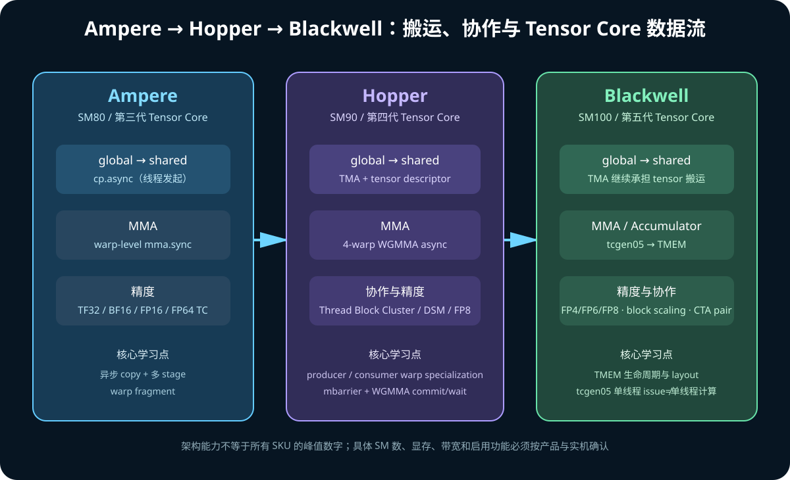

# 05. NVIDIA Ampere、Hopper、Blackwell：架构演进与编程差异

## 1. 不要把架构比较写成参数背诵

从 kernel 作者角度，三代最重要的问题是：

```text
数据如何从 HBM 进入片上？
谁负责地址生成？
Tensor Core collective 的粒度是什么？
accumulator 放在哪里？
producer/consumer 如何同步？
多个 block 能否协作？
低精度数据如何表示与缩放？
```



## 2. 总览

| 维度 | Ampere（GA100/A100） | Hopper（GH100/H100/H20） | Blackwell（GB100/B200/GB200） |
|---|---|---|---|
| 常见 CC | 8.0 | 9.0 | 10.0（本文 GB200） |
| Tensor Core | 第三代 | 第四代 | 第五代 |
| 代表 MMA | warp `mma.sync` | warpgroup `wgmma.mma_async` | `tcgen05.mma` |
| 低精度重点 | TF32、BF16、INT8 | FP8、Transformer Engine | FP4/FP6/FP8、block scaling |
| GMEM→SMEM | `cp.async` | TMA | TMA/增强 descriptor 与 scale 流水 |
| accumulator | 主要是 register fragment | 主要是 register fragment | TMEM |
| block 协作 | 普通 block 边界 | Thread Block Cluster、DSM | cluster + CTA pair 等增强 |
| NVLink | 第三代 | 第四代 | 第五代 |

表格是主线，不代表所有 Ampere/Blackwell 产品支持完全相同的子特性。

## 3. Ampere：异步 copy 与新 Tensor Core 数据类型

### 3.1 第三代 Tensor Core

Ampere GA100 的 Tensor Core 增强包括：

- TF32；
- BF16；
- FP64 Tensor Core；
- INT8/INT4/binary 等；
- 2:4 structured sparsity；
- 相比 Volta/Turing 更大的/更多 MMA shape。

### 3.2 `cp.async`

Ampere 给 kernel 作者的关键变化：

```text
旧路径：
GMEM → register → SMEM

cp.async：
GMEM ───────────→ SMEM
```

优点：

- 避免中间 register；
- 允许 copy 与 compute overlap；
- 可选择 cache 行为；
- 配合 async group/barrier 建立多 stage pipeline。

但 thread/warp 仍负责循环与地址生成。

### 3.3 Split Arrive/Wait Barrier

将 barrier 分成：

```text
arrive：我完成了自己的 producer 工作
wait：等所有需要的 arrival/transaction
```

比所有 thread 同时停在传统 barrier 更适合 producer-consumer pipeline。

### 3.4 Ampere 的核心编程图

```text
warp/thread 计算地址
  → cp.async A/B tile
  → wait group / barrier
  → ldmatrix / register fragment
  → mma.sync
```

## 4. Hopper：TMA、WGMMA 与 Cluster

### 4.1 TMA

TMA = Tensor Memory Accelerator。

Ampere `cp.async` 仍需要大量 thread 参与地址生成和发 copy。Hopper TMA：

```text
host/producer 构造 tensor map descriptor
  → 一个 thread 发起 tensor 坐标和 box
  → TMA 硬件完成 1D～5D 地址生成与搬运
  → mbarrier 记录 transaction completion
```

能力包括：

- GMEM↔SMEM；
- tensor swizzle/interleave；
- out-of-bounds fill；
- cluster multicast；
- 某些 reduction/store 模式。

### 4.2 WGMMA

WGMMA = Warpgroup Matrix Multiply-Accumulate。

```text
warpgroup = 4 warps = 128 threads
```

Hopper `wgmma.mma_async`：

- 异步发起；
- operand 可通过 shared memory descriptor；
- 使用 fence/commit_group/wait_group；
- 支持 FP8/FP16/BF16/TF32/INT8 等 shape/type 组合；
- 适合 warp-specialized producer/consumer。

### 4.3 Thread Block Cluster

Hopper 在 Grid 和 Block 间增加 Cluster：

```text
Cluster
├─ CTA 0 on SM 0
├─ CTA 1 on SM 1
└─ ...
```

Cluster 内：

- 保证 block 并发调度在同一个 GPC；
- cluster sync；
- Distributed Shared Memory；
- TMA multicast。

### 4.4 Hopper 的核心编程图

```text
TMA producer warp
  → descriptor-based GMEM→SMEM
  → mbarrier

WGMMA consumer warpgroup
  → async MMA
  → commit/wait group

epilogue
  → store
```


## 5. Blackwell：第五代 Tensor Core、TMEM 与 tcgen05

### 5.1 第五代 Tensor Core

Blackwell 重点包括：

- FP4、FP6、FP8；
- microscaling/block scaling；
- 更高 `tcgen05` throughput；
- 新 Tensor Core issue/协作模式；
- 面向大模型训练与推理的数据格式链路。

### 5.2 TMEM

TMEM = Tensor Memory，是 Blackwell SM100 的专用片上空间，服务第五代 Tensor
Core accumulator（以及特定 operand/数据运动用途）。

传统 accumulator：

```text
Tensor Core → thread registers
```

Blackwell：

```text
Tensor Core → TMEM
  → tcgen05.ld / copy
  → registers / epilogue
```

收益：

- accumulator 不长期占满普通 register；
- producer/consumer/epilogue 角色更容易解耦；
- 大 tile 与 CTA-pair 计算更可行。

TMEM 不是用户可像 global pointer 一样普通读写的 HBM。它有显式 alloc/dealloc、
layout、访问与同步约束。

### 5.3 `tcgen05`

Blackwell SM100 PTX 家族：

```text
tcgen05.alloc / dealloc
tcgen05.mma
tcgen05.cp
tcgen05.ld / st
tcgen05.wait / fence / commit
```

CUTLASS 官方文档指出 `tcgen05.mma` 对不同 dtype 相比 Hopper WGMMA 可提供
2×～4×指令吞吐，但实际 kernel 加速仍受数据移动、shape、频率、epilogue 和
利用率影响。

### 5.4 CTA Pair

Blackwell 某些 `tcgen05` 模式允许两个相邻 CTA 协作一个 MMA：

```text
CTA 0 ─┐
       ├─ CTA-pair MMA tile
CTA 1 ─┘
```

这不是任意两个 block 自动配对，需要使用相应指令模式、launch/cluster 布局和
同步协议。

### 5.5 Blackwell 核心编程图

```text
TMA producer
  → A/B/scale → SMEM

single-thread tcgen05 issue
  → CTA 或 CTA-pair Tensor Core
  → accumulator → TMEM

epilogue consumer
  → TMEM load/copy
  → cast/activation/store
```


## 6. CUDA Core 与 Tensor Core 的架构演进

不能简单说：

```text
Blackwell CUDA Core 一定是 Hopper CUDA Core 的 X 倍
```

不同 workload 主要瓶颈不同：

- elementwise/softmax 受普通流水线、SFU、memory 影响；
- GEMM 受 Tensor Core 与数据 pipeline 影响；
- decode 小 batch 可能受 latency、launch、memory 限制；
- prefill/训练大 GEMM 更容易接近 Tensor Core throughput；
- MoE 还受通信、dispatch、专家大小影响。

架构升级的价值常体现在系统协作：

```text
更快 Tensor Core
+ 更高 HBM bandwidth
+ 更强异步搬运
+ 更大/更灵活片上存储
+ 更快 NVLink
+ 更成熟的 library/kernel
```

## 7. NVLink 演进

| 架构 | NVLink 代际 | 编程含义 |
|---|---|---|
| Ampere | 第三代 | GPU P2P、NVSwitch 系统 |
| Hopper | 第四代 | 更高 GPU-GPU bandwidth；HGX H100/H20 常经 NVSwitch |
| Blackwell | 第五代 | 更大的 NVLink domain 与 rack-scale 系统能力 |

CUDA pointer load/store、NCCL collective 等高层接口可透明利用可用互连，但拓扑、
peer access、NUMA、NVSwitch 与软件配置仍决定实际路径。

## 8. 兼容性与编译目标

常见：

```bash
# Ampere A100
nvcc -arch=sm_80

# Hopper
nvcc -arch=sm_90

# Blackwell SM100
nvcc -arch=sm_100
```

架构加速特性可能使用 `a`/family-specific target 约束，例如某些 PTX 只在特定
架构家族保证。Fatbin 可同时包含：

```text
多份 cubin
+ PTX fallback
```

部署时要检查：

- driver 是否支持对应 PTX 版本；
- toolkit/ptxas 是否识别目标 SM；
- 代码是否使用 architecture-specific 指令；
- library 是否包含对应 kernel；
- JIT 是否发生及首轮开销。

## 9. 学习时应该抓住的三条主线

### 9.1 数据移动

```text
Ampere：thread/warp-driven cp.async
Hopper：descriptor-driven TMA
Blackwell：TMA + TMEM/scale 数据流
```

### 9.2 Tensor Core collective

```text
Ampere：warp MMA
Hopper：warpgroup WGMMA
Blackwell：tcgen05 + CTA/CTA-pair + TMEM
```

### 9.3 同步

```text
Ampere：async group + split barrier
Hopper：mbarrier transaction + WGMMA groups + cluster
Blackwell：tcgen05 completion + TMEM lifecycle + CTA pair
```

## 10. 官方资料

- [Ampere Tuning Guide](https://docs.nvidia.com/cuda/ampere-tuning-guide/)
- [Hopper Tuning Guide](https://docs.nvidia.com/cuda/hopper-tuning-guide/)
- [Blackwell Tuning Guide](https://docs.nvidia.com/cuda/blackwell-tuning-guide/)
- [NVIDIA Hopper Architecture In-Depth](https://developer.nvidia.com/blog/nvidia-hopper-architecture-in-depth/)
- [Blackwell SM100 GEMMs](https://docs.nvidia.com/cutlass/latest/media/docs/cpp/blackwell_functionality.html)
- [tcgen05 MMA Programming Guide](https://docs.nvidia.com/cutlass/latest/media/docs/pythonDSL/mma_docs/tcgen05_programming.html)
