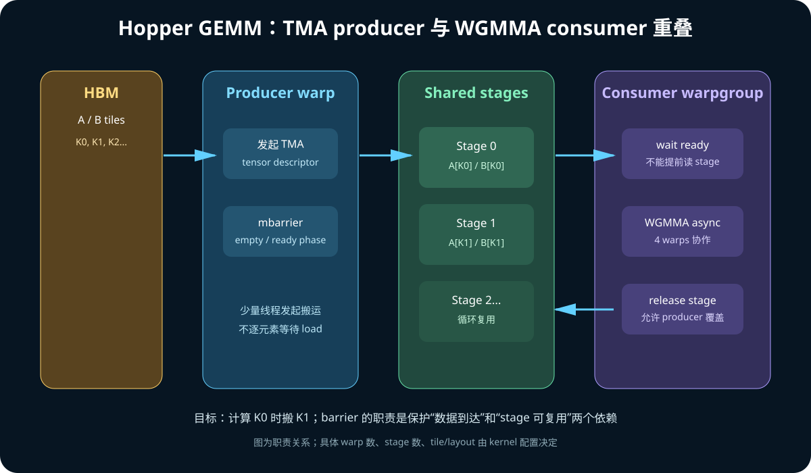
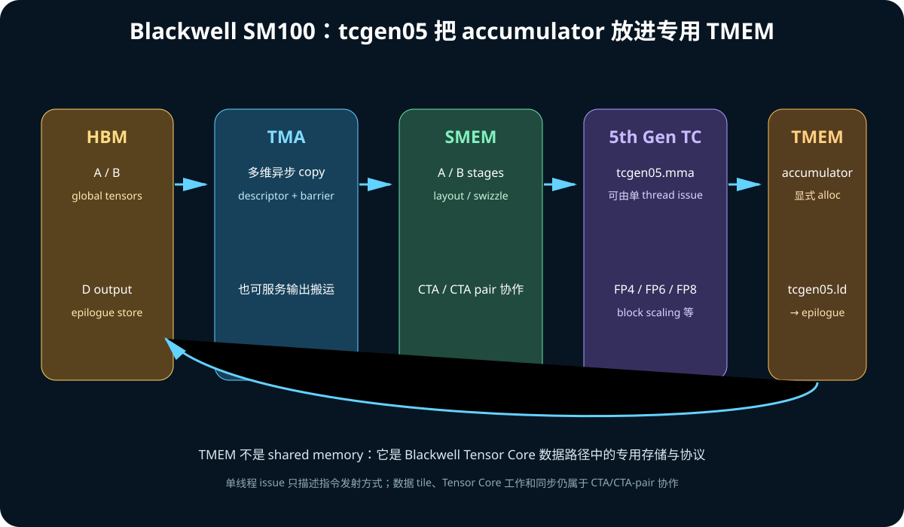

# 09. CuTe DSL：Copy、MMA 与 GEMM 流水线

上一章解决“元素在哪里”；这一章解决：

> 哪些线程把哪些元素从 HBM 搬到 shared memory？
> 哪些线程以什么 fragment 调用 Tensor Core？
> 为什么高性能 GEMM 会同时出现 TiledCopy、TiledMMA、pipeline 和 epilogue？

## 1. 从 GEMM 伪代码开始

```text
C[M,N] = A[M,K] × B[K,N]
```

朴素实现中，每个 `C[m,n]` 都从 global memory 重复读取 A/B。高性能版本分 tile：

```text
for each CTA tile (M_tile, N_tile):
    accumulator = 0
    for k_tile in K:
        global A/B → shared A/B
        shared A/B → register/Tensor Core operand
        accumulator += A_tile × B_tile
    epilogue(accumulator) → global C
```

CuTe 将其中两类协作显式建模：

```text
搬运：Copy Atom → TiledCopy
计算：MMA Atom  → TiledMMA
```

## 2. Atom 是什么

Atom 可理解为“最小硬件操作 + 完成它所需的数据/线程布局约束”的封装。

它不一定等于一条源代码语句，也不保证永远只对应一条最终 SASS；应以生成代码为准。

### 2.1 Copy Atom

描述一次底层搬运能力，例如：

- 普通 scalar/vector load/store；
- `cp.async` 类 global→shared copy；
- Hopper/Blackwell TMA；
- register↔shared 的特定重排。

Atom 同时关心：

```text
source address space
destination address space
element/vector type
参与线程
每个线程持有的 value
硬件操作限制
```

### 2.2 MMA Atom

描述某种硬件矩阵乘累加操作及 operand/accumulator fragment 的线程映射，例如：

- Ampere `mma.sync`；
- Hopper `wgmma.mma_async`；
- Blackwell `tcgen05.mma`。

不要把 Atom 只理解为矩阵 shape。相同 `m×n×k` 仍可能因 dtype、layout、CTA group、
accumulator 类型不同而是不同操作。

## 3. TiledCopy：把 Copy Atom 铺到更大的 tile

假设 Copy Atom 每次协作覆盖较小片段，而 CTA 要搬 `128×K_tile`：

```text
Copy Atom
  × thread arrangement
  × value arrangement
  → TiledCopy
```

TiledCopy 回答：

- CTA 中哪些 thread/lane 参加；
- thread `t` 负责 source tile 的哪些坐标；
- destination tile 对应哪些坐标；
- 每次能否使用 16 B 等向量搬运；
- 如何遍历还未覆盖的 remainder。

代码阅读时常见步骤是：

```text
构造 TiledCopy
  → 为某个 thread 取得 thread_slice
  → partition_S(source tensor)
  → partition_D(destination tensor)
  → copy(...)
```

`partition_S/D` 不是立刻搬运，而是根据布局切出“当前线程应该看到的 source/dest
view”。实际 `copy` 才表达搬运。

## 4. TiledMMA：把 MMA Atom 铺到 CTA tile

```text
MMA Atom
  × warp/warp-group/CTA arrangement
  × value arrangement
  → TiledMMA
```

它回答：

- CTA 中有多少个 MMA 协作组；
- 每组负责 CTA tile 的哪部分；
- A/B fragment 怎样从 shared/TMEM/register 映射到 operand；
- accumulator fragment 如何分布；
- 多次 atom 如何覆盖完整 `M_tile×N_tile×K_tile`。

常见阅读顺序：

```text
tiled_mma
  → thread_slice / thread_mma
  → partition_A / partition_B / partition_C
  → gemm / mma
```

在不同架构中，“thread slice”的硬件含义不同：

- `mma.sync` 常以 warp 为协作单元；
- WGMMA 以 4 个 warp（warpgroup）协作；
- tcgen05 可以由单线程 issue，但操作仍代表 CTA/CTA pair 级数据与 Tensor Core 工作；
  “单线程发指令”不等于“只有该线程计算整个矩阵且其他资源无关”。

## 5. Layout 如何把 Copy 接到 MMA

高性能 kernel 必须让：

```text
global layout
  → copy thread/value layout
  → shared-memory layout
  → MMA operand layout
```

彼此兼容。

一个典型问题：

```text
global load 很合并
但写入 shared 的排列使 32 lane 同时打到同一 bank
```

另一个问题：

```text
shared layout 适合搬运
但不符合 WGMMA/tcgen05 operand 的 alignment/layout 限制
```

因此 shared layout 常带 swizzle：

```text
逻辑上仍是 A[m,k]
物理 bank 映射经过可逆重排
```

它的目标是同时满足：

- global transaction 合并和向量化；
- shared-memory bank 访问；
- Tensor Core operand layout；
- TMA descriptor 约束。

## 6. 多 stage pipeline



若只有一个 shared buffer：

```text
copy tile 0
wait
compute tile 0
copy tile 1
wait
compute tile 1
```

搬运和计算很难重叠。双 buffer：

```text
时间 →

copy:     K0      K1      K2      K3
compute:          K0      K1      K2      K3
buffer:   S0      S1      S0      S1      S0
```

一般化为 `num_stages` 个 buffer：

```text
producer：
  等待 stage 有空位
  发起下一 K tile 的异步 copy/TMA
  标记 stage ready

consumer：
  等待 stage ready
  用 Tensor Core 计算
  标记 stage 可复用
```

### 6.1 Barrier 在保护什么

barrier 不只是“所有线程集合”。异步 pipeline 中它维护数据依赖：

```text
不能在数据到达 shared 前读取
不能在 consumer 尚未用完时覆盖该 stage
```

缺 barrier/phase 管理可能得到偶发错误结果，而不仅是性能下降。

### 6.2 stage 越多越好吗

不是。更多 stage：

- 更能隐藏 HBM/TMA latency；
- 占更多 shared memory；
- 可能降低每 SM resident CTA 数；
- 增加 barrier/state 和寄存器压力；
- K 很小时未必有收益。

要联合考虑：

```text
tile size × element bytes × A/B buffers × stages
```

与每 SM shared-memory 容量。

## 7. Hopper：TMA + WGMMA

Hopper 常见 persistent GEMM 主线：

```text
producer warp(s)
  → 配置/发起 TMA
  → HBM 到 SMEM
  → mbarrier 到达

consumer warpgroup
  → wait stage
  → WGMMA 从 SMEM 使用 A/B
  → accumulator registers

epilogue
  → type conversion / bias / activation
  → global store
```

### 7.1 TMA

TMA（Tensor Memory Accelerator）能按 tensor descriptor 执行多维搬运。CPU/host
通常先构造 descriptor；device 上少量线程可发起大块异步搬运。

它减少显式地址计算和大量线程参与 load 的负担，但仍要求：

- descriptor 正确；
- shape/stride/alignment 合法；
- barrier/transaction bytes 正确；
- shared destination 容量正确。

### 7.2 WGMMA

WGMMA 是 warpgroup-level MMA：

- 四个 warp 组成 warpgroup；
- 指令异步执行；
- 需要 commit/wait 等依赖管理；
- operand/accumulator layout 必须符合指令契约。

“异步”表示发起与完成分离，不表示可以忽略依赖。

## 8. Blackwell：TMA + tcgen05 + TMEM



Blackwell SM100 将主要 accumulator 放到 TMEM：

```text
A/B:
  HBM → TMA → SMEM

MMA:
  tcgen05.mma 读取 operand
  accumulator → TMEM

epilogue:
  tcgen05.ld / copy → registers
  scale/convert/fusion
  store → HBM
```

CuTe DSL/Collective 层需要表达：

- TMEM allocation/deallocation；
- MMA atom 的 instruction shape/dtype；
- CTA group 1 或 2；
- block-scaled datatype 的 scale-factor layout；
- MMA 与 epilogue 对同一 TMEM accumulator 的次序。

### 8.1 CTA pair

CTA group 2 可让两个 CTA 协作某些 tcgen05 操作。它不是把普通 `blockIdx.x`
相邻的两个 block 随意配对；kernel、launch 和操作类型都必须符合 cluster/CTA-pair
契约。

### 8.2 单线程 issue

Blackwell MMA 指令可由一个线程 issue，意义是减少 instruction issue overhead，
不是把 Tensor Core 退化成单线程 ALU。数据 tile、TMEM 和 CTA 同步仍属于更大协作域。

## 9. Mainloop 与 Epilogue

### 9.1 Mainloop

负责：

```text
沿 K 维迭代
A/B 搬运
pipeline/barrier
MMA accumulate
```

### 9.2 Epilogue

负责：

```text
D = activation(alpha × accumulator + beta × C + bias ...)
```

以及：

- accumulator 转换成输出 dtype；
- scale/zero-point；
- bias、ReLU/GELU 等融合；
- 输出 layout 与 global store；
- split-K reduction 或 auxiliary output。

Epilogue 不是“收尾小代码”。在低精度 GEMM、窄矩阵或融合算子中，它可能是主要瓶颈。

## 10. 从 PyTorch 调用 CuTe kernel

大体流程：

```text
Python/PyTorch
  1. 检查 tensor device/dtype/shape/stride/alignment
  2. 取得当前 CUDA stream
  3. 生成或命中 JIT cache
  4. 包装 pointer/layout
  5. launch kernel 到同一 stream
  6. 返回；通常不做全局同步
```

如果偷偷使用 default stream 或 `cudaDeviceSynchronize()`，可能破坏框架异步性。
如果 kernel launch 后 Python tensor 被释放/复用，也可能产生生命周期问题。

## 11. 如何阅读一个 CuTe GEMM

按下面顺序，不要从最长的 kernel body 开始：

1. 目标架构：SM80、SM90 还是 SM100；
2. input/output dtype、layout 和 alignment；
3. problem shape：M/N/K/batch；
4. CTA tile 与 cluster shape；
5. MMA atom/TiledMMA；
6. global→shared 的 copy atom/TiledCopy 或 TMA；
7. shared layout/swizzle；
8. pipeline stages/barriers；
9. accumulator storage；
10. epilogue 与输出 copy；
11. launch grid/block/shared-memory bytes；
12. 最后看生成 PTX/SASS 与 profile。

## 12. 正确性和性能检查表

正确性：

- 与 PyTorch/CPU reference 比较；
- 对 FP16/BF16/TF32/FP8 使用合理 tolerance；
- 覆盖非 tile 整除的边界；
- 覆盖不同 alignment/stride；
- 使用 compute-sanitizer 检查越界/race。

性能：

- warmup 后计时；
- 使用 CUDA Event，而不是只计 Python wall time；
- 报告 M/N/K、dtype、layout、batch；
- 与 cuBLAS/CUTLASS reference 比较；
- 看 Tensor Core 指令是否真的出现；
- 检查 HBM、L2、shared、occupancy 和 pipe utilization；
- 分开 kernel latency、JIT compile time 和框架开销。

## 13. 初学者常见误区

- `TiledCopy` 不是“一定执行 TMA”；底层 atom 决定机制；
- `TiledMMA` 不是“一定只发一条指令”；大 tile 会铺多个 atom；
- `num_stages=4` 不表示有 4 个 kernel；
- shared-memory swizzle 不是随机打乱，而是可推导的地址映射；
- `async` 不代表没有 completion/wait；
- GFLOP/s 高不等于数值结果正确；
- 能在 GB200 编译不代表在 H20 可运行，SM100 指令不能由 SM90 执行。

## 14. 官方资料

- [CuTe DSL Quick Start](https://docs.nvidia.com/cutlass/latest/media/docs/pythonDSL/quick_start.html)
- [C++ CuTe Quickstart](https://docs.nvidia.com/cutlass/latest/media/docs/cpp/cute/00_quickstart.html)
- [Blackwell SM100 GEMMs](https://docs.nvidia.com/cutlass/latest/media/docs/cpp/blackwell_functionality.html)
- [tcgen05 MMA Programming Guide](https://docs.nvidia.com/cutlass/latest/media/docs/pythonDSL/mma_docs/tcgen05_programming.html)
- [Hopper Tuning Guide](https://docs.nvidia.com/cuda/hopper-tuning-guide/)
- [Blackwell Tuning Guide](https://docs.nvidia.com/cuda/blackwell-tuning-guide/)
