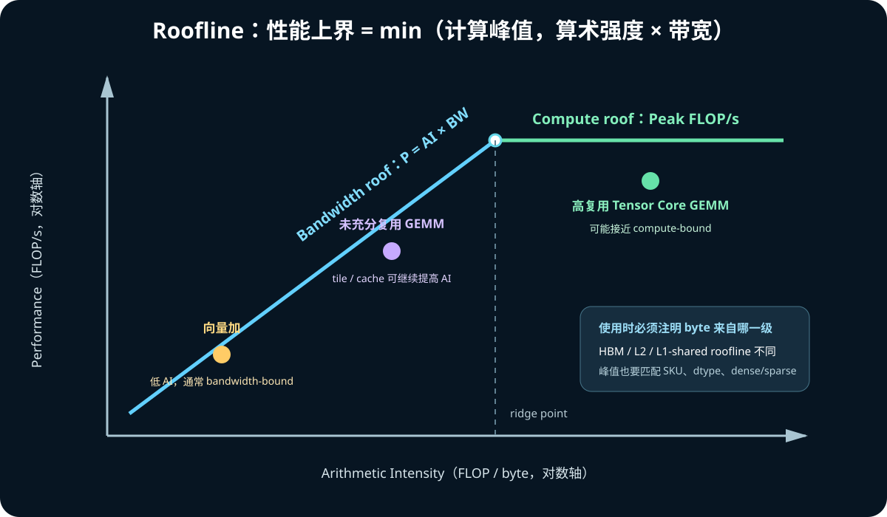

# 10. 性能分析、实验与代码阅读路线

高性能 GPU 学习最危险的状态是“概念都听过，但不知道程序实际用了什么硬件”。
这一章给出可重复的验证路线。

## 1. 先定义问题

分析前写下：

```text
我在测什么 operation？
输入 shape / dtype / layout 是什么？
目标是 latency、throughput 还是 scaling？
包含不包含 H2D/D2H、JIT、通信和同步？
和哪个 reference 比？
```

没有这些信息，“快了 20%”往往不可解释。

## 2. 四层证据

### 第 1 层：机器与软件

```bash
nvidia-smi
nvidia-smi topo -m
nvidia-smi nvlink -s
nvcc --version
```

记录：

- GPU SKU、compute capability、driver/toolkit；
- GPU 数量、NUMA、NVLink；
- clocks/power/throttle；
- PyTorch/CUTLASS/CuTe 版本。

### 第 2 层：source 与 launch

确认：

- grid/block；
- dynamic shared-memory bytes；
- stream；
- problem shape；
- dtype；
- 是否 warmup；
- 是否异步。

### 第 3 层：PTX/SASS

```bash
nvcc -arch=sm_90 -lineinfo -cubin kernel.cu -o kernel.cubin
cuobjdump --dump-ptx kernel.cubin
nvdisasm kernel.cubin
```

用途：

- PTX：虚拟 ISA，确认编译器表达了什么；
- SASS：实际机器指令，确认最终发了什么；
- `-lineinfo`：profile 时映射 source 行；
- 不要只凭 source 中的 API 名称推断硬件指令。

### 第 4 层：profiler counters/timeline

- Nsight Systems：CPU、CUDA API、kernel、memcpy、NCCL 的时间线；
- Nsight Compute：单 kernel 的指令、memory、occupancy、stall、roofline；
- CUDA Event：同一 device stream 上的 kernel 时间；
- framework profiler：算子级归因。

## 3. 正确计时

CUDA launch 通常异步：

```cpp
kernel<<<grid, block, 0, stream>>>(...);
// 到这里不表示 kernel 已完成
```

Event 计时：

```cpp
cudaEventRecord(start, stream);
for (int i = 0; i < repeat; ++i) {
    kernel<<<grid, block, 0, stream>>>(...);
}
cudaEventRecord(stop, stream);
cudaEventSynchronize(stop);
cudaEventElapsedTime(&ms, start, stop);
```

必须：

- 先 warmup；
- 检查 launch error；
- 避免把首次 context/JIT 时间混进去；
- 同一 stream 上记录；
- 除以 repeat；
- 防止编译器/程序不消费结果；
- 说明时钟和 power 状态。

## 4. Roofline：先判断受计算还是受带宽限制



定义 arithmetic intensity：

```text
AI = 执行的 FLOP / 从目标存储层搬运的 byte
```

性能上界：

```text
Performance ≤ min(
    Peak Compute,
    AI × Peak Bandwidth
)
```

例：向量加 `C=A+B`，每个 FP32 元素：

```text
读 A：4 B
读 B：4 B
写 C：4 B
计算：1 add ≈ 1 FLOP
AI ≈ 1/12 FLOP/B
```

通常 HBM bandwidth bound。

GEMM 通过 tile 重用 A/B，提高 AI，可能转为 Tensor Core compute bound。

### 4.1 “byte”来自哪一级

Roofline 必须注明：

- HBM roofline；
- L2 roofline；
- L1/shared roofline。

如果数据都命中 L2，用 HBM bytes 解释会误判。

## 5. Occupancy 应如何理解

Occupancy：

```text
active warps / hardware maximum warps
```

限制因素：

- threads/block；
- registers/thread；
- shared memory/block；
- block/SM 上限；
- cluster 约束。

高 occupancy 能帮助隐藏 latency，但不是目标本身：

- 大量 register 可减少 spill；
- 大 shared tile 可提高数据重用；
- persistent kernel 可能故意只驻留少量 CTA；
- Tensor Core 饱和不必要求 100% occupancy。

正确问题是：

> 当前 occupancy 是否足以覆盖这条 pipeline 的 latency，瓶颈究竟在哪里？

## 6. 常见 stall 的解释方式

不要把所有 stall 都解释为 GPU “空闲”：

- memory dependency：等待 load result；
- barrier：等待其他 thread/async transaction；
- not selected：有其他 eligible warp 被选择，可能正常；
- scoreboard dependency：前序指令结果未 ready；
- instruction fetch/dispatch：前端供给；
- math pipe throttle：目标执行管线拥塞；
- MIO/LSU throttle：memory instruction 发射压力。

要结合：

```text
eligible warps
issued warps
pipe utilization
memory throughput
cache hit rate
source/SASS
```

共同判断。

## 7. 三组入门实验

### 实验 A：线程层次

```bash
python3 examples/cutedsl/01_thread_hierarchy.py
```

预测：

- block 32 只有 warp 0；
- block 64 有 warp 0 和 warp 1；
- `lane = threadIdx.x % 32`。

### 实验 B：向量加

```bash
nvcc -O3 -arch=sm_100 examples/cuda/01_vector_add.cu -o /tmp/vector_add
/tmp/vector_add
```

在 Hopper 改为 `-arch=sm_90`。

修改 `block_size`：64、128、256、512。记录 latency 与 effective bandwidth：

```text
effective bytes = N × sizeof(float) × 3
GB/s = effective bytes / seconds / 1e9
```

### 实验 C：朴素矩阵乘

```bash
nvcc -O3 -arch=sm_100 examples/cuda/02_naive_matmul.cu -o /tmp/naive_matmul
/tmp/naive_matmul
```

这个 kernel 不应接近 Tensor Core GEMM。用它理解：

- 二维 grid/block；
- 全局内存重复读取；
- 为什么 tiling/shared reuse 重要；
- 为什么仅把矩阵尺寸设为 16 倍数不会自动保证 Tensor Core。

## 8. 从 naive GEMM 到 CuTe GEMM 的练习梯子

1. naive CUDA GEMM；
2. shared-memory tiled GEMM；
3. double-buffer copy/compute；
4. WMMA 或简单 MMA；
5. CUTLASS profiler 跑官方 kernel；
6. CuTe layout 打印与 thread/value partition；
7. CuTe DSL scalar/vector copy；
8. CuTe DSL tiled copy；
9. CuTe DSL GEMM tutorial；
10. Hopper TMA/WGMMA；
11. Blackwell tcgen05/TMEM；
12. PyTorch custom op 与 production shape tuning。

每一级都保留：

```text
correctness test
benchmark script
build command
hardware/software metadata
profile screenshot/report
结论和尚未解释的现象
```

## 9. 架构对照实验

在 `ecs`（H20/SM90）与 `target_p_j`（GB200/SM100）比较时：

### 可以比较

- 相同算法、dtype、shape；
- 相同计时边界；
- 相同 warmup/repeat；
- 每 GPU 的 latency/throughput；
- 相同 NCCL collective 的 size curve。

### 不能直接归因

端到端差异不只来自架构：

- SKU SM 数不同；
- HBM 容量/带宽不同；
- CPU、NUMA、PCIe/NVLink 不同；
- driver/toolkit/library 不同；
- power/clock 不同；
- kernel dispatch 可能选了不同算法。

因此结论应写成：

```text
在这两台具体机器、这些版本和参数下观察到……
```

而不是：

```text
Blackwell 一定比 Hopper 快 X 倍。
```

## 10. CUTLASS profiler

若安装/构建了 CUTLASS profiler：

```bash
cutlass_profiler \
  --operation=Gemm \
  --m=4096 --n=4096 --k=4096 \
  --verification-enabled=true
```

实际 operation 名、dtype、layout 参数取决于构建版本。它适合：

- 列出该架构可用 kernel；
- 做 correctness verification；
- 按 shape/dtype 搜索较优实现；
- 查看 runtime、GFLOP/s。

它不能替代应用 profile：真实模型还有 shape 分布、launch 间隙、融合、通信和内存峰值。

## 11. 调试工具

### 11.1 API error

```cpp
kernel<<<...>>>(...);
cudaError_t e = cudaGetLastError();
cudaDeviceSynchronize();
```

开发期同步便于把错误归因到正确 kernel；性能版本不要无条件保留每 kernel 全局同步。

### 11.2 Compute Sanitizer

```bash
compute-sanitizer --tool memcheck ./program
compute-sanitizer --tool racecheck ./program
compute-sanitizer --tool synccheck ./program
```

- memcheck：越界/misaligned；
- racecheck：shared-memory data hazard；
- synccheck：同步使用问题。

它会显著减慢程序，适合缩小输入。

### 11.3 数值误差

对 reference：

```text
abs_error = |actual - expected|
rel_error = abs_error / max(|expected|, epsilon)
```

误差阈值依赖 dtype、K、累加类型和算法。不能用 FP64 的预期判断 FP8，也不能只检查
一个元素。

## 12. 性能改动的实验纪律

每次只改变一个主要变量：

```text
baseline
  → 改 tile
  → 改 stage
  → 改 vector width
  → 改 shared layout
  → 改 MMA atom
```

每次记录：

| 项目 | 内容 |
|---|---|
| git commit | 可复现代码版本 |
| machine | ecs / target_p_j |
| GPU/driver | SKU、CC、driver |
| toolchain | CUDA、CuTe/CUTLASS |
| workload | M/N/K、dtype、layout、batch |
| config | tile、stage、cluster |
| correctness | max abs/rel error |
| latency | median/P50/P95 |
| throughput | GB/s 或 TFLOP/s |
| profile | 关键 counters |
| conclusion | 证据支持的解释 |

## 13. 建议的代码阅读路线

### CUDA kernel

```text
launch site
  → kernel signature
  → grid/block index
  → pointer/stride
  → synchronization
  → memory access
  → computation
  → output/writeback
```

### CuTe/CUTLASS kernel

```text
architecture dispatch
  → problem/input layout
  → tile/cluster shape
  → collective mainloop
  → Copy Atom/TiledCopy
  → MMA Atom/TiledMMA
  → pipeline/barrier
  → epilogue
  → scheduler
  → launch/config
```

### 看到陌生名词时

1. 先在仓库中找定义；
2. 再找调用点和测试；
3. 再看对应架构官方文档；
4. 用最小程序打印/编译；
5. 最后看 PTX/SASS/profile；
6. 仍不能确认时明确标注“推测”，不要把推测写成硬件事实。

## 14. 官方资料

- [CUDA Programming Guide](https://docs.nvidia.com/cuda/cuda-programming-guide/index.html)
- [CUDA C++ Best Practices Guide](https://docs.nvidia.com/cuda/cuda-c-best-practices-guide/)
- [Nsight Compute Documentation](https://docs.nvidia.com/nsight-compute/)
- [Nsight Systems Documentation](https://docs.nvidia.com/nsight-systems/)
- [Compute Sanitizer](https://docs.nvidia.com/compute-sanitizer/)
- [CUTLASS Documentation](https://docs.nvidia.com/cutlass/latest/)
