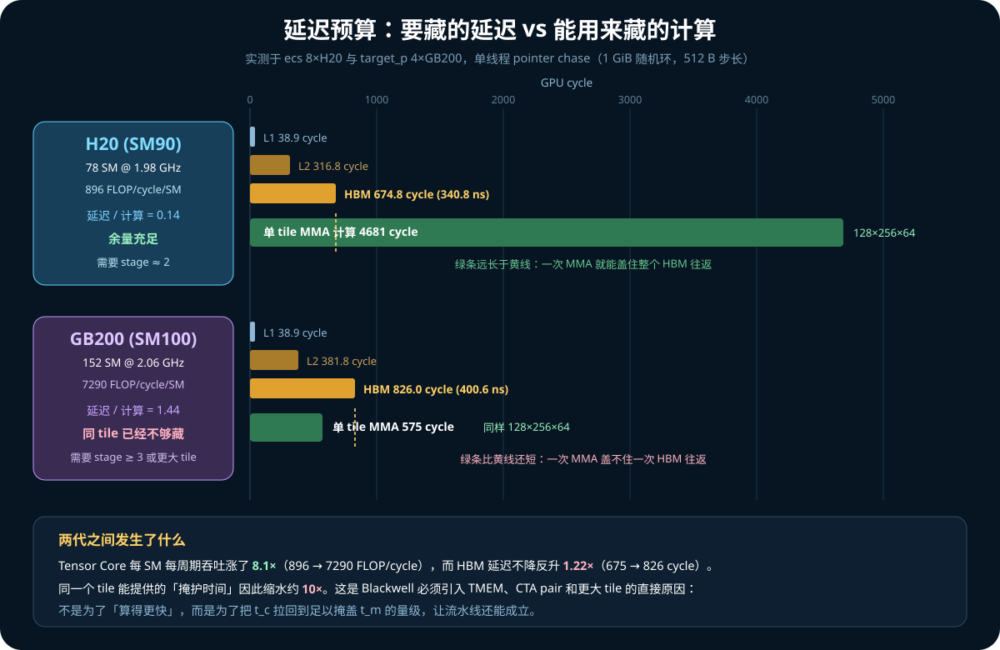
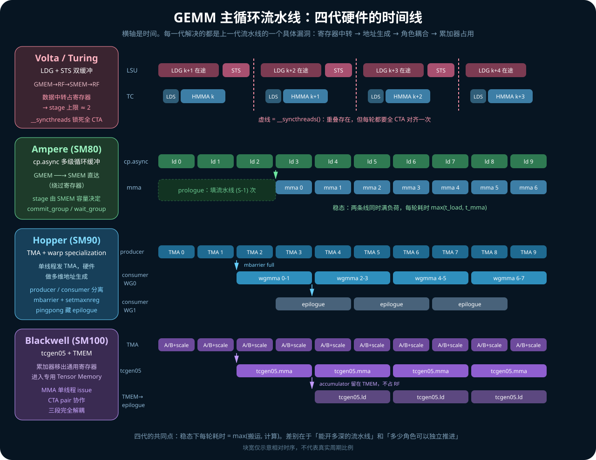
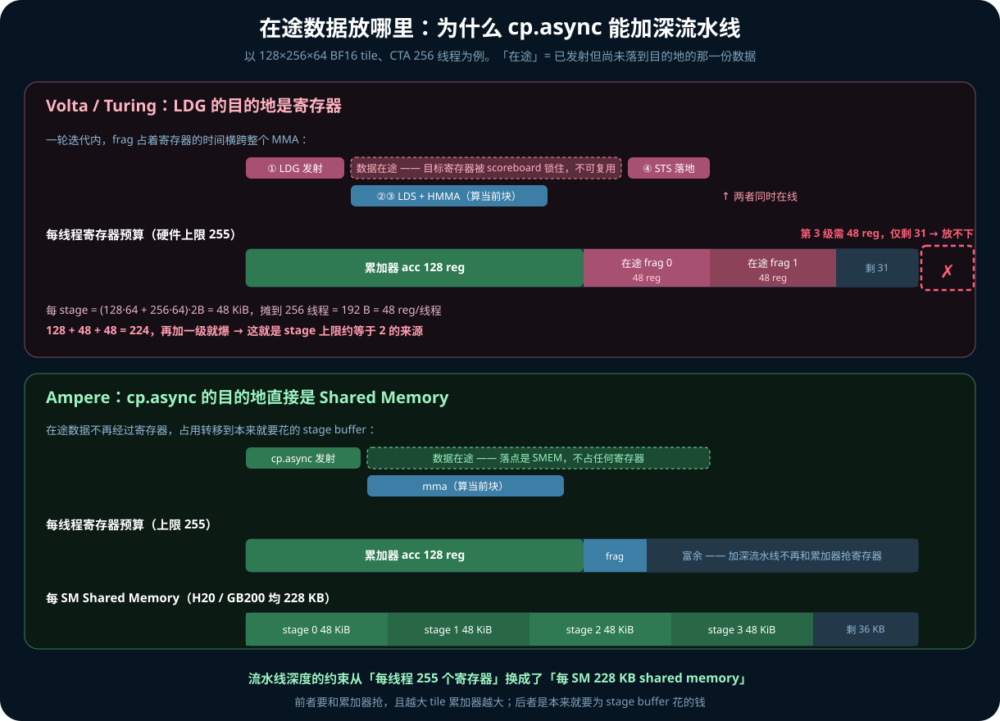
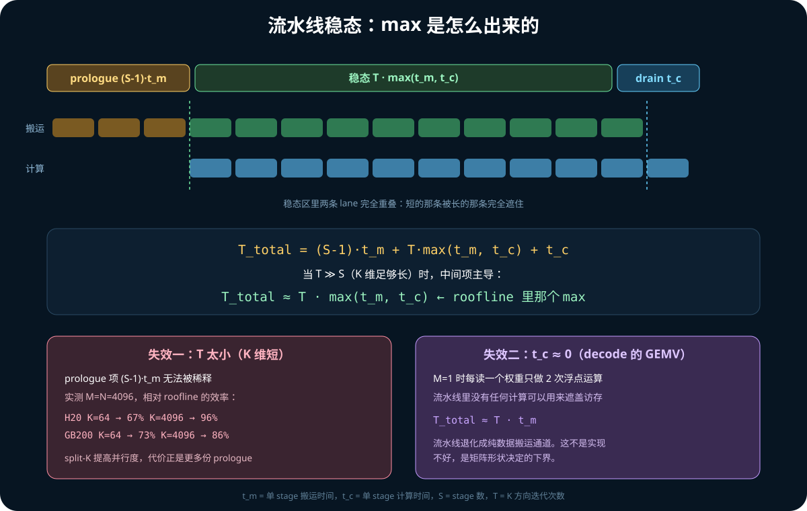
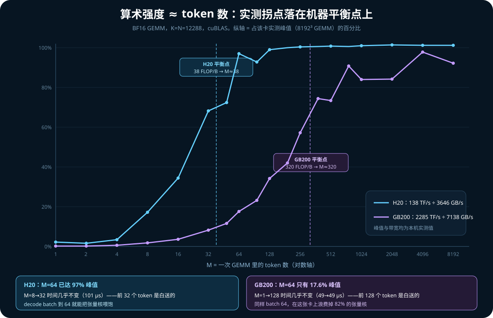

# 11. GEMM 软件流水线：从延迟隐藏到 roofline 里的那个 max

前面几章已经分别讲过 tiling（[04](04_gemm_mma_tensor_core.md)）、架构指令演进
（[05](05_ampere_hopper_blackwell.md)）和 CuTe 的 pipeline 抽象
（[09](09_cute_dsl_gemm_pipeline.md)）。它们回答了「流水线长什么样」。

这一章回答另外三个问题：

```text
为什么必须有流水线？——要藏的延迟到底多大
为什么 roofline 写 max 而不是 sum？——稳态怎么推出来的
什么时候这套东西会失效？——prologue、小 K、GEMV
```

全部结论都在 `ecs`（8×H20，SM90）和 `target_p`（4×GB200，SM100）上实测过，
数据和复现代码见 §12。

不熟悉微架构术语的读者可以先跳到 §3，那里有缩写表和几个容易混淆的概念。

## 1. 实测：要藏的延迟有多大

用单线程 pointer chase 测裸访存延迟（每次 load 依赖上一次结果，无法被任何流水线
掩盖），1 GiB 随机环、512 B 步长以避开 prefetch 和同 cacheline：

| 层级 | H20 (1.98 GHz) | GB200 (2.06 GHz) |
|---|---|---|
| L1 | 38.9 cycle / 19.7 ns | 38.9 cycle / 18.9 ns |
| L2 | 316.8 cycle / 160.0 ns | 381.8 cycle / 185.2 ns |
| **HBM** | **674.8 cycle / 340.8 ns** | **826.0 cycle / 400.6 ns** |

一次 HBM 往返要 700~800 个周期。如果 warp 每次都老老实实等 load 回来再算，Tensor
Core 会有 99% 的时间闲着。**流水线存在的唯一理由就是把这几百个周期填满。**

注意 HBM 延迟并没有随代际下降，反而略升。这一点在下一节会变得很关键。

## 2. 能用来藏的计算有多少

取一个典型 CTA tile `128×256×64`：

```text
FLOPs = 2 · 128 · 256 · 64 = 4.19 M
```

用实测峰值折算成每 SM 每周期吞吐：

| | 实测峰值 BF16 | SM 数 | 频率 | FLOP/cycle/SM | 单 tile 计算 |
|---|---|---|---|---|---|
| H20 | 138.4 TFLOP/s | 78 | 1.98 GHz | 896 | **4681 cycle** |
| GB200 | 2284.6 TFLOP/s | 152 | 2.06 GHz | 7290 | **575 cycle** |

把两节的数字放在一起看：



```text
H20    : 4681 cycle 计算  vs  675 cycle 延迟   →  比值 0.14，余量充足
GB200  :  575 cycle 计算  vs  826 cycle 延迟   →  比值 1.44，已经不够
```

**这是理解 Blackwell 全部设计动机的一个数字。** 两代之间 Tensor Core 每 SM 每周期
吞吐涨了 8.1 倍，HBM 延迟反升 1.22 倍，于是同一个 tile 能提供的「掩护时间」缩水
约 10 倍。

所以 Blackwell 引入 TMEM、CTA pair、更大 tile，主要目的不是「算得更快」——算力
本来就已经有了——而是**把 t_c 拉回到足以掩盖 t_m 的量级，让流水线还能成立**。

## 3. 先厘清几个概念

### 3.1 数据通路上的缩写

后文反复出现的这条链：

```text
GMEM --LDG--> RF --STS--> SMEM --LDS--> RF --HMMA--> TC
```

| 缩写 | 全称 | 是什么 |
|---|---|---|
| GMEM | Global Memory | 显存（HBM），片外。容量大、延迟高（§1 测得 ~700 cycle） |
| RF | Register File | 寄存器堆。片上最快，每 SM 256 KB，静态切分给各线程，**每线程最多 255 个 32-bit 寄存器** |
| SMEM | Shared Memory | 片上便签存储，CTA 内所有线程共享，与 L1 共用物理存储。H20/GB200 每 SM 最多 228 KB |
| TC | Tensor Core | 专做矩阵乘累加的硬件单元，和 CUDA Core 是并列的两套执行部件 |
| LDG | **L**oa**D** **G**lobal | 指令：GMEM → RF |
| STS | **ST**ore **S**hared | 指令：RF → SMEM |
| LDS | **L**oa**D** **S**hared | 指令：SMEM → RF |
| LDSM | LoaD Shared Matrix | 指令：SMEM → RF，且按 MMA 要求的 fragment 布局重排 |
| HMMA | **H**alf-precision **MMA** | 指令：张量核矩阵乘累加 |

命名规律：`LD`/`ST` + 地址空间首字母（**G**lobal / **S**hared / **L**ocal）。
MMA 的前缀是数据类型：`H`alf、`I`nt、`D`ouble；Hopper 的 warpgroup 版本在 SASS
里对应带 `G` 的变体（`HGMMA` 等，G = warp**G**roup）。

还要区分两套指令名，它们指的是同一件事的不同层次：

```text
PTX（虚拟 ISA，nvcc 输出）   ld.global   st.shared   ldmatrix   mma.sync
SASS（真实机器码，ptxas 输出） LDG         STS         LDSM       HMMA
```

写 CUDA 时看到的是 PTX 层；用 `cuobjdump -sass` 或 Nsight 看到的是 SASS 层。
寄存器分配是 ptxas 在这一步做的。

### 3.2 累加器 C 在哪里，是谁决定的

**它是什么。** `D = A×B + C` 里的 `C`。在 GEMM 主循环中它是沿 K 维一直累加的
**部分和**：每处理完一个 k_tile，`acc += A_tile × B_tile`，K 走完了 `acc` 才是最终
结果。

**它有多大。** CTA tile 128×256、FP32 累加：

```text
128 · 256 · 4 B = 128 KiB
摊到 CTA 的 256 个线程 = 512 B/线程 = 128 个寄存器/线程
```

每线程上限 255 个寄存器，**光累加器就吃掉一半**。这是后面所有寄存器压力讨论的
起点。

**谁决定它待在寄存器里。** 三层，要分开看：

| 层次 | 决定了什么 | 能不能改 |
|---|---|---|
| ISA / 硬件 | 累加器**必须**是寄存器操作数 | 不能。Ampere 的 `mma.sync.aligned.m16n8k16.f32.f16.f16.f32 {d0..d3}, {a0..a3}, {b0,b1}, {c0..c3}` 里 `c`/`d` 就是寄存器；张量核没有直接累加进 SMEM 的通路 |
| 编译器 (ptxas) | 具体分配哪几个物理寄存器、要不要 spill | 间接可控（`__launch_bounds__`、`maxrregcount`） |
| 算法 | 整个 K 循环期间**不落盘** | 可以改，但不该改 |

最后一层值得解释：理论上可以每个 k_tile 后把部分和写回 SMEM 甚至 GMEM，下一轮再
读回来。但那样引入的额外流量正好抵消掉 tiling 想省的东西——**累加器常驻寄存器就是
tiling 的目的本身**。

**「不参与流水」是什么意思。** 指它不需要双缓冲，因为它不流动：原地读-改-写，
主循环期间对 HBM 零流量，只在 epilogue 写出一次。流水线里换来换去的只有 A/B tile。

**Blackwell 改的正是第一层。** `tcgen05.mma` 的累加器落在 TMEM 而非 RF，等于把上面
那 128 个寄存器/线程还给了程序员。这不是锦上添花——结合 §2 的数字，Blackwell 必须
用更大的 tile 才能凑够掩护时间，而更大的 tile 意味着更大的累加器，寄存器根本放
不下。TMEM 是大 tile 的前提条件。

### 3.3 M / N / K 分别对应 Transformer 里的什么

以 QKV 投影为例：

```text
Q_input [S, d_model] × W_Q [d_model, d_q] → Q [S, d_q]
```

对上 GEMM 的 `C[M,N] = A[M,K] · B[K,N]`：

| GEMM 维 | Transformer 里是 | 典型值 | 怎么切 |
|---|---|---|---|
| **M** | token 数 S | prefill 数千，decode = batch | 切成 BM（如 128），**分给不同 CTA 并行做** |
| **N** | 输出特征维 d_q | 数千 | 切成 BN（如 256），**分给不同 CTA 并行做** |
| **K** | 输入特征维 d_model | 数千 | 切成 k_tile（如 64），**主循环里串行累加** |

所以回答「prefill 是不是在 token 维切分、每次算一部分 token」：**token 维确实被切
了，但它是 M 维的并行切分，不是 k_tile 那种串行切分。** 两者性质完全不同：

```text
M / N 切分  → 产生多少个 CTA → 决定 GPU 填不填得满（并行度）
K   切分   → 主循环迭代次数 T → 决定 prologue 占比（流水线深度所在的那个循环）
```

k_tile=64 切的是 `d_model` 这个**归约维**——64 个输入通道的部分和，不是 64 个 token。

三个补充：

- 实践中 `W_Q`/`W_K`/`W_V` 常拼成一个 `W_QKV` 做一次 GEMM，N 变成 `d_q+d_k+d_v`。
  更大的 N 意味着 A tile 被更多输出复用，效率更好；
- prefill 时 M = S = 几千，CTA 数量充足，GPU 填得满；decode 时 M = batch，可能只有
  几十，这正是 §8 的主题；
- vLLM 的 chunked prefill 是**调度层**按 token 切，和这里的 GEMM tiling 不是一个
  层级，但都作用在 M 维——chunk 开太小会让每个 GEMM 的 M 掉进 §8 那条曲线的左半边。

## 4. 四代流水线：每一代补上一个漏洞



### 4.1 Volta / Turing：LDG + STS 双缓冲

数据必须绕道寄存器：

```text
GMEM --LDG--> RF --STS--> SMEM --LDS--> RF --HMMA--> TC
```

```cuda
// prologue
LDG  frag <- gmem[0];
STS  smem[0] <- frag;

for (k = 0; k < K_TILES; ++k) {
    LDG  frag <- gmem[k+1];        // ① 提前发射下一块，不等
    LDS  a_rf, b_rf <- smem[k%2];  // ② 读当前块（已在 SMEM 里）
    HMMA acc += a_rf * b_rf;       // ③ 算当前块
    __syncthreads();
    STS  smem[(k+1)%2] <- frag;    // ④ ① 的结果此时才落地
    __syncthreads();
}
```

重叠来自 ① 和 ④ 之间隔了整个 MMA——scoreboard 让 LDG 在后台飞行，warp 不阻塞。

#### 为什么这仍然限制了流水线深度

这里有个容易误解的点：「① 只是发起读取，② 才把数据读进寄存器，所以 ① 不占寄存器」。

**不对。`frag` 就是寄存器。** `LDG` 的目的操作数是寄存器，指令一发射，目标寄存器
就被 scoreboard 标记为「在途」，别的指令不能写它，直到数据从 HBM 回来。这段占用
时间正好横跨整个 MMA——**这是设计意图**（用 MMA 的时间掩盖延迟），但代价是那批
寄存器在整个 MMA 期间都被锁着。

还要注意 ① 和 ② 读的不是同一份数据：

```text
①  下一块 (k+1)  GMEM → RF      在飞，占 frag
②  当前块 (k)    SMEM → RF      马上要算，占 a_rf / b_rf
```

所以任一时刻**三份数据同时在线**：`acc`（全程）、`frag`（在途的下一块）、
`a_rf`/`b_rf`（当前块的 MMA 操作数）。



算一下账，仍用 `128×256×64` BF16 tile、CTA 256 线程：

```text
每 stage 数据量 = (128·64 + 256·64) · 2 B = 48 KiB
摊到 256 线程   = 192 B/线程 = 48 个寄存器/线程

累加器          128 reg
+ 在途 stage 0   48 reg
+ 在途 stage 1   48 reg
                ------
                224 reg      （上限 255，已经很紧）
再加一级         272 reg      ✗ 放不下
```

**这就是 stage 上限约等于 2 的来源。** 而且它和累加器直接抢资源：想用更大的 tile
提高计算强度，累加器变大，能开的流水级反而更少。

另一个硬伤是 `__syncthreads()` 锁死整个 CTA：所有 warp 每轮都要对齐一次，快的等
慢的。

### 4.2 Ampere（SM80）：`cp.async` 让数据不走寄存器

```cuda
cp.async.cg.shared.global [smem_ptr], [gmem_ptr], 16;
cp.async.commit_group;              // 把已发射的打包成一组
cp.async.wait_group 2;              // 等到「未完成组数 ≤ 2」
```

关键变化只有一句：**这条指令的目的地直接是 shared memory，没有寄存器目的操作数。**
硬件在后台把 GMEM 数据写进 SMEM，全程不经过 RF。

于是 §4.1 那笔账变成：

```text
寄存器:  累加器 128 + 少量 MMA fragment    → 富余
SMEM  :  48 KiB × 4 stage = 192 KiB        → 228 KB 放得下
```

**流水线深度的约束从「每线程 255 个寄存器」换成了「每 SM 228 KB shared memory」。**
这个转换之所以划算，有两个原因：

1. SMEM 是**本来就要花**的钱——stage buffer 无论如何都得放在那；而寄存器是额外
   占用，且要和累加器抢；
2. 寄存器压力还会压低 occupancy，反过来削弱跨 CTA 的相互掩盖，是双重惩罚。

于是可以开**多级循环缓冲**而不只是双缓冲：

```text
SMEM:  [stage0][stage1][stage2][stage3]   ← 环形复用

iter k:  cp.async → stage[(k+S-1)%S]     发射，不等
         wait_group S-1                   确认 stage[k%S] 已到
         mma on stage[k%S]
```

同期引入的 **split arrive/wait barrier** 把「我到了」和「我要等」拆开，比传统
barrier 更适合 producer-consumer。

### 4.3 Hopper（SM90）：TMA + warp specialization

`cp.async` 仍要每个线程各自算地址、各自发指令，地址计算本身吃掉不少发射带宽。
Hopper 两个改动：

**TMA**——一个专用硬件单元，单线程一条指令搬整个多维 tile，地址生成、边界处理、
swizzle 全由硬件做，完成信号走 mbarrier：

```cuda
if (elect_one_sync()) {                     // 一个线程就够
    cp.async.bulk.tensor.2d.shared::cluster.global
        [smem], [tma_desc, {x, y}], [mbarrier];
}
```

**Warp specialization**——不再让所有 warp 干同样的事：

```text
CTA (例如 384 线程 = 3 个 warpgroup)
  ├─ Producer warpgroup   wait(empty[i]) → 发 TMA → 硬件 arrive(full[i])
  └─ Consumer warpgroup×2 wait(full[i])  → wgmma  → arrive(empty[i])
```

配合 `setmaxnreg` 做寄存器再分配：producer 只算地址，主动交出寄存器；consumer 要
放累加器，拿到更多。**同一个 CTA 里两类 warp 的寄存器预算不同，这在 Hopper 之前
做不到。**

`wgmma` 本身也是异步的，而且可以通过 matrix descriptor **直接从 SMEM 读操作数**，
连 `ldmatrix` 到寄存器这一步都省了。

CUTLASS 的 **pingpong** 调度让两个 consumer warpgroup 交替进入 mainloop 和
epilogue——一个做 MMA 时另一个写回 C，于是连 epilogue 也被藏进流水线。

### 4.4 Blackwell（SM100）：tcgen05 + TMEM

累加器从通用寄存器搬进专用 Tensor Memory（见 §3.2）：

```text
A/B/scale:  HBM --TMA--> SMEM
MMA:        tcgen05.mma 读 SMEM operand，累加器写 TMEM
Epilogue:   tcgen05.ld → RF → cast/activation → HBM
```

收益是三段角色**完全解耦**：MMA 不再占着大片寄存器，epilogue 可以独立推进，大 tile
和 CTA pair 才有资源空间。结合 §2 的数字，这不是锦上添花而是必需品。

## 5. 稳态数学：max 是怎么出来的



设 k 循环 T 次，单次搬运 `t_m`、计算 `t_c`，流水线 S 级：

```text
T_total = (S-1)·t_m          ← prologue，填流水线
        + T · max(t_m, t_c)  ← 稳态
        + t_c                ← drain，排空
```

**为什么稳态是 max 而不是 sum？** 因为加载和计算由两套独立硬件承担——HBM 控制器 /
TMA 引擎 vs Tensor Core——它们物理上并行工作。单个 tile 的「先加载后计算」确实是
串行的（那是**延迟**），但不同 tile 的加载和计算相互重叠（那是**吞吐**）。流水线
只填满一次，之后短的那条边被长的那条完全盖住。

T ≫ S 时中间项主导：

```text
T_total ≈ T · max(t_m, t_c)     ← roofline 里那个 max
```

再叠加 GPU 的 occupancy 机制：一个 warp 卡在访存时调度器立刻切到另一个发射 MMA，
多个 resident CTA 之间也互相掩盖各自的 prologue。所以实测常常比单 CTA 分析更好。

## 6. stage 数：两级为什么往往不够

### 6.1 先把「访存时间」拆成两个量

一个很自然的想法是：**两级缓冲时，只要计算比访存慢，加载就总能按时完成，还要更多
级干什么？** 这个推理在一个前提下成立，而那个前提经常不成立。关键是分清：

```text
带宽时间 t_m = 字节数 / 带宽   数据流起来之后，搬完这一块要多久
延迟     L                     从发出请求到第一个字节到达要多久
```

两者可以差一个数量级，而**两级缓冲要求计算时间盖住的是延迟 L，不是带宽时间 t_m**。

看时序就清楚了。S 级缓冲，稳态下开始计算某个 stage 时，刚被腾空的那个 buffer 才能
发起新加载，而这次加载要等 S-1 个计算槽之后才被用到：

```text
S = 2:   [算 stage0]              ← 同时只有 stage1 在途
         加载 stage1 的可用时间 = 1 · t_c

S = 4:   [算 stage0]              ← stage1 / 2 / 3 同时在途
         每次加载的可用时间 = 3 · t_c
```

于是有两条彼此独立的约束：

```text
带宽约束（稳态不被搬运卡住）:   t_m ≤ t_c
延迟约束（每轮不用停下来等）:   L  ≤ (S-1) · t_c
```

**两级只满足了第一条。** 这就是 §6.4 那个公式的来源：

```text
S ≥ L / t_c + 1
```

代入 §1、§2 的实测值：

```text
H20   : L = 675 cycle,  t_c = 4681 cycle  →  S ≥ 1.14  →  2 级够
GB200 : L = 826 cycle,  t_c =  575 cycle  →  S ≥ 2.44  →  要 3 级
```

**所以你的直觉在 H20 上是对的**——一次 MMA 的时间是 HBM 延迟的 7 倍，两级绰绰有
余。到了 GB200 就不成立了，单个 tile 的计算连一次 HBM 往返都盖不住。这也再次印证
§2 那个结论：真正变化的不是「要不要流水线」，而是「要多深」。

### 6.2 除了平均延迟，多级还买到什么

即使平均延迟能被两级盖住，实践中仍然要开更多：

1. **延迟有长尾。** L2 命中/未命中、DRAM page 开关、bank 冲突、TLB miss、其他 CTA
   争用——尾部延迟远高于均值。按均值配级数，意味着相当比例的加载仍会停顿。多出来
   的级数是给方差留的缓冲垫。
2. **请求要排队。** 一个 SM 上有多个 CTA，整卡上百个 SM 共享内存系统。stage buffer
   实质上是队列槽位：前面的请求还堵着，你也能继续发射后面的，不必空转。
3. **发射记账是成组的。** `cp.async.commit_group` / `wait_group N` 以组为单位，
   级数多才有腾挪空间，否则会因为记账粒度粗而提前等待。
4. **Hopper 上决定 producer 能领先多远。** warp specialization 之后，producer warp
   领先 consumer 越多，抗抖动能力越强——级数就是这个领先距离的上限。

### 6.3 什么时候加级数没有用

多级买的是**延迟容忍度，不是带宽**。三种情况加了也白加：

- **已经带宽受限**（`t_m > t_c`）：再多级只是让更多数据同时在途排队，稳态时间仍是
  `T · t_m`。§10 的 GEMV 是极端情形，`t_c ≈ 0`，任何级数都救不回来；
- **T 太小**（K 维短）：级数越多 prologue `(S-1)·t_m` 越长，反而更亏，见 §9；
- **SMEM 被吃光**：resident CTA 数下降，跨 CTA 的相互掩盖减弱，可能净亏。

### 6.4 容量约束：级数的上界

需要多少级（下界）：

```text
S ≥ ⌈ L / t_c ⌉ + 1
```

能开多少级（上界）由 SMEM 卡死。同样 `128×256×64` tile：

```text
每 stage = (128·64 + 256·64) · 2B = 48 KiB
两卡每 SM 可用 SMEM 均为 228 KB
→ 最多 4 stage
```

**这就是 tile 大小和 stage 数必须联合调优的原因**：tile 开大，`t_c` 变长（好，下界
降低），但每 stage 的 SMEM 占用也变大（坏，上界降低），同时累加器变大压低
occupancy。CUTLASS 的 tile/stage 组合表就是在扫这个多维权衡面。

FP8/FP4 在这里有个二阶好处：元素更小 → 每 stage 的 SMEM 占用更小 → 同样容量能开更
多 stage，或者同样级数能用更大 tile。

## 7. 还有嵌套的第二层流水

上面讲的是 GMEM→SMEM 那一级。在 Ampere 上 SMEM→RF 这一级同样要双缓冲，粒度是
k_tile 内部的 MMA atom：

```text
LDSM:  [ld frag0][ld frag1][ld frag2][ld frag3]
HMMA:            [mma f0  ][mma f1  ][mma f2  ]
```

所以一个高性能 GEMM kernel 里**嵌套着两层软件流水线**：外层藏 HBM 延迟（几百
cycle），内层藏 SMEM 延迟（几十 cycle，见 §1 的 L1 数据 38.9 cycle）。Hopper 的
wgmma 直读 SMEM 让内层在很多配置下不再必要。

## 8. 实测一：算术强度 ≈ token 数

对一个权重矩阵 `[K, N]` 喂进 M 个 token：

```text
FLOPs = 2 · M · K · N
Bytes = 2 · K · N        (BF16 权重，读一次)
强度  = FLOPs / Bytes ≈ M
```

**权重 GEMM 的算术强度约等于参与这次 GEMM 的 token 数**（即 §3.3 里的 M 维）。
超过机器平衡点（peak FLOPS ÷ HBM 带宽）才进入算力受限区。

实测（K=N=12288，BF16，cuBLAS）：

| | 实测峰值 | 实测 HBM 读带宽 | 机器平衡点 |
|---|---|---|---|
| H20 | 138.4 TFLOP/s | 3646 GB/s | **38 FLOP/B** |
| GB200 | 2284.6 TFLOP/s | 7138 GB/s | **320 FLOP/B** |



| M | H20 %峰值 | H20 耗时 | GB200 %峰值 | GB200 耗时 |
|---:|---:|---:|---:|---:|
| 1 | 2.3% | 93 μs | 0.3% | 49 μs |
| 8 | 17.2% | 101 μs | 1.9% | 56 μs |
| 16 | 34.5% | 101 μs | 3.7% | 57 μs |
| 32 | 68.3% | 102 μs | 8.3% | 51 μs |
| 64 | **97.1%** | 144 μs | 17.6% | 48 μs |
| 128 | 99.1% | 282 μs | 34.2% | 49 μs |
| 256 | 100.4% | 556 μs | 57.3% | 59 μs |
| 384 | 100.7% | 832 μs | 74.4% | 68 μs |
| 768 | 100.7% | 1663 μs | **90.8%** | 112 μs |
| 4096 | 101.3% | 8823 μs | 97.8% | 554 μs |

三个可以直接拿去用的读数：

**（1）拐点精确落在平衡点上。** H20 平衡点 38，M=32 时 68%、M=64 时 97%；GB200
平衡点 320，M=256 时 57%、M=384 时 74%、M=768 时 91%。模型和实测对上了。

**（2）「前 N 个 token 是白送的」。** H20 上 M=8→32 耗时几乎不变（101→102 μs），
GB200 上 M=1→128 耗时几乎不变（49→49 μs）。在带宽受限区，权重已经读进来了，多喂
token 不额外花时间。**这就是 continuous batching 全部收益的来源。**

**（3）同一个 batch size 在两张卡上是完全不同的世界。** batch=64：H20 已达 97%
峰值，GB200 只有 17.6%——浪费掉 82% 的张量核。**decode batch 的最优值不可跨卡搬运。**

一个反直觉的观察：H20 上 M=2、M=4 反而比 M=1 和 M=8 慢一倍（250 μs vs 93/101 μs），
有效带宽只有 1200 GB/s。cuBLAS 在这些形状上选了不合适的 kernel。**小 M 区间不是
平滑退化的**，做 batch=1~4 的延迟优化时要实测而不是外推。

## 9. 实测二：K 太短时流水线填不满

固定 M=N=4096 扫 K，先算出每个点的 roofline 上界，再看实测偏离多少。**必须先确认
自己在哪个受限区，否则会把带宽瓶颈误判成流水线问题**——这一步很容易被跳过。

**H20（平衡点 38）：**

| K | 强度 | 受限于 | roofline | 实测 | 达成率 |
|---:|---:|---|---:|---:|---:|
| 64 | 32 | 带宽 | 18.7 μs | 28.0 μs | 67% |
| 128 | 62 | 算力 | 31.0 μs | 40.4 μs | 77% |
| 512 | 228 | 算力 | 124.1 μs | 139.6 μs | 89% |
| 2048 | 683 | 算力 | 496.5 μs | 524.4 μs | 95% |
| 32768 | 1820 | 算力 | 7944 μs | 8216 μs | **97%** |

**GB200（平衡点 320）：**

| K | 强度 | 受限于 | roofline | 实测 | 达成率 |
|---:|---:|---|---:|---:|---:|
| 64 | 32 | 带宽 | 9.5 μs | 13.1 μs | 73% |
| 256 | 120 | 带宽 | 10.0 μs | 15.2 μs | 66% |
| 512 | 228 | 带宽 | 10.6 μs | 17.6 μs | 60% |
| 1024 | 410 | 算力 | 15.0 μs | 22.7 μs | 66% |
| 4096 | 1024 | 算力 | 60.2 μs | 70.0 μs | 86% |
| 32768 | 1820 | 算力 | 481.3 μs | 551.1 μs | **87%** |

两个结论：

**（1）roofline 的 max 在 K 大时是好模型。** H20 收敛到 97%，GB200 收敛到 87%。
剩下的差距是 prologue、epilogue 和 wave quantization。

**（2）一个容易踩的坑。** 同样 M=N=4096，K≤512 时 GB200 是**带宽受限**而 H20 是
**算力受限**。原因是 FP32 的 C 矩阵写回（4096²×4B = 67 MB）在 K 小时占了主要流量，
把强度压到 320 以下——而 H20 的平衡点只有 38，同样的形状还在算力区。

如果不做这步归因，看到「GB200 在 K=512 只有 48.7% 的相对效率、H20 有 91.9%」，很容易
得出「Blackwell 流水线更难填满」的结论。方向没错（§2 的确如此），但这组数据本身
证明不了它——这里主要是输出写回的带宽墙。**换硬件时，同一段代码可能悄悄换了受限
维度。**

## 10. GEMV：流水线塌缩

M=1 时每读一个权重元素只做 2 次浮点运算，`t_c ≈ 0`：

```text
T_total = (S-1)·t_m + T·max(t_m, 0) + 0
        ≈ T · t_m
```

**流水线里没有任何计算可以用来遮盖访存。** 再深的流水线也只是把 HBM 的数据原样
倒出来（§6.3 的第一种情形）。实测印证：H20 上 M=1 达到 3241 GB/s（实测读带宽的
89%），GB200 上达到 6197 GB/s（87%）——**已经贴着带宽墙，没有优化空间**。

所以 decode 走到带宽 roofline 上不是实现不好，是矩阵形状决定的下界。

## 11. 对 PD 分离的意义

把 §8 和 §10 合起来看：

```text
prefill : M = 数千 token  → 强度 ≫ 平衡点 → 算力受限 → 流水线满负荷
decode  : M = batch size  → 强度 ≪ 平衡点 → 带宽受限 → 流水线上半条线是空的
```

两者位于 roofline 的两个极端，对硬件、tile 配置、batch 大小的最优选择完全不同。
混在同一个 engine 里跑，必然有一边在浪费——这是 PD 分离的第一性依据。

§8 的读数（3）还给出一个具体的运维含义：**decode 节点的最优 batch 与卡型强绑定**。
H20 上 batch 64 就够，GB200 上要 768 才接近饱和。把 H20 上调好的 serving 配置直接
搬到 Blackwell，会白白浪费大部分算力。

相关背景见 [05 KV 接收与完成语义](../vllm_blade_kvt_pd_learning/05_kv_receive_and_completion.md)
所在的 PD 分离系列。

## 12. 复现

两个微基准（纯 CUDA + cuBLAS，不依赖 PyTorch）：

```text
ecs      : ~/nvfix/gemm_sweep.cu   ~/nvfix/pipe_probe.cu
target_p : /tmp/gemm_sweep.cu      /tmp/pipe_probe.cu
```

```bash
# H20 (ecs)。注意 ecs 的 NVML/libcuda 默认版本与内核模块不匹配，
# 需要指向 570.133.20：~/nvfix 里有对应软链。
nvcc -O3 -arch=sm_90  gemm_sweep.cu -lcublas -o gemm_sweep
LD_LIBRARY_PATH=$HOME/nvfix CUDA_VISIBLE_DEVICES=0 ./gemm_sweep

# GB200 (target_p)，CUDA 13.2
nvcc -O3 -arch=sm_100 gemm_sweep.cu -lcublas -o gemm_sweep
CUDA_VISIBLE_DEVICES=0 ./gemm_sweep
```

`gemm_sweep` 先测实测读带宽和实测峰值算力（因此机器平衡点是实测值而非标称值），
再扫 M。`pipe_probe` 做 pointer chase 延迟和 K 扫描。两者都取三轮中位数。

注意 CUDA 13 移除了 `cudaDeviceProp::clockRate`，要改用
`cudaDeviceGetAttribute(&v, cudaDevAttrClockRate, dev)`，否则在 GB200 上编不过。

想看真实指令序列，用 `cuobjdump -sass` 观察 §3.1 那张表里的 SASS 助记符：

```bash
nvcc -arch=sm_90 -cubin -o k.cubin your_kernel.cu && cuobjdump -sass k.cubin | less
```

## 13. 自检

1. `LDG`、`STS`、`LDS`、`HMMA` 各自把数据从哪搬到哪？PTX 层对应什么？
2. 累加器为什么必须待在寄存器里？这是硬件、编译器还是算法决定的？Blackwell 改了
   哪一层？
3. `LDG frag <- gmem[k+1]` 只是「发起」读取，为什么仍然占着寄存器？
4. 为什么 Volta/Turing 的 stage 数上限约为 2，而 Ampere 可以到 4？约束换成了什么？
5. QKV 投影里，token 维对应 GEMM 的哪个维？它是被并行切分还是被主循环串行切分？
   k_tile 切的是什么？
6. 「计算比访存慢，两级缓冲就够了」——这句话在什么前提下成立？H20 和 GB200 上分别
   成立吗？
7. 为什么 roofline 写 max 而不是 sum？这个近似在什么条件下成立？
8. 同样 `128×256×64` tile、同样 228 KB SMEM，为什么两张卡需要的 stage 数不同？
9. 为什么说「前 N 个 token 是白送的」？N 由什么决定？
10. 一个 M=N=4096、K=512 的 GEMM，在 H20 和 GB200 上分别受限于什么？为什么不一样？
11. decode 的 GEMV 已经跑到实测带宽的 87~89%，还有什么优化空间？（提示：不在这条
    曲线上，见 §11）

## 14. 官方资料

- [Hopper Tuning Guide](https://docs.nvidia.com/cuda/hopper-tuning-guide/)
- [Blackwell Tuning Guide](https://docs.nvidia.com/cuda/blackwell-tuning-guide/)
- [PTX ISA：`cp.async` / `cp.async.bulk.tensor` / `wgmma` / `tcgen05`](https://docs.nvidia.com/cuda/parallel-thread-execution/)
- [CUDA C++ Programming Guide：Asynchronous Data Copies](https://docs.nvidia.com/cuda/cuda-c-programming-guide/contents.html)
- [CUDA Binary Utilities（`cuobjdump` / `nvdisasm`，SASS 指令集参考）](https://docs.nvidia.com/cuda/cuda-binary-utilities/)
- [CUTLASS Efficient GEMM / Pipelining](https://docs.nvidia.com/cutlass/latest/)
- [tcgen05 MMA Programming Guide](https://docs.nvidia.com/cutlass/latest/media/docs/pythonDSL/mma_docs/tcgen05_programming.html)
