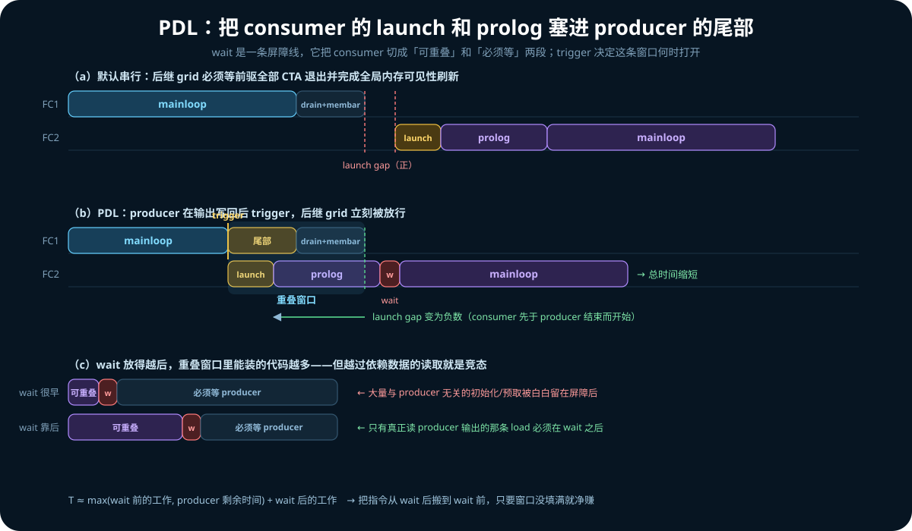
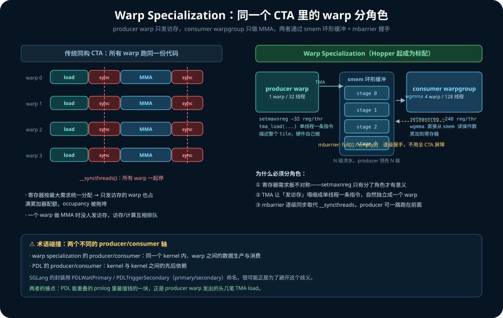
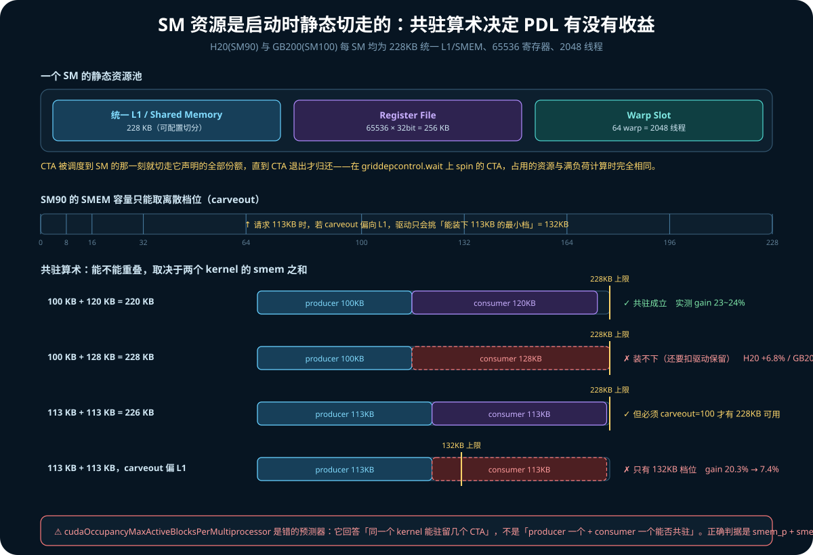
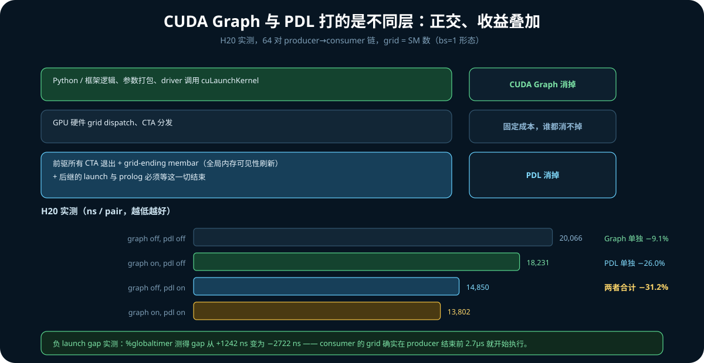
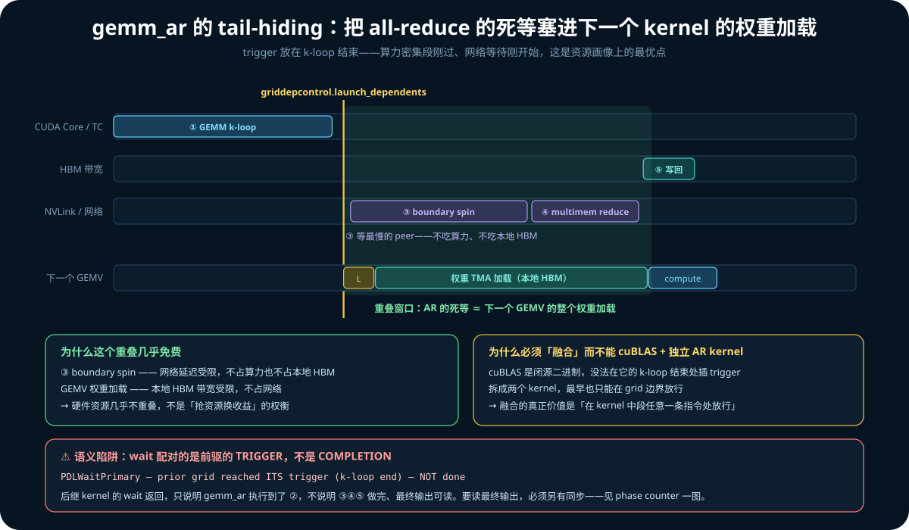
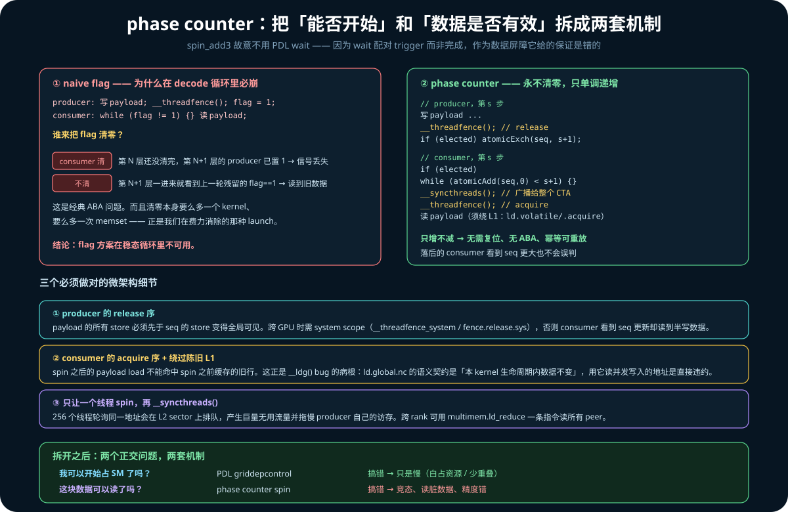
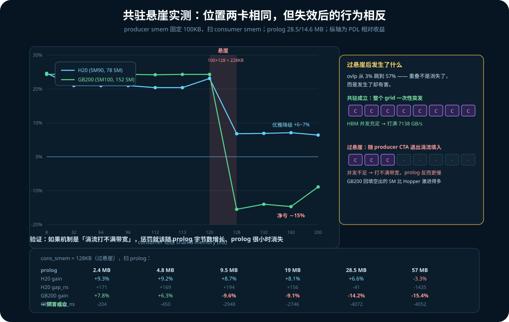
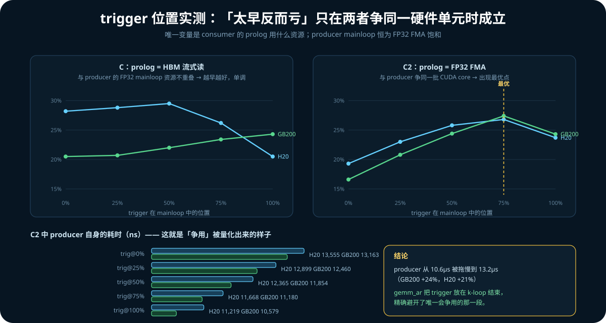

# 12. PDL（Programmatic Dependent Launch）：把 kernel 之间的缝隙压掉

前面几章讲的都是**一个 kernel 内部**怎么快：tiling（[04](04_gemm_mma_tensor_core.md)）、
架构指令演进（[05](05_ampere_hopper_blackwell.md)）、软件流水线与延迟隐藏
（[11](11_gemm_pipeline_deep_dive.md)）。

这一章讲**两个 kernel 之间**。当模型做 bs=1 decode，一个 step 要串行穿过几百个小
kernel 时，瓶颈不再是任何单个 kernel 的 FLOPs，而是它们之间的空隙。

> PDL 管的是**同一条 stream 上相邻的两个 kernel**。往外还有两层并发：不同 stream 之间、
> 不同进程（context）之间——见 [第 13 章](13_context_stream_concurrency.md)。三层是正交的，
> 机制完全不同。

起因是读 SGLang 的一篇文章《PDL 在 SGLang Kimi K3 中的应用》。K3 是 2.8T 参数的混合
注意力模型，decode 一个 token 要过 93 个注意力层（69 层 KDA + 24 层 MLA）和 92 层
latent-MoE，day-0 吞吐约 113 tok/s。文章按调用链梳理了 K3 里接入 PDL 的 kernel。

本章做三件事：

```text
一、把文章里靠文字讲不清的概念补齐（prolog / warp specialization / SM 资源划分）
二、拆解两条真实链路：gemm_ar 的 tail-hiding，spin_add3 的 phase counter
三、写一个微基准，在 H20 和 GB200 上把文章的每条定性结论定量验证一遍
```

**所有性能数字都是在 `ecs`（8×H20，SM90）和 `target_p`（4×GB200，SM100）上实测的**，
基准源码与复现命令见 §9。文章里的代码引用我尽量核实了出处，核实状态在 §11 单独说明。

不熟悉微架构术语的读者可以先看 §2.2 的缩写表。

---

## 1. PDL 是什么

### 1.1 默认串行的代价

同一条 stream 上的两个 kernel，默认是严格串行的：**前一个 grid 的所有 CTA 退出、并且
完成全局内存可见性刷新（grid-ending memory barrier）之后**，后一个 kernel 才开始 launch。

但 consumer 的 launch 和一部分 prolog 根本不依赖 producer 的输出。Yifan Yang 在他的
PDL 博客里点出了这件事：「FC2 的 launch 开销和 prolog 并不*依赖*于 FC1 的结果，只有
FC2 的 mainloop 的执行才依赖于 FC1 的结果」。

### 1.2 两条 PTX 指令

Hopper（sm_90）及更新架构提供两条指令来表达这种「部分依赖」：

| 指令 | 谁执行 | 语义 |
|---|---|---|
| `griddepcontrol.launch_dependents` | producer | 放行后继 kernel。**trigger 之后不能再有 consumer 会读的写操作** |
| `griddepcontrol.wait` | consumer | 在第一次读 producer 输出前等待 |

host 侧还要通过 extensible launch API 打开这个行为：

```cpp
cudaLaunchConfig_t cfg = {};
cfg.gridDim = grid; cfg.blockDim = blk;
cfg.dynamicSmemBytes = smem; cfg.stream = st;
cudaLaunchAttribute attr[1];
attr[0].id = cudaLaunchAttributeProgrammaticStreamSerialization;
attr[0].val.programmaticStreamSerializationAllowed = 1;
cfg.attrs = attr; cfg.numAttrs = 1;
cudaLaunchKernelEx(&cfg, kernel, args...);
```



**wait 是一条屏障线**，它把 consumer 的代码切成两段：wait 之前的可以和 producer 并行跑，
wait 之后的必须等 producer trigger。挪动这条线不改变 producer 何时 trigger，所以：

```text
T_consumer ≈ max(wait 前的工作, producer 剩余时间) + wait 后的工作
```

把一条指令从 wait 后搬到 wait 前，只要重叠窗口还没填满，这条指令的耗时就**净归零**。
这就是「wait 放得越后，可重叠的 prolog 越多」的机制——不是 wait 变短了，是重叠区变大了。

### 1.3 SGLang 的封装

K3 对 PDL 的封装只有两个模板函数（**已核实**，见 §11）：

```cpp
// python/sglang/kernels/jit/include/sgl_kernel/utils.cuh
template <bool kUsePDL> SGL_DEVICE void PDLWaitPrimary() {
#if SGL_ARCH_HOPPER_OR_GREATER
  if constexpr (kUsePDL) asm volatile("griddepcontrol.wait;" ::: "memory");
#endif
}
template <bool kUsePDL> SGL_DEVICE void PDLTriggerSecondary() {
#if SGL_ARCH_HOPPER_OR_GREATER
  if constexpr (kUsePDL) asm volatile("griddepcontrol.launch_dependents;" :::);
#endif
}
```

注意一个细节：`wait` 带了 `::: "memory"` 的 clobber，`trigger` 没有。这个设计是对的，
但**它防不住 §8.2 要讲的那个 ptxas 重排 bug**——`"memory"` 约束的是 NVCC 生成 PTX 的阶段，
而那个 bug 发生在 ptxas 把 PTX 编译成 SASS 的阶段。源码级的 barrier 语义在这里保护不了你。

命名用 primary/secondary 而不是 producer/consumer，很可能是为了避开 §2.3 会讲的术语碰撞。

---

## 2. 概念补课

### 2.1 prolog 到底指什么

**prolog（前导段）= kernel 启动后、到第一次需要读 producer 输出之前的所有工作。**
对一个典型的 Hopper GEMM kernel，具体是：

- CTA 算自己的 tile 坐标，从 param space 读 kernel 参数
- 申请 / 清零 shared memory，清零累加器寄存器
- 初始化 mbarrier，warp specialization 分角色
- **发起不依赖前驱的访存**：权重、bias、scale、routing table 的 HBM→smem 加载

最后一条是 bs=1 场景下最值钱的。对 M=1 的 skinny GEMM（实际退化成 GEMV），权重加载
几乎就是整个 kernel 的时间，所以「权重能不能提前加载」直接决定收益。K3 的 `tiny_gemm`
注释写的是 "Weight prefetch: address is input-independent, load before the PDL wait" ——
权重的地址只跟 layer id 有关，不依赖 producer 算出什么。

### 2.2 缩写表

| 缩写 | 全称 | 一句话 |
|---|---|---|
| CTA | Cooperative Thread Array | 即 CUDA 的 thread block，调度到 SM 的最小单位 |
| SM | Streaming Multiprocessor | GPU 的基本计算单元，H20 有 78 个，GB200 有 152 个 |
| warp | — | 32 个线程，SIMT 锁步执行，硬件调度单位 |
| warpgroup | — | Hopper 引入，4 个连续 warp = 128 线程，`wgmma` 的操作粒度 |
| TMA | Tensor Memory Accelerator | Hopper 的专用拷贝硬件，一条指令描述整个多维 tile 的搬运 |
| mbarrier | — | shared memory 里的异步屏障对象，支持逐级（而非全 CTA）同步 |
| smem | shared memory | 每 SM 一块，与 L1 共用同一块物理 SRAM |
| carveout | — | L1 / smem 之间的容量切分比例 |
| PDL | Programmatic Dependent Launch | 本章主题 |

### 2.3 warp specialization



**传统同构写法**：CTA 里所有 warp 跑同一份代码——发起拷贝、`__syncthreads()`、做 MMA、
再 `__syncthreads()`。

**warp specialization**：同一个 CTA 里不同 warp 跑**不同的代码路径**：

- **producer warp**（DMA warp / load warp）：只发访存，从不碰计算单元
- **consumer warpgroup**（math warp）：只读 smem 做 tensor core 运算

两者通过 shared memory 里的环形缓冲 + mbarrier 握手：

```text
smem: N 级环形缓冲，每级存一个 A-tile + B-tile
      2N 个 mbarrier: full[i](数据到位) / empty[i](缓冲可复用)

producer warp (1 warp，实际只有 1 个线程 elect 出来发指令):
  for stage:
      wait empty[stage%N]
      tma_load(A → smem[stage%N], 完成时硬件自动 arrive full[stage%N])
      tma_load(B → smem[stage%N], 同上)
      ← 不等拷贝完成，立刻发下一级

consumer warpgroup (4 warp):
  for stage:
      wait full[stage%N]
      wgmma(smem[stage%N] → 累加器寄存器)
      arrive empty[stage%N]
```

producer 领先 consumer N 级，HBM 延迟（H20 实测 675 cycle，GB200 826 cycle，见
[11](11_gemm_pipeline_deep_dive.md) §1）被流水线深度吃掉。

**为什么 Hopper 之后这套变成标配——三个动因：**

1. **寄存器需求极不对称。** math warp 需要巨量累加器寄存器，load warp 几乎不需要。而
   CUDA 的寄存器分配是每线程统一的，同构 kernel 里所有 warp 拿一样的配额，按最大需求
   分配 → occupancy 掉光。Hopper 加了 `setmaxnreg` PTX 指令，允许一个 warpgroup 动态
   归还/索取寄存器：producer 缩到约 32 regs/thread，consumer 涨到约 240。**这条指令
   只有在 warp 分了角色之后才有意义。**
2. **TMA 让「发访存」塌缩成单线程一条指令。** TMA 之前需要很多线程各自算地址、发
   `cp.async`，那些指令要占 math warp 的发射槽。有了 TMA，访存自然独立成一个专职 warp。
3. **消除全 CTA 屏障。** `__syncthreads()` 让所有 warp 一起停。换成 mbarrier 后，
   producer 和 consumer 只在具体某一级缓冲上同步，producer 可以一路跑在前面。

> ⚠ **术语碰撞**：warp specialization 的 producer/consumer 是**同一个 kernel 内、warp
> 之间**的数据生产消费；PDL 的 producer/consumer 是**kernel 与 kernel 之间**的。两个
> 完全不同的轴，只是恰好用了同一组词。
>
> 两者的接点：在 warp-specialized kernel 里，PDL 能重叠的 prolog 里最值钱的一块，正是
> producer warp 发出的头几笔 TMA load。K3 的 `kda_decode_mtp`（CuTe-DSL 实现）「提前
> 发起状态 tile 的 TMA load」就是把它挪到了 `griddepcontrol.wait` 之前。

Blackwell（SM100）把这套又深化了一层：`tcgen05` MMA + TMEM（Tensor Memory，独立于
寄存器的新存储层级），角色分得更细，还多出专门管 TMEM 分配/释放的 warp。

---

## 3. SM 资源是启动时静态切走的

这是理解 PDL 为什么会有副作用的关键，也是最容易被 CPU 直觉误导的地方。



### 3.1 「阻塞」在 GPU 上不释放资源

CPU 线程阻塞时，OS 把它换出，寄存器存到内存，核心让给别人。GPU 上完全不是这样。
CTA 一旦被调度到 SM 上：

- 它的**寄存器**从 SM 的 register file 里静态切走一块
- 它的 **shared memory** 从 SM 的 smem 容量里切走一块
- 它占掉若干 **warp slot**

这些分配在 **CTA 退出**时才归还。CTA 不可抢占、不可迁移、不可换出。所以一个 CTA
在 `griddepcontrol.wait` 上 spin，和它在满负荷计算，**占用的物理资源完全一样**。

H20 和 GB200 的静态资源相同（实测，见 [07](07_blackwell_gb200_lab.md)）：
每 SM 228KB 统一 L1/SMEM、65536 个 32-bit 寄存器（256KB）、2048 线程 / 64 warp slot。

### 3.2 共驻算术

于是「两个 kernel 能不能重叠」变成一个加法不等式：

```text
smem(producer 的 CTA) × n₁  +  smem(consumer 的 CTA) × n₂  ≤  SM 的 smem 容量
```

consumer 的 CTA 想上 SM，SM 必须有**当前空闲**的 smem 够它的**全额**请求，而不是
「producer 用完了的部分」。

这直接解释了 K3 `gemm_ar` 里那个看起来很怪的 113KB：

```text
113KB × 2 = 226KB  ≤  228KB  ✓
114KB × 2 = 228KB  ≈  刚好卡死（还要扣驱动保留量）✗
```

**113KB 就是「保证 2 CTA/SM」能取到的最大 smem。**

### 3.3 carveout：不只是容量，还是配置

那 228KB 是 **L1 cache 和 shared memory 共用的一块物理 SRAM**，按离散档位切分
（SM90 的档位约为 0/8/16/32/64/100/132/164/196/228 KB）。

请求 113KB 时，如果 carveout 偏向 L1，驱动只会挑「能装下 113KB 的最小档」= 132KB。
那 2×113 = 226 就放不下了。只有显式设 `cudaFuncAttributePreferredSharedMemoryCarveout = 100`
把整块 SRAM 全要成 smem，才有 228KB 可用。

这正是 `gemm_ar.cuh` 里那句注释的含义：默认 carveout 会
"blocks dual residency and with it the whole tail-hiding scheme"。

§10.3 会给出这个开关的实测代价：**20.3% vs 7.4%**，三分之二的 PDL 收益系在一个 attribute 上。

---

## 4. PDL 是一笔资源交易

搞清楚 §3 之后，「trigger 太早会怎样」就不需要猜了。

**PDL 不是「提前 launch」。** launch 本来就要发生，顺序也没变。PDL 改变的是**硬件允许
后继 grid 开始执行的时刻**——从「前驱所有 CTA 退出 + 全局内存可见性 flush 完成之后」，
提前到「前驱执行了 `launch_dependents` 之后」。CPU 侧 / CUDA Graph 侧的顺序完全不动。

代价在于：**被放行的 consumer CTA 一旦上了 SM，就会从 producer 手里切走资源。**

| | 净赚的条件 | 净亏的条件 |
|---|---|---|
| producer 的状态 | 尾部阶段资源利用率低（等 peer 的 spin、membar、最后一波 CTA） | 还在算力饱和的 mainloop |
| consumer 的 prolog | 延迟受限（发几笔 load 就等着），几乎不耗计算资源 | 吞吐受限，且与 producer 争同一单元 |
| 共驻 | smem/reg 预算够 | 挤不进去——收益为零，甚至为负（§10.2） |

所以 **trigger 的位置就是这笔交易的调节旋钮**：你在选择「producer 从哪一刻开始分享资源」。
`gemm_ar` 选在 k-loop 结束（算力密集段刚完），`add3` 选在 kernel 入口（它本身是个轻量
elementwise kernel，没什么好保护的）——差异完全来自各自的资源画像。

这也解释了原文那句很克制的话：「公开结果证明"融合 + PDL"有效，但还不能把收益全部归因
于 PDL」。这笔交易的盈亏是**形状相关、机器相关**的。§10.4 会实测出这条曲线的形状，
并给出它**什么时候才有最优点**。

---

## 5. CUDA Graph 与 PDL：正交，收益叠加

一个常见疑问：CUDA Graph 不是已经解决 launch overhead 了吗？



两者打的是完全不同的层：

```text
┌─ CPU 侧：Python/框架逻辑、参数打包、driver 调用 cuLaunchKernel
│    → CUDA Graph 消掉这一层（整个 DAG 预先烘焙，一次提交）
├─ GPU 侧：硬件 grid dispatch、CTA 分发
│    → 固定成本，谁都消不掉
└─ kernel 间串行化：前驱所有 CTA 退出 + grid-ending membar
   + 后继的 launch 与 prolog 必须等这一切结束
     → PDL 消掉这一层
```

Graph 保证「GPU 不会因为等 CPU 而挨饿」；PDL 保证「GPU 拿到活之后，相邻的活能叠着干」。
**开了 Graph 之后，剩下的可优化空间正好就是 PDL 的战场**——反过来，如果不开 Graph，
bs=1 下 CPU 提交才是瓶颈，PDL 省的那点 GPU 侧 gap 根本看不出来。

机制上，PDL 的 launch attribute 在 stream capture 时会被捕获进 graph node 的参数里，
回放时沿着 graph 的边生效。§10.1 有 2×2 的实测。

> **一个真实的坑**：graph 只是把调用序列固化了，**它不会帮你补上断掉的 PDL 链**。
> K3 里 `seq_lens.to(int32)` 这个每层触发一次的 dtype copy 不支持 PDL，作为一个 graph
> node 插在链中间，前后的 PDL 关系就断了。因为它在 graph 里、在 Python 层又不显眼，
> 只能靠 **trace 里重新出现的 launch gap** 反推定位。

---

## 6. gemm_ar 的 tail-hiding

这是 K3 里最巧的一处设计。



### 6.1 要解决的问题

all-reduce 有一段**不可压缩的死等**——必须等最慢的 peer rank。这段时间本地什么都不干。
而它有多贵，中文版 day-0 文章里有一句很好的量化：

> All-reduce 是一个同步点，因此在那里节省一微秒，就会一比一地转化为 step 时间的缩短；
> 而位于另一个 stream 的重叠空隙中的 kernel，转化比例大约只有十分之一。

93 层 attention，每层至少一次 AR。

### 6.2 结构

`gemm_ar` 把 o_proj GEMM 和 all-reduce 融进一个 kernel：

```text
① GEMM k-loop：算本 rank 的 o_proj 局部结果        ← 算力饱和
② griddepcontrol.launch_dependents                ← trigger 就放在这
③ boundary spin：自旋等所有 peer rank 发布分片      ← 纯等待，算力全闲
④ multimem reduce：跨 rank 归约                    ← 网络/访存，算力仍闲
⑤ 写回最终输出
```

关键在于 **trigger 放在 ② 而不是 ⑤**。后继 kernel（下一层的 GEMV）在 ② 就被放行，
它的整个 "feed"（权重 TMA 加载）在 ③④ 期间跑完。

### 6.3 为什么这个重叠几乎免费

③ 是**网络延迟受限**，④ 是**跨 rank 访存受限**，而下一个 GEMV 的权重加载是**本地 HBM
带宽受限**。三者用的是几乎不重叠的硬件资源——spin 不吃 HBM 带宽，GEMV 不吃网络。

所以这不是「抢资源换收益」的那种权衡，而是接近免费的填充。对 bs=1 的 GEMV 来说，权重
加载几乎就是它的全部时间，等于**下一个 kernel 被整个塞进了 AR 的等待窗口**。

§10.4 的实验 C 就是这个场景的抽象，实测确认：**资源不冲突时，trigger 越早越好，单调。**

### 6.4 为什么必须「融合」

文件头注释里有一句 "an unfused cublas composite cannot cooperate across the boundary"。

cuBLAS 的 GEMM kernel 是闭源二进制，你没法在它的 k-loop 结束处插一条 `launch_dependents`。
它的放行时刻最早也只能是整个 grid 结束。**把 GEMM 和 AR 融进同一个 grid，才能拿到
「在 kernel 中段任意一条指令处放行」的能力。**省一次 launch 只是附带的。

### 6.5 语义陷阱

```text
PDLWaitPrimary — prior grid reached ITS trigger (k-loop end) — NOT done
```

后继 kernel 的 `wait` 返回，只意味着 gemm_ar **执行到了第 ② 步**，**不意味着 ③④⑤
做完了、最终输出可读**。所以后继 kernel 如果要读 gemm_ar 的最终输出，光靠 PDL wait 是
不够的。这就引出下一节。

---

## 7. spin_add3 的 phase counter：正确性与调度解耦

`gemm_ag.cuh` 里的消费侧 `spin_add3` 有一句很反直觉的注释：

> Deliberately NO PDLWaitPrimary: the dependency is carried through data



### 7.1 为什么故意不用 PDL wait

PDL wait 给的保证是「前驱**执行到了 trigger**」，不是「前驱**做完了**」。而它的前驱
fused-norm AR 为了拿 tail-hiding 收益，**必须**在 push 完自己的分片后立刻 trigger。
所以 wait 返回的那一刻，AR 的最终输出根本还没写完。

于是形成死结：

| | trigger 早 | trigger 晚 |
|---|---|---|
| tail-hiding 收益 | ✅ 拿到 | ❌ 全丢 |
| 用 PDL wait 保证正确性 | ❌ 读到脏数据 | ✅ 安全 |

**只要把「能否开始」和「数据是否有效」都压在同一根 PDL 上，就必须二选一。**

### 7.2 naive flag 为什么不行

```cpp
// producer
写 payload;  __threadfence();  flag = 1;
// consumer
while (flag != 1) {}  读 payload;
```

在 decode 循环里这个立刻崩，因为**谁来把 flag 清零**：

- 让 consumer 清：第 N 层还没清完，第 N+1 层的 producer 已置 1 → 信号丢失
- 不清：第 N+1 层一进来就看到上一轮残留的 `flag==1` → 读到上一层的旧数据

这是经典 **ABA 问题**。而且清零本身要么多一个 kernel、要么多一次 memset——正是我们
在费力消除的那种 launch。

### 7.3 phase counter：永不清零，只单调递增

```cpp
// 每个 buffer slot 配一个 64-bit 计数器 seq，初始 0，全程不复位

// producer，第 s 步
   ... 写 payload ...
   __threadfence();                       // release：payload 必须先可见
   if (elected_thread) atomicExch(seq, s + 1);

// consumer，第 s 步
   if (elected_thread)
       while (atomicAdd(seq, 0) < s + 1) { /* spin */ }
   __syncthreads();                       // 广播给整个 CTA
   __threadfence();                       // acquire
   ... 读 payload（须绕 L1：ld.volatile / .acquire）...
```

计数器只增不减，所以不需要复位、不会 ABA、幂等可重放。落后的 consumer 看到 `seq` 比
预期更大也不会误判。

### 7.4 三个必须做对的细节

1. **producer 的 release 序。** payload 的所有 store 必须**先于** seq 的 store 变得
   全局可见。跨 GPU 时需要 system scope（`__threadfence_system` / `fence.release.sys`），
   否则 consumer 看到 seq 更新却读到半写的 payload。

2. **consumer 的 acquire 序 + 绕过陈旧 L1。** spin 之后的 payload load 不能命中 spin
   之前缓存的旧行。**这正是原文那个 `__ldg()` bug 的病根**：`__ldg()` 生成
   `ld.global.nc`，`.nc` 的语义契约就是「这块数据在 kernel 生命周期内不会变」。用它读
   一个正在被另一个 grid 并发写入的地址，是直接违约——编译器可以缓存它、ptxas 可以把它
   提前调度、硬件可以预取它。

3. **只让一个线程 spin，再 `__syncthreads()`。** 256 个线程一起轮询同一地址，请求会在
   L2 的那个 sector 上排队，产生巨量无用流量，还会拖慢 producer 自己的访存。跨 rank
   场景可以用 Hopper 的 `multimem.ld_reduce` 一条指令读所有 peer 的副本并归约。

### 7.5 解耦之后

| 问题 | 机制 | 搞错的后果 |
|---|---|---|
| 我可以开始占 SM 了吗？ | PDL `griddepcontrol` | **只是慢**（白占资源 / 少重叠） |
| 这块数据可以读了吗？ | phase counter spin | **竞态**，读脏数据，精度错 |

拆开之后，trigger 就可以放得任意早——因为它已经**不可能破坏正确性了**。这才是敢在
`gemm_ar` 里把 trigger 塞到 k-loop 中间的底气。

### 7.6 一个隐含前提（本文推论，非原文）

phase-counter spin 的 CTA **占着 SM 在等**。这引出一个正确性（而非性能）问题：
**如果 consumer 占满了 SM，导致 producer 剩下的 CTA 排不进来，就会死锁**——CUDA 不保证
不同 grid 的 co-resident CTA 都能前进。

推论：**这类 spin 协议要求 grid ≤ SM 数（单波）**，producer 的所有 CTA 必须在第一波
就全部驻留。bs=1 decode 天然满足（grid 只有几十个 CTA），但这套写法**不能**照搬到
prefill 那种 grid 远大于 SM 数的场景。

---

## 8. 实现中的三类问题

### 8.1 trigger-before-store 竞态

旧版 `concat_mla_absorb_q` 在读完输入、写回输出之前执行 trigger。后继 fmha 尚未启用
PDL 时，提前 trigger 没有可见影响；fmha 设置 `enable_pdl` 后就暴露了——consumer 可能在
concat 写回完成前继续执行，因为它的 wait 对应 concat 的 **trigger**，而不是 concat 的
**完成**。

`route_radix`（选出 top-k 后、renorm 写回前 trigger）和
`situ_and_mul_masked_post_quant` 也出现过同类问题。修法是把 trigger 移到全部写回之后。

**提前 trigger 前必须确认：之后不再有 consumer 会读取的写操作。**

### 8.2 ptxas 把 load 调度到 wait 之前

《PDL 遇上 `__ldg()`：Bug 还是 Feature？》记录了一个 B300 / CUDA 13.2 环境的问题：
PDL consumer 在源码和 PTX 中都先执行 `griddepcontrol.wait` 再用 `ld.global.nc` 读
producer 输出，但 ptxas 生成 SASS 时可能把该 load 调度到 wait 之前。

如 §1.3 所述，`asm volatile(... ::: "memory")` 挡不住这个——它约束的是 PTX 生成阶段。
**对影响正确性的 kernel，需要检查 SASS，确认相关 load 没有越过 `griddepcontrol.wait`。**

### 8.3 profiler 里的 kernel duration 失真

启用 PDL 后，torch profiler 和 Nsight Systems 里的 per-kernel duration 不再等同于
kernel 独占执行时间：后继 kernel 从被放行时开始计时，其中包含停在 wait 上的时间。

§10.1 的实测直接印证了这点：PDL 开关两种情况下 `prod_ns` 都是 11048ns，因为时间戳记在
`griddepcontrol.wait` 之前。

**性能判断应以 e2e ITL（或 tok/s）和 NCU cycle 计数为准；trace 里的 duration 更适合用来
检查调用链是否连续（有没有负 gap、有没有意外断链）。**

---

## 9. 微基准设计

源码：`ecs:~/nvfix/pdl_probe.cu`，`target_p:/tmp/pdl_probe.cu`（同一份）。

```bash
# H20 (SM90) —— 注意 PATH 上的 nvcc 是 12.0，要显式用 12.8
ssh ecs && cd ~/nvfix
/usr/local/cuda/bin/nvcc -O3 -arch=sm_90 -o pdl_probe pdl_probe.cu
LD_LIBRARY_PATH=$HOME/nvfix DEV=0 ./pdl_probe

# GB200 (SM100)
ssh target_p && cd /tmp
/usr/local/cuda/bin/nvcc -O3 -arch=sm_100 -o pdl_probe pdl_probe.cu
DEV=0 ./pdl_probe

# 可调：MAIN TAIL PROLOG PFMA PAIRS REPS BLK DEV
```

### 9.1 构造

64 对 producer→consumer 串成链（模拟 layer stack，第 i 对读第 i-1 对的输出），
`grid = SM 数 × 256 线程`，即每 kernel 1 CTA/SM——bs=1 decode 的形态。

- **producer**：700 × 8 条**独立** FMA 链（算力饱和）+ 6000 cycle 尾部 spin
  （模拟 `gemm_ar` 的 boundary spin：占时间但不吃 HBM / 不吃算力）
- **consumer**：prolog 流式读 N MB 独立「权重」（与 producer 无关），然后 `wait`，
  再读 producer 输出

六组实验：

| | 内容 |
|---|---|
| A | PDL × CUDA Graph 的 2×2 |
| A2 | prolog 大小扫描 |
| B | consumer smem 扫描，找共驻悬崖 |
| B2 | carveout（含 producer/consumer 不一致的 mismatch） |
| C | trigger 位置扫描，prolog 为 HBM 流式读 |
| C2 | trigger 位置扫描，prolog 为 FP32 FMA |

### 9.2 两个必踩的坑（都实际踩过并修）

**坑 1：trigger 不能放在热循环里的 `if` 后面。**

第一版写成：

```cpp
for (int i = 0; i < iters; ++i) {
  acc = fmaf(acc, x, c);
  if (i + 1 == trig_at) pdl_trigger<kPDL>();   // ← 灾难
}
```

`asm volatile` 在循环体里会成为**每次迭代的调度屏障**，并阻止展开；而 `kPDL=false`
时 `pdl_trigger` 编译成空，整个分支被 DCE 掉。**两个变体不再是同一个程序**，测出来
「PDL 慢 3.4 倍」的假结果。

正确做法是把 mainloop **拆成两段**，trigger 放中间，位置做成运行时参数：

```cpp
for (int i = 0; i < it_pre; ++i)  { FMA8(a, x) }
pdl_trigger<kPDL>();                        // 无分支
for (int i = 0; i < it_post; ++i) { FMA8(a, x) }
```

**坑 2：mainloop 必须是吞吐受限，不能是依赖链。**

单条依赖 FMA 链是延迟受限的，CUDA core 大量空闲，consumer 进来也抢不到东西，实验 C2
测不出任何争用。必须用 8 条独立链把 FP32 pipe 打满。

另外两个小坑：

- `cudaFuncSetAttribute` 设的 carveout 是**持久函数属性**，会跨实验泄漏。第一版里
  实验 B2 的 MISMATCH 配置泄漏进了实验 C，同样参数下 A 测 12914ns、C 测 16070ns。
  每个配置都要显式设。
- 跨 kernel 比时间戳**必须用 `%globaltimer`**（全局 ns 计数器）。`clock64()` 是 per-SM
  的，不同 SM、不同 kernel 之间不可比。`clock64()` 只能用于 CTA 内的时长测量（如尾部 spin）。

```cpp
__device__ __forceinline__ unsigned long long gtime() {
  unsigned long long t;
  asm volatile("mov.u64 %0, %%globaltimer;" : "=l"(t));
  return t;
}
```

---

## 10. 实测结果

环境：`ecs` 8×H20（78 SM @ 1.98GHz，CUDA 12.8），`target_p` 4×GB200（152 SM @ 2.06GHz，
CUDA 13.2，aarch64）。两卡每 SM 均为 228KB smem。

### 10.1 PDL × CUDA Graph：正交叠加

```text
                        H20                      GB200
graph off, pdl off    20066.5 ns/pair          16782.5
graph off, pdl on     14850.5                  12336.5
graph on,  pdl off    18231.0                  15734.5
graph on,  pdl on     13801.5                  11920.5
--------------------------------------------------------
Graph 单独              -9.1%                    -6.2%
PDL（在 Graph 之上）    -24.3%                   -24.2%
两者合计               -31.2%                   -29.0%
gap_ns              +1242 → -2722            +1095 → -2826
```

**结论 1：两者不冲突，收益叠加。** 在 Graph 之上 PDL 还能再拿 24%。

**结论 2：负 launch gap 真实存在。** `%globaltimer` 测得 consumer 的 grid 确实在
producer 结束前约 2.7μs 就开始执行。这在没有 PDL 时不可能出现。

**结论 3：共驻成立时，PDL 收益跨两代架构几乎相同**（24.3% vs 24.2%）。

### 10.2 重叠窗口的上限 = producer 的尾部长度

H20，扫 prolog 大小：

| prolog | pdl_off | pdl_on | gain | gap_ns |
|---|---|---|---|---|
| 2.4 MB | 14782.0 | 12537.5 | 15.2% | -2702 |
| 4.9 MB | 15485.5 | 12565.5 | 18.9% | -2713 |
| 9.8 MB | 16561.5 | 12412.5 | **25.1%** | -2895 |
| 14.6 MB | 17946.5 | 14087.5 | 21.5% | -3132 |
| 19.5 MB | 19357.5 | 15450.0 | 20.2% | -3019 |
| 29.2 MB | 22191.0 | 20275.5 | 8.6% | -3956 |

收益有峰，不是越预取越好。尾部 spin = 6000 cycle / 1.98GHz = **3.03μs**，而 `gap_ns`
就饱和在 −2.7 ~ −3.9μs ≈ 尾部长度。

**重叠窗口由 producer 的尾部有多长决定，prolog 超出窗口的部分一点也藏不住。** 这给
原文「不能把每个站点节省的时间简单相加作为 e2e 收益」提供了机制。

### 10.3 共驻悬崖



producer smem 固定 100KB，扫 consumer smem（两卡 carveout 均为 100）：

| cons smem | H20 gain | H20 gap_ns | GB200 gain | GB200 gap_ns |
|---|---|---|---|---|
| 8 KB | 24.6% | -2770 | 24.3% | -2744 |
| 96 KB | 21.0% | -3212 | 24.3% | -2797 |
| 113 KB | 20.4% | -3149 | 24.3% | -2809 |
| **120 KB** | 23.1% | -3034 | 24.3% | -2795 |
| **128 KB** | **6.8%** | -72 | **−15.5%** | -3647 |
| 132 KB | 6.9% | +109 | −14.0% | -3869 |
| 200 KB | 6.4% | +9 | −8.9% | -3405 |

**悬崖在 120→128 KB 之间**，与 `100 + smem_c ≤ 228KB` 的预测吻合（128 时 100+128=228，
刚好放不下，还要扣驱动保留量）。**悬崖位置两卡相同。**

三个发现：

**(a) `cudaOccupancyMaxActiveBlocksPerMultiprocessor` 是错的预测器。** 它在 120KB 就
报 `occ_cons = 1`，但那一行重叠还好得很（23.1%）。因为这个 API 回答的是「**同一个**
kernel 能驻留几个 CTA」，而 PDL 需要的是「**一个 producer CTA + 一个 consumer CTA**
能否共驻」。**正确判据是两者 smem 之和**，没有现成 API，得自己算。

**(b) 共驻失效不等于 PDL 归零。** H20 上还剩约 6.5%——那是 launch/dispatch 和
grid-ending membar 的重叠：即使 CTA 挤不进同一个 SM，PDL 仍让后继的启动流程与前驱的
排空重叠。所以 PDL 不是二值的，但**大头（prolog 隐藏）必须靠共驻**。

**(c) 两卡失效后的行为相反——GB200 会变成净亏。**

H20 是优雅降级到 +6.8%，GB200 是净亏 −15.5%，而且 `ovlp`（consumer 观测到 producer
仍驻留的比例）从 3% 跳到 57%——**重叠不是消失了，而是发生了却有害**。

假设：过悬崖后 consumer 的 CTA 只能随 producer CTA 退出而**涓流填入**，而 GB200 的
7138 GB/s 需要极高的访存并发才能打满，涓流式的 grid 打不满带宽，prolog 反而比作为一个
完整 grid 一次性突发要慢。

可验证的预言：**惩罚应随 prolog 字节数增长，prolog 很小时消失。** 固定
`cons_smem = 128KB` 扫 prolog：

| prolog | H20 gain / gap_ns | GB200 gain / gap_ns |
|---|---|---|
| 2.4 MB | +9.3% / +171 | +7.8% / -204 |
| 4.8 MB | +9.2% / +169 | +6.3% / -450 |
| 9.5 MB | +8.7% / +194 | **−9.6%** / -2948 |
| 19 MB | +8.1% / +156 | **−9.1%** / -2746 |
| 28.5 MB | +6.6% / -41 | **−14.2%** / -4072 |
| 57 MB | −3.3% / -1435 | **−15.4%** / -4052 |

**预言成立，而且两台机器共享同一条判据：过悬崖之后，`gap_ns` 一旦明显转负，`gain`
就转负。** H20 过悬崖时基本拒绝重叠（gap ≈ 0）所以优雅降级，只有 prolog 大到 57MB 才
开始漏一点重叠进来并随之转负；GB200 在 prolog 才 9.5MB 时就积极回填空出的 SM，于是
立刻退化。同一个机制，触发阈值差一个数量级。

> **实践含义**：在 Blackwell 上把 smem/carveout 预算搞错，**不只是丢掉 PDL 收益，而是
> 比不用 PDL 更差**。K3 跑在 Blackwell 上，所以 `gemm_ar` 那套 113KB + 100% carveout
> 的纪律不是「尽量满足的优化建议」，是硬约束。

### 10.4 carveout

113KB + 113KB = 226KB，需要整块 228KB 池：

| carveout (prod/cons) | occ_cons | H20 gain | GB200 gain |
|---|---|---|---|
| 100 / 100（都要 smem） | 2 | **20.3%** | **24.3%** |
| 0 / 0（都偏 L1） | 1 | 7.4% | 7.5% |
| 100 / 0（**mismatch**） | 1 | 6.9% | **−13.5%** |

前两行定量复现了原文那句 "blocks dual residency and with it the whole tail-hiding
scheme"：一个 attribute 决定 20.3% 还是 7.4%。

**第三行是原文没测的**：producer 要 100% smem、consumer 偏 L1，**即使容量算得过来也
一样死**——两个 kernel 需要不同的 L1/smem 硬件配置，SM 无法同时满足，必须排空重配。

而且在 GB200 上 **mismatch 是三者里最差的**（−13.5%），比「两边都偏 L1」还差 21 个
百分点。因为「都偏 L1」是干脆不重叠，而 mismatch 会造成 §10.3 那种最坏的涓流式部分重叠。
这条 H20 上看不出来（6.9% vs 7.4%，差别在噪声里）。

**推论：PDL 链上相邻 kernel 的 carveout 必须一致**——这比「各自 smem 够小」是更强的约束。

### 10.5 trigger 位置：什么时候才有最优点



两组对照，唯一变量是 consumer 的 prolog 用什么资源：

**C：prolog = HBM 流式读**（与 producer 的 FP32 mainloop 资源不重叠）

| trig@ | H20 gain | GB200 gain |
|---|---|---|
| 0% | 28.2% | 20.5% |
| 25% | 28.8% | 20.7% |
| 50% | 29.5% | 22.0% |
| 75% | 26.2% | 23.4% |
| 100% | 20.5% | 24.3% |

→ **越早越好，基本单调**。producer 自身耗时几乎不变。没有「太早反而亏」。

**C2：prolog = FP32 FMA**（和 producer 抢同一批 CUDA core）

| trig@ | H20 gain | GB200 gain | GB200 prod_ns |
|---|---|---|---|
| 0% | 19.3% | 16.6% | 13163 |
| 25% | 23.0% | 20.8% | 12460 |
| 50% | 25.8% | 24.4% | 11854 |
| **75%** | **26.8%** | **27.4%** | 11180 |
| 100% | 23.7% | 24.3% | 10579 |

→ **出现最优点（75%），两端都差**。而且 producer 自己的耗时从 10.6μs 涨到 13.2μs
（GB200 **+24%**，H20 **+21%**）——这就是「与 FC1 争用执行资源」被量化出来的样子。

**结论：原文图 2 的「太早反而亏」是有前提的，前提是 producer 和 consumer 的 prolog
争同一个硬件单元。**

如果像 `gemm_ar` 那样，producer 尾部在等网络（不吃算力也不吃 HBM）、consumer prolog
在搬 HBM 权重，那就落在 C 这条曲线上——**越早越好，几乎免费**。所以 `gemm_ar` 把
trigger 放在 k-loop 结束不是折中，是几乎最优：它精确避开了唯一会争用的那一段。

这也解释了为什么 `add3` 敢在 kernel 入口就 trigger（注释：Trigger early, so that the
next kernel gets a chance to prefetch）——它是个轻量 elementwise kernel，没有饱和任何
单元，没什么好保护的。

### 10.6 基准的局限

`grid = SM 数`、每 CTA 工作量固定，所以 **tail/prolog 的比例天生与机器无关**，收益由
这个比例决定，两卡自然一样。

这意味着本基准**测不出**「GB200 上非 GEMM 算子不变快、占比反而上升」那个效应（见
[11](11_gemm_pipeline_deep_dive.md) 与 [07](07_blackwell_gb200_lab.md) 的 SM 单元吞吐
对比：TC/FP32 吞吐比从 3.9× 拉到 31×，而 FP32 与 SMEM 吞吐两卡持平）。要测那个，得
固定**绝对**问题规模而不是按 SM 数缩放。

事前预测「GB200 相对收益更大」——**实测证伪，两卡相同**。原因就是上面这个构造上的缺陷。

---

## 11. 引用与核实状态

诚实标注哪些核实过、哪些是转述：

| 内容 | 状态 |
|---|---|
| `utils.cuh` 的 `PDLWaitPrimary` / `PDLTriggerSecondary` | ✅ **已核实**：`python/sglang/kernels/jit/include/sgl_kernel/utils.cuh` 在 main 分支真实存在，代码与 §1.3 所引一致（真实代码用 `SGL_DEVICE` / `SGL_ARCH_HOPPER_OR_GREATER`；`wait` 带 `::: "memory"`、`trigger` 不带——这个细节是本文的补充观察） |
| `elementwise/add3.cuh` 的 `prefetch_bc` | ⚠ **未核实**：按多种路径均 404，最可能是 PR #32890 尚未合入 main。§7 之外提到的该段代码为原文引用 |
| `kimi_k3/comm/{gemm_ar,gemm_ag,ar_fusion}.cuh` | ⚠ **未核实**：同上。§6、§7 的注释引文来自原文 |
| §6、§7 的机制推理 | 本文基于引用注释的重建，逻辑自洽但未对源码验证 |
| §7.6 的死锁/单波推论 | 本文推论，原文未提 |
| §10 全部性能数字 | ✅ **本文实测**，`pdl_probe.cu` 可复现 |

参考资料：

- 《PDL 在 SGLang Kimi K3 中的应用》 <https://zhuanlan.zhihu.com/p/2068313701942293136>
- SGLang PR #32541（K3 Day-0 支持）<https://github.com/sgl-project/sglang/pull/32541>
- SGLang PR #32890（独立 K3 kernel 导出）<https://github.com/sgl-project/sglang/pull/32890>
- Yifan Yang《使用 Programmatic Dependent Launch（PDL）降低端到端延迟》
  <https://yang-yifan.github.io/blogs/pdl/pdl_cn.html>
- 是小肖啊《PDL 遇上 `__ldg()`：Bug 还是 Feature？》<https://zhuanlan.zhihu.com/p/2067263583239533156>
- SGLang Kimi K3 Day-0 博客 <https://www.lmsys.org/blog/2026-07-27-kimi-k3-day0-support>
- [CUDA C++ Programming Guide — Programmatic Dependent Launch](https://docs.nvidia.com/cuda/cuda-c-programming-guide/index.html#programmatic-dependent-launch-and-synchronization)
- [PTX ISA — griddepcontrol](https://docs.nvidia.com/cuda/parallel-thread-execution/index.html#parallel-synchronization-and-communication-instructions-griddepcontrol)

---

## 12. 实践清单

要判断某对真实 kernel 值不值得上 PDL，按顺序问四个问题：

```text
1. 能共驻吗？        smem_p + smem_c ≤ 228KB ？（别信 occupancy API）
                     两个 kernel 的 carveout 一致吗？
                     ↓ 不能 → Hopper 上只剩 ~7%，Blackwell 上可能倒亏 15%

2. 窗口有多大？      producer 尾部（等 peer / membar / 最后一波）有多长？
                     那就是收益上限，prolog 预取超过它的部分白搭

3. 争同一单元吗？    争 → trigger 有最优点，别放太早，实测 75% 附近
                     不争 → 越早越好，放心塞到 mainloop 前面

4. 正确性谁管？      要读前驱的最终输出 → PDL wait 不够，得上 phase counter
                     trigger 之后还有 consumer 会读的写吗？→ 有就是竞态
                     consumer 用 __ldg() 读 producer 输出吗？→ 查 SASS
```

测量时：

- e2e 指标（ITL / tok/s）+ NCU cycle 为准，**不要看 per-kernel duration**
- trace 用来检查链是否连续：**负 gap = 正常，正 gap 重新出现 = 链断了**
- 断链常见于不支持 PDL 的小 kernel（dtype copy、reshape），它们在 Python 层不显眼
