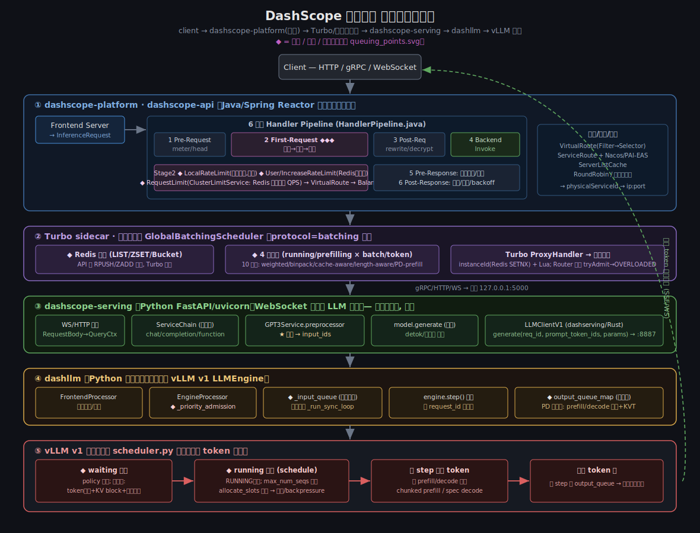
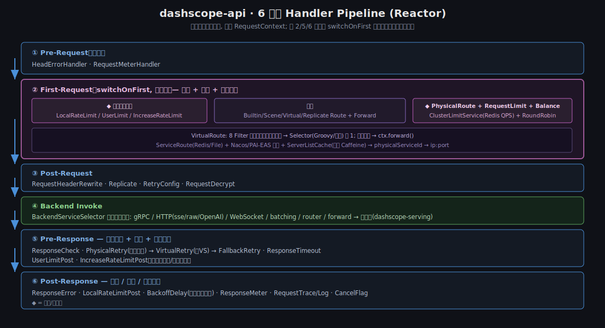
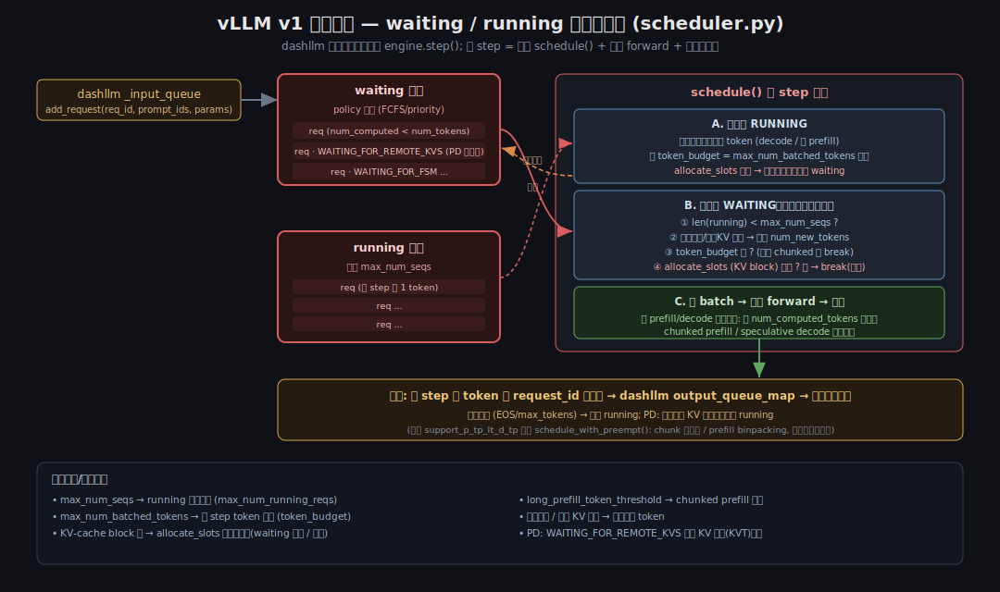
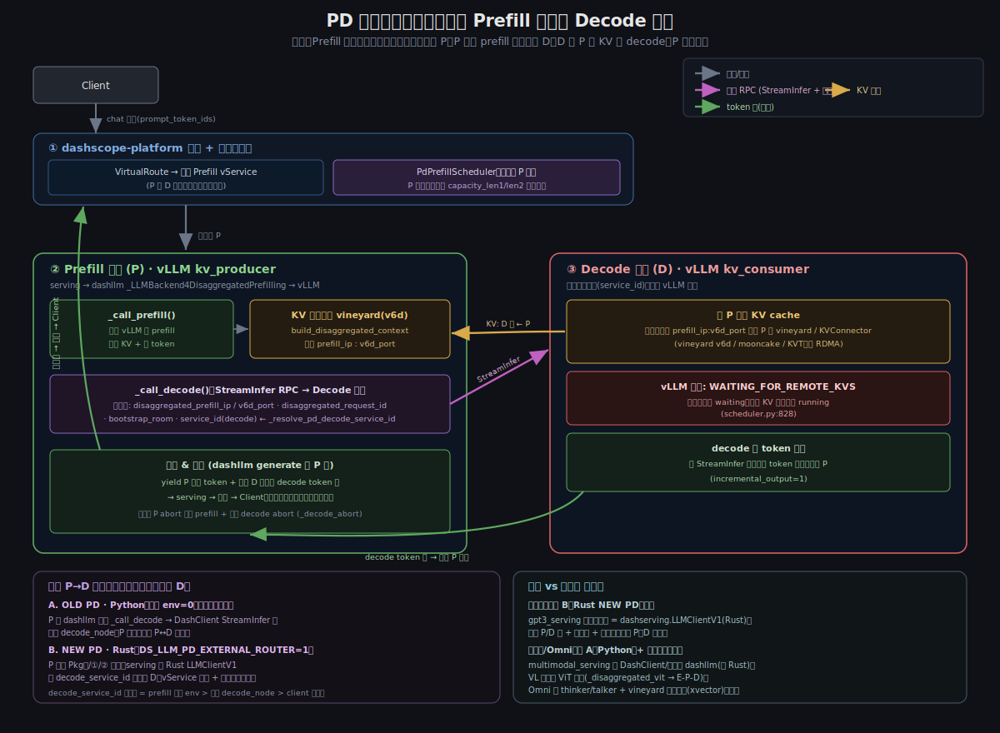

# DashScope 推理请求：详细流程、生命周期与排队机制

> 结合 4 个仓库梳理（代码在 `ecs:~/codes/`）：
> `dashscope-platform`（Java 网关）→ `dashscope-serving`（Python 服务层）→ `dashllm`（引擎编排）→ `vllm`（推理引擎）。
> 面向"一条推理请求从进来到吐 token 经历了什么、在哪里排队"这个问题。

## 0. 全局分层（TL;DR）

```
Client(HTTP/gRPC/WS)
      │
      ▼
① dashscope-platform / dashscope-api   —— Java/Spring Reactor 流量网关（远端集群）
      │  6 阶段 Handler Pipeline：限流 → 路由 → 负载均衡 → 调后端 → 重试 → 计量
      ▼
② Turbo sidecar + 全局批调度 GlobalBatchingScheduler  —— 真正的跨实例请求队列（Redis）
      │  batching 模式：入 Redis 队列 → 4 维准入 → 拉给本地引擎
      ▼
③ dashscope-serving   —— Python FastAPI/WebSocket，模型侧服务（分词、prompt 构建、后处理）
      │  无独立排队，透传；serving 端完成 tokenization → input_ids
      ▼
④ dashllm   —— 驱动 **同步** vLLM v1 LLMEngine 的编排层（PD 分离、KV 传输）
      │  _priority_admission 准入 → _input_queue → 后台线程 step()
      ▼
⑤ vLLM v1 scheduler   —— waiting/running 队列，逐 token 调度（真正的引擎级排队）
```

配图：
- `end_to_end_lifecycle.svg` —— 端到端全景（各层 + 所有排队点 ◆）
- `platform_pipeline.svg` —— 网关 6 阶段 Handler Pipeline 细节
- `vllm_scheduler.svg` —— vLLM waiting/running 准入细节



---

## 1. ① dashscope-platform（Java 网关，模块 `dashscope-api`）

流量入口、服务发现、协议转换、限流、重试、计量。核心是每请求一条 **Reactor 流水线**（`HandlerPipeline.java`），6 个阶段共享 `RequestContext`。



### 1.1 接入与转换（Frontend Server）
- 每种协议一个 Server 类，共用 `InferenceService`（`DashScopeApiService`）：HTTP V1/V2、OpenAI 兼容、gRPC（DashScope/KServe/Jupiter）、WebSocket。
- 各自把线上格式（JSON / Protobuf / WS 帧）统一转成 **`InferenceRequest`**，调 `streamCall(Flux<InferenceRequest>)`。
- 响应以 `Flux<InferenceResponse>` 流式回传，Frontend 再转回 SSE/JSON/gRPC/WS。

### 1.2 6 阶段 Handler Pipeline（`HandlerPipeline.java:87-132`）
1. **Pre-Request**（每帧）：`HeadErrorHandler`、`RequestMeterHandler`
2. **First-Request**（`switchOnFirst`，仅首帧）：**限流 → 路由 → 负载均衡**（下节详述）
3. **Post-Request**：header 改写、`RetryConfigHandler`、`RequestDecryptHandler`
4. **Backend Invoke**：`BackendServiceSelector` 按协议调后端
5. **Pre-Response**：三级重试、超时、限流回补
6. **Post-Response**：`ResponseErrorHandler`、`BackoffDelayHandler`、计量、日志、trace

### 1.3 路由（Stage 2）
- **VirtualRoute**（`VirtualRouteHandler`→`VirtualRouteService`）：两阶段 **Filter→Selector**。8 个 Filter 依次收窄候选物理服务（Phrase/ForwardCluster/Retry/Edge/Preferred/UserWhitelist/Weight/Rule），再由 Selector（Groovy 脚本或内置）选 1 个，得到 `physicalServiceId`；非本集群 → `ctx.forward()` 跨集群转发。
- **服务发现**（`PhysicalRouteHandler`）：`ServiceRoute`（Redis/File 缓存），`addressType` ∈ {HostPort, HostPortList, PaiEasService, NacosService}；实例列表进 `ServerListCache`（两级 Caffeine）。
- **负载均衡**（`RequestBalanceHandler`→`BalanceServiceSelector`）：`RoundRobinBalancer`（原子自增取模）；跨集群走 `InterClusterBalanceServiceSelector`。

### 1.4 排队 / 限流（网关层，Stage 2/5/6）
网关自身的三类限流（都是"拒绝/延迟"，非真正队列）：
- **LocalRateLimit**（`LocalRateLimitPreHandler`）：进程内 `AtomicInteger` CAS **并发上限**，保护单实例。
- **User / IncreaseRateLimit**：用户/模型维度，Redis 支撑。IncreaseRateLimit 是 **自适应增速限流**——按历史流量算阈值、双层时间窗、预扣、指数退避（`BackoffDelayHandler` 在 Stage 6 落地退避）。
- **RequestLimit**（`ClusterLimitService.java:63-93`）：服务级 QPS，Redis **固定窗口计数器**（`INCR` key `...{serviceId}.{HH-mm-ss}.count`，2 分钟 TTL），超阈直接拒。

> 注意：这些是"限流/拒绝"，**真正把请求排起来等的队列在 ②**。

### 1.5 调后端（Stage 4）
`BackendServiceSelector` 按 `backend_protocol > sub_protocol > protocol` 选实现：gRPC / HTTP(sse/raw/OpenAI) / WebSocket / **batching** / **router** / forward。目标由 `physicalServiceId` 解析为 `ip:port`；**batching 模式没有直连地址**——请求进 Redis，由 Turbo 拉取。

---

## 2. ② Turbo sidecar + 全局批调度（真正的排队层）

当路由协议为 **`batching`** 时（LLM 常用），请求不是直连引擎，而是进入一个**跨实例的 Redis 队列**，由与引擎同机部署的 **Turbo sidecar** 按引擎负载拉取。这是"怎么排队"的核心答案。

- **入队**：网关 `BatchingBackendService` 把请求 `RPUSH`/`ZADD` 进 Redis。
- **队列形态**：`GlobalBatchingScheduler` 有 10 种策略（`GlobalBatchingSchedulerSelector.java`，默认 `batch-level`），底层队列可为：
  - **LIST**（`BRPOP`，FIFO）；
  - **ZSET**（score = 输入 token 数，配合 Lua，做 length-aware）；
  - **ZSET + Bucket**（score = bucketId，做前缀缓存亲和 cache-aware）。
- **4 维准入**（每引擎实例）：`runningBatchSize / runningTokenNum / prefillingBatchSize / prefillingTokenNum` 分别与各自 `max*` 比较，未超才拉新请求。
- **实例管理**：`instanceId` 用 Redis `SETNX` 加锁 + bucket 区间 + Lua 脚本（如 `fetch_request_cache_aware.lua`）保证一致性。
- **PD 分离**：`PdPrefillScheduler`，引擎通过响应流回吐 `capacity_len1/len2` 反馈可接纳容量。
- **拉取转发**：Turbo `ProxyHandler` 把请求转给**本地引擎 `127.0.0.1:5000`**（即 dashscope-serving）。
- **Router 模式**（`RouterMeterService.tryAdmit()`）：不排队，超载直接返回 `OVERLOADED`，网关再找外部 Scheduler 重排（事件 REQUEST_ARRIVED/SCHEDULED/QUEUED/REJECTED）。

---

## 3. ③ dashscope-serving（Python 服务层）

FastAPI + uvicorn；LLM 文本默认走 **WebSocket 流式**（`fastapi_stream_server.py:54`）。**本层无独立排队/并发上限，是透传**。

### 3.1 生命周期
1. **入口**：WS 收一帧 JSON → `RequestBody{header,payload}` → `GPT3Header/Payload` → `QwenQueryContext`。
2. **ServiceChain**（`services/service_chain.py`）：装饰器链（ModelRouter→Adapter→Stream→…→BaseService），外层→内层依次处理。
3. **任务分发**（`BaseService._select_service`）：`use_raw_prompt→completion`，`tools→function`，否则 `chat` → `GPT3Service`。
4. **★ 分词在服务侧完成**：`GPT3Service.preprocessor`（`gpt3_service.py:563`）构建 prompt 并 **tokenize 出 `input_ids`**；可选 KV-cache chunk 元数据、guard/inspection。
5. **生成**：`model.generate(...)`（流式生成器）→ 每 chunk detokenize、finish-reason 映射、输出校验 → 向上 yield。
6. **回传**：`Interface.handle_response` 逐 chunk → `websocket.send_text(json)`。

### 3.2 并发原语
- 仅有一个模块级 `ThreadPoolExecutor`（`fastapi_stream_server.py:20`），把**同步**的 `stream_process` 生成器丢到线程里跑，**不设上限**；没有信号量/请求队列/max_concurrency。
- 存在 `RateLimitExceededError` 类型，但此路径未见强制执行（存疑）。

### 3.3 调 dashllm
- 客户端默认 **`LLMClientV1`（`dashserving` 包，Rust/PyO3）**，地址 `turbo_addr` 默认 **`127.0.0.1:8887`**（本机 turbo/sidecar，前置 dashllm）。见 `gpt3_serving/models/base_model.py:198`。
- 调用：`remote_generate_with_llmclientv1`（`base_model.py:643`）——生成器迭代 `llm_client.generate(request_id, prompt={'prompt_token_ids': input_ids}, params=..., extra_params=...)`；取消时 `cancel_request(request_id)`。
- `DS_DEPLOYMENT_TYPE=integrated`（一体式）时改为进程内 `local_generate`；默认 `decoupled` 走上面的远程客户端。

---

## 4. ④ dashllm + ⑤ vLLM（引擎级排队）



### 4.1 dashllm 编排（`dashllm/core/...`）
- **入口**：`FrontendProcessor`（`frontend/processor.py:539`）解析 OpenAI/DashScope 协议、校验、读 `x-dashscope-inner-*` 头；对外即 `LLMClientV1`。
- **编排**：`EngineProcessor`（`engine/processor.py:30`）跑生成循环与流式输出；`LLM.generate`（`llm.py:603`）面向模型。
- **关键**：dashllm **不用** vLLM 的 `AsyncLLM`，而是在**后台线程**驱动**同步** v1 `LLMEngine`：
  - `_run_sync_loop`（`_vllm_v1.py:589`）循环 `self._engine.step()`；
  - 请求经线程安全 **`_input_queue`** 进入（`_drain_input_queue:580`）；
  - 每请求注册一个 **`output_queue`** 到 `_engine_output_queue_map`（`_add_request:451`），`step()` 输出按 `request_id` 解复用回各自队列。
- **dashllm 准入**：`_priority_admission.admit()`（高/低优先级槽位、抢占/超订；`processor.py:1495`）；PD 解码端另有 `_pd_decode_admission.py`（用 decode 自己的 `max_num_seqs`）。

### 4.2 PD 分离（可选，按部署配置）
- prefill 节点作 vLLM `kv_producer`；`_call_prefill`（`_disaggregated_prefilling.py:162`）跑完 prefill，`build_disaggregated_context` 打包 KV 句柄；decode 节点（`kv_consumer`）经 Pkg0 握手解析 `decode_service_id`。
- KV 传输（KVT/mooncake）走 vLLM `KVConnector`；消费端请求在 vLLM 里处于 `WAITING_FOR_REMOTE_KVS`（`scheduler.py:828`）直到 KV 到达。

### 4.3 vLLM v1 调度（真正的逐 token 排队，`scheduler.py`）
- 两个队列：`self.waiting`（policy 排序）与 `self.running`（list）。**无 prefill/decode 阶段之分**——每请求跟踪 `num_computed_tokens` 与目标 token 数的缺口，每 step 补 token（天然覆盖 chunked prefill、prefix cache、spec decode）。
- 预算：`max_num_running_reqs = max_num_seqs`（并发上限）、`token_budget = max_num_batched_tokens`（每 step token 上限）。
- `schedule()` 顺序：
  1. **先 RUNNING**：给在跑请求分配新 token，`allocate_slots` 失败 → **抢占**最低优先级请求回 waiting；
  2. **再 WAITING 准入**（循环）：需同时满足 `len(running)<max_num_seqs`、token 预算足够、`allocate_slots`（KV block）成功；任一不满足 → `break`（**背压**，请求滞留 waiting）；前缀缓存/外部 KV 命中可减少需算 token。
- 输出：每 step 的 token 按 request_id 解复用 → dashllm `output_queue` → 逐层流式上行。
- （分支 `support_p_tp_lt_d_tp` 另有 `schedule_with_preempt()`：chunk 级抢占 / prefill binpacking，由配置开关选择。）

---

## 4.5 PD 分离：请求如何分发到 P / D 节点



P（Prefill）与 D（Decode）是**两个不同的物理服务**。网关（VirtualRoute + `PdPrefillScheduler`）**只把 chat 请求发给 P**；D 由后续接力触达。默认「Prefill 驱动」流程：

1. 网关路由到 **Prefill vService**，`PdPrefillScheduler` 准入到某个 P 引擎（P 经响应流回吐 `capacity_len1/len2` 反馈容量）。
2. **P 节点**：`_call_prefill()` 跑本地 vLLM prefill，产出 KV + 首 token，KV 写入本地 vineyard(v6d)，暴露 `prefill_ip:v6d_port`（`build_disaggregated_context`）。
3. **P → D 接力**：`_call_decode()` 通过 StreamInfer RPC 叫 Decode，握手带 `disaggregated_prefill_ip / v6d_port`、`disaggregated_request_id`、`bootstrap_room`、`service_id(decode)`。
4. **D 节点**（vLLM `kv_consumer`）：按握手里的 `prefill_ip:v6d_port` **连回 P 拉取 KV**（vineyard/mooncake/KVT，走 RDMA）；vLLM 里该请求处于 `WAITING_FOR_REMOTE_KVS`（`scheduler.py:828`）直到 KV 到齐才进 running。
5. D 逐 token decode，沿 StreamInfer 响应流回传给 P；**P 汇流**（P 的首 token + D 的 decode 流）→ serving → 网关 → Client（对客户端透明）。
6. 取消：P abort 本地 prefill + 调 decode abort。

### 两套 P→D 分发逻辑（Python vs Rust）

| | A. OLD PD · **Python** | B. NEW PD · **Rust** |
|---|---|---|
| 开关 | `DS_LLM_PD_EXTERNAL_ROUTER=0`（默认） | `DS_LLM_PD_EXTERNAL_ROUTER=1` |
| 谁接力到 D | **P 的 dashllm 主动**：`_call_decode` → DashClient StreamInfer | **serving 侧 Rust `LLMClientV1`(dashserving)**：P 只发 Pkg⓪/①/② 握手，Rust 客户端按握手路由 |
| D 的选择 | 固定 `decode_node`（静态 P↔D 配对） | 动态选 D vService（`decode_service_id` + 资源池亲和 same-pool P/D 配对，可 uniconfig 热更） |
| 代码 | `_disaggregated_prefilling.py:_generate_impl:413 / _call_decode:205` | `..._generate_external_router:892` |
| KV 方向 | 都是 **D 从 P 拉**（方向不变，只是"谁接力"不同） | 同左 |

`decode_service_id` 解析优先级：`prefill 强制 env(DS_LLM_PD_DECODE_SERVICE_ID)` > `实例 decode_node` > `client 传入`。

### 文本 vs 多模态的差异

- **文本模型**：以 **B（Rust NEW PD）** 为主——`gpt3_serving` 默认客户端就是 `dashserving.LLMClientV1`(Rust)，配弹性 P/D 池 + 调度器 + 资源池亲和；请求只有 **P、D 两段**。
- **多模态 / Omni**：以 **A（Python）** 为主,且**多出编码器分离段**：
  - `multimodal_serving` 用 DashClient / 进程内 dashllm（**非** Rust `LLMClientV1`）；
  - VL 模型多一段 **ViT（视觉编码器）分离**：`_LLMBackend4DisaggregatedVit`（`_disaggregated_vit.py`）+ `_disaggregated_vit_decode_node` → 变成 **E-P-D（Encode-Prefill-Decode）** 三段；
  - **Omni（音频）**有 thinker/talker 拆分，decode 握手带 `omni_prefill_remote_endpoint`、`thinker_only`，并用 **vineyard 传语音克隆 xvector**（非 JSON 可序列化，pickle+base64 走 extra_params）——这些特判都在 Python 的 `_call_decode`（`:229`）里。

> 一句话：**文本 = Rust 动态路由的两段 P/D；多模态 = Python 分发 + 额外的 ViT/thinker 编码器分离段。** 两者 KV 传输方向一致（D 从 P 拉），差别在"谁来接力"和"分几段"。

---

## 5. 排队点总表（"到底在哪儿排队"）

| # | 层 | 机制 | 类型 | 位置 |
|---|---|---|---|---|
| 1 | ① 网关 | LocalRateLimit | 进程内并发上限(拒绝) | `LocalRateLimitPreHandler` |
| 2 | ① 网关 | User/IncreaseRateLimit | Redis 自适应限流+退避 | Stage2/6 |
| 3 | ① 网关 | RequestLimit/ClusterLimit | Redis 固定窗口 QPS(拒绝) | `ClusterLimitService.java:63` |
| 4 | ② Turbo | **GlobalBatching Redis 队列** | **真正的跨实例请求队列**(LIST/ZSET/Bucket) | `GlobalBatchingScheduler` |
| 5 | ② Turbo | 4 维准入 | 引擎负载准入(running/prefilling×batch/token) | 全局批调度 |
| 6 | ② Turbo | Router tryAdmit | 超载拒绝→重排 | `RouterMeterService` |
| 7 | ③ serving | （无） | 透传，仅无界线程池 | `fastapi_stream_server.py:20` |
| 8 | ④ dashllm | `_priority_admission` | 高/低优先级槽位准入 | `processor.py:1495` |
| 9 | ④ dashllm | `_input_queue` / `output_queue_map` | 线程交接 + 每请求输出解复用 | `_vllm_v1.py:580/451` |
| 10 | ⑤ vLLM | **waiting 队列** | 引擎级请求排队 | `scheduler.py` |
| 11 | ⑤ vLLM | `max_num_seqs` | running 并发上限 | schedule() |
| 12 | ⑤ vLLM | `max_num_batched_tokens` | 每 step token 预算 | schedule() |
| 13 | ⑤ vLLM | KV-cache block 准入 | `allocate_slots` 失败即背压/抢占 | schedule() |
| 14 | ⑤ vLLM | `WAITING_FOR_REMOTE_KVS` | PD 消费端等 KV 传输 | `scheduler.py:828` |

**一句话**：跨实例的"排队等资源"发生在 **② Turbo 全局批调度（Redis 队列 + 4 维准入）**；单实例内"逐 token 排队/背压"发生在 **⑤ vLLM 调度器（waiting/running + KV block 预算）**；网关(①)只做限流/拒绝/路由，服务层(③)透传。

---

## 6. 关键源码索引

| 主题 | 文件 |
|---|---|
| 网关流水线 | `dashscope-platform/.../HandlerPipeline.java:87-132` |
| 网关设计文档 | `dashscope-platform/docs/api/00~13-*.md`（含 12-request-scheduler、09-service-mesh、10/13 限流）|
| 服务级限流 | `.../ClusterLimitService.java:63-93` |
| 全局批调度 | `.../GlobalBatchingSchedulerSelector.java`，Lua `fetch_request_cache_aware.lua` 等 |
| serving 流式入口 | `dashscope-serving/dashscope_serving/server/fastapi_stream_server.py:54` |
| serving 服务链 | `.../gpt3_serving/services/service_chain.py` |
| serving 分词 | `.../gpt3_serving/services/decoders/gpt3_service.py:563` |
| serving→dashllm | `.../gpt3_serving/models/base_model.py:198,643` |
| dashllm 前端 | `dashllm/core/frontend/processor.py:539` |
| dashllm 引擎编排 | `dashllm/core/engine/processor.py`，`core/backend/engine/_vllm_v1.py:580,589,598` |
| dashllm PD | `dashllm/core/backend/engine/_disaggregated_prefilling.py` |
| vLLM 调度器 | `vllm/vllm/v1/core/sched/scheduler.py`（waiting/running、schedule()、allocate_slots）|

> 备注：部署是否启用 PD 分离 / 一体式(integrated) / 具体批调度策略，均由配置决定；本文描述的是 decoupled + batching 的典型 LLM 文本链路。
