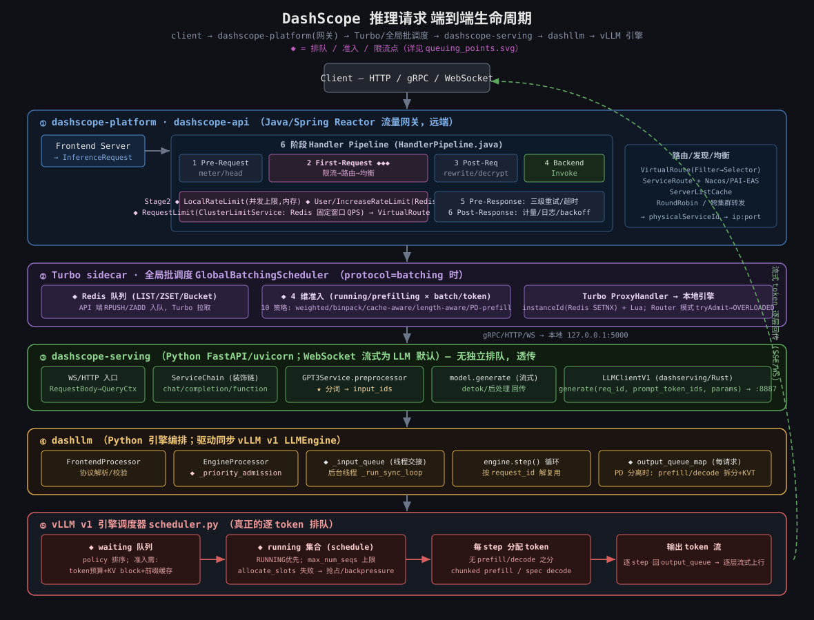
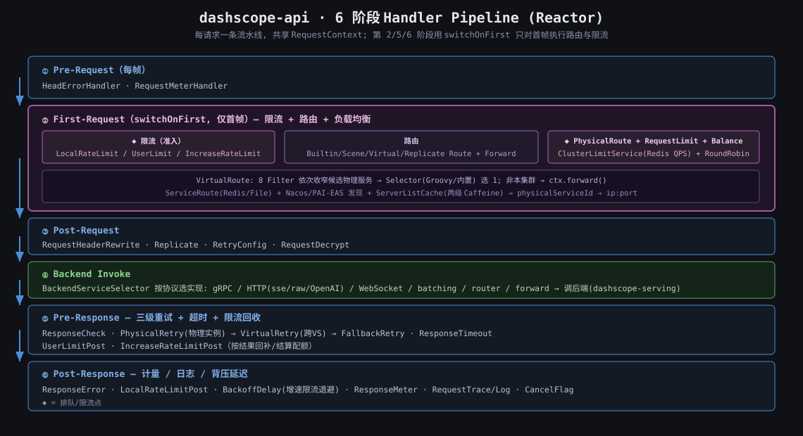
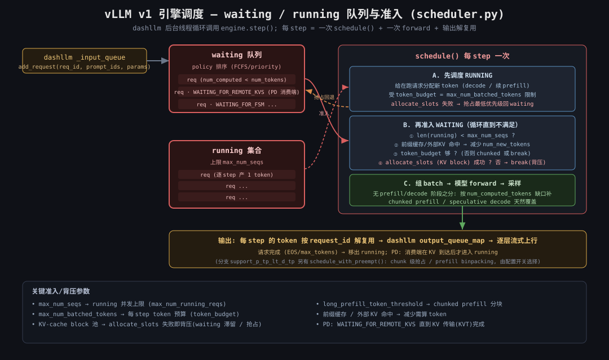
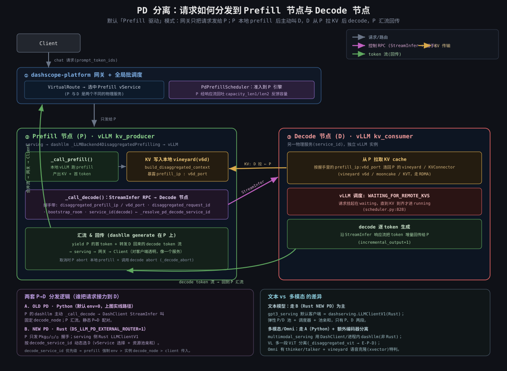
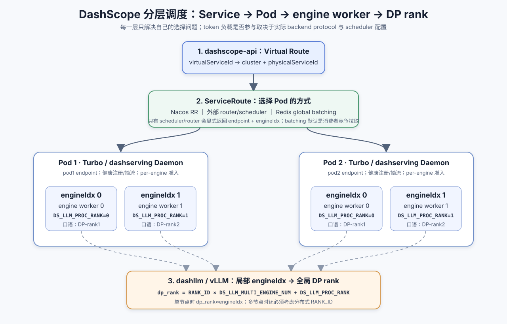

# DashScope 推理请求：详细流程、生命周期与排队机制

> 结合 5 个仓库梳理（代码在 `ecs:~/codes/`）：
> `dashscope-platform`（Java 网关与 Turbo）→ `dashserving`（Pod 内 Serving Runtime）
> → `dashscope-serving`（Python 业务服务层）→ `dashllm`（引擎编排）→ `vllm`（推理引擎）。
> 面向"一条推理请求从进来到吐 token 经历了什么、在哪里排队"这个问题。

## 0. 全局分层（TL;DR）

```
Client(HTTP/gRPC/WS)
      │
      ▼
① dashscope-platform / dashscope-api   —— Java/Spring Reactor 流量网关（远端集群）
      │  6 阶段 Handler Pipeline：限流 → 路由 → 负载均衡 → 调后端 → 重试 → 计量
      ▼
② Turbo sidecar + 全局批调度 GlobalBatchingScheduler  —— 真正的跨实例请求队列（Redis）
      │  batching 模式：入 Redis 队列 → 4 维准入 → 拉给本地引擎
      ▼
③ dashserving Daemon  —— Pod 内 Runtime：Capability 路由、Worker/GPU 生命周期、engineIdx→Worker
      │  一个 Daemon 管理 chat worker 与 dashllm engine worker
      ▼
④ dashscope-serving   —— Python 业务服务（分词、prompt 构建、工具调用、后处理）
      │  无独立排队，透传；serving 端完成 tokenization → input_ids
      ▼
⑤ dashllm   —— 驱动 **同步** vLLM v1 LLMEngine 的编排层（PD 分离、KV 传输）
      │  _priority_admission 准入 → _input_queue → 后台线程 step()
      ▼
⑥ vLLM v1 scheduler   —— waiting/running 队列，逐 token 调度（真正的引擎级排队）
```

配图：
- `end_to_end_lifecycle.svg` —— 端到端全景（各层 + 所有排队点 ◆）
- `platform_pipeline.svg` —— 网关 6 阶段 Handler Pipeline 细节
- `hierarchical_request_routing.svg` —— Service → Pod → engine worker → DP rank 分层调度
- `vllm_scheduler.svg` —— vLLM waiting/running 准入细节



---

## 1. ① dashscope-platform（Java 网关，模块 `dashscope-api`）

流量入口、服务发现、协议转换、限流、重试、计量。核心是每请求一条 **Reactor 流水线**（`HandlerPipeline.java`），6 个阶段共享 `RequestContext`。



### 1.1 接入与转换（Frontend Server）
- 每种协议一个 Server 类，共用 `InferenceService`（`DashScopeApiService`）：HTTP V1/V2、OpenAI 兼容、gRPC（DashScope/KServe/Jupiter）、WebSocket。
- 各自把线上格式（JSON / Protobuf / WS 帧）统一转成 **`InferenceRequest`**，调 `streamCall(Flux<InferenceRequest>)`。
- 响应以 `Flux<InferenceResponse>` 流式回传，Frontend 再转回 SSE/JSON/gRPC/WS。

### 1.2 6 阶段 Handler Pipeline（`HandlerPipeline.java:87-132`）
1. **Pre-Request**（每帧）：`HeadErrorHandler`、`RequestMeterHandler`
2. **First-Request**（`switchOnFirst`，仅首帧）：**限流 → 路由 → 负载均衡**（下节详述）
3. **Post-Request**：header 改写、`RetryConfigHandler`、`RequestDecryptHandler`
4. **Backend Invoke**：`BackendServiceSelector` 按协议调后端
5. **Pre-Response**：三级重试、超时、限流回补
6. **Post-Response**：`ResponseErrorHandler`、`BackoffDelayHandler`、计量、日志、trace

### 1.3 路由（Stage 2）
- **VirtualRoute**（`VirtualRouteHandler`→`VirtualRouteService`）：两阶段 **Filter→Selector**。Filter 依次收窄候选物理服务（Phrase/ForwardCluster/Retry/Edge/Preferred/UserWhitelist/Weight/GlobalRouting/Rule），再由 Selector（Groovy 脚本或内置）选 1 个，得到 `physicalServiceId`；非本集群 → `ctx.forward()` 跨集群转发。内置 Selector 包括 weighted、user-weighted、bin-pack、cache-aware、cache-aware-pure、cache-aware-balanced、length-aware。
- **服务发现**（`PhysicalRouteHandler`）：`ServiceRoute`（Redis/File 缓存），`addressType` ∈ {HostPort, HostPortList, PaiEasService, NacosService}；实例列表进 `ServerListCache`（两级 Caffeine）。
- **负载均衡**（`RequestBalanceHandler`→`BalanceServiceSelector`）：`RoundRobinBalancer`（原子自增取模）；跨集群走 `InterClusterBalanceServiceSelector`。

### 1.4 排队 / 限流（网关层，Stage 2/5/6）
网关自身的三类限流（都是"拒绝/延迟"，非真正队列）：
- **LocalRateLimit**（`LocalRateLimitPreHandler`）：进程内 `AtomicInteger` CAS **并发上限**，保护单实例。
- **User / IncreaseRateLimit**：用户/模型维度，Redis 支撑。IncreaseRateLimit 是 **自适应增速限流**——按历史流量算阈值、双层时间窗、预扣、指数退避（`BackoffDelayHandler` 在 Stage 6 落地退避）。
- **RequestLimit**（`ClusterLimitService.java:63-93`）：服务级 QPS，Redis **固定窗口计数器**（`INCR` key `...{serviceId}.{HH-mm-ss}.count`，2 分钟 TTL），超阈直接拒。

> 注意：这些是"限流/拒绝"，**真正把请求排起来等的队列在 ②**。

### 1.5 调后端（Stage 4）
`BackendServiceSelector` 按 `backend_protocol > sub_protocol > protocol` 选实现：gRPC / HTTP(sse/raw/OpenAI) / WebSocket / **batching** / **router** / **scheduler** / forward。目标由 `physicalServiceId` 解析为 `ip:port`；**batching 模式可以跳过 API 侧实例 balance**——请求进 Redis，由 Turbo 拉取；router/scheduler 模式则先向外部调度器请求 `endpoint + instanceId + engineIdx`。

---

## 2. ② Turbo sidecar + 全局批调度（真正的排队层）

当路由协议为 **`batching`** 时（LLM 常用），请求不是直连引擎，而是进入一个**跨实例的 Redis 队列**，由与引擎同机部署的 **Turbo sidecar** 按引擎负载拉取。这是"怎么排队"的核心答案。

- **入队**：网关 `BatchingBackendService` 把请求 `RPUSH`/`ZADD` 进 Redis。
- **队列形态**：`GlobalBatchingScheduler` 有 10 种策略（`GlobalBatchingSchedulerSelector.java`，默认 `batch-level`），底层队列可为：
  - **LIST**（`BRPOP`，FIFO）；
  - **ZSET**（score = 输入 token 数，配合 Lua，做 length-aware）；
  - **ZSET + Bucket**（score = bucketId，做前缀缓存亲和 cache-aware）。
- **4 维准入**（每引擎实例）：`runningBatchSize / runningTokenNum / prefillingBatchSize / prefillingTokenNum` 分别与各自 `max*` 比较，未超才拉新请求。
- **实例管理**：`instanceId` 用 Redis `SETNX` 加锁 + bucket 区间 + Lua 脚本（如 `fetch_request_cache_aware.lua`）保证一致性。
- **PD 分离**：`PdPrefillScheduler`，引擎通过响应流回吐 `capacity_len1/len2` 反馈可接纳容量。
- **拉取转发**：Turbo `ProxyHandler` 把请求转给**本地引擎 `127.0.0.1:5000`**（即 dashscope-serving）。
- **Router 模式**（`RouterMeterService.tryAdmit()`）：不排队，超载直接返回 `OVERLOADED`，网关再找外部 Scheduler 重排（事件 REQUEST_ARRIVED/SCHEDULED/QUEUED/REJECTED）。

---

## 3. ③ dashserving + ④ dashscope-serving（Pod 内 Runtime 与 Python 服务层）

`dashserving` 是 Rust Daemon + Python Worker Runtime；`dashscope-serving` 是运行在其中的
Chat/业务 Worker。部署也兼容 Aquila、FastAPI/uvicorn、WebSocket 等旧路径。DServ 一体化模式下，
Daemon 在同一 Pod 中同时启动 `dashscope-serving` chat workers 与 `dashllm` engine workers。
业务服务层本身没有类似 Redis 的跨实例队列，主要完成协议、prompt、工具和模型调用。

### 3.1 生命周期
1. **入口**：WS 收一帧 JSON → `RequestBody{header,payload}` → `GPT3Header/Payload` → `QwenQueryContext`。
2. **ServiceChain**（`services/service_chain.py`）：装饰器链（ModelRouter→Adapter→Stream→…→BaseService），外层→内层依次处理。
3. **任务分发**（`BaseService._select_service`）：`use_raw_prompt→completion`，`tools→function`，否则 `chat` → `GPT3Service`。
4. **★ 分词在服务侧完成**：`GPT3Service.preprocessor`（`gpt3_service.py:563`）构建 prompt 并 **tokenize 出 `input_ids`**；可选 KV-cache chunk 元数据、guard/inspection。
5. **生成**：`model.generate(...)`（流式生成器）→ 每 chunk detokenize、finish-reason 映射、输出校验 → 向上 yield。
6. **回传**：`Interface.handle_response` 逐 chunk → `websocket.send_text(json)`。

### 3.2 并发原语
- 仅有一个模块级 `ThreadPoolExecutor`（`fastapi_stream_server.py:20`），把**同步**的 `stream_process` 生成器丢到线程里跑，**不设上限**；没有信号量/请求队列/max_concurrency。
- 存在 `RateLimitExceededError` 类型，但此路径未见强制执行（存疑）。

### 3.3 调 dashllm
- 客户端默认 **`LLMClientV1`（`dashserving` 包，Rust/PyO3）**，地址 `turbo_addr` 默认 **`127.0.0.1:8887`**（本机 turbo/sidecar，前置 dashllm）。见 `gpt3_serving/models/base_model.py:198`。
- 调用：`remote_generate_with_llmclientv1`（`base_model.py:643`）——生成器迭代 `llm_client.generate(request_id, prompt={'prompt_token_ids': input_ids}, params=..., extra_params=...)`；取消时 `cancel_request(request_id)`。
- `DS_DEPLOYMENT_TYPE=integrated`（一体式）时改为进程内 `local_generate`；默认 `decoupled` 走上面的远程客户端。

---

## 4. ⑤ dashllm + ⑥ vLLM（引擎级排队）



### 4.1 dashllm 编排（`dashllm/core/...`）
- **入口**：`FrontendProcessor`（`frontend/processor.py:539`）解析 OpenAI/DashScope 协议、校验、读 `x-dashscope-inner-*` 头；对外即 `LLMClientV1`。
- **编排**：`EngineProcessor`（`engine/processor.py:30`）跑生成循环与流式输出；`LLM.generate`（`llm.py:603`）面向模型。
- **关键**：dashllm **不用** vLLM 的 `AsyncLLM`，而是在**后台线程**驱动**同步** v1 `LLMEngine`：
  - `_run_sync_loop`（`_vllm_v1.py:589`）循环 `self._engine.step()`；
  - 请求经线程安全 **`_input_queue`** 进入（`_drain_input_queue:580`）；
  - 每请求注册一个 **`output_queue`** 到 `_engine_output_queue_map`（`_add_request:451`），`step()` 输出按 `request_id` 解复用回各自队列。
- **dashllm 准入**：`_priority_admission.admit()`（高/低优先级槽位、抢占/超订；`processor.py:1495`）；PD 解码端另有 `_pd_decode_admission.py`（用 decode 自己的 `max_num_seqs`）。

### 4.2 PD 分离（可选，按部署配置）
- prefill 节点作 vLLM `kv_producer`；`_call_prefill`（`_disaggregated_prefilling.py:162`）跑完 prefill，`build_disaggregated_context` 打包 KV 句柄；decode 节点（`kv_consumer`）经 Pkg0 握手解析 `decode_service_id`。
- KV 传输（KVT/mooncake）走 vLLM `KVConnector`；消费端请求在 vLLM 里处于 `WAITING_FOR_REMOTE_KVS`（`scheduler.py:828`）直到 KV 到达。

### 4.3 vLLM v1 调度（真正的逐 token 排队，`scheduler.py`）
- 两个队列：`self.waiting`（policy 排序）与 `self.running`（list）。**无 prefill/decode 阶段之分**——每请求跟踪 `num_computed_tokens` 与目标 token 数的缺口，每 step 补 token（天然覆盖 chunked prefill、prefix cache、spec decode）。
- 预算：`max_num_running_reqs = max_num_seqs`（并发上限）、`token_budget = max_num_batched_tokens`（每 step token 上限）。
- `schedule()` 顺序：
  1. **先 RUNNING**：给在跑请求分配新 token，`allocate_slots` 失败 → **抢占**最低优先级请求回 waiting；
  2. **再 WAITING 准入**（循环）：需同时满足 `len(running)<max_num_seqs`、token 预算足够、`allocate_slots`（KV block）成功；任一不满足 → `break`（**背压**，请求滞留 waiting）；前缀缓存/外部 KV 命中可减少需算 token。
- 输出：每 step 的 token 按 request_id 解复用 → dashllm `output_queue` → 逐层流式上行。
- （分支 `support_p_tp_lt_d_tp` 另有 `schedule_with_preempt()`：chunk 级抢占 / prefill binpacking，由配置开关选择。）

---

## 4.5 PD 分离：请求如何分发到 P / D 节点



P（Prefill）与 D（Decode）是**两个不同的物理服务**。网关（VirtualRoute + `PdPrefillScheduler`）**只把 chat 请求发给 P**；D 由后续接力触达。默认「Prefill 驱动」流程：

1. 网关路由到 **Prefill vService**，`PdPrefillScheduler` 准入到某个 P 引擎（P 经响应流回吐 `capacity_len1/len2` 反馈容量）。
2. **P 节点**：`_call_prefill()` 跑本地 vLLM prefill，产出 KV + 首 token，KV 写入本地 vineyard(v6d)，暴露 `prefill_ip:v6d_port`（`build_disaggregated_context`）。
3. **P → D 接力**：`_call_decode()` 通过 StreamInfer RPC 叫 Decode，握手带 `disaggregated_prefill_ip / v6d_port`、`disaggregated_request_id`、`bootstrap_room`、`service_id(decode)`。
4. **D 节点**（vLLM `kv_consumer`）：按握手里的 `prefill_ip:v6d_port` **连回 P 拉取 KV**（vineyard/mooncake/KVT，走 RDMA）；vLLM 里该请求处于 `WAITING_FOR_REMOTE_KVS`（`scheduler.py:828`）直到 KV 到齐才进 running。
5. D 逐 token decode，沿 StreamInfer 响应流回传给 P；**P 汇流**（P 的首 token + D 的 decode 流）→ serving → 网关 → Client（对客户端透明）。
6. 取消：P abort 本地 prefill + 调 decode abort。

### 两套 P→D 分发逻辑（Python vs Rust）

| | A. OLD PD · **Python** | B. NEW PD · **Rust** |
|---|---|---|
| 开关 | `DS_LLM_PD_EXTERNAL_ROUTER=0`（默认） | `DS_LLM_PD_EXTERNAL_ROUTER=1` |
| 谁接力到 D | **P 的 dashllm 主动**：`_call_decode` → DashClient StreamInfer | **serving 侧 Rust `LLMClientV1`(dashserving)**：P 只发 Pkg⓪/①/② 握手，Rust 客户端按握手路由 |
| D 的选择 | 固定 `decode_node`（静态 P↔D 配对） | 动态选 D vService（`decode_service_id` + 资源池亲和 same-pool P/D 配对，可 uniconfig 热更） |
| 代码 | `_disaggregated_prefilling.py:_generate_impl:413 / _call_decode:205` | `..._generate_external_router:892` |
| KV 方向 | 都是 **D 从 P 拉**（方向不变，只是"谁接力"不同） | 同左 |

`decode_service_id` 解析优先级：`prefill 强制 env(DS_LLM_PD_DECODE_SERVICE_ID)` > `实例 decode_node` > `client 传入`。

### 文本 vs 多模态的差异

- **文本模型**：以 **B（Rust NEW PD）** 为主——`gpt3_serving` 默认客户端就是 `dashserving.LLMClientV1`(Rust)，配弹性 P/D 池 + 调度器 + 资源池亲和；请求只有 **P、D 两段**。
- **多模态 / Omni**：以 **A（Python）** 为主,且**多出编码器分离段**：
  - `multimodal_serving` 用 DashClient / 进程内 dashllm（**非** Rust `LLMClientV1`）；
  - VL 模型多一段 **ViT（视觉编码器）分离**：`_LLMBackend4DisaggregatedVit`（`_disaggregated_vit.py`）+ `_disaggregated_vit_decode_node` → 变成 **E-P-D（Encode-Prefill-Decode）** 三段；
  - **Omni（音频）**有 thinker/talker 拆分，decode 握手带 `omni_prefill_remote_endpoint`、`thinker_only`，并用 **vineyard 传语音克隆 xvector**（非 JSON 可序列化，pickle+base64 走 extra_params）——这些特判都在 Python 的 `_call_decode`（`:229`）里。

> 一句话：**文本 = Rust 动态路由的两段 P/D；多模态 = Python 分发 + 额外的 ViT/thinker 编码器分离段。** 两者 KV 传输方向一致（D 从 P 拉），差别在"谁来接力"和"分几段"。

---

## 5. 排队点总表（"到底在哪儿排队"）

| # | 层 | 机制 | 类型 | 位置 |
|---|---|---|---|---|
| 1 | ① 网关 | LocalRateLimit | 进程内并发上限(拒绝) | `LocalRateLimitPreHandler` |
| 2 | ① 网关 | User/IncreaseRateLimit | Redis 自适应限流+退避 | Stage2/6 |
| 3 | ① 网关 | RequestLimit/ClusterLimit | Redis 固定窗口 QPS(拒绝) | `ClusterLimitService.java:63` |
| 4 | ② Turbo | **GlobalBatching Redis 队列** | **真正的跨实例请求队列**(LIST/ZSET/Bucket) | `GlobalBatchingScheduler` |
| 5 | ② Turbo | 4 维准入 | 引擎负载准入(running/prefilling×batch/token) | 全局批调度 |
| 6 | ② Turbo | Router tryAdmit | 超载拒绝→重排 | `RouterMeterService` |
| 7 | ④ serving | （无） | 透传，仅无界线程池 | `fastapi_stream_server.py:20` |
| 8 | ⑤ dashllm | `_priority_admission` | 高/低优先级槽位准入 | `processor.py:1495` |
| 9 | ⑤ dashllm | `_input_queue` / `output_queue_map` | 线程交接 + 每请求输出解复用 | `_vllm_v1.py:580/451` |
| 10 | ⑥ vLLM | **waiting 队列** | 引擎级请求排队 | `scheduler.py` |
| 11 | ⑥ vLLM | `max_num_seqs` | running 并发上限 | schedule() |
| 12 | ⑥ vLLM | `max_num_batched_tokens` | 每 step token 预算 | schedule() |
| 13 | ⑥ vLLM | KV-cache block 准入 | `allocate_slots` 失败即背压/抢占 | schedule() |
| 14 | ⑥ vLLM | `WAITING_FOR_REMOTE_KVS` | PD 消费端等 KV 传输 | `scheduler.py:828` |

**一句话**：跨实例的"排队等资源"发生在 **② Turbo 全局批调度（Redis 队列 + 4 维准入）**；单实例内"逐 token 排队/背压"发生在 **⑥ vLLM 调度器（waiting/running + KV block 预算）**；网关(①)只做限流/拒绝/路由，业务服务层(④)主要负责预处理和透传。

---

## 6. 关键源码索引

| 主题 | 文件 |
|---|---|
| 网关流水线 | `dashscope-platform/.../HandlerPipeline.java:87-132` |
| 网关设计文档 | `dashscope-platform/docs/api/00~13-*.md`（含 12-request-scheduler、09-service-mesh、10/13 限流）|
| 服务级限流 | `.../ClusterLimitService.java:63-93` |
| 全局批调度 | `.../GlobalBatchingSchedulerSelector.java`，Lua `fetch_request_cache_aware.lua` 等 |
| serving 流式入口 | `dashscope-serving/dashscope_serving/server/fastapi_stream_server.py:54` |
| serving 服务链 | `.../gpt3_serving/services/service_chain.py` |
| serving 分词 | `.../gpt3_serving/services/decoders/gpt3_service.py:563` |
| serving→dashllm | `.../gpt3_serving/models/base_model.py:198,643` |
| dashllm 前端 | `dashllm/core/frontend/processor.py:539` |
| dashllm 引擎编排 | `dashllm/core/engine/processor.py`，`core/backend/engine/_vllm_v1.py:580,589,598` |
| dashllm PD | `dashllm/core/backend/engine/_disaggregated_prefilling.py` |
| vLLM 调度器 | `vllm/vllm/v1/core/sched/scheduler.py`（waiting/running、schedule()、allocate_slots）|

> 备注：部署是否启用 PD 分离 / 一体式(integrated) / 具体批调度策略，均由配置决定；本文描述的是 decoupled + batching 的典型 LLM 文本链路。

---

## 7. Service → Pod → DP rank：请求究竟怎样选中执行位置

这一节区分四个经常被混为一谈的对象：

1. **Virtual Service**：用户请求中的逻辑服务 ID。
2. **Physical Service**：某个集群中的实际部署/资源池。
3. **Pod/Replica**：物理服务下的一个服务实例，通常暴露 Turbo endpoint。
4. **engine slot / DP rank**：Pod 内一个独立的 engine worker；线上 header 使用
   0-based `engineIdx`，而口语中的“DP-rank1/2”通常是 1-based。



### 7.1 第一层：Virtual Service 选择 Physical Service

`dashscope-api` 的首帧处理顺序是：

```text
VirtualRouteHandler
  → RequestForwardHandler（目标在其他集群时）
  → PhysicalRouteHandler
  → RequestBalanceHandler
  → BackendService.invoke()
```

`VirtualRouteService` 先执行 Filter，再运行 weighted、bin-pack、cache-aware、
length-aware 等 Selector，最终得到 `physicalServiceId`。这层最多选择到“哪个集群中的哪个部署”，
还没有选择具体 Pod 或 DP rank。

控制面上，`dashscope-manager` 将 Virtual/Physical route 发布到各集群 API Server；
`dashscope-scaler` 根据 metric → decide → limit → reallocate → execute 流程调整副本数。
二者会改变候选集合和容量，但不执行单请求的实时 Pod 选择。

### 7.2 第二层：Physical Service 选择 Pod——三条不同路径

#### 路径 A：普通 Nacos / PAI-EAS balance

API 从 Nacos 读取健康实例并 round-robin：

```text
physicalServiceId
  → ServiceRoute.endpoint(addressType=NacosService)
  → selectInstances(serviceName, healthy=true)
  → RoundRobinBalancer
  → podIP:turboPort
```

Turbo 只有在后端健康后才注册 Nacos；连续不健康或收到 SIGTERM 时注销。因此 Nacos 列表本身
已经做了一轮 Pod 健康过滤。

这一层不读取每个 DP 的 token 数。若请求没有携带 `x-ds-multi-engine-index`，Pod 内再按
本地默认策略选择 engine worker。

#### 路径 B：外部 router / scheduler

当 backend protocol 为 `router` 或 `scheduler` 时，API 调用外部调度器，得到：

```text
endpoint = podIP:port
instanceId = podCanonicalId_index_i
engineIdx = i
```

API 将 `engineIdx` 写入：

```text
x-ds-multi-engine-index: i
```

并把请求发往所选 Pod 的 Turbo 8887 端口。Turbo 对这个 engine 做 per-engine running、
prefilling、token 准入；过载时返回 `THROTTLING_CONCURRENCY`，API 把失败 instance ID
加入排除列表，再请求 scheduler 重排。

所以这条路径的调度对象不是单纯 Pod，而是一个**逻辑实例 `Pod + engineIdx`**。

> 当前 `dash*` 仓库只包含 scheduler/router 客户端协议、结果解析、失败排除和重调度；
> 外部 scheduler 的候选打分、token load 权重以及同分 tie-break 算法不在这些仓库中。
> 因而只看当前源码，不能断言它一定执行“选择 running token 最少的 engine”。

#### 路径 C：global batching

batching 请求先进入 Redis 队列，Turbo 作为消费者主动拉取。没有显式配置
`scheduler_type` 时，代码默认使用 `batch-level`：

```java
if (schedulerType is blank) {
    schedulerType = BATCH_LEVEL;
}
```

默认 `BatchLevelScheduler` 的关键行为是：

1. 各 Pod 的 Turbo 竞争 Redis queue lock。
2. 获得锁的 Turbo 用 `RPOP` 拉取一批请求。
3. 谁先拿到锁/先轮询到请求，谁取得这批流量。
4. `BatchLevelScheduler.getRunningTokenNum()` 直接返回 `0`，它不会汇总全部 Pod/DP
   的 running token 再做全局最小值选择。

PD-prefill、cache-aware、sticky 等 scheduler 会维护每个本地 engine 的 running/prefilling
batch/token 指标，用于容量门限、bucket 归属和拉取资格；但其基本形态仍是多个合格消费者竞争/
分片拉取，不等价于一个中心组件对所有 engine 做简单 `argmin(runningTokenNum)`。

### 7.3 第三层：Turbo 的 engineIdx 准入

对于 router/scheduler 路径，Turbo 读取 `x-ds-multi-engine-index`：

- `0 <= i < engineNum`：对 engine `i` 做准入并转发。
- `i=-1`、缺失、无法解析或越界：随机选择合法 engine，并把真实结果写回 header。
- 对应 engine 过载：拒绝本次尝试，交给 API/scheduler 重排；最后一次尝试可用
  `force_accept` 强制接受。

因此外部 scheduler 的选择不是无条件生效：Turbo 是 Pod 内最后一道容量保护。

### 7.4 第四层：dashserving 如何把 engineIdx 映射到 Worker

`dashserving` Daemon 维护：

```text
capability JSON → [workerAddress0, workerAddress1, ...]
```

默认 balance mode 下：

```text
有 engineIdx=i  → workerAddresses[i]
无 engineIdx     → 健康 worker round-robin
index 越界       → fallback round-robin
```

可选 `DSV_BALANCE_MODE`：

| mode | engineIdx 行为 | 无显式 index 时 |
|---|---|---|
| Default | 精确路由 | 健康 worker round-robin |
| `rr` | **忽略** | round-robin |
| `lc` | **忽略** | 按 inflight request 数最少；不是 token 数 |
| `prefix` | 精确 index 优先 | prefix affinity，过载时临时 least-loaded |

配置优先级为 `UniConfig > DSV_BALANCE_MODE env > Default`。若需要外部 scheduler 指定的
engineIdx 严格落到对应 worker，应使用 Default 或 `prefix`，而不是 `rr/lc`。

### 7.5 一体化 Chat + Model 为什么是“两跳”

当前 DServ 一体化启动顺序是：

```bash
dashserving run \
  dashllm.worker.llm:worker \
  app.qwen_bailian_app:worker \
  --backend 'kserve://{"capability":{"type":"chat"}}'
```

Pod 内链路：

```text
Turbo
  → capability={"type":"chat"}
  → 任一健康 chat worker
  → dashscope-serving 构造 prompt/input_ids
  → 把原 header（包括 engineIdx）写入 ds_header_attributes
  → LLMClientV1 本地二次调用
  → capability={}
  → engineIdx 对应的 dashllm engine worker
```

Daemon 发现同 Pod 存在 `dashllm.worker.llm:worker` 时，第一跳选择 chat worker会故意忽略
engineIdx，避免用模型 engine 的编号错误索引 chat worker；第二跳到模型 capability 时才按
engineIdx 精确选择 dashllm worker。

### 7.6 engineIdx 到 vLLM DP rank

Daemon 按顺序启动 worker，并设置：

```text
DSV_WORKER_GLOBAL_INDEX=i
  → Python worker 启动前设置 DS_LLM_PROC_RANK=i
```

当前 launcher 将 dashllm engine worker 放在列表最前面，因此其 global index、注册表地址顺序
和 Pod 内 engineIdx 都是 `0..N-1`。这是精确映射成立的重要部署不变量。

vLLM 的全局 DP rank 计算为：

```text
dp_rank =
    RANK_ID * DS_LLM_MULTI_ENGINE_NUM
    + DS_LLM_PROC_RANK

if dp_rank >= data_parallel_size:
    dp_rank %= data_parallel_size
```

单节点、两个 engine 时，`RANK_ID=0`，所以 `engineIdx=0/1` 对应口语中的
`DP-rank1/2`。多节点时 `RANK_ID` 是分布式节点 rank，不能无条件等同于 K8s Pod ordinal。

### 7.7 具体例子：2 个 Pod，每个 Pod 有 2 个 DP

假设下面的数字是每个 engine 当前的 `runningTokenNum`，所有实例都健康：

| 逻辑实例 | 代码中的 engineIdx | 当前 running token |
|---|---:|---:|
| pod1-DP-rank1 | 0 | 10 |
| pod1-DP-rank2 | 1 | 20 |
| pod2-DP-rank1 | 0 | 9 |
| pod2-DP-rank2 | 1 | 9 |

现在到来一个输入长度为 9 token 的请求。

#### 按本文典型配置的默认 global batching（`batch-level`）

**无法仅凭这四个 token 数确定目标。**

默认 `batch-level` 不执行：

```text
argmin([10, 20, 9, 9])
```

而是由 pod1/pod2 的 Turbo 竞争 Redis queue lock 并拉取请求。因此：

- pod1 先获得锁，请求就可能进入 pod1；
- pod2 先获得锁，请求就可能进入 pod2；
- 后续 Pod 内 worker 选择还取决于是否已经有 engineIdx、dashserving balance mode 和
  本地 scheduler；
- 请求自身“9 token”主要用于入队信息、容量检查和后续 token 计数，不会自动使它被发往
  当前恰好有 9 running token 的 engine。

所以对“目前默认模式会去哪里”的严格回答是：**不确定，四个逻辑实例都有可能，不能由这组
token 快照唯一推导。**

#### 普通 Nacos + dashserving Default

同样无法由 token 数决定。API 先 round-robin 选 Pod，Pod 内没有 engineIdx 时 Daemon 再
round-robin 选健康 engine worker。结果由两个 round-robin cursor 的当前位置决定。

#### 外部 router/scheduler

当前仓库看不到外部 scheduler 的打分实现，因此也不能从源码证明结果。如果线上策略确实是
“选择 running token 最少的逻辑实例”，最小值有两个：

```text
pod2-DP-rank1 = 9
pod2-DP-rank2 = 9
```

此时一定会选择 **pod2**，但 rank1/rank2 仍取决于 scheduler 的同分 tie-break。若额外规定
“同分选 engineIdx 最小”，则结果是：

```text
pod2-DP-rank1（engineIdx=0）
```

接收请求后，如果简单把 9 个输入 token 加到 running token 计数，其负载会从 `9 → 18`。
但“同分选最小 index”只是讲解用的显式假设，不是当前可见源码能够证明的线上规则。

#### dashserving `lc` 也不是 least-token

`lc` 比较的是每个 worker 的 **inflight 请求数**，不是 running token。四个 token 数即使不同，
只要 inflight 数相同，仍通过内部 tie-break 选 worker；不能根据 `10/20/9/9` 推导结果。

### 7.8 要让这个例子可唯一回答，需要哪些观测

至少还需要：

1. ServiceRoute 的 backend protocol：Nacos、batching、router 还是 scheduler。
2. batching 的 `scheduler_type` 和 `scheduler_config`。
3. dashserving 当前 `DSV_BALANCE_MODE`/UniConfig。
4. 请求是否已携带 `x-ds-multi-engine-index`。
5. 外部 scheduler 的实际打分与 tie-break 配置。
6. token 数的语义：input token、running token、prefilling token，还是剩余 token。

线上排查时应同时记录：

```text
physicalServiceId
backend_protocol
selected endpoint / instanceId / engineIdx
x-ds-multi-engine-index
dashserving worker address / DS_LLM_PROC_RANK
vLLM data_parallel_rank
```

这样才能把一次请求从 Service、Pod 一直关联到最终 DP rank。

### 7.9 本节关键源码

| 主题 | 文件 |
|---|---|
| API 首帧路由顺序 | `dashscope-platform/dashscope-api/.../HandlerPipeline.java:91-106` |
| Virtual Service selector | `.../VirtualRouteService.java:69-89,136-205` |
| Nacos 健康实例与 RR | `.../NacosBalanceService.java:75-106`、`RoundRobinBalancer.java:74-82` |
| Turbo Nacos 注册/摘除 | `dashscope-turbo/.../NacosRegistrationService.java:159-205,247-270` |
| scheduler 返回 endpoint/engineIdx | `.../SchedulerBackendHandler.java:136-151` |
| router session / 重排 | `.../RouterScheduleSession.java:268-305,474-505` |
| Turbo per-engine 准入 | `.../DeepPilotRouterHandler.java:94-119,199-239` |
| batching 默认策略 | `.../GlobalBatchingSchedulerSelector.java:32-42` |
| batch-level 队列竞争 | `.../BatchLevelScheduler.java:235-305` |
| dashserving 本地 balance | `dashserving/rsrc/routing/capability.rs:315-365,740-755` |
| worker index 环境变量 | `dashserving/rsrc/worker/manager.rs:414-424` |
| Chat header 二次透传 | `dashscope-serving/.../gpt3_service.py:695-745` |
| vLLM DP rank 计算 | `dashllm/core/backend/_backend_vllm.py:548-567` |
