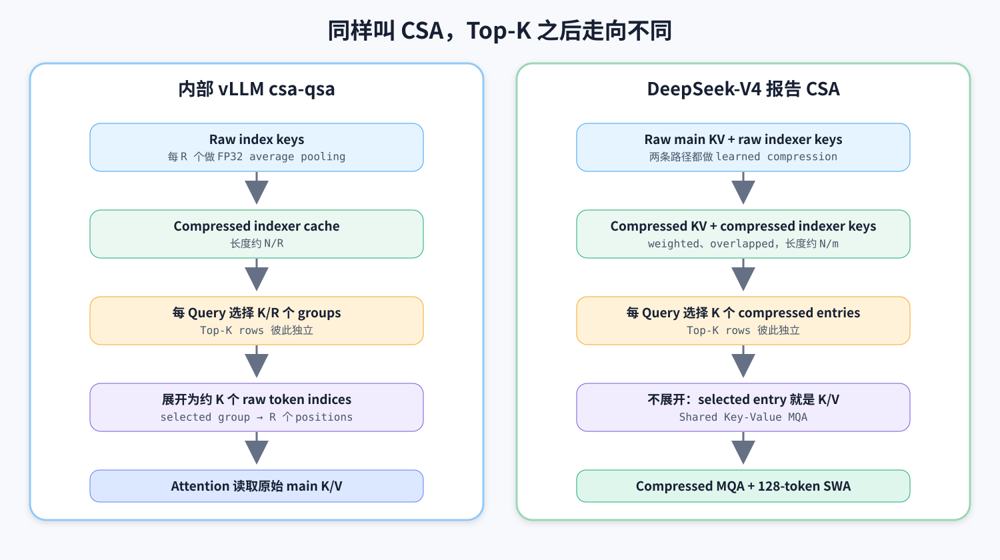
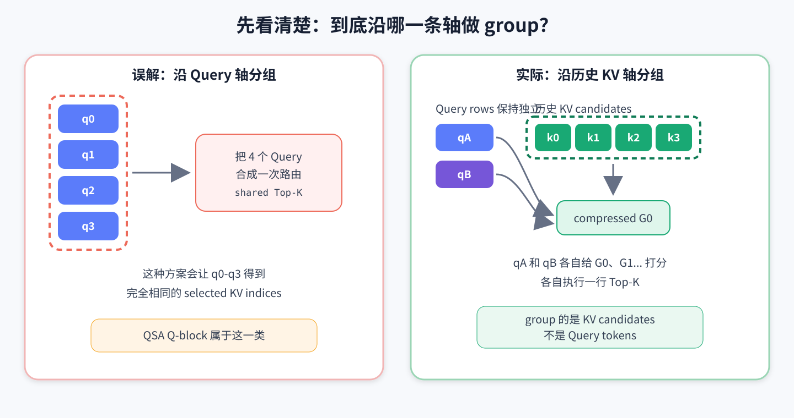
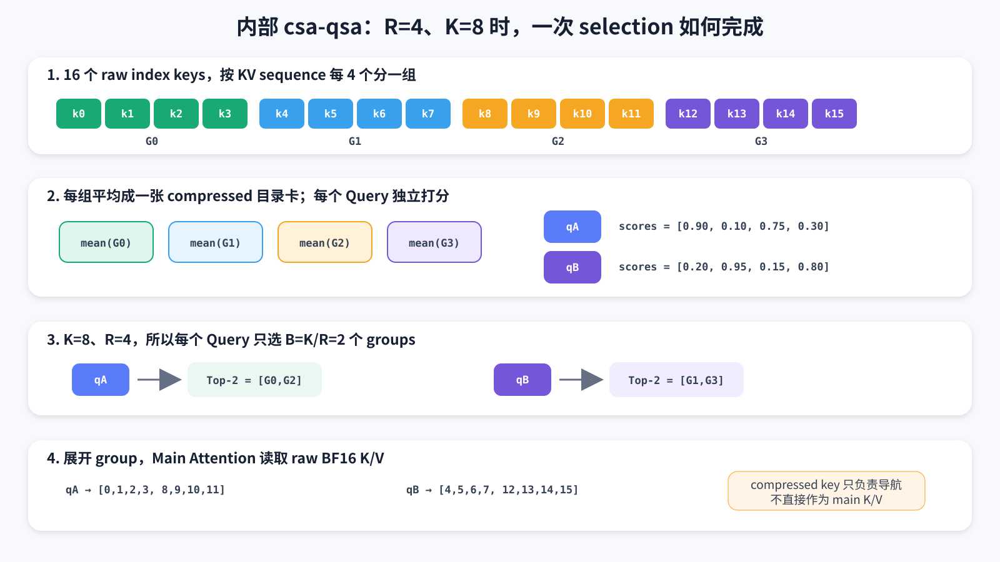

# 从 16 个 Token 的例子理解 CSA：DeepSeek-V4 报告与内部 `csa-qsa` 实现到底有什么不同

> 本文回答一个很容易混淆的问题：内部 vLLM `csa-qsa` 分支是不是“把 Query token 分组，然后组内 Query 共享同一份 Top-K”？
>
> 简短答案：**不是。内部实现沿历史 KV 序列做 compression group；每个 Query 仍然独立选择 groups。选中一个 group 后，才把其中的 raw token indices 全部展开给 main attention。**
>
> DeepSeek-V4 报告中的 CSA 也会让每个 Query 独立选择 compressed entries，但被选中的 compressed entry 本身就是 main attention 的 K/V，不会再展开回 raw tokens。因此，两者共享“先压缩候选空间、再稀疏选择”的思想，但不是同一个算法。

本文尽量先讲直觉，再讲公式，最后逐行对应代码。读完后，只需要记住两个问题：

1. **谁被分组了：Query，还是历史 KV？**
2. **被选中以后：使用 compressed entry，还是展开回 raw tokens？**

这两个问题足以区分本文涉及的几种方案。

<!-- more -->

---

## 1. 先建立最基本的角色分工

假设模型正在为当前 token 生成 attention 输出。

- 当前 token 产生一个 **Query**：它表示“我现在需要从历史里找什么信息”。
- 历史 token 产生 **Key/Value**：Key 用来判断相关性，Value 是真正被读取和汇总的内容。
- **Indexer** 是一个便宜的“候选检索器”：先快速判断哪些历史位置可能重要。
- **Main Attention** 是最后真正执行 softmax attention 的部分。

可以把它类比成在一座巨大图书馆里查资料：

```text
Query           = 你手里的问题
Indexer Key     = 图书目录中的关键词卡片
Main K/V        = 书的索引特征和正文内容
Top-K           = 目录系统推荐给你的候选书
Main Attention  = 真正翻阅候选书，并综合得到答案
```

Dense Attention 相当于每次都翻遍图书馆。Sparse Attention 则先通过目录找出少量候选，再只翻这些书。

CSA 中的 compression 又多做了一步：历史太长，连目录卡片都太多，所以先把若干历史位置压成一个更粗的 entry。

真正容易混淆的是：**这个“若干位置压成一个 entry”，到底只是压缩目录，还是连书的正文也一起压缩？**

- 内部 `csa-qsa`：只用压缩结果查目录，最后仍翻原始书籍。
- DeepSeek-V4 CSA：目录和 main KV 都压缩，最后直接阅读 compressed entries。



---

## 2. 一句话纠正“组内共享 Top-K”的理解

原来的理解可能是：

```text
把 q0、q1、q2、q3 分成一组
        ↓
整组 Query 只运行一次 Top-K
        ↓
q0/q1/q2/q3 共享同一组 selected tokens
```

这是一种 **Q-side grouping / shared routing**。仓库里已有的 QSA Q-block 方案确实属于这一类，但 `csa-qsa` 不是。

`csa-qsa` 实际做的是：

```text
把历史 k0、k1、k2、k3 分成一组
        ↓
用一个 compressed index key 代表这组历史 token
        ↓
q0、q1、q2、q3 仍然各自运行 Top-K
        ↓
每个 Query 可能选择完全不同的历史 groups
```

也就是说，**被分组的是 KV candidates，不是 Query rows**。



还有一句很精确的表述：

> 内部实现共享的是“一个 compressed group 被选中后，组内 raw tokens 共同获得入场资格”；它不共享“不同 Query 的 Top-K 结果”。

---

## 3. 用 16 个历史 Token 完整走一遍内部实现

为了让过程足够直观，先用很小的数字：

| 名称 | 符号 | 示例值 |
|---|---:|---:|
| 历史 token 数 | `N` | 16 |
| compression ratio | `R` | 4 |
| main attention 的 raw-token budget | `K` | 8 |
| 实际选择的 compressed groups 数 | `B = K / R` | 2 |

16 个历史 token 是：

```text
k0, k1, k2, k3, k4, k5, k6, k7,
k8, k9, k10, k11, k12, k13, k14, k15
```

### 3.1 第一步：沿 KV 序列分组

`R=4`，所以每 4 个连续历史 token 组成一个 group：

```text
G0 = [k0,  k1,  k2,  k3 ]
G1 = [k4,  k5,  k6,  k7 ]
G2 = [k8,  k9,  k10, k11]
G3 = [k12, k13, k14, k15]
```

这时，候选数量从 16 降到了 4。注意：原始 main K/V 并没有消失；只是 indexer 暂时用 4 个 compressed keys 来代表这 4 组位置。

### 3.2 第二步：每组产生一个 compressed index key

内部实现把一组里的 raw index keys 做 FP32 average pooling：

```text
compressed_key[G0] = mean(index_key[k0], ..., index_key[k3])
compressed_key[G1] = mean(index_key[k4], ..., index_key[k7])
...
```

随后 compressed key 会经过 normalization，并使用该 group 第一个 token 的位置应用 RoPE，再写入 compressed indexer cache。

这里的 average pooling 可以先理解成“为四本相邻的书制作一张平均目录卡片”。它不等于把四本书的正文销毁或合并；只是用一张便宜的卡片帮助检索。

### 3.3 第三步：每个 Query 独立给 groups 打分

假设当前有两个 Query：`qA` 和 `qB`。

它们可能得到下面的 group scores：

| Query | G0 | G1 | G2 | G3 |
|---|---:|---:|---:|---:|
| `qA` | 0.90 | 0.10 | 0.75 | 0.30 |
| `qB` | 0.20 | 0.95 | 0.15 | 0.80 |

因为 `B=K/R=8/4=2`，所以每个 Query 选择两个 groups：

```text
qA → Top-2 groups = [G0, G2]
qB → Top-2 groups = [G1, G3]
```

这就是“每个 Query 独立选择”的最直观证据：`qA` 和 `qB` 可以得到完全不同的结果。

如果多个 Query 恰好选到相同 group，那只是它们的 score 恰好都认为这个 group 重要，并不是实现强制它们共享路由。

### 3.4 第四步：把 selected groups 展开成 raw token indices

`qA` 选择 `[G0,G2]`：

```text
G0 → [k0, k1, k2, k3]
G2 → [k8, k9, k10, k11]

qA 的 raw indices = [0,1,2,3,8,9,10,11]
```

`qB` 选择 `[G1,G3]`：

```text
G1 → [k4, k5, k6, k7]
G3 → [k12, k13, k14, k15]

qB 的 raw indices = [4,5,6,7,12,13,14,15]
```

这一步解释了为什么要把 compressed top-k 做除法：

```text
想让 main attention 最终最多读取 K=8 个 raw tokens
每个 selected group 会展开出 R=4 个 raw tokens
因此只需要选择 B=K/R=2 个 groups
```

即：

$$
B=\frac{K}{R}
=\frac{\text{indexer budget}}{\text{compression ratio}}
$$

这不是某种难懂的概率公式，只是“每箱有 4 个苹果，想拿 8 个苹果，所以拿 2 箱”。



### 3.5 第五步：Main Attention 读取原始 K/V

最终 sparse attention 收到的不是 `[G0,G2]` 这样的 compressed entries，而是展开后的 raw positions：

```text
qA → read main K/V at [0,1,2,3,8,9,10,11]
qB → read main K/V at [4,5,6,7,12,13,14,15]
```

因此内部方案的 compressed index key 只是“导航卡片”。真正参与 main attention 的仍然是原始 token-level K/V。

---

## 4. Average pooling、dot product 和 Top-K 到底在做什么

这一节不要求线性代数基础。我们把高维向量临时画成二维坐标。

### 4.1 一个 Key 向量可以理解成一组特征

假设只有两个特征维度：

```text
第 1 维：和“GPU”有多相关
第 2 维：和“网络”有多相关
```

某组四个 token 的 index keys 是：

```text
k0 = [1.0, 0.0]
k1 = [0.8, 0.2]
k2 = [1.2, 0.0]
k3 = [1.0, 0.2]
```

平均后：

```text
G0 = mean(k0,k1,k2,k3) = [1.0, 0.1]
```

直觉上，这张 group 卡片表达：“这一组整体上很像 GPU 内容，稍微带一点网络内容。”

真实模型使用几十或上百维，维度不再具有这么明确的人类语义，但“把一组特征取平均得到代表”这个直觉仍成立。

### 4.2 Dot product 是“方向是否匹配”的分数

假设：

```text
q_gpu     = [1.0, 0.0]
q_network = [0.0, 1.0]
G0        = [1.0, 0.1]
```

dot product：

```text
q_gpu · G0     = 1.0×1.0 + 0.0×0.1 = 1.0
q_network · G0 = 0.0×1.0 + 1.0×0.1 = 0.1
```

所以 `G0` 对 GPU Query 更相关。

内部实现还会对 Q/K 做 normalization。它的直觉作用是减少“某个向量只因为数值特别大就赢得比赛”，让分数更关注方向相似性。

### 4.3 为什么还有 ReLU

ReLU 的规则非常简单：

```text
ReLU(x) = max(x, 0)
```

如果某个 indexer head 给出负相关分数，ReLU 会把它变成 0，而不是让负数抵消其他 head 的正证据。

内部 score 可以简化理解为：

$$
score(q_t,G_s)
=\frac{1}{\sqrt d}\sum_h
\operatorname{ReLU}(q_{t,h}\cdot \bar{k}_s)
$$

其中：

- `t`：第几个 Query token；
- `s`：第几个 compressed group；
- `h`：第几个 indexer query head；
- `d`：head dimension；
- `1/sqrt(d)`：让不同维度规模下的分数保持稳定。

可以把多个 indexer heads 理解成多个检索员：每个人从不同角度判断 group 是否重要。内部实现把他们的正向证据等权相加。

### 4.4 Top-K 只是“每行取最大的 K 个”

假设 logits 矩阵是：

```text
           G0    G1    G2    G3
qA        0.90  0.10  0.75  0.30
qB        0.20  0.95  0.15  0.80
```

`topk(..., dim=1)` 的意思是沿每一行分别取最大值：

```text
row qA → G0, G2
row qB → G1, G3
```

如果要让 Query 共享 Top-K，就必须先把多行 logits 合成一行，例如对 Query 方向做 max pooling：

```text
shared[G] = max(score[qA,G], score[qB,G])
```

但 `csa-qsa` 没有这个操作。它保留了 `[number_of_queries, number_of_groups]` 的二维 logits，并沿 `dim=1` 对每一行独立 Top-K。

---

## 5. 不完整的 causal tail 为什么要额外处理

设 `R=4`，当前序列只有 10 个可见 token：

```text
完整 group G0 = [k0,k1,k2,k3]
完整 group G1 = [k4,k5,k6,k7]
不完整 tail   = [k8,k9]
```

`k8,k9` 还凑不满 4 个 token，因此不能生成完整的 compressed key。如果 indexer 只允许选择 `G0,G1`，当前 Query 就完全看不到最近的 `k8,k9`，这既损失局部信息，也会让 causal 边界附近的行为很奇怪。

内部实现的处理是：

1. Top-K 只在完整 compressed groups 上执行；
2. selected groups 展开成 raw token positions；
3. 当前可见的不完整 tail tokens 无条件追加到结果后面。

一个不完整 group 最多有 `R-1` 个 token，所以 index buffer 的最大宽度是：

$$
W_{\mathrm{out}}=K+R-1
$$

例如 `K=8,R=4`，最大宽度是 `11`。如果 tail 只有两个 token，剩余位置用 `-1` padding。

这里的 `K` 更准确地说是“完整 groups 展开后的 raw-token budget”；实际有效 attention token 数可能因为 tail 而达到 `K+R-1`。

---

## 6. 代码中的三个 group/chunk 不要混为一谈

### 6.1 KV compression group：改变检索粒度

这是本文一直讨论的核心 group：连续 `R` 个历史 index keys 被平均成一个 compressed key。

它把 indexer 候选长度从约 `N` 变成约 `N/R`。

### 6.2 Selected group expansion：改变入场方式

Top-K 选中一个 compressed group 后，组内 `R` 个 raw token indices 一起进入 main attention。

这可以叫“组内 token 共享一次 selection decision”：只要 group 胜出，整个 group 都被展开。但它仍然不是“组内 Query 共享 Top-K”。

### 6.3 Prefill row chunk：只控制 workspace

长 prefill 中，完整 logits 可能很大：

```text
[number_of_query_rows, number_of_compressed_candidates]
```

如果一次全部物化为 FP32，workspace 会过大。因此代码根据约 128 MiB 的 logits workspace budget，把 Query rows 分成若干 chunks：

```text
chunk 0: q0 ... q127
chunk 1: q128 ... q255
...
```

每个 chunk 一次计算一批 rows，但内部仍执行：

```python
torch.topk(logits, ..., dim=1)
```

因此同一个 chunk 中的 Query 只是一起执行 kernel，并没有共享 logits 或 Top-K indices。

这和矩阵乘法一次处理多行很类似：Excel 可以一次计算 100 行公式，但不代表这 100 行得到相同结果。

---

## 7. 对应到 `csa-qsa` 的真实代码路径

本文核对的内部实现位于：

```text
ECS: ~/codes/vllm
branch: csa-qsa
commit: b6c180faefebe30e5be4bd63aa6e710d64956c0c
```

### 7.1 配置含义

文件：`vllm/model_executor/layers/qwen4_exp_csa_indexer.py`

```python
self.token_topk = int(config.indexer_budget)
self.compress_ratio = int(config.indexer_compress_ratio)
self.block_topk = self.token_topk // self.compress_ratio
```

这里虽然变量叫 `token_topk`，但 indexer 的第一次 Top-K 实际选的是 `block_topk` 个 compressed groups。展开以后才得到约 `token_topk` 个 raw positions。

配置验证还要求：

- `compress_ratio` 是 2 的幂；
- `indexer_budget` 能被 `compress_ratio` 整除；
- 当前 kernel 支持特定的 `block_topk` 规模。

测试中有一个很能说明问题的合法配置：

```text
indexer_budget = 8192
compress_ratio = 4
block_topk = 8192 / 4 = 2048
```

这只是 branch 测试中的配置示例，不应自动等同于某个实际部署模型的 config。

### 7.2 Compression

文件：`vllm/model_executor/layers/qwen4_exp_csa.py`

```python
def average_pool_csa_keys(key_groups):
    return key_groups.float().mean(dim=1).to(key_groups.dtype)
```

CUDA 路径对应 `csa_compress_groups_with_ratio`。其 docstring 也明确说明是在 group boundary 做 FP32 pooling。

### 7.3 Per-query scoring 和 Top-K

reference score 逻辑可简化为：

```python
scores = einsum("mhd,nd->mnh", q.float(), k.float())
logits = relu(scores).sum(dim=-1) / sqrt(head_dim)
```

这里的 `m` 就是 Query rows。输出保留一行对应一个 Query。

CUDA Top-K 路径中最关键的一行是：

```python
candidates = torch.topk(logits, candidate_count, dim=1).indices
```

输出 shape 是：

```text
[number_of_query_rows, block_topk]
```

这已经排除了“多个 Query 共享同一行 Top-K”的可能。

### 7.4 Group expansion

`expand_csa_block_indices_cuda` 将每个 compressed index `g` 展开为：

```text
g*R + 0,
g*R + 1,
...,
g*R + (R-1)
```

然后追加当前不完整 causal tail。

### 7.5 Main Attention

文件：`vllm/v1/attention/backends/qwen4_exp_csa.py`

Indexer 把展开后的 indices 写入 `topk_indices_buffer`。Main attention 随后调用：

```python
csa_sparse_paged_attention(
    query,
    key_cache,
    value_cache,
    indices,
    ...,
)
```

这里的 `key_cache/value_cache` 是原始 main BF16 paged KV cache，不是 compressed indexer cache。kernel 还显式要求 indices “one row per query”。

因此 CUDA 路径与 reference 路径语义一致：**每 Query 独立选 group，再访问自己的 raw-token indices。**

---

## 8. DeepSeek-V4 报告中的 CSA 怎么做

DeepSeek-V4 报告 Section 2.3.1、Figure 3 和公式 (9)-(19) 描述的是另一种更彻底的 compression。

### 8.1 Main KV 本身就被压缩

报告先从 hidden states 产生两套 KV entries：

```text
C^a, C^b
```

同时产生对应的 compression logits/weights：

```text
Z^a, Z^b
```

对每个 compressed entry，模型不是简单求平均，而是：

1. 使用 trainable compression projections 生成内容和权重；
2. 加上 learnable positional biases；
3. 对来自两个相邻分组、总计 `2m` 个候选做 row-wise softmax；
4. 用 softmax 权重对 entries 做逐维 weighted sum。

它可以类比成：内部实现只是把四张目录卡片做算术平均；报告实现则训练了一个“摘要编辑器”，针对每个特征维度学习应该从哪些 token 提取多少信息。

报告还使用 overlapped compression：一个 compressed entry 会结合当前 `C^a` block 和前一个 `C^b` block，总共涉及 `2m` 个 entries；相邻 compressed entries 的来源存在重叠。尽管感受野覆盖 `2m`，输出序列长度仍约为原来的 `1/m`。

### 8.2 Indexer keys 使用同类 learned compression

Lightning Indexer 并不是对 raw index keys 简单平均，而是使用与 main compressed KV 相同类型的 compression operation，产生 compressed indexer keys。

### 8.3 仍然是每个 Query 独立 Top-K

报告公式 (16) 对 Query token `t` 与 compressed block `s` 计算 score：

$$
I_{t,s}=\sum_h w^I_{t,h}
\operatorname{ReLU}
(q^I_{t,h}\cdot K^{IComp}_s)
$$

这里仍然同时包含 `t` 和 `s`：每一个 Query `t` 都有自己的一行 scores。

与内部实现相比，还有一个区别：报告使用 query-dependent、learnable 的 head weights `w^I_{t,h}`。可以理解成 Query 会判断“这次应该更相信哪个检索员”。内部 branch 则把各 head 的正分数等权相加。

### 8.4 被选中的 compressed entry 直接作为 K 和 V

这是与内部实现最重要的差别。

报告的 top-k 选出：

```text
selected compressed KV entries
```

随后 Shared Key-Value MQA 直接使用 compressed entry：

```text
key   = selected compressed entries
value = selected compressed entries
```

不会把一个 compressed entry 展开回对应的 `m` 个 raw token positions。

因此报告中的 `attention top-k=1024` 表示每个 Query 最多选择 1024 个 compressed KV entries，而不是先选择 `1024/m` groups 再展开为 1024 个 raw tokens。

### 8.5 为什么还需要 Sliding Window Attention

严格 causal compression 只允许 Query 访问此前已经完成的 compressed blocks，因此 Query 无法通过 compressed branch 看到自己所在的未完成 block。

报告另外加入 `n_win=128` 的 uncompressed Sliding Window KV entries：

```text
远处信息 → selected compressed KV entries
最近信息 → 128-token sliding window raw KV
```

这既补足 causal tail，也保留局部 fine-grained dependencies。

内部 `csa-qsa` 没有同样的 SWA branch；它通过在 expanded indices 后追加最多 `R-1` 个 incomplete tail tokens，解决“当前 compression group 尚未完成”的可见性问题。两者不能简单视为同一种 tail 处理。

---

## 9. 两种 CSA 的逐项对照

| 问题 | 内部 vLLM `csa-qsa` | DeepSeek-V4 报告 CSA |
|---|---|---|
| 谁被分组 | 历史 indexer keys | main KV 与 indexer keys |
| Query 是否分组 | 否 | 否 |
| Query 是否共享 Top-K | 否，每 Query 独立 | 否，每 Query 独立 |
| compression | 非重叠 group 的 FP32 mean pooling | learned weighted、overlapped compression |
| index candidate 数 | 约 `N/R` | 约 `N/m` |
| Top-K 选择什么 | compressed group IDs | compressed KV entries |
| 选中后怎么办 | 展开为 group 内全部 raw token indices | 不展开，直接用于 MQA |
| main attention 读取什么 | 原始 BF16 main K/V | compressed entry 同时作为 K/V |
| main KV cache 是否缩短 | 否 | 是，约缩短到 `1/m` |
| causal tail/local 信息 | 追加最多 `R-1` 个 raw tail tokens | 额外 128-token SWA branch |
| index heads 如何汇总 | ReLU 后等权求和 | Query-dependent learnable weights |

一句话类比：

- **内部实现：**把目录压缩，查到某一箱书以后，把整箱原书拿出来翻。
- **报告实现：**目录和书本身都被压成摘要，查到哪些摘要就直接阅读哪些摘要；最近的原文另走 Sliding Window。

---

## 10. 内部设计可能带来哪些收益和代价

### 10.1 收益：Indexer 扫描长度约降到 `1/R`

原本每个 Query 要对 `N` 个 raw index keys 打分；现在只需要对约 `N/R` 个 compressed keys 打分。

因此长期上下文下可以降低：

- compressed indexer cache 容量；
- index score GEMM 的候选列数；
- logits workspace；
- Top-K 面对的候选数量。

### 10.2 收益：Main Attention 仍看到原始 token-level K/V

compressed key 只负责粗筛。只要某个 group 被选中，main attention 仍可以在组内区分各 raw token，通过真实 QK logits 和 softmax 决定更关注哪一个。

换句话说：Indexer 的决定是 coarse-grained，Attention 的加权仍是 token-grained。

### 10.3 代价：Main KV cache 没有按 `R` 缩小

因为最后仍要访问原始 K/V，所以 main K/V 必须完整保留。该方案主要减少 indexer 的搜索成本，不会获得报告 CSA 那种 main KV sequence compression 带来的巨大 cache 节省。

### 10.4 代价：一个好 token 会带进整个 group

如果一个 group 里只有 `k6` 很重要，但 group 被选中后：

```text
[k4,k5,k6,k7]
```

四个 token 都会占用 raw-token budget。`k4,k5,k7` 可能最终得到很低的 softmax 权重，但它们仍消耗 memory load 和 attention FLOPs。

这就是 coarse routing 的典型 trade-off：索引更便宜，但选择粒度变粗。

### 10.5 代价：不会获得 Q-block 的跨 Query K/V 复用

因为相邻 Query 的 selected groups 可以不同，main sparse attention 仍要消费一行一个 Query 的 indices。它没有强制多个 Query 共享一组 K/V 地址，因此不能直接获得 QSA Q-block 那种 routing sharing 与 K/V reuse。

---

## 11. 最容易踩的五个概念陷阱

### 陷阱一：`block_topk` 代表 Query block

不是。这里的 block/group 在 KV candidate 轴上。

### 陷阱二：同一个 CUDA call 处理多行，所以多行共享 Top-K

不是。矩阵和 kernel 可以批量处理多行，每行仍有独立结果。关键要看 Top-K 沿哪个 dimension 执行，以及 output 是否保留 Query row 维度。

### 陷阱三：compressed index key 就是 compressed main K/V

内部实现中不是。compressed cache 用于 indexer scoring；main attention 读取另一份原始 BF16 K/V cache。

### 陷阱四：`indexer_budget=K` 表示选 K 个 compressed groups

内部实现中不是。它先选择 `K/R` 个 groups，再展开为约 K 个 raw positions。

报告里的 attention top-k 才是直接选择 K 个 compressed KV entries。

### 陷阱五：追加 tail 等价于 128-token SWA

不是。内部 tail 最多只有 `R-1` 个未完成 group token；报告 SWA 是固定的 128-token local branch，目的和容量都更广。

---

## 12. 用伪代码把内部实现压缩到 20 行

```python
R = indexer_compress_ratio
K = indexer_budget
B = K // R

# 历史侧：只有完整的 R-token group 才生成 compressed key
for each complete group g:
    raw_index_keys = index_key_cache[g*R : (g+1)*R]
    compressed_key[g] = mean_fp32(raw_index_keys)
    compressed_key[g] = norm_and_rope(compressed_key[g])

# Query 侧：每一行独立执行
for each query q_t:
    for each visible compressed group g:
        score[t, g] = sum_over_heads(relu(dot(q_t, compressed_key[g])))

    selected_groups[t] = topk(score[t, :], B)
    selected_raw_tokens[t] = expand_each_group_to_R_tokens(
        selected_groups[t]
    )
    selected_raw_tokens[t] += visible_incomplete_tail(max_len=R-1)

    output[t] = sparse_attention(
        main_query[t],
        raw_main_kv_cache[selected_raw_tokens[t]],
    )
```

如果要实现真正的 Query-group shared Top-K，伪代码里还必须额外出现类似下面的步骤：

```python
pooled_scores[q_group, g] = max_over_queries(score[q, g])
shared_groups[q_group] = topk(pooled_scores[q_group], B)
```

`csa-qsa` 中没有这一步。

---

## 13. 最终心智模型

以后看到任何 compression + sparse attention 实现，可以依次问四个问题：

1. **Compression 沿哪条轴？** 是合并 Query rows，还是合并 KV candidates？
2. **Top-K 的一行对应谁？** 一个 Query、一个 Query block，还是一个 head/group？
3. **Top-K 选中的对象是什么？** raw token、KV block，还是 learned compressed entry？
4. **Main Attention 最终读取什么？** raw K/V，还是 compressed K/V？

套到本文：

```text
内部 csa-qsa
  KV 轴压缩 → 每 Query 独立选 groups → 展开 → raw K/V attention

DeepSeek-V4 CSA
  KV 轴 learned compression → 每 Query 独立选 compressed entries
  → 直接 compressed MQA + local SWA
```

因此最准确的结论是：

> 内部实现不是“Query 分组共享 Top-K”，而是“KV 分组共享一次 selection decision”；并且这种 decision 对每个 Query 独立发生。它更像一个 block-granularity approximate indexer，服务于后续的 raw-token sparse attention。DeepSeek-V4 报告 CSA 则真正把 compressed representation 带入 main attention，并通过 learned compression、overlap 和 SWA 共同弥补信息损失。

---

## 参考资料与代码定位

- DeepSeek-AI, *DeepSeek-V4: Towards Highly Efficient Million-Token Context Intelligence*, Section 2.3.1, Figure 3, Equations (9)-(19)。
- DeepSeek-V4 官方 inference implementation：<https://huggingface.co/deepseek-ai/DeepSeek-V4-Pro/tree/main/inference>
- 内部 vLLM `csa-qsa` commit：`b6c180faefebe30e5be4bd63aa6e710d64956c0c`
- `vllm/model_executor/layers/qwen4_exp_csa_indexer.py`
- `vllm/model_executor/layers/qwen4_exp_csa.py`
- `vllm/attention/ops/qwen4_exp_csa.py`
- `vllm/v1/attention/backends/qwen4_exp_csa.py`
