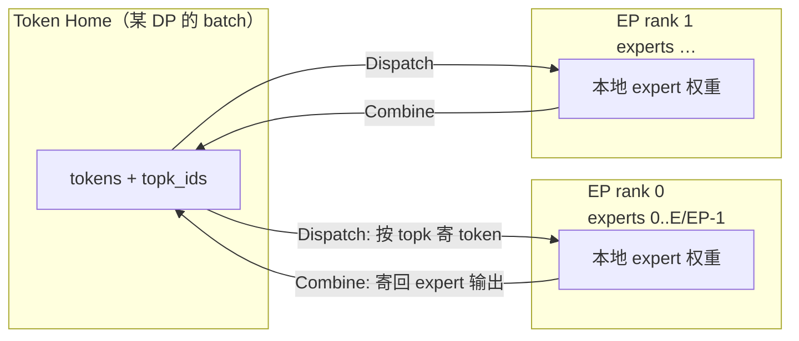
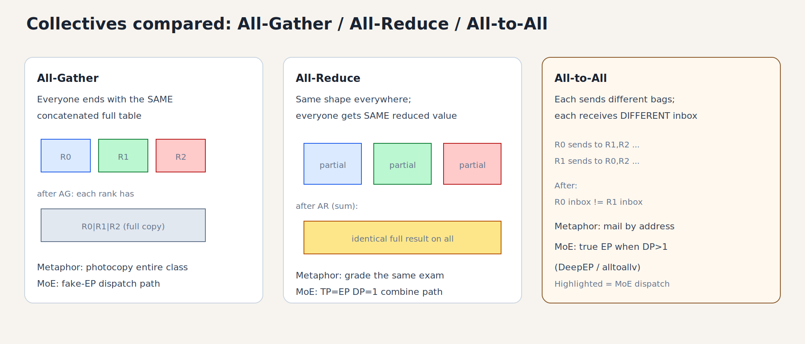
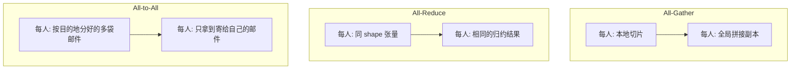
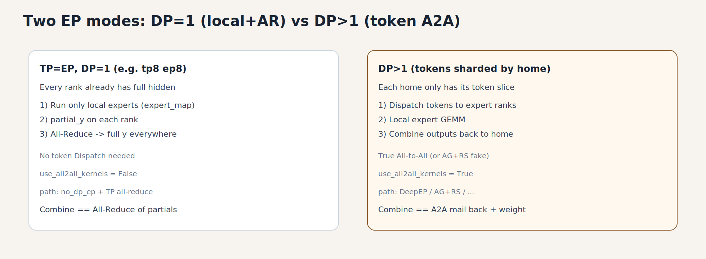
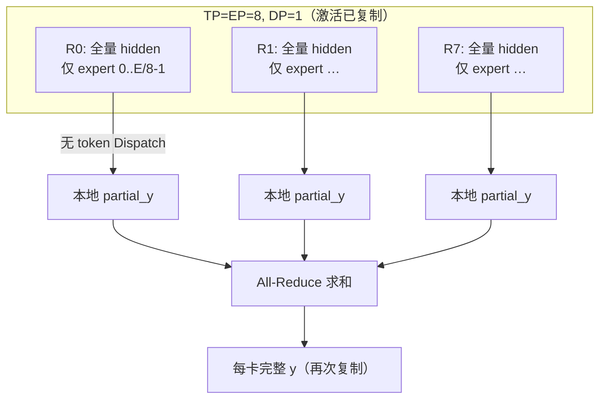
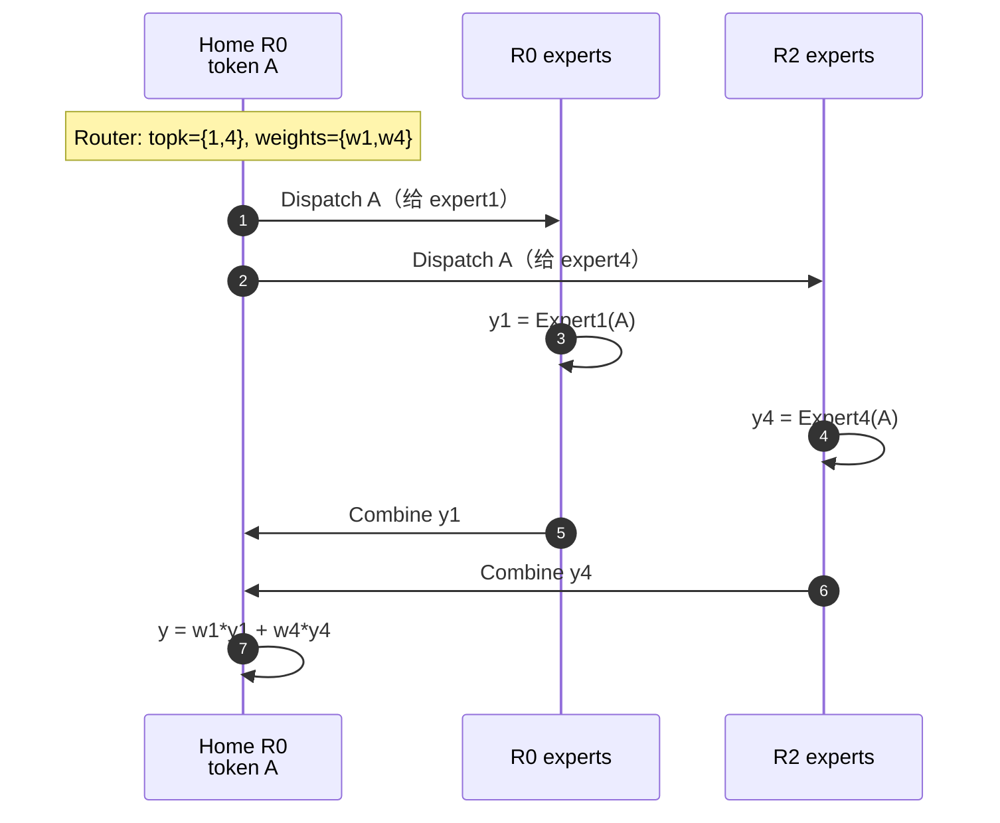
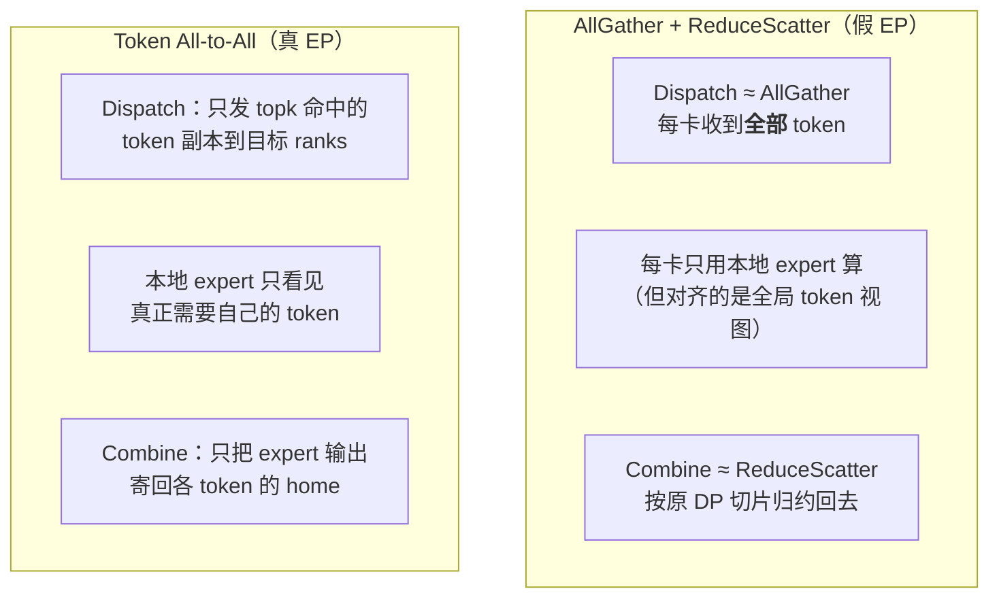
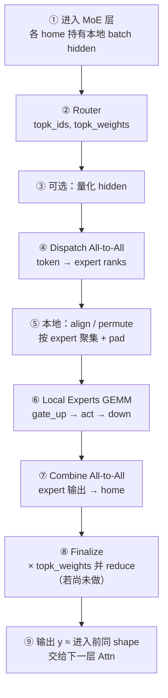

# 01a · MoE All-to-All：原因、载荷与流程

> 上一章：[01_ep_fundamentals.md](01_ep_fundamentals.md)（§3 抽象）  
> 下一章：[02_modular_kernel_and_moe_kernels.md](02_modular_kernel_and_moe_kernels.md)  
> 实现侧加深：[03_deepep.md](03_deepep.md)

> **现有文档里有没有？**  
> `01` 只有 AG+RS vs 真 A2A 的抽象对比；`03` 讲 DeepEP 库差异。  
> **「为什么要 A2A、传什么、怎么走」的细图在本章。**

---

## 1. 为什么需要 All-to-All？

### 1.1 矛盾：expert 在卡上，token 在另一处

开启 EP 后，**expert 权重静态分片**在各 EP rank 上；而 Router 之后，每个 token 只需要其中 **top-k 个** expert。

若不做通信，只能：

- 把**所有 expert 权重**复制到每张卡（失去 EP），或  
- 每张卡只算本地 expert、对「没来的 token」交白卷（结果错误）

因此必须让 **activation（token）去找 expert**，而不是每步搬整份 expert 权重。



### 1.2 为何是「All-to-All」而不是点对点随便发？

- 每个 rank **既是发送方也是接收方**：自己的 token 要出去，别人的 token 要进来给本地 expert 算。  
- 目的地由 **路由结果** 决定，且每步不同 → 典型的 **多对多、不规则** 交换。  
- 实现上可以是：NCCL `all_to_all_single`、自定义 NVLink/RDMA kernel（DeepEP）、或用 AG+RS **模拟**（通信量更大）。

### 1.3 和 Attn all-reduce 的差别

| | Attn TP all-reduce | MoE EP all-to-all |
|--|--------------------|-------------------|
| 目的 | 把各 TP 分片算力结果合成完整 hidden | 把 token **搬到**持有 expert 的卡 |
| 数据是否搬家换主人 | 通常仍留在同 DP 各 TP 上（数值对齐） | token **临时离开 home** |
| 每步目的地 | 固定（全体参与归约） | 随 `topk_ids` 变 |

**Attn TP 之后，每个 TP rank 都有完整 hidden 吗？**

在常见的 **列并行 + 行并行**（无 Sequence Parallel）设定下：**是的**。

```text
QKV（常列并行）: 每卡算一部分 head / 一部分输出通道
Attention:        每卡算自己那份 head
o_proj（行并行）: 每卡算出「对完整 H 的一块贡献」→ 形状已是 [T, H]，但是部分和
        │
        ▼  all-reduce（对 [T, H] 求和）
每张 TP 卡: 同一份完整 hidden [T, H]   ← 人人都有全量，数值相同
        │
        ▼
MoE / FFN …
```

要点：

- all-reduce 的对象通常是 **o_proj 之后、已经是 `[T, H]` 的部分和**；规约后 **每个 TP rank 都得到相同的完整向量**，不是「只有 rank0 有全量」。  
- 这和 MoE A2A 相反：A2A 之后每人手里仍是**不同**的 token 袋；Attn AR 之后每人手里是**同一份** hidden。  
- **例外**：开了 **Sequence Parallel** 时，某些阶段会把 activation 按 sequence 维切开，此时不是「人人一份完整 `[T,H]`」，要用 all-gather 等再拼；读代码时看该模型是否启用 SP。  
- 同 DP 内「人人有完整 hidden」正是 §3.3 里 home 的前提：MoE 前各 TP 已对齐，dispatch 才谈得上按 expert 再搬家。

### 1.4 为什么叫 All-to-All？和 All-Reduce / All-Gather 比什么？

这是 **MPI/NCCL 集合通信原语** 的名字，不特指 MoE。MoE 的 dispatch/combine 在通信模式上像（或不规则版的）**all-to-all**，所以常这么叫。

#### 三种原语各在干什么（4 卡直觉）

设 ranks = `R0 R1 R2 R3`，每人手里先有一块本地数据。



*图：AG=复印全班；AR=同一道题对答案；A2A=按地址寄信。MoE dispatch 是 A2A。*

```text
All-Gather（大家凑齐同一份大表）
  每人拿出自己的切片 ──► 每人最后都拥有 [R0|R1|R2|R3] 全量拼接
  「一人一份 → 人人全有」

All-Reduce（大家对同位元素做同一运算）
  每人有同 shape 的张量 ──► 先规约（如求和）再人人得到同一结果
  「人人一份同形状 → 人人同一份归约结果」
  （实现上常拆成 reduce-scatter + all-gather）

All-to-All（每人给每人寄一份，可能不同）
  R_i 把数据拆成发给 R0..R3 的若干块 ──► R_j 收到来自所有人寄给自己的块并拼起来
  「一人向全体投递（可不等长）→ 每人收到寄给自己的那一袋」
```



#### 对照表

| | **All-Gather** | **All-Reduce** | **All-to-All** |
|--|----------------|----------------|----------------|
| 一句话 | 收集并广播全量 | 对同位做运算并广播结果 | **交换**：我发给你的 ≠ 你发给我的 |
| 输出是否人人相同 | 是（同一份大表） | 是（同一份归约结果） | **否**（每人袋里内容不同） |
| 典型 LLM 场景 | 某些并行下拼 activation；「假 EP」的 dispatch | TP 下 Attn/MLP 的分片求和 | MoE EP：token ↔ expert rank |
| 数据关系 | 拼接 / 复制 | 逐元素 sum/max/… | **重排 / 投递**（可带不等长） |
| 目的地是否由内容决定 | 否（全体一样） | 否 | **是**（MoE 里由 topk 决定寄给谁） |

#### 为何 MoE 是 All-to-All，不是另外两个？

- **不是 All-Gather**：并不需要「每张卡都拿到全局所有 token」（那是假 EP 的 AG 路径）；真 EP 只要「持有某 expert 的卡拿到**需要它的**那些 token」。收齐后每人手里的集合**不同**。  
- **不是 All-Reduce**：不是对同一位置做 sum 得到人人相同的一张量；而是把不同 token **搬到不同目的地**，算完再搬回来。Combine 里的「按 topk 加权求和」是 **home 本地**对 K 路 expert 输出归约，不是「全体 ranks 对同一缓冲做 all-reduce」。  
- **是 All-to-All**：每个 EP rank **既发送也接收**；发送集合由路由决定；接收集合 =「全世界寄给我的本地 expert 的 token」。这正是 all-to-all 的「全员互寄、各取所需」。

口播：

> All-Gather = 人人复印全班作业；All-Reduce = 全班同一道题对答案；All-to-All = 每人按收件人分发信件，信箱内容各不相同。MoE 是寄信找专家，所以叫 all-to-all。

#### 和「假 EP」的关系（避免名实混淆）

vLLM 里有的后端名叫 all2all、实现却是 **All-Gather + Reduce-Scatter**：用更简单的集体通信 **模拟**「专家并行需要的数据交换语义」，但通信量更大。  
DeepEP / PPLX 等才是更接近教科书的（常为 **不等长 / 稀疏**）all-to-all。  
学概念时：先认清 **通信模式是 A2A**；再认清某条代码路径是「真 A2A」还是「AG+RS 冒充」。

#### 不等长（alltoallv）

教科书 `all_to_all` 常假设每人发给每人的块等长。MoE 里各 rank 收到的 token 数随路由波动 → 实际多是 **`alltoallv`（可变长度）** 或 DeepEP 自己管 layout/padding。名字仍归在 all-to-all 一族。

### 1.5 特例：`TP=EP` 且 `DP=1`（例如 tp8 ep8）——还要不要 A2A？

先对齐配置：vLLM 里 `EP = TP × DP`，故 **`TP=8, EP=8` ⇒ `DP=1`**。  
此时 Attn all-reduce 之后，**8 张卡上已经是同一份完整 hidden**（同一批 token，激活复制）。  
Expert 权重仍按 EP 切开：每卡只持有 `E/8` 个完整 expert。

#### 还需要把 token dispatch 出去吗？

**逻辑上不必再「寄 hidden」**：目标 expert 所在的卡上，这份 activation **已经有了**。  
缺的是「别的卡上的 expert 算力结果」，不是「别的卡上的 token 副本」。

vLLM 也按这个事实选型（`FusedMoEParallelConfig.use_all2all_kernels`）：

```text
use_all2all_kernels = use_ep and (dp_size > 1 or sequence_parallel)
```

因此 **`DP=1` 且未开 SP 时：走 no_dp_ep，不开 DeepEP/真 A2A。**

左右对照如下：左侧是「激活已复制 → 本地 expert + AR」；右侧是「token 分片 → 真 A2A」。



*图：tp8ep8（左）通常无 token dispatch；有 DP（右）才需要 DeepEP/AG 类 A2A。*

#### 那 combine 怎么做？（这条路径的真实流程）

```text
每卡已有: hidden [T, H]（全相同）
        │
        ▼ Router（每卡可各自算，结果应一致）
   topk_ids / topk_weights
        │
        ▼ 本地 MoE（expert_map：非本卡 expert → -1，GEMM 跳过）
   每卡只算「路由到本地 expert」的那些 (token, expert) 贡献
   得到 partial_y[T, H]   // 别处专家的贡献在本卡为 0
        │
        ▼ All-Reduce（在 TP/EP 这 8 卡上对 partial_y 求和）
   每卡得到完整 y[T, H] = Σ_k w_k * Expert_k(x)   // 再次人人一份全量
```



和「有 DP 时的真 A2A」对比：

| | **TP=EP, DP=1**（本特例） | **DP>1**（token 分片） |
|--|---------------------------|-------------------------|
| Attn 后 hidden | 每卡 **全量相同** | 每 DP home **只有自己的切片** |
| 要不要 Dispatch token？ | **一般不需要**（已在本地） | **需要**（专家卡没有你的 token） |
| 「Combine」形态 | **All-Reduce partial expert 输出** | **All-to-All 把 expert 输出寄回 home**（再本地 ×weight） |
| vLLM 后端 | `no_dp_ep` + 层末 `tensor_model_parallel_all_reduce` | DeepEP / AG+RS / … |

口播：

> DP=1 的 EP：token 不用搬家，**算力结果**用 all-reduce 拼起来。  
> DP>1 的 EP：token 先搬家（A2A），算完再搬回来。

#### 和「假 EP / 真 A2A」会不会搞混？

- 本特例的 all-reduce **不是** all-to-all；通信模式是 AR。  
- 理论上也可以在 DP=1 时强行做 A2A（只把 token 收到专家卡、避免每卡对着全量 T 做 routing 相关开销），但激活已复制时收益有限；vLLM 默认选 **本地 + AR**。  
- 代码锚点：`config.py` 里 `use_all2all_kernels`；`prepare_finalize/no_dp_ep.py`；`runner/moe_runner.py` 的 `_maybe_reduce_final_output`。

---

## 2. 玩具例子（贯穿全章）

设定：

- `EP = 4` ranks：`R0 R1 R2 R3`  
- 全局 `E = 8` 个 expert，每 rank 持有 2 个：`R0:{0,1} R1:{2,3} R2:{4,5} R3:{6,7}`  
- `top_k = 2`  
- 为简单起见：先看 **每个 home 只有 1 个 token**（真实 serving 是一个 batch）

| Token | Home | topk_ids | 需要去的 ranks |
|-------|------|---------|----------------|
| A | R0 | `{1, 4}` | R0（本地 expert1）、R2（expert4） |
| B | R1 | `{2, 7}` | R1、R3 |
| C | R2 | `{0, 3}` | R0、R1 |
| D | R3 | `{5, 6}` | R2、R3 |

### 2.1 Dispatch 流量示意

```text
        发出（按 expert 归属）                各 rank 收到的 token 袋
R0 ──A→ R0(e1), R2(e4)──┐
R1 ──B→ R1(e2), R3(e7)──┤              R0: A(给e1), C(给e0)
R2 ──C→ R0(e0), R1(e3)──┼── All-to-All → R1: B(给e2), C(给e3)
R3 ──D→ R2(e5), R3(e6)──┘              R2: A(给e4), D(给e5)
                                       R3: B(给e7), D(给e6)
```

注意：

- **同一 token 可复制发到多个 rank**（因为 K>1，且专家可能在不同卡）。  
- 接收侧拿到的是「要给**本卡 expert** 算的 token 列表」，顺序通常已按 expert 聚好或稍后 permute。

### 2.2 Combine 流量示意

各 rank 算完本地 expert 后，把 **对应 token 的 expert 输出**寄回 home，home 上按 `topk_weights` 做加权和：

```text
y_A = w_A1 * Expert1(A) + w_A4 * Expert4(A)   # 在 R0 上归约出 A
y_B = ... 在 R1 上
...
```



---

## 3. 传输的数据内容

分 **Dispatch** 与 **Combine** 两段。不同后端打包方式不同，但逻辑载荷如下。

### 3.1 Dispatch：从 Home → Expert ranks

| 载荷 | 典型 shape / 含义 | 是否必须 |
|------|-------------------|----------|
| **Token hidden（或量化后）** | `[T_home, H]` 或 fp8 + scales | 必须（主体流量） |
| **topk_ids** | `[T_home, K]`，全局 expert id | 通常一起走，供接收侧知道算哪个 expert / 如何 permute |
| **topk_weights** | `[T_home, K]` | 常一起走；也可 combine 前再对齐（视实现） |
| **布局元数据** | 每 rank/每 expert 的 token 数、`is_token_in_rank` 等 | DeepEP 等会先算 `get_dispatch_layout`，再搬数据 |
| **量化 scales** | 与 hidden 对齐的 scale | 若在 dispatch 前/中量化 |

直觉：主体是 **activation 字节**；路由索引和权重是小头，但决定「寄给谁、回来怎么加」。

DeepEP HT 适配层里可见的顺序（概念）：

```text
get_dispatch_layout(topk_idx)  →  各 rank/expert 计数与掩码
buffer.dispatch(x, topk_idx, topk_weights, ...)
  → recv_x, recv_topk_*, expert_num_tokens, handle
```

### 3.2 Combine：从 Expert ranks → Home

| 载荷 | 含义 |
|------|------|
| **Expert 输出 hidden** | 每个「(token, 被选中的本地 expert)」一条输出，形状与实现相关 |
| **handle / 路由逆映射** | Dispatch 留下的元数据，告诉 combine「这条输出寄回哪个 home、对应哪个 topk 槽」 |
| （可选）权重 | 若权重未在专家侧乘完，home 或 finalize 再乘 |

Home 侧最终得到与进入 MoE 前对齐的 `[T_home, H]`（再进下一层 Attn）。

### 3.3 和「假 EP」AG + RS 比：传的是什么？



| | AG + RS | 真 All-to-All |
|--|---------|----------------|
| Dispatch 主体 | **全体** token 复制到每卡 | **稀疏** token 副本（与 K、专家分布有关） |
| 冗余 | 通信量 / 无效计算随 EP 变差 | 相对小 |
| 实现复杂度 | 低（NCCL） | 高（layout、padding、handle） |

AG 路径在 vLLM 里常见接口语义：`dispatch(hidden, topk_weights, topk_ids)` → gather 三者；`combine(hidden)` → reduce-scatter。  
真 A2A 则按 expert 做不规则交换（DeepEP/PPLX 等）。

---

## 4. 端到端流程（一层 MoE）

### 4.1 总流程



### 4.2 单 token 视角 vs 整卡视角

**单 token**：复制 K 份（逻辑上）→ 最多去到 ≤K 个 ranks → 各算一段 → K 路结果回 home 加权求和。

**整卡（某 EP rank）**：

```text
发出:  本 home 的 T 个 token，按 topk 拆成发往各 dst 的列表
收到:  全世界寄给「我的本地 experts」的 token 袋
计算:  只跑本地 E/EP 个 expert
发回:  袋里每条结果按来源 home 寄回
```

### 4.3 数据布局在流程中的变化

```text
Home (Standard)
  hidden:     [T_home, H]
  topk_ids:   [T_home, K]
      │ Dispatch
      ▼
Expert rank（接收后，常见两种）
  Standard:   [T_recv, H] + 路由元数据，再 permute
  Batched:    [E_local, capacity, H]     ← DeepEP LL 等
      │ Local experts
      ▼
  expert_out（与接收布局对应）
      │ Combine
      ▼
Home
  y:          [T_home, H]
```

`moe_align_block_size` / permute 发生在 **⑤**，属于计算侧整理，不是网络语义的一部分，但和「收到的 token 袋如何喂给 GEMM」绑在一起。

---

## 5. 一张「谁发给谁」矩阵（Dispatch）

对玩具例子，只画 **token 激活** 是否从行(home) 发到列(expert rank)：

```text
          dest→  R0   R1   R2   R3
    home R0      A         A         # A→e1@R0, e4@R2
         R1           B         B    # B→e2@R1, e7@R3
         R2      C    C              # C→e0@R0, e3@R1
         R3                D    D    # D→e5@R2, e6@R3
```

Combine 近似是 **转置方向**：专家 rank → home，搬的是 **expert 输出向量**，不再搬原始 input hidden。

---

## 6. 流量量级直觉（帮助选型）

设：

- 全局 token 数 `T_global`（各 DP home 之和）  
- hidden 字节 `B = H * sizeof(dtype)`（量化则更小）  
- top-k = `K`，expert 均匀、无副本  

**真 A2A（粗上界）**：每个 token 大约寄出 K 份 activation → 量级 `O(T_global * K * B)`（另加小头索引；跨机时还会受「专家是否同机」影响）。

**AG（假 EP）**：每卡 gather 到约 `T_global` → 总量级更接近 `O(EP * T_global * B)` 量级的冗余复制。

因此 EP 大、跨机带宽紧时，真 A2A / DeepEP 更有价值；调试或 EP 很小时 AG+RS 更省事。

---

## 7. 和代码的对应（便于跳转）

| 步骤 | 概念 | `vllm_comm` 去哪看 |
|------|------|-------------------|
| 选后端 | AG / DeepEP HT·LL / … | `distributed/device_communicators/all2all.py` |
| AG dispatch/combine | gather hidden+topk / RS | 同文件 `AgRsAll2AllManager` |
| 真 A2A + 量化编排 | Prepare/Finalize | `fused_moe/prepare_finalize/deepep_*.py` |
| 接收后算 expert | Experts | `fused_moe/experts/*`、`modular_kernel.py` |
| home / DP 切片 | 元数据 sizes | DP metadata + `reduce_scatterv(..., sizes=...)` |

---

## 自检

- [ ] 能用「expert 不动、token 去找 expert」一句话说明为何要 A2A  
- [ ] 能用「寄信 vs 复印全班 vs 对答案」区分 A2A / AG / AR  
- [ ] 能说明 MoE combine 的加权和 ≠ 跨 rank 的 all-reduce  
- [ ] 能说明 `TP=EP, DP=1` 时通常 **无 token A2A**，靠 **local expert + AR** 凑齐输出  
- [ ] 能画出玩具例子里 A 的 dispatch/combine 两条边  
- [ ] 能列出 dispatch / combine 各自的主体载荷  
- [ ] 能说明 AG+RS 与真 A2A 在「传什么」上的本质差别  
- [ ] 能指出 permute/align 属于计算侧哪一步，不是网络原语本身  

---

## 建议动手

1. 把玩具表扩成 `T_home=4`（每 rank 多 token），手算每个 rank 的 `T_recv`。  
2. 读 `deepep_ht.py` 的 `_do_dispatch`：标出哪些张量进 `buffer.dispatch`、哪些是 layout。  
3. 对照 `AgRsAll2AllManager.dispatch`：确认 gather 的是整表而非按 expert 稀疏发。
