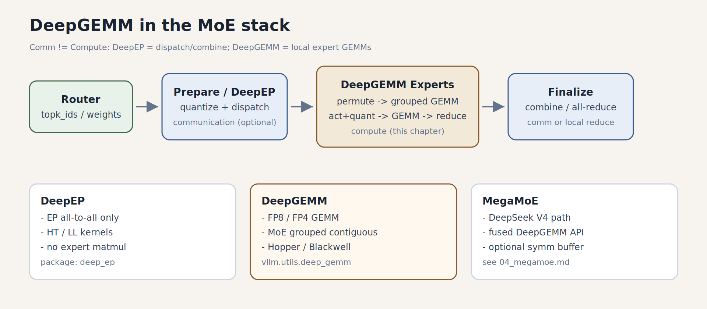
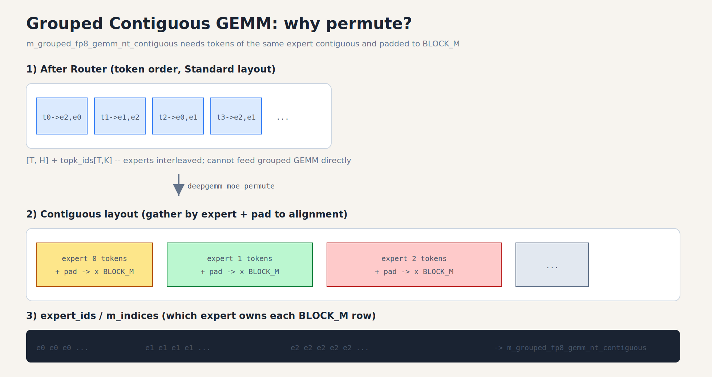
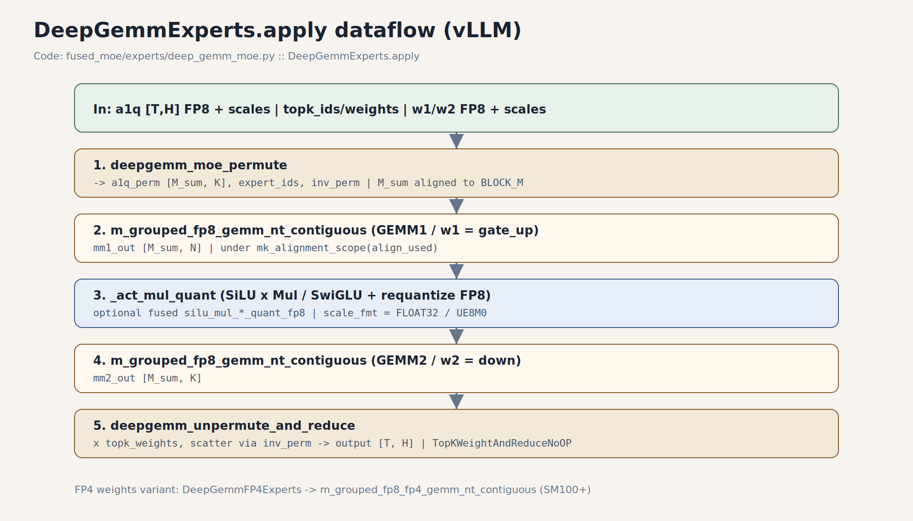
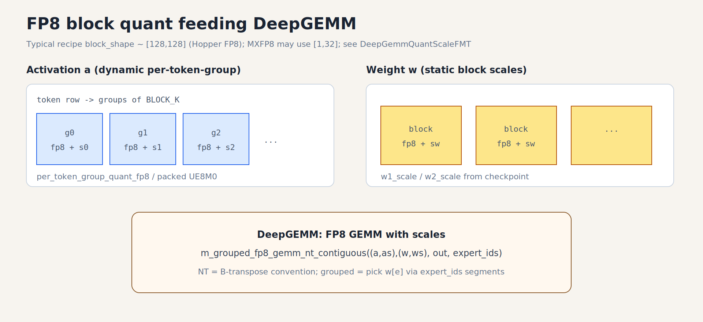

# 02a · DeepGEMM（MoE Expert 计算后端）

> 上一章：[02_modular_kernel_and_moe_kernels.md](02_modular_kernel_and_moe_kernels.md)  
> 相关：[03_deepep.md](03_deepep.md)（通信）· [04_megamoe.md](04_megamoe.md)（V4 特化）  
> 代码主路径：`~/codes/vllm_comm`  
> 配图：矢量稿 `ep_learning/imgs/*.svg`，预览用 PNG 在 `notes/imgs/` 与 `ep_learning/imgs/`

---

## 1. DeepGEMM 是什么

**DeepGEMM**（DeepSeek 开源的高性能 GEMM 库，包名常为 `deep_gemm`）面向 **Hopper / Blackwell**，提供 FP8（及 FP4 等）矩阵乘，以及 **MoE 友好的 grouped contiguous GEMM**。

在 vLLM Modular MoE 里，它扮演 **Experts 计算后端**，不是通信库：

| 库 | 职责 |
|----|------|
| **DeepEP** | EP dispatch / combine（all-to-all） |
| **DeepGEMM** | 本地 Expert：`w1` / act / `w2` 等 GEMM |
| **MegaMoE** | DeepSeek V4 更整条融合的 DeepGEMM 路径（另章） |

下图把三者放进同一条 MoE 流水线：**DeepEP 管通信，DeepGEMM 管本地矩阵乘**。



*图1. DeepGEMM 在 MoE 栈中的位置。中间棕色框是本篇重点。*

vLLM 不直接散落 `import deep_gemm`，而是经兼容层：

```text
vllm/utils/deep_gemm.py          # API 包装、能力探测、scale 格式
vllm/model_executor/layers/fused_moe/
  experts/deep_gemm_moe.py       # DeepGemmExperts / DeepGemmFP4Experts
  deep_gemm_utils.py             # permute / unpermute / M_sum 对齐
```

上游：https://github.com/deepseek-ai/DeepGEMM

### 1.1 GEMM 是什么：先手算一个 `2×3` 乘 `3×2`

GEMM 可以先理解为矩阵乘法：

```text
A.shape = [M, K] = [2, 3]
B.shape = [K, N] = [3, 2]
C = A × B，C.shape = [M, N] = [2, 2]
```

```text
A = [[1, 2, 3],      B = [[1, 2],
     [4, 5, 6]]           [0, 1],
                           [2, 0]]
```

结果：

```text
C[0,0] = 1×1 + 2×0 + 3×2 = 7
C[0,1] = 1×2 + 2×1 + 3×0 = 4
C[1,0] = 4×1 + 5×0 + 6×2 = 16
C[1,1] = 4×2 + 5×1 + 6×0 = 13
```

在 MoE expert GEMM 中：

- `M`：这个 expert 收到的 token/assignment 行数；
- `K`：输入 hidden/intermediate 维度；
- `N`：输出维度；
- `A`：token activation；
- `B`：某个 expert 自己的权重。

不同 expert 的 `K/N` 通常相同，但 `M` 因路由而不同，这正是 grouped GEMM
要解决的问题。

---

## 2. 为什么 MoE 需要「Grouped Contiguous」GEMM

普通 GEMM：一次 `(M,K) × (K,N)`。  
MoE：同一批 token 要乘 **不同 expert 的权重** → 等价于多个小 GEMM。

两种组织方式：

| 方式 | 思路 | DeepGEMM MoE 路径 |
|------|------|-------------------|
| Batched / masked | `[E, T_max, H]`，空槽 mask | DeepEP LL + 部分 batched 后端 |
| **Contiguous grouped** | 按 expert **排成一条连续带**，用 `expert_ids` 标明每段属于谁 | **DeepGemmExperts 主路径** |

DeepGEMM 的核心 API（vLLM 包装名）：

```text
m_grouped_fp8_gemm_nt_contiguous(
    (a_fp8, a_scale),
    (w_fp8, w_scale),
    out,
    expert_ids,   # 每个 BLOCK_M 行对应哪个 expert
)
```

因此必须先 **permute**：把「token 序 + 交错 topk」变成「按 expert 连续 + pad」。流程如下图——上半是 Router 后的交错 token，下半是按 expert 排好并 pad 的 contiguous 带，以及传给 GEMM 的 `expert_ids`。



*图2. Grouped Contiguous 布局：`deepgemm_moe_permute` 把交错 topk 变成按 expert 连续的 `[M_sum, H]`，并生成 `expert_ids`。*

对齐要点（`get_mk_alignment_for_contiguous_layout()`，常见 128）：

- 每个 expert 的 token 数 pad 到 `BLOCK_M` 的倍数  
- `M_sum = Σ round_up(tokens_e, BLOCK_M)`（或最坏情况上界）  
- `N`、`K` 也常要求是 alignment 的倍数，否则 `_valid_deep_gemm` 会 fallback Triton  

相关：`deep_gemm_utils.compute_aligned_M_and_alignment`、`deepgemm_moe_permute`。

### 2.1 三个 experts 的布局手算

假设三个 experts 分别收到 3、1、2 个 token，`BLOCK_M=4`：

```text
原始：
expert 0: [A, D, F]
expert 1: [B]
expert 2: [C, E]

对齐后：
expert 0: [A, D, F, PAD]
expert 1: [B, PAD, PAD, PAD]
expert 2: [C, E, PAD, PAD]
```

```text
M_sum = round_up(3,4) + round_up(1,4) + round_up(2,4)
      = 4 + 4 + 4
      = 12
```

有效 assignment 只有 6，padding 也是 6，效率为 50%。如果 batch 更大、每
expert token 更多，padding 占比通常下降；decode 小 batch 下则可能很高。

`expert_ids` 可以按每个 block 记录：

```text
[0, 1, 2]
```

意思是第 0 个 4-row tile 用 expert 0 权重，第 1 个用 expert 1，第 2 个用
expert 2。真实格式以 API 为准，但心智模型就是“每个 M tile 选择哪套 B”。

---

## 3. `DeepGemmExperts.apply` 逐步对照代码

文件：`fused_moe/experts/deep_gemm_moe.py`

下面这张图对应 `DeepGemmExperts.apply` 的五步；读代码时可按图中编号往下跟。



*图3. `DeepGemmExperts.apply` 端到端数据流（与源码步骤一一对应）。*

### 3.1 前置条件（能否选用 DeepGEMM）

`_valid_deep_gemm` / `is_supported_*` 大致要求：

- 已安装 `deep_gemm`，且 `VLLM_USE_DEEP_GEMM` + 平台支持（Hopper/Blackwell）  
- 权重为 `float8_e4m3fn`（FP8 路径）；张量 contiguous  
- `M/N/K` 对齐；`N > 512`（过小 shape 故意走 Triton 更快）  
- 量化方案：如 `kFp8Static128BlockSym` × `kFp8Dynamic128Sym`；或 SM100 上 MXFP8  

### 3.2 步骤拆解（对照图3）

```text
1. deepgemm_moe_permute(a1q, scales, topk_ids, expert_map, ...)
     → a1q_perm [M_sum, K], expert_ids, inv_perm

2. with mk_alignment_scope(align_used):
     m_grouped_fp8_gemm_nt_contiguous(  # GEMM1 gate_up
         (a1q, a1q_scale), (w1, w1_scale), mm1_out, expert_ids)

3. _act_mul_quant(mm1_out)   # SiLU×Mul / SwiGLU + 再量化 FP8
     → a2q, a2q_scale

4. m_grouped_fp8_gemm_nt_contiguous(  # GEMM2 down
         (a2q, a2q_scale), (w2, w2_scale), mm2_out, expert_ids)

5. deepgemm_unpermute_and_reduce(mm2_out, topk_weights, inv_perm, ...)
     → output [T, H]
```

`finalize_weight_and_reduce_impl()` 返回 **`TopKWeightAndReduceNoOP`**：  
加权归约已在 `deepgemm_unpermute_and_reduce` 内做完，Finalize 侧不要再乘一遍。

`mk_alignment_scope`：把 DeepGEMM 的 `BLOCK_M` 上限钉在本次 workspace 实际用的 `align_used`，避免 cudagraph replay 时 heuristic 选错 expert 段。

### 3.3 FP4 变体

`DeepGemmFP4Experts`：激活仍 FP8 group quant，权重 **MXFP4**，调用  
`m_grouped_fp8_fp4_gemm_nt_contiguous`（需 SM100+）。  
与 MegaMoE 同属「FP8×FP4」家族，但 Modular Experts 路径更通用。

---

## 4. FP8 Block Scale 直觉

DeepGEMM 吃的不是裸 bf16，而是 **FP8 数值 + 分组 scale**。激活侧按 token 动态量化，权重侧用 checkpoint 里的静态 block scale；二者一起传入 grouped GEMM：



*图4. FP8 block 量化示意：`per_token_group_quant_fp8`（激活）+ `w*_scale`（权重）→ `m_grouped_fp8_gemm_nt_contiguous`。*

| 侧 | 典型做法 |
|----|----------|
| Activation | 运行时 `per_token_group_quant_fp8`（group=`BLOCK_K`，如 128） |
| Weight | checkpoint 静态 block scale（`w1_scale` / `w2_scale`） |
| Scale 张量格式 | `DeepGemmQuantScaleFMT`：`FLOAT32` / `FLOAT32_CEIL_UE8M0` / 打包 `UE8M0` |

Blackwell 上常倾向 **UE8M0** 打包 scale；个别模型（如部分 Qwen3.5）可能被 `should_auto_disable_deep_gemm` 关掉以免精度问题。

### 4.1 scale 的最小数值例子

假设某一组原值：

```text
[0.2, -1.0, 3.5, 7.0]
```

为了映射到更窄的 FP8 动态范围，量化器选择一个 scale。用极简整数类比：

```text
q = round(x / scale)
x_approx = q × scale
```

若 `scale=0.5`：

```text
q = [0, -2, 7, 14]
反量化 ≈ [0.0, -1.0, 3.5, 7.0]
```

第一个 `0.2` 被舍入为 0，产生误差。scale 太大，小数值分辨率差；scale 太小，
大数值可能溢出。block scale 让不同数据块各用自己的 scale，在 metadata 开销和
数值精度之间折中。

DeepGEMM kernel 不一定真的先完整反量化成 BF16 再 GEMM；硬件/内核会按相应
格式高效使用量化值和 scale。上面的整数例子只解释数学含义。

---

## 5. 与 Modular / DeepEP / Oracle 的衔接

回顾图1 的分工，整条选型链路是：

```text
Oracle / moe_backend
    └─ 选中 DeepGemmExperts（或 FP4 变体）
PrepareAndFinalize（DeepEP HT/LL / naive / no_dp …）
    └─ 产出 Standard 布局的 a1q（或让 Experts 内再量化）
DeepGemmExperts.apply          ← 图3
    └─ permute → grouped GEMM ×2 → unpermute+reduce
Finalize
    └─ 若 Experts 已 reduce：多为 NoOP；通信侧 combine 另算
```

读代码建议顺序：

1. `utils/deep_gemm.py`：`is_deep_gemm_supported`、`m_grouped_fp8_gemm_nt_contiguous`  
2. `experts/deep_gemm_moe.py`：`apply` 全文（对照图3）  
3. `deep_gemm_utils.py`：`compute_aligned_M_and_alignment`、`deepgemm_moe_permute`（对照图2）  
4. `oracle/fp8.py`（或 mxfp4）：何时选中 DeepGEMM  
5. 单测：`tests/kernels/moe/test_deepep_deepgemm_moe.py`（DeepEP+DeepGEMM 联调）

---

## 6. 和「普通 Triton fused MoE」对比

| | Triton fused MoE | DeepGEMM Experts |
|--|------------------|------------------|
| 硬件 | 更广 | Hopper / Blackwell 为主 |
| 量化 | 多种，灵活 | FP8 block / MXFP8 / FP4 特化 |
| 布局 | align_block_size 类似思路 | **强制 contiguous grouped + BLOCK_M**（图2） |
| 性能 | 通用默认 | 大 shape FP8 上通常更快 |
| Fallback | — | 不对齐 / N≤512 / 无库 → Triton |

---

## 配图索引

| 图 | 文件 | 对应小节 |
|----|------|----------|
| 图1 | [deepgemm_stack.png](../imgs/deepgemm_stack.png) | §1 栈位置 |
| 图2 | [deepgemm_permute_layout.png](../imgs/deepgemm_permute_layout.png) | §2 permute / contiguous |
| 图3 | [deepgemm_apply_pipeline.png](../imgs/deepgemm_apply_pipeline.png) | §3 apply 流水线 |
| 图4 | [deepgemm_fp8_block.png](../imgs/deepgemm_fp8_block.png) | §4 FP8 scale |

矢量原稿（可再编辑）：`ep_learning/imgs/deepgemm_*.svg`

---

## 自检

- [ ] 能区分 DeepEP vs DeepGEMM vs MegaMoE（图1）  
- [ ] 能画出 permute → GEMM1 → act+quant → GEMM2 → unpermute（图3）  
- [ ] 知道 `expert_ids` / `M_sum` / `BLOCK_M` 各自干什么（图2）  
- [ ] 知道为何 `TopKWeightAndReduceNoOP`  
- [ ] 能指出 `vllm.utils.deep_gemm` 与 `deep_gemm_moe.py` 的分工  

---

## 建议动手

1. 在纸上用 T=4, K=2, E_local=3, BLOCK_M=2 手算一个 `M_sum` 上界（对照图2）。  
2. 读 `deepgemm_moe_permute` 的输出张量名，逐步对照图3。  
3. 有 GPU + deep_gemm 时跑 `test_deepep_deepgemm_moe.py` 看数值对齐。
