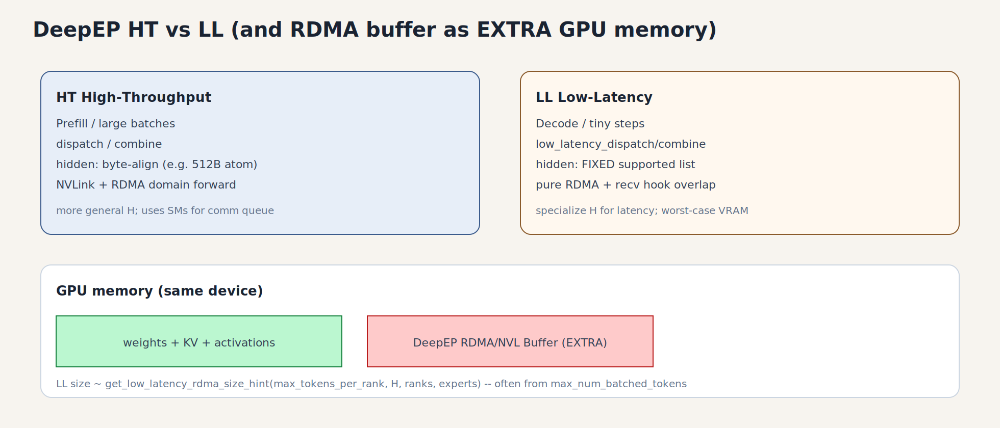

# 03 · DeepEP（High-Throughput / Low-Latency）

> 上一章：[02a_deepgemm.md](02a_deepgemm.md) ← [02_modular_kernel_and_moe_kernels.md](02_modular_kernel_and_moe_kernels.md)  
> 概念铺垫（A2A 原因/载荷/流程）：[01a_moe_all_to_all.md](01a_moe_all_to_all.md)  
> 下一章：[04_megamoe.md](04_megamoe.md)  
> 跨机实战补充：[../vllm_cross_node_expert_parallelism.md](../vllm_cross_node_expert_parallelism.md)  
> RDMA 基础：[../rdma_learning_1.md](../rdma_learning_1.md)

---

## 1. DeepEP 是什么

**DeepEP**（DeepSeek Expert Parallelism 通信库，Python 包名常为 `deep_ep`）为 MoE 提供 **GPU 侧高效的 dispatch / combine**：

- 机内：NVLink / NVSwitch  
- 跨机：RDMA（IB/RoCE），常配合预注册 buffer、NVSHMEM 类对称内存思路  

它 **不是** expert GEMM 本身；GEMM 仍由 Triton / DeepGEMM / MegaMoE 等完成。  
vLLM / SGLang 通过适配层调用 `deep_ep.Buffer.dispatch` / `combine`（及 LL 变体）。

上游项目：https://github.com/deepseek-ai/DeepEP  

本地适配（`vllm_comm`）：

```text
fused_moe/prepare_finalize/deepep_ht.py   # High Throughput
fused_moe/prepare_finalize/deepep_ll.py   # Low Latency
fused_moe/prepare_finalize/deepep_v2.py   # 较新 API 适配
distributed/device_communicators/all2all.py  # Buffer 创建、backend 选择
```

---

## 2. 两条产品线：HT vs LL

| | **HT（High Throughput）** | **LL（Low Latency）** |
|--|---------------------------|------------------------|
| 目标阶段 | Prefill / 大 batch | Decode / 小步延迟 |
| 典型 API | `buffer.dispatch` / `combine` | `low_latency_dispatch` / `low_latency_combine` |
| 布局 | 偏 Standard | 偏 BatchedExperts（按 expert 槽位） |
| Hidden | 有字节对齐要求（如按 512B 原子拷贝取整） | **编译期支持的固定 hidden 列表** |
| Buffer | 跨机才需较大 RDMA；纯机内可为 0 | 常按 `max_tokens_per_rank` 预分配，易 OOM |
| 量化 | 可与外部 quant 配合 | 可在 dispatch 路径做 fp8（块大小常 128） |

vLLM 适配类：

- `DeepEPHTPrepareAndFinalize`  
- `DeepEPLLPrepareAndFinalize`  



*图：左 HT / 右 LL；底部红块是预注册通信池，会挤占 KV/激活可用显存。*

### 2.1 HT：hidden 对齐例子

`deepep_ht.py` 中：`xfer_atom_size = 512`（32×int4）。  
若 `hidden=2880`、`bf16` → 字节数需向上对齐 → hidden 可能被 round 到 `3072`。  
**含义**：通信库按固定原子大小搬数据；模型层要配合 pad/round。

### 2.2 LL：支持的 hidden —— 为什么要「固定列表」？

`DeepEPLLPrepareAndFinalize.SUPPORTED_HIDDEN_SIZES` 类似：

```text
2048, 2560, 3072, 4096, 5120, 6144, 7168, 8192
```

不在列表中则 round up 到最近支持值；超过最大值直接报错。

**是的，这句话说的就是：LL kernel 不为任意 `H` 写通用路径，只为若干常见 hidden 做特化。**

#### 为什么要特化？好处是什么？

通信 kernel 里，每个 token 要搬 `H * sizeof(dtype)` 字节。若 `H` 是**编译期常量**（C++ template / 特化实例）：

| 好处 | 说明 |
|------|------|
| **少分支、可展开** | 拷贝循环、向量化宽度、每 warp 负责的字节数可按 `H` 写死，少 runtime `if` |
| **对齐与指令友好** | 固定 `H` 更容易保证 int4/vector load 对齐，打满 NVLink/RDMA 包 |
| **布局可静态算** | BatchedExperts 槽位、RDMA 槽 stride、`[E, capacity, H]` 偏移在编译期可知 |
| **延迟更稳** | Decode 每步 token 少，延迟占比高；省掉「通用 H」带来的额外指令与同步更值 |

代价（牺牲通用性）：

- 新模型若 `H=3200` 这类不在表里 → pad 到下一个支持值（多搬空气）或直接不支持  
- 库要为每个 `H`（再乘 rank 配置等）维护/编译多套实例 → 二进制变大、支持面变窄  

HT 相对更「通用」：往往只要求 **按原子大小对齐**（如 512B），不必绑死在那几个数上；LL 为极致延迟绑得更死。

和「假通用 alltoall」对比：NCCL 的 `alltoall`/`alltoallv` 对任意 shape 都能跑，但不会为 MoE 的 `H=7168, topk=8` 去手写一条 RDMA+overlap 的特化路径。

---

## 2.5 DeepEP 主要在优化什么？和「普通 all-to-all」差在哪？

### 定位

**对：DeepEP 主要就是给 MoE EP 的 dispatch / combine（语义上的 all-to-all）做的专用通信库。**  
它不做 expert GEMM；只把 token（及 topk 元数据等）在 EP ranks 间高效搬走、再搬回来。

### 「普通 all-to-all」通常指什么

| 普通路径 | 特点 |
|----------|------|
| NCCL `alltoall` / `alltoallv` | 通用集合通信；等长或按 counts 可变长；不感知 MoE |
| AG + RS「冒充」EP | 实现简单，但每卡拿到远多于需要的 token |

它们：**能完成数据交换**，但通常：

- 不内置「按 expert 路由 → 直接打成 expert 友好布局」  
- 跨机不一定走 **GPU 发起的 RDMA（如 IBGDA）+ 预注册对称缓冲** 的极致路径  
- 缺少为 decode 定制的 **发完就退、用 hook 等收完、尽量不长期占 SM** 的 overlap 模型  
- 不会在通信路径里融合 **FP8 dispatch** 等 MoE 常见套路  

### DeepEP 相对做了哪些优化（概念清单）

```text
普通 NCCL A2A          DeepEP（面向 MoE EP）
─────────────          ─────────────────────
通用 shape             感知 topk / expert / MoE 两阶段
CPU/库调度为主         GPU kernel 直接搬 +（LL）GPU 发起 RDMA
一次 collective        dispatch 与 combine 成对 API + handle
不关心布局             可直接产出 Standard 或 BatchedExperts
跨机通用算法           NVLink↔RDMA 域转发（HT，适配非对称带宽）
占 SM 做完整通信       LL：快速 issue 后可退；recv hook 与计算重叠
```

更具体一点：

1. **API 贴合 MoE**  
   `dispatch(x, topk_idx, topk_weights)` / `combine(..., handle)`，而不是先自己算 permute 再调一次裸 `alltoallv`。

2. **机内 NVLink + 跨机 RDMA 分工（尤其 HT）**  
   节点内走 NVLink；跨节点走 RDMA；并针对「NVLink 域 ↔ RDMA 域」的转发做吞吐向优化（DeepSeek-V3 类 group-limited 场景）。

3. **预注册 Buffer / 对称内存**  
   减少每步注册、分配；LL 按 worst-case token 预留，换延迟。

4. **LL：纯 RDMA + 低延迟 overlap**  
   - 面向 decode 小 batch  
   - IBGDA 等：GPU 直接发 RDMA  
   - `return_recv_hook`：通信可与 expert 计算重叠，且设计目标是 **数据搬运阶段尽量不长期占满 SM**（issue 很快结束）  
   - 固定 hidden、FP8 dispatch / BF16 combine 等生产向特化  

5. **HT：高吞吐 + 可控占 SM**  
   Prefill/训练大流量；可用部分 SM 做通信队列与 NVLink forward，换带宽与稳定性。

### 一张对照表

| | **普通 NCCL alltoall(v)** | **DeepEP** |
|--|---------------------------|------------|
| 服务对象 | 任意分布式张量交换 | **MoE EP dispatch/combine** |
| 路由感知 | 无（你自己先排好） | **内置 topk → 目的 rank/expert** |
| 跨机路径 | NCCL 通用算法 | **RDMA 专用 +（HT）NVLink 转发** |
| Decode 延迟 | 通常不是第一优化目标 | **LL 内核专攻** |
| 与计算重叠 | 靠 stream，较粗 | **LL hook 等细粒度设计** |
| 通用性 | 高 | 较低（hidden/rank 配置有约束） |
| 显存 | 相对灵活 | LL 预分配可很大（OOM 风险） |

口播：

> DeepEP ≈「给 MoE 寄信」的专用邮政系统；NCCL alltoall ≈ 通用快递。都能把包裹送到，但 DeepEP 认专家地址、走 NVLink/RDMA 专线，并给 decode 单独开了快线（LL）。

---

## 3. Buffer 生命周期（概念）

```text
初始化 EP group / CUDA device
        │
        ▼
deep_ep.Buffer(
  group,
  num_nvl_bytes=...,
  num_rdma_bytes=...,   # 跨机或 LL 场景
  low_latency_mode=...,
  allow_nvlink_for_low_latency_mode=...,
  allow_mnnvl=...,      # Multi-Node NVLink
)
        │
        ▼
每层 MoE:
  dispatch(x, topk_idx, topk_weights, ...) → (recv_x, recv_meta, handle, ...)
  local experts(recv_x, ...)
  combine(expert_out, handle, ...) → y
```

要点：

- **handle** 必须从同一次 dispatch 传到 combine；DBO 下按 ubatch 存多份。  
- RDMA 内存通常 **提前注册**；大小由 hint API 估算（LL 尤其敏感）。  
- 纯机内 HT 可将 `num_rdma_bytes=0`，只走 NVLink 路径。

### OOM 直觉（来自跨机笔记）

LL 的 RDMA 占用往往由 **`max_num_batched_tokens` / per-rank dispatch 上限** 驱动，**几乎不随 EP world size 线性减小**。  
加机器 ≠ 缓解 DeepEP LL OOM；应降 batch、设 `VLLM_NUM_MAX_DISPATCHED_TOKENS_PER_RANK` 等。

### 3.1 RDMA Buffer 与显存：FAQ

**Q1：是不是在 GPU 上申请一块显存，给 RDMA GDR 写？**

**对。** DeepEP LL 创建 `Buffer` 时按 `num_rdma_bytes` 在 **GPU 显存**里划一块（常经 NVSHMEM/对称堆一类路径），并做 **RDMA 注册**。对端 NIC 可 **GPU Direct RDMA** 直接写入这块显存，少经主机内存拷贝。

**Q2：和模型里的 hidden state 是同一块吗？**

**不是，是额外的通信工作区。**

```text
模型侧 activation / KV / 权重     ← 引擎本来就要用的显存
        ＋
DeepEP Buffer（NVL + RDMA 区）   ← 额外预分配，dispatch/combine 的收发槽
```

dispatch 会把 token（及元数据）**搬进/搬出**这套 buffer（或返回指向 buffer 的 view；DeepEP 文档也提醒 LL 结果会复用有限个 buffer，不能长期挂着多个未消费结果）。  
**不是**「远程直接写进你当前那一层的 `hidden_states` Parameter/Tensor 原址」这种零额外池（即便有 zero-copy 优化，也仍要先有这块已注册池）。

**Q3：会不会挤占引擎可用显存？**

**会。** Buffer 在初始化 `deep_ep.Buffer(...)` 时就占上，profile KV 可用空间时已经少了一块。  
LL 按 **worst-case token 上限** 预留，所以可能非常大（笔记里实测约数百 GB 量级的 size hint → 直接分配失败/OOM），和「这一步实际只有几个 decode token」无关。

**Q4：写入数据超过 buffer 会不会再 OOM？**

要分两种「OOM」：

| 时机 | 原因 | 典型表现 |
|------|------|----------|
| **创建 Buffer 时** | `get_low_latency_rdma_size_hint(...)` 算出来的 `num_rdma_bytes` 太大 | 初始化/第一次 get_handle 就炸（笔记里的 558GB 陷阱） |
| **运行中某步 token 过多** | 超过创建时约定的 `num_max_dispatch_tokens_per_rank` | 一般是 **assert / 非法使用**，**不会**再动态把 RDMA 池扩到更大；LL 设计就是固定容量 |

也就是说：LL **先按上限把坑挖够**；运行中超上限通常不是「再申请一块导致二次 OOM」，而是配置/调度不应让单 rank dispatch 超过该上限。

**Q5：分配大小怎么定？**

vLLM 侧（`DeepEPLLAll2AllManager._make_all2all_kwargs`）：

```text
num_rdma_bytes = deep_ep.Buffer.get_low_latency_rdma_size_hint(
    num_max_dispatch_tokens_per_rank=...,  # 关键：每 rank 最多 dispatch 多少 token
    hidden=token_hidden_size,
    num_ranks=num_ep_ranks,
    num_experts=num_global_experts,
)
# 另有 num_nvl_bytes ≈ VLLM_DEEPEP_BUFFER_SIZE_MB（NVLink 侧）
```

`num_max_dispatch_tokens_per_rank` 从哪来（不同分支略有差异，思想一致）：

1. 优先环境变量 `VLLM_NUM_MAX_DISPATCHED_TOKENS_PER_RANK`（若设置）  
2. 否则由 `max_num_batched_tokens`（或相关 seq 配置）推导  
3. 常再 **向上取整到 2 的幂**（DeepEP/对齐需要）  

直觉公式量级（非精确实现）：

```text
RDMA 池 ∝  f( max_tokens_per_rank, hidden, num_ranks, num_experts, 双缓冲/元数据开销 )
```

因此：**降 `max_num_batched_tokens` 或显式设较小的 `VLLM_NUM_MAX_DISPATCHED_TOKENS_PER_RANK`** 才能缩小池子；**加 EP/加节点几乎不缩小**（hint 对 ranks 不敏感或很弱，笔记实测 ranks=2/4 同为 ~558GB）。

---

## 4. 与其它 All2All 后端对比

| Backend | 机制 | 冗余 | 适用 |
|---------|------|------|------|
| `allgather_reducescatter` | NCCL AG + RS | 高 | 默认/简单 |
| `naive` | broadcast 类 | 更高 | 调试 |
| `pplx` | NVSHMEM / P2P A2A | 低 | 需 pplx_kernels |
| `deepep_high_throughput` | DeepEP HT | 低 | Prefill |
| `deepep_low_latency` | DeepEP LL | 低 | Decode |

选择逻辑集中在 `device_communicators/all2all.py` 与 `cuda_communicator.py`；环境变量 `VLLM_ALL2ALL_BACKEND`。

---

## 5. vLLM 适配层该怎么读

### 5.1 HT（`deepep_ht.py`）

阅读顺序：

1. `__init__`：保存 `Buffer`、dispatcher 数、DBO handle 槽  
2. `_get_dispatch_config`：rank 数需落在 DeepEP 支持的 config 集合（如 2,4,8,…,160）  
3. `prepare` / `dispatch` 路径：量化 → `buffer.dispatch` → 整理 `ExpertTokensMetadata`  
4. `finalize`：`buffer.combine` + TopKWeightAndReduce 策略  
5. DBO：`dbo_switch_to_comm/compute`、ROCm 上可能强制 sync（workspace 复用）

### 5.2 LL（`deepep_ll.py`）

阅读顺序：

1. `SUPPORTED_HIDDEN_SIZES`、`maybe_roundup_layer_hidden_size`  
2. `use_fp8_dispatch` 与 `DEEPEP_QUANT_BLOCK_SIZE=128`  
3. `max_tokens_per_rank` 如何限制 capacity  
4. 与 EPLB 相关的 `global_to_physical` / `physical_to_global`（若构造函数传入）  
5. `dequant_fp8`：专家侧若需要非 fp8 计算时的回退路径

### 5.3 测试入口

```text
vllm_comm/tests/kernels/moe/test_deepep_moe.py
vllm_comm/tests/kernels/moe/test_deepep_deepgemm_moe.py
vllm_comm/tests/kernels/moe/test_deepep_v2_moe.py
sglang/test/manual/ep/test_deepep_*.py
```

有 GPU + 已装 `deep_ep` 时，优先跑单测建立「数值正确」基线，再上多节点。

---

## 6. 建议下沉到 DeepEP 源码的主题（第二阶段）

在适配层跑通后，再读 DeepEP 仓库（若本机有 clone，可链到笔记）：

1. **Intranode**：warp/SM 如何打包 token、NVLink 拷贝粒度  
2. **Internode**：RDMA write 路径、credit / 通知、与 CPU 同步点  
3. **LL 特化**：固定 hidden 的 layout、对称堆、polling vs event  
4. **与量化融合**：dispatch 时 inplace fp8 的 scale 布局  

不必一开始就改 CUDA；先能画出「一次 dispatch 的数据从哪块显存写到哪块」。

---

## 7. SGLang 对照

`sglang/.../token_dispatcher/deepep.py`：同样包一层 `deep_ep.Buffer`，接口命名偏 dispatcher。  
Benchmark：`sglang/benchmark/kernels/deepep/`（含 tuning 脚本）。

对比同一 DeepEP 版本在 vLLM vs SGLang 的：

- 何时创建 Buffer  
- HT/LL 切换策略  
- 与 CUDA Graph / overlap 的交互  

能快速区分「库行为」与「框架策略」。

---

## 自检

- [ ] 能一句话说清 DeepEP 与 DeepGEMM / MegaMoE 的分工  
- [ ] 能列出 HT vs LL 至少 4 条差异  
- [ ] 能解释 LL 固定 hidden 列表是为了什么、牺牲了什么  
- [ ] 能对比 DeepEP 与普通 NCCL alltoall 的至少 3 点不同  
- [ ] 知道 LL OOM 主要跟什么配置相关  
- [ ] 能在 `vllm_comm` 里指出 HT/LL 适配类与 all2all 创建 Buffer 的位置  

---

## 环境变量速记（常见）

以实际 `envs.py` 为准，学习时重点盯：

- `VLLM_ALL2ALL_BACKEND`  
- `VLLM_DEEPEP_BUFFER_SIZE_MB`  
- `VLLM_DEEPEP_HIGH_THROUGHPUT_FORCE_INTRA_NODE`  
- `VLLM_DEEPEP_LOW_LATENCY_USE_MNNVL`  
- `VLLM_NUM_MAX_DISPATCHED_TOKENS_PER_RANK`  
- 以及与 DBO / MoE 相关的开关  

把「每个变量影响 HT 还是 LL、影响显存还是算法」记在实践清单里。
