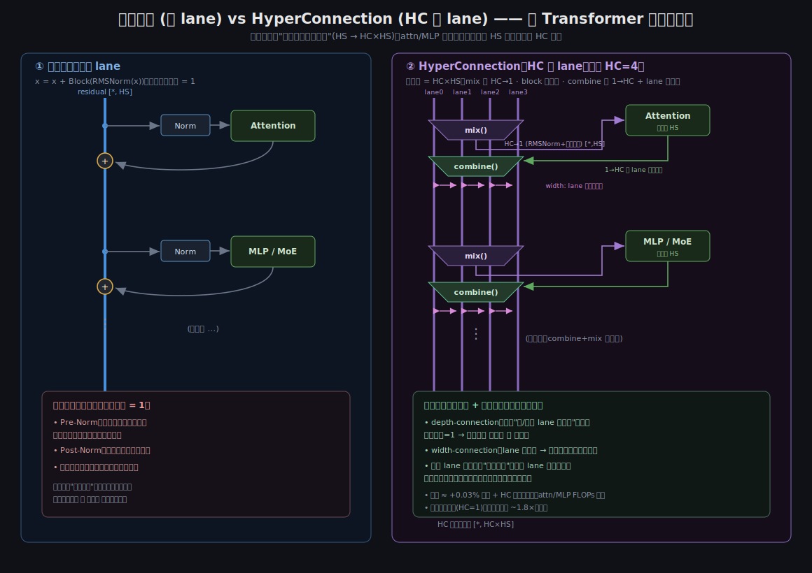
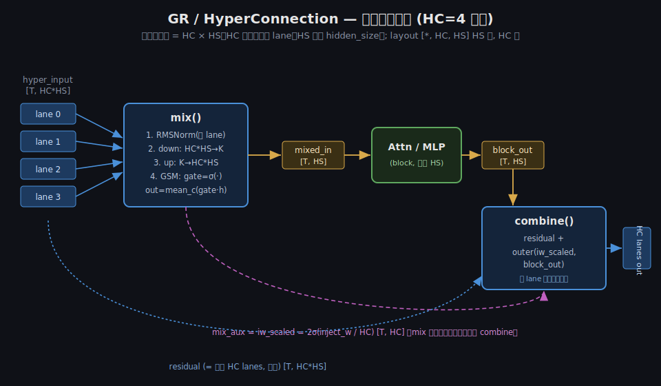
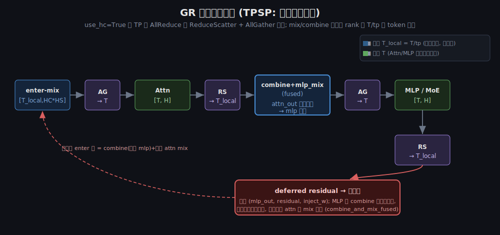
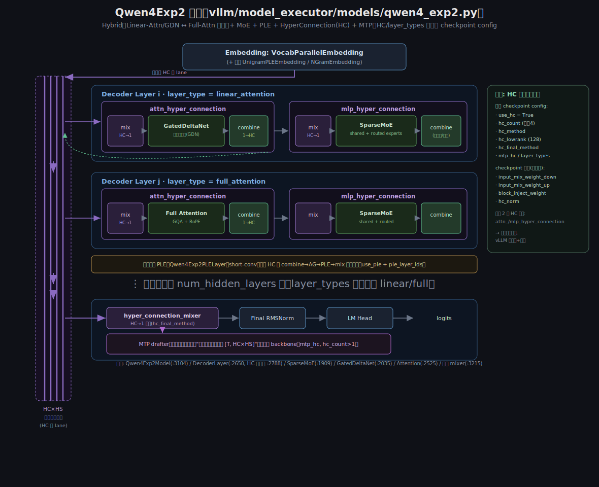
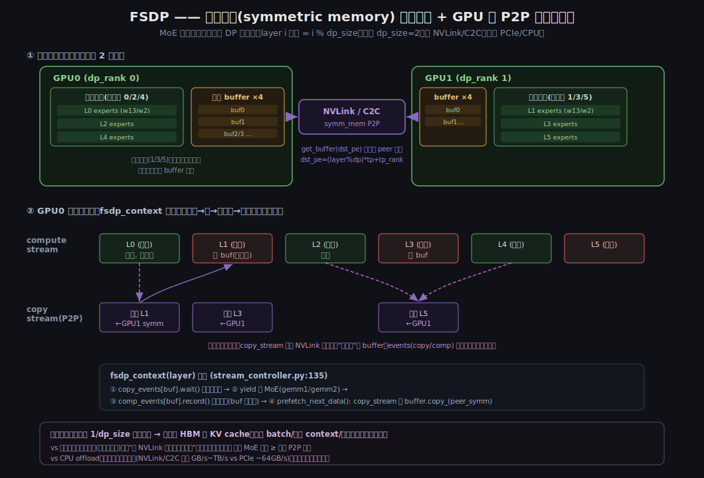

# vLLM 中的 GR 与 "FSDP" —— 代码解读

> 代码位置：`ecs:~/codes/vllm`（分支 `support_p_tp_lt_d_tp`）。
> 本文对照实际源码梳理两套机制，并修正若干直觉上的偏差。

先给结论（对你原有理解的校正）：

| 你的理解 | 实际情况 |
|---|---|
| **GR ≈ hyper connection，计算时扩充通道数** | ✅ 正确。GR = Gated-Residual = HyperConnection，把单条残差流扩成 **HC 条并行残差 lane**（宽度 HC×HS）。 |
| **FSDP = MoE 权重按层分到两张卡，算这层时从另一张卡 P2P 预取，走 GPU 间互传不走 PCIe** | ✅ 正确。用 **PyTorch 对称内存(symmetric memory)** 把 MoE 专家权重按层分给 DP 组各 GPU（layer i 属主 = `i % dp_size`），算到非属主层时从属主 peer GPU 经 NVLink/C2C **P2P 读取** + 独立 copy stream 提前预取、双缓冲掩盖。**不是 CPU offload、不走 PCIe。** |

---

## 一、GR / HyperConnection（Gated Residual）

**代码**：`vllm/model_executor/layers/hyperconnection.py`，模型使用方 `vllm/model_executor/models/qwen4_exp2.py`。
**论文**：HyperConnections (arXiv 2409.19606)。

### 1.1 核心思想

普通 Transformer 只有一条残差流 `x = x + block(norm(x))`。HyperConnection 把残差扩成 **HC 条并行 lane**：隐状态形状变为 `[*, HC*HS]`（HC 外、HS 内，即 checkpoint-native layout）。每个 block（attn / mlp）前后各插一次可学习的**混合 / 注入**：

> **注意"扩的是什么"**：被加宽的是**层间的残差高速公路**（HS → HC×HS，持续存在）；**attn/MLP 本体仍在单通道 HS 上算**——`mix()` 进 block 前把 HC 条塌成 1 条，`combine()` 出 block 后再写回 HC 条。所以主体 FLOPs 不因 HC 变贵，额外开销只有 mix/combine 的低秩 GEMM + 门控；代价是层间激活大 HC 倍。下图对比单 lane 与 HC 多 lane 在 Transformer 层上的结构：



- `mix()`：把 HC 条 lane 融合成**一条** `[T, HS]` 喂给 block；
- `combine()`：把 block 输出 `[T, HS]` 按**每条 lane 各自的门控**注入回 HC 条 lane。

两种实现，注册在文件末尾 `HYPERCONNECTION_CLASS_DICT`：
- `hyperconnection_average`（`HyperConnectionBase`）：mix=对 HC 取平均，combine=广播相加（无参数，参考实现）。
- `gated_residual_simple`（`GatedResidualSimple`）：**可学习低秩门控**，即实际用的 GR。



### 1.2 mix()（`hyperconnection.py:832`）

输入 `hyper_input [T, HC*HS]`，输出 `(mixed_input [T,HS], residual=hyper_input, mix_aux)`：

1. **RMSNorm**（`Qwen4Exp2RMSNorm`，可选 `hc_per_branch_norm` 分组按 lane 归一）；
2. **down** 投影 `HC*HS → K`（`hc_lowrank`，默认 16）；
3. **up** 投影 `K → HC*HS`，view 成 `[HC, HS, K]`；
4. **GSM**（gemm_sigmoid_mul_mean，`_gsm` @ `:594`）：
   ```
   gate[c,h] = sigmoid( Σ_k activation[k] · W_up[c,h,k] )
   out[h]    = mean_c( gate[c,h] · hyper_normed[c,h] )     # 对 HC 求门控加权平均
   ```
5. 同时算出 `mix_aux = iw_scaled = 2σ(inject_w / HC)  [T, HC]`（来自 `block_inject_weight: HC*HS→HC`），**留给配对的 combine 用**。

### 1.3 combine()（`hyperconnection.py:1175`）

```
combine(block_out[T,HS], residual[T,HC*HS], mix_aux):
    R = residual.view(T, HC, HS)
    injection[c,h] = mix_aux[c] · block_out[h]        # 每条 lane 独立门控
    return (R + injection).flatten()                   # [T, HC*HS]
```
即：block 输出被以**每条 lane 各自的注入门控**加回该 lane。

### 1.4 融合与后端（`VLLM_GATED_RESIDUAL_BACKEND`）

- `FLASH_GR`（默认）：用 `flash_gr` 的融合 CUDA/Triton kernel。`hc_count ∈ {2,4}` 时 GSM 走外部 CUDA kernel；其他值（如 MTP 的 5）回退 `torch.compile` 参考实现。
- `BASELINE`：纯 torch 参考，顺序执行，便于对拍。

关键融合 `combine_and_mix_fused()`（`:1220`）：把**上一个 op 的 combine** 和**下一个 op 的 mix（含 RMSNorm）**融成一步——用于 attn→mlp、以及跨层 mlp(上层)→attn(本层)。另有 FP8 路径（rowwise / mxfp8，见文件顶部注释）。

### 1.5 在解码层里的编排（`qwen4_exp2.py:2844+`）



`use_hc=True` 时，TP 的 **AllReduce 被 ReduceScatter+AllGather 替代**（TPSP，`VLLM_GATED_RESIDUAL_TPSP`，默认开）。一层的流水：

```
enter-mix(T_local) → AG(→T) → Attn(T) → RS(→T_local)
   → combine+mlp_mix 融合(T_local) → AG(→T) → MLP/MoE(T) → RS(→T_local) → defer
```
- **残差常驻本地**（`[T_local, HC*HS]`，按 token 切分，不通信）；只有喂进 attn/mlp 前才 AG 成全局 T，算完 RS 回本地。
- **deferred residual**：MLP 的 combine **不在本层做**，返回 `(mlp_out, residual, inject_w)`，推迟到**下一层起始**与下一层 attn 的 mix 融合（`combine_and_mix_fused`）——省一次 kernel launch / 通信对齐。
- **PLE 特例**：PLE 的 short-conv 需要整条序列连续，所以该层拆成显式 `combine → AG → PLE → mix`，不走融合。

### 1.6 论文原理：HyperConnections（arXiv 2409.19606）

vLLM 里的 GR 就是这篇论文的工程实现。下面按 motivation / insight / solution 提炼，并对应到代码。

#### Motivation —— 残差连接的"跷跷板"

标准残差连接把"层输出与输入之间的连接强度**预先写死为 1**"，于是两种归一化各顾一头、按下葫芦浮起瓢：
- **Pre-Norm**（块前归一）：梯度不消失，但深层 **表示坍缩**（representation collapse）——深层隐藏特征高度相似，等于白堆层。
- **Post-Norm**（块后归一）：缓解坍缩，却**重新引入梯度消失**。

论文把这对矛盾称作 **seesaw（跷跷板）**：梯度消失 ↔ 表示坍缩，二选一。根因是残差把层间连接强度固定死了。

#### Insight —— 把残差"泛化"成可学习的连接矩阵，并加宽

核心思想：不再只有一条残差流，而是把隐状态**扩展成 n 份并行副本**（expansion rate n），组成 hyper hidden matrix `H ∈ ℝ^(n×d)`。在此之上引入两类可调连接：
- **Depth-connections（深度连接）**：广义残差——给"每层输入↔输出"之间的连接**赋可学习权重**（不再固定为 1）。
- **Width-connections（宽度连接）**：同一层内 **n 条流之间互相交换信息**。

两种实现：
- **SHC（Static）**：连接权重是可学习**标量**（与输入无关）。
- **DHC（Dynamic）**：连接权重**由输入预测**（input-dependent，动态）。论文实验里 DHC 更强。

关键结论：必须 **n>1** 才有效；n=1 时跷跷板依旧、无提升；实践最优约 **n=4**。

#### Solution —— (n+1)×(n+1) 的 hyper-connection 矩阵

把一层的"读入 + 写回"统一成一个矩阵 `HC`：

```
        ┌  0     B  ┐
  HC =  │           │        层输出:  Ĥ = Bᵀ · T(Aₘᵀ H)  +  Aᵣᵀ H
        └  Aₘ    Aᵣ ┘
```
- **Aₘ**（读入 / depth-in）：把 n 条流加权汇成**一条**层输入 `h₀ = Aₘᵀ H` → 喂给 attn/MLP（记作 T(·)）。
- **B**（写回 / depth-out）：把层输出按 depth 权重 β₁…βₙ **注入回 n 条流**。
- **Aᵣ**（width）：n 条流之间的横向重排/混合 `H' = Aᵣᵀ H`。
- **初始化**让 HC 起点等价于 Pre-Norm（DHC 动态权重初始化为 0；普通残差/Pre-Norm 就是特例矩阵 `[[0,1],[1,1]]`），保证"至少不比 Pre-Norm 差"再学得更好。
- **几乎零开销**：如 OLMo-1B-DHC×4 仅 +0.033% 参数、+0.2% FLOPs，复杂度 `O(d·n·(n+1))` 相对 attention/FFN 可忽略。
- 论文还指出 HC 能表达 **Sequential-Parallel Duality**：特定矩阵可退化成串行残差或并行 transformer block，学出来的连接常呈 "Λ 形"（混合 Pre/Post-Norm 风格）。

**对应到 vLLM 代码**（`hyperconnection.py`）：`hc_count` = 论文的 **n**；隐状态 `[*, HC*HS]` = 展开的 n 条流；`mix()` = **Aₘ 读入**（RMSNorm + 低秩门控 GSM 把 n 流汇成 1）；`combine()` = **B 写回 + Aᵣ 宽度混合**（把 block 输出按每流门控 `iw_scaled` 注入回 n 流）；`HyperConnectionBase`(average) ≈ 最简 **SHC**，`GatedResidualSimple`（低秩、输入相关门控）≈ **DHC**。

#### Results（论文）

- **MoE（OLMoE-1B-7B-DHC×4）**：收敛快 **1.8×**，训练 loss 更低，ARC-Challenge ~+6 分、MMLU-Var +1.2；训练更稳（无 loss spike）。
- **稠密 7B（OLMo-7B-DHC×4）**：下游平均 71.0 vs 70.1。
- **视觉**：ViT-L/16-DHC×2 达 79.94% vs 77.25%（+2.69%）；DiT-XL/2-SHC×2 追平参数多 50% 的 DiT。
- 消融：n>1 才提升，n≈4 最佳，DHC ≥ SHC。

> 一句话：HyperConnections = **把"1 条固定残差"换成"n 条可学习加权 + 横向混合的残差高速公路"**，用极小开销同时缓解梯度消失与表示坍缩，并加速收敛。

### 1.7 在 qwen4 modeling 里的验证 + 整体架构

**HC 是训练时就带的架构，不是推理期临时加的**。证据（`qwen4_exp2.py`）：
- `Qwen4Exp2DecoderLayer.__init__`（`:2788`）从 **HF config（即 checkpoint 的 config.json）** 读 `use_hc / hc_count(默认4) / hc_method / hc_lowrank(128) / mtp_hc / hc_per_branch_norm`，据此给**每层**建两个 HC 模块 `attn_hyper_connection`、`mlp_hyper_connection`（`:2809/2814`）。
- HC 内的 `input_mix_weight_down / input_mix_weight_up / block_inject_weight / hc_norm`（hyperconnection.py 的 nn.Linear）是**从 checkpoint 加载的可学习权重**（有专门 `_hc_source_weight_loader`）→ 端到端预训练出来的；vLLM 只是加载+执行。
- 模型级还有末层收束 `hyper_connection_mixer`（`:3215`，`hc_final_method`）和 MTP 多流输出（`:3197`）。

整体是 **hybrid MoE**：`config.layer_types` 决定每层是 `linear_attention`（`Qwen4Exp2GatedDeltaNet`，GDN 线性注意力）还是 `full_attention`（`Qwen4Exp2Attention`，GQA+RoPE）；MLP 为 `Qwen4Exp2SparseMoeBlock`（shared + routed experts）；部分层含 PLE。结构见下图：



---

## 二、FSDP —— GPU 间对称内存(symmetric memory)按层分片 + P2P 双缓冲预取

**代码**：`vllm/distributed/fsdp/stream_controller.py`、接入点 `vllm/model_executor/models/qwen3_next.py`（`fsdp_moe`）、`qwen3_5.py`；开关 `parallel_config.enable_fsdp`（`config/parallel.py` + `engine/arg_utils.py`）。
**分支**：`origin/dev/fsdp_v2`（commit `56745fd336 support fsdp`），不在当前工作树。



### 2.1 它到底是什么（更正）

不是 CPU offload、不走 PCIe。而是：**把 MoE 专家权重按"层"分给 DP 组里的各张 GPU**——一份权重摊到 `dp_size` 张卡上，每卡只常驻 `1/dp_size` 的层。算到"不属于自己"的层时，通过 **PyTorch 对称内存(`torch.distributed._symmetric_memory`)** 从**属主 peer GPU 直接 P2P 读取**该层权重（NVLink/C2C），并用独立 copy stream **提前几层预取**、双缓冲掩盖传输。本质是**用 NVLink 带宽换显存容量**（省下的 HBM 给 KV cache / 更大模型）。

### 2.2 分片对象与维度

- **对象**：MoE 专家两块大权重，各一个 controller：`"gemm1"`(w13) 与 `"gemm2"`(w2)（`qwen3_next.py:445` `fsdp_moe`）。MoE forward 被包成自定义算子 `torch.ops.vllm.fsdp_moe`（`:246`）。
- **维度**：按 **DP rank × 层**。layer `i` 的属主 = `i % dp_size`（`is_local_data`/`need_create_weight`，`stream_controller.py:98,195`）。**TP 分片保持**（读 peer 时 `dst_pe = (layer%dp_size)*tp_size + tp_rank`，`:92`）。超出 `fsdp_layer_num` 的层与非 MoE 权重仍各卡本地保留（复制）。

### 2.3 存储：对称内存 vs 轮转 buffer（`register_weight` `:198`）

- **属主层**：`symm_mem.empty(...)` + `symm_mem.rendezvous(group)` 把该层权重放进**对称内存**并拿到 handle → 组内其它 GPU 可直接读这块显存（`_convert_to_symm_mem` `:165`）。
- **非属主层**：不分配整份权重，只建 `num_buffer` 个**轮转 buffer**（`create_buffer` `:128`），算到时临时把远端权重拷进来复用。

### 2.4 双缓冲 P2P 预取（`fsdp_context` `:135` / `prefetch_next_data` `:105`）

每层 MoE 计算被 `fsdp_context(layer_idx)` 包住（属主层/ dummy step 直接跳过）：
1. `copy_events[buf].wait(current_stream)` —— 等"本层权重已拷到本地 buffer"；
2. `yield` —— 跑 MoE GEMM（gemm1/gemm2）；
3. `comp_events[buf].record()` —— 标记本层算完（buffer 可被覆盖）；
4. `prefetch_next_data()` —— 在**独立 `copy_stream`** 上：`comp_events[buf].wait()` → `buffer.copy_(peer_tensor)`，其中 `peer_tensor = hdl.get_buffer(dst_pe,...)` 是**属主 peer GPU 对称内存里的权重**（`get_dst_tensor` `:89`）→ `copy_events[buf].record()`。

- `num_buffer`（`get_stream_controller` 建的是 **4**，`:161`）个 buffer 轮转；`prefetch_dict`（`update_num_layer` `:58`）预先排好"每个 buffer 桶里该预取哪个后续层"。
- 两条流靠 `copy_events`/`comp_events` 串接：**算第 i 层专家时，copy_stream 正通过 NVLink 把后面某层的专家权重预取进另一个 buffer**。
- commit `0b758b41c5` 还把 NCCL 与 P2P memcpy 改为**顺序执行**以避免争用；`a0afd4fe0f` 移除了 nvshmem4py，直接用 torch 对称内存。

### 2.5 为什么用它（对比"全量进显存" / CPU offload）

- **省显存 → 换吞吐**：每卡只存 `1/dp_size` 的专家权重 + 几个 buffer；省下的 HBM 给 KV cache → 更大 batch / 更长 context / 更高吞吐，或塞下更大模型 / 更多专家。
- **双缓冲的价值**：把 NVLink 取权重延迟藏到 MoE 计算后面，使"省显存"接近**零速度损失**（前提：单层 MoE 计算时间 ≥ 单层 P2P 传输时间）。没有它就得每层 stall。
- **vs CPU offload**：带宽差一个数量级——NVLink/C2C 数百 GB/s~TB/s vs PCIe ~64GB/s，更易掩盖、延迟更低。
- **代价 / net-win 场景**：纯算力上仍不如全量进显存（有跨卡流量，且所有 DP rank 同时互取彼此的层会占 NVLink）；小 batch / decode（单层计算短）可能盖不住 → 掉延迟。**划算场景**：HBM 是瓶颈（要更多 KV cache / 更大模型）且 NVLink 带宽充足（如 NVL/GB200 C2C）。

---

## 三、两者关系

- **GR** 解决**质量/表达力**：加宽残差通道（HC lanes）+ 可学习门控混合，几乎不增加 attn/mlp 主体计算（block 仍在单流 HS 上跑），主要开销在 mix/combine 的低秩 GEMM 和额外通信（TPSP 已优化成 RS+AG）。
- **FSDP** 解决**显存容量**：把 MoE 专家权重按层分到 DP 组各 GPU，算时从 peer GPU 用对称内存 P2P 预取，用计算掩盖 NVLink 传输。
- 两者正交，可同时开：都作用在 hybrid MoE 模型（qwen3-next / qwen3.5 / qwen4）的解码层上。

---

## 四、Q&A

### Q1. FSDP 的双缓冲预取相比"把全部权重都加载到显存"，提升了什么性能？

**它不提速，提的是"装得下 / 省显存"，是容量手段，不是加速手段。**

- 和"全量进显存"比：全量进显存在纯算力上**严格最优**（零跨卡传输）。FSDP 无论怎么双缓冲，best case 只是把 NVLink 传输**完全藏住**、做到和全量进显存**打平**，不可能更快。
- 双缓冲真正的价值：如果不预取，每层都要 stall 等远端权重到位；双缓冲用独立 copy stream **提前几层**经 NVLink 取权重，与当前层 MoE 计算重叠，使"省显存"接近**零速度损失**（前提：单层 MoE 计算时间 ≥ 单层 P2P 传输时间）。
- 省显存换来的收益：腾出的 HBM 给 **KV cache** → 更大 batch / 更长 context / 更高吞吐；或塞下更大模型 / 更多专家。
- 能否掩盖看场景：**prefill / 大 batch** 每层计算重，容易盖住；**decode / 小 batch** 每层计算短，且所有 DP rank 同时互取会占 NVLink，可能盖不住 → 掉延迟。**划算场景** = HBM 是瓶颈 + NVLink 带宽充足（NVL/GB200 C2C）。

### Q2. 既然开了轮转 buffer，buffer 是只开"一层 MoE 权重"的大小吗？否则显存不是没省吗？

**是的**：buffer 大小 = **单层、单个 gemm** 的权重大小；每个 controller 只开 `num_buffer`(=4) 个，被**所有非属主层轮流复用**，不是每个非属主层各开一份。所以显存确实减少。

- `create_buffer(shape,...)` 里 `shape` = 单层单 gemm 权重，循环 `num_buffer` 次建 4 个（`stream_controller.py:128`）；非属主层 `register_weight` 直接 `return get_buffer(idx)` **复用**、不新分配（`:207`）。两个 controller（gemm1=w13 / gemm2=w2）各 4 个。
- 任意时刻常驻的"远端层权重"**最多 num_buffer(4) 层**，与总层数 L 无关。

**内存账（每卡，单个 gemm，单层权重 = W，共 L 层）：**

```
全量进显存:  L · W
FSDP:       属主层 (L/dp_size)·W  +  buffer  num_buffer·W
          = (L/dp_size + num_buffer) · W        # buffer 项是常数, 不随 L 增长
```

具体数（48 个 MoE 层，2 个 gemm，num_buffer=4）：

| 配置 | 每卡专家显存 | vs 全量 |
|---|---|---|
| 全量进显存 | 48×2·W = 96W | — |
| FSDP dp=2 | (24+4)×2·W = 56W | 省 ~42% |
| FSDP dp=4 | (12+4)×2·W = 32W | 省 ~67% |

权重"真身"只存在**属主卡的对称内存**，整个 DP 组合起来才是一份完整权重（每卡存 1/dp_size）；非属主层只在要算的前几层预取进这 4 个 buffer、算完即被覆盖。buffer 越多 pipeline 越深、越易掩盖，但常驻显存也多几层——默认 4 是折中。

### Q3. 和 CPU offload（把权重放主机内存）有什么区别？

同样是"用带宽换显存 + 双缓冲预取"的思路，但：

| | FSDP（本文） | CPU-Offload |
|---|---|---|
| 权重放哪 | 别的 **GPU** 显存（对称内存分片） | 本机 **CPU** 主机内存 |
| 取权重走哪 | **NVLink / C2C**（数百 GB/s ~ TB/s） | **PCIe**（~64 GB/s） |
| 预取粒度 | 按层 P2P `copy_` peer 显存 | 按层 H2D 拷回 GPU |
| 掩盖难度 | 带宽高，易掩盖 | 带宽低，难掩盖 |

（注：vLLM 里 CPU-Offload 是**另一套独立机制** `vllm/utils/offloader.py`，与本文的 FSDP 无关；本文早期版本曾误把两者混为一谈，已更正。）

---

## 附：图示文件
- `gr_vs_residual.svg` —— 单残差 vs HC 多 lane 在 Transformer 层上的结构对比
- `qwen4_architecture.svg` —— Qwen4Exp2 整体架构（hybrid attn + MoE + PLE + HC + MTP）
- `gr_dataflow.svg` —— GR 残差高速公路（HC lanes + mix/combine + iw_scaled 旁路）
- `gr_layer_pipeline.svg` —— GR 解码层 TPSP 流水线（含 deferred residual）
- `fsdp_symm_prefetch.svg` —— FSDP 对称内存按层分片 + P2P 双缓冲预取

## 附：关键源码索引
| 主题 | 文件:行 |
|---|---|
| GR 配置 | `hyperconnection.py:125` HyperConnectionConfig |
| GR average 变体 | `hyperconnection.py:161` |
| GR gated 变体 | `hyperconnection.py:210` GatedResidualSimple |
| GSM 核心 | `hyperconnection.py:580/594` |
| mix / combine | `hyperconnection.py:832 / 1175` |
| combine+mix 融合 | `hyperconnection.py:1220` |
| 解码层 HC 流水 | `qwen4_exp2.py:2844+` |
| 后端/开关 env | `envs.py:2384+` (VLLM_GATED_RESIDUAL_*) |
| FSDP 核心 | `vllm/distributed/fsdp/stream_controller.py`（分支 `dev/fsdp_v2`）|
| FSDP 预取/双缓冲 | `stream_controller.py:105 prefetch_next_data / :135 fsdp_context` |
| FSDP 对称内存注册 | `stream_controller.py:165 _convert_to_symm_mem / :198 register_weight` |
| FSDP 接入 MoE | `models/qwen3_next.py:246,445 fsdp_moe`；开关 `parallel_config.enable_fsdp` |
