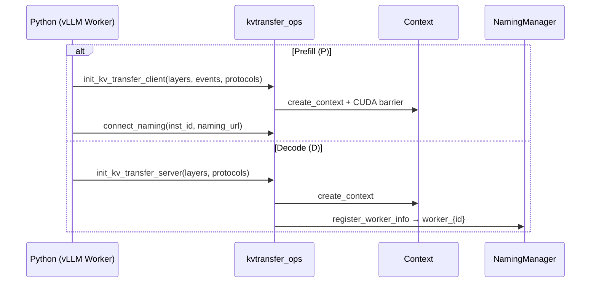
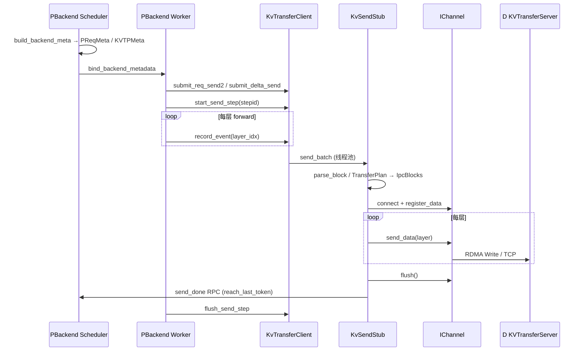
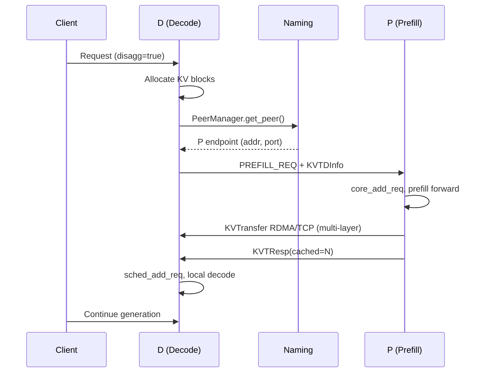

# blade-kvt 项目架构与 vLLM 对接指南

本文档基于仓库源码与 `/mnt/data/llx/vllm` 中 `kvtbackend` 集成代码整理，用于理解 **blade-kvt** 自身结构、组件抽象，以及 **Prefill (P) / Decode (D)** 分离场景下如何与 vLLM 协同工作。

---

## 目录

1. [项目概览](#1-项目概览)
2. [目录结构](#2-目录结构)
3. [核心抽象与组件职责](#3-核心抽象与组件职责)
4. [数据面：KV 传输流程](#4-数据面kv-传输流程)
5. [与 vLLM 的对接](#5-与-vllm-的对接)
6. [P/D 实例发现](#6-pd-实例发现)
7. [请求生命周期与状态维护](#7-请求生命周期与状态维护)
8. [实例与运行时状态](#8-实例与运行时状态)
9. [配置与环境变量速查](#9-配置与环境变量速查)
10. [关键源码索引](#10-关键源码索引)

---

## 1. 项目概览

**blade-kvt** 是面向 **Prefill/Decode 分离（P/D Disaggregation）** 的 KV Cache 传输库：

| 角色 | 含义 | 典型部署 |
|------|------|----------|
| **P (Producer / Prefill)** | 执行 prompt prefill，将 KV cache 块发送给 D | `kv_role=kv_producer` |
| **D (Consumer / Decode)** | 接收 KV，在本地继续 decode | `kv_role=kv_consumer` |

传输协议支持 **RDMA**（`accl-barex`，GDR 直写或 Staged D2H+Send）和 **TCP**（CUDA D2H + 网络发送）。上层通过 Python 扩展 `kvtransfer_ops` 暴露 API，由 vLLM 的 `HybridConnector` + `kvtbackend` 在调度与模型 forward 过程中驱动。

```
┌─────────────────────────────────────────────────────────────────┐
│ vLLM (HybridConnector / kvtbackend)                              │
│  PBackend (Scheduler + Worker)  │  DBackend (Scheduler + Worker) │
└────────────┬────────────────────┴──────────────────┬──────────────┘
             │ RPC (PREFILL_REQ / TRANSFER_KV_REQ)   │
             │                                       │
┌────────────▼──────────────────────────────────────▼──────────────┐
│ blade_kvt (Python)                                                 │
│  KVTransferClient (P)              KVTransferServer (D)            │
│  connect_naming()                  worker_{id} 注册               │
└────────────┬──────────────────────────────────────────────────────┘
             │
┌────────────▼──────────────────────────────────────────────────────┐
│ kvtransfer (C++/CUDA)                                              │
│  KvTransferClient → KvSendStub → IChannel (RDMA/TCP)              │
│  ITransferServer ← 接收并写入 decode 侧 GPU KV                     │
│  parse_block_* / TransferPlan → IpcBlock 描述符                   │
└───────────────────────────────────────────────────────────────────┘
```

---

## 2. 目录结构

```
blade-kvt/
├── blade_kvt/                    # Python 封装层
│   ├── __init__.py               # 默认 ACCL/RDMA 环境变量
│   ├── kv_transfer.py            # 未编译时的 stub，保证 vLLM 可启动
│   ├── kv_transfer_impl.py       # KVTransferClient / KVTransferServer
│   └── nic_affinity.py           # RDMA NIC 亲和性文件
│
├── kvtransfer/                   # C++/CUDA 核心
│   ├── include/                  # 头文件（接口定义）
│   ├── src/                      # 实现（client、channel、parse_block 等）
│   ├── kvtransfer_pybind.cpp     # pybind11 入口 → kvtransfer_ops
│   ├── docs/cache_transfer_spec.md
│   └── tests/
│
├── setup.py / pyproject.toml
├── CRC_README.md                 # CRC 校验说明
└── study_doc/                    # 本文档所在目录
```

vLLM 侧相关路径（不在本仓库内，但为对接必读）：

```
vllm/v1/hybrid_connector/
├── __init__.py           # HybridConnector, HybridScheduler, HybridWorker
├── kvtbackend.py         # PBackend, DBackend, KVTDInfo, KVTState
├── engine_proxy.py       # 与 EngineCore 的 RPC/调度桥接
└── utils.py              # PeerManager, PeerInfo, ConnManager
```

---

## 3. 核心抽象与组件职责

设计采用 **接口 + 工厂 + 策略** 分层：上层编排（Client/Server），中层发送执行（SendStub），底层传输（Channel），旁路服务发现（Naming）与布局解析（parse_block）。

### 3.1 状态与上下文

| 类型 | 文件 | 职责 |
|------|------|------|
| `Context` | `kvtransfer/include/context.h` | 单 worker 全局状态：TP 信息、层 GPU 地址、block/token 大小、协议上下文 |
| `WorkerInfo` | `kvtransfer/include/common.h` | 可序列化的 worker 元数据（inst_id、IP:port、engine_tp_size、GDN/indexer 字段等） |
| `LayerInfo` | `common.h` | 单层：`token_size`, `block_size`, `layer_addr` |
| `IProtocolContext` | `context.h` | 协议初始化钩子；`BarexProtoContext` 实现 RDMA/TCP |
| `ICUDABarrier` | `context.h` | 每层 CUDA event，与 Python `record_event` 同步 |

### 3.2 发送路径（P 侧）

| 类型 | 文件 | 职责 |
|------|------|------|
| `KvTransferClient` | `include/client.h` | 请求缓冲、Step 生命周期、Target 池、与 forward 的层同步 |
| `ISendStub` / `KvSendStub` | `include/tx_stub.h` | 针对单个目标 worker 的发送执行器 |
| `TargetMgr` | `src/client.cpp` | `(dst_inst, dst_worker)` → SendStub 的 LRU 池 |
| `BatchSendTask` | `tx_stub.h` | 一个 substep 内绑定到 `Step` 的批量任务 |
| `Step` / `StepGuard` | `include/step.h` | step 协调：等待各层 `record_event` 完成后再 send_data |
| `RequestInfo` / `ReqSendTask` | `common.h` | 单请求元数据、块 ID、token 范围 |

**KvTransferClient 关键职责：**

1. `submit_req_send` / `submit_delta_send`：将任务写入 `targets_tasks_buf_`
2. `start_send(stepid)`：创建 `Step` + `StepGuard`，提交到线程池
3. `notify_event_record`：Python 每层 forward 后释放对应层信号量
4. `flush_send_step`：等待所有层就绪并收尾

### 3.3 传输通道

| 类型 | 文件 | 职责 |
|------|------|------|
| `IChannel` | `include/channel.h` | 统一协议：`connect` → `register_data` → `send_data(layer)` → `flush` |
| `IpcBlock` | `channel.h` | `{src_offset, dst_offset, length}` 拷贝描述符 |
| `RDMAChannel` | `protocol/rdma_channel.h` | GDR 注册 + RDMA WriteBatch 直写 D 的 GPU |
| `RDMAStagedChannel` | `protocol/rdma_staged_*.h` | D2H 到 CPU staging，再 RDMA Send |
| `TCPChannel` | `protocol/tcp_channel.h` | CUDA copy kernel D2H + TCP |
| `ITransferServer` | `include/server.h` | D 侧监听、注册 MR、处理 RPC（含 CRC） |
| `BarexCtx` | `protocol/barex_protocol.h` | accl-barex 上下文、MR 池、RPC 回调 |

### 3.4 服务发现（Naming）

| 类型 | 文件 | 职责 |
|------|------|------|
| `INamingClient` | `include/naming.h` | 抽象 KV 存储：`store` / `get` / `search` / `list` / `remove` |
| `INamingWorkerClient` | `naming.h` | `register_worker` / `get_worker_info`（围绕 `WorkerInfo` 包一层） |
| `GeneralNamingClient` | `naming.h` | `shared_ptr` 包装、可拷贝；pybind 暴露给 Python 的具体类 |
| `WorkerNamingClient` | `naming.h` | `INamingWorkerClient` 默认实现，key=`worker_{worker_id}`，value=`WorkerInfo::to_string()` |
| `NamingManager` | `naming.h` + `naming.cpp` | 全局工厂，按 `schema:path` 解析 URL，并按 URL 缓存已连接 client（同 URL 复用） |
| `FileSysNaming` | `naming/filesys_naming.h` | `file:` 文件系统命名（默认/测试场景，跨进程共享目录） |
| `EASNamingClient` | `naming/eas_naming.h` | `eas:` 阿里云 EAS HTTP，带 version 增量缓存 |
| `TCPStoreNaming` | `naming/tcpstore_naming.h` | `tcpstore:` torch TCPStore（仅 `ENABLE_TORCH` 时编译，不支持 list/search） |
| `FakeNamingWorkerClient` | `naming/fake_naming.h` | 旁路：当上层把 `dst_worker_info` 直接塞进 `ReqMeta`，跳过任何真实查询 |

Naming 中两类 key 的语义：

| Key 模式 | 注册方 | 用途 |
|----------|--------|------|
| `endpoint{dprank}` | P/D 的 **Scheduler**（RPC 控制面） | 对端发现 RPC 地址 `(addr, port)`；value 是 `PeerInfo.serialize()`：`role:tpsize:ctime_us:addr:port:dprank` |
| `worker_{worker_id}` | D 的 **Worker**（数据面） | P 发送 KV 时解析 RDMA/TCP 端点；value 是 `WorkerInfo::to_string()` |
| `_timestamp_` | `FileSysNaming` 内部 | keepalive 心跳，`list()` 用它判活 |

### 3.5 KV 布局解析（parse_block）

不同模型/后端的 KV cache 内存布局不同，通过 **Cache Shape** 选择解析器：

| 常量 | 值 | 源文件 | 说明 |
|------|-----|--------|------|
| `RAGGED_FLASH_CACHE_SHAPE` | 1 | `parse_block_ragged.cpp` | 旧 ragged 布局 |
| `FLASH_CACHE_SHAPE` | 2 | `parse_block_flash.cpp` | vLLM 标准 `(2, blocks, ...)` |
| `QWEN3_NEXT_FLASH_CACHE_SHAPE` | 3 | `parse_block_qwen3_next.cpp` | Hybrid GDN + indexer + attn |
| `DPSK_V32_SPARSE_MLA_SHAPE` | 4 | `parse_block_dpsk.cpp` | 稀疏 MLA |
| `FLASHINFER_CACHE_SHAPE` | 5 | `parse_block_flashinfer.cpp` | HND head-major |
| `TURBOQUANT_CACHE_SHAPE` | 6 | `parse_block_turboquant.cpp` | TurboQuant |
| `QWEN3_NEXT_FLASHINFER_CACHE_SHAPE` | 7 | `parse_block_qwen3_next_flashinfer.cpp` | Qwen3.5 + FlashInfer |

每个 shape 通常有 **P==D** (`PEQD`)、**P>D** (`PGTD`)、**P<D** (`PLTD`) 变体，由 `TaskContext::refresh_dst_info()` 根据源/目的 TP 大小选择。

**新路径**（`BLLM_KVTRANS_TX_PARSE_MODE=cache_spec`）：

- `AttnLayoutDesc` + `build_transfer_plan()` + `generate_all_ipc_blocks()` 替代逐 shape 的函数指针，详见 `kvtransfer/docs/cache_transfer_spec.md`。

### 3.6 Python 层

| 模块 | 职责 |
|------|------|
| `kv_transfer.py` | `kvtransfer_ops` 缺失时提供 stub，避免 vLLM 启动失败 |
| `kv_transfer_impl.py` | 封装 C++ API；管理每层 CUDA Event；`send_done` RPC 通知调度器 |
| `kvtransfer_pybind.cpp` | 导出 `init_kv_transfer_client/server`、`connect_naming`、send API |

---

## 4. 数据面：KV 传输流程

### 4.1 初始化



### 4.2 每个 Scheduler Step 的发送（P → D）



### 4.3 Block 解析决策树

```
env_cache_shape()  ← BLLM_KVTRANS_CACHE_SHAPE
    │
    ├─ TX_PARSE_MODE == cache_spec ?
    │     └─ build_transfer_plan() → generate_all_ipc_blocks()
    │
    └─ Legacy: 按 P/D TP 比较
          ├─ P == D  → *_p_eq_d  (TPKind::PEQD)
          ├─ P > D   → *_p_gt_d  (TPKind::PGTD)
          └─ P < D   → *_p_lt_d  (TPKind::PLTD)
```

`compute_valid_ranks_pd()` 在 `num_kv_heads < engine_tp_size` 时过滤哪些 P rank 参与发送。

---

## 5. 与 vLLM 的对接

### 5.1 启用方式

vLLM 通过 **KV Connector** 机制接入，需配置：

```json
{
  "kv_connector": "HybridConnector",
  "kv_role": "kv_producer",          // P 节点
  "kv_connector_extra_config": {
    "backend": "kvt",
    "naming_url": "file:/path/to/naming",
    "kvt_inst_id": "prefill-cluster-0"
  }
}
```

D 节点将 `kv_role` 设为 `kv_consumer`，`kvt_inst_id` 设为 decode 集群 ID。

后端类选择逻辑（`vllm/v1/hybrid_connector/__init__.py`）：

```python
# backend == "kvt"
if is_kv_consumer:
    return DBackend
elif is_kv_producer:
    return PBackend
```

### 5.2 分层架构

```
EngineCore
    │ on_add_req / step / schedule
    ▼
HybridConnector (__init__.py)
    ├── HybridScheduler  → PBackend / DBackend (SCHEDULER 角色)
    └── HybridWorker     → PBackend / DBackend (WORKER 角色)
            │
            ├── 控制面：RPC (PREFILL_REQ, TRANSFER_KV_REQ, ABORT_REQS_REQ)
            └── 数据面：blade_kvt.KVTransferClient / KVTransferServer
```

| 组件 | 文件 | 职责 |
|------|------|------|
| `HybridConnector` | `__init__.py` | vLLM `KVConnectorBase_V1` 门面 |
| `HybridScheduler` | `__init__.py` | 请求队列 `_waiting/_loading/_loaded`、step、RPC 处理 |
| `HybridWorker` | `__init__.py` | `bind_backend_metadata`、层 hook `async_save_kv_layer` |
| `PBackend` | `kvtbackend.py` | P：RPC 服务、KV 发送、Dash 远程 decode |
| `DBackend` | `kvtbackend.py` | D：Peer 发现、向 P 发 prefill RPC、KV 接收 |
| `engine_proxy.py` | | `core_add_req`、`sched_add_req`、RPC server 端口 |

### 5.3 Python ↔ C++ 绑定要点

**P Worker** `PBackend.register_kv_caches()`：

- 按模型类型设置 `BLLM_KVTRANS_CACHE_SHAPE`（见 `_set_worker_envs`）
- 创建 `KVTransferClient`，在 `async_save_kv_layer` 中 `record_event`
- `connect_naming(inst_id, naming_url)`；P Scheduler 调用 `_reg_naming` 注册 `endpoint{dprank}`

**D Worker** `DBackend.register_kv_caches()`：

- 创建 `KVTransferServer`
- 将 `worker_{id}` 序列化 `WorkerInfo` 写入 naming；若无 naming，通过 RPC `_REGISTER_WORKER` 上报给 D Scheduler

**每步发送** `PBackend.bind_backend_metadata(KVTPMeta)`：

- `freeze_metas` → `start_req_send`
- `abort_metas` → `submit_delta_send`（收尾）
- `nonfreeze_metas` → `submit_req_send2` / `submit_delta_send`
- `start_send_step` + 各层 `record_event` + `flush_send_step`

**完成通知**：C++ `KvSendStub::send_done()` 向 `BLLM_KVTRANS_SEND_DONE_ADDR`（默认 P Scheduler RPC 端口）发送 `SEND_DONE_REQ`，P 侧 `_mark_send_done` 后向等待中的 D RPC 返回 `KVTResp`。

---

## 6. P/D 实例发现

发现分为 **两层**：控制面（RPC 端点）和数据面（KV worker 端点）。

### 6.1 实例 ID

```python
# kvtbackend._get_inst_id()
kvt_inst_id = kv_connector_extra_config["kvt_inst_id"]
              or POD_NAME
              or uuid

# 完整传输/RPC 身份（含 DP/TP）
full_id = f"{kvt_inst_id}|{data_parallel_rank}|{tensor_parallel_size}"
```

### 6.2 控制面：D 如何找到 P（Prefill RPC）

**P 注册**（Scheduler，`_reg_naming`）：

```python
PeerInfo(role="prefill", tpsize, addr, port=rpc_port, dprank)
naming_cli.store(f"endpoint{dprank}", info.serialize())
```

**D 发现**（`DBackend` + `PeerManager`）：

- 每 **7 秒** 轮询：`naming_cli.list()` → 对每个 instance `search(inst, "endpoint")`
- 过滤 `role == "prefill"`
- 维护 `PeerMap`：`peer_id = f"{kvt_inst_id}|{dprank}|{tpsize}"` → `(addr, port)`
- `get_peer(exclude=self.my_addr_port)` 随机选一个可用 P（避免选自己）

**显式指定 P**（Dash / 固定 P）：

- 请求参数 `remote_host` + `remote_port` → `peer_hint`
- abort 时记录 `D_PID = "{addr}:{port}"` 用于 `_abort_prefill`

### 6.3 数据面：P 如何找到 D Worker（KV RDMA/TCP）

**D Worker 注册**：

```python
winfo = bladekv.current_worker_info('server')
naming_cli.store(f"worker_{worker_id}", winfo)
```

**经 RPC 传递给 P**（`KVTDInfo`）：

```python
KVTDInfo(
    instid=f"{d_inst_id}|{dprank}|{tpsize}",
    blkids=...,           # D 侧 block 映射
    cached_tokens=...,
    max_tokens=...,
    d_workers_info=[...], # 各 TP rank 的 WorkerInfo 序列化串
)
```

**P 侧映射**（`_get_distinfo` / `_get_dist`）：

- 解析 `d_inst_id` 得到 D 的 inst / dprank / tpsize
- 按 P_tp 与 D_tp 计算 `dst_worker_id`（支持 P_tp > D_tp 的多对一）
- `PReqMeta` 携带 `d_workers_info` 时，C++ 可 **跳过 naming 查询** 直接使用

**C++ 回退**：`tx_stub.cpp` 中若未提供 `dst_worker_info`，则 `naming_->get_worker_info(dst_inst, dst_worker_id)`。

### 6.4 Fake Naming 模式（`naming_url: "fake://"`）

| 组件 | 行为 |
|------|------|
| P | 无 naming；`inst_id = POD_NAME-rpc_port-ip` |
| D Scheduler | 无 `PeerManager`；请求必须带 `remote_host`/`remote_port` |
| D Worker | RPC `_REGISTER_WORKER` 注册到 D Scheduler；阻塞直到所有 TP rank 就绪 |

### 6.5 Naming 后端

| Schema | 实现 |
|--------|------|
| `file://` | `filesys_naming.cpp`，目录 per instance，带 keepalive 时间戳 |
| `eas://` | `eas_naming.cpp`，HTTP |
| `tcpstore://` | `tcpstore_naming.cpp`，基于 torch TCPStore（不支持 list/search） |
| `fake://` | 本地测试，无真实存储 |

### 6.6 Naming 子系统实现细节

本节自下而上拆解 `kvtransfer/include/naming.h` + `kvtransfer/src/naming.cpp` 及三个后端的真实代码逻辑，配合上层 vLLM 的调用点。

#### 6.6.1 接口分层

```
┌──────────────────────────────────────────────────────────────────┐
│ Python (vLLM)                                                    │
│   blade_kvt.kv_transfer.connect_naming(inst, url) → NamingClient │
│   naming_cli.store / get / search / list / remove                │
└────────────────────┬─────────────────────────────────────────────┘
                     │ pybind11
┌────────────────────▼─────────────────────────────────────────────┐
│ GeneralNamingClient (可拷贝 shared_ptr 包装)                      │
│   .connect()  // 第二次调用会 throw                                │
│   .{store,get,search,remove,list}()                              │
│   .create_naming_worker_client() → WorkerNamingClient            │
└────────────────────┬─────────────────────────────────────────────┘
                     │
┌────────────────────▼─────────────────────────────────────────────┐
│ INamingClient (纯虚)                                             │
│   const inst_id;                                                  │
│   virtual store/get/search/remove/list/connect/get_schema = 0    │
└────────────────────┬─────────────────────────────────────────────┘
       ┌─────────────┼─────────────────┬────────────────────┐
       ▼             ▼                 ▼                    ▼
  FileSysNaming  EASNamingClient  TCPStoreNaming    (旁路)
  (file:)        (eas:)           (tcpstore:)
                                                  FakeNamingWorkerClient
                                                  (持有静态 WorkerInfo)
```

`INamingWorkerClient` 是 worker 维度的便捷封装，唯一默认实现：

```cpp
// naming.h
void WorkerNamingClient::register_worker(const WorkerInfo& w) {
  client_->store("worker_" + std::to_string(w.worker_id), w.to_string());
}
std::optional<WorkerInfo> WorkerNamingClient::get_worker_info(
    const InstanceId& inst, WorkerId wid) {
  auto v = client_->get(inst, "worker_" + std::to_string(wid));
  return v ? std::optional{WorkerInfo::from_string(*v)} : std::nullopt;
}
```

#### 6.6.2 全局 NamingManager 与 connect_naming

`NAMING_MANAGER` 在 `kvtransfer_pybind.cpp` 作为进程级单例：

```cpp
static NamingManager *NAMING_MANAGER = new NamingManager();
GeneralNamingClient connect_naming(const InstanceId& name, const std::string& url) {
  return NAMING_MANAGER->connect_naming(name, url);
}
```

`NamingManager` 在构造时注册内置 schema 工厂（`EAS_NAMING_SCHEMA`、`FILESYS_NAMING_SCHEMA`），`connect_naming` 流程：

1. **缓存命中**：用 `url` 整串作为 key 在 `naming_clients_` 中查找。同一 URL 在进程内只 connect 一次，所有 worker / migration / kvt 模块复用同一个底层 client。
2. **解析 schema**：以 `:` 切分，例如 `file:/shared/naming` → schema=`file`, content=`/shared/naming`。
3. **工厂创建**：`factories_[schema]->create(myname)` 拿到具体实现，然后调用 `connect(schema, content)` 完成真正的初始化（建目录、记录 EAS endpoint、连 TCPStore 等）。
4. **未知 schema**：不抛错，返回空壳 `GeneralNamingClient()`，仅打印支持列表。配合 vLLM 侧 `naming_url="fake://"` 走"无 naming"分支。

> 注意 `GeneralNamingClient::connect()` 直接抛 `runtime_error`：上层不应该再 connect 二次，这条路径只服务于 NamingManager 内部。

#### 6.6.3 inst_id 与 myname

`NamingManager::connect_naming(myname, url)` 传入的 `myname` 会被存入 `INamingClient::inst_id`，作用：

- **写**侧：自己的所有 `store(k,v)` 都隐式写到自己的命名空间（file: → 自己的目录；eas: → 自己 pod 的 KV）。
- **读**侧：`get(inst, k)` / `search(inst, prefix)` 显式指定要查的实例 ID，可读他人。

`myname` 在 vLLM 侧的构造规则（`kvtbackend._get_inst_id()`）：

- 真实 naming：`kvt_inst_id`（来自 extra_config，或 POD_NAME，或 uuid）。
- `fake://`：附加 `rpc_port` 和本机 IP 形成唯一字符串，避免单机自连。

#### 6.6.4 FileSysNaming（file:）

`FileSysNaming::connect(path)` 校验目录存在后：

```
<naming_path>/                       # 共享目录
├── <inst_A>/                        # 由 inst_A 创建
│   ├── _timestamp_                  # keepalive
│   ├── endpoint0                    # PeerInfo for dp_rank=0
│   ├── worker_0                     # WorkerInfo
│   └── worker_1
└── <inst_B>/
    └── ...
```

关键点：

- **建目录 + 启 keepalive 线程**：首次 connect 创建 `instance_path_`，启动后台线程每 `BLLM_KVTRANS_FSNAMING_KEEPALIVE_S`（默认 3s）写一次 `_timestamp_`。
- **原子写**（`write_file`）：用 `mkstemp` 在同目录建 `xxx.tmpXXXXXX`，写完 `rename` 替换。注释里明确解释这是为了规避在 XPU EAS 上观测到的 "prefill 读到空 `_timestamp_`" 问题；同时绕开 pre-cxx11 ABI 下 `std::string::data()` 可能不稳定的问题（用 `vector<char>` 持有临时路径）。
- **store key 限制**：禁止 key 包含 `/`，避免穿越到其它目录。
- **get / search**：直接读文件首行作为 value（`std::getline`），所以单条 value 不能跨行。
- **list 判活**：`list()` 遍历 `naming_path_`，对每个子目录读 `_timestamp_`，只有 `now - last_report < BLLM_KVTRANS_FSNAMING_TOLERATE_S`（默认 9s）才纳入；结果有 **2s 短缓存**减少 FS 压力。
- **生命周期**：析构时 stop 标志置位 + join keepalive 线程，但**不会删自己的目录**——靠 `_timestamp_` 过期被对端自动剔除。

#### 6.6.5 EASNamingClient（eas:）

适配阿里云 EAS 私域命名服务，HTTP 接口：

| 路径 | 用途 |
|------|------|
| `POST /api/message` | store；body 是 `{"key":"value"}` |
| `GET /api/messages/<pod>` | 取某个 pod 的全量 KV |
| `GET /api/instances` | list 所有 pod，附带每个 pod 的 `__timestamp__`（version）|

关键点：

- **value 上限** `EAS_MAX_VALUE_LENGTH = 2048`，超过抛错；这就是为什么 `WorkerInfo::to_string()` 在 inst_id / addr 上有 `MAX_INSTANCE_NAME_LEN` / `MAX_ADDRESS_LEN` 校验。
- **不支持 `remove`**：直接抛 `eas naming not support remove;`。
- **两级缓存**：
  - `EASNamingClient.pods_`：`pod_name → EASNamingCache`，每个 cache 独立 RW 锁 + version。
  - 顶层 `time_watch_`：list/load 节流。两次 `load()` 之间间隔不到 `cache_expire_seconds_`（默认 1ms，可由 `EAS_NAMING_CACHE_EXPIRE_TIME` 调大）则直接复用。
- **增量更新**：`load()` 拉 `/api/instances`，对每个 pod 比对 `__timestamp__`；version 升高则 `set_outdated()`，后续 `get_pod_kv` 才会再 `GET /api/messages/<pod>` 拉全量；新 pod / 消失 pod 也在 `load()` 里维护到 `instance_list_`。
- **store 注意**：写自己时 EAS 端点写死本地 `http://127.0.0.1:9900`（`EAS_LOCAL_ENDPOINT`），相当于 sidecar 模式；读时走 `connect()` 传入的 `service_endpoint_`。

#### 6.6.6 TCPStoreNaming（tcpstore:，可选）

仅在 `ENABLE_TORCH` 编译开关打开时存在。URL 形如 `tcpstore://ip:port`（注意 `connect` 拿到的是 `//ip:port`）：

- 用 `c10d::TCPStore(addr, opts)` 连接（不创建服务端）。
- 内部 key 自动加前缀 `inst_id + "/" + key`，所以同一个 TCPStore 上多个 inst 共享。
- 仅支持点查 `get / store / remove`；**不支持 `list / search`**——会直接抛 `unsupported`。这意味着用 TCPStore 时上层必须自己知道全部 peer，常用于固定双机点对点场景或测试。

#### 6.6.7 FakeNamingWorkerClient（旁路）

定义在 `naming/fake_naming.h`，只有 `get_worker_info` 是有效的：

```cpp
class FakeNamingWorkerClient : public INamingWorkerClient {
  WorkerInfo dst_info_;   // 构造时塞进来
  std::optional<WorkerInfo> get_worker_info(...) override { return dst_info_; }
  void register_worker(...) override { throw runtime_error("..."); }
};
```

触发点在 `KvSendStubFactory::create_stub`（`src/tx_stub.cpp`）：

```cpp
if (dst_info) {
  naming_worker = std::make_shared<FakeNamingWorkerClient>(*dst_info);
} else {
  naming_worker = naming_worker_;   // 回落到真实 WorkerNamingClient
}
```

`dst_info` 来源就是 `ReqMeta::dst_worker_info`，由 vLLM 侧 `PReqMeta.d_workers_info`（D 通过 `KVTDInfo` RPC 带过来的字符串）反序列化得到。**这条旁路是性能关键**：它让 fake_naming / 慢 EAS 场景下的 P 进程不必每个请求都去外部命名服务查 worker，每个 D worker 的 `WorkerInfo` 随 PrefillReq 直发即可。

`TaskContext::refresh_dst_info()` 仍会调用 `naming_->get_worker_info(...)`，但对 fake_naming_worker 来说只是返回缓存好的 `dst_info_`。

#### 6.6.8 WorkerInfo 序列化

`worker_*` key 的 value 由 `WorkerInfo::to_string()` 生成（`src/common.cpp`），逗号分隔 12～13 个字段：

```
inst_id,worker_id,engine_tp_size,worker_tp_rank,
block_sizes(|分隔),token_sizes(|分隔),
layer_num_blocks,num_layers,transfer_protocols,
attn_kernel_blk_ntpb,indexer_blk_ntpb,attn_pack_size[,addr]
```

`from_string` 显式做了向后兼容（11/12/13 字段三套解析路径，且用 `is_numeric_token` 区分老 `addr` 和新 `attn_pack_size`）。**滚动升级 P/D 时同一集群可能存在多版本 WorkerInfo**，这个兼容层是必需的。

#### 6.6.9 KvSendStubFactory 的共享语义

`KvSendStubFactory` 构造时一次性 `create_naming_worker_client()` 得到 `unique_ptr<WorkerNamingClient>`，转成 `shared_ptr` 后所有 `KvSendStub` 复用：

```cpp
KvSendStubFactory(Context *ctx, GeneralNamingClient &&naming) {
  naming_ = std::move(naming);                                  // 持有 client 本身
  naming_worker_ = std::shared_ptr<INamingWorkerClient>(        // worker 视图
      naming_.create_naming_worker_client());
}
```

这意味着：

1. `KvSendStubFactory` 与所有衍生 `KvSendStub` 共享同一个底层 `INamingClient`（线程安全由 backend 自己保证：file backend 用 mutex 锁 `list_cache_`，eas backend 用 `shared_mutex`）。
2. 进程内同 URL 的 `connect_naming` 会复用 `GeneralNamingClient`（见 6.6.2），所以 **`KvTransferClient` 与 vLLM 侧 `PeerManager` / `MigrationBackend` 拿到的 naming_cli 其实是同一份**，缓存共享。
3. `FakeNamingWorkerClient` 不复用 `naming_worker_`，**每个请求独立 new 一份**，避免污染共享路径。

#### 6.6.10 P / D 两侧 naming 调用全景

```
P 启动 (scheduler 角色)                  D 启动 (scheduler 角色)
  connect_naming(myinst, url)              connect_naming(myinst, url)
  _reg_naming → store endpoint{dprank}     PeerManager._main 每 7s:
                                             list()                       (查 P)
                                             search(P, "endpoint")
                                             过滤 role=="prefill"
                                             更新 PeerMap

P worker:                                D worker (register_kv_caches):
  init_kv_transfer_client(naming_url)      init_kv_transfer_server(naming_url)
    → connect_naming + KvSendStubFactory   bladekv.current_worker_info('server')
                                           if naming_cli:
                                             store(f"worker_{worker_id}", winfo)
                                           else:
                                             RPC _REGISTER_WORKER → D Sched

发送 KV 时 (tx_stub):                    
  if ReqMeta.dst_worker_info:            
    FakeNamingWorkerClient → 直接用       
  else:
    WorkerNamingClient.get_worker_info
      → file: 读 <naming_path>/<dst_inst>/worker_{wid}
      → eas: 命中 pods_[dst_inst] 缓存（必要时 GET /api/messages/dst_inst）
```

#### 6.6.11 故障模式与限制

| 现象 | 原因 | 处理 |
|------|------|------|
| `list()` 看不到某个对端 | file: `_timestamp_` 距今 ≥ 9s（默认） | 检查 keepalive 线程是否被 sigsegv 杀掉，或调 `BLLM_KVTRANS_FSNAMING_TOLERATE_S` |
| `get` 读到空字符串 | file: 不再发生（rename 原子化）；老版本可能读到中间态 | 如果遇到老 commit，把 `BLLM_KVTRANS_FSNAMING_KEEPALIVE_S` 调大降频 |
| `eas store too large value` | `WorkerInfo.to_string()` 超过 2048B | 减少字段，或换 backend |
| `tcpstore list/search` throw | TCPStore 协议不支持 | 用 file/eas，或上层显式知道对端 |
| `unknown naming schema: xxx` | URL 拼写错或未编译该 backend（如 tcpstore 未开 ENABLE_TORCH） | 回退到 `fake://` |
| P 找不到 D worker | `dst_worker_info` 未带 + naming 上还没看到 `worker_{id}` | tx_stub 抛 `can't find target worker`；上层依赖 D 已注册完成，常因 D worker 还在启动 |

---

## 7. 请求生命周期与状态维护

### 7.1 请求参数（kv_transfer_params）

| Key | 常量 | 设置方 | 含义 |
|-----|------|--------|------|
| `ali_llumnix_disagg` | `D_DISAGG` | 默认 | 启用 PD 分离 |
| `do_remote_prefill` | `D_REMOTE_PREFILL` | Dash | D 向指定 P prefill |
| `do_remote_decode` | `P_REMOTE_DECODE` | Dash | P prefill 后 KV 交给 D decode |
| `remote_host` / `remote_port` | | 调用方 | 固定 P 的 RPC 地址 |
| `hbpkvtstate` | `P_KVT_STATE` | P Scheduler | `KVTState(dinfo, maxtokens, untouched)` |
| `hbpkvtdinfo` | `P_KVTD_INFO` | D→P RPC | 目标 block、cached tokens、workers |
| `_hbkvtpid` | `D_PID` | D | abort 时用的 P 地址 |
| `ignore_output` | `P_IGNORE_OUTPUTS` | P | 远程 decode 时不向客户端输出 |

### 7.2 D（Decode）标准 Disagg 流程

```
Client Request (disagg=true, prompt>1)
    │
    ▼
HybridConnector.on_add_req()
    │ get_operations() → load=1
    ▼
HybridScheduler._waiting
    │ sched_allocate_slots()
    ▼
_on_add_req() [disagg asyncio 线程]
    │ async_get_num_new_matched_tokens()  → 需远程 prefill 的 token 数
    │ async_update_state_after_alloc()
    │   └─ _prefill_rpc(PREFILL_REQ) 或 _dash_prefill_rpc(TRANSFER_KV_REQ)
    ▼
mark_loaded() → _loaded
    │ num_computed_tokens += cached
    ▼
sched_add_req() → 正常 vLLM decode 调度
```

**Hybrid 模型 token 切分**：D 保留最后 `gamma+1` 个 token 本地计算（`gamma = num_speculative_tokens`），远程只 prefill 前面部分。

### 7.3 P（Prefill）两种模式

**模式 A：D 驱动 Prefill**（`PREFILL_REQ`）

1. D RPC 发送 `EngineCoreRequest` + `P_KVTD_INFO`
2. P 设置 `max_tokens=1`、`P_IGNORE_OUTPUTS=True`、`P_KVT_STATE`
3. P 本地 prefill forward
4. `build_backend_meta` → `PReqMeta` → Worker 经 `KVTransferClient` 发送到 D
5. `_wait_kvt_state` 返回 `KVTResp(cached=N)` 给 D

**模式 B：Dash 远程 Decode**（`do_remote_decode=True`）

1. 客户端请求直达 P
2. P `max_tokens=1` prefill
3. D 稍后发 `TRANSFER_KV_REQ`（`RKVTDInfo`）
4. P 经 `_dinfoq` / `_dash_done` 匹配并发 KV

### 7.4 P 每步 KV 发送元数据

```python
@dataclass
class PReqMeta:
    reqid: str
    d_inst_id: str          # "{inst}|{dprank}|{tpsize}"
    p_block_ids / d_block_ids
    new_tokens: int
    has_last_token: bool
    seen_tokens: int        # 0 → submit_req_send; >0 → submit_delta_send
    d_workers_info: list[str]
    has_freeze: bool
```

Scheduler 每步产出 `KVTPMeta`：`stepid`, `substepid`, `freeze_metas`, `abort_metas`, `nonfreeze_metas`。

### 7.5 HybridScheduler 队列（请求维护）

| 结构 | 用途 |
|------|------|
| `_waiting` | 等待 KV 槽位分配与 load/save 设置 |
| `_loading` / `_loaded` | D 侧 KV 加载中 / 完成 |
| `_saving` / `_saved` | P 侧 KV 保存中 / 完成 |
| `_sending` (P) | 等待 `KVTResp` 的 RPC |
| `_infly_kvt` (P) | 多步 delta 发送中的请求 |
| `_dash_done` (P) | Dash：等待 D 的 TRANSFER_KV |
| `_dinfoq` (P) | 来自 D 的 `RKVTDInfo` 队列 |
| `_aborting` | 跨队列的 abort 协调 |

### 7.6 RPC 协议常量（节选）

| 常量 | 值 | 方向 | 说明 |
|------|-----|------|------|
| `PREFILL_REQ` | 0x20181218 | D→P | 携带 `EngineCoreRequest` |
| `PREFILL_RESP` | 0x81218102 | P→D | `KVTResp` |
| `TRANSFER_KV_REQ` | 0x20210912 | D→P | Dash：仅传 KV |
| `SEND_DONE_REQ` | 0x20181219 | C++→P Sched | KV 发送完成 |
| `ABORT_REQS_REQ` | 20250820 | D→P | 加载失败时 abort |

### 7.7 端到端时序（标准 Disagg）



---

## 8. 实例与运行时状态

### 8.1 PeerManager 生命周期

```
每 7s:
  list() 所有 naming instance
  对每个 instance: search("endpoint*")
  与 _running 对比:
    - 消失 → 移除 peer + 关闭连接池
    - ctime_us 变化 → 原地重启检测，更新 peer + 清连接
    - 新增 → 加入 PeerMap
```

### 8.2 P 侧单请求状态机

```
请求进入 P
    │
    ├─ do_remote_decode? → 进入 _dash_done，等待 TRANSFER_KV
    │
    ├─ P_KVT_STATE (来自 PREFILL_REQ)
    │     untouched=True  → 等 scheduled tokens 达到 max 再发 KV
    │     untouched=False → 立即 build PReqMeta 发送
    │
    └─ _infly_kvt 跟踪多步 delta
          finished + new_tokens=0 → abort_metas (has_last_token)
```

`KVTState.untouched` 控制首次 KV 传输是否等待 prefill 完全结束。

### 8.3 blade-kvt C++ 侧状态

| 状态 | 所有者 | 生命周期 |
|------|--------|----------|
| `Context` / `WorkerInfo` | 每进程 client 或 server | 进程级 |
| `KV_CLIENT` / `KV_SERVER` | pybind 全局单例 | 进程级 |
| `targets_tasks_buf_` | `KvTransferClient` | 每次 `start_send` 清空 |
| `coord_step_id_`, `pending_step_metas_` | Client | Step/substep 协调 |
| `Target` SendStub LRU | `TargetMgr` | 容量 `env_txstub_cap()` |
| `RequestInfo::state_` | 原子 `ReqState` | INPROCESS → OK/FAILED |
| `TaskContext` | `KvSendStub` | 单次 `send_batch` 后清理 |

### 8.4 失败与 Abort

- D load 异常 → `IoRet.ex` → `AbortReq` → `_abort_prefill()` → `ABORT_REQS_REQ` 到 P
- Dash 模式 `CODE_REQNOTFOUND` → `_delay_s_list` 重试
- `request_finished_all_groups`：远程 decode 时协调 `_PD_FINISH_REASON` 与 `_PD_SAVED` 顺序

---

## 9. 配置与环境变量速查

### 9.1 vLLM kv_transfer_config

| 字段 | 说明 |
|------|------|
| `kv_connector` | `"HybridConnector"` |
| `kv_role` | `"kv_producer"` (P) / `"kv_consumer"` (D) |
| `kv_connector_extra_config.backend` | `"kvt"` |
| `kv_connector_extra_config.naming_url` | `"file:/path"` / `"eas:..."` / `"fake://"` |
| `kv_connector_extra_config.kvt_inst_id` | 逻辑集群名 |

### 9.2 blade-kvt 环境变量（`BLLM_KVTRANS_*`）

| 变量 | 作用 |
|------|------|
| `CACHE_SHAPE` | 选择 parse_block（1–7） |
| `TX_PARSE_MODE` | `cache_spec` 启用 TransferPlan |
| `RDMA_STAGED` | Staged D2H+Send |
| `SEND_DONE_ADDR` | Scheduler RPC `ip:port` |
| `CRC` | KV 完整性校验 |
| `SEND_TPSIZE` / `TXSTUB_CAP` | 发送线程池与 stub 池大小 |
| `BF162FP8_CONV` | 传输时 BF16→FP8 |
| `PORT_BASE` | Server 监听端口基址 |
| `FSNAMING_KEEPALIVE_S` | file naming 心跳间隔（默认 3s）|
| `FSNAMING_TOLERATE_S` | file naming `list()` 判活窗口（默认 9s）|

非 `BLLM_KVTRANS_` 前缀但与 naming 相关：

| 变量 | 作用 |
|------|------|
| `EAS_NAMING_CACHE_EXPIRE_TIME` | EAS naming 顶层 list/load 缓存毫秒（默认 1） |

`kvtbackend._set_worker_envs()` 会根据模型类型（MLA、Hybrid、FlashInfer、TurboQuant）自动设置默认 `CACHE_SHAPE`。

### 9.3 示例启动片段

```bash
# P 节点
export BLLM_KVTRANS_CACHE_SHAPE=7   # Qwen3.5 + FlashInfer
# 通常由 vLLM 根据模型自动设置

# naming 目录需对 P/D 双方可见
# kv_connector_extra_config.naming_url=file:/shared/naming
```

---

## 10. 关键源码索引

### blade-kvt

| 主题 | 路径 |
|------|------|
| 公共类型 | `kvtransfer/include/common.h` |
| Client 编排 | `kvtransfer/include/client.h`, `src/client.cpp` |
| Send 执行 | `kvtransfer/include/tx_stub.h`, `src/tx_stub.cpp` |
| Channel | `kvtransfer/include/channel.h`, `src/rdma_channel.cpp` |
| Naming 接口/工厂 | `kvtransfer/include/naming.h`, `src/naming.cpp` |
| Naming 后端 | `kvtransfer/include/naming/{filesys,eas,tcpstore,fake}_naming.h`, `src/{filesys,eas,tcpstore}_naming.cpp` |
| parse_block | `kvtransfer/include/parse_block_common.h`, `src/parse_block_*.cpp` |
| TransferPlan | `kvtransfer/docs/cache_transfer_spec.md` |
| pybind | `kvtransfer/kvtransfer_pybind.cpp` |
| Python API | `blade_kvt/kv_transfer_impl.py` |

### vLLM

| 主题 | 路径 |
|------|------|
| 后端选择 | `vllm/v1/hybrid_connector/__init__.py` → `_get_backend_cls` |
| P/D 实现 | `vllm/v1/hybrid_connector/kvtbackend.py` |
| Peer 发现 | `vllm/v1/hybrid_connector/utils.py` → `PeerManager` |
| Engine 桥接 | `vllm/v1/hybrid_connector/engine_proxy.py` |
| Dash 示例 | `vllm/examples/dash_proxy.py` |

---

## 附录：当前分支说明

当前 git 分支 `support_3.5_flashinfer` 新增 **`QWEN3_NEXT_FLASHINFER_CACHE_SHAPE` (值 7)**，用于 Qwen3.5 混合模型在 FlashInfer HND 注意力布局下的 KV 解析，对应源文件 `parse_block_qwen3_next_flashinfer.cpp`。

---

*文档生成日期：2026-05-21（2026-05-25 补充 6.6 节 Naming 子系统实现细节）*
