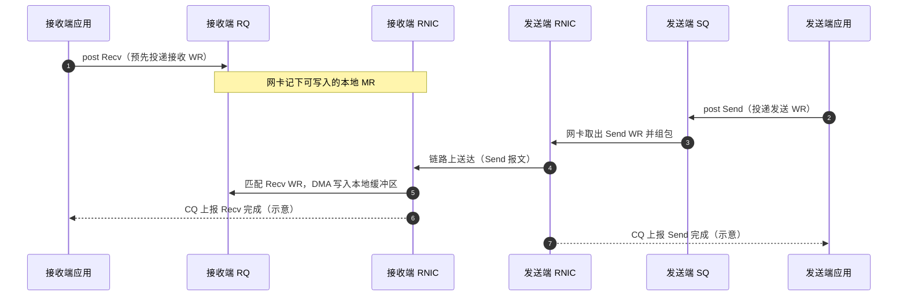
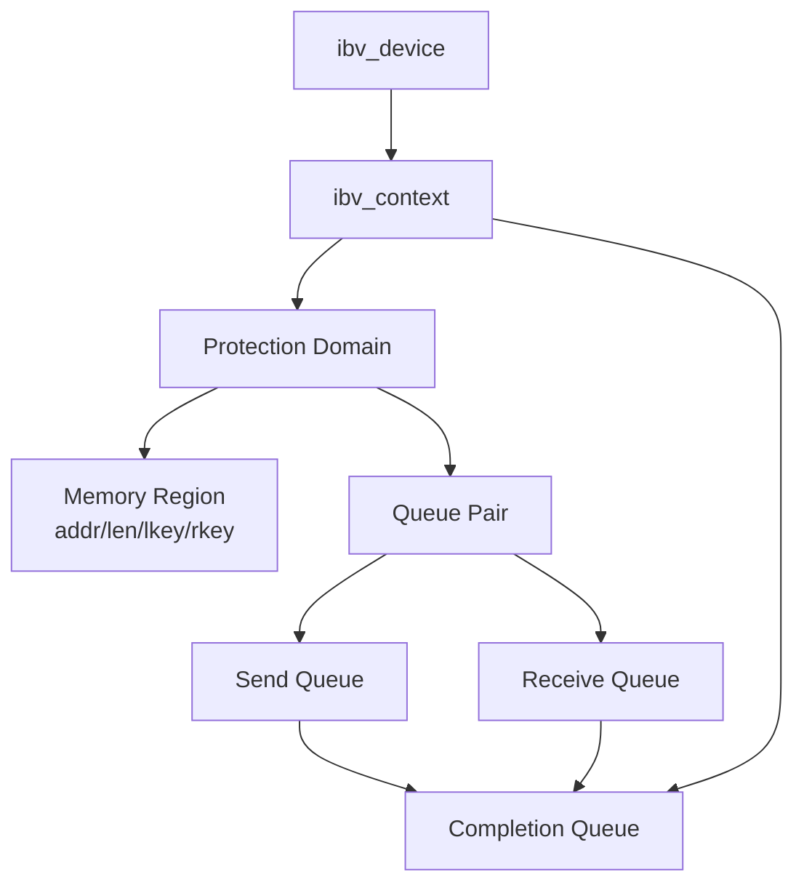

# RDMA学习笔记（1）：基础概念、Verbs 对象与 Barex 对照

> 本文是概念入口。更系统的源码版见
> [RDMA Verbs 对象模型](nccl_pcie_barex_learning/02a_rdma_verbs_object_model.md)、
> [RDMA 操作与完成语义](nccl_pcie_barex_learning/02b_rdma_operations_completion_and_reliability.md)；
> PCIe/GPU Direct 背景见
> [GPU、NIC、PCIe 拓扑与 DMA](nccl_pcie_barex_learning/02_pcie_gpu_topology_and_dma.md)。

DMA(Direct-Memory-Access): 让硬件组件能够在不涉及CPU的情况下直接读写主存，避免占用CPU。实际上GPU也包括这种操作。

RDMA(Remote DMA): 通过网络扩展DMA的能力，让机器在不涉及双方的CPU，cache或操作系统的情况下直接操作另一台机器的内存。

RDMA允许数据直接从网卡传输到应用程序的memory中（vice versa），消除了内核网络栈中的中间拷贝.

2015年的sigcomm论文就已经展示了RDMA带来的巨大提升


下图展示了TCP和RDMA的区别：
- 对于TCP，数据包需要通过中间层在源端/目的端整理数据包，对失败的数据进行重传
- RDMA消除了中间层的参与，绕过网络堆栈和操作系统（kernel-bypass）


## RDMA Operations

Channel level
- Send
- Recv

Memory level
- Read: 从远端内存读取数据到本地内存
- Write: 向远端内存的🈯指定地址写数据
- Atomic Operations: Performs atomic read-modify-write operations on remote memory

## RDMA Main Objects


**QP(Queue Pair)**: Consumer(application) 向网卡RNIC submit operations。应用可以持有多个QP来并行处理多个连接

By Composer2: 一个 QP 由 Send Queue（SQ） 和 Receive Queue（RQ） 成对组成，是 RDMA 里“这条连接上的工作队列”。应用把“工作请求”（Work Request，WR）提交到本机网卡，网卡按队列里的描述去干活。

### Send Queue（SQ）

Send operations to RDMA NIC（把出站工作交给本机网卡）。

- **作用**：存放本机发起的**出站**工作请求，例如 Send、RDMA Write、RDMA Read（具体取决于 post 的 WR 类型）。
- **直觉**：告诉本机 RNIC：“按这个描述去和对端通信，或直接访问本地/对端已注册的内存。”
- **要点**：SQ 始终面向**本机网卡**，描述的是**发起侧**要执行的操作。

### Receive Queue（RQ）

在**本机**向网卡提交 Recv 工作请求，为对端的 **Send** 提供接收缓冲区；**不是**把操作发到远端。

- **作用**：为**入站 Send 消息**预先挂好本地已注册内存，网卡据此把对端发来的数据 **DMA** 到指定缓冲区。
- **与对端的关系**：对端在它的 **SQ** 上 post **Send**；接收方只在 **RQ** 上提前 post **Recv**，双方各司其职。
- **典型规则**（如 RC）：对端每发一个 Send，接收侧通常需事先有一个匹配的 Recv；若不匹配，可能报错或丢消息（视 QP 类型与实现而定）。

Send / Recv 语义下，两端与各自队列的协作可概括为下图（完成事件多经 **CQ** 上报，此处仅示意主路径）：



**RQ** 像收件箱里预先摆好的格子；**SQ** 像发件或发起 RDMA 操作的任务单。

**和 RDMA Read / Write 的关系（避免混淆）**

RDMA Read / Write：一般由发起方在自己的 SQ 上 post；被动方不一定用 RQ（数据按事先注册的内存权限直接读写到你的内存里）。
Send / Recv：发送方用 SQ 发；接收方必须用 RQ 提前给出接收缓冲区。
所以你若只看到 RDMA Read/Write 的文档，会几乎感觉不到 RQ；一旦学 Send/Recv 消息语义，RQ 就很重要。


### WQE(Work-Queue-Elements)

应用向QP提交的实际元素是WQE

CQ(Completion Queue)

### MR(Memory Region)

Ref:
https://www.bilibili.com/video/BV1LqdnYeEDT/?vd_source=abcbcdfc21d527c3519a180ed8826c9d

Memory region, pinned to physical locations that can be performed the DMA by RNIC, provide RDMA device RNIC with necessary permissions for reading and writing.

Once registering a MR, the RNIC will return an Local Key and an Remote Key identifier, using for application which want to read or write memory. Similar with KVT usage, providing offset and lkey/rkey to mark the memory area that want to read/write.

- Lkey: used by local app
- Rkey: used by remote app


### Protection Domains(PD)

control access to various RDMA resources


Ref:
https://www.snia.org/blog/2025/rdma-qa

---

## 补完 1：RDMA 的 slow path 与 fast path

“kernel bypass”不是内核完全不参与：

```text
Slow path:
  open device / alloc PD / create CQ/QP / register MR
  → 由 libibverbs 通过 uverbs 与内核、驱动交互

Fast path:
  写 WQE / doorbell / poll CQ
  → provider 通常直接访问 mmap 的硬件 queue/register
  → 不为每个数据操作陷入内核
```

Linux 内核仍负责资源隔离、内存 pinning、驱动生命周期和进程退出清理。

## 补完 2：对象关系



| 对象 | 关键问题 |
|---|---|
| Context | 打开的是哪块 RNIC？ |
| PD | 这组 QP/MR 是否属于同一保护域？ |
| MR | RNIC 可以访问哪段内存、拥有什么权限？ |
| QP | peer、可靠性、队列深度、retry 参数是什么？ |
| CQ | 哪个 WR 完成或失败？ |

### Barex 对照

| Verbs | Barex |
|---|---|
| device/context | `IbvDevice`、`XContextImpl` |
| PD | `IbvDevice` 内的 `ibv_pd` |
| MR | `memp_t.mr`、`XSimpleMempool` |
| QP | `XChannelImpl::ibv_qp_` |
| CQ progress | `XContextImpl::ProcessIoEvents` |
| WR cookie | `x_wr_id` |
| connection manager | `XConnector/XListener` |

## 补完 3：QP 状态机

RC QP 常见状态：

```text
RESET → INIT → RTR → RTS
                   ↘ ERR
```

- INIT：配置 port、PKey、远端访问权限。
- RTR：已知道 peer 的 QPN/GID/LID/PSN，可以接收。
- RTS：配置 timeout/retry/read atomic，可以发起请求。
- ERR：已有 WR 被 flush，常看到 `IBV_WC_WR_FLUSH_ERR`。

Barex 先创建 QP，再用 TCP 带外连接交换 `ChannelInitMeta`，最后把双方 QP 推到可通信状态。带外 TCP 建联与 RDMA payload 是两条不同路径。

## 补完 4：四种常见操作

| 操作 | 发起端 SQ | 接收端 RQ | 远端地址 |
|---|---:|---:|---|
| SEND | 是 | 必须预贴 Recv | 不需要 |
| RDMA WRITE | 是 | 不需要 | `raddr+rkey` |
| WRITE WITH IMM | 是 | 通常需要一个 Recv WQE | `raddr+rkey` |
| RDMA READ | 是 | 不需要 | `raddr+rkey` |

### 为什么 Write with Immediate 特别

它既把数据写入远端 MR，又让远端 CQ 得到一个带 `imm_data` 的 receive completion。适合“写完请通知我”，但接收端 RQ 不足时仍会 RNR。

blade-kvt：

- direct RDMA KV：`WriteBatch`，不通知每层；
- staged RDMA：`WriteSingle(signal_peer=true)`，imm 编码 staging buffer id；
- 控制 RPC：Barex `Send`，远端进入 `OnRecvCall`。

## 补完 5：WR 提交、完成与业务完成

```text
ibv_post_send 返回 0
  ≠ 数据已完成

本地 CQE SUCCESS
  ≠ 远端应用/CUDA kernel 已消费

远端业务 ACK
  = 应用定义的更强完成边界
```

对于 non-inline WR，必须等 completion 后才能释放或复用 local buffer。

在 blade-kvt 中：

```text
WriteBatch submit
  → Barex CQ callback
  → RDMAChannel::flush future.get()
  → request send-done RPC
```

staged/TCP 还会等待远端 H2D 完成响应。

## 补完 6：常见 WC 错误

| 错误 | 常见根因 |
|---|---|
| `LOC_PROT_ERR` | local addr/lkey/length/MR 不匹配 |
| `REM_ACCESS_ERR` | raddr/rkey 失效或越界 |
| `RNR_RETRY_EXC_ERR` | 对端没有预贴足够 Recv |
| `RETRY_EXC_ERR` | 对端/QP/网络未响应 |
| `WR_FLUSH_ERR` | QP 已进入 ERR，找更早的首个错误 |

目标进程重启后，旧 rkey 不能复用；即使 IP 不变也必须重新建联和交换 MR handle。

## 补完 7：最小 verbs 生命周期

```text
get/open device
  → alloc PD
  → create CQ
  → register MR
  → create QP
  → INIT/RTR/RTS
  → post recv（若使用 SEND/IMM）
  → post send/write/read
  → poll CQ
  → drain inflight
  → destroy QP
  → dereg MR
  → destroy CQ / PD / context
```

销毁前必须 drain 或错误完成所有 inflight WR。

## 补完 8：学习后的自检

1. 为什么普通 RDMA Write 不要求远端 RQ，而 Write with Immediate 要？
2. lkey 与 rkey 分别在哪一端的 WQE 中使用？
3. 为什么同一个 CUDA pointer 在不同 PD/NIC 上可能需要不同 MR？
4. `ibv_post_send` 成功后为什么还不能释放 buffer？
5. `WR_FLUSH_ERR` 为什么通常不是最初根因？

## 一手资料

- [Linux Userspace verbs access](https://docs.kernel.org/infiniband/user_verbs.html)
- [rdma-core](https://github.com/linux-rdma/rdma-core)
- [Linux InfiniBand/RDMA Interfaces](https://docs.kernel.org/driver-api/infiniband.html)
