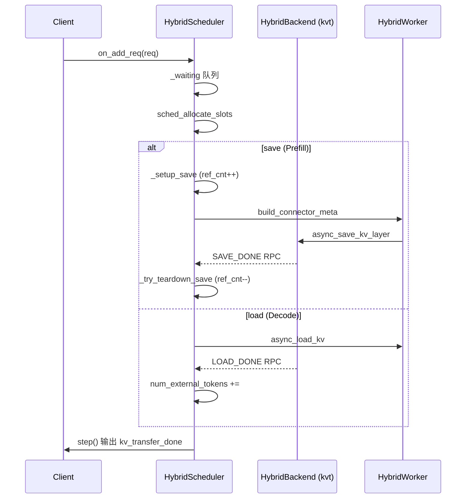
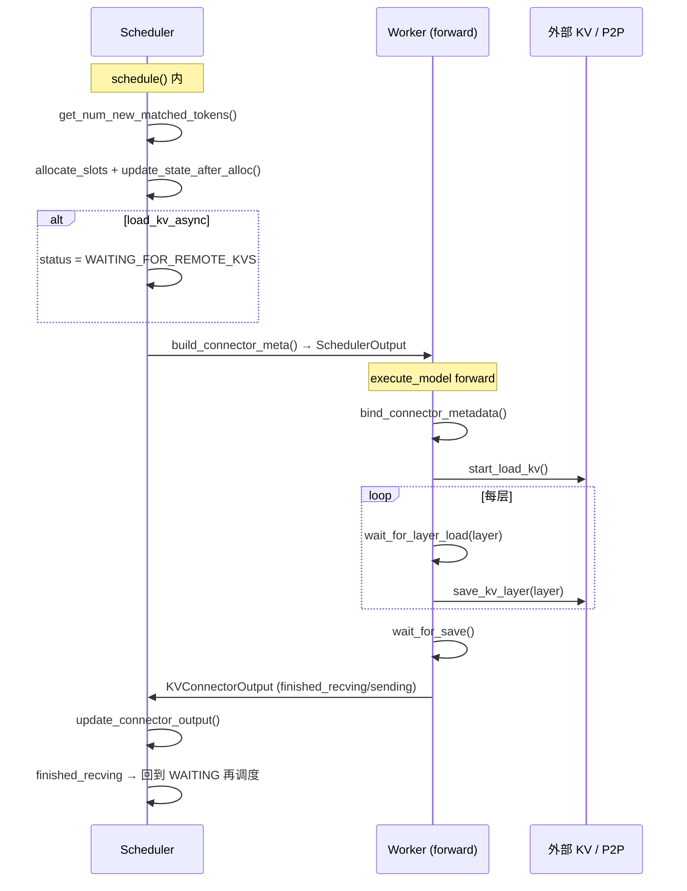
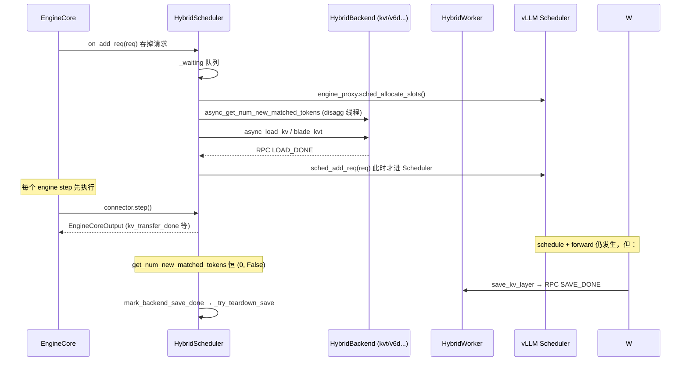

# vLLM HybridConnector 与其他 KV Connector 对比

> 基于 vLLM 仓库 `zero_decode_0_refcnt_block` 分支源码整理（2026-05）。

## 1. 背景：什么是 KV Connector？

在 vLLM v1 架构中，**KV Connector** 负责在 Scheduler 与 Worker 之间协调 KV Cache 的**跨进程/跨节点**加载与保存，是实现 **PD 分离（Prefill-Decode Disaggregation）**、**KV Cache 复用**、**前缀缓存命中** 等能力的基础设施。

所有 Connector 都实现 `KVConnectorBase_V1`（`vllm/distributed/kv_transfer/kv_connector/v1/base.py`），分为两类角色：

| 角色 | 进程 | 职责 |
|------|------|------|
| `KVConnectorRole.SCHEDULER` | Scheduler | 匹配远程 token、分配 block、构建 metadata、管理请求生命周期 |
| `KVConnectorRole.WORKER` | Worker | 根据 metadata 在 forward 中 load/save KV layer |

工厂类 `KVConnectorFactory`（`factory.py`）注册了当前仓库中的主要 Connector：

| Connector 名称 | 模块路径 | 典型用途 |
|----------------|----------|----------|
| **HybridConnector** | `vllm.v1.hybrid_connector` | 生产级 PD 分离、多后端可插拔 |
| V6dObjectConnector | `vllm.distributed...v6d_object_connector` | V6D 对象存储 KV 持久化/共享 |
| NixlConnector | `...nixl_connector` | 基于 NIXL/UCX 的高性能 P2P 传输 |
| MooncakeConnector | `...mooncake_connector` | 基于 Mooncake 的 P2P 传输 |
| P2pNcclConnector | `...p2p_nccl_connector` | NCCL P2P KV 传输 |
| LMCacheConnectorV1 / LMCacheMPConnector | `...lmcache_*` | LMCache 外部 KV 缓存 |
| OffloadingConnector | `...offloading_connector` | GPU↔CPU/磁盘 KV offload |
| MultiConnector | `...multi_connector` | 组合多个 Connector |
| ExampleConnector / DecodeBenchConnector | 测试/示例 |

---

## 2. HybridConnector 的定位：框架，而非单一传输实现

**核心区别**：`HybridConnector` 不是某一种固定的 KV 传输协议，而是一个**面向生产的 PD 分离编排框架**，内部通过 `backend` 配置选择具体的存储/传输实现。

```
                    ┌─────────────────────────────────────┐
                    │         HybridConnector             │
                    │  (KVConnectorBase_V1 + SupportsHMA)│
                    └──────────────┬──────────────────────┘
                                   │
              ┌────────────────────┴────────────────────┐
              │                                         │
    ┌─────────▼─────────┐                    ┌──────────▼──────────┐
    │  HybridScheduler  │◄── RPC/ZMQ ───────►│    HybridWorker     │
    │  (asyncio loop)   │                    │  (asyncio loop)     │
    └─────────┬─────────┘                    └──────────┬──────────┘
              │                                         │
              └────────────────────┬────────────────────┘
                                   │
                    ┌──────────────▼──────────────┐
                    │      HybridBackend          │  ← 可插拔
                    │  (backend 配置选择)        │
                    └──────────────┬──────────────┘
         ┌─────────┼─────────┬─────────┬──────────┼──────────┐
         │         │         │         │          │          │
    PBackend   DBackend  FileBackend  V6dObject  KVS/Mooncake Migration
    (kvt)      (kvt)    (local_file)  Backend    Backend    Backend
```

### 2.1 三层结构

1. **HybridConnector**（`__init__.py:1333`）  
   对外暴露标准 `KVConnectorBase_V1` 接口，根据 role 创建 `HybridScheduler` 或 `HybridWorker`。

2. **HybridScheduler / HybridWorker**  
   - 独立 asyncio 事件循环（`get_hybrid_sched_loop()` / `get_hybrid_worker_loop()`）  
   - 维护请求队列：`_waiting` → `_loading` / `_saving` → `_loaded` / `_saved`  
   - 通过 RPC server 与 Worker 侧协调 save/load 完成信号  
   - 提供 `step()`、`has_requests()`、`on_add_req()` 等**引擎级**生命周期钩子

3. **HybridBackend**（抽象基类 + 多种实现）  
   通过 `kv_connector_extra_config.backend` 选择：

   | backend 值 | 实现类 | 说明 |
   |------------|--------|------|
   | `kvt` | `PBackend` / `DBackend` | blade_kvt，生产 PD 分离主力 |
   | `local_file` | `FileBackend` | 本地文件，调试/测试 |
   | `kvs` | `VineyardKVSBackend` | Vineyard KVS |
   | `mooncake` | `MooncakeKVSBackend` | Mooncake KVS |
   | `v6d_object` | `V6dObjectBackend` | 包装 V6dObjectConnector |
   | `v6d_object+kvt` | `V6dObjectKVTBackend` | V6D + KVT 混合 |
   | `migration` / `kvt+migration` | `MigrationBackend` / `KVTMigration` | 实例迁移 |

配置示例（来自 `examples/online_serving/run_pd_kvt_serve.sh`）：

```json
{
  "kv_connector": "HybridConnector",
  "kv_role": "kv_producer",
  "kv_connector_extra_config": {
    "naming_url": "file:/path/to/naming",
    "kvt_inst_id": "prefill",
    "backend": "kvt"
  }
}
```

---

## 3. 与其他 Connector 的逐项对比

### 3.1 vs V6dObjectConnector

| 维度 | HybridConnector | V6dObjectConnector |
|------|-----------------|-------------------|
| 架构 | 框架 + 可插拔 Backend | 单体实现（Scheduler + Worker 内聚） |
| 存储介质 | 取决于 backend（kvt/v6d/...） | V6D 分布式对象存储 |
| HMA 支持 | ✅ `SupportsHMA` | ✅ `SupportsHMA` |
| PD 编排 | 内置 waiting/loading/saving 状态机、block ref_cnt | 较薄，聚焦 store/load |
| 与引擎集成 | `engine_proxy` 深度耦合 Scheduler | 标准 connector 接口 |
| 关系 | `backend=v6d_object` 时**复用** V6dObjectConnector 逻辑 | 可独立使用，也可被 Hybrid 包装 |

`V6dObjectBackend`（`v6d_object_backend.py`）内部直接持有 `V6dObjectConnectorScheduler` 和 `V6dObjectConnectorWorker`，在 Hybrid 的异步 RPC 框架下运行。

**何时选 V6dObjectConnector 单独使用**：只需 V6D 对象存储、不需要 blade_kvt PD 编排时。  
**何时选 HybridConnector + v6d_object**：需要 Hybrid 的请求生命周期管理、abort 协调、与 kvt 组合等。

### 3.2 vs NixlConnector / MooncakeConnector / P2pNcclConnector

| 维度 | HybridConnector | Nixl / Mooncake / P2pNccl |
|------|-----------------|---------------------------|
| 传输层 | backend 决定（kvt=R DMA 等） | 各自专用库（NIXL/UCX、Mooncake、NCCL） |
| HMA 支持 | ✅ | ❌（未实现 `SupportsHMA`） |
| `step()` 异步步进 | ✅ 有独立 disagg 逻辑 | ❌ |
| `on_add_req()` | ✅ | ❌ |
| `request_finished_all_groups` | ✅（PD finish 协调） | 仅 `request_finished`（单组 block） |
| 生产配置 | 大量 qwen/kimi 等 util 配置 | 文档示例、社区场景 |

Nixl/Mooncake 更偏向**通用 disaggregated prefilling demo**：同一主机两 GPU、通过 side channel 握手传 KV。  
HybridConnector 面向**大规模在线服务**：命名服务、实例 ID、gamma token、远程 decode 输出协调等。

### 3.3 vs OffloadingConnector

| 维度 | HybridConnector | OffloadingConnector |
|------|-----------------|---------------------|
| 目标场景 | 跨节点 PD、远程 KV 命中 | 单节点 GPU 内存不足时 offload 到 CPU/磁盘 |
| `prefer_cross_layer_blocks` | 取决于 backend | ✅ True |
| 与 Prefix Cache | 通过 kvt/v6d 等 | 通过 OffloadingManager + KV events |

两者解决的问题不同：Offloading 是**容量扩展**，Hybrid 是**算力分离 + KV 共享**。

### 3.4 vs LMCacheConnector

LMCache 对接外部 LMCache 服务做 KV 复用；HybridConnector 的 kvt backend 对接 blade_kvt（阿里内部 KV 传输栈）。  
LMCache 无 HMA、无 PD 专用 `step()` 循环。

### 3.5 vs MultiConnector

`MultiConnector` 在**多个已注册 Connector 之间**做组合；`HybridConnector` 在**单一 Connector 接口下**组合多种 Backend。  
MultiConnector 仍受 HMA 约束：若启用 HMA，子 connector 也必须支持 `SupportsHMA`。

---

## 4. HybridConnector 的核心机制

### 4.1 engine_proxy：与 Scheduler 深度集成

`engine_proxy.py` 定义 HybridConnector 与 vLLM Engine 的**唯一交互面**：

- `sched_allocate_slots()` — 为 load/save 分配 KV block
- `sched_acquire_blocks()` / `sched_free_blocks()` — 传输期间 block 引用计数保护
- `sched_add_req()` / `sched_finish_req()` — 请求入队/结束
- `wakeup_core()` — 有异步工作时唤醒 EngineCore

注释明确：BladeLLM/SGLang 只需实现该文件的接口即可对接 HybridConnector。

### 4.2 异步 PD 流水线



`_step_waiting` 注释：**load = decode，save = prefill**。

### 4.3 Block 生命周期与 ref_cnt

PD 传输期间，P 节点通过 `_setup_save` → `sched_acquire_blocks` 防止 KV block 被 scheduler 回收；传输完成后 `_try_teardown_save` → `sched_free_blocks` 释放。

这与 standalone connector 的差异：Hybrid **显式管理** block 在异步 I/O 完成前的存活，并处理 abort、preempt 等边界（见仓库内 `docs/kvtbackend_block_leak_analysis.md`）。

### 4.4 HMA（Hybrid Memory Allocator）

当模型同时有 **Attention KV** 和 **Mamba/GDN** 等多种 KV cache group 时，需启用 HMA。工厂在创建 connector 时检查：

```python
# factory.py
if hma_enabled and not supports_hma(connector_cls):
    raise ValueError(...)
```

`SupportsHMA` 要求实现 `request_finished_all_groups(request, block_ids: tuple[list[int], ...])`，对每个 cache group 的 block 做统一收尾。

HybridConnector 对 hybrid 模型（`is_hybrid=True`）还校验 mamba cache 仅支持 `light` 模式。

### 4.5 引擎侧特殊处理

代码中对 `HybridConnector` 有多处专门分支，说明它是**一等公民**而非普通 connector：

- **Scheduler preempt**（`scheduler.py:596`）：consumer 节点 preempt 时直接 abort，不走普通 preempt；producer 则保留请求。
- **EngineCore abort**（`core.py:559`）：Hybrid 的 abort 由 connector 内部处理，不再调用 `scheduler.finish_requests`。
- **KVCacheManager**（`kv_cache_manager.py:160`）：`is_hybrid_connector` 标志影响 block 管理逻辑。

### 4.6 扩展能力

- **Bypass task**（`VLLM_ENABLE_BYPASS_TASK`）：ZMQ pub/sub 向远程 substep 下发 metadata  
- **Migration backend**：实例间 KV 迁移  
- **TurboQuant / FP8**：kvtbackend 内对量化 KV 的支持  
- **远程 decode 输出**（`P_REMOTE_DECODE`）：P 节点 finish 与 KV 保存完成的时序协调（`request_finished_all_groups`）

---

## 5. HybridConnector 的好处（总结）

| 好处 | 说明 |
|------|------|
| **统一 PD 入口** | 一套 `HybridConnector` 配置覆盖 kvt、v6d、file、迁移等场景，运维与代码路径统一 |
| **生产级生命周期** | `step()`/`has_requests()` 驱动异步 I/O，与 EngineCore 事件循环协同，避免阻塞 scheduler |
| **Block 安全** | 传输期 ref_cnt 保护 + abort/preempt 专门逻辑，降低 block 泄漏与 use-after-free |
| **HMA / 混合模型** | 原生支持 Attention+Mamba/GDN 多 group KV，满足 Qwen3-Next 等架构 |
| **可插拔 Backend** | 新传输/存储只需实现 `HybridBackend` 接口，无需改 Scheduler/Worker 框架 |
| **深度引擎集成** | engine_proxy 抽象使 BladeLLM 等 fork 可复用同一套 PD 逻辑 |
| **复用成熟组件** | `v6d_object` backend 直接包装 `V6dObjectConnector`，避免重复实现 |

---

## 6. 何时选用哪种 Connector？

```
需要 PD 分离在线服务（Prefill/Decode 分机）？
├── 是 → HybridConnector + backend=kvt（生产默认）
│        ├── 还要 V6D 持久化/共享？ → backend=v6d_object 或 v6d_object+kvt
│        └── 调试/无网络？ → backend=local_file
├── 只需 V6D 对象存储、标准 connector 流程？ → V6dObjectConnector
├── 单机 demo / NIXL 生态？ → NixlConnector
├── GPU 内存不够、单节点 offload？ → OffloadingConnector
├── 对接 LMCache 服务？ → LMCacheConnectorV1
└── 组合多种 connector？ → MultiConnector
```

---

## 7. 关键源码索引

| 内容 | 路径 |
|------|------|
| HybridConnector 主类 | `vllm/v1/hybrid_connector/__init__.py` |
| Backend 选择 | `vllm/v1/hybrid_connector/__init__.py` → `_get_backend_cls()` |
| 引擎接口 | `vllm/v1/hybrid_connector/engine_proxy.py` |
| KVT PD 实现 | `vllm/v1/hybrid_connector/kvtbackend.py` |
| V6D 包装 | `vllm/v1/hybrid_connector/v6d_object_backend.py` |
| Connector 工厂 | `vllm/distributed/kv_transfer/kv_connector/factory.py` |
| 基类与 HMA | `vllm/distributed/kv_transfer/kv_connector/v1/base.py` |
| V6dObjectConnector | `vllm/distributed/kv_transfer/kv_connector/v1/v6d_object_connector.py` |
| Block 泄漏分析 | `docs/kvtbackend_block_leak_analysis.md` |
| PD 部署示例 | `examples/online_serving/run_pd_kvt_serve.sh` |

---

## 8. 配置速查

**Prefill 节点（producer）**：

```bash
--kv-transfer-config '{
  "kv_connector": "HybridConnector",
  "kv_role": "kv_producer",
  "kv_connector_extra_config": {
    "naming_url": "file:/path/to/naming",
    "kvt_inst_id": "prefill",
    "backend": "kvt"
  }
}'
```

**Decode 节点（consumer）**：

```bash
--kv-transfer-config '{
  "kv_connector": "HybridConnector",
  "kv_role": "kv_consumer",
  "kv_connector_extra_config": {
    "naming_url": "file:/path/to/naming",
    "kvt_inst_id": "decode",
    "backend": "kvt"
  }
}'
```

启用 HMA 的混合模型**不要**加 `--disable-hybrid-kv-cache-manager`；若使用不支持 HMA 的 connector（如 NixlConnector），则必须禁用 HMA。

---

## 9. HybridConnector 与社区标准接口的差异（重点）

你的印象是对的：**HybridConnector 虽然继承 `KVConnectorBase_V1`，但并没有完整走社区设计的 KV 传输闭环**，而是在其之上叠加了一套独立的 PD 编排层（`HybridScheduler` / `HybridWorker` / `engine_proxy` / 私有 RPC）。

下面按「社区约定」vs「Hybrid 实际行为」对照，并说明原因。

### 9.1 社区标准 KV 传输闭环（Nixl / V6dObject / Mooncake 等）

社区 Connector 的典型数据流：



关键契约：

- **匹配时机**：在 `Scheduler.schedule()` 里同步调用 `get_num_new_matched_tokens`。
- **完成通知**：Worker 在 forward 结束时通过 `get_finished()` 填入 `KVConnectorOutput`，Scheduler 用 `update_connector_output()` 更新 `finished_recving_kv_req_ids`。
- **异步加载状态**：`load_kv_async=True` 时请求进入 `WAITING_FOR_REMOTE_KVS`，等 recv 完成再调度。
- **Block 延迟释放**：`request_finished()` 返回 `True` 表示异步 save 未完成，block 等 `get_finished()` 里 `finished_sending` 再 free。

### 9.2 HybridConnector 实际走的通路



**请求入口被改写**：`EngineCore.add_request` 若 `on_add_req` 返回 `True`，则**不会**调用 `scheduler.add_request`，而是由 Hybrid 在 KV 就绪后通过 `sched_add_req()` 塞回 Scheduler（`engine_proxy.py:175`）。

### 9.3 接口逐项对照表

| 社区接口 (`KVConnectorBase_V1`) | 社区 Connector 典型行为 | HybridConnector 行为 | 是否「标准」 |
|--------------------------------|------------------------|---------------------|-------------|
| `get_num_new_matched_tokens` | schedule 时查询远程命中，可返回 `(None, _)` 表示待定 | **Scheduler 侧恒返回 `(0, False)`**；真实逻辑在 `HybridBackend.async_get_num_new_matched_tokens` + `_on_add_req` | ❌ 桩函数 |
| `update_state_after_alloc` | 记录待加载 token / block 绑定 | **空实现**；真实逻辑在 `async_update_state_after_alloc` | ❌ 桩函数 |
| `build_connector_meta` | 从本轮 scheduled requests 收集 load/save 元数据 | 构建 `HybridMetadata` + `HCSchedOutput`（含 `hc_aborted_*`、`hc_stepid` 等扩展字段） | ⚠️ 格式/语义不同 |
| `on_add_req` | 默认 `False`（不拦截） | **`True` 时吞请求**，进入 `_waiting` | ✅ 社区有定义，但只有 Hybrid 重度使用 |
| `step()` | 默认 `None` | **核心驱动**：`_step_saved/_step_waiting/_step_loaded/_step_aborting` | ✅ 社区有定义，Hybrid 依赖 |
| `has_requests()` | 默认 `False` | 查询多条内部队列是否有活 | ✅ Hybrid 用于 EngineCore 空转/阻塞逻辑 |
| `on_abort_req` | 可选 | 完整 abort 状态机 + EngineCore 对 Hybrid **不再** `finish_requests` | ⚠️ 语义更深 |
| `request_finished` | 单 KV group 结束回调 | **未实现**（走 `SupportsHMA.request_finished_all_groups`） | ⚠️ HMA 扩展 |
| `request_finished_all_groups` | HMA 多 group 结束 | 实现但**恒 `delay_free_blocks=False`**，用 `sched_acquire_blocks` 管生命周期 | ⚠️ 接口用了，语义不同 |
| `update_connector_output` | 消费 `KVConnectorOutput` | **继承基类空实现**，不走 `finished_recving_kv_req_ids` 路径 | ❌ 未用 |
| `get_finished` | forward 结束返回 sending/recv 完成集 | **继承基类 `(None, None)`**；完成靠 Scheduler↔Worker **私有 RPC** | ❌ 未用 |
| `wait_for_layer_load` | 层间流水线同步 | **`pass`（空）** | ❌ 未用 |
| `wait_for_save` | forward 退出前等待全部 save | **`pass`（空）** | ❌ 未用 |
| `bind_connector_metadata` | 设置 `_connector_metadata` | Worker 用自有 `_meta` + `bind_backend_metadata`；**Scheduler 角色不 bind** | ⚠️ 部分一致 |
| `start_load_kv` / `save_kv_layer` | 在 forward 上下文触发传输 | 有实现，但投递到 **独立 asyncio 线程** + RPC 回调 Scheduler | ⚠️ 触发点同，完成路径不同 |
| `register_cross_layers_kv_cache` | 统一跨层 KV 布局 | **HybridConnector 未暴露**；`v6d_object` backend 内部可能用 | ❌ 门面未实现 |
| `set_host_xfer_buffer_ops` | Host 缓冲区拷贝（Nixl） | 未实现 | ❌ |
| `get_handshake_metadata` / `set_xfer_handshake_metadata` | P/D 握手（Nixl） | 未实现；kvt 用 naming_url / blade_kvt | ❌ |
| `get_block_ids_with_load_errors` | 上报加载失败 block | 默认空集；错误走 abort / `IoRet.ex` | ❌ |
| `take_events` / stats / prom metrics | 可观测性 | 默认无 | ❌ |

### 9.4 代码证据（桩函数与空操作）

**Scheduler 侧社区接口被短路**（`HybridScheduler`）：

```python
# vllm/v1/hybrid_connector/__init__.py
def get_num_new_matched_tokens(self, request, num_computed_tokens) -> tuple[int, bool]:
    return 0, False  # 从不走 WAITING_FOR_REMOTE_KVS 社区路径

def update_state_after_alloc(self, request, blocks, num_external_tokens, **kwargs):
    assert num_external_tokens == 0
    return  # no-op
```

**Worker 侧流水线同步被禁用**（`HybridConnector`）：

```python
def wait_for_layer_load(self, layer_name: str) -> None:
    return  # pass

def wait_for_save(self):
    return  # pass
```

**真实匹配在 disagg 线程**（`HybridScheduler._on_add_req`）：

```python
rmt = await self._backend.async_get_num_new_matched_tokens(req, local)
ioret = await self._backend.async_update_state_after_alloc(req, kvblks, rmt)
# ...
sched_add_req(req)  # KV 就绪后才进入社区 Scheduler
```

**社区 `get_finished` 闭环未使用**（`kv_connector_model_runner_mixin.py` 仍会在 forward 后调用，但对 Hybrid 无效果）：

```python
# base.py 默认
def get_finished(self, finished_req_ids) -> tuple[set | None, set | None]:
    return None, None

# scheduler.py 依赖 KVConnectorOutput 的路径
def _update_from_kv_xfer_finished(self, kv_connector_output):
    self.connector.update_connector_output(kv_connector_output)  # Hybrid: no-op
    for req_id in kv_connector_output.finished_recving or ...:
        self.finished_recving_kv_req_ids.add(req_id)
```

Hybrid 改用 RPC 头：`LOAD_DONE_REQ` / `SAVE_DONE_REQ`（`__init__.py` 中 `0x20181222` 等），在 `_on_load_done` / `_do_save_done` 里更新 `_loaded` / `_saved` 队列。

### 9.5 超出社区接口的「私有扩展」

| 扩展 | 位置 | 作用 |
|------|------|------|
| `engine_proxy.py` | `sched_allocate_slots`, `sched_acquire_blocks`, `sched_free_blocks` | **绕过** schedule 内的 alloc 流程，为 PD 单独分配/保护 block |
| `HybridBackend` 抽象 | `async_*` + `get_operations` + `build_backend_meta` | 社区只有同步 Scheduler API；Hybrid 在 backend 层定义第二套异步协议 |
| `HCSchedOutput` | 继承 `SchedulerOutput` | 向 worker 传递 `hc_aborted_load/save`、`hc_stepid` 等 |
| 全局单例 | `_g_scheduler`, `_g_worker`, `_g_core` | 跨线程/RPC 回调定位对象 |
| `wakeup_core()` | 向 input_queue 塞假 ABORT 请求 | 在无 model step 时唤醒 EngineCore 执行 `connector.step()` |
| `core_init` / `worker_init` | 独立 asyncio 线程 + `RpcServer` | 与 vLLM 主循环并行跑 KV I/O |
| `mark_backend_save_done` | kvtbackend 传输完成回调 | 替代社区 `get_finished().finished_sending` |
| `send_bypass_task` / bypass ZMQ | `VLLM_ENABLE_BYPASS_TASK` | 跨实例 substep 下发 metadata |
| `hybridsched()` / `hybridworker()` | 模块级 getter | 供 backend、migration 直接访问内部状态 |

### 9.6 为什么故意不走社区接口？

结合代码注释与工程上下文，原因可归纳为：

**1. PD 与 Scheduler step 解耦**

社区模型把「查远程 KV → 等加载完成 → 调度」绑在同一个 `schedule()` 循环里（`WAITING_FOR_REMOTE_KVS`）。生产 PD 需要：

- 请求到达后**立即**在独立线程发起 blade_kvt / RDMA；
- GPU forward 与 KV 传输**重叠**；
- 传输完成后再 `sched_add_req`，避免 Scheduler 被远程 I/O 阻塞。

因此 `get_num_new_matched_tokens` 在 Scheduler 入口必须是桩，真实工作放在 `on_add_req` → `_waiting` → disagg 线程。

**2. 完成通知机制与 blade_kvt 不匹配**

kvt backend 完成后发的是 `SEND_DONE_REQ`，**不会**填充 `KVConnectorOutput.finished_sending`（见 `docs/kvtbackend_block_leak_analysis.md`）。若强行用社区 `get_finished` + `update_connector_output`，Scheduler 无法感知传输结束。

故采用 **Scheduler↔Worker 私有 RPC** + `mark_backend_save_done` + `connector.step()` 产出 `EngineCoreOutput`。

**3. Block 生命周期与 `delay_free_blocks` 不兼容**

社区模式：`request_finished() → True` → 等 `get_finished` → `_free_blocks`。

Hybrid 模式：`sched_acquire_blocks`（ref_cnt++）→ 传输完成 → `_try_teardown_save` → `sched_free_blocks`。

注释明确说明对 remote decode **故意不用** `delay_free_blocks=True`，防止 `mark_saved` 未触发时泄漏（`__init__.py:1476`）。这与社区异步 free 假设冲突。

**4. 远程 Decode / DashLLM 产品语义**

`request_finished_all_groups` 不用于延迟 free，而用于协调 `kv_transfer_done` / `kv_transfer_pending` 与 P 节点 finish 的时序（谁先谁后决定何时向客户端吐 output）。这是上层代理（如 `dash_proxy.py`）的需求，社区接口无对应字段。

**5. 历史与多引擎移植**

`engine_proxy.py` 开头写明：与 Engine 的交互**只**通过该文件，便于 BladeLLM/SGLang 移植。社区 `KVConnectorBase_V1` 当时尚未覆盖：

- `on_add_req` 吞请求；
- `step()` 返回 `EngineCoreOutput`；
- HMA 多 group finish。

Hybrid 在 vLLM 社区 API 之上「贴了一层」，而不是重写 backend 去完全适配社区闭环。

**6. 层间流水线暂时放弃**

`wait_for_layer_load` / `wait_for_save` 为空，因 kvt 等 backend 按**整请求或 blade 协议批次**完成，且 save 完成信号走 RPC 而非 forward finally。社区层间流水线接口对当前 backend 无收益，实现成本高。

### 9.7 与「包装 V6dObjectConnector」的关系

`backend=v6d_object` 时，`V6dObjectBackend` **内部**使用 `V6dObjectConnectorScheduler/Worker` 的 `async_get_num_new_matched_tokens` 等，仍被 Hybrid 的 RPC/step 外壳包一层，**不会**变回纯社区 V6dObjectConnector 的 `KVConnectorOutput` 闭环。

这也是 e2e 测试标题写「via HybridConnector」的原因：测的是 Hybrid 路径，不是 standalone `V6dObjectConnector`。

### 9.8 对开发的启示

| 如果你想… | 应该遵循… |
|----------|----------|
| 写一个通用、可 upstream 的 Connector | 完整实现社区闭环：`get_num_new_matched_tokens` → `WAITING_FOR_REMOTE_KVS` → `get_finished` → `update_connector_output` |
| 接入现有 Hybrid / kvt PD 集群 | 实现 `HybridBackend` 的 `async_*` / `get_operations`，并保证 `mark_backend_save_done` 等回调 |
| 从 NixlConnector 迁移到 Hybrid | **不能**只换 config：请求入口、完成通知、block free 三条路径都不同 |
| 调试「加载完不进 Scheduler」 | 查 `_waiting` → `_on_add_req` → `_loaded` → `sched_add_req`，而非 `finished_recving_kv_req_ids` |

### 9.9 社区接口符合度小结

```
社区 KVConnector 契约符合度（HybridConnector）:

Scheduler 匹配/分配:  ░░░░░░░░░░  桩 + engine_proxy 替代
Worker forward 传输:  ██████░░░░  有 load/save，完成路径非 KVConnectorOutput
异步完成通知:        ░░░░░░░░░░  RPC + step() 替代 get_finished
Block 延迟释放:        ░░░░░░░░░░  ref_cnt 替代 request_finished(True)
HMA 多 group:          ████████░░  有 request_finished_all_groups，语义定制
可观测性/握手:        ░░░░░░░░░░  基本未接
```

**结论**：HybridConnector 是「**继承社区类型 + 自建 PD 运行时**」；社区接口更多是**类型兼容与挂载点**，而非实际 I/O 控制面。理解这一点后，读 kvt/v6d 代码应优先跟 `HybridScheduler` 状态和 RPC，而不是只跟 `KVConnectorModelRunnerMixin` 的 forward 钩子。
