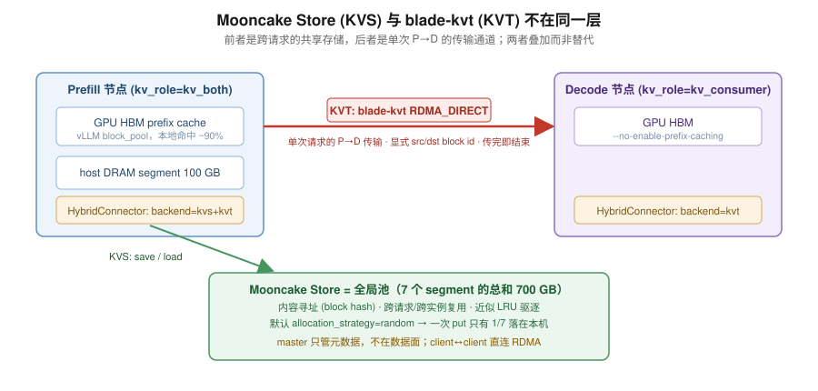

# 00 · 背景与动机

## 1. 从一个问题变成三个问题

起点是一个很具体的工程问题。我们在内部 vLLM 上把**社区 Mooncake Store 接成了 HybridConnector 的一个
KVS backend**，于是同一套部署里同时有两条 KV 通路：

- **KVT**（blade-kvt）：单次请求的 Prefill → Decode 传输
- **KVS**（Mooncake Store）：跨请求、跨实例的共享 KV 存储



有了共享 store 之后，一个自然的问题是：**PD 分离下要不要做 cache-aware 的 Prefill 节点选择？**

朴素直觉说要。把请求发给「已经持有这段前缀的那个 P 节点」，就能省一次 store 读。
agentic 负载尤其应该受益——同一个会话的相邻两轮共享几乎全部前缀，而轮次间隔只有几秒。

但四轮实验下来，这个问题被逐步改写成了三个更精确的问题：

1. **cache-aware 调度的收益取决于什么？**
   答案不是「命中率高低」，而是**选错节点的代价**。
2. **什么条件下这个代价才够大？**
   store 读昂贵时——窄带宽，或者 store 饱和到不再保证命中。
3. **我们之前测到的收益是真的吗？**
   四次结论里三次是基础设施缺陷伪装的。

这一系列的大部分篇幅，其实是在回答第 3 个问题。

## 2. 为什么值得较真

因为这类实验有一个结构性的困难：**基础设施缺陷比策略差异更容易主导结果**。

调度策略的收益量级通常在个位数百分比。而一条网卡绑错、一个护栏阈值失效、一个 store 贴着驱逐水位，
带来的偏差都是几十个百分点。**信号比噪声小一个数量级**，所以任何一次没有对照的测量都不可信。

我们真实经历过：同一个 `prefix_affinity` 策略，在三次实验里分别**落后 37%、领先 27%、领先 7%**。
如果只跑一次就写结论，三次都会得出不同的、且都是错的判断。

## 3. 环境与拓扑

```
test1  10.56.46.228   p0:8000(gpu0,1)  p1:8001(gpu2,3)  + mooncake master:50051
test2  10.56.47.155   p2:8000          p3:8001
test3  10.56.44.17    p4:8000          p5:8001
test4  10.56.46.239   p6:8000          d0:8100
```

4 台机器 × 4 张 GB200(189GB) = 16 卡，恰好是 8 个 tp2 服务 = **7 Prefill + 1 Decode**。
共享盘 `/dashscope/caches/workspace/llx/`，实验目录 `runs/mcstore/`。

配置形态：

| | Prefill | Decode |
|---|---|---|
| `kv_role` | `kv_both`（mooncake KVS 强制要求） | `kv_consumer` |
| `backend` | `kvs+kvt` | `kvt` |
| prefix caching | 开 | 关 |
| store segment | 100 GB host DRAM | 不挂 store |

请求协议：**客户端只打 D**，D 通过 naming service 自己找 P 拉 prefill；
要指定 P 就在给 D 的 `kv_transfer_params` 里放 `remote_host` + `remote_port`（= P 的 web_port + 20000）。

### 两个必须记住的环境事实

**跳板机约 1/3 概率失败**（`channel 0: open failed: connect failed: Bad file descriptor`）。
所有编排必须带重试，而且**绝不能用 `2>/dev/null` 屏蔽 ssh 错误**——我们因此有过一次静默派发失败
却显示成功。另外 test1 无法免密 ssh 到 test2/3/4，所以跨机编排只能从笔记本驱动。

**共享盘是单流限速，不是总带宽限速。**

| 并发流 | 单机速率 | 4 机聚合 |
|---|---|---|
| 1（`cp`） | 71 MB/s | — |
| 8 | 452 MB/s | — |
| 12 | ~490 MB/s | **~2.3 GB/s** |

这个发现的影响超出预热本身：**vLLM 的 safetensors 加载器单流读 280 GB 模型要 90 分钟，
其中绝大部分是白等**。我们的绕法是先 12 并行拷到 `/dev/shm`，再用 `MODEL_ROOT=/dev/shm/models`
让 vLLM 从内存读。真正的红利是**让「重启整个集群」从一小时变成 3 分钟**——而交替重复的对照实验
本来就需要反复重启，这从「不可行」变成了「默认做法」。

## 4. 两个阶段的模型

| | 阶段一 | 阶段二 |
|---|---|---|
| 模型 | Qwen3-32B | qwen3-150b-a14b-256k-1106 |
| 架构 | dense | MoE（128 experts top-8），**非 hybrid** |
| KV/token | 256 KiB（8 KV head, bf16） | **60 KiB**（4 KV head, fp8） |
| 权重 | bf16 原生 | **BF16 checkpoint + 在线 fp8 量化** |
| 上下文 | 26k（8 轮） | 46k p50 / 87k max（24 轮） |

阶段二模型的几个关键事实（踩过才知道）：

- **不是 fp8 权重，是 BF16 checkpoint**（`quantization_config: {}`，index 里没有任何 scale 键，
  280.3 GiB / 150B 参数 = 1.87 字节/参数）。fp8 只能在线量化：
  `--quantization fp8` + `VLLM_QUANTIZATION_LAYER_WISE=1`（否则 280 GB 的 BF16 加载峰值）。
- **`max_position_embeddings` 只有 35840，`rope_scaling: null`，但 `rope_theta = 1e7`**。
  开到 256k 用 `--hf-overrides '{"max_position_embeddings":262144}'`——这是生产的做法，
  比 `VLLM_ALLOW_LONG_MAX_MODEL_LEN` 干净。
- **fp8 不需要 BLADNN**（`VLLM_FP8_USE_BLADNN=0`）；BLADNN 只对 fp4 是硬依赖。
- **非 hybrid**（`Qwen3MoeForCausalLM`，无 linear attention 层），所以 mooncake store 那条路能走通——
  hybrid 模型需要 M2~M6 那批工作才能支持。
- 无害告警：`No module named 'triton_kernels.matmul_ogs'`（gpt-oss 专用 triton MoE 路径），
  fp8 MoE 走 cutlass/DeepGEMM 不受影响。

### 一个必须修正的直觉

阶段二换成更长的上下文（26k → 46k~87k）时，我预期「上下文更长 → store 成本更高」。**这不成立**：

```
Qwen3-32B  : 8 KV head × bf16 → 256 KiB/token → 26k 上下文 = 6.4 GB/请求
qwen3-150b : 4 KV head × fp8  →  60 KiB/token → 85k 上下文 = 5.1 GB/请求
```

**每请求要搬的字节数反而下降了。** KV 密度差 4 倍，把上下文长度的增长完全抵消掉。
所以要拉开 store-vs-local 的差距，只能靠压小本地 HBM 或收窄 store 带宽，**不能指望上下文变长**。
