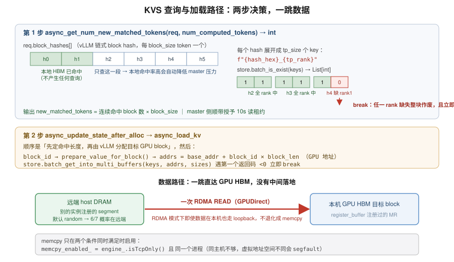
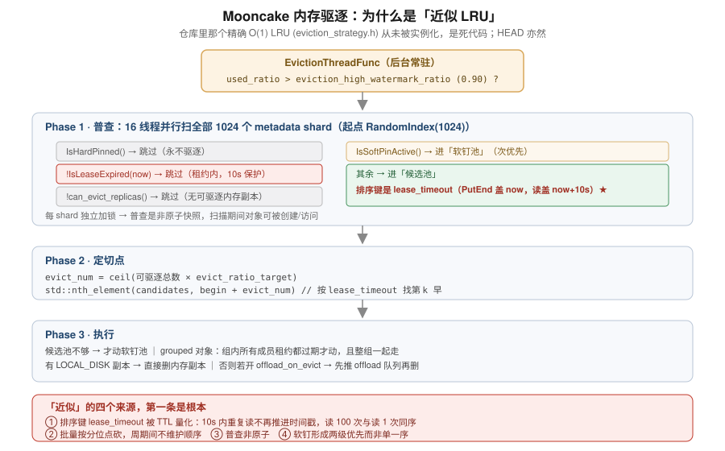

# 01 · Store 架构与源码

本章是读源码的产物。版本信息先说清楚，否则读错代码：

```
我们跑的      0.3.12.post1 (git: 6041a60, 2026-07-25)
              查法：strings /usr/local/lib/python3.12/dist-packages/mooncake/mooncake_master
                    | grep -E "^v?0\.3\."
源码 clone     ecs ~/codes/Mooncake，HEAD 是 0.3.13 (26dd3ed9)
差距          268 commits, 334 files, +61,244 / −15,622 行
```

**读我们那一版必须用 `git show 6041a609:mooncake-store/src/master_service.cpp`**
（8,956 行），别直接读 HEAD（13,262 行）。我第一次就读错了，把 HEAD 里 `#3118` 之后才有的
`compact_frontier_prebypass` 当成了我们的实现。

## 1. KVS 与 KVT 不在同一层

| 维度 | Mooncake Store（KVS） | blade-kvt（KVT） |
|---|---|---|
| 职责 | 分布式 KV Cache 存储 | 实例间实时 KV 传输 |
| 数据寻址 | block hash（内容寻址） | request + 源/目标实例 + 显式 src/dst block ID |
| 生命周期 | 跨请求、跨轮次、跨实例保留，直到淘汰 | 一次 P→D 传输完成即结束 |
| 容量扩展 | 是，增加集群级 DRAM 容量 | 否，只搬运已有 KV |
| 前缀查询 | 能按 hash 查最长命中前缀 | 不做内容寻址式 lookup |
| 是否要求 P/D 同时在线 | 不要求，可时间上解耦 | 要求双方实时协调 |

所以两者是**叠加而非替代**。想要跨轮次高命中率，不能用 Mooncake 替换 blade-kvt，
而是「保留 blade-kvt 做低延迟 P→D 直传，再加 Mooncake KVS 做跨请求共享」。
内部 vLLM 的 `backend="kvs+kvt"` 就是这个组合，与社区
`MultiConnector(MooncakeConnector + MooncakeStoreConnector)` 是同一种分层设计。

## 2. 查询路径的确切输入输出

代码：`vllm/v1/hybrid_connector/mooncake_kvsbackend.py`（父类，调度器侧逻辑）
+ `mooncake_store_kvsbackend.py`（我们基于 PyPI 标准 API 的实现）。



### 第 1 步 `async_get_num_new_matched_tokens(req, num_computed_tokens) -> int`（`:448`）

```
输入  req.block_hashes[]    vLLM 算好的链式 block hash，每 block_size token 一个
      num_computed_tokens   本地 HBM 已命中数（必须是 block_size 整数倍）

过程  1. 短路：should_load 为假，或剩余未算 < block_size → 直接返回 0
      2. 只取 [num_computed_blocks, +num_uncomputed_blocks) 这一段 hash
      3. 每个 hash 展开成 tp_size 个 key：f"{hash_hex}_{tp_rank}"
      4. store.batch_is_exist(keys) → List[int]
      5. 按 tp_size 分组，组内全部 rank 为 1 才算命中，遇第一个不全 1 立即 break

输出  new_matched_tokens = 连续命中 block 数 × block_size
```

三条决定开销的性质：

- **只查本地未命中的那一段** → 本地命中率高会自动降低 master 压力。
  这是后面 master 扩展性分析的关键。
- **key 数 = 未命中 block 数 × tp_size**。256k 上下文 / block_size 64 / tp2 = **8,192 key/请求**。
- **前缀语义 + 全 rank 要求**：遇断即停；任一 rank 缺失整块作废（因为 KV 按 rank 切分）。

### 第 2 步 `async_update_state_after_alloc` → `async_load_kv`

顺序是**先定命中长度，再由 vLLM 分配目标 GPU block**，然后：

```python
_blocks_to_kv():  block_id   → prepare_value_for_block() → (addrs[], sizes[])
                              # 各层 view 的 base_addr + block_id × block_len，是 GPU 地址
                  block_hash → key_for_hex() → key
store.batch_get_into_multi_buffers(keys, addrs, sizes)
# 遇第一个返回码 <0 立即 break —— 前缀留洞会被当有效 KV 读出去污染输出
```

### 数据路径：一跳直达 GPU HBM

```
远端 host DRAM（别的实例的 mooncake segment）
      │  一次 RDMA READ（GPUDirect）
      ▼
本机 GPU HBM 的目标 block
```

没有中间落地。`local_buffer_size=1GB` 那个参数不在这条路上——它是给非零拷贝 API
（普通 `put`/`get`）用的暂存区，`batch_get_into_multi_buffers` /
`batch_put_from_multi_buffers` 这对零拷贝接口绕过它。

**RDMA 模式下即使数据就在本机也走 RDMA loopback，不退化成 memcpy**：

```cpp
// transfer_task.cpp
memcpy_enabled_ = engine_.isTcpOnly();     // 只有 TCP-only 环境才启用

bool canUseLocalMemcpy(endpoint) {
    return memcpy_enabled_ &&
           (isSameProcessEndpoint(endpoint, local_hostname_) || ...);
}
// 注释：Same host is not enough: two processes on the same host share an IP but
//       have distinct virtual address spaces, so a memcpy on a peer process's
//       address would segfault.
```

两个条件都很严：必须是 TCP-only 环境，且必须是**同一个进程**（同主机不够）。
这是一个已知的可优化点，也是后面判断 `local_first` 是否值得的关键输入。

### `VLLM_KVS_ON_MIN_LENGTH` 的正确取值

```python
def should_load(req):
    return not (req.num_prompt_tokens <= VLLM_KVS_ON_MIN_LENGTH + 1)
```

默认 2048。**理论下界是 `block_size + 1`**：vLLM 故意让最后一个 token 不参与 hash
（`(num_tokens - 1) // block_size`），所以 `num_prompt_tokens ≤ block_size` 时得到 0 个 hash block、
必然查不中——代码里那个 `+1` 就是这个偏移。

**但按收益应该设 `≥ 2 × block_size`**：命中 1 个 block 只省 `block_size` 个 token 的重算，
却要付 `tp_size` 个 key 的 RPC + master 侧的租约写锁，不划算。
生产的 2048 相当于「至少能省 32 个 block 才去查」。

## 3. 驱逐机制：为什么是「近似 LRU」

**仓库里有一个精确的 O(1) LRU，但它是死代码。** `mooncake-store/include/eviction_strategy.h`
里的 `LRUEvictionStrategy`（list + hashmap，`UpdateKey` 移到队头，`EvictKey` 弹队尾）
只在 `master_service.h:60` 被前向声明，**全仓库没有任何实例化，HEAD 上也一样**。



真实路径是 `EvictionThreadFunc` → `BatchEvict`，「近似」精确来自四处，**第一处是根本**：

1. **排序键是 `lease_timeout = 授予时刻 + TTL`，不是 last_access。**
   TTL 窗口内被访问过的对象整体豁免（连候选都进不去）；其余对象的时间戳被 TTL 量化，
   实际访问差 9 秒的两个对象可能拿到几乎相同的值。它不是「最近最少使用」，而是「租约最早过期」。
2. 批量按分位点砍，周期之间不维护任何顺序。
3. 每 shard 独立加锁 + `RandomIndex` 随机起点 → 普查是**非原子快照**。
4. 软钉是第二层池，形成两级优先而非单一序。

### `ExistKey` / `BatchExistKey` 会授予租约 —— 「探测即续命」

`master_service.cpp:2772`（`ExistKey`）和 `:2797`（`BatchExistKey`）都调
`GrantLeaseForGroup` / `GrantReadLease(default_kv_lease_ttl_)`，默认 TTL **10000 ms**
（`master.cpp:33` 有 `static_assert(DEFAULT_DEFAULT_KV_LEASE_TTL == 10000)` 钉死）。

- **好消息**：lookup → load 的窗口有 10 秒保护，不需要额外防护。
- **坏消息**：每次前缀探测都给对象延寿、豁免驱逐。高并发下把可驱逐池压小，
  反过来让驱逐去砍「刚写进去还没被探过」的键。

这个机制在饱和实验里的表现出乎意料——它**起了保护作用**，见 [05 章](05_eviction_and_migration.md)。

### 可用的调优 flag（不改代码）

```
-eviction_high_watermark_ratio    默认 0.90
-eviction_ratio                   一次驱逐的对象比例
-allow_evict_soft_pinned_objects  默认 true
-memory_allocator                 cachelib | offset
-allocation_strategy              random(默认) | free_ratio_first | cxl
                                  | ssd_free_ratio_first | local_first
```

**最后一条特别重要**：默认 `random` 意味着一次 put 落在本机 segment 的概率只有 1/7，
**6/7 的读是跨机 RDMA**。我们整个实验都跑在这个默认值上。

## 4. master 架构与扩展性

- **一个集群一个 master，每个 TP rank 一个 client**（7 节点 × 2 rank = 14 clients）
- 职责：**只管元数据**——key→replica→(segment, offset, size, status)、PutStart 分配、租约、
  驱逐决策、segment mount/unmount、client 健康（每 client 1 Ping/s）、etcd leader 选举、
  snapshot / SSD offload / 多租户配额。**不在数据面**，client↔client 直连 RDMA。
- 并发：`kNumShards = 1024` 个 metadata shard 各自独立读写锁，驱逐普查 16 线程。
- **不支持横向扩展**：grep 过 `master_shard` / `multi_master` / `consistent_hash` 全无；
  HA 是 etcd leader/follower，一个时刻只有一个 leader 在服务——解决可用性不解决吞吐；
  客户端配置也只接受单个 `master_server_addr`。

### 实测压力与外推

```
峰值 ExistKey：23.7 batch-req/s → 5,758 keys/s，约 228 key/batch
```

关键性质是 lookup 只查未命中段，所以本地命中 90% 时 master 只看到约 10% 的 key
（228 个，而非 46k 上下文对应的 1,437 个）。**高本地命中率会自动保护 master。**

| 场景 | key/请求 | 100 实例外推 |
|---|---|---|
| agentic（1.5 req/s，本地命中 90%） | 228 | 65k keys/s — 毫无压力 |
| 同命中率 + 吞吐型（50 req/s/实例） | 228 | 2.2M keys/s — 吃紧 |
| **冷缓存（本地命中 ≈ 0）** | 1,437 | **14M keys/s — 必然过载** |

所以单 master 的风险不在实例数，而在**「低本地命中 × 高吞吐」的组合**——
也就是冷启动或缓存被打爆的时刻，而那恰好是最需要 store 的时刻。这个耦合值得记住。

### 降压的三个旋钮（按杠杆排序）

1. **`block_size` 64 → 512**：metadata key 直接砍 8 倍（2,656 → 332）。代价是最小命中粒度变粗。
2. **跨 tp rank 去重（最值得做，零代价）**：当前 key 格式
   `{prefix}@{model}@tp_rank:{r}@...@{hash}` 把 rank 编进 key，tp8 的压力是 tp2 的 4 倍。
   但这在语义上冗余——`async_get_num_new_matched_tokens` 的逻辑就是「全 rank 都为 1 才算命中」，
   即一个 block 的各 rank 分片要么都在要么都不在。改成 key 不带 rank、value 里存各 rank 地址，
   直接砍 `tp_size` 倍，**无精度也无命中率代价**。
3. `VLLM_KVS_ON_MIN_LENGTH`：只影响短 prompt，长上下文场景没用。

### 别混淆两种 key

```
调度器侧 prefix hash key（几何网格）   85k 上下文 → 29 个     纯本地字典查
mooncake 侧 metadata key（block hash） 85k 上下文 → 2,656 个   每个走 master RPC + 授租约
```

差 92 倍，而压力大的是后者。几何网格解决的是**调度器自己**的 CPU 和内存，
**完全不影响 master 压力**——那由 `block_size` 和 `tp_size` 决定。

## 5. 版本差异：ours 0.3.12.post1 vs HEAD 0.3.13

**驱逐机制一点没变**：`LRUEvictionStrategy` 仍是死代码，`BatchEvict` 仍按
`lease_timeout` + `nth_element` + soft-pin 两级。**所以我们想做的驱逐改动上游没做，仍是真缺口。**

已在我们版本里、不需要升级：

| 特性 | ours | HEAD |
|---|---|---|
| `enable_kv_events` | ✓ | ✓ |
| `promotion_on_hit` + `promotion_admission_threshold=2` | ✓ | ✓ |
| `offload_on_evict` | ✓ | ✓ |
| `allow_evict_soft_pinned_objects` | ✓ | ✓ |
| `enable_cxl` | ✓ | ✓ |
| `last_access_ns_`（真 LRU 有序索引） | ✓ | ✓ |
| `CreateMoveTask` / `CreateCopyTask` | ✓ | ✓ |

最后两条要注意。`last_access_ns_` 在 `storage_backend.h`，服务的是 **SSD/bucket 路径**：

```cpp
// LRU eviction index: ordered set of {last_access_ns_, bucket_id}.
// Maintained lazily — reads update last_access_ns_ atomically without ...
```

也就是**「真 LRU + 有序索引」在磁盘路径上已经实现并验证过了，内存路径仍是 `lease_timeout` 近似**。
这对我们有利：要改内存路径，有同仓库的现成范式可抄。

HEAD 新增、我们没有的：

- **`dynamic_replication_mode`（off / observe / enforce）** + `heat_window_seconds=10`
  + `admission_qps_threshold=0.8` + `max_memory_replicas=2`（`#3389 Add dynamic hot replica fanout`）
  —— 引入了**内存路径的 per-key 访问频率计数**，正是价值感知驱逐需要的信号，
  顺带解决了「mooncake 无热点复制」。
- 大量 snapshot / HA / oplog / 多租户配额加固。
- 三个驱逐 bugfix：`#3421` 保护未就绪的恢复副本、`#3419` 按 segment 数 gate PutStart 驱逐、
  `#3118` BatchEvict 候选选择性物化（性能）。

**是否升级：倾向不升。** 268 个 commit / 6 万行、涉及 HA/snapshot/oplog 大改，
而唯一真正想要的频率计数器可以自己在 `ObjectMetadata` 上加个字段实现
（已确认我们版本的 `ObjectMetadata` 没有 per-key 命中计数，`promotion_admission_threshold_`
只是个 MasterService 阈值成员）。且 0.3.13 还没有 PyPI wheel，得从源码编。

## 6. `kv_events`：现成能用，零 C++ 改动

我们的 binary 已经有：

```
--enable_kv_events                            RFC #1527 KV cache event publisher over ZMQ
--kv_events_bind_endpoint tcp://0.0.0.0:5557  ZMQ PUB
--kv_events_emit_object_key                   带上 mooncake object_key
--kv_events_emit_legacy_compat                兼容 vLLM/SGLang 字段名
```

master 侧发三类事件，**驱逐也发**：`PublishKvStored`(put) / `PublishKvRemoved`(delete) /
`PublishKvRemovedAfterEvict`（BatchEvict / NoFBatchEvict / DfsEviction 各路径都调）。

**但要分清两条事件流**（我一开始混为一谈过）：

```
mooncake master 的 kv_events  →  共享 store 里有什么   ← store 是共享的，不区分节点
vLLM 每个节点的 kv_events     →  该节点 HBM 里有什么    ← 这才是亲和索引要的
```

我们 90% 的命中来自各 P 节点本地 HBM 的 prefix cache，那是 vLLM 内部状态，mooncake 不知道。
好消息是两边都现成有，内部 vLLM：

```
vllm/config/kv_events.py        enable_kv_cache_events + zmq publisher
vllm/v1/core/block_pool.py:272  BlockStored   (block_hashes, parent_block_hash)
                          :445  BlockRemoved  ← 就在 block pool 的驱逐路径上
                          :552  AllBlocksCleared
```

**但当前做它的理由不是「修索引」**。用实测核一下：索引陈旧现在最多值 2 个百分点，
而噪声下限就是 2%。真正被量化过的收益是另一条——
**用事件流替掉 `batch_is_exist` 那轮 RPC**，直接命中「冷缓存下 14M keys/s 必然过载」那面墙。
