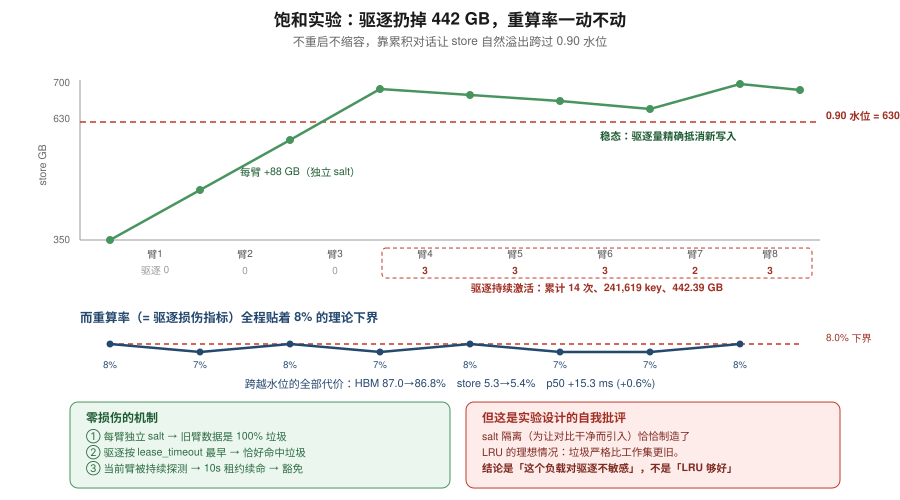
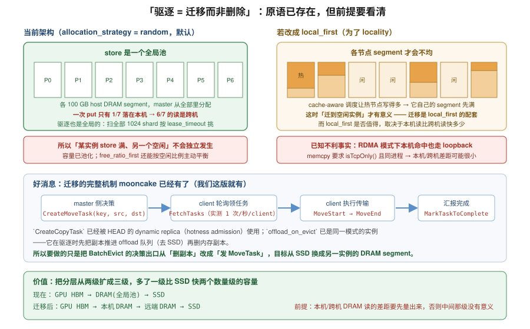

# 05 · 驱逐与迁移设计

## 1. 饱和实验：让 store 自然溢出

前面的实验都是为了**避免**驱逐（好让策略对比干净）。这一轮反过来：
不重启、不缩容，**靠累积对话让 store 自然溢出**跨过 0.90 水位，然后继续跑。
这也是生产里真实发生的方式，而且跨越水位那一刻的行为最有信息量。

设计：每臂一个独立 salt（约 +88 GB），从 354 GB 起累积，第 4 臂前后跨过
`0.90 × 700 = 630 GB`，之后 4 臂是稳态。**损伤指标 = 重算率 − 8% 下界**。



### 结果

| arm | 策略 | storeGB | 驱逐 | p50 | HBM | store | 重算 | damage |
|---|---|---|---|---|---|---|---|---|
| sat1_aff | affinity | 354→443 | 0 | 2562 | 86% | 7% | 8% | +0.0% |
| sat2_sco | score | 443→531 | 0 | 2576 | 87% | 5% | 7% | −1.0% |
| sat3_aff | affinity | 531→620 | 0 | 2564 | 88% | 4% | 8% | +0.0% |
| sat4_sco | score | 620→**614** | **3** | 2587 | 87% | 5% | 7% | −1.0% |
| sat5_aff | affinity | 614→608 | 3 | 2586 | 88% | 5% | 8% | +0.0% |
| sat6_sco | score | 608→601 | 3 | 2575 | 89% | 3% | 7% | −1.0% |
| sat7_aff | affinity | 601→627 | 2 | 2582 | 86% | 6% | 7% | −1.0% |
| sat8_sco | score | 627→620 | 3 | 2585 | 84% | 8% | 8% | +0.0% |

```
跨越水位的全部代价   HBM 87.0→86.8%   store 5.3→5.4%   重算 7.7→7.4%   p50 +15.3 ms (+0.6%)
累计驱逐            14 次, 241,619 key, 442.39 GB
稳态               store 在 600~627 GB 震荡 —— 驱逐量精确抵消新写入量
策略对比（饱和 n=5）  差 1.8 ms，重复间噪声 12.2 ms → INDISTINGUISHABLE
master 压力         峰值 ExistKey 5,758 keys/s，与非饱和的 5,165 基本一致
```

最后一条值得注意：**饱和不增加 master 的元数据压力**，因为 lookup 只查本地未命中段，
而本地命中率没变（87%）。

### 为什么零损伤

```
1. 每臂一个独立 salt      → 前面各臂的数据是 100% 垃圾，永不再命中
2. 驱逐按 lease_timeout 最早排序 → 恰好命中那批垃圾
3. 当前臂数据被持续探测(batch_is_exist) → 10s 租约反复续命 → 豁免驱逐
```

第 3 点就是 [01 章](01_store_architecture.md) 里那个「探测即续命」——
**它在这里起了保护作用，而不是危害**。近似 LRU 的那些不精确（租约量化、批量分位点切割）
在这个负载下无关紧要，**因为工作集和垃圾在时间上是干净分离的**。

## 2. 关键自我批评：salt 隔离与驱逐评估互相冲突

```
salt 隔离的作用    两个策略跑完全相同的 trial、互不预热 → 对比干净
salt 隔离的副作用   旧数据严格比工作集更旧且 100% 是垃圾 → LRU 的理想情况
```

真实负载里「冷数据」不是 100% 垃圾，而是**复用间隔较长的数据**。
那时近似 LRU 的不精确才会真正伤人——它可能砍掉「剩余复用距离很短」的块。
而这个实验设计从结构上排除了那种情况。

所以准确的结论是：

> **没能测出驱逐损伤，原因是这个负载对驱逐策略不敏感，
> 而不是「近似 LRU 足够好」的证明。**

**要真正评估驱逐质量，必须换负载**：反复重放**同一批 trial（不换 salt）**，
让旧数据仍然被需要，同时 store 装不下全部，这样才有复用间隔重叠。

这条比我原先设想的前提**严格得多**：不是「让驱逐发生」，而是**「让驱逐有机会砍错」**。

## 3. 迁移：把驱逐从删除变成搬家

### 动机与一个需要辨析的前提

想法是：cache-aware 调度下各实例负载不均，某些实例的 KV 占得多。
与其把它删掉让它不可复用，不如**主动迁到比较空闲的实例的 mooncake segment 里**。



**但这个前提在当前架构下不成立。** mooncake 的 store 是**一个全局池**，
而且默认 `-allocation_strategy random`：

```
每个 client(TP rank) 注册 100 GB 自己 host 的 DRAM 作为 segment
master 从「所有 segment」里分配 → 一个 P 节点 save 的数据，6/7 概率落在别的机器上
Mem Storage: 620/700 GB  ← 这是 7 个 segment 的总和，不是某一台的
BatchEvict 扫全部 1024 个 shard、按 lease_timeout 全局挑受害者
```

所以「某个实例的 store 占满而另一个空闲」**不会独立发生**——容量已经池化了。
而且还有 `free_ratio_first` 策略专门按空闲比例分配，天然平衡。

**真正存在不均衡的是 GPU HBM**（各实例本地 prefix cache）。但那一层的「迁移」已经存在了——
就是 `save` 的 write-through：HBM 驱逐时数据通常已经在 store 里，
所以**HBM 驱逐本来就不丢数据**（这也是结论 5 的另一面）。

### 那迁移什么时候有用

**作为 `local_first` 的配套。** 如果为了 locality 把分配策略改成 `local_first`，
各节点 segment 才会不均，这时才需要迁移来再平衡。

而 `local_first` 是否值得，取决于**本机读比跨机读快多少**。
这里有一个已知的不利事实（见 [01 章](01_store_architecture.md)）：
**RDMA 模式下本机命中也走 RDMA loopback，不退化成 memcpy**
（`memcpy_enabled_ = engine_.isTcpOnly()`，且要求同进程）。
所以本机/跨机的差距可能很小，那样 `local_first` 就不值得做，迁移也就失去了目的。

**这是迁移设计的定量基础，也是唯一的前置测量**：`local_first` vs `random` 对照，
不用改任何代码。

### 好消息：迁移的完整机制 mooncake 已经有了

`CreateMoveTask` 的注释直说：

> **Create a move task to move an object's replica from source segment to target segment**

而且**我们这一版就有**（`master_service.h:858`，`client_service.cpp:3160` 有 client 侧封装）。
配套的完整流程：

```
master 侧决策       CreateMoveTask(key, source, target)  /  CreateCopyTask(key, targets)
     │             （Copy 已被 HEAD 的 dynamic replica hotness admission 使用）
     ▼
client 轮询领任务    FetchTasks     ← master metrics 里 FetchTasks=14.00/14.00
     │                               就是 14 个 client 各 1 次/秒在轮询
     ▼
client 执行传输      MoveStart → 传输 → MoveEnd
     ▼
汇报完成            MarkTaskToComplete
```

**所以「驱逐 = 迁移而非删除」不需要新造框架，只需要把 `BatchEvict` 的决策出口
从「删副本」改成「发 MoveTask」。**

而且 `offload_on_evict` 已经是这个模式的一个实例了——它在驱逐时先把副本推进 offload 队列
（去 SSD）再删内存副本。要做的是同一个模式，只是目标从 SSD 换成**另一个实例的 DRAM segment**。

### 价值：把分层从两级扩成三级

```
现在：  GPU HBM  →  DRAM（全局池）  →  SSD
迁移后：GPU HBM  →  本机 DRAM  →  远端 DRAM  →  SSD
```

多了一级**比 SSD 快两个数量级**的容量。这比「改排序键 / 加深度权重」更有价值，因为：

- 改排序键只是**换个受害者**，总容量不变
- 迁移是**扩展分层**，真正增加了有效容量

前提仍然是那个测量：如果本机 DRAM 读和远端 DRAM 读差不多，中间那一级就没有意义。

## 4. 另一条改进方向：按前缀深度加权

这条与迁移正交，针对的是「砍谁」而不是「砍了放哪」。

纯 recency 在 agentic 负载下会**反向**：

```
前缀树视角：
    [系统提示 h0..h2]  ← 24 个会话共享，深度浅，驱逐它 = 24 个会话全部重算
          ├── trial A 的 h3..h7   ← 1 个会话依赖
          ├── trial B 的 h3..h9
          └── ...

失效场景：h0 恰好某轮没被探到 → 租约过期 → 被砍
         而 24 条叶子尾巴刚被访问 → 全部豁免
         结果砍掉最值钱的、留下最不值钱的
```

**两个可用信号 mooncake 里都已存在，不用从零加**：

- **深度**：`group` 机制（我们的 key 带 `@group:0@`）+ block hash 链本身编码位置
  （第 i 个 block 的深度就是 i）
- **频率**：HEAD 的 `dynamic_replication` 有 per-key heat（`heat_window_seconds=10`,
  `admission_qps_threshold=0.8`）；我们这版可以自己在 `ObjectMetadata` 上加字段

额外好处：**深度加权与「探测即续命」的副作用互补**——
现在浅层前缀被频繁探测也只拿到 10s 租约，加权后其驱逐代价被显式抬高，
不再依赖「恰好被探到」的运气。
