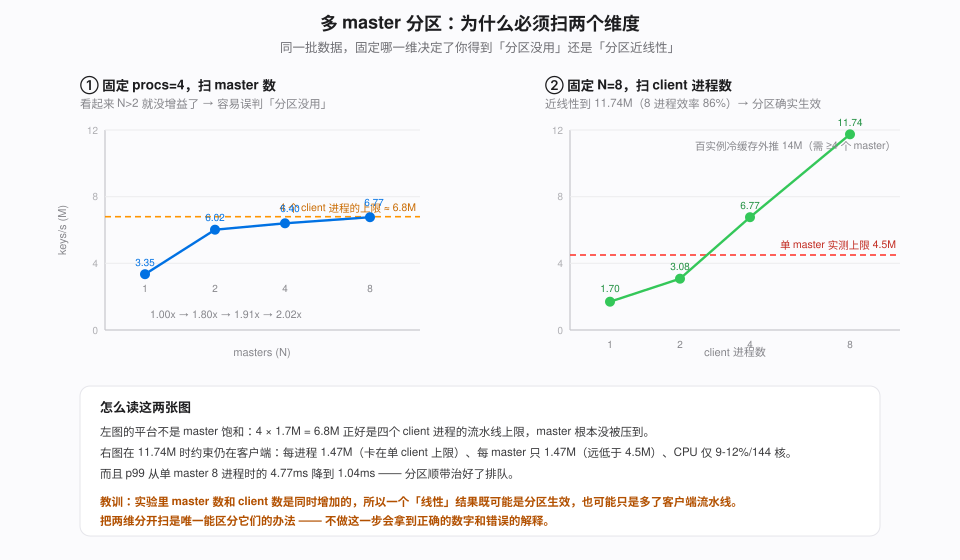

# 07 · 多 master 分区：从设计到实测

第 01 章末尾给出了分区的设计，理由是单 master 实测上限 4.5M keys/s，而冷缓存下百实例外推 14M keys/s，超载 3 倍。设计的核心是一句话：

```
owner = (hash(key) % 1024) / (1024 / N)
```

因为 key 是内容寻址的（block hash），任何 client 独立算出的 owner 都相同。所以这是个**纯函数**：不需要目录、不需要协调、不需要迁移，分区逻辑甚至可以完全做在客户端，不需要 mooncake 支持「多 master」这个概念。

但整个设计有一个前提：**聚合吞吐必须真的随 master 数增长**。这一章是三个实验，回答它到底成不成立。三个实验是分开的，因为它们的答案方向不同。

脚本：`mcstore/mstress_shard.py`（M1/M2）、`mcstore/m3_balance.py`（M3）、`mcstore/start_masters.sh`（起 N 个 mock master）。

## 1. 为什么必须用合成负载

集群原理上压不动 master。GPU 把请求率卡在比 master 能力低四个数量级的地方，而且**缩短 prompt 也没用**——每请求的 key 数与 prefill 的 token 数同比例下降，所以 keys/s 基本不变：

```
keys/s ≈ (GPU 实际 prefill 的 token/s) / block_size × tp_size × 未命中比例
```

实测集群峰值 5,758 keys/s，是 master 上限的 0.13%。所以要回答「百实例会不会过载」，只能绕开 GPU 造合成负载——用 7 个实例压不出 100 个实例的形态，这不是精度问题而是原理问题。

mock master 是**真的 mooncake_master 进程**，只是起在不同端口，各自独立（无 etcd，各自是自己的 leader）。这正好是客户端侧分区所假设的形态：N 个互不相关的元数据服务 + client 侧算 owner。

> **踩坑**：第二个 master 在同一台机上起不来。admin/metrics HTTP 服务默认端口 9003，绑不上是致命错误，日志只说 `Failed to start master admin server on port 9003` 然后干净退出。要给每个实例分配独立 `--metrics_port`，而且不能用 9099-9109（这些机器上已被占用），`start_masters.sh` 用 19101 起。

## 2. M1：容量确实随 master 数增长

每个线程把**整批** key 打给拥有它们的那个 master，不做 fan-out。这样每次调用的固定开销与单 master 基线完全一致，数字可以直接和 4.5M 对比。

```
masters  procs      keys/s   vs N=1   p50 ms   p99 ms   cpu
   1       4      3,347,161   1.00x    0.69     3.20    11%
   2       4      6,024,809   1.80x    0.57     1.29    10%
   4       4      6,399,866   1.91x    0.57     0.99     9%
   8       4      6,770,317   2.02x    0.46     0.99    12%
   8       1      1,698,996   0.51x    0.55     0.72
   8       2      3,084,757   0.92x    0.58     0.99
   8       8     11,740,271   3.51x    0.61     1.04
```



**必须同时看两个扫描才能读懂这张表。**

固定 procs=4 时，N 从 2 涨到 8 几乎没有增益（1.80→1.91→2.02）。单看这一半会得出「分区不管用」的结论，而那是错的：4 × 1.7M = 6.8M，**客户端在那里先到顶了**，master 根本没被压到。

换成固定 N=8、扫 procs：1.70 → 3.08 → 6.77 → 11.74M，近线性（8 进程效率 86%）。三个证据说明 11.74M 时的约束**仍在客户端而不在 master**：

```
每进程 1.47M          正好卡在单 client 1.5-1.7M 的上限
每 master 1.47M       远低于单 master 4.5M 的上限
CPU 9-12% / 144 核    主机也不是瓶颈
```

所以定论是：**分区确实突破了单 master 天花板**，11.74M 是 4.5M 的 2.6 倍，而且 p99 从单 master 8 进程时的 4.77ms 降到 1.04ms——分区顺带治好了排队。

对照 14M 的外推：**≥4 个 master 就够**（4 × 4.5M = 18M）。而客户端那一侧在真实部署里免费解决——100 实例就是 200 个 rank，也就是 200 个 client 进程。

这里有个方法论要点值得单独记：**「N 个 master」和「N 个 client」在实验里是同时增加的**，所以一个看起来线性的结果既可能是「master 分区生效」也可能是「只是多了客户端流水线」。把两个维度分开扫是唯一能区分它们的办法，而这个设计如果没做，就会拿到一个正确的数字和一个错误的解释。

## 3. M2：fan-out 的代价，以及我一个被推翻的预测

M1 测的是容量上限，但那不是真实访问形态。一次真实 lookup 的 key 分散在所有 master 上，所以必须发 N 个子批，而且**在最慢的那个返回之前这次查询没有结果**。M2 测的就是这个。

```
batch    1 master 整批      /2 拆分        /4 拆分        /8 拆分
 256      3,596,788     2,549,188      1,987,969      1,406,737
            p50 0.62      p50 1.50       p50 1.93       p50 2.76
            1.00x         0.71x          0.55x          0.39x
1024      5,728,765     4,071,043      3,145,008      2,779,763
            p50 1.83      p50 3.71       p50 4.75       p50 5.39
            1.00x         0.71x          0.55x          0.49x
4096      7,786,730     5,573,853      4,174,399      4,202,757
            p50 5.67     p50 10.03      p50 14.32      p50 13.91
            1.00x         0.72x          0.54x          0.54x
```

**我的预测错了。** 我原以为拆批代价来自每次调用约 60 个 key 的固定开销（那是第 01 章量出来的），所以加大 batch 就能摊薄它：batch 256 拆 8 份后每份只有 32 个 key，比固定开销还小，正处在固定开销主导区；batch 4096 拆 8 份每份 512 个 key，远大于固定开销，代价应该基本消失。

实测比例在 batch 跨 16 倍时几乎不变（0.71 / 0.55 / ~0.5）。**所以固定开销不是原因，加大 batch 摊不掉它。**

延迟指出了真因。batch 4096 时 whole 是 5.67ms，拆 8 份是 13.91ms ≈ 8 × 1.74ms——子调用**几乎是串行的**，而不是并行。这与第 01 章测到的「单 client 的 RPC 流水线 4 线程就饱和」吻合：fan-out 把每进程的在飞 RPC 数乘了 N，流水线早就满了，多出来的只是排队。

这个订正改变了结论的性质。如果代价来自固定开销，那它是协议开销、无法消除；而既然它来自客户端流水线深度，那它是**实现限制**——把 store 调用做成真异步（而不是现在每个子调用占一个线程）能让分区显著变便宜。这是个具体的后续项，而不是要接受的常数。

**净效应仍然是正的**：1→8 个 master 付 2× 的代价换 8× 的 master 侧容量，有效容量约 4×。而多出的约 2ms 查询延迟，对我们实测 2425ms 的 TTFT 是 0.09%，可忽略。

由此得到一条能直接用的规则：**别过度分区**。

```
N=2  付 29% 换 2× 容量
N=4  付 45% 换 4×
N=8  付 50% 换 8×
```

取刚好清过目标的最小 N。而且注意代价落在**客户端**而不是 master 侧，所以它花的是本来就随实例数增长的那部分资源。

## 4. M3：均衡度——冷数据没问题，热数据是绑定约束

设计里说分区后各 master 的负载「统计性均衡，不需要再平衡」。这句话对不对，取决于说的是哪种负载。用真实规模的 block 数做离线计算（两个无关的哈希，crc32 和 sha256，因为不该去猜 mooncake 内部的哈希——一个对两者都成立的结论才是关于分区的结论）：

**冷数据：一个臂写入的全部 block（24,184 个）**

```
   N   mean/master   相对 sd   最坏偏差        (crc32 / sha256)
   2       12092.0   0.5/0.5%   0.5/0.5%
   4        6046.0   0.9/0.5%   1.5/0.8%
   8        3023.0   1.7/1.1%   2.3/1.9%
  16        1511.5   2.4/1.7%   4.6/2.8%
```

均衡极好，「不需要再平衡」成立。相对偏差按 1/√(每 master 的 key 数) 走，而 key 数很大，所以可忽略。

**热数据：每个请求都会重新探测的那段共享系统前缀（约 11.5k token = 180 个 block）**

```
   N   mean/master   相对 sd     最坏偏差        (crc32 / sha256)
   2          90.0   2.2/4.4%    2.2/4.4%
   4          45.0   2.7/8.3%    4.4/13.3%
   8          22.5  16.3/19.5%  28.9/46.7%
  16          11.2  19.5/34.2%  37.8/60.0%
```

**这是绑定约束，而且它不会随总量增长而消失。** 因为它是个小样本问题：热 block 的绝对数量只有 180 个，N=8 时每个 master 平均 22.5 个，1/√22.5 ≈ 21% 就是相对偏差的量级。总的 key 数再涨十倍，这个数字一点不变。

后果是可量化的：N=8 时最热的 master 要多扛 29-47%，所以有效聚合容量是 8 × 4.5M ÷ 1.3 ≈ 27M 而不是 36M。仍远高于 14M，**所以它不推翻计划**——但天真的「N × 4.5M」会高估约 25-30%。

### 一个结构性限制：热 key 的元数据没法分摊

自然会想到用副本来分摊热点。但要分清两件事：

```
数据读取   一个对象可以有多个副本落在不同 segment → 读可以分摊（这是 M4 测的）
元数据     一个 key 的元数据按定义只在一个 master 上 → 无法分摊
```

要分摊热 key 的元数据，就必须让同一个 key 在多个 master 上有条目，而那**破坏了「owner 是纯函数」这个前提**——而那正是整个设计不需要目录、不需要协调的立足点。所以这不是「还没实现」，而是这个分区轴的固有代价。

能做的只是绕开而不是解决：让调度器把命中的热前缀记在本地（第 02 章那个前缀索引已经是这个形状），从而根本不去探测它。这也和第 01 章那条「负向过滤（kv_events）」是同一个方向——**减少探测量，而不是分摊探测**。

### 附带一个约束

`kNumShards = 1024` 是编译期常量，所以 N 必须整除 1024：

```
N ∈ {2, 4, 8, 16, 32}   均分
N = 24                  最后一个 master 多吃 16 个 shard
```

## 5. M4：热点对象的读带宽，以及副本救不了它

M3 说热 key 的**元数据**无法分摊。**数据**理论上可以——一个对象能有多个副本落在不同
segment。我们这版有 `ReplicateConfig.replica_num`，没有上游的 `dynamic_replication`
热点自动扇出，所以这里测的是手动版：`replica_num=2` 能不能提高聚合读带宽。

对象取部署形态下一个 rank 的一个 KV block：tp2 下 60 KiB/token 的一半 × 64 token ≈ 1.97 MB。
reader 全在 test1，store 仍绑单张 `mlx5_bond_0`。

```
replicas  readers   agg GB/s   p50 ms   p99 ms   per-reader GB/s
   1         1        5.62      0.29     0.31        5.62
   1         2       10.74      0.29     0.55        5.37
   1         4       18.75      0.31     0.64        4.69
   1         8       28.25      0.37     0.78        3.53
   2         1        5.56      0.30     0.32        5.56
   2         2       10.49      0.30     0.56        5.24
   2         4       19.10      0.31     0.63        4.78
   2         8       28.53      0.37     0.77        3.57
```

`replica_num=2` 确实创建了两个 `COMPLETE` 内存副本、落在两台不同的远端主机上，
**但读带宽没有收益（+1%，噪声内）**。

### 但这个「无收益」不能读成「mooncake 不会分摊读」

因为瓶颈在**读端**，不在源端。三条证据：

```
单副本时只有 1 台远端主机的网卡供数据，8 个 reader 仍拉到 28.25 GB/s（226 Gbps）
把源端翻成 2 台主机（2 张网卡），聚合带宽一点没变
per-reader 从 5.62 单调降到 3.53，而 p50 稳在 0.3ms —— 典型的读端饱和
```

所以这个实验**无法区分**「读路径总是解析到 replica[0]」和「读路径会挑副本但瓶颈在别处」。
它证明的是另一件事：**这个配置下不存在源端热点可供缓解。** 要复现「多台同时从一个热节点拉」
那个担心的场景，得把 reader 铺到多台机器上——按这个数外推，1 台读端能拉 28 GB/s，
3 台就要 84 GB/s，那会超过单个 bond。所以热点在更大规模下是真实的，只是 3 个 P 节点
加 1 台读端构造不出来。

### 两个方法论坑，都会让这个实验变得不可解释

**1. `preferred_segment` / `preferred_segments` 在 0.3.12.post1 都被忽略。** 实测把落位
钉到一个具名的远端 segment，对象照样落在本机。所以客户端无法请求落位——只能**读回**落位，
于是改用拒绝采样：反复换 key 直到副本恰好落在需要的地方。

**2. 客户端自己也会 mount segment，热对象可能落进 reader 自己的进程里。** 第一次跑时
`discover_segments` 看到 7 个 segment，而 3P 拓扑只该有 6 个——多出来的是我自己探测客户端
的 64 MB segment。而 RDMA 模式下本机命中仍走 transfer engine（不退化成 memcpy），所以那是
一次很快、且不消耗任何远端网卡的读。修法是给客户端设 `segment_bytes=0`：mooncake 拒绝
小于 16 MiB 的 segment，正好达到「不 mount」的效果。

第一次跑的结果（1 副本落在远端、2 副本有一份在本机）因此是**被落位混淆的**，
「replica_num=2 更差」那个读数毫无意义。这是第 9 个「假成功」——形状和前八个一样：
数字看着正常，只是它回答的不是我以为的那个问题。

### 一个附带的交叉验证

28 GB/s 这个数独立印证了第 03 章 Config D 的机制估算：那里按「1.08 GB/请求 ÷ 25 GB/s」
估出 43ms 的 store 读成本，用 M4 实测的 28 GB/s 算是 **39ms**。两个独立来源对得上，
所以「一次 store 读只值它替代的那段 prefill 的约 2%」有双重支撑。

## 6. 小结

| 问题 | 答案 | 依据 |
|---|---|---|
| 分区能突破单 master 上限吗 | **能**，实测 11.74M vs 单 master 4.5M | M1，且瓶颈仍在客户端 |
| 14M 的外推要几个 master | **≥4** | 4 × 4.5M = 18M |
| fan-out 的代价 | N=8 付 50% 吞吐、2.4× p50 | M2，与 batch 大小无关 |
| 加大 batch 能摊薄它吗 | **不能**，我的预测被推翻 | M2，比例在 batch 跨 16 倍时不变 |
| 代价的性质 | 客户端流水线深度，**实现限制而非协议开销** | M2 的延迟近似 N × 单次 |
| 容量/key 数均衡 | 极好，N=16 最坏偏差 <5% | M3 冷数据 |
| 热点探测流量均衡 | **N=8 最坏偏差 29-47%，且不随总量消失** | M3 热数据，小样本 |
| 热 key 元数据能分摊吗 | **不能**，会破坏纯函数前提 | 结构性 |
| `replica_num=2` 能分摊热点读吗 | **本配置下无收益**（+1%），但因为瓶颈在读端，此实验判不了副本选择逻辑 | M4 |
| 单个远端 segment 能供多少读 | **28 GB/s**（8 个 reader 从一台远端主机） | M4，且印证了 03 章的 39ms 估算 |

下一步不是继续测分区，而是那条被 M2 指出来的实现路径：**把 store 调用做成真异步**。它同时降低 fan-out 的代价和单 client 的 1.5M 上限，是这两个数字共同的成因。

要把热点那条线做完，需要的是**多机 reader**：现在的 harness 只在一台机上起 reader，
所以永远测不到源端热点。这是 M4 留下的唯一缺口。
