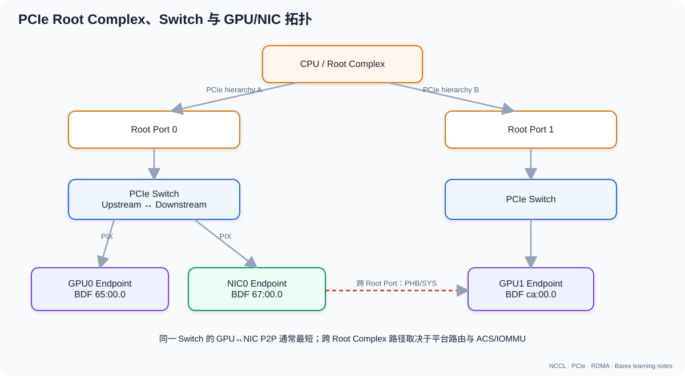

# 01. PCIe 基础：从 Lane 到 TLP

## 1. PCIe 是什么

PCI Express 是点对点、分组交换、全双工的串行互连。它不是所有设备共享一根并行总线，而是由 Link 和 Switch 组成一棵层次结构。

三个层次：

| 层 | 主要职责 | 典型内容 |
|---|---|---|
| Transaction Layer | 产生和消费事务 | Memory Read/Write、Completion、配置访问 |
| Data Link Layer | 单跳可靠传输 | Sequence Number、LCRC、ACK/NAK、重放 |
| Physical Layer | 在线路上传 bit/symbol | Lane、编码、链路训练、均衡 |

应用或驱动发起一次 DMA，最终会拆成一个或多个 Transaction Layer Packet（TLP）。数据链路层再提供单跳重试；PCIe 本身不是 TCP 那样的端到端协议。

## 2. 拓扑中的对象



| 对象 | 含义 |
|---|---|
| Root Complex（RC） | CPU/SoC 与 PCIe fabric 的入口 |
| Root Port | RC 下的一条 PCIe 层次分支 |
| Switch Upstream Port | 面向 Root Complex |
| Switch Downstream Port | 面向 Endpoint 或下级 Switch |
| Endpoint | GPU、NIC、NVMe 等终端设备 |
| Bridge | 连接两个 PCI/PCIe bus number 空间 |

一个设备用 BDF 标识：

```text
Domain:Bus:Device.Function
0000:65:00.0
```

- Domain：独立 PCI segment。
- Bus：总线编号。
- Device：该 bus 上的 device number。
- Function：一个多功能设备内的 function。

常用观察命令：

```bash
lspci -D
lspci -t
lspci -vv -s 0000:65:00.0
```

## 3. Lane、Link、Width 与 Speed

一条 Lane 包含一对发送差分线和一对接收差分线，因此天然全双工。Link 可以聚合为 x1/x2/x4/x8/x16。

以 Gen3–Gen5 为例，每 Lane 单方向理论 payload 编码上限为：

```text
GB/s = GT/s × (128 / 130) ÷ 8
总链路单方向 = 单 Lane × Lane 数
```

| 代际 | 速率/每 Lane | 编码 | 每 Lane 单向上限 | x16 单向上限 |
|---|---:|---:|---:|---:|
| Gen1 | 2.5 GT/s | 8b/10b | 0.250 GB/s | 4.00 GB/s |
| Gen2 | 5.0 GT/s | 8b/10b | 0.500 GB/s | 8.00 GB/s |
| Gen3 | 8.0 GT/s | 128b/130b | 0.985 GB/s | 15.75 GB/s |
| Gen4 | 16 GT/s | 128b/130b | 1.969 GB/s | 31.51 GB/s |
| Gen5 | 32 GT/s | 128b/130b | 3.938 GB/s | 63.02 GB/s |

这仍不是应用可见带宽，因为还没扣除 TLP header、DLLP、LCRC、间隔、flow control 和软件调度开销。Gen6 改用 PAM4、FLIT 和 FEC，不能简单套用 128b/130b 公式。

### 3.1 negotiated speed/width

设备和端口各自有 capability 与当前协商值。常见性能事故是“设备支持 Gen4 x16，但链路只协商成 Gen3 x8”。

```bash
lspci -vv -s "$BDF" | rg 'LnkCap|LnkSta'
```

重点看：

- `LnkCap`: 最大支持值。
- `LnkSta`: 当前实际值。
- `Width x8 (downgraded)`: 宽度发生降级。

## 4. TLP：真正在线路上传输的事务

常见 TLP：

| 类型 | 是否需要 Completion | 典型用途 |
|---|---|---|
| Memory Write | Posted，不需要 | DMA 写入内存或 BAR |
| Memory Read | Non-Posted，需要 | DMA 读取，返回 Completion with Data |
| Configuration Read/Write | 需要或按类型完成 | 枚举与配置空间 |
| Message | 取决于类型 | 中断、电源管理等 |

### 4.1 为什么写通常比读容易跑满

Memory Write 是 posted transaction：发送方可以连续推送，只受 credit 和队列约束。Memory Read 必须：

1. 发送 Read Request；
2. 等待目标返回 Completion；
3. 受 outstanding request 数量、tag、read request size 和往返延迟约束。

因此跨 Root Complex 或高延迟路径上，GPU/NIC peer read 往往比 write 更敏感。设计 RDMA 数据面时常优先采用“发送端向接收端做 RDMA Write”。

### 4.2 MPS 与 MRRS

- MPS：Max Payload Size，限制单个 TLP payload。
- MRRS：Max Read Request Size，限制一次 Memory Read 请求大小。

MPS 小会增加 header 比例；盲目调大又可能与路径中最弱端口不兼容。有效值受整条路径限制。

## 5. BAR：设备把什么暴露到地址空间

Base Address Register 描述设备希望映射的 MMIO 区域。系统固件/内核为它分配地址，CPU 或其他 PCIe device 可以向这段地址发 TLP。

对 GPU Direct RDMA，核心直觉是：

```text
NIC DMA engine
  → 对 GPU 可达的 PCIe 地址发 Memory Read/Write
  → PCIe fabric 将 TLP 路由到 GPU BAR/映射窗口
  → 数据进入或离开 GPU memory
```

BAR 不是“把全部显存永久映射进 CPU 虚拟地址”。它是 PCIe 地址空间中的窗口，具体映射和 pinning 由 GPU 驱动、peer-memory 或 dma-buf 机制管理。

## 6. 流控、顺序与可靠性

PCIe 使用 credit-based flow control。接收端按 header/data、posted/non-posted/completion 类型通告 buffer credit；发送端只有在 credit 足够时才发包。

这能避免交换网络内部因为接收 buffer 不足而丢包，但也带来：

- 小 credit + 高 RTT 会限制吞吐；
- 某一类 TLP credit 枯竭会阻塞对应事务；
- switch oversubscription 会让多个 Endpoint 竞争上行链路；
- ordering rule 会限制某些重排。

Data Link Layer 用 LCRC 检测单跳错误并重放。上层软件看到的 CQ completion 错误通常已经是无法由链路层透明恢复的问题。

## 7. 中断与 doorbell

高性能设备通常不会让 CPU 为每个数据包编程一次完整描述符，而是：

1. 软件在内存队列中写 descriptor/WQE；
2. 写 MMIO doorbell 通知设备；
3. 设备 DMA 读取 descriptor 和 payload；
4. 完成后写 CQE，必要时触发 MSI-X；
5. 高吞吐路径常通过 polling 批量消费 CQE。

这正是后面 Barex `ibv_post_send → CQ polling → DoneCallback` 的硬件背景。

## 8. 性能心智模型

一次传输耗时可粗略写为：

```text
T = 固定软件开销
  + doorbell/排队
  + 路径 RTT
  + payload / 有效带宽
  + completion 处理
```

小消息主要受固定开销和 RTT 支配；大消息主要受有效带宽支配。合并连续 KV block、WriteBatch、多 channel 并行的目标就是减少固定开销并增加 outstanding work。

## 9. 自检

1. 为什么 PCIe x16 是全双工，而“63 GB/s”通常只表示单方向？
2. 为什么 posted write 不需要 completion TLP，却仍可能产生本地 CQ completion？
3. `LnkCap=Gen4 x16` 是否足以证明当前跑在 Gen4 x16？
4. 为什么跨 CPU socket 的 peer read 通常风险更高？
5. MPS 增大为什么可能提高带宽，又为什么不能只改 Endpoint？

## 参考

- [PCI-SIG PCI Express Technology Overview](https://pcisig.com/pci-express-technology-overview)
- [Linux PCI driver API](https://docs.kernel.org/driver-api/pci/index.html)

