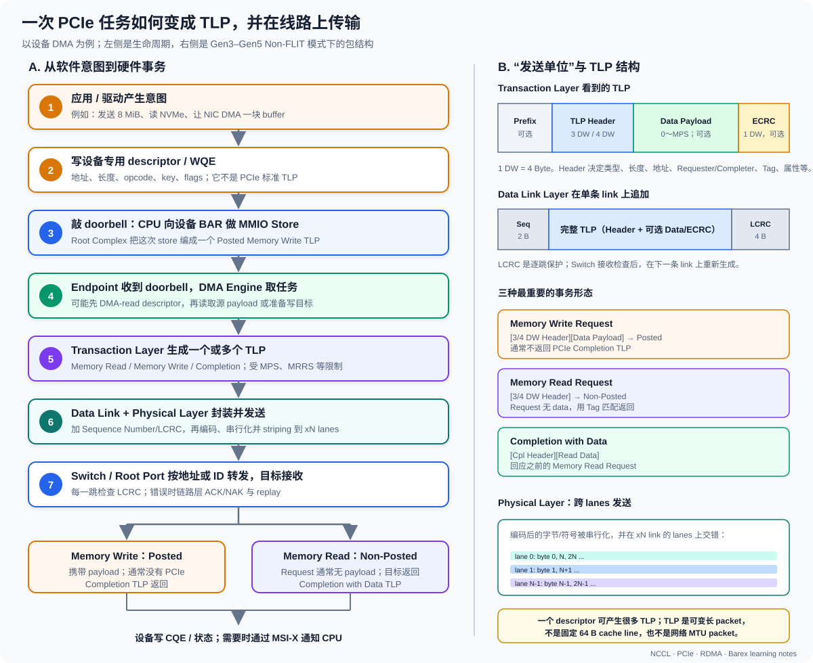

# 01. PCIe 基础：从 Lane 到 TLP

## 1. PCIe 是什么

PCI Express 是点对点、分组交换、全双工的串行互连。它不是所有设备共享一根
并行总线，而是由 Link 和 Switch 组成一棵层次结构。

### 1.1 PCIe 是物理链路吗

回答“是”不够完整。PCIe 同时规定：

1. **物理链路**：差分线、lane、连接器、电气信号、速率、链路训练与均衡；
2. **链路协议**：单跳可靠传输、序号、LCRC、ACK/NAK、重放；
3. **事务协议**：Memory Read/Write、Configuration、Completion、Message 等 TLP；
4. **系统模型**：Root Complex、Switch、Endpoint、配置空间、BAR、中断和电源管理。

因此：

```text
“一条 PCIe link”
```

通常是指两个相邻端口之间已经训练成功的点到点连接；而：

```text
“PCIe”
```

是包含物理层、数据链路层和事务层的一整套互连体系，不只是主板上的铜线。

三个层次：

| 层 | 主要职责 | 典型内容 |
|---|---|---|
| Transaction Layer | 产生和消费事务 | Memory Read/Write、Completion、配置访问 |
| Data Link Layer | 单跳可靠传输 | Sequence Number、LCRC、ACK/NAK、重放 |
| Physical Layer | 在线路上传 bit/symbol | Lane、编码、链路训练、均衡 |

应用或驱动发起一次 DMA，最终会拆成一个或多个 Transaction Layer Packet（TLP）。数据链路层再提供单跳重试；PCIe 本身不是 TCP 那样的端到端协议。

### 1.2 哪些访问走 PCIe，哪些不走

“PCIe 用于本机 CPU/GPU/DRAM 数据传输”这个说法要进一步拆开：

| 访问 | 通常是否走 PCIe | 实际常见路径 |
|---|---:|---|
| CPU core → CPU attached DDR/LPDDR | 否 | CPU cache/内部互连 → memory controller → DRAM |
| GPU SM → 自己的 HBM/GDDR | 否 | GPU cache/内部互连 → HBM controller → GPU DRAM |
| CPU/host memory ↔ 独立 PCIe GPU | 是 | Root Complex ↔ PCIe ↔ GPU |
| CPU/host memory ↔ PCIe NIC/NVMe | 是 | Root Complex ↔ PCIe ↔ Endpoint |
| PCIe NIC ↔ PCIe GPU P2P | 是 | PCIe Switch/Root Complex 路径 |
| NVLink-connected GPU ↔ GPU | 不一定 | 能使用 NVLink 时可不走 PCIe payload path |
| Grace CPU ↔ Blackwell GPU | 不一定 | GB200 可使用 NVLink-C2C |

也就是说，DRAM 本身通常不是 PCIe device。CPU 的 DDR/LPDDR 由 CPU memory
controller 直接管理；GPU 的 HBM 由 GPU HBM controller 直接管理。PCIe 在设备
需要访问 host memory 或另一个 PCIe Endpoint 时承载对应 transaction。

### 1.3 PCIe 除了“搬数据”还有什么用途

常见 PCIe Endpoint 包括：

- GPU、AI accelerator、FPGA；
- Ethernet/InfiniBand/RoCE NIC、DPU；
- NVMe SSD、RAID/HBA/storage controller；
- Wi-Fi、声卡、采集卡、视频编解码卡；
- USB controller、SATA controller 等主板 I/O controller。

PCIe 对它们提供的不只有 bulk payload：

```text
发现设备        Configuration Read/Write，读取 Vendor/Device ID
配置资源        分配 BAR、bus number、中断
控制设备        CPU 向 BAR/MMIO register 写 doorbell
设备访问内存    DMA Memory Read/Write
设备间直连      P2P TLP，例如 RNIC ↔ GPU
完成通知        MSI/MSI-X Message、状态/CQ 更新
电源与错误管理  ASPM、AER、hot-plug 等
```

从软件视角看，驱动经常先通过配置空间发现并初始化设备，再通过 MMIO/doorbell
控制设备，最后由设备 DMA engine 大批量搬 payload。

## 2. 拓扑中的对象


| 对象 | 含义 |
|---|---|
| Root Complex（RC） | CPU/SoC 与 PCIe fabric 的入口 |
| Root Port | RC 下的一条 PCIe 层次分支 |
| Switch Upstream Port | 面向 Root Complex |
| Switch Downstream Port | 面向 Endpoint 或下级 Switch |
| Endpoint | GPU、NIC、NVMe 等终端设备 |
| Bridge | 连接两个 PCI/PCIe bus number 空间 |

### 2.1 PCIe Switch 是什么

PCIe Switch 是一个**转发 TLP 的硬件交换设备**。可以把它和以太网交换机类比
为“都有多个端口并根据目标转发 packet”，但两者处理的协议和地址完全不同：

| PCIe Switch | Ethernet Switch |
|---|---|
| 转发 PCIe TLP | 转发 Ethernet frame |
| 根据 PCIe 地址、Requester ID、bus routing 等决定端口 | 根据 MAC/VLAN 等转发 |
| 使用 PCIe credit-based flow control | 使用 Ethernet buffer/flow-control 机制 |
| 位于一台 PCIe hierarchy 内 | 连接主机和网络设备 |
| 不运行 TCP/IP 转发 | 可以承载 IP packet |

典型结构：

```text
             CPU / Root Complex
                     │
             Switch Upstream Port
                     │
              ┌──── PCIe Switch ────┐
              │          │          │
       Downstream 0 Downstream 1 Downstream 2
              │          │          │
             GPU0       GPU1       RNIC0
```

它主要负责：

1. **路由 TLP**：根据地址或 ID 把 Memory/Configuration/Completion TLP 转发到
   正确端口。
2. **隔离 bus 层次**：每个 Downstream Port 类似一座 bridge，其后可以拥有新的
   bus number 范围。
3. **缓冲和仲裁**：多个下行设备争用上行时排队、选择谁先发送。
4. **PCIe flow control**：按 posted/non-posted/completion 等类别管理 credit。
5. **支持设备间 P2P**：条件允许时，GPU↔RNIC TLP 可在 switch 内转发，不必把
   payload 存进 CPU DRAM。
6. **实现可选策略**：例如 ACS、错误上报、端口隔离、热插拔等。

PCIe Switch 通常不会：

- 执行 CUDA kernel 或 TCP 协议；
- 把每个 payload 复制到自己的“大内存”再交给 CPU；
- 增加总带宽。若三个 x16 downstream 共享一个 x16 upstream，它们同时访问
  Root Complex 时仍要竞争这条上行。

#### 同一 Switch 为什么可能更适合 GPU Direct RDMA

假设 GPU 与 RNIC 可以做 P2P：

```text
较短路径：
GPU → PCIe Switch → RNIC

较长路径：
GPU → Switch → Root Complex/NUMA interconnect
    → 另一个 Root Complex/Switch → RNIC
```

第一条路径通常延迟更低、共享环节更少。但“在同一个 switch 下”只是重要条件，
还要检查 ACS/IOMMU、GPU peer-memory/dma-buf、驱动和平台支持。

### 2.2 BDF：它是设备在 PCIe 地址体系中的“门牌号”

一个设备用 BDF 标识：

```text
Domain:Bus:Device.Function
0000:65:00.0
```

- Domain：独立 PCI segment。
- Bus：总线编号。
- Device：该 bus 上的 device number。
- Function：一个多功能设备内的 function。

#### Domain、Bus、Device、Function 分别是什么

以 `0000:65:00.0` 为例：

```text
0000 : 65 : 00 . 0
 │      │    │   └─ Function 0
 │      │    └──── Device 0
 │      └───────── Bus 0x65
 └──────────────── Domain/Segment 0
```

它们的含义是：

- **Domain/Segment**：一套相对独立的 PCI 配置地址空间。大型服务器可能有多个
  host bridge/segment，所以 `lspci -D` 会显示 `0000`、`0002`、`0008` 等。
- **Bus**：枚举过程中分配给一段 PCI bus 的编号。bridge/switch downstream
  port 后面通常会产生新的 secondary bus。
- **Device**：该 bus 上的 device number。传统编码范围通常是 0～31。
- **Function**：同一个 device number 下的逻辑功能。传统 multifunction device
  可有 function 0～7；不同 function 拥有独立配置空间，也可以绑定不同驱动。

Function 不等于“程序函数”。例如一张双端口 ConnectX-7 卡可以枚举为：

```text
0000:03:00.0  Ethernet controller
0000:03:00.1  Ethernet controller
```

`.0` 和 `.1` 是两个 PCI function。它们共享某些物理硬件，但在操作系统眼中是
两个可单独配置的 PCI function。

#### 只知道 BDF，我得到了什么

BDF 给你的是**当前这次 PCI 枚举下精确定位一个 function 的地址**。有了它可以：

- 读取该 function 的 PCI configuration space；
- 查询 Vendor ID、Device ID、class code；
- 查看 BAR 地址和大小；
- 查看最大/当前 PCIe speed 与 width；
- 找出正在使用的 kernel driver；
- 找到对应 sysfs 目录 `/sys/bus/pci/devices/<BDF>/`；
- 查询 NUMA node、IOMMU group、SR-IOV PF/VF 关系；
- 沿 `lspci -t` 判断它经过哪些 bridge/switch/root port；
- 把性能计数、内核日志、`nvidia-smi` GPU index 与同一个物理设备对应起来。

但 BDF 本身**不直接告诉你**：

- 设备型号或厂商；
- IP 地址；
- 它是 `cuda:0` 还是 `cuda:1`；
- GPU 与 NIC 的实际业务带宽；
- 该编号重启或更换固件后永远不变。

这些信息要以 BDF 为索引，继续读取配置空间、sysfs 或设备专用工具。

### 2.3 `lspci` 在什么时候使用

`lspci` 读取 PCI 配置空间和 Linux 已枚举的设备信息。可以把常见问题映射到命令：

| 我想知道什么 | 命令 | 重点看什么 |
|---|---|---|
| 机器有哪些 PCI device | `lspci` | GPU、NIC、NVMe、bridge 是否存在 |
| 需要完整 BDF/domain | `lspci -D` | `0000:65:00.0`，而不是省略 domain |
| 设备的数字 ID | `lspci -nn` | `[vendor_id:device_id]` |
| 设备绑定了哪个驱动 | `lspci -nnk -s <BDF>` | `Kernel driver in use` |
| 当前是否从 x16 降到 x8 | `lspci -vv -s <BDF>` | `LnkCap` 与 `LnkSta` |
| BAR/MMIO 窗口多大 | `lspci -vv -s <BDF>` | `Region 0/2/...` |
| GPU/NIC 是否在同一 switch | `lspci -t` | 树上的共同父 bridge |
| 精确检查某个 function | `lspci -s <BDF>` | `-s` selector |

常用观察命令：

```bash
lspci -Dnn
lspci -t
sudo lspci -vv -s 0000:65:00.0
lspci -nnk -s 0000:65:00.0
```

#### 例 1：怀疑 GPU PCIe 链路降级

```bash
BDF=0000:65:00.0
sudo lspci -vv -s "$BDF" | grep -E 'LnkCap:|LnkSta:'
```

假设输出：

```text
LnkCap: Speed 32GT/s, Width x16
LnkSta: Speed 16GT/s, Width x8 (downgraded)
```

含义是设备能力最高为 Gen5 x16，但当前只有 Gen4 x8。此时 CPU↔GPU 或
GPU↔NIC PCIe workload 的带宽问题就有了明确调查方向。只看 GPU 型号无法发现
这种协商降级。

#### 例 2：确认一块 NIC 是否被正确识别并绑定驱动

`target_p` 上可以观察到：

```bash
lspci -Dnnk -s 0000:03:00.0
```

关键输出：

```text
0000:03:00.0 Ethernet controller:
  Mellanox Technologies MT2910 Family [ConnectX-7] [15b3:1021]
  Kernel driver in use: mlx5_core
```

这回答了：

- `0000:03:00.0` 是 Ethernet-class function；
- Vendor/Device ID 是 `15b3:1021`；
- 型号族是 ConnectX-7；
- Linux 已用 `mlx5_core` 驱动它。

如果 `ibv_devices` 中没有预期 RNIC，便可以从这里判断是“PCIe 根本没枚举到”
还是“PCIe 看到了，但 RDMA driver/device 初始化失败”。

#### 例 3：把 `cuda:0` 对应到 PCI BDF

不要假设 `cuda:0` 永远是 BDF 最小的 GPU。先用：

```bash
nvidia-smi --query-gpu=index,name,pci.bus_id --format=csv,noheader
```

`target_p` 的一条实际输出为：

```text
0, NVIDIA GB200, 00000008:01:00.0
```

于是知道 CUDA/NVIDIA index 0 对应 `0008:01:00.0`。再查：

```bash
lspci -Dnnk -s 0008:01:00.0
cat /sys/bus/pci/devices/0008:01:00.0/numa_node
```

可得到：

```text
3D controller: NVIDIA Corporation Device [10de:2941]
Kernel driver in use: nvidia
NUMA node: 0
```

这样才能把 CUDA profiler、`nvidia-smi topo -m`、NIC BDF 与 NUMA 绑核策略对应
起来。

#### 例 4：判断 GPU 和 NIC 是否共享上游

```bash
lspci -t
```

输出是一棵树而不是性能结论。沿 GPU BDF 和 NIC BDF 向左寻找共同父节点：

- 很快汇合：可能位于同一 switch/host bridge 分支；
- 直到更高层甚至不同 domain 才汇合：路径更长；
- 若跨 NUMA，再结合 `nvidia-smi topo -m`、`numa_node` 判断。

`lspci -t` 能告诉你“线怎么连”，不能单独证明 GDR 已启用或能跑到多少 GB/s。

## 3. Lane、Link、Width 与 Speed

一条 Lane 包含一对发送差分线和一对接收差分线，因此天然全双工。Link 可以聚合为 x1/x2/x4/x8/x16。

以 Gen3–Gen5 为例，每 Lane 单方向理论 payload 编码上限为：

```text
GB/s = GT/s × (128 / 130) ÷ 8
总链路单方向 = 单 Lane × Lane 数
```

| 代际 | 速率/每 Lane | 编码 | 每 Lane 单向上限 | x16 单向上限 |
|---|---:|---:|---:|---:|
| Gen1 | 2.5 GT/s | 8b/10b | 0.250 GB/s | 4.00 GB/s |
| Gen2 | 5.0 GT/s | 8b/10b | 0.500 GB/s | 8.00 GB/s |
| Gen3 | 8.0 GT/s | 128b/130b | 0.985 GB/s | 15.75 GB/s |
| Gen4 | 16 GT/s | 128b/130b | 1.969 GB/s | 31.51 GB/s |
| Gen5 | 32 GT/s | 128b/130b | 3.938 GB/s | 63.02 GB/s |

这仍不是应用可见带宽，因为还没扣除 TLP header、DLLP、LCRC、间隔、flow control 和软件调度开销。Gen6 改用 PAM4、FLIT 和 FEC，不能简单套用 128b/130b 公式。

### 3.1 `x16` 到底是什么意思

`x` 读作“by”，`x16` 表示这条 link 由 16 条 lane 并行组成。它不是：

- 16 倍时钟频率；
- 有 16 个设备；
- 一次只能发 16 Byte；
- GPU 有 16 个计算核心。

把 lane 想成独立车道：

```text
x1 :  [lane 0]
x4 :  [lane 0][lane 1][lane 2][lane 3]
x8 :  [lane 0]...[lane 7]
x16:  [lane 0]................[lane 15]
```

每条 lane 本身有发送与接收两个方向，因此“16 lanes”不是把 8 条用于发送、
另 8 条用于接收；16 条都可以同时在各自的发送方向工作，反方向还有对应的
16 条接收信号路径。

#### 同代际下，不同宽度差多少

以 Gen4 为例：

| 宽度 | 单向编码后理论值 | 相对 x16 |
|---|---:|---:|
| x1 | 1.969 GB/s | 1/16 |
| x2 | 3.938 GB/s | 1/8 |
| x4 | 7.877 GB/s | 1/4 |
| x8 | 15.754 GB/s | 1/2 |
| x16 | 31.508 GB/s | 1 |

例如把一块 GPU 从 Gen4 x16 插到电气 x8 插槽，理论单向上限就从约
31.5 GB/s 降为 15.75 GB/s。计算 kernel 若只访问 GPU 自己的 HBM，未必受影响；
但 CPU↔GPU、GPU↔NIC、GPU↔GPU 的 PCIe 流量可能受影响。

#### 宽度和代际可以互相“换算”，但延迟不等价

从理论带宽看：

```text
Gen3 x16 ≈ Gen4 x8 ≈ Gen5 x4 ≈ 15.75 GB/s（单向）
```

这只说明大块连续传输的编码后带宽接近，不代表：

- TLP 往返延迟相同；
- switch/Root Complex 路径相同；
- MPS、outstanding request 能力相同；
- P2P、ACS、IOMMU 支持相同。

性能分析不能只看一个 GB/s 数字。

#### 物理插槽宽度与电气宽度

“插槽是 x16 长度”和“接了 16 条 lane”是两件事。主板可能为了让长卡能插入，
提供 x16 外形，但只连接 x8 或 x4。还可能因为 CPU lane 数有限而在多槽同时使用
时自动拆分：

```text
只插 GPU0：GPU0 = x16
同时插 GPU0/GPU1：GPU0 = x8，GPU1 = x8
```

这种 `x16 → x8+x8` 叫 bifurcation（拆分）。总 lane 预算没有增加。

#### 双向带宽为什么容易被宣传数字误导

Gen4 x16 单向约 31.5 GB/s。因为全双工：

```text
A → B 最多约 31.5 GB/s
B → A 最多约 31.5 GB/s
```

厂商可能写“总双向约 63 GB/s”。如果你的 workload 只有 GPU→NIC 一个方向，
仍只能拿单向值做上限，不能用 63 GB/s。

### 3.2 negotiated speed/width

设备和端口各自有 capability 与当前协商值。常见性能事故是“设备支持 Gen4 x16，但链路只协商成 Gen3 x8”。

```bash
lspci -vv -s "$BDF" | rg 'LnkCap|LnkSta'
```

重点看：

- `LnkCap`: 最大支持值。
- `LnkSta`: 当前实际值。
- `Width x8 (downgraded)`: 宽度发生降级。

还要检查路径上的每一跳，而不只是 Endpoint。假设：

```text
GPU -- Gen5 x16 --> Switch -- Gen4 x8 --> Root Port
```

GPU 这一端能力再强，去 CPU/主存方向仍会被 Switch 上行的 Gen4 x8 限制。
Linux 内核的 `pcie_bandwidth_available()` 也是沿设备向上寻找整条路径中最小带宽。

### 3.3 手算例题：PCIe 4.0 x8 能否喂满 200 Gb/s 网卡

先统一单位：

```text
200 Gb/s ÷ 8 = 25 GB/s
PCIe 4.0 x8 编码后理论值 ≈ 15.75 GB/s
```

因此即使不考虑任何协议开销，PCIe 4.0 x8 也无法承载单方向 200 Gb/s 线速。
如果网卡是双口 200 Gb/s，更不能把两个端口线速简单相加后期待通过同一条 x8
上行。

反过来，PCIe 5.0 x8 编码后理论值约 31.5 GB/s，看起来足够 25 GB/s，但真实系统
还要扣除 TLP、网络协议和软件开销，所以只能说“具备可能性”，不能仅凭理论值
断言一定跑满。

## 4. TLP：真正在线路上传输的事务

TLP 是 **Transaction Layer Packet（事务层数据包）**。它是 PCIe Transaction
Layer 用来表达“我要读、写、配置或返回数据”的标准化 packet。

先区分三种“任务单位”：

| 层次 | 单位 | 谁定义 | 示例 |
|---|---|---|---|
| 应用/通信库 | API operation | 软件接口 | `send(buf, 8MiB)`、`ibv_post_send()` |
| 设备工作队列 | descriptor/WQE | NIC/NVMe/GPU 等设备自己的规范 | 地址、长度、opcode、key、flags |
| PCIe Transaction Layer | TLP | PCIe 标准 | Memory Read、Memory Write、Completion |

PCIe 没有一个所有设备通用的“PCIe 任务对象”。驱动先按具体设备格式准备
descriptor/WQE；设备读到 descriptor 后，内部 DMA engine 再生成标准 PCIe TLP。
它们不是一一对应关系：

```text
一个 8 MiB descriptor
  → 可能产生几千到几万个 TLP

一个 TLP
  → 只表达这次事务的一部分，或只负责 doorbell/configuration/completion
```



### 4.1 一次 PCIe DMA 任务怎样发起

以 RNIC/NVMe/GPU 等 Endpoint 的 DMA 为例：

1. **应用产生意图**：例如让 NIC 发送一块 8 MiB buffer。
2. **驱动或用户态通信库准备 descriptor/WQE**：写入源/目标地址、长度、opcode、
   key 和 flags。这里的格式是设备专用格式，还不是 TLP。
3. **软件敲 doorbell**：CPU 对设备 BAR 中的 MMIO register 做一次 store。
4. **Root Complex 生成 doorbell TLP**：这次 CPU store 通常变成一个小的
   Posted Memory Write TLP，沿 PCIe hierarchy 到达 Endpoint。
5. **Endpoint 开始工作**：设备可能先 DMA-read 队列中的 descriptor，再根据它
   读取源 payload 或写入目标地址。
6. **设备 Transaction Layer 生成 TLP**：大的 DMA 会按照 MPS、MRRS、地址边界等
   条件拆成多个 Memory Read/Write TLP。
7. **Data Link Layer 封装**：在 Non-FLIT 模式下加入 Sequence Number 和 LCRC，
   用于这相邻两端之间的错误检测与 replay。
8. **Physical Layer 发送**：编码、串行化，并把字节/符号交错到 x1/x4/x8/x16
   lanes 上。
9. **Switch/Root Port 转发**：根据地址或 ID 选择输出端口，目标最终消费请求。
10. **返回或完成**：
    - Posted Memory Write 通常不返回 PCIe Completion TLP；
    - Memory Read 必须由目标返回一个或多个 Completion with Data TLP；
    - 设备自己的 DMA operation 完成后，还可能写 CQE/status，并用 MSI-X 通知 CPU。

这里有两个名字都叫 completion，但含义不同：

```text
PCIe Completion TLP
  = 回答 Non-Posted PCIe Request，例如 Memory Read

设备 CQE / CUDA event / RDMA completion
  = 上层设备或软件定义的“整个 operation 到某个阶段完成”
```

所以，“Memory Write 是 Posted，不需要 Completion TLP”不等于“应用永远收不到
完成通知”。设备仍可在整个 DMA/网络 operation 完成后生成自己的 CQE。

### 4.2 TLP 的基本结构

下面先讨论 PCIe Gen3～Gen5 常见的 Non-FLIT 模式。一个 Transaction Layer
看到的 TLP 可以概括为：

```text
┌──────────────┬────────────────┬──────────────────┬──────────────┐
│ TLP Prefix   │ TLP Header     │ Data Payload     │ TLP Digest   │
│ optional     │ 3 DW or 4 DW   │ 0～MPS, optional │ ECRC, optional│
└──────────────┴────────────────┴──────────────────┴──────────────┘
```

`DW` 是 Double Word：

```text
1 DW = 32 bit = 4 Byte
3 DW Header = 12 Byte
4 DW Header = 16 Byte
```

Header 不是所有 TLP 都使用完全相同的字段，但通常包含：

| 字段类别 | 用途 |
|---|---|
| Format/Type | 区分 Memory Read、Memory Write、Completion、Configuration 等 |
| Length | payload 或请求长度，通常以 DW 编码 |
| Address | Memory Request 要访问的 PCIe/系统地址 |
| Requester ID | 谁发起请求，通常来自它的 BDF/Requester ID |
| Completer ID | Completion 是谁返回的 |
| Tag | 把返回的 Completion 与原来的 Non-Posted Request 对上 |
| First/Last DW Byte Enable | 首尾 DW 中哪些 Byte 有效 |
| TC/Attr 等 | traffic class、ordering/cache hint 等属性 |

更完整的现代 TLP 还可能有 Prefix、PASID、TPH、IDE 等扩展。初学时先抓住
`类型 + 地址/ID + 长度 + 可选 payload` 这一主干。

#### Data Link Layer 在线路上还会追加什么

Transaction Layer 创建 TLP 后，Non-FLIT Data Link Layer 会在**每一条相邻
PCIe link** 上加入：

```text
┌─────────────────┬───────────────────────┬──────────────┐
│ Sequence Number │ 完整 TLP              │ LCRC         │
│ 2 Byte          │ Header + Data + ECRC  │ 4 Byte       │
└─────────────────┴───────────────────────┴──────────────┘
```

- **LCRC**：link-local CRC；接收端用它检测这一跳是否出错。
- **Sequence Number**：支持 ACK/NAK 和 replay。
- **ECRC/TLP Digest**：可选的 end-to-end 保护，属于 TLP 本身。

PCIe Switch 收到 TLP 后会检查本跳 LCRC；转发到下一条 link 时，下一跳使用自己的
Sequence Number/LCRC。因此 LCRC 是逐跳的，ECRC 才是可选的端到端检查。

Physical Layer 还会增加 framing/encoding，并把数据串行化。对 x16 link，不是
“每条 lane 各发一个完整 TLP”，而是一个连续字节流被交错分配到 16 条 lane，
接收端再还原顺序。

> PCIe 6.0 的 FLIT mode 改为固定 256 Byte FLIT，TLP/DLLP 可以装入或跨越
> FLIT，CRC/FEC/framing 也发生变化。因此上面的 Sequence Number + TLP + LCRC
> 图专门描述传统 Non-FLIT 模式，不能原样套到 Gen6 FLIT mode。

### 4.3 三个最重要的例子

常见 TLP：

| 类型 | 是否需要 Completion | 典型用途 |
|---|---|---|
| Memory Write | Posted，不需要 | DMA 写入内存或 BAR |
| Memory Read | Non-Posted，需要 | DMA 读取，返回 Completion with Data |
| Configuration Read/Write | 需要或按类型完成 | 枚举与配置空间 |
| Message | 取决于类型 | 中断、电源管理等 |

#### 例 1：CPU 敲 NIC doorbell

```text
CPU store NIC_BAR + doorbell_offset
  → Root Complex 生成 Memory Write TLP
  → Switch 按 BAR address 路由
  → NIC Endpoint 收到并更新队列 producer index
```

doorbell payload 可能只有几个 Byte/DW，但它启动的 descriptor 可以描述几 MiB
甚至更大的数据传输。这再次说明 doorbell TLP 的 payload size 不等于整个任务的
payload size。

#### 例 2：NIC 从 host memory DMA-read 8 KiB

假设 MRRS 是 512 Byte，简化理解为：

```text
NIC 发多个 Memory Read Request TLP（请求本身通常不带 data）
  → Root Complex/host memory system 读取 DRAM
  → 返回多个 Completion with Data TLP
  → NIC 按 Tag/地址重组为原来的 8 KiB 数据
```

实际 Completion 切分还会受到 Read Completion Boundary、MPS、4 KiB boundary、
平台实现和 outstanding tag 等限制，不能只用 `8192 / 512` 推断精确包数。

#### 例 3：RNIC 向 GPU HBM 做 GPUDirect RDMA Write

```text
RNIC DMA engine
  → 生成携带 payload 的 Memory Write TLP
  → PCIe Switch/Root Port 按 GPU peer address 路由
  → GPU Endpoint 接收
  → GPU memory subsystem 最终写入 HBM
```

若 MPS 是 256 Byte，8 MiB payload 至少需要约：

```text
8 MiB / 256 B = 32768 个带 data 的 Memory Write TLP
```

这只是用 payload/MPS 得到的下界估算；真实数量还会受地址对齐、边界、协议拆分
和实现影响。每个 TLP 还要额外携带 Header、LCRC、framing 等开销，所以应用
8 MiB 并不等于物理链路恰好只传 8 MiB。

### 4.4 为什么写通常比读容易跑满

Memory Write 是 posted transaction：发送方可以连续推送，只受 credit 和队列约束。Memory Read 必须：

1. 发送 Read Request；
2. 等待目标返回 Completion；
3. 受 outstanding request 数量、tag、read request size 和往返延迟约束。

因此跨 Root Complex 或高延迟路径上，GPU/NIC peer read 往往比 write 更敏感。设计 RDMA 数据面时常优先采用“发送端向接收端做 RDMA Write”。

### 4.5 MPS 与 MRRS

- MPS：Max Payload Size，限制单个 TLP payload。
- MRRS：Max Read Request Size，限制一次 Memory Read 请求大小。

MPS 小会增加 header 比例；盲目调大又可能与路径中最弱端口不兼容。有效值受整条路径限制。

## 5. BAR：设备把什么暴露到地址空间

Base Address Register 描述设备希望映射的 MMIO 区域。系统固件/内核为它分配地址，CPU 或其他 PCIe device 可以向这段地址发 TLP。

对 GPU Direct RDMA，核心直觉是：

```text
NIC DMA engine
  → 对 GPU 可达的 PCIe 地址发 Memory Read/Write
  → PCIe fabric 将 TLP 路由到 GPU BAR/映射窗口
  → 数据进入或离开 GPU memory
```

BAR 不是“把全部显存永久映射进 CPU 虚拟地址”。它是 PCIe 地址空间中的窗口，具体映射和 pinning 由 GPU 驱动、peer-memory 或 dma-buf 机制管理。

## 6. 流控、顺序与可靠性

PCIe 使用 credit-based flow control。接收端按 header/data、posted/non-posted/completion 类型通告 buffer credit；发送端只有在 credit 足够时才发包。

这能避免交换网络内部因为接收 buffer 不足而丢包，但也带来：

- 小 credit + 高 RTT 会限制吞吐；
- 某一类 TLP credit 枯竭会阻塞对应事务；
- switch oversubscription 会让多个 Endpoint 竞争上行链路；
- ordering rule 会限制某些重排。

Data Link Layer 用 LCRC 检测单跳错误并重放。上层软件看到的 CQ completion 错误通常已经是无法由链路层透明恢复的问题。

## 7. 中断与 doorbell

高性能设备通常不会让 CPU 为每个数据包编程一次完整描述符，而是：

1. 软件在内存队列中写 descriptor/WQE；
2. 写 MMIO doorbell 通知设备；
3. 设备 DMA 读取 descriptor 和 payload；
4. 完成后写 CQE，必要时触发 MSI-X；
5. 高吞吐路径常通过 polling 批量消费 CQE。

这正是后面 Barex `ibv_post_send → CQ polling → DoneCallback` 的硬件背景。

## 8. 性能心智模型

一次传输耗时可粗略写为：

```text
T = 固定软件开销
  + doorbell/排队
  + 路径 RTT
  + payload / 有效带宽
  + completion 处理
```

小消息主要受固定开销和 RTT 支配；大消息主要受有效带宽支配。合并连续 KV block、WriteBatch、多 channel 并行的目标就是减少固定开销并增加 outstanding work。

## 9. 自检

1. 为什么 PCIe x16 是全双工，而“63 GB/s”通常只表示单方向？
2. 为什么 posted write 不需要 completion TLP，却仍可能产生本地 CQ completion？
3. `LnkCap=Gen4 x16` 是否足以证明当前跑在 Gen4 x16？
4. 为什么跨 CPU socket 的 peer read 通常风险更高？
5. MPS 增大为什么可能提高带宽，又为什么不能只改 Endpoint？
6. 为什么不能说“CPU 访问自己的 DRAM 也走 PCIe”？
7. PCIe Physical Layer、Data Link Layer、Transaction Layer 各自负责什么？
8. PCIe Switch 与 Ethernet Switch 有哪些相似点和本质区别？
9. 三个 downstream x16 端口为什么可能一起受一个 upstream x16 限制？
10. `0000:03:00.1` 的四段分别是什么？`.1` 为什么不是网口编号的通用写法？
11. BDF 能否直接告诉你设备型号、IP、CUDA index 和实际带宽？
12. 怀疑 GPU 链路降到 x8 时，为什么要比较 `LnkCap` 与 `LnkSta`？
13. `lspci -t`、`lspci -nnk`、`lspci -vv` 分别适合回答什么问题？
14. descriptor/WQE 与 TLP 分别由谁定义，为什么不是一一对应？
15. CPU 敲 doorbell 的 MMIO store 通常会变成哪种 TLP？
16. Memory Read Request 为什么通常没有 data payload，数据通过什么 TLP 返回？
17. Posted Memory Write 没有 PCIe Completion TLP，为什么设备仍可能产生 CQE？
18. TLP Header 的 3 DW/4 DW 分别是多少 Byte？Tag 用来做什么？
19. LCRC 与 ECRC 的保护范围有什么区别？
20. 为什么不能把 x16 理解为“16 条 lane 各发送一个独立 TLP”？
21. 为什么 Gen6 FLIT mode 不能直接套用传统 `Sequence + TLP + LCRC` 图？

## 参考

- [PCI-SIG PCI Express Technology Overview](https://pcisig.com/pci-express-technology-overview)
- [PCI-SIG：PCIe 4.0/5.0 lane 与 x16 带宽表](https://pcisig.com/blog/pci-express-delivering-needed-bandwidth-open-compute-project)
- [PCI-SIG：PCIe Link 支持 x1/x2/x4/x8/x16](https://pcisig.com/sites/default/files/files/PCI-SIG%20Cabling%20Webinar_FINAL.pdf)
- [PCI-SIG：PCI Express Basics（分层、TLP 结构与各层开销）](https://pcisig.com/sites/default/files/files/01_01_PCI_Express_Basics_%26_Background_FROZEN.pdf)
- [PCI-SIG：TLP Prefix（Prefix、Header、Payload、Digest）](https://pcisig.com/PCIExpress/ECN/Base/TLPPrefix)
- [PCI-SIG：PCIe 6.0 FLIT mode](https://pcisig.com/blog/evolution-pci-express-specification-its-sixth-generation-third-decade-and-still-going-strong)
- [Linux PCI driver API](https://docs.kernel.org/driver-api/pci/index.html)
- [Linux：How To Write Linux PCI Drivers](https://docs.kernel.org/PCI/pci.html)
