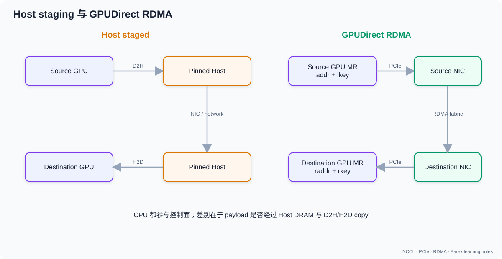

# 02. GPU、NIC、PCIe 拓扑与 DMA

## 0. 先回答：数据到底存在哪里、谁能访问

CPU、GPU、NIC 都是能发起内存访问的设备，但它们看到的地址空间和访问方式不同：

```text
CPU core  ─load/store→ CPU virtual memory
GPU SM    ─load/store→ GPU virtual memory / HBM
GPU copy engine ─DMA→ host memory 或另一 GPU
NIC DMA engine ─DMA→ 注册过的 host/GPU memory
```

一个 CUDA pointer 只保证当前 CUDA 上下文可以使用，不自动代表 NIC 有权限。
要让 NIC 访问，需要驱动把相应页 pin 住、建立 DMA mapping，并把权限编码进
`lkey/rkey` 等 handle。

### 0.1 DMA 并不是一种“数据格式”

DMA 是“由设备搬数据”的工作方式。它不限定数据是 tensor、图片还是网络包。
例如 D2H copy：

```text
CPU 写 copy descriptor：src=GPU 地址，dst=host 地址，len=64 MiB
GPU copy engine 执行 DMA
CPU/GPU event 告知 copy 完成
```

payload 仍是那 64 MiB 原始字节；DMA 描述符只是告诉硬件去哪里搬、搬多少。

### 0.2 一个 64 MiB tensor 的时间下限

假设 tensor 需要经过 PCIe 4.0 x16，单向编码后理论约 31.5 GB/s：

```text
64 MiB / 31.5 GiB/s ≈ 1.98 ms
```

这是极理想的链路传输下限。CPU bounce 路径至少有 D2H 和后续网络/对端 H2D，
不能只算一次 1.98 ms。Direct GDR 省掉 host 中转，但仍要经历 GPU↔NIC 的 PCIe
访问和网络传输。

## 1. 三种搬运路径

### 1.1 CPU bounce buffer

```text
GPU A ─D2H→ Host memory ─network→ Host memory ─H2D→ GPU B
```

需要 GPU copy engine、CPU/host memory 带宽和额外同步。TCP 与 blade-kvt staged 路径属于这一大类，虽然实际网络 copy 可能仍由 NIC DMA 完成。

### 1.2 GPU P2P

同机 GPU 可通过 NVLink 或 PCIe P2P 直接访问对端显存，不经过用户态 host bounce buffer。

```text
GPU0 ── NVLink / PCIe Switch ── GPU1
```

### 1.3 GPUDirect RDMA

NIC 直接 DMA GPU memory：

```text
GPU memory ←→ GPU BAR / peer mapping ←→ PCIe fabric ←→ NIC DMA
```

CPU 仍负责建联、注册内存、post WR 和处理 completion，但不搬运 payload。



## 2. 为什么“同一台机器”还不够

Linux P2PDMA 文档强调：PCIe 对同一 hierarchy 内的 TLP 路由定义明确，但事务一旦到达 Host Bridge，跨 hierarchy 的转发由平台决定，内核默认不会假定它安全。

按常见性能顺序：

1. GPU 与 NIC 位于同一 PCIe switch 下：最优。
2. 经同一 CPU/IOH：通常可用，但更慢。
3. 跨 socket，经 UPI/QPI/Infinity Fabric：可能严重降速，甚至不可靠。

因此 `NIC 带宽够`、`GPU 支持 GDR` 仍不能推出端到端性能好。

### 2.1 共享上行的数值例子

```text
GPU0 x16 ┐
GPU1 x16 ├─ PCIe Switch ─ x16 upstream ─ CPU
NIC0 x16 ┘
```

这里每个下行端口都标 x16，但三个设备同时访问 CPU 时共享一个 x16 upstream。
如果是 Gen4，上行总单向编码后理论值约 31.5 GB/s，不是
`3 × 31.5 = 94.5 GB/s`。

若 GPU0 与 NIC0 能在 switch 内直接 P2P，数据可能不占用 upstream；但是否允许
取决于 switch 路由、ACS、IOMMU 与平台支持，不能只根据拓扑图猜测。

## 3. `nvidia-smi topo -m` 的距离

常见标签：

| 标签 | 直觉 |
|---|---|
| `PIX` | 最多经过一个 PCIe bridge，通常同一 switch |
| `PXB` | 经过多个 PCIe bridge |
| `PHB` | 经过 PCIe Host Bridge/CPU |
| `NODE` | 跨同一 NUMA node 内多个 host bridge |
| `SYS` | 跨 NUMA node/socket |
| `NV#` | 通过若干条聚合 NVLink |

命令：

```bash
nvidia-smi topo -m
nvidia-smi topo -p2p r
nvidia-smi topo -p2p w
nvidia-smi topo -p2p n
```

对 blade-kvt，应同时看 GPU↔NIC 距离，而不是只看 GPU↔GPU。

## 4. NUMA 的两种影响

### 4.1 控制面

创建 QP、post WR、poll CQ 的 CPU thread 如果跑在远端 NUMA node，会增加 MMIO、cache miss 和内存访问延迟。

### 4.2 数据面

- staged/TCP 路径经过 host pinned buffer，直接消耗该 NUMA node 的内存带宽。
- direct GDR payload 不经 host DRAM，但拓扑仍可能经过 CPU I/O fabric。

检查：

```bash
numactl --hardware
cat /sys/bus/pci/devices/0000:65:00.0/numa_node
cat /sys/bus/pci/devices/0000:17:00.0/numa_node
```

## 5. IOMMU、ACS 与 P2P

### 5.1 IOMMU

传统 GPUDirect RDMA 要求不同 PCIe device 对物理地址有一致视图。NVIDIA 文档指出，执行非 1:1 地址转换的 IOMMU 会破坏这一前提；常见要求是关闭 IOMMU 或使用 pass-through。

现代 dma-buf 路径在驱动和内核支持下可改善注册与地址交换，但不能忽略具体平台约束。

### 5.2 ACS

Access Control Services 可以强制 P2P TLP 上行到 Root Port，从而把原本同 switch 的短路径变成长路径。虚拟化隔离需要 ACS，但性能目标可能希望允许同层 P2P。

不要未经平台安全评估就全局关闭 ACS。正确做法是：

1. 确认当前 ACS capability/control；
2. 确认 GPU/NIC 是否真的需要 P2P；
3. 与虚拟化和安全隔离要求一起评估。

## 6. GPU memory 注册

RDMA 操作不能只拿一个 CUDA pointer 就直接发。通常需要：

1. CUDA 分配的显存保持存活；
2. Barex/verbs 注册或采用该地址；
3. 得到本地 `lkey`，供本地 SGE 使用；
4. 接收端把 `raddr/rkey` 通过控制面交给发送端；
5. NIC 用 `(local addr, lkey, remote addr, rkey)` 执行 RDMA。

在 blade-kvt 中：

- `BarexCtx` 构造时逐 layer、逐 tensor 调用 `RegUserMr(..., GPU, device_id)`；
- server 将 `out.mr->rkey` 与 GPU 地址序列化给 client；
- client 的 `RDMAChannel::send_data` 构造 `rw_memp_t`。

对应源码：

- `blade-kvt/kvtransfer/src/barex_protocol.cpp:444-485`
- `blade-kvt/kvtransfer/src/rdma_channel.cpp:370-385`
- `blade-kvt/kvtransfer/src/rdma_channel.cpp:724-745`

## 7. RDMA Write 的地址四元组

```text
Local SGE:
  addr   = source GPU base + src_offset
  length = bytes
  lkey   = source GPU MR local key

Remote:
  r_addr = destination GPU base + dst_offset
  r_key  = destination GPU MR remote key
```

`lkey` 防止本地 NIC 访问未注册内存；`rkey` 授权远端 QP 对远端 MR 执行指定操作。

错误对照：

| 症状 | 常见原因 |
|---|---|
| `IBV_WC_LOC_PROT_ERR` | 本地 addr/lkey/length 不合法 |
| `IBV_WC_REM_ACCESS_ERR` | raddr/rkey 越界、失效或权限错误 |
| `IBV_WC_RETRY_EXC_ERR` | 对端/QP/网络不可达 |
| `IBV_WC_RNR_RETRY_EXC_ERR` | SEND 或 WRITE_WITH_IMM 消耗 recv WR，但对端未及时 post recv |

## 8. Pinned host memory 的角色

Pinned memory 不会被 OS 换出，GPU copy engine 与 NIC 可稳定 DMA。它不是“零拷贝”的同义词：

- TCP：GPU→pinned host 是一次 D2H；网络栈再发送。
- staged RDMA：GPU→pinned host，然后 NIC RDMA 写远端 pinned host，再 H2D。
- direct RDMA：payload 不经过 pinned host；控制消息仍可能使用 host buffer。

## 9. 实战检查清单

```bash
# 1. 树形拓扑、链路能力和当前状态
lspci -t
lspci -vv -s "$GPU_BDF" | rg 'LnkCap|LnkSta|ACSCtl'
lspci -vv -s "$NIC_BDF" | rg 'LnkCap|LnkSta|ACSCtl'

# 2. GPU/NIC 拓扑
nvidia-smi topo -m

# 3. NUMA
cat "/sys/bus/pci/devices/$GPU_BDF/numa_node"
cat "/sys/bus/pci/devices/$NIC_BDF/numa_node"

# 4. RDMA 设备
ibv_devices
ibv_devinfo
rdma link

# 5. GPU peer-memory/dma-buf 相关
lsmod | rg 'nvidia_peermem|nvidia'
dmesg | rg -i 'iommu|dmabuf|peer.?mem|rdma'
```

## 10. 自检

1. 为什么 direct GDR 不经过 host memory，仍受 PCIe/NUMA topology 影响？
2. 为什么 `rkey` 不能在目标进程重启后继续复用？
3. 为什么 WRITE_WITH_IMM 可能遇到 RNR，而普通 RDMA WRITE 通常不消耗接收 WR？
4. 为什么 staged 模式的网络很快，端到端仍可能慢？

## 参考

- [NVIDIA GPUDirect RDMA](https://docs.nvidia.com/cuda/archive/12.6.3/gpudirect-rdma/index.html)
- [Linux PCI Peer-to-Peer DMA Support](https://docs.kernel.org/driver-api/pci/p2pdma.html)
- [NVIDIA GPUDirect 概览](https://developer.nvidia.com/gpudirect)
