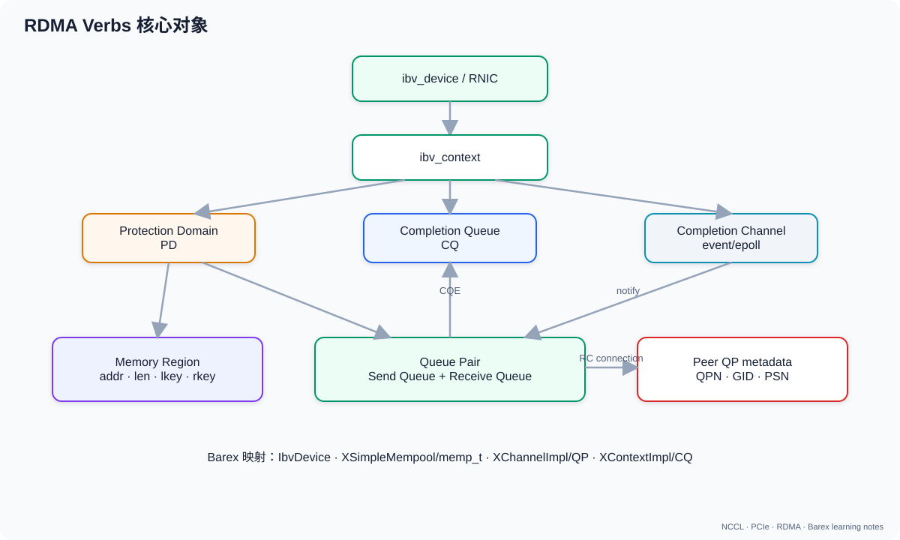

# 02a. RDMA Verbs 对象模型：从 Device 到 QP/MR/CQ

## 1. RDMA 不只是“绕过内核”

更准确的描述：

- 资源创建、权限和内存注册是 slow path，仍由内核 RDMA 子系统管理；
- 数据发送/接收是 fast path，`libibverbs` provider 通常把 queue/doorbell 映射到用户态；
- 应用写 WQE、敲 doorbell，RNIC DMA 数据；
- 完成通过 CQE 返回，应用 polling 或事件驱动消费。

Linux 官方文档明确说明：用户态通过 `/dev/infiniband/uverbsN` 创建资源，fast path 通常直接写 mmap 的硬件寄存器，不需要每个操作都 system call。

## 2. 对象全景



```text
ibv_device
  → ibv_context
      ├─ Protection Domain (PD)
      │    ├─ Memory Region (MR)
      │    └─ Queue Pair (QP)
      ├─ Completion Channel
      │    └─ Completion Queue (CQ)
      └─ device/port/GID attributes
```

| 对象 | 核心职责 | Barex 对应 |
|---|---|---|
| Device | RNIC 设备 | `IbvDevice` |
| Context | 打开的 verbs device | `IbvDevice/XContextImpl` 内部持有 |
| PD | QP/MR 的保护域 | device 创建的 `ibv_pd` |
| MR | 注册内存与访问权限 | `memp_t.mr`、`XSimpleMempool` |
| CQ | 完成队列 | `XContextImpl` 创建/轮询 |
| QP | SQ+RQ 与传输状态 | `XChannelImpl::ibv_qp_` |
| SRQ | 多 QP 共享 RQ | Barex 当前 RC channel 路径未使用 |
| CM/AH | 建联或无连接寻址 | Barex `XConnector/XListener` 自行交换 QP meta |

### 2.1 用“快递仓库”记住这些对象

这个类比不完全等价，但适合第一次记忆：

| RDMA 对象 | 快递类比 | 为什么需要 |
|---|---|---|
| Device/Context | 一家快递公司及营业账号 | 先打开哪块 RNIC |
| PD | 独立仓库园区的门禁域 | 隔离不同 QP/MR |
| MR | 已登记的货架区域 | RNIC 只能碰被授权的内存 |
| lkey/rkey | 本地/远端提货凭证 | WQE 中的硬件权限检查 |
| QP 的 SQ | 发件任务队列 | 应用提交 SEND/WRITE/READ |
| QP 的 RQ | 预先准备的收件空位 | SEND/WRITE_WITH_IMM 需要 |
| CQ | 完成回执箱 | 告诉应用哪个任务成功/失败 |
| `wr_id` | 快递单号 | 把 CQE 对回业务 callback |

类比的边界：RDMA WRITE 可以直接写入远端已授权 MR，不要求远端 CPU 临时“签收”，
这比普通快递更接近远程仓库机器人。

### 2.2 一个对象为什么不能替代另一个

- 有 MR 没 QP：内存已授权，但没有通信连接/队列。
- 有 QP 没 MR：可以发 inline 小数据，但不能让 RNIC 随意 DMA 普通 buffer。
- post WR 没 CQ：设备可能做完了，应用却无法安全判断何时复用 buffer。
- 有 rkey 没 raddr：知道通行证，不知道写入位置。
- 有 raddr 没 rkey：知道门牌号，没有硬件授权。

## 3. Device、Port、GID

一块 RNIC 可以有多个 physical port，每个 port 有：

- state；
- LID（InfiniBand 常见）；
- GID table；
- active MTU；
- link layer（InfiniBand/Ethernet）。

RoCE 中 GID 关联 IP/VLAN/RoCE version。建联时双方必须选择兼容 GID。

检查：

```bash
ibv_devices
ibv_devinfo -v
rdma link
show_gids
```

Barex 在 `XChannelImpl::GetInitData` 中交换 QP number、LID、GID、heartbeat 地址/key 和 NIC id，见：

```text
$BAREX_ROOT/src/barex/impl/rdma/xchannel_impl.cc:233-258
```

## 4. Protection Domain

PD 是访问隔离边界。MR 和 QP 必须属于兼容 PD；一个 QP 不能随意使用另一个 PD 的 lkey。

### 4.0 先说清楚 PD 与 RNIC、应用的关系

`ibv_context` 可以理解成“某个进程打开某个 verbs device 后获得的用户态设备句柄”，
但不要把它理解成“这个进程独占了整张 RNIC”：

```text
                         同一块物理 RNIC
                    ┌──────────┴──────────┐
进程 A: ibv_context A                     进程 B: ibv_context B
        ├─ PD A0                                  └─ PD B0
        └─ PD A1
```

同一块 RNIC 可以被多个进程分别 `ibv_open_device()`；同一进程也可以打开设备并在
context 下申请多个 PD。`ibv_alloc_pd(context)` 的意思是：

> 请这个 RDMA device context 创建一个新的 protection domain，并返回它的
> `ibv_pd*` 句柄。

因此“PD 和 RNIC 类似硬件与 app 的关系”不够准确。更好的理解是：

```text
RNIC / device context：提供并执行 RDMA 能力
应用：创建和管理 verbs 对象、提交 WR
PD：应用在这个 RNIC context 内申请的访问控制 namespace / 门禁域
```

PD 不是应用本身，也不是一个发送线程：

- 一个应用可以只有一个 PD，也可以为不同通信子系统创建多个 PD；
- PD 不执行数据搬运，真正执行 WR 的是 QP 和 RNIC；
- 应用不会调用 `post_send(pd, ...)`，而是调用 `ibv_post_send(qp, ...)`；
- PD 的作用是在创建/注册阶段把 QP、MR 等对象关联起来，并让 provider/RNIC 在
  fast path 校验它们是否属于同一保护域；
- PD 通常也不是网络包中的字段，对端应用不需要知道本地 `ibv_pd*` 指针。

可以把一块 RNIC 想成一栋有自动搬运机器人的仓库，把 PD 想成仓库内部相互隔离的
门禁区。应用负责申请门禁区并登记货架；QP 是接收任务的机器人工作队列；MR 是已登记
的货架。不是“PD 在操作 MR”，而是“机器人执行任务时，硬件检查它所在的门禁区是否
允许访问这个货架”。

### 4.0.1 “一个 PD 下的 MR 只能通过这个 PD 操作”该怎样准确表述

这句话的方向是对的，但更严谨的版本是：

> 一个 MR 产生的 `lkey/rkey` 只能用于与它 protection domain 兼容的 RNIC
> 工作队列/QP；PD 本身不是拿来 post 操作的对象。

例如：

```text
pd_A = ibv_alloc_pd(context)
mr_A = ibv_reg_mr(pd_A, buffer, ...)
qp_A = ibv_create_qp(pd_A, ...)

pd_B = ibv_alloc_pd(context)
qp_B = ibv_create_qp(pd_B, ...)

QP-A 的 WQE 使用 mr_A->lkey  → PD 匹配，可以继续检查 range/access
QP-B 的 WQE 使用 mr_A->lkey  → PD 不匹配，RNIC 拒绝
```

不过“只能操作”还需要分清三种视角：

| 谁在访问这段内存 | 是否受 PD 匹配约束 |
| --- | --- |
| CPU 普通 load/store、程序 `memcpy` | 不通过 verbs QP，因此不是由 PD 决定；仍受进程虚拟内存权限约束 |
| 本地 RNIC 从/向 MR 做 DMA | 发起 WR 的 QP 与 MR 必须处于兼容 PD，且 lkey、地址范围、access 都要合法 |
| 远端发起 RDMA Read/Write | 远端只携带本端公布的 `raddr+rkey`；请求到达本端 QP 后，由本端 RNIC 按本端 PD/MR 权限检查 |

所以把同一个 `buffer` 注册到 PD A，并不会让 CPU 失去对它的访问权；它只是给
RNIC 增加了一条“PD A 中哪些 QP 可以用哪组 key 对这段内存 DMA”的授权记录。

如果 QP-B 也必须访问相同的虚拟地址范围，常见做法是在 PD B 再注册一次：

```text
mr_A = ibv_reg_mr(pd_A, buffer, ...) → lkey_A / rkey_A
mr_B = ibv_reg_mr(pd_B, buffer, ...) → lkey_B / rkey_B
```

两次注册指向相同的应用 buffer，但它们是两个 verbs MR 对象和两组 key。提交给
QP-A 时必须使用 `mr_A->lkey`，提交给 QP-B 时必须使用 `mr_B->lkey`。

直觉：

```text
PD A: QP-A1, QP-A2, MR-A1
PD B: QP-B1, MR-B1

QP-A1 可以使用 MR-A1
QP-A1 不能使用 MR-B1 的 lkey
```

多 NIC/多 PD 场景里，“同一个虚拟地址注册过”不够，必须拿到当前 QP 所在 PD 对应的 MR。Barex `TryToChangeMr` 正是为此切换 MR。

### 4.1 PD、MR、QP 到底怎样对应

先纠正一句容易产生误解的话：

> MR 不是“注册在 GPU 上”，而是把一段 host/GPU virtual address range 注册给
> 某个 RNIC 的 PD，使该 RNIC 可以对它执行被授权的 DMA。

它们的基数关系通常是：

```text
1 个 ibv_context（打开的一块 RNIC）
  ├─ 可以创建多个 PD
  │
  ├─ PD A
  │   ├─ MR A0
  │   ├─ MR A1
  │   ├─ MR A2
  │   ├─ QP A0 ── SQ + RQ
  │   └─ QP A1 ── SQ + RQ
  │
  └─ PD B
      ├─ MR B0
      └─ QP B0 ── SQ + RQ
```

关键约束：

1. 一个 MR 在调用 `ibv_reg_mr(pd, ...)` 时属于**一个 PD**；
2. 一个普通 QP 在调用 `ibv_create_qp(pd, ...)` 时也属于**一个 PD**；
3. 一个 PD 可以同时包含很多 MR 和很多 QP；
4. 同一 PD 的多个 QP 可以使用其中任意合法 MR 的 lkey；
5. 同一 virtual address range 若要被另一个 PD/RNIC 使用，通常要在那个 PD 上
   重新注册，得到另一组 `ibv_mr/lkey/rkey`。

例如发送端：

```text
PD-A
  ├─ QP-A
  └─ MR-A {addr=GPU_buffer, length=1 GiB, lkey=0x1111}

post_send(QP-A, sge.lkey=0x1111)  → 合法
post_send(QP-B, sge.lkey=0x1111)  → PD 不匹配，通常得到 local protection error
```

远端 RDMA Write 使用的 `rkey` 属于**远端的 MR/PD**。本地发送方不需要也无法拿到
远端的 `ibv_pd*`；它只把 `(raddr, rkey)` 放进 WQE，对端 RNIC 用自己的
translation/protection table 校验。也就是说：

```text
本地 lkey：约束“本地 QP 可以从哪段 local memory DMA”
远端 rkey：约束“到达远端 RNIC 的请求可以访问哪段 remote memory”
```

PD 是本机 HCA 内部的隔离对象，不会作为 network packet 字段直接传给对端。

### 4.2 “一个 GPU 可以注册任意数量的 MR”吗

逻辑上，同一 GPU 上可以有很多 allocation，也可以把不同范围分别注册成很多 MR；
甚至同一范围可以因多 RNIC/多 PD 而拥有多份注册。但不是数学意义上的“任意数量”：

- HCA 有 `max_mr`、`max_mr_size` 等上限；
- 每个 MR 消耗 RNIC translation/protection table、driver 和 host memory 资源；
- GPU memory pinning、BAR/dma-buf/peer-memory mapping 也有资源成本；
- 系统 locked-memory limit、权限以及其他进程已经占用的资源会降低实际可用数量；
- 频繁 reg/dereg 是 slow path，可能远比一次数据传输本身更贵。

因此高性能通信库通常：

- 注册较大的长期存活 buffer/MR；
- 使用 registration cache；
- 对 MR 做池化和复用；
- 避免为每个 4 KiB block 单独 reg/dereg。

可以用 `ibv_query_device()`/`ibv_devinfo -v` 查询 HCA 报告的 `max_mr`、`max_qp`、
`max_qp_wr`、`max_sge`、`max_cq` 等上限。但官方 man page 特别说明：这些只是
device upper bounds，真实可创建数量还受机器配置、host memory、权限和现有占用影响。

### 4.3 Barex 当前版本怎样做

Barex 的 RDMA device manager 对每块可用 RNIC：

```cpp
ib_ctx = ctx_list[i];
ib_pd = ibv_alloc_pd(ib_ctx);
```

也就是每个 RNIC device context 建立自己的 PD。`XGpuMempoolImpl::MrForAllDevices`
会把同一 GPU buffer 分别注册到每块 RNIC 的 PD，并保存：

```text
nic_id 0 → ibv_mr 0 → lkey/rkey 0
nic_id 1 → ibv_mr 1 → lkey/rkey 1
...
```

创建 channel/QP 时，`XChannelImpl::Incubate` 使用当前 RNIC 的 PD 调
`ibv_create_qp(pd, ...)`；真正 post WR 前，`TryToChangeMr` 再按
`local_nic_id_` 选出与这个 QP/PD 匹配的 MR。

所以 Barex 的“同一个 GPU buffer 有多个 MR”不是重复劳动，而是在解决：

```text
同一个地址 + 不同 RNIC/PD
  → 必须使用不同的 RNIC registration 和 lkey
```

## 5. Memory Region

### 5.1 注册做了什么

`ibv_reg_mr(pd, addr, length, access)`：

1. 固定/管理页或建立 ODP；
2. 建立 RNIC 可用的 DMA 映射；
3. 写入 RNIC memory translation/protection table；
4. 返回 lkey/rkey。

访问标志常见：

- `IBV_ACCESS_LOCAL_WRITE`
- `IBV_ACCESS_REMOTE_WRITE`
- `IBV_ACCESS_REMOTE_READ`
- `IBV_ACCESS_REMOTE_ATOMIC`

### 5.2 lkey 与 rkey

- lkey：本地 WQE 的 SGE 使用，证明 RNIC 可以访问 local range。
- rkey：发送给远端，对方 RDMA Read/Write/Atomic 时使用。

key 不是加密密钥，而是硬件能力标识与保护检查的一部分。泄露 rkey + addr 并不等价于任意访问整机内存，它仍受 QP、PD、MR range 和 access flag 限制；但应用必须将它视为敏感 capability。

### 5.3 生命周期

必须满足：

```text
MR 注册完成
  < 所有引用它的 WR post
  < 所有这些 WR completion
  < deregister/free
```

目标进程重启或重新注册后，旧 rkey 必须视为无效。

## 6. Queue Pair

QP = Send Queue + Receive Queue。

更具体地说，QP 是 RNIC 上的一个通信执行上下文。应用把 Work Request 写入 SQ/RQ，
RNIC 取走并执行，完成结果进入 CQ。QP 通常还包含：

- QP Number（QPN），用于标识网络端点；
- transport type，例如 RC/UC/UD；
- 当前状态 RESET/INIT/RTR/RTS/ERR；
- 对端 QPN、PSN、GID/LID、retry/timeout 等连接状态；
- SQ/RQ depth、最大 SGE、inline data 等 capacity；
- 它所属的 PD，以及 send/receive CQ。

所以 QP 既不是“一个网络 packet”，也不是“一个 GPU”。在 RC 模式中，一条逻辑
点对点连接通常至少对应两端各一个 QP：

```text
Host A: QP-A(SQ/RQ)  ◄──── RC connection ────►  QP-B(SQ/RQ): Host B
```

同一 GPU worker 可以同时创建多个 QP，例如：

- 对不同 remote worker 各建 QP；
- 为同一 peer 建多个 channel/QP 增加 outstanding work 或并行度；
- 把控制流量和 bulk data 分到不同 QP；
- 多 RNIC 时，每块 NIC 建各自 QP。

QP 数量同样受硬件与软件限制。HCA 报告 `max_qp`；每个 QP 的 SQ/RQ 深度又受
`max_qp_wr`，单个 WR 的 scatter-gather 数受 `max_sge` 限制。创建 1000 个空闲
QP 与创建 1000 个深队列 QP 的资源代价也不同，所以 `max_qp` 不能直接当作推荐值。

### 6.1 SQ 能放什么

- SEND
- RDMA WRITE
- RDMA WRITE WITH IMMEDIATE
- RDMA READ
- ATOMIC

### 6.2 RQ 给谁用

RQ 主要为接收：

- 对端 SEND；
- 对端 WRITE WITH IMMEDIATE 产生的 receive completion。

普通 RDMA WRITE/READ 不要求远端应用为每个 payload post Recv。

### 6.3 常见 QP type

| 类型 | 连接/可靠性 | 操作 |
|---|---|---|
| RC | 一对一、可靠、有序 | SEND/WRITE/READ/Atomic |
| UC | 一对一、不可靠 | SEND/WRITE，能力较少 |
| UD | 无连接、不可靠 datagram | SEND/RECV |
| DC/XRC 等 | 可扩展连接模型 | 依设备与 provider |

Barex RDMA channel 创建 `IBV_QPT_RC`，见 `xchannel_impl.cc:174-227`。

## 7. RC QP 状态机

```text
RESET → INIT → RTR → RTS
                   ↘
                     ERR → RESET/销毁
```

- INIT：配置 port、PKey、access flag。
- RTR：知道对端 QPN/GID/LID/PSN，可接收。
- RTS：配置 retry、timeout、max_rd_atomic 等，可发送。
- ERR：已有 WR 可能被 flush，出现 `IBV_WC_WR_FLUSH_ERR`。

Barex `Incubate` 创建 QP，connector/listener 交换 `ChannelInitMeta`，`Init` 推进 QP 并启动 heartbeat。

## 8. Completion Queue

CQ 可被多个 SQ/RQ 共享。CQE/WC 常包含：

- `wr_id`
- status
- opcode
- byte length
- immediate data
- QP number
- vendor error

`wr_id` 完全由应用填充，RNIC 原样带回。Barex 填入 `x_wr_id*`，因此 completion 时能找到 callback、buffer 与 channel。

## 9. Completion Channel 与 polling

两种进度方式：

### Busy polling

```cpp
while ((n = ibv_poll_cq(cq, max, wc)) >= 0) {
  process(wc, n);
}
```

延迟低但占 CPU。

### Event-driven

CQ 绑定 completion channel，先收 event，再 poll CQ。注意 event 只表示“CQ 可能有数据”，仍需 poll 并重新 arm notification。

Barex 把 completion channel fd 放进 epoll，在 `ProcessIoEvents` 中 poll CQ，兼顾事件驱动和批处理。

## 10. 建联：RDMA CM 与自定义 OOB

两种常见方式：

1. `librdmacm`：resolve addr/route、connect/accept。
2. 应用自己用 TCP/共享存储交换 QP metadata，再调用 `ibv_modify_qp`。

Barex 属于第二类：

```text
XConnector/XListener (TCP OOB)
  → 交换 QPN/GID/LID/PSN/heartbeat MR
  → 修改 RC QP
  → XChannel active
```

所以 Barex 的 TCP 建联通路与 RDMA payload 通路必须分开排查。

## 11. 最小生命周期伪代码

```cpp
// 1. 找到并打开 RNIC。以下多数操作属于 slow path。
dev_list = ibv_get_device_list();
ctx = ibv_open_device(dev);

// 2. 创建保护域。后面的 MR 与 QP 要放在同一个 PD。
pd = ibv_alloc_pd(ctx);

// 3. 创建完成队列；QP 完成后 CQE 会进入这里。
cq = ibv_create_cq(ctx, ...);

// 4. 注册 buffer。此时才得到该 PD/RNIC 可用的 lkey/rkey。
mr = ibv_reg_mr(pd, buf, len, access);

// 5. QP 同时拥有 SQ/RQ，并把完成投递到 cq。
qp = ibv_create_qp(pd, {send_cq=cq, recv_cq=cq, ...});

// 6. RC QP 不能创建后直接发；要完成 RESET→INIT→RTR→RTS。
modify_qp_to_init(qp);
exchange_qp_meta_over_oob();
modify_qp_to_rtr(qp, peer);
modify_qp_to_rts(qp, retry_and_timeout);

// 7. 若使用 SEND/WRITE_WITH_IMM，接收方先准备 recv WQE。
ibv_post_recv(qp, ...);  // 如果要收 SEND/WRITE_WITH_IMM

// 8. post 返回只代表“任务被接受”，不是数据已完成。
ibv_post_send(qp, ...);

// 9. poll 到对应 wr_id 的成功 CQE 后，才能按该操作的完成语义继续。
ibv_poll_cq(cq, ...);

// 10. 先确保没有 inflight WR，再按依赖关系反向销毁。
destroy_qp();
dereg_mr();
destroy_cq();
dealloc_pd();
close_device();
```

销毁顺序应确保没有 inflight WR。

## 12. Barex 对照阅读

| Verbs 概念 | 文件/函数 |
|---|---|
| device/PD/CQ | `impl/rdma/xdevice_manager_impl.*`、`xcontext_impl.*` |
| QP create | `xchannel_impl.cc:71-230` |
| exchange meta | `GetInitData/Init` |
| MR | `xgpu_mempool_impl.*`、`xsimple_mempool_impl.*` |
| post WR | `XChannelImpl::PostSend` |
| poll CQ | `XContextImpl::ProcessIoEvents` |
| WC dispatch | `ProcessOneIoEvent` |
| channel error | `HandleWcStatusError` |

## 13. 自检

1. 为什么同一地址在不同 PD 上需要不同 MR/lkey？
2. 普通 RDMA Write 为什么不需要远端 RQ？
3. `wr_id` 为什么是连接 WR 与业务 callback 的关键？
4. QP 进入 ERR 后为什么后续大量 completion 都是 FLUSH_ERR？
5. 一个 PD 能否有多个 MR 和多个 QP？一个普通 QP 能否同时属于两个 PD？
6. 为什么“同一个 GPU buffer 已注册”仍不代表任意 RNIC/QP 都能使用这个 lkey？
7. `max_qp`、`max_mr` 为什么只是 upper bound，而不是应用应该创建的数量？

## 参考

- [Linux Userspace verbs access](https://docs.kernel.org/infiniband/user_verbs.html)
- [Linux RDMA：PD 关联 QP、MR、MW、AH 等对象](https://docs.kernel.org/driver-api/infiniband.html)
- [`ibv_alloc_pd(3)`](https://man7.org/linux/man-pages/man3/ibv_alloc_pd.3.html)
- [`ibv_reg_mr(3)`：PD、访问权限、lkey 与 rkey](https://man7.org/linux/man-pages/man3/ibv_reg_mr_ex.3.html)
- [`ibv_create_qp(3)`：QP 与 PD、SQ/RQ capacity](https://man7.org/linux/man-pages/man3/ibv_create_qp.3.html)
- [`ibv_query_device(3)`：max_qp、max_mr、max_pd 等设备上限](https://man7.org/linux/man-pages/man3/ibv_query_device.3.html)
- [rdma-core](https://github.com/linux-rdma/rdma-core)
