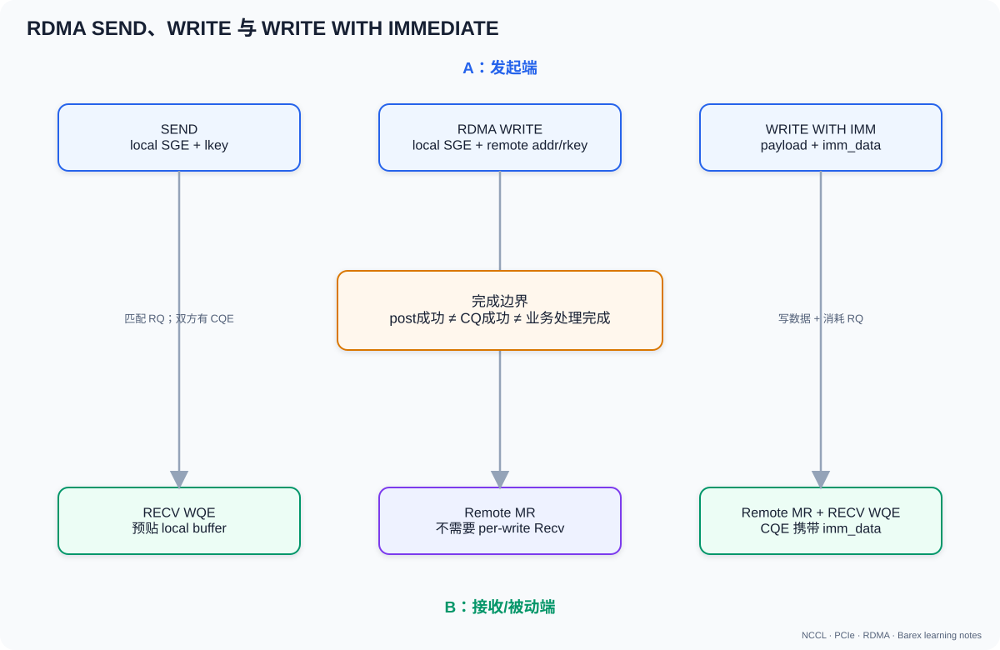

# 02b. RDMA 操作、WR/CQ 完成与可靠性

## 1. Two-sided 与 One-sided



### SEND/RECV

发送端：

```text
SQ: SEND(local SGE)
```

接收端必须提前：

```text
RQ: RECV(local SGE)
```

RNIC 匹配 RQ WQE，把 payload DMA 到接收 buffer，并在双方 CQ 产生 completion。

### RDMA WRITE

发起端 SQ WQE 同时携带：

```text
local SGE(addr, length, lkey)
remote addr + rkey
```

接收端 CPU 不 post 对应 Recv，也不天然收到“哪个业务消息完成”的通知。

### RDMA READ

发起端从远端 MR 读取到本地 SGE。响应数据沿网络返回，因此对 RTT、outstanding read、`max_rd_atomic` 更敏感。

### Atomic

对远端 8-byte 等受支持位置做 Compare-and-Swap 或 Fetch-and-Add。限制依硬件和 QP type。

### 1.1 四种操作放在同一个例子里

假设机器 A 要把 4 KiB 数据交给机器 B：

#### SEND/RECV：B 先准备“收件箱”

原来的三行写法省略了最关键的 RQ 状态变化。完整过程如下：

```text
机器 B                                                   机器 A

① 注册一块本地内存 buffer_B，得到 lkey
② 构造 Receive WR：
     wr_id  = buffer_B 的业务编号
     SGE    = (addr=buffer_B, length=4 KiB, lkey)
③ ibv_post_recv(qp_B, recv_wr)
   将 Receive WQE 放入 B 的 RQ

RQ_B：
┌───────────────────────────────────────────────┐
│ Receive WQE: buffer_B + 4 KiB + lkey + wr_id │  ← 这就是“准备收件箱”
└───────────────────────────────────────────────┘

                                                   ④ 构造 SEND WR：
                                                        local buffer_A
                                                        length=4 KiB
                                                        local lkey
                                                   ⑤ ibv_post_send(qp_A, send_wr)

⑥ SEND packet 到达 B 的 RNIC
⑦ B 的 RNIC 从 RQ_B 取出一个 Receive WQE
⑧ RNIC 把 payload DMA 写入该 WQE 的 SGE：
     buffer_A 的数据 → buffer_B
⑨ 这个 Receive WQE 被消费，从 RQ 中移除
⑩ B 的 Receive CQ 出现 CQE：
     opcode   = IBV_WC_RECV
     wr_id    = buffer_B 的业务编号
     byte_len = 4096
⑪ B poll 到 CQE，开始处理 buffer_B
```

因此“B 先准备收件箱”具体体现在第 ③ 步：

```text
ibv_post_recv()
  → provider 生成 Receive WQE
  → WQE 被放入 B 的 RQ
  → WQE 中的 SGE 指明 RNIC 将来把 SEND payload 写到哪里
```

注意，RQ 里放的不是 4 KiB 数据，也不是已经收到的 packet，而是一张“如果下一条
SEND 到达，请写入这块内存”的空 buffer 描述符。

##### 为什么 B 必须补充 RQ

一个普通 SEND message 会消费一个 Receive WQE，RNIC 不会在使用后自动把它放回 RQ：

```text
初始：
RQ_B = [WQE(buffer_0), WQE(buffer_1)]

收到第 1 条 SEND：
RQ_B = [WQE(buffer_1)]
buffer_0 交给 B 的应用处理

收到第 2 条 SEND：
RQ_B = []
buffer_1 交给 B 的应用处理

第 3 条 SEND 到达：
没有可用 Receive WQE
→ RC 通常返回 RNR NAK（Receiver Not Ready）
→ A 的 RNIC 等待后重试
→ 若长期没有补充，最终可能 retry exhausted/timeout
```

所以“及时补充”不是要求 B 在每条 packet 后补一次，而是要求它维持足够的
**posted Receive WQE 数量**，覆盖消息到达速率和应用处理/重新 post 的延迟。

常见做法是准备一个 receive buffer pool：

```text
空闲 buffer
  → post_recv，所有权交给 RNIC
  → SEND 到达并产生 CQE
  → 所有权交给 B 的应用
  → 应用处理完成
  → 再次 post_recv，所有权重新交给 RNIC
```

如果应用还在读取 `buffer_0` 就把它重新 post，下一条 SEND 可能覆盖应用尚未处理完的
内容；因此补充 RQ 还涉及 buffer 所有权和生命周期。

##### `buffer_B` 是最终业务地址，还是中转 buffer

两种方式都可以。

**方式一：直接把最终业务 buffer post 到 RQ。**

如果 B 在消息到达前就知道：

- 下一条 SEND 对应哪个 request；
- 数据最大长度；
- 最终应该落入哪块已注册内存；
- 这块内存在完成前不会被别的任务使用；

那么 B 可以直接：

```text
post_recv(final_business_buffer, 4 KiB)
```

RNIC 会把数据直接写入最终业务 buffer，不需要 B 再复制一次。例如一个严格
request-response 协议中，B 发出 request 后，确定下一条 response 就属于这个 request，
便可以提前 post 对应的最终 buffer。

**方式二：post 通用 receive/staging buffer。**

如果 B 事先不知道下一条消息属于哪个 request，常见做法是：

```text
RQ 提前挂一批通用 buffer
  → 收到 CQE
  → 根据 wr_id 找到 buffer
  → 解析消息 header/request_id
  → 直接在该 buffer 上处理，或者复制/搬运到最终业务地址
  → 处理结束后把 buffer 放回 pool 并 repost
```

这里“staging”不等于一定复制。如果协议允许，业务逻辑可以直接消费 receive buffer；
只有最终数据结构要求另一个地址、GPU buffer、不同生命周期或需要重新组装时，才需要
额外 copy/DMA。

“A 不直接指定 B 的最终业务地址”的准确含义是：

```text
SEND WR 中没有 B 的 virtual address 和 rkey。
A 只把消息发给已连接的 QP。
最终落到哪块 B 内存，由 B 的下一个 Receive WQE 决定。
```

这描述的是**地址控制权在 B**，不是说 SEND 一定要落到临时 buffer。

优点是 B 自然获得消息 completion，而且不必把远端地址/rkey 暴露给 A；缺点是 B 必须
维护 RQ/SRQ、buffer pool 与所有权。如果 A 必须逐次精确指定 B 的任意目标地址，
RDMA WRITE 更符合这种语义。

#### WRITE：A 直接写 B 的目标地址

```text
B: 注册 target_B，发送 (raddr, rkey) 给 A
A: post_write(buffer_A → target_B, 4 KiB)
A: 收到本地 CQE
```

B 不需要 post_recv，但也不会仅凭普通 WRITE 自动得到一条“新消息到达”的 CQE。
应用要另加 flag、doorbell、WRITE_WITH_IMM 或控制消息。

#### READ：A 主动从 B 拉

```text
B: 注册 source_B，发送 (raddr, rkey) 给 A
A: post_read(source_B → buffer_A, 4 KiB)
A: 收到本地 CQE
```

READ 需要请求和响应，往返延迟更明显。它适合“消费者知道何时、从哪里拉取”。

#### Atomic：A 修改 B 的一个小状态

```text
A: fetch_add(remote_counter_B, +1)
```

Atomic 适合计数器/锁等小控制状态，不适合搬 4 KiB payload。

### 1.2 初学者选型表

| 问题 | 更可能的选择 |
|---|---|
| 接收方希望自然收到消息通知 | SEND/RECV |
| 发送方已知远端最终地址，追求直接落位 | RDMA WRITE |
| 接收方决定何时取数据 | RDMA READ |
| 写数据同时要轻量通知远端 | WRITE_WITH_IMM |
| 修改远端计数/状态 | Atomic |

这不是绝对规则。真实系统还会考虑硬件限制、安全、队列模型与业务完成语义。

### 1.3 五种 operation 一张表看完

下面默认讨论最常见的 RC QP。不同 transport type 支持的 opcode 集合不同，例如
RDMA Read 和 Atomic 不能简单套用到所有 UD/UC QP。

| Operation | 谁决定远端 payload 地址 | 需要远端 `raddr+rkey` | 远端要提前 post Receive WQE | 远端自然得到 CQE | payload 方向 | 典型用途 |
| --- | --- | --- | --- | --- | --- | --- |
| SEND | 接收端通过 Receive WQE 提供 buffer | 否 | **是** | **是，`IBV_WC_RECV`** | 发起端 → 接收端 | 消息、控制面、地址交换 |
| RDMA WRITE | 发起端根据已交换的远端地址决定 | **是** | 否 | 否 | 发起端 → 远端 MR | 大块 payload 直接落位 |
| WRITE WITH IMMEDIATE | 发起端决定 payload 地址 | **是** | **是，通知会消耗一个 RQ entry** | **是，`IBV_WC_RECV_RDMA_WITH_IMM`** | 发起端 → 远端 MR | 写数据并通知远端 |
| RDMA READ | 发起端决定从远端哪里读取 | **是** | 否 | 否 | 远端 MR → 发起端 | 消费者主动拉取 |
| ATOMIC | 发起端指定远端原子变量地址 | **是** | 否 | 否 | 修改远端 8-byte 状态，旧值返回本地 | 计数器、锁、状态机 |

“远端自然得到 CQE”是指对端应用在自己的 receive CQ 上可以直接 poll 到这次操作。
所有这些 operation 只要在发起端使用 `IBV_SEND_SIGNALED`，发起端都可以在 send CQ
得到本地 completion；这是另一件事。

### 1.4 One-sided 到底省略了哪一侧

One-sided 不表示“只有一块 RNIC 工作”，也不表示“数据不经过远端 RNIC”。它表示：

> 完成地址/key 交换后，发起端可以提交这次数据操作，而远端应用不需要为每次操作
> 再 post 一个与之配对的数据 WR。

例如普通 WRITE：

```text
应用 A post WRITE
  → RNIC A 读取 A 的 local MR
  → 网络传输
  → RNIC B 校验 rkey 并写 B 的 remote MR

应用 B 不需要为这次 WRITE post_recv，也不会自动收到 receive CQE
```

SEND 则是 two-sided，因为接收端必须提前 post Receive WQE：

```text
应用 B post RECV
应用 A post SEND
  → 两端 RNIC 匹配 SEND/RECV
  → B 得到 receive CQE
```

WRITE_WITH_IMM 是一个很有教学价值的“混合体”：payload placement 是 one-sided
WRITE，但 remote notification 使用 receive queue resource。

## 2. 五种 RDMA operation 逐项拆解

### 2.1 SEND：把消息交给接收端准备好的 buffer

SEND 是消息语义的 two-sided operation。发送端只描述本地数据：

```cpp
ibv_sge send_sge = {
    .addr   = local_addr,
    .length = length,
    .lkey   = local_mr->lkey,
};

ibv_send_wr send_wr = {
    .opcode  = IBV_WR_SEND,
    .sg_list = &send_sge,
    .num_sge = 1,
};
```

发送 WR 中没有远端 virtual address，也没有远端 rkey。接收端提前提交：

```cpp
ibv_sge recv_sge = {
    .addr   = recv_buffer,
    .length = recv_capacity,
    .lkey   = recv_mr->lkey,
};

ibv_recv_wr recv_wr = {
    .wr_id   = recv_buffer_id,
    .sg_list = &recv_sge,
    .num_sge = 1,
};

ibv_post_recv(recv_qp, &recv_wr, &bad_recv_wr);
```

数据路径：

```text
发送端 local MR
      │ RNIC DMA read
      ▼
   SEND packet
      │
      ▼
接收端 RNIC 取出下一个 Receive WQE
      │ RNIC DMA write
      ▼
Receive WQE 指定的 buffer
```

双方 completion：

```text
发送端 send CQ：IBV_WC_SEND
接收端 recv CQ：IBV_WC_RECV
```

接收端通过 Receive WQE 的 `wr_id` 找回 buffer，通过 `wc.byte_len` 得到实际消息长度。
Receive WQE 被消费后要重新 post。若 SEND 到达时没有可用 Receive WQE，RC 会出现
RNR；如果接收 buffer 小于消息，操作会失败，而不是自动帮应用分配更大的 buffer。

这里还可以用一张“谁指定哪个地址”的表来确认：

| 内容 | A 的 SEND WR | B 的 Receive WR/WQE |
| --- | --- | --- |
| A 的 local source address | 指定 | 不知道 |
| A 的 local lkey | 指定 | 不知道 |
| B 的 destination address | **不指定** | 由 Receive SGE 指定 |
| B 的 destination lkey | **不指定** | 由 Receive SGE 指定 |
| B 的 remote rkey | 不需要 | 不需要 |
| 收到后用于找回 buffer 的 ID | 不决定 | `recv_wr.wr_id` |

##### 用 4 个 buffer 维持 RQ 的伪代码

```cpp
// 初始化：B 先把 4 个空 buffer 全部交给 RNIC。
for (int i = 0; i < 4; ++i) {
    post_recv(qp, buffers[i], /*capacity=*/4096, /*wr_id=*/i);
}

while (running) {
    ibv_wc wc;
    if (ibv_poll_cq(recv_cq, 1, &wc) != 1) {
        continue;
    }

    int id = static_cast<int>(wc.wr_id);
    char* received = buffers[id];
    size_t actual_bytes = wc.byte_len;

    // 此时这个 buffer 不在 RQ；所有权属于应用。
    handle_message(received, actual_bytes);

    // handle_message 完成后，才允许同一 buffer 再接收新消息。
    post_recv(qp, buffers[id], /*capacity=*/4096, /*wr_id=*/id);
}
```

稳态下 RQ depth 会短暂从 4 降到 3，再由 repost 回到 4。若处理速度追不上消息到达速度，
所有 buffer 都会进入“应用处理中”状态，RQ 最终降到 0，并触发 RNR。这时解决办法可能是：

- 增加 receive buffer/RQ depth；
- 加快 CQ polling 和消息处理；
- 把处理与 repost 解耦；
- 使用 SRQ 让多个 QP 共享 receive buffer；
- 增加发送端 flow control，不让它超过接收端公布的 message credit；
- 如果业务本来就知道精确远端地址，考虑 WRITE + 明确通知协议。

SEND 的关键性质：

- 接收端选择数据落在哪个 receive buffer；
- 发送端不需要知道远端地址和 rkey；
- 接收端天然得到一条“消息到达”completion；
- 代价是接收端必须维护 RQ/SRQ 深度和 buffer 生命周期；
- 很适合控制消息、连接元数据、变长消息协议和主动消息。

不要把 verbs `IBV_WR_SEND` 与 PyTorch/NCCL 的 `send()` 名字直接画等号。NCCL
`ncclSend/ncclRecv` 表示点对点通信语义，底层 network plugin 可以使用 verbs SEND，
也可以使用 WRITE 加控制协议实现。

### 2.2 RDMA WRITE：发起端直接把数据推到远端指定地址

RDMA WRITE 是 one-sided push。发起端 WR 同时描述：

```text
从本地哪里读：local addr + length + lkey
向远端哪里写：remote addr + rkey
```

伪代码：

```cpp
ibv_send_wr wr = {};
wr.opcode = IBV_WR_RDMA_WRITE;
wr.sg_list = &local_sge;
wr.num_sge = 1;
wr.wr.rdma.remote_addr = remote_addr;
wr.wr.rdma.rkey = remote_rkey;

ibv_post_send(qp, &wr, &bad_wr);
```

使用前，远端必须通过控制面把 `(remote_addr, rkey)` 交给发起端，并且远端 MR
注册时允许 `IBV_ACCESS_REMOTE_WRITE`。

数据路径：

```text
发起端 local MR
      │
      │ RNIC A DMA read
      ▼
  RDMA WRITE
      │
      ▼
RNIC B 校验 QP/PD/rkey/range/access
      │
      │ DMA write
      ▼
远端指定 MR 地址
```

普通 WRITE：

- 不消耗远端 Receive WQE；
- 不把 payload 写进远端 receive buffer，而是写 `remote_addr` 指定的位置；
- 发起端可以得到 `IBV_WC_RDMA_WRITE` 本地 completion；
- 远端应用不会仅因这次 WRITE 自动得到 receive CQE；
- 远端 CPU/GPU kernel 也不会自动知道“新数据已到达”。

因此 WRITE 常配合额外的可见性协议：

```text
方案 A：WRITE payload → WRITE flag/sequence
方案 B：WRITE payload → SEND control message
方案 C：WRITE_WITH_IMM(payload + notification)
方案 D：发送端完成后，通过更高层 RPC/doorbell 通知
```

WRITE 很适合：

- KV cache 已经知道目标 block 地址；
- 远端预先分配 staging buffer；
- 大 payload 希望直接落位；
- 远端不需要为每个 data chunk 运行 CPU receive handler。

### 2.3 RDMA WRITE WITH IMMEDIATE：直接落位，再向远端 CQ 投递 32-bit 通知

WRITE_WITH_IMM 同时完成两件事：

1. 把 payload 按普通 RDMA Write 写到 `remote_addr+rkey`；
2. 向远端 receive CQ 产生一个携带 32-bit `imm_data` 的 completion。

发起端：

```cpp
wr.opcode = IBV_WR_RDMA_WRITE_WITH_IMM;
wr.imm_data = htonl(imm);
wr.wr.rdma.remote_addr = remote_addr;
wr.wr.rdma.rkey = remote_rkey;
```

远端 poll 到：

```cpp
if (wc.opcode == IBV_WC_RECV_RDMA_WITH_IMM &&
    (wc.wc_flags & IBV_WC_WITH_IMM)) {
    uint32_t imm = ntohl(wc.imm_data);
    on_notification(imm);
}
```

最容易理解错的是 Receive WQE 的作用：

```text
payload ───────────────> remote_addr 指向的远端 MR
imm_data ──────────────> 远端 CQE
Receive WQE ───────────> 只提供通知所需的 RQ credit/receive context
```

也就是说，payload 通常不会写进 Receive WQE 的 SGE buffer，但这次操作仍会消费一个
Receive WQE。接收端需要提前 post/repost receive；没有 RQ entry 时会 RNR。根据
provider/应用设计，这种 notification receive 可以使用很小的占位 buffer，或在设备
支持时使用零 SGE Receive WR。

WRITE_WITH_IMM 的“immediate”不是“绕过网络立刻完成”，而是“WR 额外携带一个
立即数”。它通常只有 32 bit，适合编码：

- message type；
- buffer id；
- queue slot id；
- sequence number；
- 较小的长度/状态字段。

它不适合承载完整业务 metadata；复杂 metadata 应放在 MR 或控制消息中。immediate
value 还要留意网络字节序，常见写法是发送端 `htonl()`、接收端 `ntohl()`。

blade-kvt staged RDMA 用 immediate 编码 remote staging buffer id：

```text
WriteSingle(signal_peer=true, imm_data=buffer_id)
  → remote OnImmRecvCall
  → 找 staging buffer
  → H2D scatter
```

Barex 内部还会使用 immediate value 的一部分 bit 表示内部消息类型，所以 Barex
用户实际可用的 bit 数要遵守它的 API 约定，不能把原生 verbs 的 32 bit 全部当作
业务字段。

direct RDMA 不需要远端 per-layer callback，所以 `WriteBatch` 通常使用普通 WRITE，
不为每项 signal peer。

### 2.4 RDMA READ：发起端主动从远端拉数据

READ 是 one-sided pull。发起端提供：

```text
远端源：remote addr + rkey
本地目的：local addr + length + lkey
```

伪代码：

```cpp
wr.opcode = IBV_WR_RDMA_READ;
wr.sg_list = &local_destination_sge;
wr.num_sge = 1;
wr.wr.rdma.remote_addr = remote_source_addr;
wr.wr.rdma.rkey = remote_rkey;
```

它的数据方向和请求方向相反：

```text
READ request：发起端 RNIC A ──────────────> 远端 RNIC B
READ data：   发起端 local buffer <──────── 远端 source MR
```

远端 MR 必须允许 `IBV_ACCESS_REMOTE_READ`。远端不需要 post Receive WQE，也不会
自动得到 receive CQE；远端 RNIC 收到 READ request 后读取本地 MR，再返回 READ
response data。

发起端 poll 到成功的 `IBV_WC_RDMA_READ` 后，才能安全使用 local destination
buffer 中的数据。与 WRITE 相比，READ 至少包含 request/response 往返，因此对下面
因素更敏感：

- network RTT；
- 可同时 outstanding 的 READ 数量；
- initiator `max_rd_atomic`；
- responder `max_dest_rd_atomic`；
- 返回数据的链路带宽和 PCIe/GPU memory 写入路径。

READ 适合“消费者掌握拉取时机”的场景，例如：

```text
生产者发布 remote_addr+rkey+ready state
消费者需要时发起 READ
消费者本地 CQE 完成后使用数据
```

### 2.5 ATOMIC：在远端做不可分割的 read-modify-write

基础 RC verbs 常见两种 64-bit Atomic：

#### Compare-and-Swap

```text
old = *remote_addr
if old == compare:
    *remote_addr = swap
把 old 返回到发起端 local result buffer
```

对应：

```cpp
wr.opcode = IBV_WR_ATOMIC_CMP_AND_SWP;
wr.wr.atomic.remote_addr = remote_addr;
wr.wr.atomic.rkey = remote_rkey;
wr.wr.atomic.compare_add = compare;
wr.wr.atomic.swap = swap;
```

它可以实现“只有状态仍为预期值才更新”，常用于锁、状态机和无锁数据结构。

#### Fetch-and-Add

```text
old = *remote_addr
*remote_addr = old + add
把 old 返回到发起端 local result buffer
```

对应：

```cpp
wr.opcode = IBV_WR_ATOMIC_FETCH_AND_ADD;
wr.wr.atomic.remote_addr = remote_addr;
wr.wr.atomic.rkey = remote_rkey;
wr.wr.atomic.compare_add = add;
```

可以用于远端计数器、ticket 分配或申请 ring-buffer offset。

Atomic 的远端 MR 需要 `IBV_ACCESS_REMOTE_ATOMIC`。操作不需要远端 Receive WQE，
远端也不会自然收到 CQE；修改前的旧值通过网络返回到发起端本地 SGE，因此它与 READ
一样消耗 request/response 和 responder atomic/read resource。

基础语义通常要求远端地址满足设备的 8-byte 对齐要求，支持的操作、宽度和扩展
atomic 能力需要查询具体 RNIC。更重要的是，libibverbs 官方说明的基础 atomic 保证
有作用域限制：

> 只有当对该内存的相关写入都通过同一 RDMA hardware 时，才能直接依赖这类 hardware
> atomic；它不自动与 CPU 或系统中另一块 RDMA hardware 对同一地址的写入形成统一
> 原子域。

因此下面这种混用不能只凭 `IBV_WR_ATOMIC_*` 就断言正确：

```text
RNIC A 对 counter 做 Fetch-and-Add
同时 CPU 使用普通非原子 store 修改 counter
同时 RNIC B 也写同一 counter
```

还必须依据平台的 atomic coherence 能力、内存类型和同步协议设计。

Atomic 适合小型控制状态，不适合传输 payload。用 Atomic 为每个小包更新全局热点
计数器还可能造成远端串行化和严重争用。

### 2.6 一次操作里到底有哪些地址和 key

| Operation | 发起端 local SGE | 远端地址/rkey | 远端 Receive SGE |
| --- | --- | --- | --- |
| SEND | payload source | 无 | payload destination |
| WRITE | payload source | payload destination | 无 |
| WRITE_WITH_IMM | payload source | payload destination | 通常不承载 payload，但需要一个 RQ entry |
| READ | READ result destination | READ source | 无 |
| ATOMIC | 旧值 result destination | atomic variable | 无 |

注意 READ/ATOMIC 的 local SGE 是“接收返回数据的目的 buffer”，与 SEND/WRITE 的
“发送 payload 的源 buffer”方向相反。

### 2.7 Completion 表示什么

| Operation | 发起端成功 CQE 说明 | 远端应用天然知道什么 |
| --- | --- | --- |
| SEND | transport 按 QP 语义完成 SEND，本地源 buffer 可按 completion 规则复用 | 收到 `IBV_WC_RECV`，知道某个 receive buffer 收到消息；不代表业务已处理 |
| WRITE | WRITE 按 transport 语义完成，本地源 buffer可复用 | 没有 receive CQE；仅靠普通 WRITE 不知道业务事件发生 |
| WRITE_WITH_IMM | payload write 与 immediate notification 按该 WR 语义完成 | 收到带 immediate 的 CQE；payload 在 remote MR，不在 receive buffer |
| READ | 返回数据已经进入发起端 local destination，可读取 | 没有天然通知 |
| ATOMIC | 原子操作完成，旧值已返回 local result buffer | 没有天然通知 |

无论哪一种 operation，硬件 completion 都不等于远端业务处理完成。例如：

```text
WRITE_WITH_IMM CQE 到达
  ≠ 远端 CPU callback 已执行完
  ≠ 远端 CUDA kernel 已消费 payload
  ≠ 整个 blade-kvt request 已完成
```

如果发送端必须知道“远端业务已经处理完成”，仍需应用层 ACK/response。

### 2.8 Packet 到达后保存在哪里，ACK 又表示什么

不要把以下三个对象混为一谈：

```text
RNIC ingress/reorder packet buffer
  ≠ QP Receive Queue（RQ）
  ≠ Receive WQE 指向的 application buffer
```

- RNIC ingress/reorder buffer 是网卡内部的临时 packet 缓冲，用来接收、校验、排序和
  组装协议报文；
- RQ 是 Receive WQE 描述符组成的队列；它告诉 RNIC “下一条 SEND 消息可以写到哪块
  已注册内存”，RQ 本身通常不是 payload 的长期存储位置；
- application buffer 是 Receive WQE 的 SGE 指向的 MR，SEND payload 最终 DMA 到
  这里，应用之后从这里读取。

以 RC SEND 为例：

```text
packet 到达接收端 RNIC
  → 检查 Ethernet/IP/UDP/RoCE header 与 ICRC
  → 根据 QP number 找到目标 QP
  → 检查 PSN，处理乱序/重复/错误
  → 匹配一个 Receive WQE
  → 将 payload DMA 到 Receive WQE 的 SGE buffer
  → 更新 RC protocol state，产生 ACK/NAK
  → 完整 message 完成后向接收 CQ 写入 CQE
  → 应用 poll 到 CQE 后读取 application buffer
```

ACK 不一定严格“一包一个”；可靠传输可以按协议和设备策略进行累计、延迟或合并 ACK。
这里的 transport ACK 大致表示 responder RNIC 已按可靠传输语义接受并推进相应 PSN，
不是：

```text
远端应用已经 poll CQ
远端 callback 已运行
远端 CUDA kernel 已消费数据
整个业务 request 已完成
```

ACK 发出后，RNIC 不需要因为“等待应用使用”而把完整 packet 长期留在 ingress buffer
或 RQ。协议 header 等临时 packet 状态可以释放；payload 已经落入目的 memory，后续
由该 memory 的生命周期规则管理。Receive WQE 被消费，应用处理完 buffer 后通常再
post 一个新的 Receive WQE。

不同 operation 的落点和可用通知不同：

| Operation | payload 最终在哪里 | 接收端怎么知道可以使用 |
| --- | --- | --- |
| SEND | Receive WQE 的 SGE buffer | poll 到 `IBV_WC_RECV` CQE |
| WRITE | WR 给出的 remote address/MR | 没有天然远端 CQE；需要额外 flag、SEND、业务协议或其他同步 |
| WRITE_WITH_IMM | WR 给出的 remote address/MR | poll 到 `IBV_WC_RECV_RDMA_WITH_IMM` CQE；Receive WQE 通常只承接通知 |
| READ | 返回到发起端 local SGE | 发起端 poll 到 READ completion |

因此“接收端已经回了 transport ACK”与“远端程序现在可以无条件读这块数据”也不能
简单画等号。接收程序应等待为该 operation 设计的 completion/notification，并满足
CPU/GPU memory visibility、stream ordering 与 buffer ownership 规则。尤其 plain
RDMA WRITE 没有远端 receive CQE，必须由上层协议明确通知边界。

## 3. WR、WQE 与 SGE

不要一上来就看 `ibv_post_send()` 代码。先把三个缩写逐个定义清楚：

```text
WR  = Work Request
WQE = Work Queue Element
SGE = Scatter/Gather Element
```

它们分别处于不同层次：

```text
SGE：描述“一段本地内存”
  ↓ 一个或多个 SGE 被 WR 引用
WR：描述“应用希望执行的一次逻辑操作”
  ↓ post 后由 provider 编码
WQE：描述“RNIC 可以从硬件队列取走并执行的一项工作”
```

### 3.1 先逐个定义：全称、含义与用途

#### 3.1.1 WR：Work Request

**英文全称：Work Request。中文可译为“工作请求”。**

这里的 `Work` 是“要网卡完成的一项工作”，不是特指 WRITE；`Request` 表示它是应用
提交给 verbs/provider 的软件请求。

定义：

> WR 是应用在软件接口层构造的请求对象，用来表达“我希望这个 QP 执行什么操作、
> 使用哪些本地内存、是否需要 completion，以及该 operation 的专用参数是什么”。

libibverbs 中主要有两类 WR：

```text
ibv_send_wr
  用于提交到 SQ
  可表达 SEND、RDMA WRITE、RDMA READ、ATOMIC 等主动操作

ibv_recv_wr
  用于提交到 RQ/SRQ
  表达“下一条 SEND/Immediate 到达时，可以使用哪些本地 receive buffer”
```

WR 的用途是把一次逻辑操作的参数交给 provider。以 `ibv_send_wr` 为例，重要字段包括：

| 字段 | 用途 |
| --- | --- |
| `wr_id` | 应用自定义的 64-bit cookie；CQE 会带回来，便于找回 request/buffer/callback |
| `next` | 把多条 WR 串成 linked list，一次 `ibv_post_send()` 批量提交 |
| `sg_list` | 指向 SGE 数组，描述本地数据从哪里读或写到哪里 |
| `num_sge` | 本 WR 使用多少个 SGE |
| `opcode` | 操作类型，如 `IBV_WR_SEND`、`IBV_WR_RDMA_WRITE` |
| `send_flags` | 是否 signaled、inline、fence 等 |
| `wr.rdma.remote_addr` | READ/WRITE 的远端 virtual address |
| `wr.rdma.rkey` | 访问该远端地址所需的 rkey |
| `imm_data` | WITH_IMM 操作携带的 32-bit immediate data |

一条 WR 的例子：

```cpp
ibv_send_wr wr = {};
wr.wr_id      = request_id;
wr.opcode     = IBV_WR_RDMA_WRITE;
wr.send_flags = IBV_SEND_SIGNALED;
wr.sg_list    = &local_sge;
wr.num_sge    = 1;
wr.wr.rdma.remote_addr = remote_address;
wr.wr.rdma.rkey        = remote_rkey;
```

此时它仍然只是 CPU 进程内存中的 C 结构体：

```text
构造 WR
  ≠ 已经进入 SQ
  ≠ RNIC 已经看到
  ≠ 数据已经发送
```

只有调用 `ibv_post_send()` 或 `ibv_post_recv()` 后，provider 才接受并转换这个请求。

WR 的创建者和读取者：

```text
应用/通信库创建 WR
       ↓
libibverbs provider 在 post 调用中读取 WR
       ↓
provider 将其编码成硬件 WQE
```

所以 WR 是 **portable verbs API 层对象**；不同 RNIC 仍使用相同的
`ibv_send_wr/ibv_recv_wr` 接口。

#### 3.1.2 WQE：Work Queue Element

**英文全称：Work Queue Element。中文可译为“工作队列元素”。**

拆开理解：

```text
Work Queue = 设备工作队列
Element    = 队列中的一个元素/槽位
```

定义：

> WQE 是 provider 根据 WR 编码出的、放入 QP 的 SQ/RQ、可由 RNIC 直接解释和执行的
> 硬件工作描述符。

WQE 的用途是把软件请求变成设备可执行格式。例如一条 RDMA WRITE WQE 需要让 RNIC
知道：

```text
执行哪种 opcode
从哪些 local registered memory 读取
一共传多少字节
使用哪个 local lkey
写到哪个 remote address
使用哪个 remote rkey
是否 inline/signaled/fenced
完成后是否需要写 CQE
```

两类最常见的 WQE：

```text
Send WQE
  位于 QP Send Queue
  RNIC 主动执行 SEND/WRITE/READ/ATOMIC

Receive WQE
  位于 QP Receive Queue 或 SRQ
  RNIC 收到 SEND/Immediate 时取出，用来决定本地 receive buffer/context
```

WQE 的创建者和读取者：

```text
provider 创建/编码 WQE
       ↓
WQE 被写入 SQ 或 RQ
       ↓
doorbell 通知 RNIC
       ↓
RNIC 取出并执行 WQE
```

与 WR 不同，WQE 的真实二进制布局通常是 **provider/RNIC 专用格式**。应用不能假设：

- 所有网卡的 WQE 字段顺序相同；
- 一条 WQE 固定是多少字节；
- WR 中的 C 字段可以原样 memcpy 给任意 RNIC；
- 可以绕过 provider 直接按某台网卡格式操作另一台网卡。

“一条 WR 通常对应一条逻辑 WQE”适合建立心智模型，但精确编码、分段、padding、
inline layout 和特殊 opcode 仍由 provider/硬件决定。

WQE 主要是**描述符**，通常不保存完整 non-inline payload。它保存 payload 的本地
地址、长度和 lkey；RNIC 执行时再 DMA 访问实际 buffer。只有 inline 等模式会把小
payload 直接编码到 WQE/提交区域。

#### 3.1.3 SGE：Scatter/Gather Element

**英文全称：Scatter/Gather Element。中文可译为“分散/聚集元素”或“散布/聚集项”。**

定义：

> SGE 是对“一段本地已注册内存”的描述，由本地地址、长度和 lkey 组成。一个 WR 可以
> 引用一个或多个 SGE。

libibverbs 的核心结构：

```cpp
struct ibv_sge {
    uint64_t addr;    // 本地 virtual address
    uint32_t length;  // 这段内存的字节数
    uint32_t lkey;    // 证明本地 RNIC 有权访问该内存
};
```

三个字段分别回答：

```text
addr   ：从本机哪一个 virtual address 开始？
length ：连续访问多少字节？
lkey   ：这段本地地址是否已注册，RNIC 是否有权限 DMA？
```

SGE 的用途由 operation 方向决定：

| WR 类型 | SGE 描述的本地内存角色 |
| --- | --- |
| SEND | 本地 source；RNIC 从这里 DMA read 后发送 |
| Receive | 本地 destination；RNIC 把收到的 SEND payload DMA write 到这里 |
| RDMA WRITE | 本地 source；写到 WR 单独指定的远端地址 |
| RDMA READ | 本地 destination；远端读回的数据写到这里 |
| ATOMIC | 本地 result buffer；保存远端原子操作返回的旧值 |

最容易混淆的一点是：

> **SGE 只描述本地内存，不描述远端内存。**

例如 RDMA WRITE 同时需要：

```text
本地 source：
  SGE.addr + SGE.length + SGE.lkey

远端 destination：
  WR.wr.rdma.remote_addr + WR.wr.rdma.rkey
```

远端地址/rkey 属于 operation-specific WR 字段，不是 SGE。

为什么叫 Scatter/Gather：

```text
Gather（发送侧聚集）
  SGE[0] header
  SGE[1] metadata
  SGE[2] payload
       ↓ RNIC 按顺序读取
  形成一条逻辑发送消息

Scatter（接收侧分散）
  一条收到的逻辑消息
       ↓ RNIC 按 Receive SGE 顺序写入
  SGE[0] buffer A
  SGE[1] buffer B
  SGE[2] buffer C
```

SGE 本身不是 queue element：

```text
错误理解：SGE 和 WQE 都是 SQ 中并列的任务

正确理解：WQE 是队列任务；
          SGE 是该任务内部引用的本地 memory segment 描述
```

#### 3.1.4 三者一张表对比

| 对象 | 英文全称 | 所在层次 | 谁创建 | 谁读取/使用 | 核心用途 |
| --- | --- | --- | --- | --- | --- |
| WR | Work Request | libibverbs API/应用软件层 | 应用或通信库 | provider | 表达一次逻辑 operation |
| WQE | Work Queue Element | QP SQ/RQ 硬件工作队列层 | provider | RNIC | 让设备执行这项工作 |
| SGE | Scatter/Gather Element | WR 的本地 memory 描述层；随后编码进 WQE | 应用或通信库 | provider 编码，RNIC 按编码访问 | 描述一段 local registered memory |

再加两个后文经常出现的对象：

| 对象 | 英文全称 | 用途 |
| --- | --- | --- |
| WQ | Work Queue | 保存 WQE 的工作队列；常见为 SQ/RQ |
| CQE | Completion Queue Element | RNIC 写入 CQ 的完成结果，带 status、opcode、wr_id 等 |

#### 3.1.5 三者的包含和转换关系

假设应用要把两段离散 local buffer 写到一个连续 remote range：

```text
local header  = 地址 A，64 B
local payload = 地址 B，4032 B
remote target = 地址 R，4096 B
```

应用首先构造两个 SGE：

```cpp
ibv_sge sges[2] = {};

sges[0].addr   = reinterpret_cast<uintptr_t>(header);
sges[0].length = 64;
sges[0].lkey   = header_mr->lkey;

sges[1].addr   = reinterpret_cast<uintptr_t>(payload);
sges[1].length = 4032;
sges[1].lkey   = payload_mr->lkey;
```

然后构造一条引用它们的 WR：

```cpp
ibv_send_wr wr = {};
wr.wr_id      = request_id;
wr.opcode     = IBV_WR_RDMA_WRITE;
wr.send_flags = IBV_SEND_SIGNALED;
wr.sg_list    = sges;
wr.num_sge    = 2;
wr.wr.rdma.remote_addr = remote_target;
wr.wr.rdma.rkey        = remote_rkey;
```

最后 post：

```cpp
ibv_send_wr* bad_wr = nullptr;
int rc = ibv_post_send(qp, &wr, &bad_wr);
```

转换链：

```text
SGE[0] ─┐
        ├─→ WR
SGE[1] ─┘    opcode=RDMA_WRITE
             remote_addr=R
             rkey=...
                │
                │ ibv_post_send()
                ▼
        provider 编码 Send WQE
          ├─ control/opcode
          ├─ remote address/rkey
          ├─ local data segment 0（来自 SGE[0]）
          └─ local data segment 1（来自 SGE[1]）
                │
                │ doorbell
                ▼
        RNIC 执行 WQE
          ├─ DMA read 地址 A 的 64 B
          ├─ DMA read 地址 B 的 4032 B
          ├─ 在网络上按序发送 4096 B
          └─ 远端 RNIC 写入从地址 R 开始的连续 range
                │
                ▼
        signaled completion → CQE(wr_id=request_id)
```

这一例子把三者的职责完全分开了：

```text
SGE 回答：本地字节在哪里？
WR 回答：这些字节要执行什么逻辑操作？
WQE 回答：如何把该请求表示成这块 RNIC 能执行的队列任务？
```

接下来再进入 Work Queue、具体 WQE 字段和构造/执行流程。

### 3.2 Work Queue、SQ、RQ 与 WQE

要理解 WQE 放在哪里，先看完整层次：

```text
应用想做的事情
  “把 local buffer 写到远端地址”
        │
        ▼
WR（Work Request）
  应用通过 libibverbs 提交的 C 结构体/API 语义
        │ provider 转换
        ▼
WQE（Work Queue Element）
  放入 QP Work Queue、供 RNIC 执行的硬件描述符
        │ RNIC 取出并执行
        ▼
网络 packet / PCIe transaction
  真正承载 payload 与设备 DMA 的更低层动作
        │
        ▼
CQE（Completion Queue Element）
  RNIC 写回的完成记录
```

一句话概括：

> **WR 是软件接口中的“请求”，WQE 是这个请求进入设备工作队列后的硬件表示，
> CQE 是设备执行到完成边界后写回的结果。**

不同 provider/RNIC 的 WQE 二进制布局并不属于通用 verbs ABI。应用通常填写
`ibv_send_wr`、`ibv_recv_wr` 和 `ibv_sge`，由 provider 按具体网卡格式编码 WQE。
因此不要在应用代码中假设所有 RNIC 的 WQE 都有相同字节数或字段偏移。

QP（Queue Pair）之所以叫“队列对”，是因为它通常包含：

```text
QP
├─ SQ：Send Queue
│    └─ Send WQE 0, Send WQE 1, Send WQE 2, ...
│
└─ RQ：Receive Queue
     └─ Receive WQE 0, Receive WQE 1, Receive WQE 2, ...
```

- **SQ WQE** 描述本端主动发起的 SEND、RDMA WRITE、RDMA READ、ATOMIC 等操作；
- **RQ WQE** 描述接收端预先提供的 receive buffer；
- **CQ** 不是 QP 内的第三条工作队列，而是完成事件队列；多个 QP 可以关联同一个 CQ；
- RQ 也可以被 **SRQ（Shared Receive Queue）** 替代，让多个 QP 共享一池 Receive WQE。

可以把 SQ/RQ 理解为“待办事项队列”，把 CQ 理解为“已办结果队列”：

```text
应用/Provider                      RNIC

向 SQ 放 Send WQE   ─────────────→ 取 WQE、发包、重试、完成
向 RQ 放 Recv WQE   ─────────────→ 收到 SEND 后匹配一个 WQE
轮询 CQ             ←───────────── 写 CQE
```

注意，“Send Queue”不只执行 SEND opcode。RDMA WRITE、READ、ATOMIC 也都通过
`ibv_post_send()` 提交到 SQ；这里的 send 更接近“本端主动发起”。

### 3.3 WR 与 WQE 为什么不是同一个对象

应用构造的是通用 verbs WR：

```cpp
ibv_sge sge = {};
sge.addr   = reinterpret_cast<uintptr_t>(local_buffer);
sge.length = bytes;
sge.lkey   = local_mr->lkey;

ibv_send_wr wr = {};
wr.wr_id      = opaque_cookie;
wr.sg_list    = &sge;
wr.num_sge    = 1;
wr.opcode     = IBV_WR_RDMA_WRITE;
wr.send_flags = IBV_SEND_SIGNALED;
wr.wr.rdma.remote_addr = remote_address;
wr.wr.rdma.rkey        = remote_rkey;

ibv_send_wr* bad_wr = nullptr;
int rc = ibv_post_send(qp, &wr, &bad_wr);
```

这段代码里的 `wr` 是进程地址空间中的普通 C 结构体。`ibv_post_send()` 成功时，
provider 已经读取 WR/SGE 内容，并把它编码到 QP 的硬件 SQ 中。应用随后可以复用
`ibv_send_wr` 和 `ibv_sge` 这两个**描述符对象本身**。

但 non-inline 的 `local_buffer` 不同：RNIC 可能稍后才 DMA 读取 payload，所以在相应
WR 完成前，应用不能释放、注销或改写仍由设备读取的那段 buffer。

```text
post 返回后：

ibv_send_wr 对象        → provider 已读取，通常可以复用
ibv_sge 对象            → provider 已读取，通常可以复用
SGE 指向的 payload      → non-inline 时仍可能被 RNIC DMA，不能提前复用
MR / lkey               → WQE 完成前必须继续有效
```

若 `IBV_SEND_INLINE` 成功使用，payload 已在 post 路径被复制进 WQE/设备提交区域，
原 payload buffer 通常在 `ibv_post_send()` 返回后即可复用；后文第 6 节会继续解释。

### 3.4 一个 Send WQE 概念上包含什么

WQE 的确切二进制 layout 是 provider/硬件相关的，但可以用下面的逻辑结构理解：

```text
Send WQE
┌─────────────────────────────────────────────────────────┐
│ Control                                                 │
│ opcode、flags、WQE 序号、是否 signaled/fence/inline ... │
├─────────────────────────────────────────────────────────┤
│ Local data description                                  │
│ SGE 0: local_addr + length + lkey                       │
│ SGE 1: local_addr + length + lkey                       │
│ ...                                                     │
├─────────────────────────────────────────────────────────┤
│ Operation-specific fields                               │
│ WRITE/READ: remote_addr + rkey                          │
│ SEND_WITH_IMM/WRITE_WITH_IMM: immediate data            │
│ ATOMIC: compare/swap/add operand                         │
├─────────────────────────────────────────────────────────┤
│ Optional inline payload                                 │
│ 设置 IBV_SEND_INLINE 时，小数据可直接嵌入提交区域        │
└─────────────────────────────────────────────────────────┘
```

并不是每种 opcode 都使用全部区域：

| Opcode | 本地 SGE | `remote_addr+rkey` | 其他典型字段 |
| --- | --- | --- | --- |
| SEND | 要发送的 local payload | 不需要 | 可带 immediate |
| RDMA WRITE | local source | 需要 | 可带 immediate |
| RDMA READ | local destination | 需要 | 读取长度来自 local SGE 总长度 |
| ATOMIC | local result buffer | 需要 | compare/swap 或 add operand |
| Receive WQE | local destination | 不需要 | 通常主要由 SGE 组成 |

这里的表是语义视图，不等于硬件 WQE 中一定按这个顺序排列。

### 3.5 SGE：一个 WQE 可以引用多段本地内存

SGE 是 **Scatter/Gather Element**：

```text
SGE = addr + length + lkey
```

例如一条 SEND WQE 可以引用三段不连续内存：

```text
SGE[0] → header MR:  [地址 A, 64 B,   lkey_A]
SGE[1] → metadata:   [地址 B, 256 B,  lkey_B]
SGE[2] → payload MR: [地址 C, 32 KiB, lkey_C]
```

RNIC 按 SGE 顺序读取它们，在网络上形成一条逻辑 message：

```text
网络字节序列 = header || metadata || payload
```

应用不用先把三段数据复制到一个连续 staging buffer，这就是 gather。接收 WQE 也可以
有多个 SGE，让收到的连续 message 分散写入多段本地内存，这就是 scatter。

限制来自 QP/device capability：

```text
max_send_sge   一条 Send WR/WQE 最多可引用多少 SGE
max_recv_sge   一条 Receive WR/WQE 最多可引用多少 SGE
```

还要注意：

- 各 SGE 的 `[addr, addr+length)` 必须在对应 lkey 注册范围内；
- 使用多个 SGE 减少了应用 memcpy，但 RNIC 仍要执行多段 DMA read/write；
- SGE 数太多会增大 WQE、增加地址处理和 DMA 碎片化成本；
- 一个 WQE 的总 payload 是各有效 SGE length 之和，不是“一个 SGE 就是一条 packet”。

### 3.6 Receive WQE 保存的是数据，还是 buffer 描述符

Receive WQE 不是收到的 packet 本身，它是接收端预先交给 RNIC 的“空 buffer 清单”：

```cpp
ibv_sge recv_sge = {};
recv_sge.addr   = reinterpret_cast<uintptr_t>(recv_buffer);
recv_sge.length = recv_capacity;
recv_sge.lkey   = recv_mr->lkey;

ibv_recv_wr recv_wr = {};
recv_wr.wr_id   = recv_buffer_id;
recv_wr.sg_list = &recv_sge;
recv_wr.num_sge = 1;

ibv_recv_wr* bad_recv_wr = nullptr;
ibv_post_recv(qp, &recv_wr, &bad_recv_wr);
```

执行 SEND 时：

```text
远端 SEND message 到达
  → 接收 RNIC 从 QP RQ/SRQ 取出一个 Receive WQE
  → 按 WQE 中的 SGE，把 payload DMA 到 application buffer
  → 生成 Receive CQE
  → CQE.wr_id 帮应用找回是哪个 buffer
  → CQE.byte_len 告诉应用实际收到多少字节
```

一个可能包含许多网络 packet 的大 SEND message，通常仍只消费一个 Receive WQE。
如果 message 大于 Receive WQE 所提供的总 SGE capacity，会得到 local length error，
而不是自动拼接多个普通 Receive WQE 来容纳一条 message。

不同 operation 对远端 RQ 的关系：

| Operation | 是否消费远端 Receive WQE | 原因 |
| --- | --- | --- |
| SEND / SEND_WITH_IMM | 是 | 需要由远端 RQ 指定 payload 落点 |
| RDMA WRITE | 否 | 落点已由 `remote_addr+rkey` 指定 |
| RDMA WRITE_WITH_IMM | 通常是 | payload 写 remote MR；Receive WQE 承接 immediate 通知上下文 |
| RDMA READ | 否 | 远端只按 rkey 提供被读取的 MR |
| ATOMIC | 否 | 直接操作远端 MR 中的地址 |

所以增加 `max_recv_wr` 主要能增加“可提前接收多少条 SEND/Immediate 消息”，不会扩大
plain RDMA WRITE 的发送 BDP window。

### 3.7 `ibv_post_send()` 到 RNIC 执行的完整流程

下面把“准备描述符 → doorbell → 设备取任务”展开到 WQE 粒度：

```text
应用线程
  │
  │ 1. 填 ibv_sge / ibv_send_wr
  │
  ▼
ibv_post_send(qp, first_wr, &bad_wr)
  │
  │ 2. provider 检查/预留 SQ slot
  │ 3. 把 WR 编码为硬件 WQE
  │ 4. 更新 SQ producer index
  │ 5. memory barrier：确保 WQE 内容先于通知对设备可见
  │ 6. 写 doorbell record / MMIO doorbell
  ▼
RNIC
  │
  │ 7. 发现 producer index 前进
  │ 8. 取 WQE，解析 opcode、SGE、key、地址
  │ 9. 检查 QP 状态、权限和资源
  │10. non-inline 发送时 DMA read local payload
  │11. 按 path MTU packetize，维护 PSN、ACK、retry 等状态
  │12. 网络发送；远端 RNIC 执行写入/读取/原子/接收语义
  │13. 达到该 WR 的 transport completion 条件
  │14. 若 signaled 或发生需要报告的错误，向 CQ 写 CQE
  ▼
应用 poll CQ
  │
  │15. 根据 CQE.wr_id 回收 buffer、MR 引用、batch/callback
  ▼
SQ slot/应用资源可安全复用
```

其中第 3～6 步由 provider 和硬件实现决定。常见实现会把 SQ ring 映射到用户态，
避免每次 post 都进入内核；也可能用类似 BlueFlame 的设备专用 MMIO 提交方式把小 WQE
直接推给网卡。它们都是优化细节，不能反推成所有 RNIC 都会以完全相同方式“DMA fetch
一份 host WQE”。

### 3.8 Doorbell 是什么，为什么不能先敲再写完 WQE

WQE ring 是一排已经分配好的槽位。软件先写槽位，再通知设备“新的 producer index
到这里了”：

```text
SQ ring

consumer                         producer
   │                                │
   ▼                                ▼
┌──────┬──────┬──────┬──────┬──────┬──────┐
│ done │ done │ WQE2 │ WQE3 │ free │ free │
└──────┴──────┴──────┴──────┴──────┴──────┘
                 新提交范围 ──────┘

写好 WQE2/WQE3
  → memory barrier
  → doorbell 告诉 RNIC producer 已前进
```

若设备在 WQE 字段完全可见前就收到 doorbell，理论上可能读取到部分旧值/未完成内容。
因此 provider 必须处理正确的内存顺序；应用不应绕过 provider 自己随意写 doorbell。

一次 `ibv_post_send()` 可以提交一条 WR linked list。provider 可以在准备一串 WQE 后
只做一次或更少的 doorbell 动作，所以 batch posting 能减少：

- API 调用和锁开销；
- producer index 更新；
- MMIO/doorbell 次数；
- 每 WQE 的固定提交成本。

但 batch 并不会把 N 条 WR 自动变成一条 WQE。通常仍是：

```text
N 个 WR → N 个 WQE → 可以一次 post/doorbell 通知
```

如果应用想真正提高 `bytes/WQE`，需要把多个小逻辑对象合并进更大的 buffer/WR，或者
在 capability 允许时使用一个带多个 SGE 的 WR。

### 3.9 WQE、网络 Packet 和 PCIe TLP 不是一一对应

这是最重要的层次关系之一：

```text
一个 8 MiB RDMA WRITE WR
        │ provider 编码
        ▼
通常是一条逻辑 Send WQE
        │ RNIC 按 path MTU 拆分
        ▼
许多 RDMA transport packets
        │ 网卡 DMA/PCIe packetization
        ▼
许多 PCIe Read/Write TLP
```

举一个只用于理解数量级的例子。假设：

- RDMA WRITE payload 为 8 MiB；
- RoCE path MTU 为 4 KiB；
- 暂不计算协议 header、分段边界和重传。

那么网络 packet 数量约为：

```text
8 MiB / 4 KiB = 2048 packets
```

但应用仍可能只提交了一条 WR/WQE。RNIC 为读取这 8 MiB local payload 产生的 PCIe
Read TLP 数量又受 PCIe Maximum Read Request Size、completion 切分、地址对齐等影响，
不会简单等于 2048。

反过来，一个小 inline WQE 可能把 payload 随 WQE 一起提交，省掉对应用 payload 的
额外 DMA read，但 doorbell/MMIO 和网络 packet 仍然存在。

因此：

```text
WQE depth        以“工作请求数”计
网络 BDP         以“在途字节数”计
packet rate      以“网络包数/秒”计
PCIe 压力        以 TLP、payload byte、read/write transaction 等计
```

四种指标不能互相直接替换。

### 3.10 WQE 的状态与“outstanding”究竟指什么

概念生命周期可以画成：

```text
应用未提交
   ↓
posted：已写入 SQ，producer 已前进
   ↓
fetched/issued：RNIC 已取 WQE，开始 DMA/发包
   ↓
in flight：对应 packet/响应/ACK 尚在推进
   ↓
retired：RNIC 已达到 transport 完成条件
   ↓
CQE visible：signaled WR 的完成记录可被 poll
   ↓
reclaimed：应用/provider 回收 slot 和业务资源
```

这些名字是帮助理解的概念状态，不是所有 verbs provider 都向应用暴露的正式状态机。
“outstanding WQE”在不同文档中也可能指：

1. 已 post 但尚未由软件回收的 SQ WQE；
2. RNIC 已激活但尚未完成的 WQE；
3. firmware 某个 transmit work queue 能同时维护的 active WQE；
4. 某个上层库用 semaphore 允许的 inflight request。

所以看到 `max_send_wr`、`ACCL_TX_DEPTH`、`LOG_MAX_OUTSTANDING_WQE` 时不能认为它们是
同一个变量。更完整的三层窗口已在
[02c RoCE 拥塞、BDP 与调优](02c_roce_congestion_and_tuning.md) 第 3.5 节说明。

### 3.11 Queue Depth 是怎样设置和查询的

创建 QP 时，应用请求 capacity：

```cpp
ibv_qp_init_attr attr = {};
attr.send_cq = send_cq;
attr.recv_cq = recv_cq;
attr.qp_type = IBV_QPT_RC;

attr.cap.max_send_wr  = requested_sq_depth;
attr.cap.max_recv_wr  = requested_rq_depth;
attr.cap.max_send_sge = requested_send_sge;
attr.cap.max_recv_sge = requested_recv_sge;
attr.cap.max_inline_data = requested_inline_bytes;

ibv_qp* qp = ibv_create_qp(pd, &attr);
```

需要区分：

| 能力/参数 | 单位 | 回答的问题 |
| --- | --- | --- |
| device `max_qp_wr` | WR/WQE 数 | 单个 QP work queue 的设备能力上限 |
| QP `max_send_wr` | Send WR/WQE 数 | 这个 QP 实际 SQ capacity |
| QP `max_recv_wr` | Receive WR/WQE 数 | 这个 QP 实际 RQ capacity |
| `max_send_sge` | SGE/WQE | 一条 Send WQE 最多引用几段本地内存 |
| `max_recv_sge` | SGE/WQE | 一条 Receive WQE 最多提供几段 buffer |
| `max_inline_data` | byte | 最多多少 payload 可 inline |
| CQ `cqe` | CQE 数 | CQ 能容纳多少尚未 poll 的完成记录 |

provider 可能对申请值取整或返回实际支持值，所以不能只写配置，不检查创建结果和设备
能力。还要保证：

```text
可能同时产生但尚未 poll 的 CQE 数 < CQ capacity
```

否则即使 SQ 很深，也可能发生 CQ overrun。

### 3.12 Signaled/Unsignaled 改变 CQE 数，不等于不占 WQE

假设提交 8 条 WR：

```text
WQE 0  unsignaled
WQE 1  unsignaled
WQE 2  unsignaled
WQE 3  signaled
WQE 4  unsignaled
WQE 5  unsignaled
WQE 6  unsignaled
WQE 7  signaled
```

所有 8 条仍然：

- 占 SQ WQE slot；
- 被 RNIC 执行；
- 使用本地/远端 key 和 buffer；
- 可能产生许多网络 packet；
- 完成前都不能随意释放其 non-inline payload。

区别是正常成功路径通常只为 WQE 3 和 WQE 7 生成可见 CQE。由于同一 RC SQ 的有序
推进，应用 poll 到 WQE 7 的成功 completion 后，可以按自身记账规则回收它之前已经
被该 completion 覆盖的同 SQ 工作。

如果一直 post unsignaled WQE 而长期没有 signaled 边界，应用就没有可靠的正常 CQE
来推进回收，最终可能把 SQ 填满。这也是为什么 Barex batch 会选择性 signaled 并维护
自己的 permit/callback。

### 3.13 `ibv_post_send()` 失败时，哪些 WQE 已经进入 SQ

WR linked list：

```text
WR0 → WR1 → WR2 → WR3 → NULL
```

调用：

```cpp
ibv_send_wr* bad_wr = nullptr;
int rc = ibv_post_send(qp, &wr0, &bad_wr);
```

若返回非零，`bad_wr` 指向 provider 未能 post 的第一条 WR。它之前的 WR 可能已经成功
进入 SQ，`bad_wr` 及其后继尚未成功提交。应用不能简单地把整个 batch 当成“全部未发”
再次 post，否则可能重复执行前缀中的 RDMA WRITE/ATOMIC。

因此 batch 封装需要处理：

- 已成功前缀的完成和资源生命周期；
- 失败后缀是否重试；
- 非幂等 operation 是否允许重试；
- callback 是按 WR 还是按 batch 触发；
- permit 应归还多少。

这正是 Barex `WriteBatch` 相比“手写一个 `for` 循环”多承担的部分。

### 3.14 结合 Barex：一批 Write 如何变成 WQE

Barex 的简化链路：

```text
WriteBatch(items)
  → 为每个 item 准备 ibv_sge
  → 为每个 item 准备 IBV_WR_RDMA_WRITE
  → 用 wr.next 串成 linked list
  → PostSendOrEnqueue(permits = WR 数)
  → ibv_post_send(qp, first_wr, &bad_wr)
  → provider 编码多个 Send WQE
  → RNIC 执行
  → signaled 边界产生 CQE
  → XContextImpl 处理 completion
  → ReleaseAndPostSend 归还 permit、继续软件队列
```

Barex 中：

```text
ACCL_TX_DEPTH
  → send_semaphore_ 初值
  → qp_init_attr.cap.max_send_wr

ACCL_SOFT_TX_DEPTH
  → 尚未获得 permit、还没有 post 到 SQ 的 software task 上限
```

因此一批 32 个 item 如果通常生成 32 条 WR，就需要 32 个发送 permit；一次
`ibv_post_send()` 虽然可以把链表批量提交，但 SQ 里仍会新增约 32 个 WQE，而不是只占
一个 WQE。

Barex 常让 batch 最后一条 WR signaled，再用自己的 `x_wr_id`、`call_once` 和 completion
处理聚合为一次业务 callback。这里存在三个不同的“批量”：

```text
业务 batch：      用户希望一组 item 作为一个逻辑操作完成
post batch：      一次 ibv_post_send 提交一条 WR linked list
completion batch：多个 WQE 由较少的 signaled CQE 代表回收边界
```

三者经常数量相关，但不是同一个概念。

### 3.15 常见问题与误区

#### 误区 1：WQE 就是网络包

不是。一条大 WQE 可以拆成很多 packet；一个 SEND message 的多个 packet 通常仍匹配
一个 Receive WQE。

#### 误区 2：WQE 里一定装着 payload

通常 WQE 主要保存地址、长度、key、opcode 等描述符，non-inline payload 仍在 MR 中，
由 RNIC DMA 读取。只有 inline 等模式会把小 payload 嵌入提交区域。

#### 误区 3：`ibv_post_send()` 返回成功就是远端处理完了

它只说明 provider 接受了 WR/WQE。要等待 transport completion 应 poll CQ；要知道远端
业务处理完，还需要应用层协议。

#### 误区 4：Unsignaled WQE 不占 SQ

错误。它只是不要求每条正常成功操作都产生 CQE，WQE、buffer 和设备执行资源仍然存在。

#### 误区 5：把 SQ depth 调大就一定能填满 BDP

有效窗口还受 Barex permit、RNIC active window、packet/PSN window、MR/pinned-memory
资源和拥塞控制限制；而可覆盖的 bytes 还取决于平均 `bytes/WQE`。

#### 误区 6：一个 CQE 只能对应一个需要回收的业务对象

硬件 CQE 对应某个 signaled WR 的完成记录；上层可以利用 SQ ordering，让一个 signaled
边界回收此前多个 unsignaled WR，但必须维护准确的软件记账。

### 3.16 本节最小心智模型

```text
WR：应用填写的请求
WQE：provider 为 RNIC 编码的队列元素
SGE：WQE 引用的一段 local registered memory
SQ：主动 operation 的 WQE 队列
RQ/SRQ：为 SEND/Immediate 预先提供 receive context/buffer 的 WQE 队列
Doorbell：告诉 RNIC “producer index 前进了”
CQE：RNIC 写回的完成结果

一条 WQE ≠ 一条 packet ≠ 一条 PCIe TLP
post success ≠ transport completion ≠ remote application completion
unsignaled ≠ 不占 SQ
SQ depth（WQE）× 平均 bytes/WQE 才能近似换算为 byte window
```

## 4. post 成功不等于完成

三个阶段：

| 阶段 | 能说明什么 |
|---|---|
| `ibv_post_send` 返回 0 | WQE 已被 provider 接受 |
| CQE status success | RNIC 按 transport 语义完成该 WR |
| 应用层 ACK/response | 远端业务处理完成 |

对 RC RDMA Write，本地成功 completion 通常意味着远端 RNIC 已接受并把写操作完成到目标 memory ordering 域，但不意味着远端 CUDA kernel 已消费数据，也不意味着远端应用已处理 request。

blade-kvt 的四层边界：

```text
WriteBatch submit
  → local CQ completion
  → staged/TCP remote H2D response（direct 无此层）
  → send-done 业务通知
```

## 5. Signaled 与 Unsignaled

如果每个 WQE 都 signaled，CQE 与 polling 压力很大。常见优化是：

- 多个 WQE unsignaled；
- 每 N 个或 batch 最后一个 signaled；
- 最后一个 completion 代表此前同 SQ 有序 WQE 已推进。

但必须避免：

- SQ 被 unsignaled WQE 填满；
- 无 completion 可用于回收 WR/buffer；
- 错误时无法准确映射 batch。

Barex `ACCL_WRITEBATCH_OPT` 与 batch completion 聚合相关。阅读 `MakeSendBatch` 时要重点核对：

- 哪个 WR 持有非空 `wr_id`；
- callback 调几次；
- permit 按多少 WR 归还；
- error WC 如何覆盖前序 unsignaled WR。

## 6. Inline

`IBV_SEND_INLINE` 让小 payload 直接复制进 WQE/doorbell record，RNIC 不再 DMA 读取应用 buffer。

结果：

- post 返回后原 buffer 通常可立即复用；
- 减少一次 PCIe DMA read；
- 受 `max_inline_data` 限制；
- post 本身 copy 成本增加。

Barex `InlineSend` 用于大消息 metadata 等控制消息：

```text
IBV_WR_SEND_WITH_IMM | IBV_SEND_INLINE | IBV_SEND_SIGNALED
```

见 `xchannel_impl.cc:1008-1065`。

## 7. 顺序与 Fence

RC 同一 SQ 提供有序语义，但要区分：

- WR 执行顺序；
- PCIe/设备 memory visibility；
- GPU kernel 的缓存与 stream ordering；
- 跨多个 QP 的顺序。

多个 Barex channel 对应多个 QP，不能仅凭单 QP ordering 推导跨 channel 的全局顺序。blade-kvt 用 futures 汇总所有 QP completion。

`IBV_SEND_FENCE` 主要约束某些 read/atomic 与后续操作；不是通用 CPU/GPU memory barrier。

## 8. RNR

Receiver Not Ready 出现在需要 RQ WQE 的操作到达、但接收端没有可用 Recv：

- SEND；
- SEND_WITH_IMM；
- WRITE_WITH_IMM。

RC 可按 `min_rnr_timer/rnr_retry` 重试。重试耗尽出现：

```text
IBV_WC_RNR_RETRY_EXC_ERR
```

Barex 在 channel 初始化时批量 post recv，并在 consume 后补充。若 callback/IO thread 不及时归还，或 `rx_depth` 太小，就可能 RNR。

## 9. Transport retry 与 timeout

RC 发送方维护 PSN、ACK/NAK、retry timer。关键配置：

- timeout；
- retry count；
- RNR retry；
- max outstanding RDMA read/atomic。

Barex 映射：

| Barex 环境变量 | Verbs/QP 语义 |
|---|---|
| `ACCL_RETRANSMIT_TIMEOUT` | local ACK timeout |
| `ACCL_RETRY_CNT` | transport retry count |
| `ACCL_RNR_RETRY` | RNR retry count |
| `ACCL_MIN_RNR_TIMER` | responder RNR timer |
| `ACCL_MAX_RD_ATOMIC` | initiator outstanding read/atomic |
| `ACCL_MAX_DEST_RD_ATOMIC` | responder resources |

timeout 编码通常不是毫秒直填，而是规范定义的指数单位；必须看 Barex 转换逻辑与设备实际值。

### 9.1 RTT 长不会凭空制造丢包

“长 RTT 场景更容易观察到丢包、重传或超时”和“RTT 是丢包原因”不是同一句话。

一条没有拥塞、buffer 足够且物理链路正常的长距离路径，即使 RTT 是 10 ms、50 ms，
也可以不丢包。RTT 变长直接造成的是：

- BDP 增大；
- 要跑满带宽需要更多 outstanding bytes；
- 拥塞反馈、PFC 或端到端降速更晚生效；
- 丢一个包后发现丢包、等待 timeout 和完成重传的代价更高；
- 固定 timeout/retry 参数可能不再适合长路径。

丢包需要有真正的 drop/error 事件，例如：

| 类别 | 例子 |
| --- | --- |
| 拥塞丢包 | switch/RNIC ingress 或 egress buffer 被突发、incast 填满 |
| 反馈来不及 | ECN/CNP 生效前 sender 继续高速注入，新增队列超过可用 buffer |
| 物理/链路错误 | CRC/FCS、光模块、线缆、端口 flap |
| 配置问题 | MTU、VLAN、路由、PFC priority、ECN threshold 不一致 |
| 设备资源问题 | RNIC packet/reorder buffer、CQ overrun 等 |
| 接收未准备 | SEND 没有 Receive WQE 时通常是 RNR NAK/retry，不应先归类为交换机丢包 |

长 RTT 会放大其中某些条件。例如瓶颈只能排出 200 Gbit/s，多个 sender 在反馈生效前
合计仍以 300 Gbit/s 注入，若反馈延迟为 `T`，队列新增量第一阶近似为：

```text
queue_growth
  ≈ (300 - 200) Gbit/s × T
```

`T` 越大，需要吸收的 excess traffic 越多；buffer 不够才发生 drop。因果链是：

```text
RTT/feedback delay 长
  → 发送端更晚减速
  → 反馈期间继续注入更多 excess traffic
  → queue/headroom 不足
  → packet drop
```

不是：

```text
RTT 长 → packet 自动丢失
```

还要注意发送窗口两个相反方向的影响：

```text
window < BDP
  → 主要是链路吃不满、吞吐低，通常不是丢包

window 足以覆盖 BDP，但并发/突发远超瓶颈承载能力
  → 交换机排队、ECN/PFC 增加，buffer 耗尽时才可能丢包
```

排查时应把“首次 drop 在哪一跳”找出来，而不是仅凭 RTT 推断。至少联合观察发送端
transport retry/timeout、接收端 sequence/error、各级交换机 queue/drop/ECN/PFC 和
物理端口错误计数。

## 10. 丢包、乱序与“go-back-N”

教学中常把传统 RC/RoCE 描述成“丢一包后重传后续窗口”。这个直觉能解释丢包放大，但不是所有现代 NIC/模式的精确行为：

- 基础 RC 依靠 PSN、ACK/NAK 与 retry；
- 不同 RNIC 对乱序包的处理能力不同；
- 现代设备可能支持 out-of-order receive 或选择性重传扩展；
- 配置和固件会改变实际表现。

所以生产分析应看：

- packet sequence/retry counters；
- NAK/RNR/timeout；
- out-of-order capability；
- NIC vendor 文档；
- 交换机 drop/ECN/PFC counters。

不要仅凭“RoCE 一定 go-back-N”推导具体重传倍数。

## 11. Completion 错误的传播

Barex `ProcessOneIoEvent`：

```text
wc.status != SUCCESS
  → HandleWcStatusError
  → callback(error)
  → buffer/header cleanup
  → DestroyChannel
  → IoEventOccur(false) 归还/清理 permit
```

blade-kvt wrapper 再把 callback error 写入 promise，最终在 `future.get()` 抛出。

因此一条错误从硬件到 Python 的路径是：

```text
WC status
  → Barex Status
  → C++ exception_ptr
  → KvSendStub catch
  → Request state FAILED
  → send-done code=500
```

## 12. Send 与 Write 如何选择

| 需求 | 更适合 |
|---|---|
| 不想预先交换远端地址 | SEND/RECV |
| 消息到达要触发远端 callback | SEND/RECV |
| 已知目标内存，追求零 CPU payload path | RDMA WRITE |
| 写完还要轻量通知远端 | WRITE_WITH_IMM |
| 拉取远端已发布数据 | RDMA READ |
| 离散 local 段写连续 remote | SG list |
| 多个独立 remote range | WriteBatch |

## 13. 自检

1. 为什么 `ibv_post_send` 成功后还不能释放 non-inline buffer？
2. WRITE_WITH_IMM 为什么既是 one-sided write 又需要 RQ？
3. unsignaled WR 如何回收，错误时有什么复杂性？
4. 多 QP 为什么不能只依赖 RC 的单 SQ 顺序？
5. WR、WQE、SGE、CQE 分别位于哪一层，各自保存什么？
6. 为什么一个 8 MiB WQE 可以产生数千个网络 packet？
7. 一次 post 32 条链式 WR 为什么通常仍占约 32 个 SQ WQE？
8. `max_send_wr`、CQ depth 与 firmware active WQE window 为什么不能互相替代？

## 参考

- [rdma-core libibverbs](https://github.com/linux-rdma/rdma-core)
- [`ibv_post_send(3)`：WR opcode、QP type 与 completion 约束](https://man7.org/linux/man-pages/man3/ibv_post_send.3.html)
- [`ibv_post_recv(3)`：Receive WR 的 SGE 与 buffer](https://man7.org/linux/man-pages/man3/ibv_post_recv.3.html)
- [`ibv_poll_cq(3)`：receive/send completion 与 Work Completion 字段](https://man7.org/linux/man-pages/man3/ibv_poll_cq.3.html)
- [`ibv_create_qp(3)`：SQ/RQ depth、SGE 与 inline capability](https://man7.org/linux/man-pages/man3/ibv_create_qp.3.html)
- [`ibv_wr_*` builder API：SEND、READ、WRITE、WRITE_WITH_IMM 与 Atomic](https://man7.org/linux/man-pages/man3/ibv_wr_rdma_read.3.html)
- [Linux InfiniBand/RDMA interfaces](https://docs.kernel.org/driver-api/infiniband.html)
- [NVIDIA RDMA Aware Networks Programming User Manual](https://docs.nvidia.com/rdma-aware-networks-programming-user-manual-1-7.pdf)
