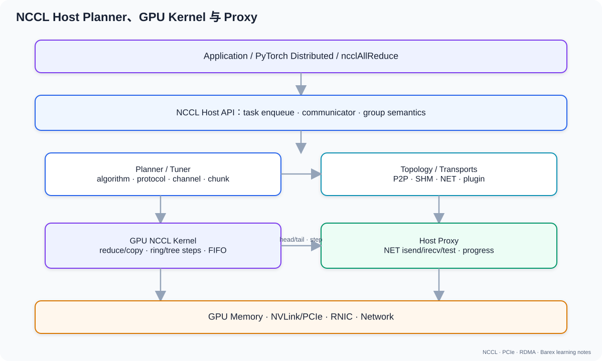

# 03. NCCL 架构：从 API 到 GPU Kernel 与 Proxy

## 1. NCCL 解决什么问题

NCCL 提供 GPU collective 与 point-to-point primitive：

- AllReduce、AllGather、ReduceScatter、Broadcast、Reduce；
- AllToAll；
- `ncclSend` / `ncclRecv`。

它不是通用 RPC 框架，也不负责应用层 request/response、远端 KV block 地址协议或对象存储。NCCL 的核心价值是：**根据通信参与者和硬件拓扑，为 GPU 通信选择算法、传输与协议，并把操作排入 CUDA stream。**

### 1.1 collective 是“所有成员共同参加”的操作

假设 4 个 rank 各有一个数：

```text
rank 0: 1
rank 1: 2
rank 2: 3
rank 3: 4
```

`AllReduce(sum)` 后每个 rank 都得到 10：

```text
rank 0/1/2/3: 1 + 2 + 3 + 4 = 10
```

`AllGather` 不求和，而是每个 rank 都得到 `[1, 2, 3, 4]`。

`AllToAll` 则要求每个 rank 为每个目标 rank 准备不同 chunk。例如 rank 0 的
输入逻辑上分为：

```text
[给 rank0][给 rank1][给 rank2][给 rank3]
```

所有 rank 必须以匹配的 communicator、count、dtype 和调用顺序参加同一次
collective。一个 rank 漏调用或顺序不同，常见结果不是“少一份数据”，而是 hang、
crash 或 data corruption。

## 2. 五个关键对象

| 对象 | 作用 |
|---|---|
| communicator | 一组 rank、拓扑、channel、连接和调优模型 |
| rank | communicator 内的逻辑参与者，通常一 rank 对应一 GPU |
| channel | 并行通信流水线；不是物理 NIC channel |
| connector/transport | rank 邻接关系上的具体传输资源 |
| kernel plan | 一批将被 launch 的 device work 与 proxy work |



如果你想继续追问“这些 rank 最初怎样成为一个 communicator”“运行中能否加入或
删除节点”，请在本章后阅读
[03a 通信组生命周期](03a_communication_group_lifecycle.md)。其中会把 PyTorch
ProcessGroup、NCCL communicator、DeepEP Buffer 三层对象逐一对齐，并结合
`new_group`、TorchElastic、`ncclCommGrow/Shrink` 和 DeepEP 源码说明动态成员
的能力边界。

### 2.1 rank 是逻辑身份，不是 PCIe 编号

NCCL rank 常与一张 CUDA device 一一对应，但它只是 communicator 内的 `[0,
nranks)` 编号。下面两种映射都合法：

```text
rank 0 → cuda:0             rank 0 → host B cuda:3
rank 1 → cuda:1             rank 1 → host A cuda:0
```

算法顺序和 AllGather 输出布局按 rank 决定，不按 GPU 的 PCI BDF 自动排序。

## 3. 初始化路径

典型 API：

```cpp
ncclGetUniqueId(&id);
ncclCommInitRank(&comm, nranks, id, rank);
```

一个“每进程一 GPU”的最小结构：

```cpp
cudaSetDevice(local_gpu);

// rank 0 创建 id，再通过 MPI/socket/store 广播给其他 rank。
ncclUniqueId id;
if (rank == 0) ncclGetUniqueId(&id);
broadcast_id_to_all_processes(&id);

ncclComm_t comm;
ncclCommInitRank(&comm, world_size, id, rank);

float* sendbuf = ...;  // device pointer
float* recvbuf = ...;  // device pointer
cudaStream_t stream;
cudaStreamCreate(&stream);

ncclAllReduce(sendbuf, recvbuf, count, ncclFloat, ncclSum, comm, stream);

// ncclAllReduce 返回时通常只是入队；stream 同步后结果才可由 host 确认完成。
cudaStreamSynchronize(stream);
```

实际程序必须检查每个 API 的返回值，并在异常时处理 communicator abort/destroy；
上面只展示对象关系。

当前参考源码主线：

```text
ncclCommInitRank
  → ncclCommInitRankDev
  → ncclCommInitRankFunc
  → initTransportsRank
      ├─ bootstrap 交换 peer 信息
      ├─ 构建 topology graph
      ├─ ncclTopoComputePaths
      ├─ 搜索 Ring/Tree/NVLS/CollNet graph
      ├─ 建立 channel 与 peer connector
      └─ 创建 proxy 资源
```

参考：

- [`src/init.cc:965` `initTransportsRank`](https://github.com/NVIDIA/nccl/blob/5067397c2676d5aed50042fc39e5c8ee96eb0027/src/init.cc#L965)
- [`src/init.cc:1831` `ncclCommInitRankFunc`](https://github.com/NVIDIA/nccl/blob/5067397c2676d5aed50042fc39e5c8ee96eb0027/src/init.cc#L1831)

### 3.1 bootstrap 不等于数据面

初始化时 rank 需要交换 host hash、bus ID、网络地址、graph 信息等。bootstrap socket 用来发现和交换元数据，不代表 collective payload 最终一定走 socket。

这与 blade-kvt 很相似：先通过 Barex `Send` 交换 MR handle，再走 RDMA Write；但二者协议和调度完全独立。

## 4. 调用一个 collective 后发生什么

以 `ncclAllReduce` 为例，API 并不是同步执行完数据交换再返回。大致路径：

```text
Host API
  → 参数检查、构造 task
  → communicator planner
  → 选择 algorithm/protocol/channel/chunk
  → 生成 kernel plan
  → 上传 device work
  → 在用户 CUDA stream 上 launch NCCL kernel
  → 如需 NET/host 辅助，同时激活 proxy op
```

完成语义由 CUDA stream 表达：

```cpp
ncclAllReduce(send, recv, count, dtype, ncclSum, comm, stream);
cudaEventRecord(done, stream);
```

只有 event 完成，才能认为该 stream 之前的 NCCL 工作完成。API 返回通常只表示 enqueue 成功。

这与 Barex 的异步 API 很像，但 Barex 用 callback/future 表达完成，NCCL 首先用 CUDA stream/event 表达完成。

## 5. GPU Kernel 为什么参与通信

NCCL 不只是 host 上调用 verbs。GPU kernel 负责：

- 从源 buffer 读数据；
- 执行 reduce/copy；
- 通过连接 buffer、FIFO/head/tail 与 peer 或 proxy 协作；
- 在 ring/tree 的每一步推进 chunk；
- 将结果写到目标 buffer。

同机 P2P/NVLink 路径可能主要由 GPU load/store/copy 完成；跨机时 GPU kernel 与 host proxy 通过共享的 step buffer/FIFO 协调。

## 6. Proxy 的职责

Proxy 是 host 侧进度引擎，常用于 GPU 无法独立推进的传输：

- NET plugin 的 `isend/irecv/test`；
- 某些跨进程 IPC 或 Copy Engine 路径；
- 注册、连接、共享资源管理；
- 将网络进度与 GPU buffer step 对齐。

简化模型：

```text
GPU NCCL kernel              Host proxy                 NIC/plugin
      │                          │                          │
      ├─ 写 ready step ─────────►│                          │
      │                          ├─ isend/irecv ──────────►│
      │                          ├─ test request            │
      │                          │◄──────── completion ─────┤
      │◄─ 更新 tail/head ────────┤                          │
      └─ 消费/产生下一 chunk      │                          │
```

参考：

- [`src/proxy.cc`](https://github.com/NVIDIA/nccl/blob/5067397c2676d5aed50042fc39e5c8ee96eb0027/src/proxy.cc)
- [`src/transport/net.cc`](https://github.com/NVIDIA/nccl/blob/5067397c2676d5aed50042fc39e5c8ee96eb0027/src/transport/net.cc)

## 7. Channel 是并行度，不是连接数的同义词

NCCL 把一个 collective 切到多个 channel：

```text
message
  ├─ channel 0: chunk 0, 4, 8...
  ├─ channel 1: chunk 1, 5, 9...
  ├─ channel 2: chunk 2, 6, 10...
  └─ channel 3: chunk 3, 7, 11...
```

更多 channel 可以：

- 增加链路并行度；
- 同时使用多条 NIC rail；
- 提高大消息吞吐。

但会增加：

- GPU block/SM 占用；
- connector buffer；
- proxy 与队列开销；
- 小消息固定成本。

因此 NCCL 会基于 topology 和 message size 调优，而不是无条件把 channel 数开到最大。

## 8. Group 语义

`ncclGroupStart/End` 有两个常见用途：

1. 把多 GPU、多 communicator 操作成组提交，避免单线程初始化/调用死锁；
2. 让 send/recv pattern 被整体规划。

它不是事务：不能理解为全部成功或全部回滚。

## 9. NCCL 与 CUDA stream

关键规则：

- NCCL 操作与同一 stream 上前序 CUDA work 有序；
- 不同 stream 之间需要 event 依赖；
- host API 返回不代表 GPU 已完成；
- 销毁/复用 buffer 前必须建立正确 stream ordering；
- 多 communicator 共享 GPU 时还要关注 launch 顺序一致性。

官方文档说明，操作状态可通过标准 CUDA stream/event 语义查询。

## 10. 读源码的最短路径

```text
src/init.cc
  → src/graph/topo.cc / paths.cc / search.cc
  → src/transport.cc
  → src/transport/{p2p,shm,net}.cc
  → src/enqueue.cc
  → src/device/
  → src/proxy.cc
```

先掌握 host orchestration，再看 device primitive；直接从 CUDA 模板进入容易迷失在协议细节。

## 11. 本章采用的源码版本与阅读约定

本章不是根据函数名猜测，而是逐段对照以下固定版本：

```text
NCCL version : 2.30.7
git commit   : 5067397c2676d5aed50042fc39e5c8ee96eb0027
```

NCCL 内部变化很快。旧文章中的 `ncclSaveKernel`、`ncclSetupCollKernel`、旧版
`ncclProxyOp` 等名字可能在新版本中已经不存在；阅读时首先核对 commit，不要把不同
版本的调用链拼在一起。

核心源码文件：

| 文件 | 本章关注点 |
| --- | --- |
| `src/collectives.cc` | 公开 collective API 怎样构造 `ncclInfo` |
| `src/enqueue.cc` | 参数检查、task、算法选择、plan、work、kernel launch |
| `src/group.cc` | Group 边界、prepare、preconnect、launch |
| `src/include/info.h` | `ncclInfo` |
| `src/include/comm.h` | `ncclTaskColl`、`ncclKernelPlan` |
| `src/include/device.h` | connector、device work、kernel args |
| `src/device/common.h` | `ncclKernelMain` 与 device dispatch |
| `src/device/all_reduce.h` | Ring/Tree/NVLS AllReduce 的 GPU 实现 |
| `src/device/prims_*.h` | Simple/LL/LL128 的 send/recv/reduce primitive |
| `src/transport.cc` | P2P/SHM/NET transport 选择 |
| `src/transport/net.cc` | NET setup 与 send/recv proxy state machine |
| `src/proxy.cc` | proxy service/progress thread 与 op 调度 |

下面以最常见的：

```cpp
ncclAllReduce(sendbuff, recvbuff, count, ncclFloat, ncclSum, comm, stream);
```

为主线。为了看清层次，先给出完整的对象变换：

```text
用户参数
  ↓  src/collectives.cc
ncclInfo
  ↓  ncclEnqueueCheck / taskAppend / collTaskAppend
ncclTaskColl
  ↓  ncclPrepareTasks
algorithm + protocol + nChannels + nWarps + devFuncId
  ↓  ncclLaunchPrepare / scheduleCollTasksToPlan
ncclKernelPlan
  ├─ ncclDevWorkColl / ncclDevWorkBatch     → GPU
  └─ ncclProxyOp                           → Host proxy
       ↓
CUDA kernel + proxy progress thread 并行推进
```

## 12. Host 主链路：`ncclAllReduce` 到 `ncclKernelPlan`

### 12.1 `ncclAllReduce` 本身并不做 reduce

`src/collectives.cc` 中的 `ncclAllReduce` 主要完成两件事：

1. 用用户参数构造一个 `ncclInfo`；
2. 调用 `ncclEnqueueCheck(&info)`。

简化后相当于：

```cpp
ncclInfo info = {
  .coll     = ncclFuncAllReduce,
  .sendbuff = sendbuff,
  .recvbuff = recvbuff,
  .count    = count,
  .datatype = datatype,
  .op       = op,
  .comm     = comm,
  .stream   = stream,
  ...
};
return ncclEnqueueCheck(&info);
```

`ncclInfo` 是 API 参数的临时 host 描述，不是最终传给 GPU 的 kernel argument。
它包含：

```text
操作种类          coll
输入/输出地址     sendbuff / recvbuff
元素数和类型      count / datatype
归约操作          op
root/peer          root
communicator       comm
CUDA stream        stream
chunk/slice hints  chunkSteps / sliceSteps
```

这里还没有决定 Ring 还是 Tree，也没有决定 Simple/LL/LL128。

源码：

- `src/collectives.cc::ncclAllReduce`
- `src/include/info.h::ncclInfo`

### 12.2 `ncclEnqueueCheck`：API 公共入口

`src/enqueue.cc::ncclEnqueueCheck` 的主线是：

```text
CommCheck
  → communicator 是否有效、是否 revoked
ncclGroupStartInternal
  → 进入隐式 group
ncclCommEnsureReady
  → 等待异步 communicator 初始化完成
ArgsCheck
  → 地址、count、dtype、root、stream 等检查
taskAppend
  → 把 ncclInfo 转成 planner task
ncclGroupEndInternal
  → 若到达最外层 group，真正 prepare/launch
```

为什么每个 API 内部都调用一次 GroupStart/End？

- 用户没有显式 group 时，这对调用形成一个只有一项工作的隐式 group；
- 用户已经调用 `ncclGroupStart()` 时，内部 group depth 只是嵌套增加，直到用户调用
  最外层 `ncclGroupEnd()` 才统一规划和 launch。

因此：

```text
没有显式 group：
ncclAllReduce
  → 本次 API 末尾就触发该 task 的规划和 kernel launch submission

有显式 group：
ncclGroupStart
  → ncclAllReduce A：只 append task
  → ncclAllReduce B：只 append task
  → ncclGroupEnd：统一 prepare、聚合、launch
```

这也是为什么 Group 可以降低多次小操作的 host 固定开销，但它不是事务。

### 12.3 `taskAppend`：不同 API 会走不同 task 类型

`src/enqueue.cc::taskAppend` 不是无条件创建 `ncclTaskColl`：

| 输入操作 | task 路径 |
| --- | --- |
| `ncclSend/ncclRecv` | `p2pTaskAppend` → `ncclTaskP2p` |
| AllReduce/AllGather/ReduceScatter 等 | `collTaskAppend` → `ncclTaskColl` |
| 某些 RMA API | `rmaTaskAppend` → `ncclTaskRma` |
| 单 rank collective | 可直接退化为本地 CUDA copy/reduce |
| 新版 AllToAll/Gather/Scatter 某些路径 | 可展开为成对 SEND/RECV task |
| 支持且满足条件的 Blackwell CE collective | `ceCollTaskAppend` |

以普通 AllReduce 为例，`collTaskAppend` 复制：

```text
func、sendbuff、recvbuff、count、root、datatype
reduction op 的 device 表示
chunkSteps、sliceSteps
profiler metadata
```

并计算：

```text
trafficBytes
  = count × elementSize × ncclFuncTrafficPerByte(func, nRanks)
```

AllReduce 的 `ncclFuncTrafficPerByte()` 返回 2，表达 reduce-scatter 与 all-gather
两阶段的数据移动量级。这个值用于排序/调度，不等于某个物理端口精确发送的字节数。

task 随后进入 `planner->collSorter`。到此仍未生成 GPU kernel。

### 12.4 `ncclPrepareTasks`：算法和协议在这里落到 task 上

最外层 GroupEnd 进入 `src/group.cc::groupLaunch` 后，会对 communicator 调用
`ncclPrepareTasks`。主要步骤是：

```text
从 collSorter 取出 task
  → 按 trafficBytes 粗略排序
  → 按 (func, redOp, datatype) 分组
  → 聚合大小相近的 task 用于共同调优
  → 查询 CollNet/NVLS 支持
  → ncclGetAlgoInfo
  → 写回 algorithm/protocol/nMaxChannels/nWarps/devFuncId
  → 可选 buffer registration
  → 创建 ncclDevWorkColl
```

`ncclGetAlgoInfo` 的关键不是一串固定 if/else，而是成本表：

```text
for algorithm in Ring/Tree/CollNet/NVLS/PAT...
  for protocol in Simple/LL/LL128
    time[algorithm][protocol]
      = ncclTopoGetAlgoTime(topology, bytes, pipeline_ops, ...)

选择合法组合中 estimated time 最小者
```

不支持的组合被标成 ignore。例如硬件不支持 NVLS，就不会因为环境看起来“更快”而选
NVLS。Tuner plugin 可以修改成本表或 channel 建议，但最后仍要得到合法的
algorithm/protocol。

然后生成：

```text
devFuncId
  = ncclDevFuncId(func, redOp, datatype, algorithm, protocol)
```

它是 host planner 与 device kernel specialization 之间的重要桥梁。

### 12.5 `calcCollChunking`：从算法名变成执行 pattern

选择 `AllReduce + Ring + Simple` 后仍不够，NCCL 还需要确定：

- pattern；
- chunk size；
- slice size；
- step 数；
- channel 内的数据区间；
- 是否需要 direct/registered path；
- proxy 要推进多少 step。

`calcCollChunking` 对 AllReduce 的映射包括：

| Algorithm | Pattern |
| --- | --- |
| Ring | `ncclPatternRingTwice` |
| Tree | `ncclPatternTreeUpDown` |
| NVLS | `ncclPatternNvls` |
| NVLS Tree | `ncclPatternNvlsTree` |
| CollNet Direct | `ncclPatternCollnetDirect` |
| CollNet Chain | `ncclPatternCollnetChain` |

Ring AllReduce 使用 `RingTwice`，是因为逻辑上存在 reduce-scatter 与 all-gather 两个
环阶段。

基础 step buffer 大小来自：

```text
stepSize = comm->buffSizes[protocol] / NCCL_STEPS
```

再结合：

```text
chunkSteps
sliceSteps
protocol 的有效 payload 比例
message size
channel 数
算法步数
```

得到实际 chunk/slice。LL 和 LL128 会因为 flag/line layout 调整有效 payload，不能
简单把 `buffSize/NCCL_STEPS` 全当用户数据。

### 12.6 `scheduleCollTasksToPlan`：task 变成 GPU work 和 proxy work

`ncclKernelPlan` 是一次或一轮 kernel launch 的 host 计划，主要包含：

```text
kernelFn / kernelArgs
kernelArgsSize
channelMask
threadPerBlock
workStorageType
workQueue / nWorkBatches
proxyOpQueue
cleanupQueue
persistent/CUDA Graph 状态
```

调度器按 channel 分割一个 collective 的数据：

```text
AllReduce buffer
  ├─ channel 0: [offset0, count0)
  ├─ channel 1: [offset1, count1)
  ├─ ...
  └─ channel N: [offsetN, countN)
```

每个参与 channel 获得 `ncclDevWorkColl`，并通过
`ncclAddWorkBatchToPlan()` 放进某个 `ncclDevWorkBatch`。相同：

- work type；
- `devFuncId`；
- 兼容的 epoch/budget；

才可能放进同一 batch。

同时，`ncclAddProxyOpIfNeeded()` 先以 inquire 模式调用 `ncclProxySaveOp`：

```text
该 channel 的 send/recv connector 有 proxyProgress？
  ├─ 否：只需要 GPU work
  └─ 是：把 ncclProxyOp 复制进 plan->proxyOpQueue
```

所以不是“跨机 collective 一定给每个 channel 固定创建两个 proxy op”，而是根据
pattern、邻居 connector 和 transport 是否需要 host progress 决定。

### 12.7 一个 task、work、batch、plan 的关系

这四个词很容易混：

```text
ncclTaskColl
  用户提交的一次 collective 的 host 任务

ncclDevWorkColl
  GPU 真正执行所需的 buffer、count、root、redOp、channel 分片等

ncclDevWorkBatch
  同一个 GPU block/channel 可连续执行的一批兼容 work

ncclKernelPlan
  一次 kernel launch 的完整计划，可包含多个 batch/work 和 proxy op
```

不一定是一 API 一 kernel：

- 多个小 task 可能融合到一个 plan；
- 一个很大的 group 也可能因为 kernel args/FIFO budget 被拆成多个 plan；
- CUDA Graph capture 下 work storage 和回收方式不同。

## 13. GroupEnd 到 CUDA kernel launch 的代码路径

### 13.1 `groupLaunch` 做的不只是 launch

`src/group.cc::groupLaunch` 依次处理：

```text
P2P preconnect jobs
  → symmetric register jobs
  → ncclPrepareTasks
  → runtime connector preconnect
  → ncclTasksRegAndEnqueue
  → global argument check（若启用）
  → doLaunches
```

这解释了为什么第一次 collective 或首次使用某种算法时，host 延迟可能高于稳定态：
首次调用可能触发 lazy connection、buffer registration 或其他准备工作。

### 13.2 `ncclLaunchPrepare`

`ncclLaunchPrepare` 把 planner 中的 task 消耗成一个或多个 plan：

```text
while 还有 task:
  allocate ncclKernelPlan
  schedule coll/bcast/p2p/rma task
  finishPlan
  enqueue plan
```

它还处理多 CUDA stream 与 CUDA Graph：

- 收集本 group 使用的 user streams；
- 用 event 建立 stream 依赖；
- 选择普通 stream、strong stream 或 graph capture stream；
- 必要时使用 `cudaLaunchHostFunc`，让 proxy op 的提交与 stream 顺序对齐；
- persistent plan 在 graph 销毁时回收。

### 13.3 `uploadWork`

GPU work 有三种常见存储：

| 类型 | 含义 |
| --- | --- |
| `Args` | work 足够小，直接跟在 kernel args 后面 |
| `Fifo` | 非 persistent work 放入 communicator work FIFO |
| `Persistent` | CUDA Graph 捕获场景使用独立持久 work buffer |

如果走 FIFO，host 必须保证：

```text
workFifoProduced - workFifoConsumed <= workFifoBytes
```

否则会等待旧 kernel 消费空间。这是 NCCL 内部 work descriptor FIFO，不是 NIC SQ，也
不是网络 BDP queue。

### 13.4 `ncclLaunchKernel`

核心 launch 参数直接来自 plan：

```text
grid.x  = popcount(plan->channelMask)
block.x = plan->threadPerBlock
kernel  = plan->kernelFn
args    = plan->kernelArgs
stream  = planner 的 launch stream
```

因此在普通 kernel path 上可以形成很重要的直觉：

> 一个参与的 NCCL channel 通常对应该次 kernel grid 中的一个 CUDA thread block。

例如 `channelMask` 有 8 个 bit，通常 launch 8 个 block。它不代表一定占用 8 个物理
NIC queue；channel 是 NCCL 的逻辑并行流水线。

新 GPU 上还可能设置：

- CGA cluster；
- remote memory sync domain；
- programmatic stream serialization；
- NVLink-centric scheduling。

这些 launch attribute 仍然不改变“plan → kernel”这条主线。

## 14. GPU 端：Kernel 如何找到 channel、work 和算法

### 14.1 `ncclDevKernelArgs`

普通 kernel args 的核心字段是：

```text
comm             device communicator
channelMask      本 plan 使用哪些 channel
workStorageType  work 在 args/FIFO/persistent buffer 的哪一种
workMask         FIFO wrap mask
workBuf          work buffer 地址
batches[]        每个 channel 的首个 batch
```

device 端不会重新做拓扑搜索或算法选择；这些都已经由 host 写进 plan/work。

### 14.2 `ncclKernelMain`：一个 block 映射一个 channel

`src/device/common.h::ncclKernelMain` 的执行顺序可简化为：

```text
block 启动
  → 把 ncclDevKernelArgs 复制到 shared memory
  → 根据 blockIdx.x 找到 channelMask 中第 N 个 set bit
  → 得到 ncclShmem.channelId
  → warp 0 加载 device communicator
  → warp 1 加载该 channel 的 ncclDevChannel
  → 其余 warps 加载本 channel 首个 work batch
  → dispatch RunWorkBatch
  → 若 nextBatchIx != -1，加载下一个 batch
  → 直到该 channel 的 batch 链结束
```

把 comm/channel/work 复制进 shared memory，是为了避免所有线程反复从 global memory
间接读取复杂结构。

### 14.3 specialized kernel 与 generic dispatch

host 通过 `devFuncId` 查询：

```text
ncclDevKernelForFunc[devFuncId]
```

如果有 specialized kernel，就可直接实例化类似：

```text
RunWorkBatch<
  ncclFuncAllReduce,
  float,
  Sum,
  NCCL_ALGO_RING,
  NCCL_PROTO_SIMPLE
>
```

如果当前 batch 的 `funcId` 不匹配 specialization，`ncclKernelMain` 退回：

```text
ncclDevFuncTable[ncclShmem.funcId]()
```

因此“一个 NCCL kernel 是不是只能执行一种 collective”要分情况：

- kernel symbol 可以针对某个组合 specialization；
- 一个 plan 中仍可通过 batch/function-table dispatch 处理兼容 work；
- planner 会用 `devFuncId` 和 budget 控制哪些 work 可以批在一起。

### 14.4 `RunWorkBatch → RunWorkColl`

对普通 collective：

```text
RunWorkBatch
  → 遍历 ncclShmem.workStorage 中的 ncclDevWorkColl
  → 按 work->nWarps 选择参与线程
  → RunWorkColl<Fn, T, RedOp, Algo, Proto>::run
```

真正的算法代码位于：

```text
src/device/all_reduce.h
src/device/all_gather.h
src/device/reduce_scatter.h
src/device/broadcast.h
...
```

协议 primitive 位于：

```text
src/device/prims_simple.h
src/device/prims_ll.h
src/device/prims_ll128.h
```

### 14.5 Ring AllReduce 的源码级步骤

`src/device/all_reduce.h::runRing` 先读取：

```text
ring->prev / ring->next
ring->index
nRanks
该 channel 的 gridOffset/channelCount/chunkCount
```

然后构造：

```text
Primitives<T, RedOp, FanSymmetric<1>, Direct=1, Proto, ...>
```

对每一轮 chunk，大致执行：

```text
1. directSend
   把自己的一个 chunk 推给 next

2. 重复 nRanks-2 次 directRecvReduceDirectSend
   从 prev 收到中间结果
   与本地对应 chunk 做 reduce
   把新结果继续推给 next

3. directRecvReduceCopyDirectSend
   完成本 rank 负责 chunk 的最终 reduce
   写入输出并继续发给 next

4. 重复 nRanks-2 次 directRecvCopyDirectSend
   AllGather 阶段只转发已经归约完成的 chunk

5. directRecv
   收到最后一个结果 chunk，写入输出
```

这就是代码中的 reduce-scatter + all-gather，而不是 host 先调用一个
ReduceScatter API，再调用一个 AllGather API。

以 4 rank 为例，每轮的通信 step 数量级是：

```text
reduce-scatter : 3 steps
all-gather     : 3 steps
合计           : 2 × (4 - 1) = 6 steps
```

多个 chunk/channel 在时间上流水化，因此实际执行不是“等所有 rank 完整做完 step 0，
再全局进入 step 1”的纯串行模型。

### 14.6 `Primitives` 才是数据搬运与同步的底层

诸如：

```text
send
recv
recvReduceSend
recvReduceCopy
directRecvReduceCopyDirectSend
```

最终进入 protocol-specific `genericOp`。它负责：

- 等待接收 step/tail；
- 获取源/目标 buffer 指针；
- vectorized load/store；
- 执行 reduction；
- 写协议 flag；
- 更新 head/tail；
- 与 peer GPU 或 host proxy 进行 credit 同步；
- 检查 abort。

所以 `runRing` 描述“算法步骤”，`Primitives` 描述“每一步怎样搬字节和同步”。

## 15. Transport 与 connector：GPU primitive 最终连到谁

### 15.1 transport 是初始化时选出的函数表

`src/transport.cc` 的候选顺序是：

```text
P2P → SHM → NET → CollNet
```

`selectTransport` 对候选依次调用：

```text
transport->canConnect(...)
```

第一个可用 transport 的 send/recv `ncclTransportComm` 被写进
`connector->transportComm`，随后调用 `setup()`。

`ncclTransportComm` 是函数表：

```text
setup/connect/free
proxySharedInit
proxySetup/proxyConnect/proxyFree
proxyProgress
proxyRegister/proxyDeregister
```

因此 connector 不只是“对端 rank 编号”，它还保存：

```text
transport 实现
protocol buffers
head/tail
step
connFifo
MR handles
proxy connection
direct flags
```

### 15.2 `ncclConnInfo`

GPU primitive 看到的关键字段包括：

```text
buffs[Simple/LL/LL128]
head / tail
connFifo
step / stepSize
flags
registered memory handles
direct pointer exchange
```

同一个 `runRing` 算法可以运行在 P2P、SHM 或 NET 上，原因是算法通过 connector/
primitive 抽象访问通信资源，不在 `runRing` 里直接写 `ibv_post_send`。

## 16. Proxy：从 plan 中的 op 到 NET plugin

### 16.1 NCCL 中至少要区分两类 proxy 线程职责

```text
Proxy Service thread
  → 监听本地 control socket
  → setup/connect/register/deregister/free
  → 推进异步连接控制操作

Proxy Progress thread
  → 获取已提交的 ncclProxyOp
  → 变成 ncclProxyArgs
  → 反复调用 transport 的 proxyProgress
  → 推进 isend/irecv/test/iflush
```

它们都在 `src/proxy.cc`，但不是同一个状态机。初始化连接卡住与数据传输 progress
卡住，排查方向也不同。

### 16.2 `ncclProxyOp` 与 `ncclProxyArgs`

planner 生成的 `ncclProxyOp` 描述一项逻辑工作：

```text
connection
channelId
pattern / algorithm / protocol
nsteps
chunkSize / sliceSize
loopOffset / channelSize
opCount
buffer registration handles
```

proxy thread 使用的 `ncclProxyArgs` 则是运行态状态机：

```text
subs[]
progress function pointer
state / done / idle
posted / received / transmitted / flushed / done
requests[NCCL_STEPS]
```

多个兼容 op 可能合并成一个 args 的多个 sub，以共享 network communication 和降低
progress 开销。

### 16.3 Proxy op 怎样被激活

kernel plan launch 前后，host 侧会执行：

```text
hostStreamPlanTask
  → uploadProxyOps
      → ncclProxySaveOp
  → ncclProxyStart
```

根据 CUDA Graph/persistent 状态，这可能通过 `cudaLaunchHostFunc` 放在 host stream
中，也可能由 launch 路径直接调用。目的都是让 proxy work 与该 plan 的 stream
依赖保持正确关系。

progress thread 的主循环是：

```text
progressOps(active)
  → op->progress(proxyState, op)
  → 若 idle 或达到轮询频率，获取新 posted ops
  → 没有进展时 yield
```

NET connector 的 `op->progress` 指向：

```text
sendProxyProgress
recvProxyProgress
```

### 16.4 NET send proxy state machine

`src/transport/net.cc::sendProxyProgress` 的简化状态是：

```text
Ready
  → 初始化 base/posted/transmitted/done
Progress
  → 给 GPU 发布可写 step/credit
  → 等 GPU 更新 connFifo.size 与 tail，表示 slice ready
  → ncclNet->isend(...)
  → ncclNet->test(...)
  → 网络完成后清理 slot
  → 更新 head，允许 GPU/下一轮复用 buffer
Done
```

关键计数器：

```text
posted       已经向 GPU 开放的 step
transmitted  已提交给 network plugin 的 step
done         network plugin 已报告完成的 step
```

`isend` 是异步提交；`test` 才推进 completion。proxy thread 不能只调用一次 `isend`
就退出。

### 16.5 NET recv proxy state machine

`recvProxyProgress` 更复杂：

```text
Ready
  → 初始化 base/posted/received/transmitted/done
Progress
  → ncclNet->irecv(...) 发布接收
  → ncclNet->test(...) 等网络完成
  → 必要时 ncclNet->iflush(...) 保证 GDR 写入可见
  → 更新 recv tail，通知 GPU 某个 step 可消费
  → GPU 消费后更新 send head
  → proxy 回收 receive request/slot
Done
```

关键计数器：

```text
posted       已经 post 给 network plugin
received     网络接收完成
transmitted  已完成必要 flush，并通知 GPU
done         GPU 已消费，可回收 slot
```

这里的 `posted/received/transmitted/done` 是 NCCL proxy step 状态，不等同于 verbs
SQ/RQ depth。

### 16.6 GPU 与 Proxy 通过什么握手

主要共享控制结构是：

```text
connFifo[step % NCCL_STEPS]
  ├─ offset
  └─ size

sendMem->head
recvMem->tail
```

可把它理解为 bounded ring：

```text
GPU producer
  → 填一个 step buffer
  → 发布 size/tail

Proxy consumer
  → isend/test
  → 完成后推进 head
  → GPU 才能复用该 slot
```

接收方向相反：

```text
Proxy/NIC producer
  → irecv/test/flush
  → 推进 tail

GPU consumer
  → 读取/reduce/copy
  → 推进 head
  → Proxy 才能 repost/reuse
```

这与前文 BDP 很有联系：`NCCL_STEPS`、step buffer、NET request 深度、plugin/RNIC
outstanding window 共同决定流水线里能同时存在多少 chunk，但不能把任意一个参数
直接叫作“BDP”。

### 16.7 GDR 与 host-staged 下 Proxy 是否存在

#### GPUDirect RDMA

```text
GPU buffer
  ↕ PCIe/C2C/NVLink fabric
RNIC DMA
  ↕ network
remote RNIC
  ↕
remote GPU buffer
```

payload 可以不经过 CPU copy，但 host proxy 仍可能负责：

- 调用 NET plugin `isend/irecv/test`；
- 管理 request；
- 推进 head/tail；
- 做注册和连接；
- 必要时执行 GDR flush/visibility 操作。

#### Host-staged

```text
GPU kernel
  → host-visible staging buffer
Proxy + NIC
  → network
remote Proxy + NIC
  → remote staging buffer
remote GPU kernel
  → GPU output
```

此时 Proxy 不只推进 NIC request，还协调 GPU 与 host buffer 的 producer/consumer step。

#### Device network offload

如果 network device/plugin 提供 device-side progress，connection 可以声明不需要普通
host proxy progress。是否启用由 plugin/device handle 与 connector 能力决定，不能仅
凭“使用了 GDR”推断。

## 17. 一次跨机 Ring AllReduce 的三线程时间线

为了理解“GPU kernel 和 proxy 是并行还是串行”，看一个发送方向的 slice：

```text
User host thread          GPU NCCL kernel          Proxy progress           RNIC/plugin
      │                         │                         │                       │
ncclAllReduce                   │                         │                       │
append task                     │                         │                       │
plan/launch ───────────────────►│                         │                       │
upload proxy op ────────────────────────────────────────►│                       │
API return                      │                         │                       │
                                ├─ reduce/copy slice      │                       │
                                ├─ publish size/tail ────►│                       │
                                │                         ├─ isend ──────────────►│
                                │                         ├─ test                 │
                                │                         │◄─ completion ─────────┤
                                │◄─ advance head ─────────┤                       │
                                ├─ reuse slot/next slice  │                       │
                                │                         │                       │
CUDA event complete ◄───────────┴─────────────────────────┴───────────────────────┘
```

它是流水线：

- host API 负责描述和 launch；
- GPU kernel 负责 reduce/copy 和 device-side step；
- proxy 负责 host/plugin progress；
- RNIC 异步搬运；
- 多个 slice 可以分别位于不同阶段。

因此不能用：

```text
GPU 全部算完 → Proxy 才开始 → NIC 才开始
```

解释 NCCL。实际是 bounded producer-consumer pipeline。

## 18. 源码调试：怎样验证你理解的调用链

### 18.1 日志

常用：

```bash
export NCCL_DEBUG=INFO
export NCCL_DEBUG_SUBSYS=INIT,GRAPH,TUNING,NET,PROXY,COLL
export NCCL_DEBUG_FILE=/tmp/nccl.%h.%p.log
```

关注：

```text
INIT    communicator/bootstrap/transport setup
GRAPH   topology graph 与 channel
TUNING  bytes → algorithm/protocol/channel
NET     plugin、NIC、GDR、isend/irecv
PROXY   proxy connection/progress
COLL    collective task/work
```

rank 0 的 tuning 日志会输出类似：

```text
AllReduce: <bytes> Bytes -> Algo <...> proto <...> channel{Lo..Hi}=...
```

这与 `scheduleCollTasksToPlan` 中的 `INFO(NCCL_TUNING, ...)` 对应。

### 18.2 Nsight Systems

时间线上至少对齐：

```text
CPU ncclAllReduce API range
CUDA NCCL kernel
NCCL Proxy/Progress CPU thread
NIC activity与网络 counters
CUDA event/stream dependency
```

若 GPU kernel 长时间运行但网络吞吐很低：

- proxy 可能没获得 CPU；
- plugin `test` 不前进；
- connFifo/head/tail 卡住；
- transport 选择或 GDR 注册失败；
- 对端 rank 没有进入匹配 collective。

若 API 调用本身很慢：

- 首次 lazy connect/register；
- group 中 rank 调用不匹配；
- runtime preconnect；
- communicator async error；
- CUDA Graph/stream ordering；
- host 被同步或等待 FIFO space。

### 18.3 源码断点/日志最短路径

```text
src/collectives.cc::ncclAllReduce
  → src/enqueue.cc::ncclEnqueueCheck
  → src/enqueue.cc::taskAppend
  → src/enqueue.cc::collTaskAppend
  → src/group.cc::ncclGroupEndInternal
  → src/group.cc::groupLaunch
  → src/enqueue.cc::ncclPrepareTasks
  → src/enqueue.cc::ncclGetAlgoInfo
  → src/enqueue.cc::ncclLaunchPrepare
  → src/enqueue.cc::scheduleCollTasksToPlan
  → src/enqueue.cc::ncclLaunchKernel
  → src/device/common.h::ncclKernelMain
  → src/device/all_reduce.h::runRing/runTree...
```

Proxy 分支：

```text
scheduleCollTasksToPlan
  → ncclAddProxyOpIfNeeded
  → ncclProxySaveOp
  → hostStreamPlanTask
  → uploadProxyOps
  → ncclProxyStart
  → ncclProxyProgress
  → progressOps
  → sendProxyProgress / recvProxyProgress
  → ncclNet isend/irecv/test/iflush
```

## 19. 常见源码误读

### 误读 1：`ncclAllReduce` 返回说明 reduce 完成

错误。它说明 host 侧调用成功提交；最终完成由 CUDA stream/event 语义判断。

### 误读 2：`ncclAllReduce` 直接调用 `ibv_post_send`

错误。公开 API 先变成 task/plan/device work；NET 通过 plugin 与 proxy 推进，verbs
通常藏在具体 NET plugin/provider 更下层。

### 误读 3：Proxy 搬运每一个 payload byte

错误。Proxy 通常调用 plugin、poll request 和更新同步状态。GDR 下 payload 可由 RNIC
直接 DMA GPU memory。

### 误读 4：一个 channel 就是一条 QP

错误。channel 是逻辑流水线；它会引用 connector，connector 再引用 transport/network
资源。共享 connection、多 rail、多 QP、plugin 实现会改变映射。

### 误读 5：一个 API 一定对应一个 kernel

错误。task 可以融合为 plan，也可能因 budget 拆成多个 plan。

### 误读 6：Ring/Tree 是 transport

错误。Ring/Tree 是 collective algorithm/graph；P2P/SHM/NET 是 transport。

### 误读 7：LL/LL128 是不同物理网络

错误。它们是 device communication protocol/layout，同一 transport 上也可选择不同
protocol。

### 误读 8：有 Proxy 就一定经过 host-staged payload

错误。有 Proxy 可能只是 host progress；是否 staging 取决于 GDR、buffer registration、
connector flags 和 plugin 能力。

## 20. 自检

1. `ncclInfo`、`ncclTaskColl`、`ncclDevWorkColl`、`ncclKernelPlan` 分别在哪一层？
2. bootstrap socket 与 NET transport 有什么区别？
3. 为什么 `ncclEnqueueCheck` 内部还要隐式 GroupStart/End？
4. algorithm/protocol 是 API 调用时还是 GroupEnd prepare 时决定？
5. 为什么一个 channel 通常对应一个 CUDA block，却不能等同于一条 NIC QP？
6. Ring AllReduce 的 `directRecvReduceDirectSend` 在哪个阶段？
7. send proxy 的 `posted/transmitted/done` 分别表示什么？
8. recv proxy 为什么可能需要 `iflush`？
9. 为什么 NCCL API 返回不能作为 buffer 可复用的证明？
10. 跨机 collective 中 GPU kernel、proxy 和 RNIC 如何形成流水线？

## 参考

- [NCCL User Guide](https://docs.nvidia.com/deeplearning/nccl/user-guide/docs/index.html)
- [NCCL Collective Operations](https://docs.nvidia.com/deeplearning/nccl/user-guide/docs/usage/collectives.html)
- [NCCL 2.30.7 固定参考源码](https://github.com/NVIDIA/nccl/tree/5067397c2676d5aed50042fc39e5c8ee96eb0027)
- [`collectives.cc`：公开 API → `ncclInfo`](https://github.com/NVIDIA/nccl/blob/5067397c2676d5aed50042fc39e5c8ee96eb0027/src/collectives.cc)
- [`enqueue.cc`：task、tuning、plan、kernel launch](https://github.com/NVIDIA/nccl/blob/5067397c2676d5aed50042fc39e5c8ee96eb0027/src/enqueue.cc)
- [`group.cc`：GroupEnd、prepare、preconnect、launch](https://github.com/NVIDIA/nccl/blob/5067397c2676d5aed50042fc39e5c8ee96eb0027/src/group.cc)
- [`device/common.h`：`ncclKernelMain`](https://github.com/NVIDIA/nccl/blob/5067397c2676d5aed50042fc39e5c8ee96eb0027/src/device/common.h)
- [`device/all_reduce.h`：Ring/Tree/NVLS AllReduce](https://github.com/NVIDIA/nccl/blob/5067397c2676d5aed50042fc39e5c8ee96eb0027/src/device/all_reduce.h)
- [`device/prims_simple.h`：Simple primitives](https://github.com/NVIDIA/nccl/blob/5067397c2676d5aed50042fc39e5c8ee96eb0027/src/device/prims_simple.h)
- [`proxy.cc`：service/progress thread](https://github.com/NVIDIA/nccl/blob/5067397c2676d5aed50042fc39e5c8ee96eb0027/src/proxy.cc)
- [`transport/net.cc`：NET proxy state machine](https://github.com/NVIDIA/nccl/blob/5067397c2676d5aed50042fc39e5c8ee96eb0027/src/transport/net.cc)
