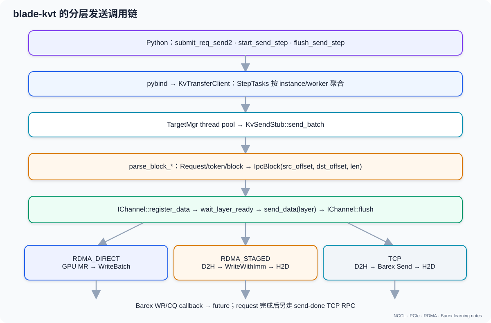
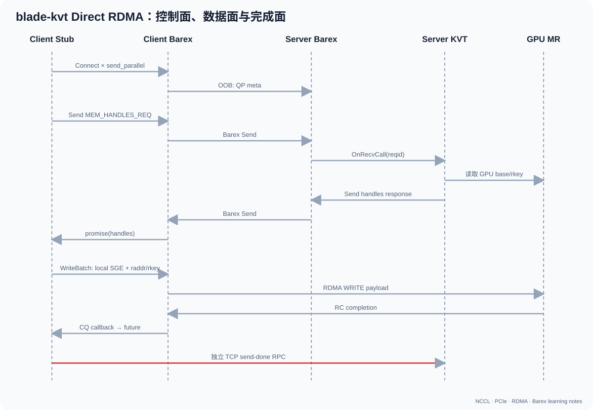
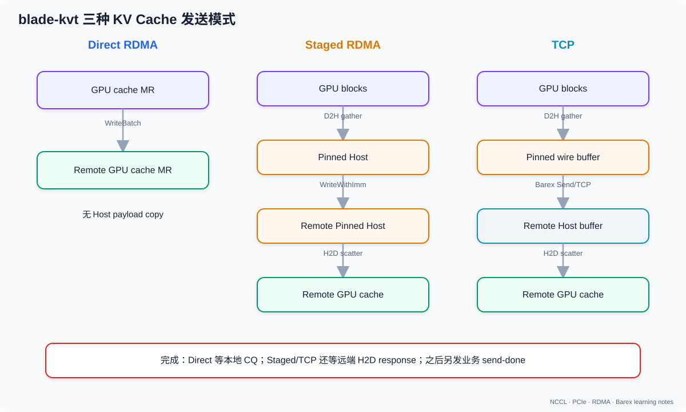

# 08. blade-kvt 调用 Barex 的完整发送逻辑

## 1. 总体路径



```text
Python
  KvTransfer.submit_req_send2 / start_send_step
    ↓ pybind
  KvTransferClient
    ↓ StepTasks 按目标分组
  TargetMgr::do_submit
    ↓ target thread pool
  KvSendStub::send_batch
    ↓ parse_block
  IChannel::register_data
    ↓ layer ready
  IChannel::send_data(layer)
    ↓
  Barex Send / WriteBatch / WriteSingle
    ↓
  WR → NIC → CQ → callback/future
```

### 1.1 用一个 request 贯穿后文

假设 prefill worker 已为 request 42 计算出 KV cache：

```text
模型层数：3（为了示例；真实模型更多）
需要发送的 source blocks：[5, 8]
decode worker 分配的 target blocks：[12, 2]
每层每 block：64 KiB
```

逻辑映射：

```text
layer 0: src block 5 → dst block 12
         src block 8 → dst block 2
layer 1: src block 5 → dst block 12
         src block 8 → dst block 2
layer 2: src block 5 → dst block 12
         src block 8 → dst block 2
```

总 payload：

```text
3 layers × 2 blocks × 64 KiB = 384 KiB
```

但 blade-kvt 不一定等所有层算完再一次发 384 KiB。forward 完成 layer 0 后，
对应 CUDA event/barrier 就绪，发送线程可以先调用 `send_data(0)`；计算 layer 1
时，layer 0 的网络传输可能同时进行，这就是 compute/communication overlap。

在 direct RDMA 路径中，每个 block 最终会变成类似：

```text
local_addr = layer_base + 5 × block_stride
remote_addr = remote_layer_base + 12 × block_stride
length = 64 KiB
lkey/rkey = 该 GPU MR 的本地/远端权限
```

因此 `parse_block` 不只是“解析一个整数”，而是在把模型的 block id 转成传输层
可执行的地址、长度和权限。

## 2. Python 与 pybind

Python `blade_kvt/kv_transfer_impl.py` 导入：

- `submit_req_send2`
- `submit_delta_send`
- `start_send`
- `start_send_substep`
- `flush_send`

pybind 对应：

- `kvtransfer_pybind.cpp:218-254`：提交 request；
- `:259-270`：开始 step/substep；
- `:281-284`：flush；
- `:487-493`：模块导出。

`submit` 阶段只积累任务，不发送数据。

### 2.1 当前 blade-kvt 与 vLLM 是否在同一进程、共享 CUDA context

对本文固定的版本：

```text
vLLM       058f6b130e789096ab685c58fe90fdb97c149774
blade-kvt  752697132e8b0409ad134724fec2882c9ca57380
```

答案是：

> blade-kvt 作为 Python/C++ extension 加载在 vLLM 的 **GPU model worker
> 进程**中；它和这个 worker 内的 PyTorch/vLLM 对同一 device 使用同一个 CUDA
> primary context。它不等于运行在 vLLM scheduler/front-end 主进程，也不表示
> 所有 TP worker 共用一个进程。

代码证据是一条完整的指针传递链：

```text
vllm/v1/worker/gpu_model_runner.py
  → kv_transfer_group.register_kv_caches(kv_caches)

vllm/v1/hybrid_connector/kvtbackend.py
  → bladekv.KVTransferClient/Server(
        layers=_flatten_cache(kv_caches))

blade_kvt/kv_transfer_impl.py
  → cache.data_ptr()
  → init_kv_transfer_client/server(layer_addrs=...)

kvtransfer_pybind.cpp
  → C++ Context / Barex MR registration
```

vLLM 刚分配好的 `torch.Tensor` 被直接交给 blade-kvt，后者把 `data_ptr()` 的数值
传入 C++，没有经过 CUDA IPC handle、Unix socket 或共享内存。这只有在当前
blade-kvt 对象与 tensor 地址位于同一个 process address space 时才成立。

blade-kvt 当前 CUDA 路径使用 `cudaSetDevice`、CUDA Runtime、自己创建的
thread-local streams 和 kernels；源码中没有显式 `cuCtxCreate` 创建私有
Driver API context。CUDA 官方语义是：同一进程里，Runtime API 的使用者默认共享
“每 device、每 process 一个”的 primary context。因此可以概括为：

```text
同一个 OS worker process
  └─ 同一个 GPU primary CUDA context
       ├─ PyTorch/vLLM allocations、kernels、streams
       └─ blade-kvt streams、events、copy kernels、GPU MR address
```

但是，“共享 context”不等于“共享默认 stream”或“自动有执行顺序”。blade-kvt
创建自己的 CUDA stream，并通过 vLLM/KVT 记录的 CUDA event、`wait_layer_ready`
以及必要的 stream synchronization 建立依赖。若缺少这些同步，网络线程可能在
forward 尚未写完 KV block 时就开始读取。

### 2.2 如果把 blade-kvt 拆成独立进程

拆分后，两个进程各有自己的 CUDA context 和 virtual address space：

```text
vLLM worker process                 KVT service process
PyTorch allocation ptr=0xABC        不能直接使用数值 0xABC
        │
        ├─ export CUDA IPC/VMM handle ─► import → local device pointer
        ├─ export IPC event/同步协议 ──► wait before NIC/copy
        └─ lifetime/control RPC       ──► register MR、transfer、completion
```

CUDA 官方文档明确规定：device pointer 和 CUDA event handle 只能被创建它的
进程直接使用；跨进程必须交换 CUDA IPC 或 VMM 的 process-portable handle，
再在目标进程获得一个 process-local pointer。

因此当前代码若只把 blade-kvt 对象搬到另一个进程，会立即遇到：

1. **裸 `data_ptr` 失效**：KVT 不能直接注册或 launch kernel 访问 vLLM 的数值地址；
2. **同步句柄失效**：当前 event/stream 依赖要改为 CUDA IPC event 或显式 RPC；
3. **生命周期变复杂**：vLLM 不能在 KVT 尚未 completion 时 free/reuse allocation；
4. **MR 要重建**：KVT 要对自己 import 后的 mapping 做 RNIC registration，并在
   unmap 前等待 WR 完成、deregister；
5. **资源增加**：独立 CUDA context 会占用 device/host memory、driver threads，
   GPU 还可能产生 context scheduling 开销；
6. **错误边界更清楚**：KVT 崩溃不一定直接杀死 vLLM worker，升级和限流也更独立，
   这是拆进程的主要工程收益。

另一种更简单但性能更低的拆分方法是：

```text
vLLM GPU
  → vLLM 进程 D2H 到共享 host buffer
  → KVT 进程从 host buffer 发 TCP/RDMA
```

这样不必把 GPU pointer 跨进程交给 KVT，但变成 host-staged 路径，增加 D2H/H2D、
host memory bandwidth 和 NUMA 成本。

所以“拆进程”不是不可行，而是需要把当前的函数调用集成改造成一套明确的：

```text
GPU allocation export/import
+ event synchronization
+ MR registration cache
+ buffer lifetime protocol
+ control IPC / error recovery
```

它是架构重构，不是简单把现有线程换成一个 subprocess。

## 3. StepTasks：按目标聚合

这里的 **target 不是一台物理机器的模糊概念**，而是精确的二元组：

```text
target = (dst_inst_id, dst_worker_id)
```

- `dst_inst_id`：目标推理实例；
- `dst_worker_id`：该实例中的目标 worker（通常对应某个 TP worker/GPU 进程）；
- 同一实例的两个 worker 是两个不同 target；
- 两个 request 只要二元组相同，就可以进入同一个 `BatchSendTask`。

### 3.1 `StepTasks` 的真实容器结构

`kvtransfer/include/client.h` 中的定义是：

```cpp
struct StepTasks {
  // InstanceId -> [(WorkerId, BatchSendTask)]
  std::unordered_map<
      InstanceId,
      std::vector<std::pair<WorkerId, BatchSendTask>>> tasks;

  size_t stepid = 0;
  uint32_t substepid = 0;
  const Timepoint send_ts;
};
```

可以把它画成：

```text
StepTasks(step=100, substep=0)
├─ instance "decode-A"
│  ├─ worker 0 → BatchSendTask[request r1, request r2]
│  └─ worker 1 → BatchSendTask[request r3]
└─ instance "decode-B"
   └─ worker 0 → BatchSendTask[request r4]
```

这不是四次独立的 target 调度，而是三个 `(instance, worker)` 分组：

```text
("decode-A", 0) → {r1, r2}
("decode-A", 1) → {r3}
("decode-B", 0) → {r4}
```

### 3.2 `add_send_task` 如何完成分组

`KvTransferClient::submit_req_send` 先构造 `RequestInfo`，然后调用
`add_send_task`。后者的核心代码位于 `kvtransfer/src/client.cpp`：

```cpp
auto& workers_task = steptasks.tasks[req->dst_inst_id];

for (auto& worker_task : workers_task) {
  if (worker_task.first == req->dst_worker_id) {
    worker_task_p = &worker_task.second;
    break;
  }
}

if (worker_task_p == nullptr) {
  auto& ret =
      workers_task.emplace_back(req->dst_worker_id, BatchSendTask());
  worker_task_p = &ret.second;
}

worker_task_p->tasks.emplace_back(
    std::move(req), seen, new_tokens, has_last);
```

逐句理解：

1. `tasks[dst_inst_id]` 先按实例找到一个 worker 列表；实例第一次出现时，
   `unordered_map::operator[]` 会创建空列表。
2. 在线性列表中寻找相同 `dst_worker_id`。
3. 没找到就创建 `(worker_id, BatchSendTask)`。
4. 把当前 request 对应的 `ReqSendTask` 追加到该 batch。

所以，分组依据来自每个 request 自己携带的 `dst_inst_id` 和
`dst_worker_id`，不是 round-robin，也不是根据 GPU 拓扑临时猜测。
`unordered_map` 的遍历顺序本身没有稳定保证，因此不能依赖不同 instance
之间的提交先后顺序。

未到 last token 的 request 还会保存在 `reqs_` 中，后续
`submit_delta_send` 可以沿用其目标和 block 映射，继续把增量 token 放进对应
target 的 batch。

### 3.3 `start_send` 如何“封存”本轮任务

`submit_req_send` 阶段只是向 `targets_tasks_buf_` 累积任务。调用
`start_send(stepid, sched_tokens)` 后：

```cpp
StepTasks tmp_tasks;
tmp_tasks.swap(targets_tasks_buf_);

if (!tmp_tasks.empty()) {
  mgr_.submit(step, std::move(tmp_tasks));
}
```

`swap` 很重要：它把当前 step 已积累的任务整体移走，形成一个不再被后续
`submit_req_send` 修改的批次，同时让 `targets_tasks_buf_` 重新变空。随后
`TargetMgr::submit` 把整个 `StepTasks` 移交给 manager 线程。

完整关系是：

```text
多次 submit_req_send
  │
  ├─ 按 (dst_inst_id, dst_worker_id) 追加到 targets_tasks_buf_
  │
start_send
  │
  ├─ swap：封存本 step 的 StepTasks
  ├─ 创建 Step / StepGuard
  └─ TargetMgr::submit
       └─ manager 单线程执行 do_submit
```

`start_send_substep` 使用 `create_step_tasks` 对传入的 `ReqMeta` 做同样的分组，
只是它会设置相应的 `substepid`，再附加到已有 step 或暂存到
`pending_step_metas_`。

## 4. TargetMgr：从目标分组到发送线程

### 4.1 为什么有两层线程池

`TargetMgr` 不是直接在调用线程里发数据，它使用两类线程：

```text
调用线程
  │ TargetMgr::submit
  ▼
mgr_thd_（只有 1 个线程）
  │ do_submit：维护 target_map_、LRU、创建/查找 Target
  ▼
target_thdpool_（BLLM_KVTRANS_SEND_TPSIZE 个线程）
  │ 每个 target batch 是一个任务
  ▼
Target::stub->send_batch(...)
```

manager 线程只有一个，因而 `target_map_`、`targets_` LRU 链表和
`KvSendStub` 的创建都被串行化，不需要让多个调用线程直接并发修改这些结构。
真正可能耗时的解析、等待 layer ready、channel 发送和 flush 则放入
`target_thdpool_`。

### 4.2 `do_submit` 怎样按 target 分发

`TargetMgr::do_submit` 对前一节形成的两级容器做两层遍历：

```cpp
for (auto& [inst_id, workers_task] : steptasks.tasks) {
  for (auto& [worker_id, worker_tasks] : workers_task) {
    worker_tasks.step = step;
    worker_tasks.substepid = substepid;
    worker_tasks.send_ts = submit_ts;

    auto* target =
        create_or_get(worker_tasks.tasks.front().req());

    auto cnt = target->inflycnt.fetch_add(1);
    if (cnt == 0) {
      target->thread_hint = ++thread_hint_;
    }

    target_thdpool_->Submit(
        [target, batch = std::move(worker_tasks)]() mutable {
          target->stub->send_batch(std::move(batch));
          target->inflycnt.fetch_sub(1);
        },
        target->thread_hint);
  }
}
```

每个 `(instance, worker)` 分组只向 target thread pool 提交一个 closure。这个
closure 内的 `BatchSendTask` 可以包含多个 request。因此：

```text
一个 ReqSendTask       ≠ 一个线程池任务
一个 BatchSendTask     = 一个 target 在一个 step/substep 中的一批 request
一个线程池任务         = 调用一次该 target 的 send_batch(batch)
```

`create_or_get` 以 `(dst_inst_id, dst_worker_id)` 在缓存中查找 `Target`：

```text
Target
├─ inflycnt       当前已提交但尚未退出的 batch 数
├─ thread_hint    建议使用的发送线程
└─ stub           面向该远端 worker 的 KvSendStub / channel 状态
```

没有找到时才通过 `stub_factory_` 创建新的 `KvSendStub`；找到时会把它移到 LRU
链表头部继续复用。因此，目标分发最终不是“把 instance id 交给网卡”，而是先将
二元组解析成一个长期复用的 target/stub，再由 stub 建立或复用到该 worker 的
具体 TCP/RDMA channel。

### 4.3 `thread_hint` 能否等同于“严格串行”

当某 target 的 `inflycnt` 从 0 变成 1 时，代码给它分配新的
`thread_hint`；只要还有任务 in flight，后续 batch 就继续携带相同 hint。
设计意图是让同一 target 的任务具有线程亲和性，避免多个线程同时使用其中
可变的 `KvSendStub::TaskContext`。

但 `/usr/include/accl/barex/xthreadpool.h` 对这个参数的契约明确写的是：

> `thread_hint` 是“建议的线程号”，是否采纳取决于底层实现；实现可能使用
> `thread_hint % thread_count`。

因此从公开接口能严格得出的结论是“同 target 使用相同的线程提示”，不能仅凭
这段头文件宣称任意 Barex `XThreadpool` 实现都保证同 target 严格串行。当前
blade-kvt 的 `KvSendStub::TaskContext` 是可变复用状态，实际部署所链接的
XThreadpool 实现需要满足这种串行/亲和假设；若替换线程池实现，这一点必须重新
验证。

## 5. KvSendStub：数据布局决策

`KvSendStub::TaskContext::do_task`：

1. 过滤失败/空 delta request；
2. 获取目标 `WorkerInfo`；
3. 计算有效发送 rank；
4. 按 P/D TP 大小与 cache shape 选择 `parse_block_*`；
5. 生成 `vector<vector<IpcBlock>> send_blocks`；
6. 创建/复用 channel；
7. 调用 `do_send`。

`IpcBlock` 的关键字段：

```text
src_offset, dst_offset, length
```

它是后续 direct/staged/TCP 三条路径共同的逻辑数据描述。

源码：`kvtransfer/src/tx_stub.cpp:128-263`、`:416-604`。

## 6. 与模型 forward 的逐层 overlap

`TaskContext::do_send`：

```cpp
ch->register_data(send_blocks, tpkind);
for (layer = start_layer; layer < num_layers; ++layer) {
  step->wait_layer_ready(layer);
  ch->send_data(layer);   // 异步提交
}
ch->flush(metrics);       // channel 级完成等待
```

见 `tx_stub.cpp:395-413`。

因此 overlap 关系是：

```text
GPU forward layer i 完成并 record event
  → StepGuard 等 CUDA barrier
  → release layer i
  → send stub 提交 layer i KV
  → GPU 继续算后续 layer
```

### 6.1 vLLM 在哪里把 event 排到 attention 之后

对本文固定的 vLLM 版本
`058f6b130e789096ab685c58fe90fdb97c149774`，调用入口在
`vllm/attention/utils/kv_transfer_utils.py` 的
`maybe_transfer_kv_layer` 装饰器：

```python
@wraps(func)
def wrapper(*args, **kwargs):
    ...
    # 进入 attention 前：需要时等待远端 KV load
    connector.wait_for_layer_load(layer_name)

    # 执行这一层 attention
    result = func(*args, **kwargs)

    # attention 函数返回后，通知 connector 保存/发送这一层 KV
    connector.save_kv_layer(layer_name, kv_cache, attn_metadata)
    return result
```

这个装饰器应用在 `vllm/attention/layer.py` 的：

- `unified_attention`；
- `unified_attention_with_output`；
- `unified_mla_attention`；
- `unified_mla_attention_with_output`。

例如普通 attention 的被装饰函数最终调用：

```python
output = self.impl.forward(
    self, query, key, value, kv_cache, attn_metadata
)
```

`connector.save_kv_layer` 随后经过：

```text
HybridConnector.save_kv_layer
  → HybridWorker.save_kv_layer
  → PBackend.async_save_kv_layer
  → blade-kvt KVTransferClient.record_event
```

`vllm/v1/hybrid_connector/kvtbackend.py` 中最后一段是：

```python
def async_save_kv_layer(self, layer_name, kv_layer, m):
    layer_idx = extract_layer_index(layer_name)
    if self.is_hybrid:
        if layer_idx in self.hybrid_model_send_layer:
            idx = self.hybrid_model_send_layer.index(layer_idx)
            self._bladkv_cli.record_event(
                idx, torch.cuda.current_stream()
            )
    else:
        self._bladkv_cli.record_event(
            layer_idx, torch.cuda.current_stream()
        )
    return None
```

这里不能理解为“attention 开始时创建/插入一个 event，attention 完成时再手工
把它标记为 ready”。准确语义是：

```text
CPU 调用 attention forward
  → attention/KV-cache-write CUDA 工作进入 current stream
  → attention 的 Python/C++ host 调用返回
  → event.record(current_stream) 进入同一 stream

CUDA stream 中的实际顺序：
  attention kernel / KV cache write
    → event marker
    → 后续 kernel
```

CUDA kernel launch 通常是异步的，因此 `func(...)` 在 CPU 上返回时，GPU
不一定已经完成 attention。此时调用 `event.record(stream)` 只是把 event marker
排到当前 stream 已有工作之后；等 GPU 真正执行到 marker，event 才自动变为
complete/ready，不存在另一次由 vLLM 执行的“标记完成”调用。

这套正确性依赖 attention 对 KV cache 的写入与 event 位于同一 current stream，
或者其他工作流已经把跨 stream 依赖同步回该 stream。否则，只等待这个 event
不能覆盖另一个未同步 stream 上的 KV 写入。

在更外层，`KVConnectorModelRunnerMixin.maybe_setup_kv_connector` 会在 model
forward 前绑定 metadata；`PBackend.bind_backend_metadata` 调用
`start_send_step`，先启动 blade-kvt 的 step/target 后台任务。于是发送线程可以
提前进入 `wait_layer_ready(i)`，并随着每层 attention event ready 被逐层放行。

### 6.2 `notify_event_record(step_id)` 到底通知了什么

Python `blade_kvt/kv_transfer_impl.py` 的代码是：

```python
def record_event(self, layer_id: int, stream=None):
    if self._cur_step_id is None:
        return
    self._events[layer_id].record(stream)
    notify_event_record(self._cur_step_id)
```

这里有两个容易混淆的动作：

1. `event.record(stream)`：在指定 CUDA stream（未指定时是当前 stream）中
   **入队一个 event 标记**。这个标记排在此前提交到该 stream 的 kernel 后面。
   host 调用 record 返回，不代表 GPU 已经运行到 event。
2. `notify_event_record(step_id)`：通过 pybind 进入
   `KvTransferClient::notify_event_record`，告诉 C++“当前 step 又有一个 layer
   event 已经完成 record 动作，可以开始等待它了”。

pybind 没有添加额外语义，只是原样转发：

```cpp
void notify_event_record(size_t step_id) {
  KV_CLIENT->notify_event_record(step_id);
}
```

C++ client 先用 `step_id` 防止旧 step 或错误 step 的通知串进来，然后：

```cpp
last_step_guard_->after_record_one();
```

而 `after_record_one()` 只是：

```cpp
record_signal_.release();
```

也就是说，`step_id` 的职责是**定位并校验当前 StepGuard**，不是编码 layer。
`notify_event_record` 也没有传递“第 17 层”这样的信息。第几层由下面两个事实
共同确定：

- Python 用 `layer_id` 选择 `_events[layer_id]`；
- C++ `StepGuard::wait_layers()` 固定按 `layer_i = 0, 1, 2, ...` 消费通知。

因此这套实现依赖 `record_event(0)`、`record_event(1)`……按模型层顺序调用。
如果乱序调用，C++ 收到的只是一张“又 record 了一个 event”的票据，无法从
`step_id` 反推出究竟是哪一层，可能等待到错误/上一轮的 event 状态。

### 6.3 三个不同的等待对象

`start_send` 创建 `Step` 和 `StepGuard` 后，在 `single_thd_` 的后台线程运行：

```cpp
step_guard->wait_layers();
```

其核心逻辑是：

```cpp
for (uint32_t layer_i = 0; layer_i < num_layers; ++layer_i) {
  record_signal_.wait(layer_i);       // A
  cu_barrier_->wait(layer_i);         // B: cudaEventSynchronize
  step_->notify_layer_ready(layer_i + 1); // C
}
```

与此同时，每个 target 的发送线程在 `KvSendStub::TaskContext::do_send` 中运行：

```cpp
for (auto i = start_layer; i < num_layers; ++i) {
  batch.step->wait_layer_ready(i);    // D
  ch->send_data(i);
}
```

这四个位置的含义不同：

| 位置 | 谁在等待 | 等待什么 | 实现 |
|---|---|---|---|
| A | `single_thd_` 的 step waiter | Python 是否已对下一层调用 event record | `SyncSemaphore`：mutex + condition variable |
| B | 同一个 step waiter CPU 线程 | GPU 是否真正执行到该层 event | `cudaEventSynchronize(event[layer_i])`；可能阻塞或忙等，取决于 event flag |
| C | waiter 发信号 | 宣布该层数据现在可安全读取 | `Step::data_signal_.release(...)` |
| D | target thread pool 的发送线程 | 当前 layer 是否已被 C 放行 | `SyncSemaphore`：mutex + condition variable |

所以，“notify 到达之前一直被 CUDA event 阻塞”并不准确：

- **notify 到达之前**：step waiter 阻塞在 CPU condition variable
  `record_signal_`，它甚至还没有调用 `cudaEventSynchronize`；
- **notify 已到达、但 GPU 尚未算到 event**：step waiter 才停在
  `cudaEventSynchronize`；底层可能阻塞，也可能 busy-wait；
- **发送线程过早走到该层**：它阻塞在另一个 CPU condition variable
  `data_signal_`；
- **模型 CUDA stream**：不会被上述 host 等待反向阻塞，仍按 stream 中的
  kernel/event 顺序继续执行；
- **Python 主线程**：`event.record` 与 `notify_event_record` 都很短，不会在
  这里等待该 CUDA event 完成。

这里使用的是 host 侧 `cudaEventSynchronize`，不是向另一个 CUDA stream 插入
`cudaStreamWaitEvent`。因此被占用的是一个 blade-kvt 后台 CPU waiter；不能
笼统地说它一定“睡眠”，具体等待策略由 event 创建 flag 决定。

### 6.4 一层数据从计算到发送的完整时序

```text
Python / model thread       CUDA compute stream       step waiter CPU       target send CPU
        │                          │                         │                      │
kernel(layer i) 入队 ─────────────►│ 执行前面工作            │                      │
event[i].record() 入队 ───────────►│ event 排在 kernel 后     │                      │
notify(step_id) ───────────────────────────────────────────►│ record_signal +1     │
        │                          │                         │ cudaEventSynchronize │
        │ 返回、继续 host 工作     │ 完成 kernel(layer i)     │      等待            │
        │                          │ 到达 event[i] ─────────►│                      │
        │                          │                         │ release layer i ─────►│
        │                          │ 继续后续 layer kernel    │                      │ send_data(i)
        │                          │                         │                      │ （通常异步提交）
        │                          │                         │                      │
```

这确实形成 compute/communication pipeline，但“每层放行”发生在两个阶段：

```text
已 record（CPU 已把 event 放进 stream）
  ≠ 已 ready（GPU 已执行到 event）
```

`notify_event_record` 只证明第一件事；`cudaEventSynchronize` 返回才证明第二件事。
发送线程必须等第二件事，才能避免 RNIC 或 copy kernel 读到仍在写入的 KV cache。

### 6.5 CUDA Event 如何完成，又如何“唤醒”发送线程

可以把这里拆成两个完全不同的唤醒：

```text
第一段：GPU → step waiter
CUDA stream 执行到 event marker
  → event 状态变为 complete
  → cudaEventSynchronize(event) 可以返回

第二段：step waiter → 所有 target 发送线程
Step::notify_layer_ready(layer_i + 1)
  → data_signal_.ready_ 向前推进
  → condition_variable.notify_all()
  → wait_layer_ready(layer_i) 的发送线程重新检查条件并继续
```

第一段由 CUDA runtime/driver 和 GPU 的 stream 完成机制处理。blade-kvt 没有
CUDA callback，也没有在 event ready 时执行 Python 回调；它只是让后台 CPU
waiter 调用 `cudaEventSynchronize`，该调用在 event complete 前不会返回。

等待不一定等于 OS 线程睡眠。CUDA 官方文档说明：

- event 使用 `cudaEventBlockingSync` 时，等待线程采用 blocking sync；
- 没有这个 flag 时，`cudaEventSynchronize` 可能 busy-wait。

当前 blade-kvt 在 `_init_events` 中使用：

```python
self._events = [
    torch.cuda.Event() for _ in range(self._num_layers)
]
```

PyTorch 的 `torch.cuda.Event` 默认参数是 `blocking=False`。因此理解这段代码时，
最可靠的抽象是“waiter 不能越过 `cudaEventSynchronize`”，不要额外假定一定由
某个 CPU 中断把一个休眠线程唤醒。具体 driver/GPU 中断与轮询实现并不是
blade-kvt 的接口契约。

第二段则完全能从 blade-kvt 源码确定。`SyncSemaphore::release(cond)`：

```cpp
if (ready_ < cond) {
  ready_ = cond;
  cv_.notify_all();
}
```

而发送线程调用：

```cpp
void SyncSemaphore::wait(uint32_t cond) {
  std::unique_lock<std::mutex> lock(c_mutex_);
  if (ready_ <= cond) {
    cv_.wait(lock, [this, &cond] {
      return ready_ > cond;
    });
  }
}
```

假设 `event[0]` 完成，StepGuard 调用：

```cpp
step_->notify_layer_ready(1);
```

于是 `ready_` 从 0 变成 1，`notify_all()` 唤醒所有等待同一个 `Step` 的 target
线程：

```text
wait_layer_ready(0)：条件 ready_ > 0 成立，可以发送 layer 0
wait_layer_ready(1)：条件 ready_ > 1 不成立，继续等待 layer 1
```

因此不是 CUDA Event 直接寻找某个 `send_data()` 线程并唤醒它，而是：

```text
CUDA Event 完成
  → C++ waiter 从 cudaEventSynchronize 返回
  → waiter 更新 Step 的 ready 层数
  → C++ condition variable 唤醒发送线程
```

### 6.6 Event 与 `submit_req_send` / `submit_delta_send` 如何对应

最重要的结论是：

> Event 与 request 不是一一对应；Event 是 **step × layer** 级别，发送任务是
> **step × target × request/token range** 级别。二者通过共享的 `Step` 对象关联。

这里的“step × layer”是逻辑语义。物理上 Python 只创建
`num_layers` 个 `_events[layer_id]` 并在不同 step 中重复 record；每次
`cudaEventSynchronize` 等待的是该 event 最近一次 record 所捕获的 stream
进度。`StepGuard`、`step_id` 和严格的逐层调用顺序共同把这组复用 event 解释为
当前 step 的 layer-ready 信号。

可以把一个 step 想象成一张表：

```text
                         layer 0 event   layer 1 event   layer 2 event
request A → target X          │               │               │
request B → target X          │               │               │
request C → target Y          │               │               │
                              │               │               │
每一列 event ready ───────────┴───────────────┴───────────────┘
会放行该层所有相关 target/request 的发送
```

为什么一个 layer event 可以覆盖多个 request？因为 vLLM 的一次 attention
forward 通常以 batch 形式同时处理本 step 中的多个 request，并把它们这一层的
KV 写入各自 block。只要这些写入都排在同一个 current stream 的 event marker
之前，event ready 就表示该 batch 在这一层需要发送的 KV 都已经可读。

#### 6.6.1 `submit_req_send` 描述“发什么”，不创建 event

`submit_req_send` 创建的 `RequestInfo` 保存：

```text
req_id
dst_inst_id / dst_worker_id
src_blocks / dst_blocks
```

随后 `ReqSendTask` 再保存本次 token 区间：

```text
seen_tokens
new_tokens
reach_last_token
```

这些任务先按 target 放入 `targets_tasks_buf_`。它们回答的是：

```text
哪个 request？
把哪些 token 对应的 source block 发到哪些 destination block？
发给哪个远端 worker？
```

它们不回答“第几层现在算完了”，也不会创建 CUDA Event。

#### 6.6.2 `start_send` 把所有 batch 绑定到同一个 `Step`

`start_send(stepid, ...)` 创建：

```cpp
auto step = std::make_shared<Step>(stepid);
auto step_guard = std::make_shared<StepGuard>(ctx, step);
```

随后封存 `targets_tasks_buf_` 并提交给 `TargetMgr`。在
`TargetMgr::do_submit` 中，每个 target batch 都获得同一个指针：

```cpp
worker_tasks.step = step;
```

所以可能出现：

```text
BatchSendTask(target X, requests A/B) ─┐
                                      ├─ shared Step(step_id=42)
BatchSendTask(target Y, request C) ────┘
```

两个 target 线程各自解析自己的 request/block，但在发送每层前都调用：

```cpp
batch.step->wait_layer_ready(layer_i);
```

这就是任务与 Event 的真正连接点。

#### 6.6.3 一个具体例子

假设 step 42 有：

```text
request A：src block 5 → target X block 12
request B：src block 8 → target X block 20
request C：src block 3 → target Y block 7
模型共有 3 层
```

任务侧先形成：

```text
target X batch = {A, B}
target Y batch = {C}
```

两个 batch 都绑定 `Step(42)`。运行时：

```text
event[0] ready
  ├─ target X 发送 A/B 的 layer 0 block
  └─ target Y 发送 C 的 layer 0 block

event[1] ready
  ├─ target X 发送 A/B 的 layer 1 block
  └─ target Y 发送 C 的 layer 1 block

event[2] ready
  ├─ target X 发送 A/B 的 layer 2 block
  └─ target Y 发送 C 的 layer 2 block
```

所以 event 不需要知道 request id。每个 target 的 `BatchSendTask` 已经知道自己
要发哪些 request/block；event 只负责打开“现在允许读取第 i 层”的公共闸门。

#### 6.6.4 `submit_delta_send` 的区别

首次 `submit_req_send` 若 `has_last_token=False`，client 会把
`RequestInfo` 保存在：

```cpp
reqs_[req_id]
```

后续 `submit_delta_send(req_id, seen_tokens, new_tokens, ...)` 用 `req_id` 找回
原来的：

```text
target
src_blocks / dst_blocks
```

再为新的 token 区间创建一个 `ReqSendTask`，放入当前 step 的
`targets_tasks_buf_`。因此 delta task 仍然受**当前 step 的逐层 Event**控制，
并不存在“每个 delta task 自己对应一个 CUDA Event”。

例如：

```text
step 42:
  submit_req_send(A, seen=0, new=128, has_last=False)
  → 由 step 42 的 event[0..L-1] 逐层放行

step 43:
  submit_delta_send(A, seen=128, new=16, has_last=True)
  → 复用 A 的 target/block 映射
  → 由 step 43 的 event[0..L-1] 逐层放行
```

这里 `step_id` 防止 step 42 的 event 通知错误地推进 step 43，但它不负责区分
request。request/block 的区分早已编码在各 target 的 `BatchSendTask` 中。

### 6.7 `flush_send_step` 在这套状态机中的作用

Python 最后调用 `flush_send_step()`，C++ 的 `flush_send` 会执行：

```cpp
last_step_guard_->layer_ready_all();
```

这里函数名容易误导。它实际调用 `after_record_all()`，把
`record_signal_` 一次释放到 `num_layers`，相当于把“event 已经 record”的 CPU
侧 gate 全部打开。这里仍然要求调用方此前已经按约定对本 step 的各层 event
执行过 record；它不是对漏 record 的补救。waiter 对每层仍会执行 B 中的
`cudaEventSynchronize(event[layer_i])`，并不是直接绕过 CUDA event。

此外还要与第 10 节的完成语义区分：这里解决的是“允许各层开始发送”的门控；
每个 channel 自己的 `flush` 才等待该 batch 的数据面 completion，而公共
`KvTransferClient::flush_send` 当前没有 join 所有 target task。

## 7. Barex context 与 GPU MR 初始化

`BarexCtx` 构造时：

1. 按 protocol 取得 NIC device 与共享 mempool；
2. 遍历每层、每个 cache tensor；
3. `RDMA_DIRECT` 调用 `RegUserMr(... GPU ...)`；
4. 创建 Barex thread pool；
5. `XContext::NewInstance`；
6. `context->Start()`。

见 `barex_protocol.cpp:405-502`。

服务器随后把每层 tensor 的 GPU base 与 rkey 放入 `RDMAMemHandle`：

```text
handle.ptrs[tensor]  = GPU cache base
handle.rkeys[tensor] = GPU MR rkey
```

见 `rdma_channel.cpp:345-385`。

## 8. 连接与 MR handle 控制面

client `RDMAChannel::do_init`：

1. 建立 `BLLM_KVTRANS_SEND_PARALLEL` 个 Barex channel；
2. 通过第一个 channel 调用 `get_mem_handles`；
3. client 发送 `MEM_HANDLES_REQ_MAGIC + reqid`；
4. server `OnRecvCall` 返回全部 `RDMAMemHandle`；
5. client `CliBarexCtx` 用 reqid 匹配 promise。



控制面调用的是 `Send`，因为它需要远端 callback/响应；payload 数据面不需要每层回调，直接 Write。

## 9. Direct RDMA：真正的 KV 数据发送

### 9.1 `register_data`

`RDMAChannel::register_data`：

- 保存 `IpcBlock` 引用；
- 建立/验证 channel；
- 对 `PEQD` 合并连续 interval；
- 统计 block 数、大小；
- 根据 channel 数计算每 channel 分配量 `dataperch_`。

见 `rdma_channel.cpp:612-678`。

### 9.2 `send_data(layer)`

对每个 tensor/block 构造：

```cpp
rwmemp.r_addr   = remote_gpu_base + dst_offset;
rwmemp.r_key    = remote_rkey;
rwmemp.sg.addr  = local_gpu_base + src_offset;
rwmemp.sg.length = len;
rwmemp.sg.lkey  = local_gpu_mr->lkey;
```

积累到 `dataperch_` 后：

```cpp
ch->WriteBatch(datas, callback)
```

每批通过 `RDMAChannel::ch()` round-robin 选择多个 Barex channel。future 保存到 `write_futs_`。

见 `rdma_channel.cpp:696-760`。

### 9.3 Barex 内部

`XChannelImpl::WriteBatch`：

1. 校验/切换本地 MR；
2. 构造一个或多个 `ibv_send_wr`，opcode 为 RDMA WRITE；
3. 受 `tx_depth` semaphore 控制；
4. `ibv_post_send`；
5. CQ 返回 `IBV_WC_RDMA_WRITE`；
6. `HandleWriteComplete` 调 callback；
7. promise 完成。

### 9.4 `RDMAChannel::flush`

遍历 `write_futs_` 调 `future.get()`：

- 任一 CQ 异步错误会以 exception 抛出；
- 全部完成后清空 futures；
- 可选地请求接收端计算 CRC；
- 输出 send latency/block metrics。

见 `rdma_channel.cpp:809-854`。

## 10. 两层不同的 flush

必须区分：

### 10.1 `IChannel::flush`

由 `KvSendStub::do_send` 调用。Direct RDMA 实现会等待本 batch 的所有 Barex Write completion。这是真正的数据面完成等待。

### 10.2 `KvTransferClient::flush_send`

当前版本 `client.cpp:524-541` 只做：

1. `layer_ready_all()`，解除所有 layer wait；
2. 记录时间；
3. reset `last_step_guard_`。

它没有显式 join `TargetMgr` thread pool，也没有等待所有 `KvSendStub` 结束。实际每个 target task 会在自己的 `IChannel::flush` 中等待完成，但公共 `flush_send()` 本身从代码上看不保证在这些 task 结束后才返回。

因此当前版本应谨慎理解 Python 注释中的“check whether progress is finished”。若上层依赖严格同步完成，应进一步验证调用方时序或增加 step completion barrier。

## 11. Staged RDMA

适用于需要 host staging 的路径：

```text
source GPU blocks
  → CUDA gather kernel
  → local CUDA_HOST buffer
  → Barex WriteSingle(signal_peer=true)
  → remote CUDA_HOST preallocated buffer
  → remote OnImmRecvCall
  → H2D scatter
  → Barex response
```

特点：

- 先 RPC 请求每层 remote staging buffer；
- payload 用 `RDMA_WRITE_WITH_IMM`；
- immediate data 编码 buffer id；
- local CQ completion 只说明 RDMA write 完成；
- `staged_write_futs_` 等待远端 H2D 后的 response，才是端到端完成。

见 `rdma_staged_channel.cpp:81-130`、`:144-300`、`:302-409`。

## 12. TCP 路径

```text
GPU blocks
  → CUDA D2H gather（可选 BF16→FP8）
  → CUDA_HOST wire buffer
  → Barex XChannel::Send
  → TCP backend
  → server parse
  → H2D scatter
  → response
```

与 staged RDMA 相同点：

- payload 都先 gather 到 host buffer；
- 都用 reqid/future 等远端完成；
- `flush` 统计 D2H、network、H2D、recv queue。

不同点：

- staged RDMA 数据使用 one-sided WriteWithImm；
- TCP 使用 Barex message `Send`；
- staged 远端 buffer 需提前注册和交换 rkey。

见 `tcp_channel.cpp:348-587`、`:674` 起。



### 12.1 为什么先把离散小块 gather 成连续大 buffer

假设一层需要发送 64 个不连续 KV block，每个 4 KiB：

```text
GPU source:
[block 7] ... [block 91] ... [block 13] ...  共 64 段

blade-kvt gather 后的 pinned host wire buffer:
[RPC header][IpcBlock metadata][block 7 bytes][block 91 bytes]...[block 13 bytes]
                                      连续 256 KiB payload
```

这里“连续地址”主要指一个连续的**进程虚拟地址/wire byte range**。`cudaMallocHost`
保证页被 pinned，但底层 DRAM page 不必物理连续；GPU/NIC 的 DMA mapping 与
scatter-gather table 可以处理多个物理页。它也不表示 256 KiB 会成为一个
Ethernet packet。

当前源码分两步减少碎片：

1. `TCPChannel::register_data()` 对 `PEQD` 的相邻 interval 调
   `merge_interval()`，能相邻的 GPU range 先合并；
2. `TCPChannel::send_data()` 为一层构造一个预分配 `CUDA_HOST` message，
   `copy_handle_data_with_kernel()` 按 `IpcBlock.src_offset` 从离散 GPU 地址
   gather 到每个 tensor 的连续 blob，最后只调用一次 Barex `Send()`。

接收端解析同一个 message，利用其中的 `IpcBlock.dst_offset` 把连续 blob scatter
回离散 GPU KV block。

#### 好处 1：摊薄每次操作的固定延迟

沿用前文性能模型：

```text
T(one operation) ≈ Tfixed + bytes / bandwidth
```

若 64 个小 block 各自发送：

```text
Tsmall ≈ 64 × Tfixed + total_bytes / bandwidth
```

先聚合再发送：

```text
Tlarge ≈ Tgather + 1 × Tfixed + total_bytes / bandwidth
```

`Tfixed` 可能包含函数调用、锁、队列分配、`send`/doorbell、调度、callback、
promise/future 和 completion 处理。只要省下的 `63 × Tfixed` 大于额外 gather
成本，聚合就更快。小 block 越小、数量越多，通常越容易满足这个条件。

#### 好处 2：减少 CPU、内核网络栈与 Barex 对象开销

如果每个 block 分开发送，可能产生更多：

- C++/Barex `Send` 调用；
- socket send 操作、`sk_buff` 组织和 queue 操作；
- application message header；
- callback、future 和 reqid 状态；
- buffer ownership/refcount 与错误处理分支。

聚合后 metadata 仍需记录每段的 source/destination offset，但控制对象从“每
block 一套”变成“一层/一批一套”。

#### 好处 3：让 TCP/GSO/TSO 和 NIC 更容易进入吞吐区间

TCP 是 byte stream。应用提交一个 256 KiB buffer 后，Linux TCP 和 NIC 仍会按
MSS/MTU 分成许多 TCP segment/Ethernet frame；如果启用 GSO/TSO，协议栈可以先
处理一个较大的逻辑 buffer，再由软件/NIC 完成 segmentation 和 checksum。

```text
1 个 256 KiB application message
  → 若干 large skb / TSO work
  → 很多个 MSS-sized TCP segment
  → NIC TX DMA
  → PCIe 上又是许多 Memory Read TLP
```

因此聚合优化的是**应用、通信库、内核和 NIC 的任务粒度**，不是突破 MTU，也不是
把整批数据变成一个 TLP。它与 01 章“一个 DMA descriptor 会分成许多 TLP”是同一
种分层思想。

#### 好处 4：连续 destination 简化 framing 与接收端解析

当前 wire layout 是：

```text
固定 header
+ tensor 数量
+ 每个 tensor 的 block metadata
+ 每个 tensor 的连续 data blob
```

接收端收到一个完整 Barex message 后就能检查总长度、逐 tensor 解析并启动 H2D
scatter，不需要维护 64 个小 message 的乱序业务状态和“这一层是否收齐”计数。
TCP 自己保证 byte stream 有序，但应用仍需要 framing；合并后 framing 数量更少。

#### 好处 5：更容易复用 pinned buffer 和做流水线

blade-kvt 按 layer 预分配 host buffer，并在 layer ready 后执行：

```text
layer i:   D2H gather → TCP send → remote H2D
layer i+1:      forward / gather ...
```

buffer size 和生命周期可预测，更适合池化、NUMA 绑定、容量检查和端到端计时。

#### 代价与边界

聚合不是免费优化：

- 增加一次 source D2H gather 和 destination H2D scatter；
- 消耗两端 host memory bandwidth 与 pinned memory；
- 必须等到一批中足够多的 block ready，过大的 batch 会增加首字节延迟；
- gather kernel 访问过于离散时，GPU memory coalescing 可能较差；
- 大 buffer 占用 socket send buffer/队列更久，backpressure 与超时策略要匹配；
- pinned buffer 如果分配在错误 NUMA node，会让 GPU copy 或 NIC DMA 跨 NUMA。

因此应通过 block count/size sweep 找 break-even，而不是无条件“越大越好”。
Linux `MSG_ZEROCOPY` 文档同样展示了这个规律：避免 copy 会引入 page pin 和
completion bookkeeping，小消息反而可能不划算。

#### 为什么不用 `writev/sendmsg` 直接发送离散 GPU block

普通 `writev/sendmsg` 的 `iovec` 可以描述多个**CPU 可访问的 host buffer**，能减少
system call 数，但不能让标准 Linux TCP 自动读取普通 CUDA device pointer。当前
blade-kvt 还需要：

- 把 GPU KV block 搬到 TCP 可消费的 host memory；
- 可选完成 BF16→FP8；
- 构造统一 metadata；
- 在对端按不同 `dst_offset` scatter。

因此连续 pinned wire buffer 是合理实现。若未来使用专门的 GPU-aware TCP、
dma-buf device-memory TCP 或不同的通信接口，可以重新评估 copy 与 scatter-gather
策略。

## 13. send-done 是第四条独立路径

KV payload 完成后，`KvSendStub::send_done` 经普通 TCP 长连接发送业务完成通知：

```text
SEND_DONE_REQ / SAVE_DONE2_REQ
  + worker_tp_rank
  + req count
  + plen/code/reqid
```

它不是 Barex CQ completion，也不是 NCCL。失败时关闭 socket 并重建一次。见 `tx_stub.cpp:274-393`。

所以系统中同时存在：

1. Barex 建联/control RPC；
2. Barex KV payload；
3. staged/TCP 远端完成响应；
4. 业务 send-done TCP RPC。

## 14. 错误传播

| 层 | 机制 |
|---|---|
| Barex 同步提交 | `BarexResult != BAREX_SUCCESS` |
| Barex 异步 WR | `DoneCallback(Status)` |
| blade wrapper | callback 设置 promise value/exception |
| channel flush | `future.get()` 抛异常 |
| send stub | catch，reset channel，标记 request FAILED |
| 业务完成 | send-done code 500 |

channel reset 后下次 batch 会通过 naming 刷新地址并重建连接。

## 15. 最短代码阅读顺序

```text
blade_kvt/kv_transfer_impl.py
→ kvtransfer/kvtransfer_pybind.cpp
→ kvtransfer/src/client.cpp
→ kvtransfer/src/tx_stub.cpp
→ kvtransfer/include/channel.h
→ kvtransfer/src/rdma_channel.cpp
→ kvtransfer/src/barex_protocol.cpp
→ Barex include/accl/barex/xchannel.h
→ Barex src/barex/impl/rdma/xchannel_impl.cc
→ Barex src/barex/impl/rdma/xcontext_impl.cc
```

## 16. 自检

1. 为什么取 MR handle 用 `Send`，KV payload 用 `WriteBatch`？
2. `send_data()` 返回后为什么不能立即复用源 KV block？
3. direct RDMA 与 staged RDMA 的完成边界分别是什么？
4. `flush_send` 与 `RDMAChannel::flush` 为什么不能混为一谈？
5. send-done 为什么不等于网络 CQ completion？
6. 为什么 blade-kvt 与 vLLM worker 当前能直接交换 `torch.Tensor.data_ptr()`？
7. 拆成独立进程后，为什么不能只把这个数值地址通过 socket 发给 KVT service？
8. 把 64 个小 block 聚合后，为什么网络上仍会有多个 TCP segment 和 PCIe TLP？
9. 聚合在什么情况下可能因 gather、等待或 NUMA 成本而得不偿失？

## 参考

- [CUDA Driver/Runtime interoperability：每 device、每 process 的 primary context](https://docs.nvidia.com/cuda/cuda-driver-api/driver-vs-runtime-api.html)
- [CUDA Programming Guide：跨进程 device pointer/event 必须使用 IPC/VMM handle](https://docs.nvidia.com/cuda/cuda-programming-guide/04-special-topics/inter-process-communication.html)
- [Linux `sendmsg(2)`：`iovec` scatter-gather](https://man7.org/linux/man-pages/man2/sendmsg.2.html)
- [Linux `MSG_ZEROCOPY`](https://docs.kernel.org/networking/msg_zerocopy.html)
- [Linux TCP Segmentation Offload / GSO](https://docs.kernel.org/networking/segmentation-offloads.html)
