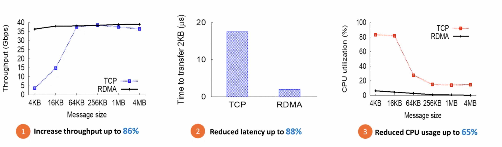
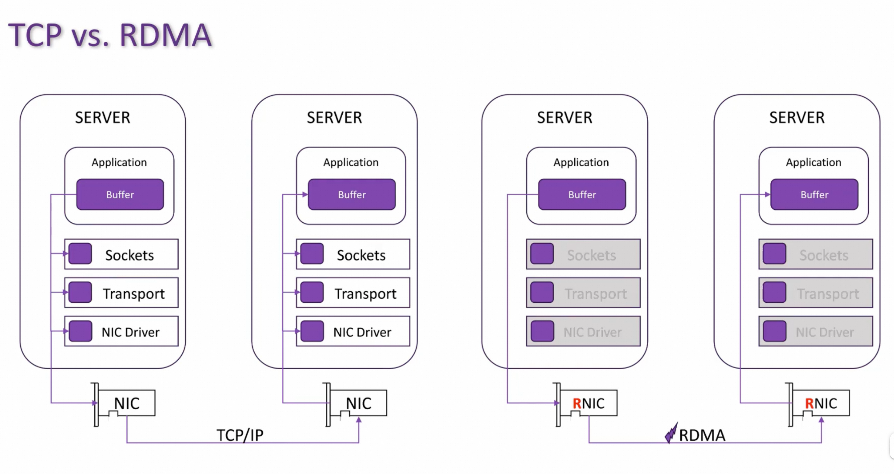
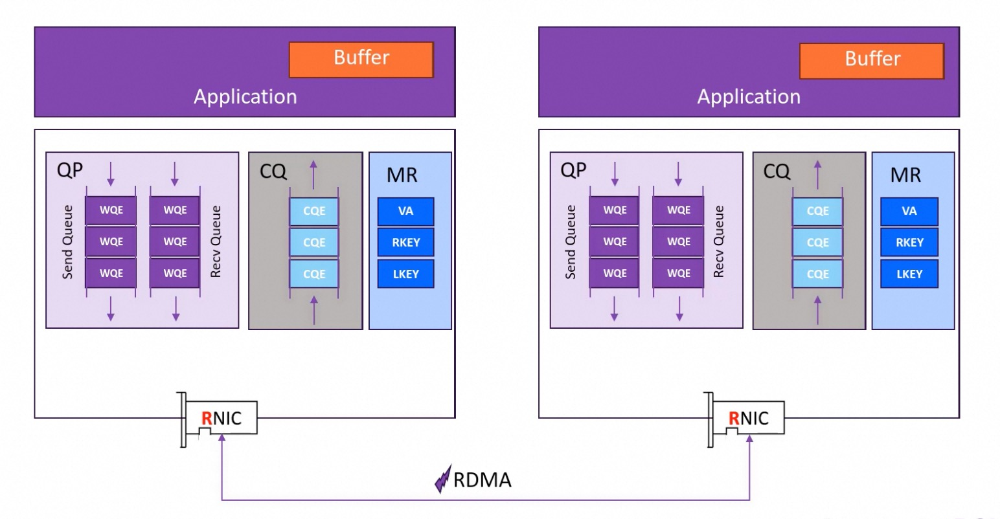
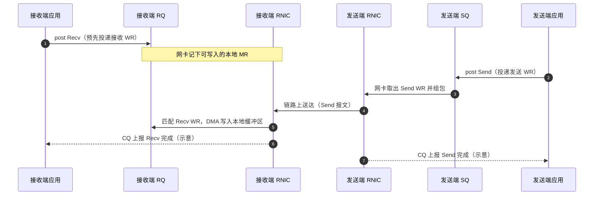
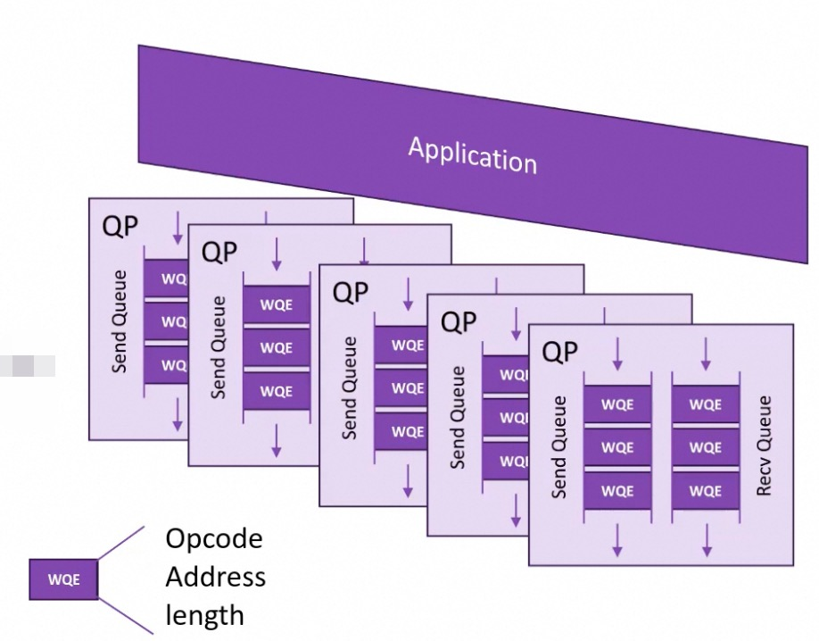

# RDMA学习笔记（1）

DMA(Direct-Memory-Access): 让硬件组件能够在不涉及CPU的情况下直接读写主存，避免占用CPU。实际上GPU也包括这种操作。

RDMA(Remote DMA): 通过网络扩展DMA的能力，让机器在不涉及双方的CPU，cache或操作系统的情况下直接操作另一台机器的内存。

RDMA允许数据直接从网卡传输到应用程序的memory中（vice versa），消除了内核网络栈中的中间拷贝.

2015年的sigcomm论文就已经展示了RDMA带来的巨大提升

下图展示了TCP和RDMA的区别：
- 对于TCP，数据包需要通过中间层在源端/目的端整理数据包，对失败的数据进行重传
- RDMA消除了中间层的参与，绕过网络堆栈和操作系统（kernel-bypass）

## RDMA Operations

Channel level
- Send
- Recv 

Memory level
- Read: 从远端内存读取数据到本地内存
- Write: 向远端内存的🈯指定地址写数据
- Atomic Operations: Performs atomic read-modify-write operations on remote memory

## RDMA Main Objects

**QP(Queue Pair)**: Consumer(application) 向网卡RNIC submit operations。应用可以持有多个QP来并行处理多个连接

By Composer2: 一个 QP 由 Send Queue（SQ） 和 Receive Queue（RQ） 成对组成，是 RDMA 里“这条连接上的工作队列”。应用把“工作请求”（Work Request，WR）提交到本机网卡，网卡按队列里的描述去干活。

### Send Queue（SQ）

Send operations to RDMA NIC（把出站工作交给本机网卡）。

- **作用**：存放本机发起的**出站**工作请求，例如 Send、RDMA Write、RDMA Read（具体取决于 post 的 WR 类型）。
- **直觉**：告诉本机 RNIC：“按这个描述去和对端通信，或直接访问本地/对端已注册的内存。”
- **要点**：SQ 始终面向**本机网卡**，描述的是**发起侧**要执行的操作。

### Receive Queue（RQ）

在**本机**向网卡提交 Recv 工作请求，为对端的 **Send** 提供接收缓冲区；**不是**把操作发到远端。

- **作用**：为**入站 Send 消息**预先挂好本地已注册内存，网卡据此把对端发来的数据 **DMA** 到指定缓冲区。
- **与对端的关系**：对端在它的 **SQ** 上 post **Send**；接收方只在 **RQ** 上提前 post **Recv**，双方各司其职。
- **典型规则**（如 RC）：对端每发一个 Send，接收侧通常需事先有一个匹配的 Recv；若不匹配，可能报错或丢消息（视 QP 类型与实现而定）。

Send / Recv 语义下，两端与各自队列的协作可概括为下图（完成事件多经 **CQ** 上报，此处仅示意主路径）：

**RQ** 像收件箱里预先摆好的格子；**SQ** 像发件或发起 RDMA 操作的任务单。

**和 RDMA Read / Write 的关系（避免混淆）**

RDMA Read / Write：一般由发起方在自己的 SQ 上 post；被动方不一定用 RQ（数据按事先注册的内存权限直接读写到你的内存里）。
Send / Recv：发送方用 SQ 发；接收方必须用 RQ 提前给出接收缓冲区。
所以你若只看到 RDMA Read/Write 的文档，会几乎感觉不到 RQ；一旦学 Send/Recv 消息语义，RQ 就很重要。

### WQE(Work-Queue-Elements)

应用向QP提交的实际元素是WQE

CQ(Completion Queue)

MR(Memory Region)

Ref:
https://www.bilibili.com/video/BV1LqdnYeEDT/?vd_source=abcbcdfc21d527c3519a180ed8826c9d 