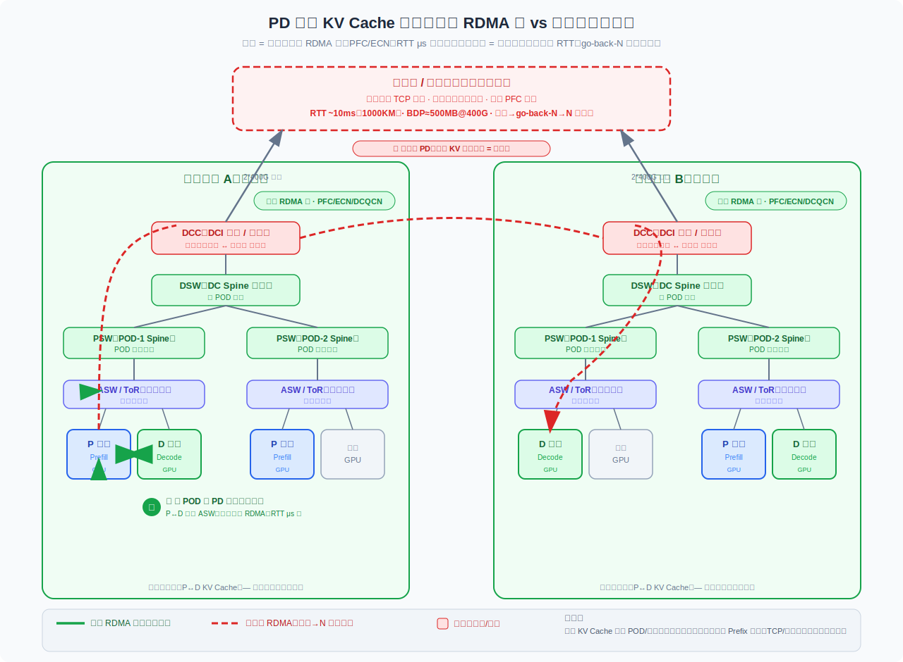

# RDMA学习笔记（2）：数据中心网络拓扑与 RoCE 无损网络

承接 [RDMA学习笔记（1）](rdma_learning_1.md)。这一篇聚焦**数据中心网络的层次结构**（ASW/PSW/DSW/DCC…），以及 RoCE 在以太网上跑 RDMA 时的 **PFC / 拥塞 / N 倍重传** 问题，最后落到对 **PD 分离**跨机房传输的启示。

## 数据中心网络的层次（Spine-Leaf / CLOS）

现代大规模数据中心普遍用 **CLOS / Spine-Leaf（叶脊）** 架构，层层收敛。从服务器往上依次是：

```
        骨干网 / 专网 (DCI, 跨机房)
             │
        ┌────┴────┐
        │   DCC   │  DCI 网关 / DC 出口（无损域 ↔ 骨干的边界）
        └────┬────┘
        ┌────┴────┐
        │   DSW   │  DC Spine（数据中心核心，跨 POD 汇聚）
        └────┬────┘
        ┌────┴────┐
        │   PSW   │  Pod Spine（POD 内脊交换机）
        └────┬────┘
        ┌────┴────┐
        │   ASW   │  Access Switch / ToR（机架顶，直连服务器）
        └────┬────┘
        ┌────┴────┐
        │ 服务器   │  GPU / PPU 节点
        └─────────┘
```

| 节点 | 全称 / 角色 | 层次 | 说明 |
|------|-------------|------|------|
| **SERVER** | GPU/PPU 服务器 | 端 | P 节点或 D 节点，流量的起点/终点 |
| **ASW** | Access Switch (ToR) | 接入层 | 机架顶，服务器网卡直连。通常双上联做冗余 |
| **PSW** | Pod Spine | POD 脊 | 一个 POD 内的脊交换机，汇聚该 POD 所有 ASW |
| **DSW** | DC Spine | 机房核心 | 跨 POD 汇聚，数据中心级核心层 |
| **DCC** | DCI 网关 / DC 出口 | 出口边界 | 机房内**无损域**与外部网络的边界 |
| **ESR** | Edge Service Router | 边缘 | 出口业务路由，对接专网 |
| **EAR** | Edge Access Router | 骨干接入 | 真正进入骨干/专网的接入点 |

跨机房的两台服务器，端到端完整路径为：

```
SERVER ─ ASW ─ PSW ─ DSW ─ DCC ─ ESR ─ EAR ═══ EAR ─ ESR ─ DCC ─ DSW ─ PSW ─ ASW ─ SERVER
└──────────── 数据中心 A ────────────┘   骨干   └──────────── 数据中心 B ────────────┘
                                        (专网)
```

## 东西向 vs 南北向流量

- **东西向流量**：服务器↔服务器（AllReduce、KV Cache 传输），走 ASW→PSW→DSW，**是 AI 训练/推理的大头**。
- **南北向流量**：进出数据中心的流量（用户请求、跨机房），走 DSW→DCC→骨干网。

在拓扑可视化图里（全互联 CLOS），会看到一个重要现象：**机房内部是"胖"的，骨干是"瘦"的**。

- ASW→PSW→DSW→DCC 之间是**密密麻麻的全互联**（每个下层节点连到上层的每一个节点）——这是 CLOS 的**多路径（ECMP）**，提供巨大的等价带宽（几十上百条 400G 并行），任何单链路/单交换机故障都能自动绕行，**无损域内几乎无单点瓶颈**。
- 到了 `ESR–EAR ═══ EAR–ESR` 骨干段，连线**收敛成一条细线**：**机房内是海量并行的胖管道，跨机房骨干是少数几条链路的细管道。**

## RoCE / PFC / 拥塞与 N 倍重传

### RoCE (RDMA over Converged Ethernet)

- **RDMA** 绕过 CPU 和内核协议栈，网卡直接读写对端内存，做到超低延迟、超高吞吐、零拷贝。是 GPU 训练/PD 分离 KV 传输的基础。
- RDMA 最早跑在 InfiniBand 上。**RoCE 让 RDMA 跑在以太网上**（RoCEv2 用 UDP 封装，可路由）。好处是复用以太网生态，坏处是——**以太网天生会丢包，而 RDMA 极度不耐丢包**。

### 为什么 RDMA 怕丢包

传统 TCP 丢一个包只重传那一个（选择性重传）且有成熟拥塞控制。而经典 RoCE 的传输是 **go-back-N** 语义：

- 丢了第 N 个包，接收端后面的包**全部丢弃**，发送端要**从第 N 个开始全部重传**。
- 这就是 **"N 倍重传"**——一次丢包可能触发一大段数据重发，吞吐断崖式下跌，尾延迟爆炸。

所以 RoCE 要求底层网络**尽量不丢包**，这引出 PFC。

### PFC (Priority Flow Control)

- 标准以太网流控是**整个端口**级别的暂停；PFC 更细，按**优先级队列（8 个）** 单独暂停。
- 机制：当交换机某队列缓冲快满（要溢出丢包了），向**上游**发 **PAUSE 帧**，上游暂停发送，等缓冲腾空再恢复。用"暂停"代替"丢包"，构建**无损网络**。

**PFC 的副作用：**

1. **队头阻塞（HoL blocking）**：PAUSE 暂停整个优先级队列，不区分具体是哪条流拥塞，会误伤同队列的无辜流量。
2. **PFC 风暴 / 死锁**：PAUSE 逐跳向上游传播，环形依赖下可能形成**死锁**，整片网络卡死。
3. 生产上通常配合 **ECN + DCQCN**：ECN 在拥塞**早期**就给包打标记（而非等到要丢包才 PAUSE），发送端收到标记后主动降速，把 PFC 当最后一道防线。

## 骨干网为什么会 N 倍重传

**数据中心内部（ASW/PSW/DSW）** 是**为 RDMA 精心设计的无损域**：全程 PFC/ECN，交换机 buffer / 队列 / DCQCN 参数都按 RoCE 调优；链路短、跳数少、RTT 微秒级，拥塞能被快速反馈压下去，丢包率极低。

**但"骨干网 / 新建专网"（DCC 以上）** 是另一回事：

- 设计初衷是承接**南北向、TCP 为主**的流量，拥塞管理假设是"TCP 自己会退让、丢包可接受"；
- **通常不保证端到端无损**——中间设备可能不开 PFC，或跨厂商/跨自治域导致参数不一致、PFC 无法端到端传播；
- **长距离 + 大 RTT 是致命的**：PFC/ECN 的反馈是闭环的，从检测拥塞到发送端降速要经历至少一个 RTT。RTT 越大反馈越慢，拥塞被压下去之前已积累了一个 **BDP（带宽时延积）** 量级的在途数据。`400G × 10ms 的 BDP ≈ 500MB`，一旦这堆数据撞上拥塞点又无法无损缓冲，就**大规模丢包**。
- 丢包 → 触发 RoCE 的 **go-back-N 重传** → **N 倍重传** → 吞吐塌陷、尾延迟飙升。

> **结论**：RDMA 的无损假设只在"精心调过的数据中心内部"成立；一旦打到"没为 RDMA 设计的骨干/专网"上，大 RTT 让拥塞反馈失效、跨域让 PFC 断链，拥塞就会变成真丢包，而 RoCE 的 go-back-N 让代价成 N 倍。

## 对 PD 分离的启示



- **同 POD / 同机房内做 PD 分离**：P↔D 只过 ASW/PSW，全程无损 RDMA，RTT μs 级，**又快又稳**。
- **跨机房做 PD 分离（P/D 分处不同机房）**：KV Cache 必须穿过中间那条又细又不无损的骨干线——既有 ~10ms 的物理延迟下限（光在光纤约 5μs/km，1000km 往返 ~10ms，**再优化也降不下去**），又要在非无损骨干上跑 RDMA，极易踩到重传塌陷。**高风险。**

**实践建议：**

- **在线 KV Cache 走同 POD/同机房无损域**；
- 跨机房只做**异步、可容忍丢包的**数据搬运（如 Prefix Cache 预取，用 TCP 或带应用层重传的协议），而不是把在线 KV 传输直接压到骨干 RDMA 上；
- 这也解释了为什么会有**选择性重传的 RoCE 改进（SRD、IRN）** 这类工作——让 RDMA 传输本身容忍乱序/丢包，摆脱 go-back-N 的 N 倍放大。

## 附：实验网环境要点

在跨三地（乌兰 NA130 / NO225、北京 NG152）的 AI 实验网中：

- 乌兰内部两个 POD 之间：`25KM : 0.25ms`
- 乌兰 ↔ 北京跨城：`1000KM : 10ms`（RTT 物理下限，决定跨城 RDMA 的 RTT）
- 链路：`2*400G` / `4*400G`（400G 光口做链路聚合）
- 设备跨厂商混布：H3C Q4D、锐捷 Q3D/Q4D、自研 P200 等，EAR 扮演出口路由角色

跨城 PD 分离的两个硬约束叠加——**10ms 物理延迟** + **非无损骨干的重传风险**——是决定"KV Cache 该不该跨机房传"的关键。
