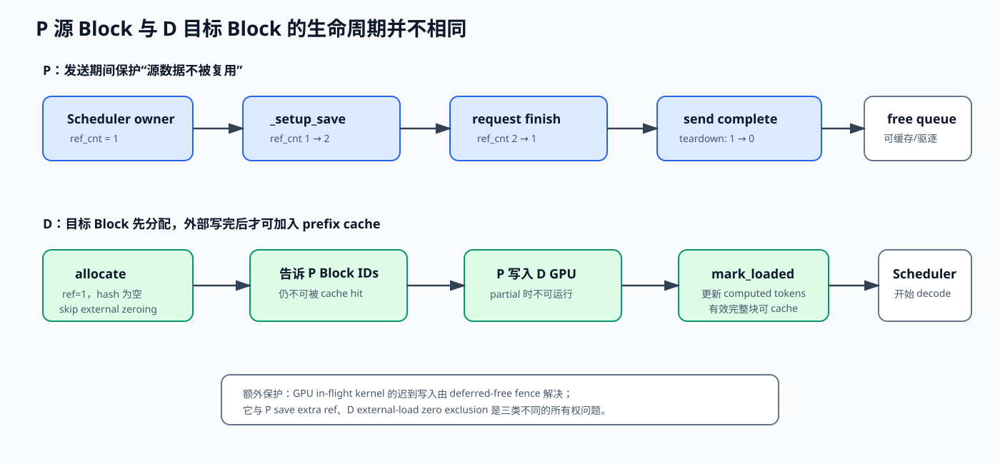

# 02 KV Block 生命周期：分配、缓存、引用、零化与安全释放

## 1. KV Block 是什么

vLLM 预先申请一大块 GPU KV cache，再切成固定 token 容量的 Block。Request 不持有
独立的大 tensor，而是持有 Block 表：

```text
request tokens:
0 ........ 15 | 16 ....... 31 | 32 .......

logical blocks:
      0       |       1       |      2

physical block IDs:
     417      |      23       |     981
```

逻辑 token 连续，不代表物理 Block ID 连续。Blade-KVT 必须按 Block 表产生若干
`IpcBlock(src_offset, dst_offset, length)`。

混合模型还可能有多个 KV cache group：

```text
KVCacheBlocks.blocks = (
    [attention-group blocks...],
    [mamba/gdn-group blocks...],
)
```

因此文中提到 Block ID 时要说明是“哪个 group 的 Block ID”。

## 2. `BlockPool` 的核心对象

`BlockPool` 初始化时创建：

```python
self.blocks = [KVCacheBlock(idx) for idx in range(num_gpu_blocks)]
self.free_block_queue = FreeKVCacheBlockQueue(self.blocks)
self.cached_block_hash_to_block = ...
```

一个 Block 至少有：

- `block_id`：物理页号；
- `ref_cnt`：当前有多少活跃所有者；
- `block_hash`：prefix cache 键；
- 是否在 free queue；
- `is_null`：混合布局中的占位 Block。

### “free”与“没有缓存内容”不是一回事

开启 prefix cache 时，`ref_cnt==0` 的 Block 可以仍带有 hash 和有效 KV：

```text
ref_cnt=0 + hash存在
  = 当前没有请求引用
  = free queue 中的 eviction candidate
  ≠ 已经把 GPU 字节清空
```

新分配要复用它时才会驱逐 hash 元数据。这样 prefix cache 能利用空闲显存保存历史 KV。

## 3. 普通请求的生命周期

```text
free queue
  → allocate: ref_cnt 0→1
  → forward 写 KV
  → full block 计算 hash，进入 prefix cache
  → request finish
  → free: ref_cnt 1→0
  → 回 free queue，仍可能保留 hash
  → 以后 cache hit: touch，ref_cnt 0→1，并从 free queue 移除
```

`touch()` 的关键动作是：

```python
if block.ref_cnt == 0 and not block.is_null:
    self.free_block_queue.remove(block)
block.ref_cnt += 1
```

如果只加 refcount 却没从 free queue 移除，分配器可能同时把正在使用的 Block 发给另一个
请求，这是严重 use-after-reuse。

## 4. D 侧远端 load 的特殊生命周期



D 需要在 P 开始发送前确定目标地址，因此顺序是：

```text
D allocate destination blocks
  → 暂不 cache（delay_cache_blocks=True）
  → 把 D block IDs 发给 P
  → P 写入这些 blocks
  → load completion
  → 更新 num_computed_tokens
  → 条件满足后 cache_blocks
  → 进入普通 Scheduler
```

为什么 `delay_cache_blocks=True`？刚分配时 Block 里可能还是旧字节，远端传输尚未完成。
如果提前写入 prefix hash 表，另一个同前缀请求可能命中“尚未准备好”的 Block。

上游回归测试 `test_no_spurious_prefix_caching` 就验证了：

- remote request 已分配 Block；
- transfer 未完成前 Block hash 必须为空；
- 同前缀本地请求不能误命中这些未计算 Block。

## 5. P 侧发送为什么要额外引用

P 的请求可能在网络传完之前就达到模型 finish。`_setup_save()` 做：

```python
self._saving[reqid] = _SavingReq(req, kvblks, ...)
sched_acquire_blocks(kvblks)
```

`sched_acquire_blocks()` 对每个 Block：

```python
block.ref_cnt += 1
```

于是：

```text
普通 Scheduler owner：1
Hybrid save owner：   1
总 ref_cnt：          2
```

请求 finish 后 Scheduler 释放：

```text
2 → 1
```

Block 仍不在 free queue，Blade-KVT 可以继续读取。发送完成后
`_try_teardown_save()` 调 `sched_free_blocks()`：

```text
1 → 0 → 回 free queue
```

这个额外引用是 P 侧避免“网络线程还在读，Scheduler 已把 Block 分配给新请求”的核心
内存安全条件。

## 6. 为什么 `sched_get_blocks()` 复制 list，却不复制 Block

它做的是：

```python
oblks = coordinator.get_blocks(reqid)
nblks = tuple(blk[:] for blk in oblks)
```

得到新 list，但里面仍是相同 `KVCacheBlock` 对象：

```text
old_list ─┐
          ├─> KVCacheBlock(id=42)
new_list ─┘
```

目的：

- 后续修改 list 结构不会改 Scheduler 内部 Block 表；
- refcount 操作仍作用于同一物理 Block 对象；
- 不会错误创造一个“同 block_id、不同 ref_cnt”的影子对象。

## 7. 新 Block 零化为什么与外部 KV load 冲突

混合模型中，旧显存里的 fp32 位模式若被 attention 以其他 dtype/shape 读取，可能出现
NaN/Inf，因此 Scheduler 收集新分配的 attention Block ID：

```python
new_block_ids = kv_cache_manager.take_new_block_ids()
scheduler_output.new_block_ids_to_zero = new_block_ids
```

worker 在执行模型前：

```python
if scheduler_output.new_block_ids_to_zero:
    self._zero_block_ids(...)
```

但 D 的目标 Block 由外部 P 写入。如果时序是：

```text
P 把正确 KV 写到 D block 42
       ↓
旧 SchedulerOutput 又执行 zero(block 42)
       ↓
正确 KV 被清零
```

这不是普通线程数据竞争，而是跨 scheduler step、GPU kernel 和外部 DMA 的所有权竞态。

### 当前 KVT 粗粒度保护

`sched_allocate_slots()` 判断 D 是 KVT consumer 时：

```python
skip_new_block_zeroing = True
```

从分配源头就不把这些 Block 放入 pending zero list，适合 D Block 明确由 KVT 填充的
路径。

### KVS-like 细粒度保护

如果只有在后面才知道哪些 Block 真正被外部填充，则调用：

```python
sched_discard_zero_block_ids(block_ids)
```

把目标 ID 从 pending zero list 删除。

### 仍需审计的窗口

如果某一轮 `take_new_block_ids()` 已经把 ID 搬进当前 `SchedulerOutput`，后续只删除
manager 内的 pending set，并不能修改已经构造好的 output。文档不应看到
`discard_new_block_ids()` 就断言所有时序都安全。正确审计问题是：

```text
外部 load 确定目标 ID 的时刻
  是否早于
该 ID 被 take 进 SchedulerOutput 的时刻？
```

当前 KVT consumer 在 allocation 时跳过零化，能避开这类同 output 窗口；组合 backend
或新 backend 必须逐一验证。

## 8. deferred free：防止 in-flight GPU step 继续写已释放 Block

即使没有网络，异步 GPU 执行也带来另一类竞态：

```text
Scheduler 认为 request abort
  → free block
  → 新 request 复用
  → 上一轮 GPU kernel 迟到，继续写旧 request
```

Scheduler 维护：

```text
sched_step_seq
processed_step_seq
deferred_frees: deque[(fence_seq, blocks)]
```

如果 request 最后一轮可能还在 GPU 上执行，就先从请求账本中摘出 Block，但不立刻放回
pool；当 `processed_step_seq >= fence_seq` 时 `_drain_deferred_frees()` 才真正释放。

对比两类保护：

| 机制 | 防止谁访问已复用 Block |
|---|---|
| Hybrid save extra ref | Blade-KVT/Barex 发送线程继续读取 P Block |
| deferred free fence | 上一轮 GPU kernel 继续读写本地 Block |

## 9. prefix cache 只缓存“可提交 token”

普通 `allocate_slots()` 不会无条件缓存所有预分配空间。它计算：

```python
num_tokens_to_cache = min(
    num_computed_tokens + num_new_tokens,
    request.num_tokens,
)
```

lookahead/speculative token 可能被拒绝，不能提前把对应 Block 当作已验证 prefix。

外部 load 完成后也只有完整、有效且达到约定边界的 Block 才应进入 prefix cache。
partial tail Block 通常需要特殊处理，因为同 hash 的定义必须与 token 数严格一致。

## 10. Block 不足时发生什么

`allocate_slots()` 先计算需要的 Block 数：

```python
if num_blocks_to_allocate > block_pool.get_num_free_blocks():
    return None
```

Hybrid `_step_waiting()` 保留请求，等待以后重试。危险点是 P save 的额外引用会降低
free block 数：网络越慢，更多已结束 P 请求的 Block 仍被 transfer owner 持有，进而
产生显存反压。这是正确性优先的代价。

应监控：

- `kv_cache_usage`；
- `pre_scheduler_load_kv_cache_usage`；
- `post_scheduler_save_kv_cache_usage`；
- `_saving` 按 source 的积压；
- ready-to-teardown 但未 teardown 的请求数。

## 11. null block 和多 group 注意事项

`null_block` 是布局占位符，refcount 不按普通 Block 维护，释放时跳过。任何统计或
外部传输都不应把它当作真实目标页。

多 group 时不要只 flatten 第一组 Block ID：

```text
正确：逐 group 保持 layer/cache layout 映射
错误：把不同 block_size/group 的 ID 拼成一维再统一乘一个 block_bytes
```

KVT 当前通过 `list[list[int]]`、多 tensor layer 和 cache-shape-specific
`parse_block` 保留这些结构。

## 12. 自检

1. 为什么 `ref_cnt=0` 的 Block 仍可能有有效 KV？
2. D 为什么必须先分配 Block，再向 P 发请求？
3. `delay_cache_blocks=True` 防止了什么？
4. P request finish 后为什么可以释放 Scheduler 引用却不破坏发送？
5. 外部 load 与 zero kernel 为什么可能发生“后来的清零覆盖正确 KV”？
6. Hybrid save extra ref 与 deferred free fence 有什么区别？
