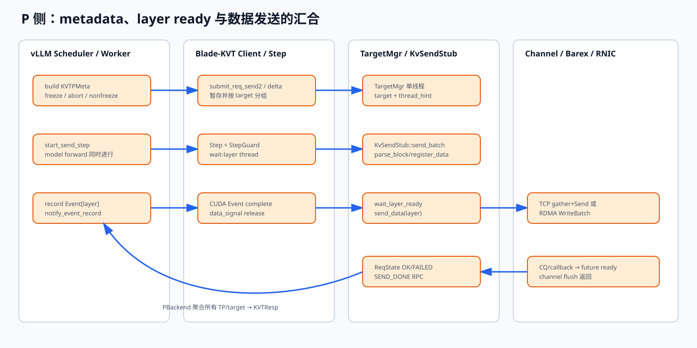

# 04 KV 发送路径：从 PReqMeta 到 IpcBlock、RDMA WR

## 1. 先看完整调用链



```text
PBackend.build_backend_meta
  → KVTPMeta(freeze/abort/nonfreeze)
  → HybridWorker.bind_connector_metadata
  → PBackend.bind_backend_metadata
  → KVTransferClient.submit_req_send2 / submit_delta_send
  → KVTransferClient.start_send_step
  → C++ KvTransferClient::start_send
  → TargetMgr::submit / do_submit
  → KvSendStub::send_batch
  → parse_block
  → IChannel::register_data
  → for each layer:
       Step::wait_layer_ready(layer)
       IChannel::send_data(layer)
  → IChannel::flush
  → SEND_DONE / SAVE_DONE
```

## 2. PBackend 怎样决定本轮发多少 token

`_step_sched_req()` 同时处理：

- `scheduled_new_reqs`：本轮首次进入 Scheduler；
- `scheduled_cached_reqs`：已运行请求继续推进。

它读取：

```text
D cached_tokens
P 本轮 seen_tokens
P 本轮 scheduled new_tokens
KVTState.maxtokens
has_last_token
```

第一次发送产生完整 `PReqMeta`：

```python
PReqMeta(
    reqid=req_id,
    d_inst_id=...,
    p_block_ids=...,
    d_block_ids=...,
    seen_tokens=D已有边界,
    new_tokens=本轮新增,
    has_last_token=是否达到传输上限,
)
```

后续同 request 增量发送不必重复 Block 表：

```text
d_block_ids 为空
→ submit_delta_send(reqid, seen, new, last)
→ Blade-KVT 从 reqs_[reqid] 找回第一次保存的 RequestInfo
```

如果最终没有新 token 但请求结束，`new_tokens=0, has_last_token=True` 的 delta 是终结
标记；它让 Blade-KVT 生成失败/完成状态并释放请求跟踪，而不是搬 0 字节。

## 3. freeze 与 nonfreeze

### freeze

`start_req_send()` 创建一个独立 `Step`，直接：

```cpp
step->notify_layer_ready(num_layers);
```

所有 layer 立即 ready。它用于 P 的 KV 已经全部算好、无法再附加到正常 forward step
的晚到传输。

### nonfreeze

`submit_req_send2()` 只把 task 暂存在 `targets_tasks_buf_`，真正 `start_send_step()` 后
才创建 StepGuard，并逐层等待 CUDA Event。

它用于与当前 forward 重叠的发送。

freeze 是“数据已经冻结可读”，不是冻结 Python 线程或禁止请求状态变化。

## 4. `StepTasks` 怎样按 target 分组

核心结构：

```cpp
unordered_map<
  InstanceId,
  vector<pair<WorkerId, BatchSendTask>>
> tasks;
```

`add_send_task()`：

1. 用 `dst_inst_id` 找到实例 bucket；
2. 在线性 vector 中找相同 `dst_worker_id`；
3. 找不到就创建 `BatchSendTask`；
4. 把 `ReqSendTask` 追加进去。

于是一个 Step 内：

```text
D instance A
  worker 0: req1, req7
  worker 1: req1, req7
D instance B
  worker 0: req3
```

同一目标的多个 request 被放进同一个 `BatchSendTask`，可以共同解析和提交。

## 5. `TargetMgr` 和发送线程怎么分工

`TargetMgr` 有：

```cpp
ThreadPool mgr_thd_{1};
XThreadpool* target_thdpool_;
```

`submit()` 先把任务放到单线程 `mgr_thd_`，`do_submit()` 串行完成：

- 查找/创建 `(instance, worker)` 对应 `Target/KvSendStub`；
- 更新 LRU；
- 增加 `inflycnt`；
- 为第一次进入 in-flight 的 target 分配 `thread_hint`；
- 把 `send_batch` 投递到 Barex XThreadpool。

为什么 manager 单线程：

- `targets_`、`target_map_`、LRU 状态只在一个线程修改；
- 不需要为每个 map/list 操作加复杂锁；
- 建连与发送仍在 target pool 并发，不把耗时工作放在 manager 上。

### `thread_hint` 的意义

同一 target 的 `inflycnt` 从 0→1 时得到新的 hint；后续并发 batch 使用同一个 hint。
Barex threadpool 可据此把它们定向到同一 worker 线程，尽量保持：

- `KvSendStub::TaskContext` 不被多个线程同时使用；
- 同 target 批次顺序稳定；
- channel/cache 状态局部性更好。

这不是“一目标永久一线程”。in-flight 清零、未来重新活跃时可能拿新 hint；不同 target
也可能 hash/映射到同一个实际 pool thread。

## 6. `parse_block` 到底做什么

它将抽象 token 范围映射成每层都可复用的 byte 区间：

```cpp
IpcBlock {
  size_t src_offset;
  size_t dst_offset;
  size_t length;
}
```

输入包含：

- P/D Block ID 列表；
- `seen_tokens/new_tokens`；
- P/D block bytes、token bytes；
- P/D TP size/rank；
- KV head 数；
- cache shape；
- Kimi K3、Qwen3-Next GDN、Eagle、多 tensor 等布局参数。

例如 block size 为 16 token，每 token 本 rank KV 占 4096 B：

```text
P block_id=10, token offset=4
src_offset = 10 * (16*4096) + 4*4096

D block_id=31, token offset=4
dst_offset = 31 * (16*4096) + 4*4096
```

实际 hybrid layout 可能一层多个 tensor、部分 layer slot inactive，必须使用对应
`parse_block_*`，不能只套这个简化公式。

## 7. 为什么要合并连续 IpcBlock

如果同时满足：

```text
cur.src == prev.src + prev.length
cur.dst == prev.dst + prev.length
```

`merge_interval()` 把它们合成一个更大区间。

收益：

- 更少 SGE/WQE；
- 更少 doorbell 和 CQ bookkeeping；
- 每次 DMA 更大，固定开销占比更低；
- TCP gather/scatter metadata 更少；
- 更容易填满 PCIe/网络带宽。

只看源连续不够。如果目的不连续，合并后会写错 D Block；只看目的连续也不够，源端
不是一段连续内存。

## 8. RDMA Direct 如何变成 WR 字段

`RDMAChannel::send_data(layer_idx)` 遍历每个 tensor 的 `IpcBlock`：

```cpp
rwmemp.r_addr = dst_base + dst_offset;
rwmemp.r_key  = dst_rkey;
rwmemp.sg.addr   = src_mr.buf + src_offset;
rwmemp.sg.length = len;
rwmemp.sg.lkey   = src_mr.lkey;
```

对应关系：

```text
IpcBlock.src_offset
  → local SGE addr
IpcBlock.length
  → SGE length
IpcBlock.dst_offset
  → RDMA WRITE remote address
D GPU MR
  → rkey
P GPU MR
  → lkey
```

多个 `rw_memp_t` 放进 Barex `WriteBatch`。Barex 再将它们编码为一个或多个 RDMA
WRITE WQE。WQE 数量受 provider、最大 SGE 数、WR 大小和 batching 策略影响，不能从
`IpcBlock` 数量机械断言“一块等于一个 WQE”。

## 9. 每层发送怎样与 forward 重叠

`KvSendStub::TaskContext::do_send()`：

```cpp
register_data(...)
for layer:
    step->wait_layer_ready(layer)
    channel->send_data(layer)
channel->flush(...)
```

假设 layer 0 kernel 完成时 layer 1 正在 GPU 上计算：

```text
GPU compute: L0 | L1 | L2 | L3
network:           send L0 | send L1 | send L2 | send L3
```

重叠成立需要：

- Event 记录在真正产生该层 KV 的 stream；
- wait-layer 线程及时推进 `data_signal_`；
- 网络发送不与 forward 争用到完全串行；
- source KV 在发送完成前不被改写或释放。

## 10. `flush_send_step()` 等什么

Python docstring 说它只保证已提交数据“发送成功”，但具体边界依 channel 而异：

- RDMA Direct：`RDMAChannel::flush()` 等 WriteBatch future；
- TCP：等 D 端 H2D 完成并返回响应；
- staged RDMA：等 staged 写及远端处理响应。

随后 `KvSendStub` 对 `reach_last_token` 的请求调用 `send_done()`，通过 TCP RPC 向
P Scheduler 发 `SEND_DONE_REQ`，并可附带 `SAVE_DONE2_REQ`。

所以主线是：

```text
channel flush
  → request state OK/FAILED
  → SEND_DONE
  → PBackend 按 TP 聚合
  → KVTResp 给 D
```

## 11. `send_done` 自己失败怎么办

Blade-KVT 复用一条长 TCP 连接。失败后：

1. reset socket；
2. 新建连接重试一次；
3. 第二次失败只记录日志，不再抛出。

这意味着数据可能已经成功，但 P Scheduler 永远收不到应用层完成，从而 `_SendingReq`
继续等待。这是第 08 章会重点讨论的控制面可靠性缺口。

## 12. 自检

1. `submit_req_send2()` 为什么不立即开始传输？
2. freeze 和 nonfreeze 的数据 ready 条件分别是什么？
3. `StepTasks` 是按 instance 还是 worker 分组？答案为什么是两级？
4. `IpcBlock` 如何变成 local SGE 与 remote address？
5. 为什么连续小块只有源和目的都连续时才能合并？
6. `WriteBatch` callback 与 PBackend 收到 `SEND_DONE` 中间还有哪些步骤？
