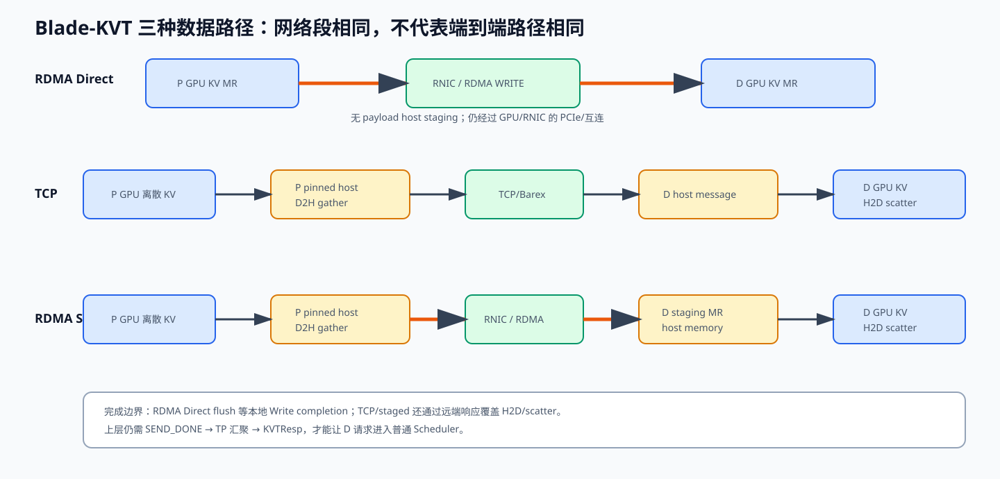

# 05 KV 接收路径与完成语义：TCP、RDMA Direct、staged RDMA

## 1. D 侧不是“收到包后再找 Block”

D Scheduler 在请求进入普通 Scheduler 前已经分配目标 Block，并把 Block ID 发给 P。
D Worker 启动时又把整块 KV tensor 注册给 Blade-KVT server。

P 计算：

```text
D block ID + layer/tensor layout
  → dst_offset
  → D registered tensor base + dst_offset
```

所以数据一旦到达，就直接落到未来 attention kernel 会读取的位置。

## 2. 三条路径总览



```text
RDMA Direct:
P GPU MR ──RNIC RDMA WRITE──> D GPU MR

TCP:
P GPU ─D2H gather→ P pinned host ─TCP→ D host
      ─H2D scatter→ D GPU

RDMA staged:
P GPU ─D2H gather→ P pinned host ─RDMA→ D pinned host
      ─H2D scatter→ D GPU
```

“RDMA”只描述 RNIC 跨网络访问注册内存的方式。目标可以是 host MR，也可以是 GPU MR。
因此 staged RDMA 仍是 RDMA，但不是 GPUDirect RDMA data path。

## 3. RDMA Direct 接收

D `RDMAServer::start_server()` 为每层每个 tensor 的 GPU buffer 取得：

```text
base pointer
rkey
```

P 首次连接后用一个 Barex RPC `get_mem_handles()` 获取这些 handle。之后 P 的
`RDMAChannel::send_data()` 直接构造：

```text
local: P GPU addr + src_offset, lkey
remote: D GPU addr + dst_offset, rkey
operation: RDMA WRITE
```

D CPU 不为每个数据块执行 memcpy，也不一定为每个 WRITE 收到应用层消息。RNIC 按
rkey/地址校验后，通过 D 侧 PCIe/互连写 GPU HBM。

### D 什么时候“可见”

当前 Blade-KVT 不在每个 RDMA Write 后让 D Worker Python 收一个回调。可见性依赖
RDMA completion/ordering，以及 P 只有在所有 Write completion 后才发上层
`SEND_DONE/KVTResp`。D Scheduler 收到 KVTResp 后才把请求推进到可运行状态。

因此控制面建立了：

```text
all P local write completions
  happens-before
P SEND_DONE aggregation
  happens-before
KVTResp
  happens-before
D request enters normal scheduler
```

这条链是 D 不会过早运行 attention 的关键，而不是 D Python 为每层检查 CQE。

### CRC 可选校验

打开 CRC 时，P 在写完后向 D 发 RPC，让 D 通过 GDR 映射读取目标范围计算 CRC，再与
P 本地 CRC 比较。它提供更强的数据内容验证，但：

- 有额外读显存和 RPC 开销；
- 没开 GDR/布局不支持时可能降级；
- 默认 write completion 本身不验证每个字节的业务内容。

## 4. TCP 接收

P `TCPChannel::send_data(layer)` 做：

1. 把源 `IpcBlock` metadata 写入 host message；
2. CUDA kernel 将离散 P GPU 区间 gather 到 pinned host blob；
3. 同步 D2H stream，确保 host blob 可发送；
4. Barex `Send()` 发送整条消息。

D `TCPServer::handle_kv_cache_data()`：

1. 校验 magic、layer、tensor 数；
2. 反序列化 `IpcBlock`；
3. 检查每个 `dst_offset + length` 没越过注册容量；
4. H2D scatter 到 D GPU；
5. 同步 H2D stream；
6. 返回带时间戳的响应。

P 把每个 reqid 对应一个 promise。响应进入 `CliBarexCtx::RpcCtxCb` 后：

```text
reqid → pop callback → set promise → TCPChannel::flush future ready
```

所以 TCP flush 包含接收端 H2D 完成。

## 5. 为什么 TCP 要把离散小块聚成一个大 host message

KV Block ID 常常不连续。若每一小块单独发送：

- 每块都有 RPC/header；
- 每块都可能分配 buffer、提交 send、产生 callback；
- syscall/doorbell/WQE/CQE 固定开销占比高；
- 小包更难利用 BDP；
- 接收端 callback queue 更拥挤。

Blade-KVT 先把源 GPU 离散块 gather 到连续 pinned host blob，再一次发送，D 再
scatter。它牺牲两次 GPU↔host copy，换取较高的网络传输粒度。

这不是 TCP 协议强制要求连续“业务对象”；socket 本来就是 byte stream。连续 host
buffer 是为了减少上层提交和 gather I/O 开销。

## 6. staged RDMA 接收

staged 路径与 TCP 相似，但网络段使用 RDMA 写 D 的 host staging MR：

```text
P D2H gather
  → RDMA Write / Write with notification
  → D server 得知 staging data ready
  → D H2D scatter
  → response/completion
```

适用于 GPU Direct 不可用、拓扑/驱动不支持或希望用 host buffer 隔离布局的情况。
性能取决于两次 PCIe copy、host memory bandwidth 和 staging buffer 管理。

Kimi K3 + Eagle 的异构 tensor slot 当前代码明确禁止 staged RDMA，因为 staged path
没有实现相同的 inactive-slot 布局语义。

## 7. 四个“完成点”逐一回答

### A. API submit 成功

Barex API 返回 `BAREX_SUCCESS` 只说明成功接受任务，不代表 NIC 已传输。

### B. transport local completion

Barex callback 成功：

- RDMA WRITE：本地 RNIC 已完成该 WR 的本地完成语义，源 buffer 可按约定复用；
- TCP Send：消息发送操作完成，但 Blade-KVT TCP 还要求对端响应；
- 不等于 D 应用已经执行 decode。

### C. Blade-KVT batch completion

`channel->flush()` 返回，`KvSendStub` 将 request 标记 OK/FAILED，并发 `SEND_DONE`。

### D. vLLM request completion

PBackend 等所有 TP worker、所有 fan-out target 的 `SEND_DONE`，再回复 D；D
`mark_loaded` 后才可把 Request 交还 Scheduler。

## 8. RDMA callback 是否等 ACK

RoCE RC/RDMA reliability 的 ACK/retry 在 RNIC/transport 层完成。应用看到成功 CQE 前，
RNIC 已满足该 transport 的完成条件。这个 ACK 不是 D 侧 CQE 返回给 P：

- P 有自己的 CQE；
- D 可能没有对应 receive CQE（one-sided WRITE）；
- 网络 ACK 由 RNIC 协议栈处理；
- `SEND_DONE` 是 Blade-KVT 应用层另发的 TCP RPC。

## 9. 接收端断开时可能看到什么

### 在建连前

- naming 找不到 target；
- Connect future 失败；
- ChannelFactory 尝试其他 protocol，全部失败则抛异常；
- `KvSendStub::do_task()` 捕获并把 batch request 标 FAILED。

### in-flight TCP/staged

- Send callback 返回 error，`on_send_error()` 找到 reqid callback；
- future 以异常完成；
- 或 flush 等到 `env_rpc_timeout_s()` 后主动注入 timeout；
- channel reset，下轮重新创建。

### in-flight RDMA Direct

- provider 通常应以错误 CQE/callback 完成失败 WR；
- `WriteBatch` promise 变异常，flush 抛出；
- 但 `RDMAChannel::flush()` 当前直接 `future.get()`，没有 Blade-KVT 自己的
  `wait_for(env_rpc_timeout_s())`；
- 如果底层既不给 completion 也不给 error，发送线程可能无界等待。

最后一点是代码审计风险，不应因为“RC 理论上可靠”就忽略。

## 10. 数据正确性验证层次

| 层次 | 可发现的问题 | 发现不了的问题 |
|---|---|---|
| 边界检查 | 错 offset、越界、0 length | 合法范围内写错内容 |
| transport completion | WR/连接错误、超时 | 应用布局算错但传输成功 |
| CRC | 内容不一致 | 双方用同样错误范围且碰巧一致 |
| 请求级数值测试 | 最终 logits/KV 对比 | 极低概率、未覆盖 shape |

生产系统需要至少同时有 transport 指标和端到端正确性抽检。

## 11. 自检

1. RDMA Direct 为什么仍然经过 D 侧 PCIe/互连？
2. D 没有 receive CQE 时，如何避免在数据到齐前运行 request？
3. TCP flush 为什么比 RDMA Direct flush 更接近远端完成？
4. staged RDMA 与 GPUDirect RDMA 的区别是什么？
5. 为什么 transport success 仍可能得到错误 KV？
