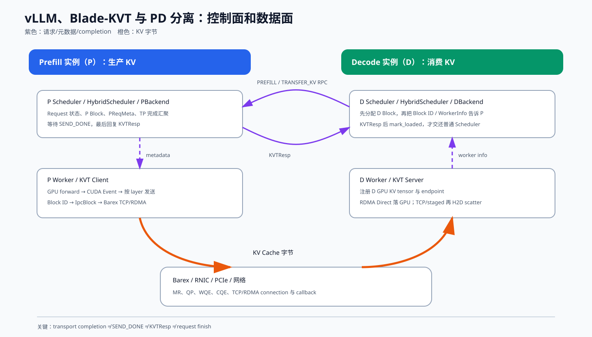

# vLLM、Blade-KVT 与 PD 分离：从请求到 KV Cache 的完整生命周期

> 目标：不只知道“P 节点把 KV 发给 D 节点”，而是能沿着一个真实请求回答：谁创建
> `Request`，谁分配和保护 KV Block，谁决定发送哪些 token，GPU 第几层算完后谁开始
> 发送，远端什么时候可以读取，成功/失败如何跨 C++、Python、进程和机器返回，以及
> 任意一个 completion 丢失时系统会在哪里等待。

## 版本基线与阅读边界

本文档逐函数阅读以下本地代码后编写：

| 项目 | 分支 | commit |
|---|---|---|
| `~/codes/vllm` | `feat/k3-eagle-kvt` | `50c13ab932fc27594434e4a304a33e0f4c132f96` |
| `~/codes/blade-kvt` | `feat/kimi-k3-eagle-kvt` | `0e0af50a5c8063c887251b450966b12631a51802` |
| `~/codes/notes` | `master` | 编写前为 `daaaeec` |

这套 vLLM/Hybrid Connector/KVT 实现包含内部扩展，不能把上游 vLLM 文档中的类名直接
套过来。本文采取以下证据优先级：

1. 上述固定 commit 的实际代码与测试；
2. Blade-KVT 调用的 Barex 源码，以及本仓库
   [NCCL、PCIe 与 Barex 学习笔记](../nccl_pcie_barex_learning/README.md)；
3. Python、CUDA、vLLM 官方文档用于解释语言和硬件语义。

文中会明确使用三种标签：

- **代码事实**：在当前 commit 能沿调用链直接验证。
- **推论**：根据调用关系得到，但需要故障注入或线上指标进一步验证。
- **风险/改进项**：当前代码存在无上限等待、弱确认或覆盖不足，不把“理论上可以恢复”
  写成“已经保证恢复”。

## 一张图先看懂全局



控制面和数据面必须分开看：

```text
控制面：
D Scheduler ──TRANSFER_KV/PREFILL RPC──> P Scheduler
P Scheduler ──SchedulerOutput metadata──> P Worker
P Worker ──SEND_DONE/SAVE_DONE──> P Scheduler
P Scheduler ──KVTResp──> D Scheduler

数据面：
P Worker GPU KV ──Blade-KVT/Barex TCP or RDMA──> D Worker GPU KV
```

控制面回答“哪一个请求、哪些 Block、何时算完成”；数据面负责真正搬字节。数据传输
成功不自动等于请求状态机已经推进，反之亦然。

## 学习路线

| 顺序 | 章节 | 读完应能回答 |
|---:|---|---|
| 0 | [00 架构与术语](00_architecture_and_terms.md) | P、D、Scheduler、Worker、Hybrid Connector、Blade-KVT、Barex 各在哪一层？ |
| 1 | [01 请求生命周期](01_request_lifecycle.md) | 请求为什么会被 Hybrid Connector “吃掉”，何时重新进入普通 Scheduler？ |
| 2 | [02 KV Block 生命周期](02_kv_block_lifecycle.md) | Block 如何分配、缓存、引用、零化、延迟释放，为什么传输期间不会被复用？ |
| 3 | [03 PD 控制面](03_pd_control_plane.md) | D 如何找到 P、P/D 如何 rendezvous，step/substep 和 TP rank 如何对应？ |
| 4 | [04 KV 发送路径](04_kv_send_path.md) | 从 `PReqMeta` 到 `IpcBlock`、CUDA Event、`WriteBatch` 的完整调用链是什么？ |
| 5 | [05 KV 接收路径与完成语义](05_kv_receive_and_completion.md) | TCP、RDMA Direct、staged RDMA 的落盘路径和 completion 边界有什么不同？ |
| 6 | [06 线程、CUDA Event 与流水线](06_threads_cuda_events_and_pipeline.md) | 发送线程怎样分配，为什么它只阻塞自己，如何与 forward 按层重叠？ |
| 7 | [07 Python 协程与防 hang 设计](07_hybrid_asyncio_and_no_hang.md) | 两个 uvloop、RPC、Future、队列唤醒如何协作，哪里有超时、哪里没有？ |
| 8 | [08 错误传播与 corner cases](08_errors_and_corner_cases.md) | 断连、重复完成、abort、finish/save 竞态、404/410、TP 缺信号分别怎样处理？ |
| 9 | [09 调试、测试与代码地图](09_debugging_testing_code_map.md) | 出现 hang、错 KV、内存泄漏或慢传输时从哪里开始查？ |

## 最重要的十条结论

1. `EngineCore.add_request()` 先把请求交给 connector。`HybridScheduler.on_add_req()`
   返回 `True` 时，请求暂时不在普通 Scheduler 的 waiting/running 队列里。
2. D 在发起远端 prefill 前已经分配好目标 KV Block；P 收到的是目标 Block ID，而不是
   “把数据发到 D 后再让 D 随便找地方放”。
3. `KVCacheBlock.block_id` 是逻辑页号；Blade-KVT 用 Block ID 和布局参数计算 GPU
   注册区内的 byte offset，最终 RDMA WR 使用的是地址、长度、`lkey/rkey`。
4. P 侧 `_setup_save()` 对 Block 额外加一次引用。普通请求结束可以释放 Scheduler
   自己的引用，但发送结束前 Block 的 `ref_cnt` 不会归零，因此不会被重新分配。
5. `torch.cuda.Event.record(stream)` 是在 GPU stream 上插入顺序标记；真正等待 Event
   的是 Blade-KVT 的 wait-layer 线程，不是 vLLM 的主调度线程。
6. `notify_event_record(step_id)` 只表示“又有一个 layer Event 已经入队”，层号由严格
   的记录顺序和计数器隐式对应；随后 wait-layer 线程逐层调用 CUDA barrier，再推进
   `Step.data_signal_`。
7. `StepTasks` 先按目标 `(InstanceId, WorkerId)` 分组。`TargetMgr` 只有一个管理线程，
   实际发送交给 Barex `XThreadpool`；同一 target 活跃期固定使用同一个 `thread_hint`，
   从而尽量保持该目标的任务有序。
8. RDMA Direct `flush()` 的核心边界是本地 RDMA Write completion。TCP `flush()` 则
   等接收端 H2D 完成后的响应。`SEND_DONE` 是 Blade-KVT 再发给 P Scheduler 的应用层
   通知，不能与 CQE 混为一谈。
9. Hybrid Connector 使用独立 scheduler/worker uvloop，不在 EngineCore 主线程上跑
   socket I/O；队列从空变非空时注入一个假的 ABORT 消息唤醒 Core，避免完成消息到了
   但 Core 仍睡在输入队列上。
10. 当前代码不是“绝对不会 hang”。它有 TCP/staged flush 超时、注册 RPC 超时与
    404/410 有界语义，但 P 的 `_SendingReq`、TP 完成汇聚、D `_kvt_rpc` 某些读写和
    RDMA Direct `future.get()` 没有统一的上层 deadline；这些是必须监控和故障注入的
    风险点。

## 推荐阅读方法

第一次阅读先沿着单请求主线：

```text
D add request
  → allocate destination blocks
  → D asks P
  → P produces PReqMeta
  → P worker submits Blade-KVT
  → each layer event becomes ready
  → Barex transfers bytes
  → Blade-KVT SEND_DONE
  → P aggregates all TP workers
  → P replies KVTResp
  → D marks loaded
  → request enters normal Scheduler
```

第二遍再给每一步补上资源所有权：

```text
Request owner | Block ref owner | coroutine owner | thread owner
channel owner | completion owner | timeout owner | cleanup owner
```

分布式系统最容易出错的并不是“数据怎么发”，而是“不论成功、失败、超时还是取消，
每一份状态最终由谁收尾”。本系列的重点正是这条所有权主线。

## 官方参考

- [vLLM：Disaggregated Prefilling](https://docs.vllm.ai/en/latest/features/disagg_prefill/)
- [Python：Coroutines and Tasks](https://docs.python.org/3/library/asyncio-task.html)
- [NVIDIA CUDA Runtime：Event Management](https://docs.nvidia.com/cuda/cuda-runtime-api/group__CUDART__EVENT.html)
